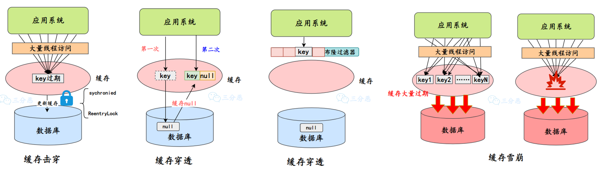
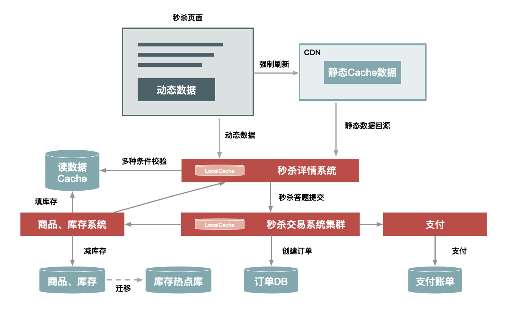
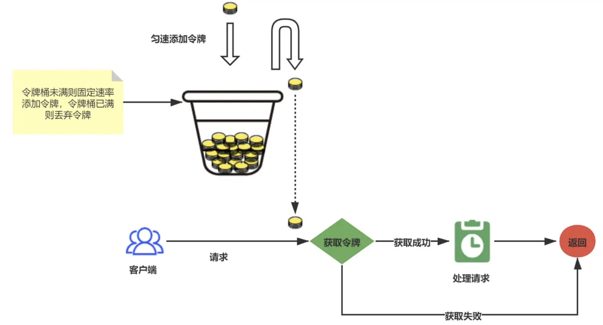
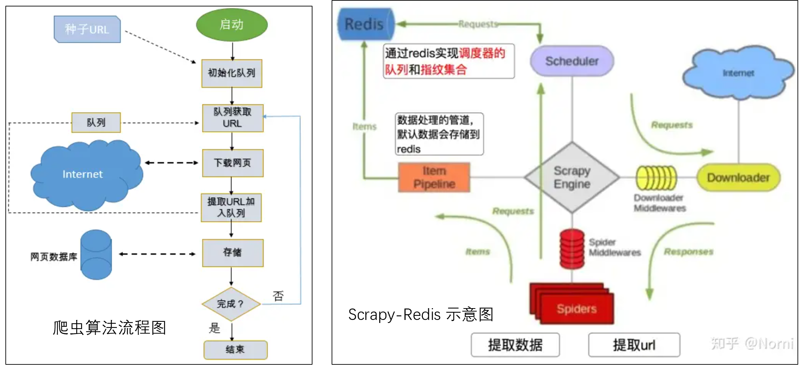

# Redis

Redis：数据存储在内存中的 NoSQL 数据库，读写性能非常好，是互联网技术领域中使用最广泛的缓存中间件。

相比 MySQL：数据存储在硬盘中的关系型数据库，适用于需要事务支持和复杂查询的场景

Redis 最常见的用途就是作为缓存，由于所有数据都存储在内存中，所以 Redis 的读写速度非常快，远超基于磁盘存储的数据库。使用 Redis 缓存可以极大地提高常用数据的响应速度和吞吐量。根据官方的基准测试，一个普通服务器的 Redis 实例通常可以达到每秒数万到几十万的 QPS（Queries Per Second，每秒查询率），每秒能处理超过 10 万次请求

使用了**IO 多路复用**，基于 Linux 的 select/epoll 机制。该机制允许内核中同时存在多个监听套接字和已连接套接字，内核会一直监听这些套接字上的连接请求或者数据请求，一旦有请求到达，就会交给 Redis 处理，就实现了所谓的 Redis 单个线程处理多个 IO 读写的请求。用多线程来处理数据的**读写和协议解析**，但是 Redis**执行命令**还是单线程的。

Redis 有五种基本数据类型，这五种数据类型分别是：string（字符串）、hash（哈希）、list（列表）、set（集合）、sorted set（有序集合，也叫 zset）。

- string：key 是一个字符串，value 可以是： 字符串（简单的字符串、复杂的字符串，例如 JSON、XML） 数字 （整数、浮点数） 甚至是二进制（图片、音频、视频），但最大不能超过 512MB。
- hash：key 是字符串，value 是一个 Map 集合，比如说 `value = {name: '沉默王二', age: 18}`
- list：字符串列表，按照插入顺序排序。可以添加一个元素到列表的头部（左边）或者尾部（右边）。可以实现消息队列、文章列表等
- set：字符串的无序集合，集合中的元素是唯一的，不允许重复。可以实现标签tag等
- Zset，有序集合，比 set 多了一个排序属性 score（分值）。可以实现用户排序等

Redis与本地缓存的比较：

- Redis 可以部署在多个节点上，支持数据分片，适用于跨服务器的缓存共享。而本地缓存只能在单个服务器上使用。Redis 还可以持久化数据，支持数据备份和恢复，适用于对数据安全性要求较高的场景。并且支持发布/订阅、事务、Lua 脚本等高级功能。
- 效率上，Redis 和本地缓存都是存储在内存中，读写速度都非常快。
- 在设计时，应该清楚地区分何时使用一级缓存和何时使用二级缓存。通常情况下，对于频繁访问但不经常更改的数据，可以放在本地缓存中以提供最快的访问速度。而对于需要共享或者一致性要求较高的数据，应当放在一级缓存中

## 持久化

Redis 支持两种主要的持久化方式：RDB（Redis DataBase）持久化和 AOF（Append Only File）持久化。这两种方式可以单独使用，也可以同时使用。

RDB 持久化通过创建数据集的快照（snapshot）来工作，在指定的时间间隔内将 Redis 在某一时刻的数据状态保存到磁盘的一个 RDB 文件中。

RDB 非常适合用于备份数据，比如在夜间进行备份，然后将 RDB 文件复制到远程服务器。如果性能是首要考虑，或者系统需要经常重启，并且希望系统重启后快速恢复，RDB 可能更适合。RDB 的快照生成通常对性能影响较小，并且数据恢复速度快。

- **save 命令**：阻塞所有客户端请求直到 RDB 文件被完全写入磁盘，会导致 Redis 服务器停止响应客户端的请求。
- **bgsave 命令**：会在后台异步地创建 Redis 的数据快照，并将快照保存到磁盘上的 RDB 文件中。这个命令会立即返回，Redis 服务器可以继续处理客户端请求，对服务的可用性影响较小。

AOF 持久化通过记录每个写操作命令并将其追加到 AOF 文件中来工作，恢复时通过重新执行这些命令来重建数据集。最大优点是灵活，实时性好，可以设置不同的 fsync 策略，如每秒同步一次，每次写入命令就同步，或者完全由操作系统来决定何时同步。如果需要尽可能减少数据丢失，AOF 是更好的选择。

在许多生产环境中，同时启用 RDB 和 AOF 被认为是最佳实践：

- 使用 RDB 进行快照备份。
- 使用 AOF 保证崩溃后的最大数据完整性。

当需要恢复数据时，Redis 先加载 RDB 文件来恢复到快照时刻的状态，然后应用 RDB 之后记录的 AOF 命令来恢复之后的数据更改，既快又可靠。

## 高可用

Redis 除了单机部署外，还可以通过主从复制、哨兵模式和集群模式来实现高可用。

**主从复制**（Master-Slave Replication）：允许一个 Redis 服务器（主节点）将数据复制到一个或多个 Redis 服务器（从节点）。这种方式可以实现**读写分离**，**负载均衡**，适合读多写少的场景。此外，如果主节点挂掉了，可以将一个从节点提升为主节点，从而实现故障的快速恢复。使用 psync 命令完成主从数据同步，同步过程分为：全量复制和部分复制。

**哨兵模式**（Sentinel）：用于监控主节点和从节点的状态，实现自动故障转移和系统消息通知。如果主节点发生故障，哨兵可以自动将一个从节点升级为新的主节点，保证系统的可用性。

哨兵的主要功能有：

- **监控（Monitoring）：** 哨兵 Sentinel 会不断检查主节点和从节点是否正常工作。例如每隔 1 秒发送一条 ping 命令做一次心跳检测，来确认这些节点当前是否可达。多个哨兵投票确定某个节点是否真的下线了（主观下线就是哨兵节点认为某个节点有问题，客观下线就是超过一定数量的哨兵节点认为主节点有问题）
- **通知（Notification）：** Sentinel 可以向管理员或其他应用程序发送通知，告知 Redis 实例的状态变化。
- **自动故障转移（Automatic failover）：** 当 Sentinel 检测到主节点不可用时，会自动将一个从节点提升为新的主节点，并让其他从节点开始复制新的主节点。选择优先级最高、复制偏移量最大（复制的最完整）的节点作为新的主节点
- **配置提供者（Configuration provider）：** 客Sentinel 客户端可以从 Sentinel 集群获取当前的主节点地址，以实现动态配置。

**集群模式**（Cluster）：Redis 集群通过分片的方式存储数据，每个节点存储数据的一部分，用户请求可以并行处理。集群模式支持自动分区、故障转移，并且可以在不停机的情况下进行节点增加或删除。

切片集群是一种将数据分片存储在多个 Redis 实例上的集群架构，每个 Redis 实例负责存储部分数据。比如说把 25G 的数据平均分为 5 份，每份 5G，然后启动 5 个 Redis 实例，每个实例保存一份数据。数据和实例之间的映射是通过哈希槽（hash slot）来实现的

Redis 集群提供了灵活的节点扩容和收缩方案，关键点就在于槽和节点的对应关系，扩容和缩容就是将一部分`槽`和`数据`迁移给新节点。缩容也是类似，先把槽和数据迁移到其它节点，再把对应的节点下线。

一些实践：

1. Master 最好不要做任何持久化工作，包括内存快照和 AOF 日志文件，特别是不要启用内存快照做持久化。
2. 如果数据比较关键，某个 Slave 开启 AOF 备份数据，策略为每秒同步一次。
3. 为了主从复制的速度和连接的稳定性，Slave 和 Master 最好在同一个局域网内。
4. 尽量避免在压力较大的主库上增加从库。
5. Master 调用 BGREWRITEAOF 重写 AOF 文件，AOF 在重写的时候会占大量的 CPU 和内存资源，导致服务 load 过高，出现短暂服务暂停现象。
6. 为了 Master 的稳定性，主从复制不要用图状结构，用单向链表结构更稳定，即主从关为：Master<–Slave1<–Slave2<–Slave3…，这样的结构也方便解决单点故障问题，实现 Slave 对 Master 的替换，也即，如果 Master 挂了，可以立马启用 Slave1 做 Master，其他不变。

## 缓存问题

**缓存击穿**是指某一个或少数几个数据被高频访问，当这些数据在缓存中过期的那一刻，大量请求就会直接到达数据库，导致数据库瞬间压力过大。解决⽅案：

- 加锁更新，⽐如请求查询 A，发现缓存中没有，对 A 这个 key 加锁，同时去数据库查询数据，写⼊缓存，再返回给⽤户，这样后⾯的请求就可以从缓存中拿到数据了。
- 将过期时间组合写在 value 中，通过异步的⽅式不断的刷新过期时间

**缓存穿透**是指查询不存在的数据，由于缓存没有命中（因为数据根本就不存在），请求每次都会穿过缓存去查询数据库。如果这种查询非常频繁，就会给数据库造成很大的压力。解决办法：

- 在数据库无法命中之后，把一个空对象或者默认值保存到缓存，之后再访问这个数据，就会从缓存中获取，这样就保护了数据库。并针对这类数据设置一个较短的过期时间，让其自动剔除，并且需要利用消息队列或者其它异步方式清理缓存中的空对象，防止例如过期时间设置为 5 分钟，如果此时存储层添加了这个数据，那此段时间就会出现缓存层和存储层数据的不一致。
- 可以在存储和缓存之前，加一个布隆过滤器，做一层过滤。布隆过滤器里会保存数据是否存在，如果判断数据不存在，就不会访问存储。

> 布隆过滤器（Bloom Filter）用于快速检查一个元素是否存在于一个集合中。占用的内存空间非常小，查询效率也非常高，但是由于存在哈希冲突的问题，可能会导致误判。
>
> 布隆过滤器由一个长度为 m 的位数组和 k 个哈希函数组成。
>
> - 开始时，布隆过滤器的每个位都被设置为 0。
> - 当一个元素被添加到过滤器中时，它会被 k 个哈希函数分别计算得到 k 个位置，然后将位数组中对应的位设置为 1。
> - 当检查一个元素是否存在于过滤器中时，同样使用 k 个哈希函数计算位置，如果任一位置的位为 0，则该元素肯定不在过滤器中；如果所有位置的位都为 1，则该元素可能在过滤器中。
>
> 

**缓存雪崩**是指在某一个时间点，由于大量的缓存数据同时过期或缓存服务器突然宕机了，导致所有的请求都落到了数据库上（比如 MySQL），从而对数据库造成巨大压力，甚至导致数据库崩溃的现象。解决办法可以是**集群部署**：采用分布式缓存而不是单一缓存服务器，可以降低单点故障的风险。即使某个缓存节点发生故障，其他节点仍然可以提供服务，从而避免对数据库的大量直接访问。

还有一些通用方案：

- 对于缓存数据，设置不同的过期时间，避免大量缓存数据同时过期。可以通过在原有过期时间的基础上添加一个随机值来实现，这样可以分散缓存过期时间，减少同一时间对数据库的访问压力。
- 限流和降级通过设置合理的系统限流策略，如令牌桶或漏斗算法，来控制访问流量，防止在缓存失效时数据库被打垮。系统可以实现降级策略，在缓存雪崩或系统压力过大时，暂时关闭一些非核心服务，确保核心服务的正常运行。

## 缓存和数据库的一致性

目前最流行的缓存读写策略 Cache Aside Pattern（旁路缓存模式）就是采用的先写数据库，再删缓存的方式。

> 第一次查询，请求 B 查询到的缓存数据是 10，但 MySQL 被请求 A 更新为了 11，此时数据库和缓存不一致。但也只存在这一次不一致的情况，对于不是强一致性的业务，可以容忍。
>
> 当请求 B 第二次查询时，因为请求 A 更新完数据库把缓存删除了，所以请求 B 这次不会命中缓存，会重新查一次 MySQL，然后回写到 Redis。缓存和数据库又一致了

- 为什么要删除缓存而不是更新缓存？因为相对而言，删除缓存的速度比更新缓存的速度要快得多
- 为什么要先更新数据库，再删除缓存？因为更新数据库的速度比删除缓存的速度要慢得多。如果反过来，缓存中不存在，数据库又没有完成更新，此时有请求进来读取数据，并写入到缓存，那么在更新完缓存后，缓存中这个 key 就成了一个脏数据。

那假如对一致性要求很高，该怎么办呢？主要考虑缓存删除失败的解决方法

- **引入消息队列保证缓存被删除**：使用消息队列（如 Kafka、RabbitMQ）保证数据库更新和缓存更新之间的最终一致性。当数据库更新完成后，将更新事件发送到消息队列。有专门的服务监听这些事件并负责更新或删除缓存。
- **数据库订阅+消息队列保证缓存被删除**：专门起一个服务去监听 MySQL 的 binlog，获取需要操作的数据。然后用一个公共的服务获取订阅程序传来的信息，进行缓存删除。
- **延时双删防止脏数据**：在第一次删除缓存之后，过一段时间之后，再次删除缓存。
- **设置缓存过期时间兜底**：给缓存设置一个合理的过期时间，即使发生了缓存和数据库的数据不一致问题，也不会永远不一致下去，缓存过期后，自然就一致了

## 热 key

热 key，就是指在很短时间内被频繁访问的键。比如，热门新闻（流量明星突然爆出一个大瓜），这类 key 通常会有大流量的访问，对存储这类信息的 Redis 来说，是不小的压力。

Redis 是集群部署，热 key 可能会造成整体流量的不均衡（网络带宽、CPU 和内存资源），个别节点出现 OPS 过大的情况，极端情况下热点 key 甚至会超过 Redis 本身能够承受的 OPS（Operations Per Second，每秒钟能够处理的命令数）

可以通过在客户端设置全局字典（key 和调用次数）或者使用 monitor 命令统计热点 key，只要监控到了热 key，对热 key 的处理就简单了：

- 给热 Key 加上前缀或者后缀，把热 key 打散到不同的服务器，降低压⼒。
- 加⼊⼆级缓存，当出现热 Key 后，把热 Key 加载到 JVM 中，后续针对这些热 Key 的请求，直接从 JVM 中读取。这些本地的缓存工具有很多，比如 Caffeine、Guava 等，或者直接使用 HashMap 作为本地缓存都是可以的。

> 二级缓存与 redis 同步，同样几个思路：消息队列、订阅、过期时间

## 内存问题

Redis 内存不足有这么几种处理方式：

- 修改配置文件设置内存上限
- 修改内存淘汰策略，及时释放内存空间
- 使用 Redis 集群模式，进行横向扩容

Redis 支持为键设置过期时间，当键的过期时间到达后，Redis 会自动删除这些键。过期回收策略主要有两种：惰性删除和定期删除。

- 惰性删除： 当某个键被访问时，如果发现它已经过期，Redis 会立即删除该键。这意味着如果一个已过期的键从未被访问，它不会被自动删除，可能会占用额外的内存。 
- 定期删除：定期随机测试一些键，并删除其中已过期的键。这个过程是 Redis 内部自动执行的，旨在减少过期键对内存的占用

当 Redis 内存使用达到设置的最大值时（通过 maxmemory 参数设置），它会根据配置的内存淘汰策略来决定如何处理新的写请求。提供了以下几种淘汰策略：

- 默认策略不进行任何数据淘汰，直接返回错误信息。适用于不能丢失数据的场景
- 使用 LRU 算法淘汰最不常用的键
- 从设置了过期时间的键中淘汰即将过期（TTL，Time To Live，存活时间）的键

## 阻塞问题

单线程的 Redis 处理命令时只能使用一个 CPU。而 **CPU 饱和**是指 Redis 单核 CPU 使用率跑到接近 100%。如果 Redis 的请求几万+，那么大概就是 Redis 的 OPS 已经到了极限，应该做集群化水品扩展来分摊 OPS 压力。如果只有几百几千，那么就得排查命令和内存的使用

通常 Redis 执行命令速度非常快，但是不合理地使用命令，可能会导致执行速度很慢，导致阻塞，通过slowlog get{n}命令可以获取最近 的 n 条慢查询命令，对于高并发的场景，应该尽量避免在**大对象**上执行算法**复杂度**超过 O（n）的命令。

> 关于大对象与大key：大 key 指的是存储了大量数据的键，比如：
>
> - 单个简单的 key 存储的 value 很大，size 超过 10KB
> - hash，set，zset，list 中存储过多的元素（以万为单位）
>
> 我们可以**删除**大key或者**压缩和拆分** key，关于拆分，可以将一个大 key 分为不同的部分，记录每个部分的 key，使用 multiget 等操作实现事务读取。当 value 是 list/set 等集合类型时，根据预估的数据规模来进行分片，不同的元素计算后分到不同的片。

对于开启了持久化功能的 Redis 节点，需要排查是否是持久化导致的阻塞

## 事务

Redis 支持简单的事务，可以将多个命令打包，然后一次性的，按照顺序执行。

主要通过 multi、exec、discard、watch 等命令来实现：

- multi：标记一个事务块的开始。从这个命令执行之后开始，所有的后续命令都不会立即执行，而是被放入一个队列中。在这个阶段，Redis 只是记录下了这些命令。
- exec：执行所有事务块内的命令。之前 MULTI 后队列中的所有命令会被原子地（atomic）执行。这里的“原子”意味着这些命令要么全部执行，要么（在出现错误时）全部不执行。
- discard：取消事务，清空事务队列并退出事务状态。
- watch：监视一个或多个 key，如果在事务执行之前这个 key 被其他命令所改动，那么事务将被打断

注意，Redis 事务是不支持回滚的。一旦 EXEC 命令被调用，所有命令都会被执行，即使有些命令可能执行失败。失败的命令不会影响到其他命令的执行。不支持回滚的原因是违背了Redis 的设计理念：一个基于内存的高性能的数据存储系统，引入事务回滚机制会大大增加 Redis 的复杂性。平时的开发中，可以利用 Lua 脚本来增强 Redis 的命令

## 实例：在秒杀系统中的应用

秒杀主要是指大量用户集中在短时间内对服务器进行访问，从而导致服务器负载剧增，可能出现系统响应缓慢甚至崩溃的情况

解决这一问题的关键就在于**错峰削峰**和**限流**。当然了，前端页面的静态化、按钮防抖也能够有效的减轻服务器的压力

在秒杀场景下，可以通过以下几种方式实现错峰削峰：

- **预热缓存**：提前将热点数据加载到 Redis 缓存中，减少对数据库的访问压力。
- **消息队列**：引入消息队列，将请求异步处理，减少瞬时请求压力。消息队列就像一个水库，可以削减上游的洪峰流量。
- **多阶段多时间窗口**：将秒杀活动分为多个阶段，每个阶段设置不同的时间窗口，让用户在不同的时间段内参与秒杀活动。
- **插入答题系统**：在秒杀活动中加入答题环节，只有答对题目的用户才能参与秒杀活动，这样可以减少无效请求。

如何限流呢？在实际开发中，我们需要维护一个容器，按照固定的速率往容器中放令牌（token），当请求到来时，从容器中取出一个令牌，如果容器中没有令牌，则拒绝请求。

## 实例：在爬虫框架中的应用

从功能上来讲，爬虫一般分为数据采集，处理，储存三个部分。传统爬虫从一个或若干初始网页的URL开始，获得初始网页上的URL，在抓取网页的过程中，不断从当前页面上抽取新的URL放入队列,直到满足系统的一定停止条件。

Scrapy 是一个通用的爬虫框架，但是不支持分布式。Scrapy-Redis改变了scrapy的队列调度，将起始的网址从start_urls里分离出来，改为从redis读取，多个客户端可以同时读取同一个redis，从而实现了分布式的爬虫。

在Scrapy的队列的实现中，多个spider不能共享待爬取队列。scrapy-redis 的解决是把这个Scrapy queue换成redis数据库（也是指redis队列），从同一个redis-server存放要爬取的request，便能让多个spider去同一个数据库里读取。具体实现上重写了scheduler和spider类，实现了调度、spider启动和redis的交互

Scrapy中用集合实现request去重功能，在scrapy-redis中去重是由Duplication Filter组件来实现的，它通过redis的set不重复的特性，巧妙的实现了DuplicationFilter去重。

总体过程是，每当一个spider产出一个request的时候，scrapy引擎会把这个reuqest递交给这个spider对应的scheduler对象进行调度，scheduler对象通过访问redis对request进行判重，如果不重复就把他添加进redis中的调度器队列里。当调度条件满足时，scheduler对象就从redis的调度器队列中取出一个request发送给spider，让他爬取；

当spider爬取的所有暂时可用url之后，scheduler发现这个spider对应的redis的调度器队列空了，于是触发信号spider_idle，spider收到这个信号之后，直接连接redis读取strart_url池，拿去新的一批url入口，然后再次重复上边的工作。
