# Docker

> 学习途径：
>
> - 狂神 Docker
> - Docker官网：http://www.docker.com 
> - Docker中文网站：https://docker.p2hp.com/
> - Docker Hub官网：https://hub.docker.com （仓库）（需要上网）

## Docker为什么出现

一款产品从开发到上线，从操作系统，到运行环境，再到应用配置。作为开发+运维之间的协作我们需要 关心很多东西，这也是很多互联网公司都不得不面对的问题，特别是各种版本的迭代之后，不同版本环 境的兼容，对运维人员是极大的考验！ 

环境配置如此麻烦，换一台机器，就要重来一次，费力费时。很多人想到，能不能从根本上解决问题， 软件可以带环境安装？也就是说，安装的时候，把原始环境一模一样地复制过来。解决开发人员说的“ 在 我的机器上可正常工作”的问题。 

> 之前在服务器配置一个应用的运行环境，要安装各种软件，就拿一个基本的工程项目的环境来说吧， Java/Tomcat/MySQL/JDBC驱动包等。安装和配置这些东西有多麻烦就不说了，它还不能跨平台。假如 我们是在 Windows 上安装的这些环境，到了 Linux 又得重新装。况且就算不跨操作系统，换另一台同 样操作系统的服务器，要移植应用也是非常麻烦的。 

传统上认为，软件编码开发/测试结束后，所产出的成果即是程序或是能够编译执行的二进制字节码文件 等（Java为例）。而为了让这些程序可以顺利执行，开发需要告诉运维部署团队全部配置文件+所有软件环境。即便如此，仍然常常发生部署失败的状况。 

Docker之所以发展如此迅速，也是因为它对此给出了一个标准化的解决方案。 

Docker镜像的设计，使得Docker得以打破过去「程序即应用」的观念。通过Docker镜像 ( images ) 将 应用程序所需要的系统环境，由下而上打包，达到应用程序跨平台间的无缝接轨运作。

Docker的思想来自于集装箱，集装箱解决了什么问题？在一艘大船上，可以把货物规整的摆放起来。并 且各种各样的货物被集装箱标准化了，集装箱和集装箱之间不会互相影响。那么我就不需要专门运送水 果的船和专门运送化学品的船了。只要这些货物在集装箱里封装的好好的，那我就可以用一艘大船把他 们都运走。 

## 历史

在容器技术之前，业界的网红是虚拟机。虚拟机技术的代表，是VMWare和OpenStack。 虚拟机（virtual machine）可以看作带环境安装的一种解决方案。 虚拟机虽然可以隔离出很多“子电脑”，但占用空间更大，冗余步骤多，启动更慢

而Docker这样的容器技术，属于轻量级的虚拟化。  它不需要虚拟出整个操作系统，利用的是宿主机的内核，再虚拟一个小规模的环境（类似“沙箱”），抽象层更少，也没有进行硬件虚拟。 

因此**启动时间很快**，几秒钟就能完成。而且，它对**资源的利用率很高**（一台主机可以同时运行几千个 Docker容器）。此外，它**占的空间很小**，虚拟机一般要几GB到几十GB的空间，而容器只需要MB级甚至 KB级。 每个容器之间互相隔离，每个容器有自己的文件系统 ，容器之间进程**不会相互影响**，能区分计算资源。

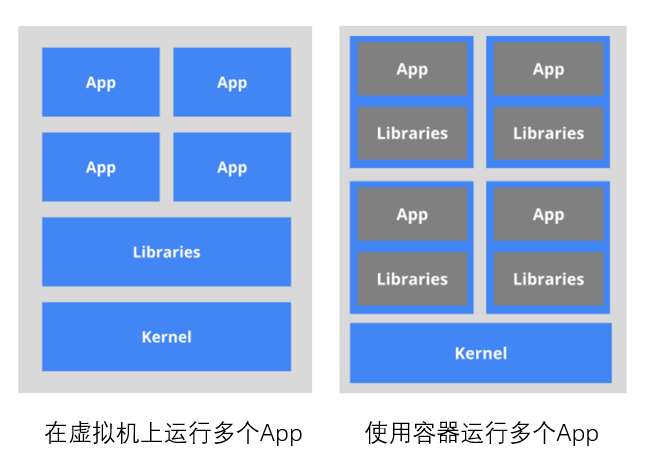

## 理念

Docker是基于Go语言实现的云开源项目。 

Docker的主要目标是“Build，Ship and Run Any App , Anywhere”，也就是通过对应用组件的封装、分发、部署、运行等生命周期的管理，使用户的APP（可以是一个WEB应用或数据库应用等等）及其运行环境能够做到“一次封装，到处运行”。 

Linux 容器技术的出现就解决了这样一个问题，而 Docker 就是在它的基础上发展过来的。将应用运行在 Docker 容器上面，而 Docker 容器在任何操作系统上都是一致的，这就实现了跨平台、跨服务器。只需 要一次配置好环境，换到别的机子上就可以一键部署好，大大简化了操作。

## 基础概念

Docker 本身是一个容器运行载体，或称之为管理引擎。我们把应用程序和配置依赖打包好形成一个可交付的运行环境，这个打包好的运行环境就称为 image 镜像文件。image 文件可以看作是容器的模板。Docker 根据 image 文件生成容器的实例。 同一个 image 文件，可以生成多个同时运行的容器实例。

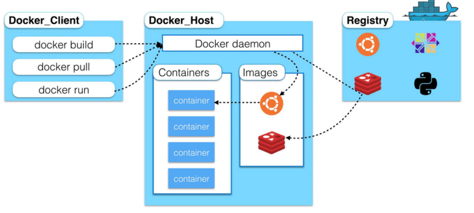

- 镜像（image）：是一个只读的模板。镜像可以用来创建 Docker 容器，一个镜像可以创建很多容器。 就好似 Java 中的 类和对象，类就是镜像，容器就是对象！
- 容器（container）：独立运行的一个或一组应用。容器是用镜像创建的运行实例。 它可以被启动、开始、停止、删除。每个容器都是相互隔离的，保证安全的平台。 可以把容器看做是一个简易版的 Linux 环境（包括root用户权限、进程空间、用户空间和网络空间等） 和运行在其中的应用程序。 容器的定义和镜像几乎一模一样，也是一堆层的统一视角，唯一区别在于容器的最上面那一层是可读可写 的。
- 仓库（repository）：是集中存放镜像文件的场所。 
- 仓库注册服务器（Registry）是用于存储和分享Docker镜像的中央存储库。Docker Hub是官方的公共 Registry ，还有其他私有 Registry 可供使用。Registry 往往存放着多个仓库，每个仓库中又包含了多个镜像，每个镜像有不同的标签（tag）。 仓库分为公开仓库（Public）和私有仓库（Private）两种形式。 最大的公开仓库是 [Docker Hub](https://hub.docker.com/)，存放了数量庞大的镜像供用户下载。 国内的公开仓库包括阿里云 、网易云等。

Docker是一个Client-Server结构的系统，Docker守护进程运行在主机上。 客户端通过Socket连接访问，守护进程从客户端接受命令并管理运行在主机上的容器。

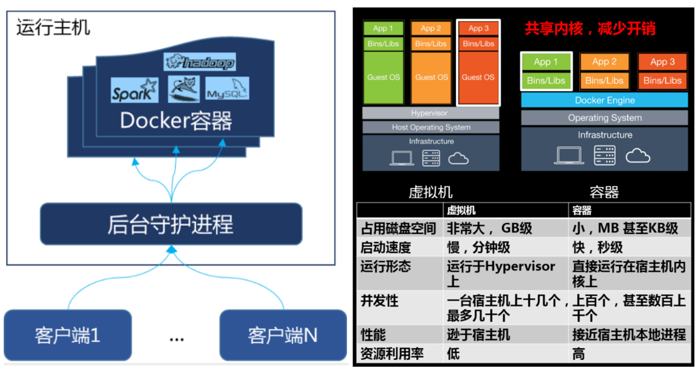

> - 官网安装参考手册：https://docs.docker.com/engine/install/centos/
> - 1Panel面板：https://1panel.cn/
> - 安装宝塔：https://www.bt.cn/new/download.html，记得记下面板地址

## Docker常用命令

### 镜像命令

```shell
docker images  # 列出本地主机上的镜像
docker search mysql  # 搜索镜像
docker pull mysql:5.7  # 下载镜像，分层下载，共用的层不会重复下载，课指定版本
docker rmi -f 镜像id  # 删除镜像
```

### 容器命令

```shell
docker run [OPTIONS] IMAGE [COMMAND][ARG...]  # 新建容器并启动
--name="Name" # 给容器指定一个名字
-d # 后台方式运行容器，并返回容器的id！
-i # 以交互模式运行容器，通过和 -t 一起使用
-t # 给容器重新分配一个终端，通常和 -i 一起使用
-P # 随机端口映射（大写）
-p # 指定端口映射（小结），一般可以有四种写法
# ip:hostPort:containerPort
# ip::containerPort
# hostPort:containerPort (常用)
# containerPort
# 例子：docker run -it centos /bin/bash

docker ps [OPTIONS]  # 列出所有运行的容器
-a # 列出当前所有正在运行的容器 + 历史运行过的容器
-l # 显示最近创建的容器
-n=? # 显示最近n个创建的容器
-q # 静默模式，只显示容器编号。

exit # 容器停止退出
ctrl+P+Q # 容器不停止退出

docker start (容器id or 容器名) # 启动容器
docker restart (容器id or 容器名) # 重启容器
docker stop (容器id or 容器名) # 停止容器
docker kill (容器id or 容器名) # 强制停止容器

docker rm 容器id # 删除指定容器，不能删除正在运行的容器，强制删除使用rm -f

docker logs 容器id  # 查看日志
docker top 容器id  # 查看容器中运行的进程信息，支持 ps 命令参数
docker inspect 容器id  # 查看容器/镜像的元数据
docker exec -it 容器id bashShell  # 进入正在运行的容器
docker attach 容器id # 进入正在运行的容器
# exec 是在容器中打开新的终端，并且可以启动新的进程
# attach 直接进入容器启动命令的终端，不会启动新的进程
docker cp 容器id:容器内路径 目的主机路径  # 从容器内拷贝文件到主机上
# 拷贝文件不需要容器正在运行，只要容器存在(docker ps -a)，数据就在。
docker stats  # 查看容器使用资源情况
```

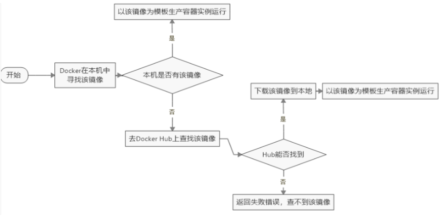

> `docker run -d centos` 这条命令看似后台方式启动centos，使用启动，但是使用docker ps 查看，发现容器已经退出了！
>
> 解释：Docker容器后台运行，就必须有一个前台进程，容器运行的命令如果不是那些一直挂起的命令，就会自动退出。比如，运行了nginx服务，但是docker前台没有运行应用，这种情况下，容器启动后，会立即自杀，因为他觉得没有程序了，所以最好的情况是，将你的应用使用前台进程的方式运行启动。

### 命令小结

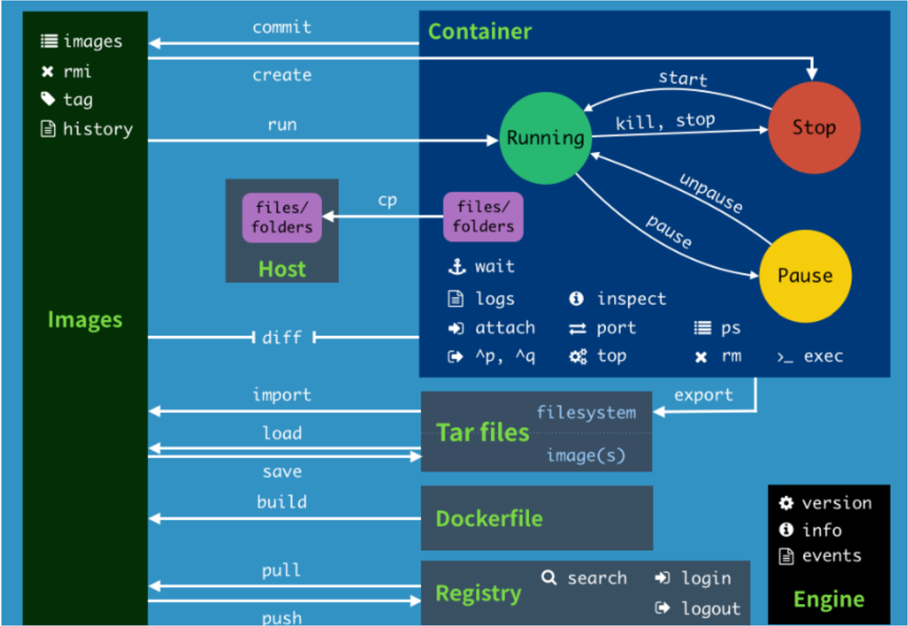

帮助命令：

```shell
docker version # 显示 Docker 版本信息。
docker info # 显示 Docker 系统信息，包括镜像和容器数。
docker --help # 帮助。
```

以及查看 [官方文档](https://docs.docker.com/)

## 实战一：安装 nginx

```shell
docker pull nginx
docker images
docker run -d --name mynginx -p 3344:80 nginx
docker ps
docker exec -it mynginx /bin/bash  # 进入容器

root@5670aedd14d1:/# whereis nginx
nginx: /usr/sbin/nginx /usr/lib/nginx /etc/nginx /usr/share/nginx
root@5670aedd14d1:/# cd /usr/share/nginx
root@5670aedd14d1:/usr/share/nginx# cd html
```

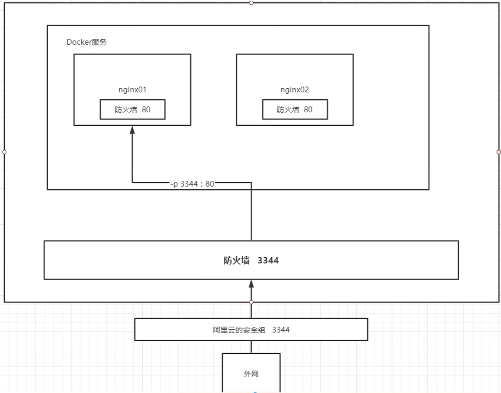

> 我们以后要部署项目，还需要进入容器中，是不是十分麻烦，要是有一种技术，可以将容器内和我们Linux进行映射挂载就好了？我们后面会将数据卷技术来进行挂载操作，也是一个核心内容，这里大家先听听名词就好，我们很快就会讲到！

## 实战二：部署 es + kibana

```shell
docker run -d --name elasticsearch -p 9200:9200 -p 9300:9300 -e "discovery.type=single-node" elasticsearch:7.6.2

[root@iZ2ze00vcimgcvad75oebdZ ~]# curl localhost:9200
{
  "name" : "a2d2e1d9953d",
  "cluster_name" : "docker-cluster",
  "cluster_uuid" : "YEDaLfhSSOeWo8axRo4BSg",
  ....
  
# 思考：如果我们要使用 kibana , 如果配置连接上我们的es呢？网络该如何配置呢？
```

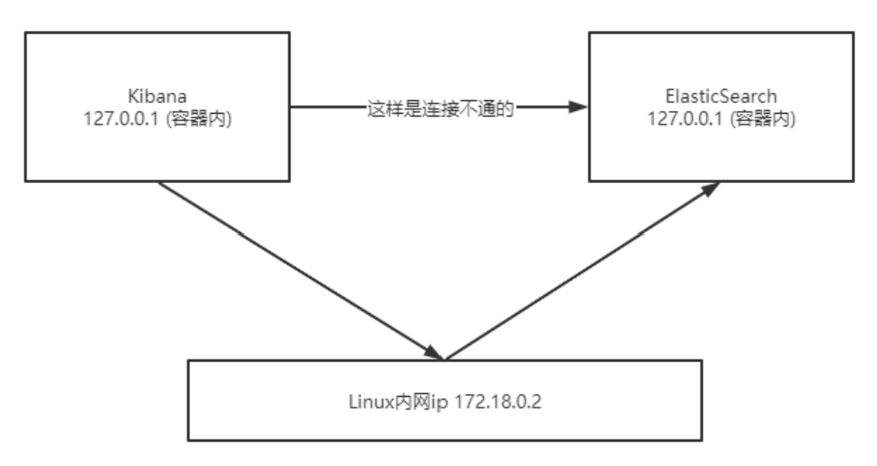

## 镜像原理

镜像是一种轻量级、可执行的独立软件包，用来打包软件运行环境和基于运行环境开发的软件，它包含 运行某个软件所需的所有内容，包括代码、运行时、库、环境变量和配置文件。

得到镜像方式：

- 从远程仓库下载
- 朋友拷贝给你
- 自己制作一个镜像 DockerFile

### UnionFS（联合文件系统）

docker的镜像实际上由一层一层的文件系统组成，这种层级的文件系统是UnionFS。 Union文件系统（UnionFS）是一种分层、轻量级并且高性能的文件系统， 它支持对文件系统的修改作为一次提交来一层层的叠加，同时可以将不同目录挂载到同一个虚拟文件系 统下(unite several directories into a single virtual filesystem)。

特性：一次同时加载多个文件系统，但从外面看起来，只能看到一个文件系统，联合加载会把各层文件 系统叠加起来，这样最终的文件系统会包含所有底层的文件和目录。

> 如果nigix和tomcat都需要centos内核，在已经下载了nigix镜像后，tomcat不需要重新下载centos内核，直接拿过来用就可以。

- bootfs(boot file system)主要包含bootloader和kernel, bootloader主要是引导加载kernel, Linux刚启 动时会加载bootfs文件系统，在Docker镜像的最底层是bootfs。这一层与我们典型的Linux/Unix系统是 一样的，包含boot加载器和内核。当boot加载完成之后整个内核就都在内存中了，此时内存的使用权已由bootfs转交给内核，此时系统也会卸载bootfs。 
- rootfs (root file system) ，在bootfs之上。包含的就是典型 Linux 系统中的 /dev, /proc, /bin, /etc 等标 准目录和文件。rootfs就是各种不同的操作系统发行版，比如Ubuntu，Centos等等。

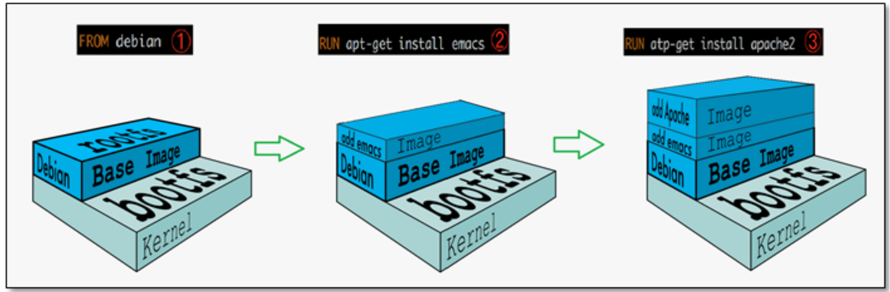

> 平时我们安装进虚拟机的CentOS都是好几个G，为什么Docker这里才200M？
>
> 对于一个精简的OS，rootfs 可以很小，只需要包含最基本的命令，工具和程序库就可以了，因为底层直接用Host的kernel，自己只需要提供rootfs就可以了。由此可见对于不同的linux发行版, bootfs基本是一 致的, rootfs会有差别, 因此不同的发行版可以公用bootfs。

### 分层理解

我们可以去下载一个镜像，注意观察下载的日志输出，可以看到是一层一层的在下载！

最大的好处，我觉得莫过于是资源共享了！比如有多个镜像都从相同的Base镜像构建而来，那么宿主机 只需在磁盘上保留一份base镜像，同时内存中也只需要加载一份base镜像，这样就可以为所有的容器服务了，而且镜像的每一层都可以被共享。 

查看镜像分层的方式可以通过 docker image inspect 命令！

```shell
[root@iZ2ze00vcimgcvad75oebdZ ~]# docker image inspect tomcat
....
"Layers": [
"sha256:11936051f93baf5a4fb090a8fa0999309b8173556f7826598e235e8a82127bce",
"sha256:31892cc314cb1993ba1b8eb5f3002c4e9f099a9237af0d03d1893c6fcc559aab",
"sha256:8bf42db0de72f74f4ef0c1d1743f5d54efc3491ee38f4af6d914a6032148b78e",
"sha256:26a504e63be4c63395f216d70b1b8af52263a5289908df8e96a0e7c840813adc",
"sha256:f9e18e59a5651609a1503ac17dcfc05856b5bea21e41595828471f02ad56a225",
"sha256:832e177bb5008934e2f5ed723247c04e1dd220d59a90ce32000b7c22bd9d9b54",
]
....
```

**理解：**

所有的 Docker 镜像都起始于一个基础镜像层，当进行修改或增加新的内容时，就会在当前镜像层之上，创建新的镜像层。 

> 举一个简单的例子，假如基于 Ubuntu Linux 16.04 创建一个新的镜像，这就是新镜像的第一层；如果 在该镜像中添加 Python包，就会在基础镜像层之上创建第二个镜像层；如果继续添加一个安全补丁，就会创建第三个镜像层。 

在添加额外的镜像层的同时，镜像始终保持是当前所有镜像的组合。理解这一点非常重要。下图中举了 一个简单的例子，每个镜像层包含 3 个文件，而镜像包含了来自两个镜像层的 6 个文件。

当加入最上层中的文件 7 （是文件 5 的一个更新版本），在外部看来整个镜像只有 6 个文件，是因为这种情况下，上层镜像层中的文件覆盖了底层镜像层中的文件。这样就使得文件的更新版本作为一个新镜像层添加到镜像当中。 

Docker 通过存储引擎（新版本采用快照机制）的方式来实现镜像层堆栈，并保证多镜像层对外展示为统 一的文件系统。 所有镜像层堆叠并合并，对外提供统一的视图。

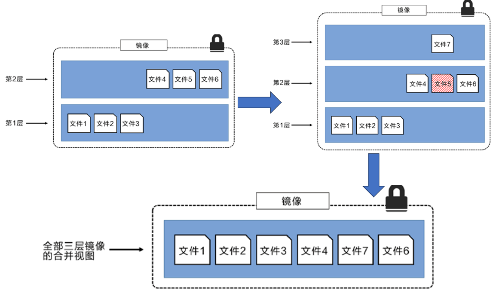

> Linux 上可用的存储引擎有 AUFS、Overlay2、Device Mapper、Btrfs 以及 ZFS。顾名思义，每种存储 引擎都基于 Linux 中对应的文件系统或者块设备技术，并且每种存储引擎都有其独有的性能特点。
>
> Docker 在 Windows 上仅支持 windowsfilter 一种存储引擎，该引擎基于 NTFS 文件系统之上实现了分 层和 CoW。  

Docker镜像都是只读的，当容器启动时，一个新的可写层被加载到镜像的顶部。这一层就是我们通常说的容器层，容器之下的都叫镜像层。

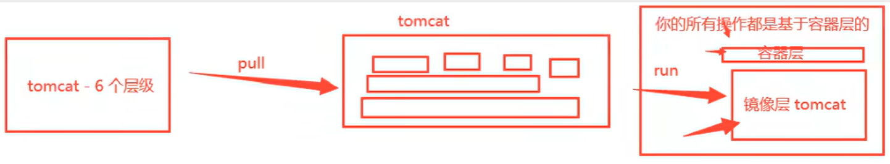

### 镜像Commit

提交容器副本使之成为一个新的镜像！

```shell
# 语法
docker commit -m="提交的描述信息" -a="作者" 容器id 要创建的目标镜像名:[标签名]

# 测试，将我们刚才修改过的tomcat提交上去
[root@iZ2ze00vcimgcvad75oebdZ ~]# docker commit -a="QMMMS" -m="mod" 4099ffdcde29 mstomcat:1.0
sha256:398467cf1e032af6933b19a2a2b5cd6fb68b6d57dcb42ba18836830f20f9f121
[root@iZ2ze00vcimgcvad75oebdZ ~]# docker images
REPOSITORY            TAG       IMAGE ID       CREATED          SIZE
mstomcat              1.0       398467cf1e03   12 seconds ago   684MB
tomcat                latest    fb5657adc892   21 months ago    680MB

# 如果你想要保存你当前的状态，可以通过commit，来提交镜像，方便使用，类似于 VM 中的快照！
```

## 容器数据卷

将应用和运行的环境打包形成容器运行，运行可以伴随着容器，但是我们对于数据的要求，是希望能够持久化的。

> 就好比，你安装一个MySQL，结果你把容器删了，就相当于删库跑路了，这TM也太扯了吧！ 

为了能保存数据在Docker中我们就可以使用卷让数据挂载到我们本地。这样数据就不会因为容器删除 而丢失了。

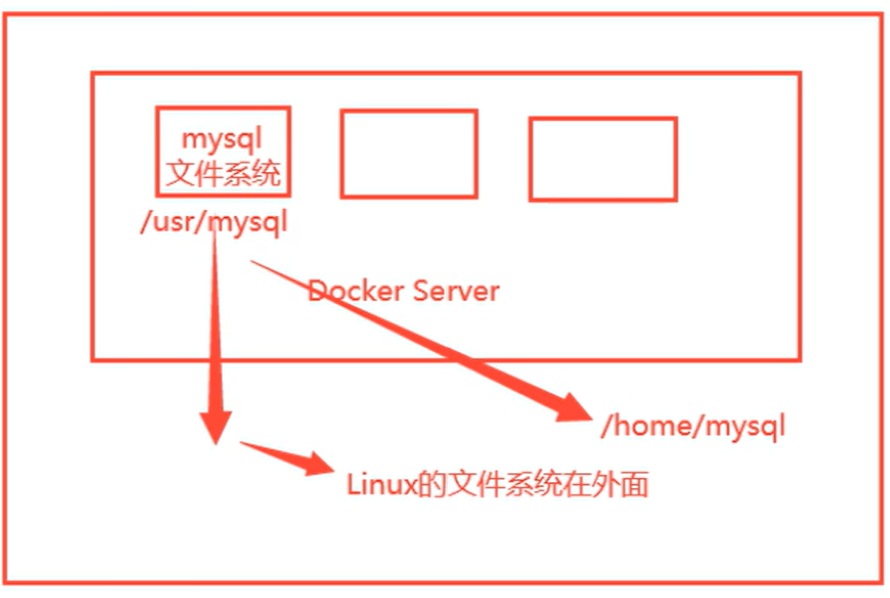

卷就是目录或者文件，存在一个或者多个容器中，由docker挂载到容器，但不属于联合文件系统，因此 能够绕过 Union File System ， 提供一些用于持续存储或共享数据的特性。卷的设计目的就是数据的持久化，完全独立于容器的生存周期，因此Docker不会在容器删除时删除其挂载的数据卷。

- 数据卷可在容器之间共享或重用数据 
- 卷中的更改可以直接生效 
- 数据卷中的更改不会包含在镜像的更新中 
- 数据卷的生命周期一直持续到没有容器使用它为止 

命令：

```shell
# 容器中直接使用命令来添加挂载
docker run -it -v 宿主机绝对路径目录:容器内目录 镜像名
# 例如 docker run -it -v /home/ceshi:/home centos /bin/bash
# 查看数据卷是否挂载成功 docker inspect 容器id

# 使用卷名挂载，-v 卷名:/容器内路径
docker run -d -P --name nginx02 -v nginxconfig:/etc/nginx nginx
# 查看挂载的路径 docker volume inspect nginxconfig
# 例子：docker run -d -p 3310:3306 -v /home/mysql/conf:/etc/mysql/conf.d -v /home/mysql/data:/var/lib/mysql -e MYSQL_ROOT_PASSWORD=123456 --name mysql01 mysql:5.7
```

> 怎么判断挂载的是卷名而不是本机目录名？不是/开始就是卷名，是/开始就是目录名

命名的容器挂载数据卷，其他容器通过挂载这个（父容器）实现数据共享，挂载数据卷的容器，称之为 数据卷容器。

> Docker数据卷是直接映射到宿主机文件系统的目录，而数据卷容器是一个专门用于管理数据卷的容器。

```shell
# 已创建docker01拥有挂载数据卷，创建docker02继承docker01，数据卷共享
docker run -it --name docker02 --volumes-from docker01 kuangshen/centos
```

容器之间配置信息的传递，数据卷的生命周期一直持续到没有容器使用它为止。 存储在本机的文件则会一直保留！

## DockerFile

如何将已经存在的应用程序容器化？可以创建一个Dockerfile，并在其中定义容器所需的操作系统、依赖项和配置。然后，使用Docker构建工具构建镜像，并将应用程序运行在容器中。

流程：开发应用=>DockerFile=>打包为镜像=>上传到仓库（私有仓库，公有仓库）=> 下载镜像 => 启动 运行。 

### 什么是DockerFile

dockerfile是用来构建Docker镜像的构建文件，是由一系列命令和参数构成的脚本。例如，centos的Dockerfile：

```dockerfile
FROM scratch
ADD centos-7-x86_64-docker.tar.xz /

LABEL \
    org.label-schema.schema-version="1.0" \
    org.label-schema.name="CentOS Base Image" \
    org.label-schema.vendor="CentOS" \
    org.label-schema.license="GPLv2" \
    org.label-schema.build-date="20201113" \
    org.opencontainers.image.title="CentOS Base Image" \
    org.opencontainers.image.vendor="CentOS" \
    org.opencontainers.image.licenses="GPL-2.0-only" \
    org.opencontainers.image.created="2020-11-13 00:00:00+00:00"

CMD ["/bin/bash"]
```

从应用软件的角度来看，DockerFile，docker镜像与docker容器分别代表软件的三个不同阶段。 

- DockerFile 是软件的原材料 （代码） 
- Docker 镜像则是软件的交付品 （.apk） 
- Docker 容器则是软件的运行状态 （客户下载安装执行） 

DockerFile 面向开发，Docker镜像成为交付标准，Docker容器则涉及部署与运维，三者缺一不可！

**DockerFile语法**：

- 每条保留字指令都必须为大写字母且后面要跟随至少一个参数 
- 每条指令都会创建一个新的镜像层，并对镜像进行提交

**流程：** 

1. docker从基础镜像运行一个容器 
2. 执行一条指令并对容器做出修改 
3. 执行类似 docker commit 的操作提交一个新的镜像层 
4. Docker再基于刚提交的镜像运行一个新容器 
5. 执行dockerfile中的下一条指令直到所有指令都执行完成！

**关键字**：

```python
FROM # 基础镜像，当前新镜像是基于哪个镜像的，重要
MAINTAINER # 镜像维护者的姓名混合邮箱地址
RUN # 容器构建时需要运行的命令，重要
EXPOSE # 当前容器对外保留出的端口，重要
WORKDIR # 指定在创建容器后，终端默认登录的进来工作目录，一个落脚点
ENV # 用来在构建镜像过程中设置环境变量
ADD # 将宿主机目录下的文件拷贝进镜像且ADD命令会自动处理URL和解压tar压缩包
COPY # 类似ADD，拷贝文件和目录到镜像中！
VOLUME # 容器数据卷，用于数据保存和持久化工作
CMD # 指定一个容器启动时要运行的命令，dockerFile中可以有多个CMD指令，但只有最后一个生效！
ENTRYPOINT # 指定一个容器启动时要运行的命令！和CMD一样
ONBUILD # 当构建一个被继承的DockerFile时运行命令，父镜像在被子镜像继承后，父镜像的
ONBUILD被触发
```

### 实战：自定义centos

官方默认的CentOS没有vim编辑器、和ifconfig支持。我们希望自己的镜像具备如下：登陆后的默认路径、vim编辑器、查看网络配置ifconfig支持

创建文件 `mydockerfile-centos`

```
FROM centos
MAINTAINER qmmms<1@qq.com>

ENV MYPATH /usr/local
WORKDIR $MYPATH
RUN yum -y install vim
RUN yum -y install net-tools

EXPOSE 80
CMD echo $MYPATH
CMD echo "----------end--------"
CMD /bin/bash
```

构建命令：

```bash
# docker build -f dockerfile地址 -t 新镜像名字:TAG .
docker build -f mydockerfile-centos -t mycentos:0.1 .
# docker build 命令最后有一个.表示当前目录
```

运行命令：

```shell
# docker run -it 新镜像名字:TAG
docker run -it mycentos:0.1
```

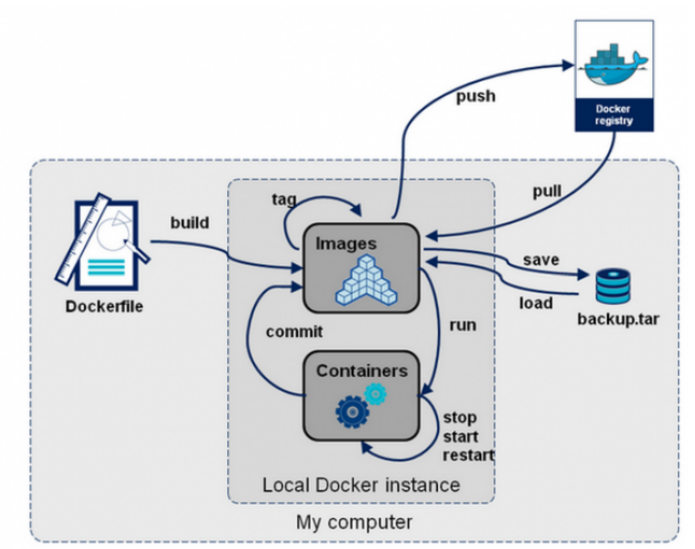

## Docker 网络

在没有运行任何容器之前，宿主机有三个网络：

```bash
lo 127.0.0.1 # 本机回环地址
eth0 172.17.90.138 # 阿里云的私有IP
docker0 172.17.0.1 # docker网桥
```

每一个安装了Docker的linux主机都有一个docker0的虚拟网卡。这是个桥接网卡，使用了veth-pair 技术。veth-pair 就是一对的虚拟设备接口，它都是成对出现的。一端连宿主，一端连容器。 正因为有这个特性，它常常充当着一个桥梁，连接着各种虚拟网络设备

每启动一个容器，linux主机就会多了一个虚拟网卡。

```bash
123: vethc8584ea@if122: <BROADCAST,MULTICAST,UP,LOWER_UP> mtu 1500 qdisc
noqueue master docker0 state UP group default
	link/ether 0a:4b:bb:40:78:a7 brd ff:ff:ff:ff:ff:ff link-netnsid 0
```

这个编号123的网卡出现在宿主机中，而当我们在容器中查看网络连接时，会有一个编号为122的网卡，这两个相连。


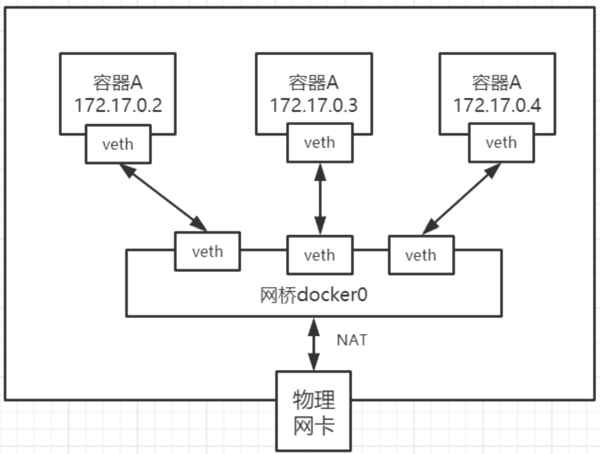

Docker中的网络接口默认都是虚拟的接口。虚拟接口的优势就是转发效率极高（因为Linux是在内核中 进行数据的复制来实现虚拟接口之间的数据转发，无需通过外部的网络设备交换），对于本地系统和容 器系统来说，虚拟接口跟一个正常的以太网卡相比并没有区别，只是他的速度快很多。

以上是默认的bridge网络，此外还有其他类型的网络：

| 网络模式       | 配置                     | 说明                                                         |
| -------------- | ------------------------ | ------------------------------------------------------------ |
| bridge模式     | --net=bridge             | 默认值。容器IP独立。从docker0子网中分配一个ip给容器使用，并设置docker0的ip地址为容器的默认网关。每个容器的ip地址不固定，根据容器启动的顺序一次递增 |
| none模式       | --net=none               | 此模式下docker容器有自己的network namespace，但是并不为docker容器进行任何网络配置，只有lo回环网络，没有其他网卡，此模式拥有所有的端口。封闭的网络能很好的保证容器的安全性。用户可以稍后进入容器，自行配置 |
| container 模式 | -- net=container:name/id | 容器和另外一个容器共享Network namespace。 kubernetes中的pod就是多个容器共享一个Network namespace。 |
| host模式       | --net=host               | 容器将不会虚拟出自己的网卡，配置自己的IP，而是使用宿主机的IP和端口，此时在run容器时，容器暴露出哪个端口，就需要访问宿主机哪个端口进行访问，如果多个容器端口出现冲突，则端口号递增 |
| 用户自定义     | --net=自定义网络         | 用户自己使用network相关命令定义网络，创建容器的 时候可以指定为自己定义的网络 |

```bash
docker run -d -P --name tomcat01 --net bridge tomcat

# 创建网络 
docker network create --driver bridge --subnet 192.168.0.0/16 --gateway 192.168.0.1 mynet

docker run -d -P --name tomcat-net-01 --net mynet tomcat

# 如果要跨bridge网络连接，就需要使用 docker network connect [OPTIONS] NETWORK CONTAINER 连接，下面的例子中，tomcat01拥有了双ip
docker network connect mynet tomcat01
```

查看所有网络：`docker network ls`

查看一个具体的网络的详细信息：`docker network inspect <NETWORK ID>`

> 扩展阅读：[Docker网络模式Linux - Bridge、Host、None](https://www.bilibili.com/video/BV1Aj411r71b/)

## 容器编排

Docker容器编排是指通过自动化管理和协调多个Docker容器的过程。常见的Docker容器编排工具包括Docker Compose、Docker Swarm和Kubernetes。也可以实现进行容器的自动扩展和负载均衡。根据需要，可以根据应用程序的负载和资源使用情况增减容器实例。

- Docker Compose是一个用于定义和运行多个容器的工具。它使用一个YAML文件来配置应用程序的服务、网络和卷，并可以通过简单的命令来启动、停止和管理多个容器
- Docker Swarm是Docker原生的容器编排和集群管理工具。它可以将多个Docker主机组合成一个虚拟的Docker集群，并自动分配和管理容器
- Kubernetes是一个开源的容器编排平台，用于自动化部署、扩展和管理容器化应用程序。它提供了集群管理、服务发现、负载均衡和自我修复等功能。

相对而言，Docker Swarm是更简单、更轻量级的Docker原生编排工具。而Kubernetes是一个功能更强大和更复杂的容器编排平台，适用于更大规模和复杂度的应用程序部署。

Docker的跨主机网络是指通过配置和管理Docker容器在多个主机上的网络连接，以实现容器间的通信和负载均衡。常用的跨主机网络方案包括Docker Swarm Overlay网络和Kubernetes的Service和Ingress。
