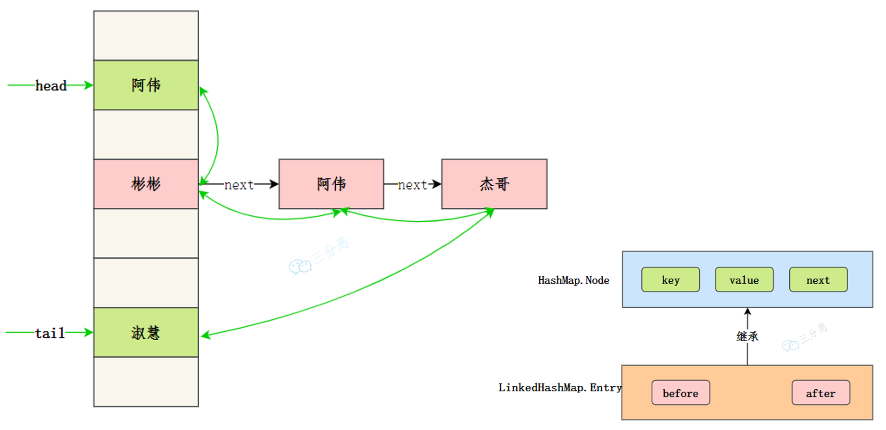

# Map

| 特性     | TreeMap        | HashMap        | LinkedHashMap    |
| -------- | -------------- | -------------- | ---------------- |
| 排序     | 支持           | 不支持         | 不支持           |
| 插入顺序 | 不保证         | 不保证         | 保证             |
| 查找效率 | O(log n)       | O(1)           | O(1)             |
| 空间占用 | 通常较大       | 通常较小       | 通常较大         |
| 适用场景 | 需要排序的场景 | 无需排序的场景 | 需要保持插入顺序 |

HashMap 是无序的。如果我们需要一个**有序**的 Map，就要用到 LinkedHashMap，是 HashMap 的子类，它使用链表来记录插入/访问元素的顺序。可以看作是 HashMap + LinkedList 的合体，它使用了哈希表来存储数据，又用了双向链表来维持键值对的插入顺序

TreeMap 由红黑树实现，可以保持元素的自然顺序，或者实现了 Comparator 接口的自定义顺序。

## HashMap

HashMap 是 Java 中常用的数据结构之一，用于存储键值对。在 HashMap 中，每个键都映射到一个唯一的值，可以通过键来快速访问对应的值，算法时间复杂度可以达到 O(1)。

> 在实际应用中，HashMap 可以用于缓存、索引等场景。例如，可以将用户 ID 作为键，用户信息作为值，将用户信息缓存到 HashMap 中，以便快速查找。又如，可以将关键字作为键，文档 ID 列表作为值，将文档索引缓存到 HashMap 中，以便快速搜索文档。

HashMap 的实现原理是基于哈希表的，它的底层是一个数组，数组的每个位置可能是一个链表或红黑树，也可能只是一个键值对。


- 当添加一个键值对时，HashMap 会根据键的哈希值计算出该键对应的数组下标（索引），然后将键值对插入到对应的位置。
- 当通过键查找值时，HashMap 也会根据键的哈希值计算出数组下标，并查找对应的值。

HashMap 链表转红黑树发生在 table 数组的长度大于 64，且链表的长度大于 8 的时候。为什么？

- 红黑树节点的大小大概是普通节点大小的两倍，所以转红黑树，牺牲了空间换时间，更多的是一种兜底的策略，保证极端情况下的查找效率。
- 理想情况下，使用随机哈希码，链表里的节点符合泊松分布，出现节点个数的概率是递减的，节点个数为 8 的情况，发生概率仅为`0.00000006`。
- 至于红黑树转回链表的阈值为什么是 6，而不是 8？是因为如果这个阈值也设置成 8，假如发生碰撞，节点增减刚好在 8 附近，会发生链表和红黑树的不断转换，导致资源浪费。

## hash 方法

hash 方法的主要作用是将 key 的 hashCode 值进行处理，得到最终的哈希值。由于 key 的 hashCode 值是不确定的，可能会出现哈希冲突，因此需要将哈希值通过一定的算法映射到 HashMap 的实际存储位置上。

```java
// JDK 8
static final int hash(Object key) {
    int h;
    return (key == null) ? 0 : (h = key.hashCode()) ^ (h >>> 16);
}
```

- 如果键值为 null，则哈希码为 0，则存放在第一个位置
- 否则，通过调用`hashCode()`方法获取键的哈希码，并将其与右移 16 位的哈希码进行异或运算


**hash 方法是用来做哈希值优化的**，把哈希值右移 16 位，也就正好是自己长度的一半，之后与原哈希值做异或运算，这样就混合了原哈希值中的高位和低位，增大了随机性。让数据元素更加均衡的分布，减少碰撞。

下一步，put与get将新的哈希值取模（mod），得到一个实际的存储位置。这个取模操作的目的是将哈希值映射到桶（Bucket）的索引上，桶是 HashMap 中的一个数组，每个桶中会存储着一个链表（或者红黑树），装载哈希值相同的键值对（没有相同哈希值的话就只存储一个键值对）。

## hashCode 方法

那么`hashCode()`方法又是怎么实现的呢？我们在 String 一节已经介绍过它的 `hashCode()` 方法了：

```java
private int hash; // 缓存字符串的哈希码

public int hashCode() {
    int h = hash; // 从缓存中获取哈希码
    // 如果哈希码未被计算过（即为 0）且字符串不为空，则计算哈希码
    if (h == 0 && value.length > 0) {
        char val[] = value; // 获取字符串的字符数组

        // 遍历字符串的每个字符来计算哈希码
        for (int i = 0; i < value.length; i++) {
            h = 31 * h + val[i]; // 使用 31 作为乘法因子
        }
        hash = h; // 缓存计算后的哈希码
    }
    return h; // 返回哈希码
}
```

31 倍哈希法（31-Hash）是一种简单有效的字符串哈希算法，常用于对字符串进行哈希处理。该算法的基本思想是将字符串中的每个字符乘以一个固定的质数 31 的幂次方，并将它们相加得到哈希值：

$$
H(s) = (s[0] \times 31^{n-1}) + (s[1] \times 31^{n-2}) + ... + (s[n-1] \times 31^0)
$$
31 倍哈希法的优点在于简单易实现，计算速度快，同时也比较均匀地分布在哈希表中。

类似的，Objects 类的 `hash()` 方法可以针对不同数量的参数生成新的 `hashCode()` 值：

```java
public static int hashCode(Object a[]) {
     if (a == null)
         return 0;
     int result = 1;
     for (Object element : a)
         result = 31 * result + (element == null ? 0 : element.hashCode());
     return result;
}
```

$$
H(a)=(a[0] \times 31^{n-1}) + (a[1] \times 31^{n-2}) + ... + (a[n-1] \times 31^0)
$$

我们来分析一段代码：

```java
public class Test {
    public static void main(String[] args) {
        Student s1 = new Student(18, "张三");
        Map<Student, Integer> scores = new HashMap<>();
        scores.put(s1, 98);
        System.out.println(scores.get(new Student(18, "张三")));
    }
}
 class Student {
    private int age;
    private String name;

     public Student(int age, String name) {
         this.age = age;
         this.name = name;
     }

     @Override
     public boolean equals(Object o) {
         Student student = (Student) o;
         return age == student.age &&
                 Objects.equals(name, student.name);
     }
 }
```

```
null
```

奇怪！我们明明把`Student(18, "张三")`塞进HashMap 中了，为什么get的时候又找不到？

原因就在于重写 `equals()` 方法的时候没有重写 `hashCode()` 方法。默认情况下，`hashCode()` 方法是一个本地方法，会**返回对象的存储地址**，显然 `put()` 中的 s1 和 `get()` 中的 `new Student(18, "张三")` 是两个对象，它们的存储地址肯定是不同的。

> - 如果两个对象调用 `equals()` 方法得到的结果为 true，调用 `hashCode()` 方法得到的结果必定相等；
> - （等价逆否命题）如果两个对象调用 `hashCode()` 方法得到的结果不相等，调用 `equals()` 方法得到的结果必定为 false；
> - 反之则不一定

虽然HashMap 的 `get()` 方法会在外面套一层，调用 `hash(key.hashCode())` 计算对象的哈希值，虽然两个不同的 `hashCode()` 结果经过 `hash()` 方法计算后有可能得到相同的结果，但这种概率微乎其微。

怎么解决这个问题呢？很简单，重写 `hashCode()` 方法。

```java
 @Override
 public int hashCode() {
     return Objects.hash(age, name);
 }
```

设计 `hashCode()` 时最重要的因素就是：无论何时，对同一个对象调用 `hashCode()` 都应该生成同样的值。如果在将一个对象用 `put()` 方法添加进 HashMap 时产生一个 `hashCode()` 值，而用 `get()` 方法取出时却产生了另外一个 `hashCode()` 值，那么就无法重新取得该对象了。

所以，如果你的 `hashCode()` 方法依赖于对象中易变的数据，用户就要当心了，因为此数据发生变化时，`hashCode()` 就会生成一个不同的哈希值，相当于产生了一个不同的键。也就是说，如果在重写 `hashCode()` 和 `equals()` 方法时，对象中某个字段容易发生改变，那么最好舍弃这些字段，以免产生不可预期的结果。

## put与get

**put 的时候计算下标，把键值对放到对应的桶上**。

```java
public V put(K key, V value) {
    return putVal(hash(key), key, value, false, true);
}

final V putVal(int hash, K key, V value, boolean onlyIfAbsent, boolean evict) {
    HashMap.Node<K,V>[] tab;  // 数组
    HashMap.Node<K,V> p;   // 元素

    int n, i;  // n 为数组的长度 i 为下标
    if ((tab = table) == null || (n = tab.length) == 0)
        // 数组为空的时候, 第一次扩容后的数组长度
        n = (tab = resize()).length;
    // 计算节点的插入位置，如果该位置为空，则新建一个节点插入
    if ((p = tab[i = (n - 1) & hash]) == null)
        tab[i] = newNode(hash, key, value, null);
}
```

理论上，哈希值（哈希码）是一个 int 类型，范围从-2147483648 到 2147483648。前后加起来大概 40 亿的映射空间，只要哈希值映射得比较均匀松散，一般是不会出现哈希碰撞（哈希冲突会降低 HashMap 的效率）。

但问题是一个 40 亿长度的数组，内存是放不下的。HashMap 扩容之前的数组初始大小只有 16，所以这个哈希值是不能直接拿来用的，用之前要和数组的长度做与运算，用得到的值来访问数组下标才行。

> 为什么用与而不是余？在计算机中，位运算`&`的速度要远高于取余运算`%`，因为计算机本质上就是二进制嘛。

get类似，**get 的时候通过下标，把键值对从对应的桶上取出来**

```java
final Node<K,V> getNode(int hash, Object key) {
    // 获取当前的数组和长度，以及当前节点链表的第一个节点（根据索引直接从数组中找）
    Node<K,V>[] tab;
    Node<K,V> first, e;
    int n;
    K k;
    if ((tab = table) != null && (n = tab.length) > 0 &&
            (first = tab[(n - 1) & hash]) != null) {
        // 如果第一个节点就是要查找的节点，则直接返回
        if (first.hash == hash && ((k = first.key) == key || (key != null && key.equals(k))))
            return first;
        // 如果第一个节点不是要查找的节点，则遍历节点链表查找
        if ((e = first.next) != null) {
            do {
                if (e.hash == hash && ((k = e.key) == key || (key != null && key.equals(k))))
                    return e;
            } while ((e = e.next) != null);
        }
    }
    
    return null;  // 没有找到对应的节点
}
```

## 扩容机制

类似ArrayList这种“动态数组”可以自动扩容，HashMap 的底层用的也是数组。向 HashMap 里不停地添加元素，当数组无法装载更多元素时，就需要对数组进行扩容，以便装入更多的元素；

1. 当元素数量达到负载因子（load factor）乘以数组长度时，开始扩容
2. 扩容操作时，HashMap 会先将数组的长度扩大一倍
3. 然后将原来的元素重新散列到新的数组中
4. 元素的位置是通过 key 的 hash 和数组长度进行与运算得到的，因此在数组长度扩大后，元素的位置也会发生一些改变。一部分索引不变，另一部分索引为“原索引+旧容量”

容量的提升也会相应地提高查询效率，因为“桶（坑）”更多了嘛，原来需要通过链表存储的（查询的时候需要遍历），扩容后可能就有自己专属的“坑位”了（直接就能查出来）。

```java
// JDK 7
// newCapacity为新的容量
void resize(int newCapacity) {
    Entry[] oldTable = table;  // 小数组，临时过度下
    int oldCapacity = oldTable.length;   // 扩容前的容量
    // MAXIMUM_CAPACITY 为最大容量，2 的 30 次方 = 1<<30
    if (oldCapacity == MAXIMUM_CAPACITY) {
        // 容量调整为 Integer 的最大值 0x7fffffff（十六进制）=2 的 31 次方-1
        threshold = Integer.MAX_VALUE;
        return;
    }

    // 初始化一个新的数组（大容量）
    Entry[] newTable = new Entry[newCapacity];
    // 把小数组的元素转移到大数组中
    transfer(newTable, initHashSeedAsNeeded(newCapacity));
    // 引用新的大数组
    table = newTable;
    // 重新计算阈值
    threshold = (int)Math.min(newCapacity * loadFactor, MAXIMUM_CAPACITY + 1);
}
```

newCapacity 是如何计算的呢？

```java
int newCapacity = oldCapacity * 2;  // 两倍

// 避免新容量太小或太大
if (newCapacity < 0 || newCapacity >= MAXIMUM_CAPACITY) {
    newCapacity = MAXIMUM_CAPACITY;
} else if (newCapacity < DEFAULT_INITIAL_CAPACITY) {
    newCapacity = DEFAULT_INITIAL_CAPACITY;
}
```

如何转移？

```java
void transfer(Entry[] newTable, boolean rehash) {
    int newCapacity = newTable.length;  // 新的容量
    // 遍历小数组
    for (Entry<K,V> e : table) {
        while(null != e) {
            Entry<K,V> next = e.next;  // 拉链法，相同 key 上的不同值
            
            if (rehash) {  // 是否需要重新计算 hash
                e.hash = null == e.key ? 0 : hash(e.key);
            }
            // 根据大数组的容量，和键的 hash 计算元素在数组中的下标
            int i = indexFor(e.hash, newCapacity);
            e.next = newTable[i];  // 同一位置上的新元素被放在链表的头部
            newTable[i] = e;  // 放在新的数组上
            e = next;  // 链表上的下一个元素
        }
    }
}
```

注意，`e.next = newTable[i]`，也就是使用了单链表的头插入方式，同一位置上新元素总会被放在链表的头部位置；这样先放在一个索引上的元素最终会被放到链表的尾部，这就会导致在旧数组中同一个链表上的元素，通过重新计算索引位置后，有可能被放到了新数组的不同位置上。

定位元素位置的代码是这样的，相当于用键的哈希值和数组大小取模：

```java
static int indexFor(int h, int length) {
    // assert Integer.bitCount(length) == 1 : "length must be a non-zero power of 2";
    return h & (length-1);
}
```

## 加载因子为什么是 0.75

HashMap 是用数组+链表/红黑树实现的，我们要想往 HashMap 中添加数据（元素/键值对）或者取数据，就需要确定数据在数组中的下标（索引）

1. 先把数据的键进行一次 hash` (key == null) ? 0 : (h = key.hashCode()) ^ (h >>> 16)`
2. 再做一次取模运算确定下标`i = (n - 1) & hash`

**加载因子**是用来表示 HashMap 中数据的填满程度：填入哈希表中的数据个数 / 哈希表的长度。当当 HashMap 的数组长度达到一个**临界值**（ 初始容量 * 加载因子）的时候，就会触发扩容

容易产生两个问题，需要在两个问题中找到平衡：

- 加载因子越大，数组的容量过小，经过哈希计算后的下标，容易出现冲突；
- 加载因子越小，数组的容量过大，导致空间利用率不高。

**为什么加载因子会选择 0.75 呢？为什么不是 0.8、0.6 呢**？

我们设HashMap长度为s，如果我们使用一个足够好的哈希函数，那么put到每一个坑位上的概率都是$$\frac{1}{s}$$，设我们put了n次，如果一次碰撞都没有的概率大于等于0.5，那么我们认为性能优秀，即：
$$
(1-\frac{1}{s})^{n} \geq 0.5
$$
这时候，我们对于该公式其实最想求的时候长度s的时候，n为多少次就应该进行扩容了？而负载因子则是$$n/s$$的值。
$$
\frac{n}{s} \leq \lim_{s\to \inf} \frac{\ln 2}{s\ln \frac{s}{s-1}} \sim \ln2 \sim 0.693
$$
然后再去考虑hashmap一些内置的要求，乘16可以最好一个整数，我们取0.75

## 线程不安全

三方面原因：

**多线程下扩容会死循环**：JDK 7 时，采用的是头部插入的方式来存放链表的，也就是下一个冲突的键值对会放在上一个键值对的前面。扩容的时候，加上多线程，就有可能导致出现环形链表，造成死循环。不过，JDK 8 时已经修复了这个问题，扩容时会保持链表原来的顺序。

**多线程下 put 会导致元素丢失**：多线程同时执行 put 操作时，如果计算出来的索引位置是相同的，那会造成前一个 key 被后一个 key 覆盖，从而导致元素的丢失。

**put 和 get 并发时会导致 get 到 null**：线程 1 执行 put 时，因为元素个数超出阈值而导致出现扩容，线程 2 此时执行 get，就有可能出现这个问题

为了解决这个问题，Java 提供了线程安全的 HashMap 实现类 ConcurrentHashMap。ConcurrentHashMap 内部采用了分段锁（Segment），将整个 Map 拆分为多个小的 HashMap，每个小的 HashMap 都有自己的锁，不同的线程可以同时访问不同的小 Map，从而实现了线程安全。在进行插入、删除和扩容等操作时，只需要锁住当前小 Map，不会对整个 Map 进行锁定，提高了并发访问的效率


也可以使用Collections.synchronizedMap，内部是通过 synchronized 对象锁来保证线程安全的。

Hashtable 也是线程安全的，直接在方法上加 synchronized 关键字，比较粗暴，它的使用已经不再推荐使用，因为 ConcurrentHashMap 提供了更高的并发性和性能。

## LinkedHashMap插入顺序

LinkedHashMap 如何维护插入顺序？LinkedHashMap 维护了一个双向链表，有头尾节点，同时 LinkedHashMap 节点 Entry 内部除了继承 HashMap 的 Node 属性，还有 before 和 after 用于标识前置节点和后置节点。



它并未重写 HashMap 的 `put()` 方法，而是重写了 `put()` 方法需要调用的内部方法 `newNode()`。

这是 HashMap 的。

```java
Node<K,V> newNode(int hash, K key, V value, Node<K,V> next) {
    return new Node<>(hash, key, value, next);
}
```

这是 LinkedHashMap 的。

```java
HashMap.Node<K,V> newNode(int hash, K key, V value, HashMap.Node<K,V> e) {
    LinkedHashMap.Entry<K,V> p =
            new LinkedHashMap.Entry<>(hash, key, value, e);
    linkNodeLast(p);
    return p;
}
```

LinkedHashMap.Entry 继承了 HashMap.Node，并且追加了两个字段 before 和 after，用来维持键值对的关系。

```java
static class Entry<K,V> extends HashMap.Node<K,V> {
    Entry<K,V> before, after;
    Entry(int hash, K key, V value, Node<K,V> next) {
        super(hash, key, value, next);
    }
}
```

在 LinkedHashMap 中，链表中的节点顺序是按照插入顺序维护的。当使用 put() 方法向 LinkedHashMap 中添加键值对时，会将新节点插入到链表的尾部，并更新 before 和 after 属性，以保证链表的顺序关系——由 `linkNodeLast()` 方法来完成：

```java
/**
 * 将指定节点插入到链表的尾部
 *
 * @param p 要插入的节点
 */
private void linkNodeLast(LinkedHashMap.Entry<K,V> p) {
    LinkedHashMap.Entry<K,V> last = tail; // 获取链表的尾节点
    tail = p; // 将 p 设为尾节点
    if (last == null)
        head = p; // 如果链表为空，则将 p 设为头节点
    else {
        p.before = last; // 将 p 的前驱节点设为链表的尾节点
        last.after = p; // 将链表的尾节点的后继节点设为 p
    }
}
```

## LinkedHashMap访问顺序

LinkedHashMap 不仅能够维持插入顺序，还能够维持访问顺序。访问包括调用 `get()` 方法、`remove()` 方法和 `put()` 方法。

要维护访问顺序，需要我们在声明 LinkedHashMap 的时候指定三个参数。

```java
LinkedHashMap<String, String> map = new LinkedHashMap<>(16, .75f, true);
```

第一个参数和第二个参数，指的是初始容量和负载因子。

第三个参数如果为 true 的话，就表示 LinkedHashMap 要维护访问顺序；否则，维护插入顺序。默认是 false。

```java
Map<String, String> linkedHashMap = new LinkedHashMap<>(16, .75f, true);
linkedHashMap.put("沉", "沉默王二");
linkedHashMap.put("默", "沉默王二");
linkedHashMap.put("王", "沉默王二");
linkedHashMap.put("二", "沉默王二");

System.out.println(linkedHashMap);

linkedHashMap.get("默");
System.out.println(linkedHashMap);

linkedHashMap.get("王");
System.out.println(linkedHashMap);
```

```
{沉=沉默王二, 默=沉默王二, 王=沉默王二, 二=沉默王二}
{沉=沉默王二, 王=沉默王二, 二=沉默王二, 默=沉默王二}
{沉=沉默王二, 二=沉默王二, 默=沉默王二, 王=沉默王二}
```

也就是说，最不经常访问的放在头部

> 这种特性可以使用 LinkedHashMap 来实现 LRU 缓存，LRU 是 Least Recently Used 的缩写，即最近最少使用，是一种常用的页面置换算法，选择最近最久未使用的页面予以淘汰。（一定要自己实现一下，如果只维护插入顺序也可以，put和get里面多用remove 和 put）

LinkedHashMap 是如何来维持访问顺序呢？

```java
void afterNodeAccess(Node<K,V> p) { }
void afterNodeInsertion(boolean evict) { }
void afterNodeRemoval(Node<K,V> p) { }
```

`afterNodeAccess()` 会在调用 `get()` 方法的时候被调用，`afterNodeInsertion()` 会在调用 `put()` 方法的时候被调用，`afterNodeRemoval()` 会在调用 `remove()` 方法的时候被调用。

我来以 `afterNodeAccess()` 为例来讲解一下。

```java
/**
 * 在访问节点后，将节点移动到链表的尾部
 *
 * @param e 要移动的节点
 */
void afterNodeAccess(HashMap.Node<K,V> e) { // move node to last
    LinkedHashMap.Entry<K,V> last;
    if (accessOrder && (last = tail) != e) { // 如果按访问顺序排序，并且访问的节点不是尾节点
        LinkedHashMap.Entry<K,V> p = (LinkedHashMap.Entry<K,V>)e, b = p.before, a = p.after;
        p.after = null; // 将要移动的节点的后继节点设为 null
        if (b == null)
            head = a; // 如果要移动的节点没有前驱节点，则将要移动的节点设为头节点
        else
            b.after = a; // 将要移动的节点的前驱节点的后继节点设为要移动的节点的后继节点
        if (a != null)
            a.before = b; // 如果要移动的节点有后继节点，则将要移动的节点的后继节点的前驱节点设为要移动的节点的前驱节点
        else
            last = b; // 如果要移动的节点没有后继节点，则将要移动的节点的前驱节点设为尾节点
        if (last == null)
            head = p; // 如果尾节点为空，则将要移动的节点设为头节点
        else {
            p.before = last; // 将要移动的节点的前驱节点设为尾节点
            last.after = p; // 将尾节点的后继节点设为要移动的节点
        }
        tail = p; // 将要移动的节点设为尾节点
        ++modCount; // 修改计数器
    }
}
```

## TreeMap实现排序

默认情况下，TreeMap 是根据 key 的自然顺序排列的。比如说整数，就是升序，1、2、3、4、5。

```java
TreeMap<Integer,String> mapInt = new TreeMap<>();
mapInt.put(3, "沉默王二");
mapInt.put(2, "沉默王二");
mapInt.put(1, "沉默王二");
mapInt.put(5, "沉默王二");
mapInt.put(4, "沉默王二");

System.out.println(mapInt);
```

```
{1=沉默王二, 2=沉默王二, 3=沉默王二, 4=沉默王二, 5=沉默王二}
```

如果自然顺序不满足，那就可以在声明 TreeMap 对象的时候指定排序规则。

```java
TreeMap<Integer,String> mapIntReverse = new TreeMap<>(Comparator.reverseOrder());  // 或者自定义 Comparator
```

TreeMap 是怎么做到的呢？TreeMap 的 `put()` 方法：

```java
public V put(K key, V value) {
    Entry<K,V> t = root; // 将根节点赋值给变量t
    if (t == null) { // 如果根节点为null，说明TreeMap为空
        compare(key, key); // type (and possibly null) check，检查key的类型是否合法
        root = new Entry<>(key, value, null); // 创建一个新节点作为根节点
        size = 1; // size设置为1
        return null; // 返回null，表示插入成功
    }
    int cmp;
    Entry<K,V> parent;
    // split comparator and comparable paths，根据使用的比较方法进行查找
    Comparator<? super K> cpr = comparator; // 获取比较器
    if (cpr != null) { // 如果使用了Comparator
        do {
            parent = t; // 将当前节点赋值给parent
            cmp = cpr.compare(key, t.key); // 使用Comparator比较key和t的键的大小
            if (cmp < 0) // 如果key小于t的键
                t = t.left; // 在t的左子树中查找
            else if (cmp > 0) // 如果key大于t的键
                t = t.right; // 在t的右子树中查找
            else // 如果key等于t的键
                return t.setValue(value); // 直接更新t的值
        } while (t != null);
    }
    else { // 如果没有使用Comparator
        if (key == null) // 如果key为null
            throw new NullPointerException(); // 抛出NullPointerException异常
            Comparable<? super K> k = (Comparable<? super K>) key; // 将key强制转换为Comparable类型
        do {
            parent = t; // 将当前节点赋值给parent
            cmp = k.compareTo(t.key); // 使用Comparable比较key和t的键的大小
            if (cmp < 0) // 如果key小于t的键
                t = t.left; // 在t的左子树中查找
            else if (cmp > 0) // 如果key大于t的键
                t = t.right; // 在t的右子树中查找
            else // 如果key等于t的键
                return t.setValue(value); // 直接更新t的值
        } while (t != null);
    }
    // 如果没有找到相同的键，需要创建一个新节点插入到TreeMap中
    Entry<K,V> e = new Entry<>(key, value, parent); // 创建一个新节点
    if (cmp < 0) // 如果key小于parent的键
        parent.left = e; // 将e作为parent的左子节点
    else
        parent.right = e; // 将e作为parent的右子节点
    fixAfterInsertion(e); // 插入节点后需要进行平衡操作
    size++; // size加1
    return null; // 返回null，表示插入成功
}
```

既然 TreeMap 的元素是经过排序的，那找出最大的那个，最小的那个，或者找出所有大于或者小于某个值的键来说，就方便多了。

```java
Integer highestKey = mapInt.lastKey();
Integer lowestKey = mapInt.firstKey();

// headMap获取的是到指定 key 之前的 key
Set<Integer> keysLessThan3 = mapInt.headMap(3).keySet();

// tailMap取的是指定 key 之后的 key（包括指定 key）
Set<Integer> keysGreaterThanEqTo3 = mapInt.tailMap(3).keySet();
```

## Comparable和Comparator

TreeMap 中可以自定义使用Comparator，这里聊一聊Comparable和Comparator这两个接口的区别

Comparable 接口的定义：

```java
public interface Comparable<T> {
    int compareTo(T t);
}
```

Comparator 接口的定义：

```java
public interface Comparator<T> {
    int compare(T o1, T o2);
    boolean equals(Object obj);
}
```

- 一个类实现了 Comparable 接口，意味着该类的对象可以直接进行比较（排序），但比较（排序）的方式只有一种，很**单一**。
- 一个类如果想要保持原样，又需要进行不同方式的比较（排序），就可以**定制**比较器（实现 Comparator 接口）。
- Comparable 接口在 `java.lang` 包下，而 `Comparator` 接口在 `java.util` 包下，算不上是亲兄弟，但可以称得上是表（堂）兄弟。

例如，一个类可以实现Comparable 接口，这个类可以直接比较和排序：

```java
public class Cmower implements Comparable<Cmower> {
    private int age;
    private String name;

    public Cmower(int age, String name) {
        this.age = age;
        this.name = name;
    }

    @Override
    public int compareTo(Cmower o) {
        return this.getAge() - o.getAge();
    }

    public static void main(String[] args) {
        Cmower wanger = new Cmower(19,"沉默王二");
        Cmower wangsan = new Cmower(16,"沉默王三");

        if (wanger.compareTo(wangsan) < 0) {
            System.out.println(wanger.getName() + "比较年轻有为");
        } else {
            System.out.println(wangsan.getName() + "比较年轻有为");
        }
    }
}
```

如果我们想让类保持它的原貌，不想主动实现 Comparable 接口，但我们又需要它们之间进行比较，该怎么办呢？可以使用Comparator

```java
public class Cmower  {
    private int age;
    private String name;

    public Cmower(int age, String name) {
        this.age = age;
        this.name = name;
    }
}

// 按照 age 进行比较
public class CmowerComparator implements Comparator<Cmower> {
    @Override
    public int compare(Cmower o1, Cmower o2) {
        return o1.getAge() - o2.getAge();
    }
}

// 按照 name 进行比较
public class CmowerNameComparator implements Comparator<Cmower> {
    @Override
    public int compare(Cmower o1, Cmower o2) {
        if (o1.getName().hashCode() < o2.getName().hashCode()) {
            return -1;
        } else if (o1.getName().hashCode() == o2.getName().hashCode()) {
            return 0;
        }
        return 1;
    }
}
```

在测试类中，可以根据需要选择不同的比较器：

```java
List<Cmower> list = new ArrayList<>();
// ...
list.sort(new CmowerComparator());
list.sort(new CmowerNameComparator());
```

