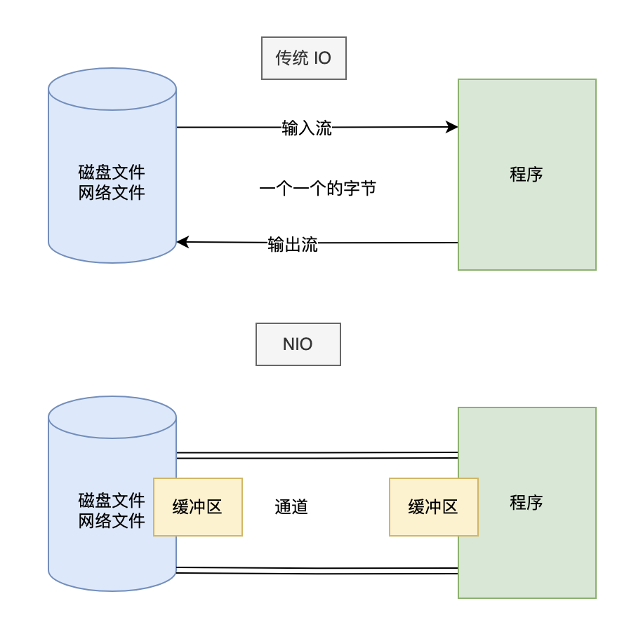

# IO与流

IO，即in和out，也就是输入和输出，指应用程序和外部设备之间的数据传递，常见的外部设备包括**文件、管道、网络**连接。

Java 中是通过流处理IO 的，那么什么是流？

流（Stream），是一个抽象的概念，是指一连串的数据（字符或字节），是以先进先出的方式发送信息的通道。

当程序需要读取数据的时候，就会开启一个通向数据源的流，这个数据源可以是文件，内存，或是网络连接。类似的，当程序需要写入数据的时候，就会开启一个通向目的地的流。这时候你就可以想象数据好像在这其中“流”动一样。

一般来说关于流的特性有下面几点：

- 先进先出：最先写入输出流的数据最先被输入流读取到。
- 顺序存取：可以一个接一个地往流中写入一串字节，读出时也将按写入顺序读取一串字节，不能随机访问中间的数据。（RandomAccessFile除外）
- 只读或只写：每个流只能是输入流或输出流的一种，不能同时具备两个功能，输入流只能进行读操作，对输出流只能进行写操作。在一个数据传输通道中，如果既要写入数据，又要读取数据，则要分别提供两个流。

## 传输方式分类

传输方式有两种，字节和字符

- 字节（byte）是计算机中用来表示存储容量的一个计量单位，通常情况下，一个字节有 8 位（bit）。用来处理二进制文件（等一切文件），比如说图片、MP3 、视频。字节流本身没有缓冲区，缓冲字节流相对于字节流，效率提升非常高。由于一个字符通常由多个字节组成，如果用字节流读中文，读出来的是乱码。

- 字符（char）可以是计算机中使用的字母、数字、和符号，比如说 A 1 $ 这些。通常来说，一个字母或者一个字符占用一个字节，一个汉字占用两个字节。用来处理文本文件。字符流本身就带有缓冲区。**字符流 = 字节流 + 编码表**

虽然 IO 类很多，但核心的就是 4 个抽象类：InputStream、OutputStream、Reader、Writer。核心方法也就 2 个：read 和 write。

**InputStream 类**

- `int read()`：读取数据
- `int read(byte b[], int off, int len)`：从第 off 位置开始读，读取 len 长度的字节，然后放入数组 b 中
- `long skip(long n)`：跳过指定个数的字节
- `int available()`：返回可读的字节数
- `void close()`：关闭流，释放资源

**OutputStream 类**

- `void write(int b)`： 写入一个字节，虽然参数是一个 int 类型，但只有低 8 位才会写入，高 24 位会舍弃（这块后面再讲）
- `void write(byte b[], int off, int len)`： 将数组 b 中的从 off 位置开始，长度为 len 的字节写入
- `void flush()`： 强制刷新，将缓冲区的数据写入
- `void close()`：关闭流

**Reader 类**

- `int read()`：读取单个字符
- `int read(char cbuf[], int off, int len)`：从第 off 位置开始读，读取 len 长度的字符，然后放入数组 b 中
- `long skip(long n)`：跳过指定个数的字符
- `int ready()`：是否可以读了
- `void close()`：关闭流，释放资源

**Writer 类**

- `void write(int c)`： 写入一个字符
- `void write( char cbuf[], int off, int len)`： 将数组 cbuf 中的从 off 位置开始，长度为 len 的字符写入
- `void flush()`： 强制刷新，将缓冲区的数据写入
- `void close()`：关闭流

## 操作对象分类

- **文件流**：直接操作文件的流，可以细分为字节流（FileInputStream 和 FileOuputStream）和字符流（FileReader 和 FileWriter）。还可以用于创建、删除、重命名文件等操作。

- **数组流**：针对文件的读写操作，使用文件流配合缓冲流就够用了，但为了提升效率，频繁地读写文件并不是太好，那么就出现了数组流，有时候也称为内存流。例如`ByteArrayInputStream `。数组流可以用于在内存中读写数据，比如将数据存储在字节数组中进行压缩、加密、序列化等操作。它的优点是不需要创建临时文件，可以提高程序的效率。但是，数组流也有缺点，它只能存储有限的数据量，如果存储的数据量过大，会导致内存溢出。

- **管道**：Java 中管道要求通信的双方必须在**同一个进程**中，也就是在同一个 JVM 中，管道为线程之间的通信提供了通信能力。一个线程通过 PipedOutputStream 写入的数据可以被另外一个线程通过相关联的 PipedInputStream 读取出来。可以实现不同线程之间的数据传输，可以用于线程间的通信、数据的传递等。

- **基本数据类型流**：字节流，该流不仅可以读写字节和字符，还可以读写基本数据类型。提供了一系列可以读写基本数据类型的方法

- **缓冲**：为了减少程序和硬盘的交互，提升程序的效率，就引入了缓冲流，也就是类名前缀带有 Buffer 的那些，比如说 BufferedInputStream、BufferedOutputStream、BufferedReader、BufferedWriter。即在内存中设置了一个缓冲区，只有缓冲区存储了足够多的带操作的数据后，才会和内存或者硬盘进行交互。简单来说，就是一次多读/写点，少读/写几次，这样程序的性能就会提高。但是，在使用缓冲流时需要注意缓冲区的大小和清空缓冲区的时机，以避免数据丢失或不完整的问题。

  

- **打印流**：用于打印输出数据的类，包括 PrintStream 和 PrintWriter 两个类。`System.out` 其实返回的就是一个 PrintStream 对象，可以用来打印各式各样的对象。PrintStream 最终输出的是字节数据，而 PrintWriter 则是扩展了 Writer 接口，所以它的 `print()/println()` 方法最终输出的是字符数据。

- **对象序列化/反序列化**：序列化本质上是将一个 Java 对象转成**字节数组**，然后可以将其保存到文件中，或者通过网络传输到远程。反序列化，也就是再将字节数组转成 Java 对象的过程。

  

- **转换**：InputStreamReader 是从**字节流到字符流**的桥连接，它使用指定的字符集读取字节并将它们解码为字符。OutputStreamWriter 将一个**字符流的输出对象变为字节流**的输出对象，是字符流通向字节流的桥梁。使用转换流可以方便地在字节流和字符流之间进行转换。在进行文本文件读写时，通常使用字符流进行操作，而在进行网络传输或与设备进行通信时，通常使用字节流进行操作。

  

## NIO

传统 IO 基于字节流或字符流（如 FileInputStream、BufferedReader 等）进行文件读写，以及使用 Socket 和 ServerSocket 进行网络传输。 

NIO 使用通道（Channel）和缓冲区（Buffer）进行文件操作，以及使用 SocketChannel 和 ServerSocketChannel 进行网络传输。

传统 IO 采用阻塞式模型，对于每个连接，都需要创建一个独立的线程来处理读写操作。当一个线程在等待 I/O 操作时，无法执行其他任务。这会导致大量线程的创建和销毁，以及上下文切换，降低了系统性能。

NIO 使用非阻塞模型，允许线程在等待 I/O 时执行其他任务。这种模式通过使用选择器（Selector）来监控多个通道（Channel）上的 I/O 事件，实现了更高的性能和可伸缩性。

> - nio 翻译成 no-blocking io 或者 new io 都无所谓啦，都说得通~

JDK 1.4 中，`java.nio.*包`引入新的 Java I/O 库，其目的是**提高速度**。实际上，“旧”的 I/O 包已经使用 NIO**重新实现过，即使我们不显式的使用 NIO 编程，也能从中受益**。

NIO 的**魅力主要体现在网络中**！

NIO（New I/O）的设计目标是解决传统 I/O（BIO，Blocking I/O）在处理大量并发连接时的性能瓶颈。传统 I/O 在网络通信中主要使用阻塞式 I/O，为每个连接分配一个线程。当连接数量增加时，系统性能将受到严重影响，线程资源成为关键瓶颈。而 NIO 提供了非阻塞 I/O 和 I/O 多路复用，可以在单个线程中处理多个并发连接，从而在网络传输中显著提高性能。

以下是 NIO 在网络传输中优于传统 I/O 的原因：

1. NIO 支持非阻塞 I/O，这意味着在执行 I/O 操作时，线程不会被阻塞。这使得在网络传输中可以有效地管理大量并发连接（数千甚至数百万）。而在操作文件时，这个优势没有那么明显，因为文件读写通常不涉及大量并发操作。 
2. NIO 支持 I/O 多路复用，这意味着一个线程可以同时监视多个通道（如套接字），并在 I/O 事件（如可读、可写）准备好时处理它们。这大大提高了网络传输中的性能，因为单个线程可以高效地管理多个并发连接。操作文件时这个优势也无法提现出来。 
3. NIO 提供了 ByteBuffer 类，可以高效地管理缓冲区。这在网络传输中很重要，因为数据通常是以字节流的形式传输。操作文件的时候，虽然也有缓冲区，但优势仍然不够明显

## 三种IO区别

随着 Java 的发展，目前有三种 IO 共存。分别是 BIO、NIO 和 AIO。

- BIO 全称 Block-IO 是一种**同步且阻塞**的通信模式。是一个比较传统的通信方式，模式简单，使用方便。但并发处理能力低，通信耗时，依赖网速。
- Java NIO，全称 Non-Block IO ，是 Java SE 1.4 版以后，针对网络传输效能优化的新功能。是一种**非阻塞同步**的通信模式。 NIO 与原来的 I/O 有同样的作用和目的, 他们之间最重要的区别是数据打包和传输的方式。原来的 I/O 以流的方式处理数据，而 NIO 以块的方式处理数据。每一个操作都在一步中产生或者消费一个数据块。按块处理数据比按(流式的)字节处理数据要快得多。但是面向块的 I/O 缺少一些面向流的 I/O 所具有的优雅性和简单性。
- Java AIO，全称 Asynchronous IO，是**异步非阻塞**的 IO。是一种非阻塞异步的通信模式。

举个例子：

- 同步阻塞模式：这种模式下，我们的工作模式是先来到厨房，开始烧水，并坐在水壶面前**一直等**着水烧开。
- 同步非阻塞模式：这种模式下，我们的工作模式是先来到厨房，开始烧水，但是我们不一直坐在水壶前面等，而是回到客厅看电视，然后**每隔几分钟到厨房看一下**水有没有烧开。
- 异步非阻塞模式：这种模式下，我们的工作模式是先来到厨房，开始烧水，我们不一直坐在水壶前面等，也不隔一段时间去看一下，而是在客厅看电视，水壶上面有个开关，**水烧开之后他会通知我**。

适用场景：

- BIO 方式适用于**连接数目比较小且固定**的架构，这种方式对服务器资源要求比较高，并发局限于应用中，JDK1.4 以前的唯一选择，但程序直观简单易理解。
- NIO 方式适用于**高并发但是数据少**的架构，比如聊天服务器，并发局限于应用中，编程比较复杂，JDK1.4 开始支持。
- AIO 方式适用于**高并发高吞吐量**的的架构，比如相册服务器，充分调用 OS 参与并发操作，编程比较复杂，JDK7 开始支持。