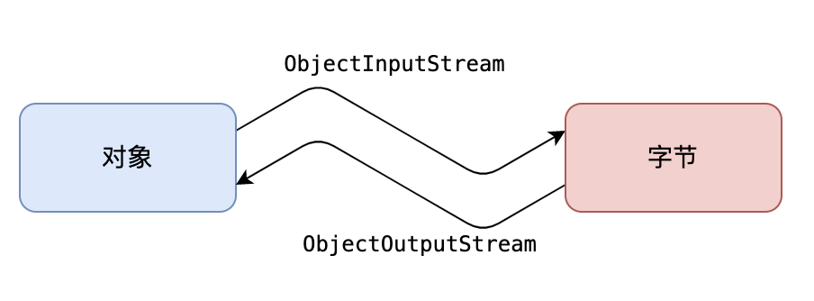

# 序列化

序列化是指将一个对象转换为一个字节序列（包含对象的数据、对象的类型和对象中存储的属性等信息），以便在网络上传输或保存到文件中，或者在程序之间传递。在 Java 中，序列化通过实现` java.io.Serializable` 接口来实现，只有实现了 Serializable 接口的对象才能被序列化。

反序列化是指将一个字节序列转换为一个对象，以便在程序中使用。

Java 的序列流（ObjectInputStream 和 ObjectOutputStream）是一种可以将 Java 对象序列化和反序列化的流。



## 序列化条件

一个对象要想序列化，必须满足两个条件:

- 该类必须实现`java.io.Serializable`，否则会抛出`NotSerializableException` 。
- 该类的所有字段都必须是可序列化的。如果一个字段不需要序列化，则需要使用`transient` 关键字open in new window进行修饰。

使用示例如下：

```java
public class Employee implements Serializable {
    public String name;
    public String address;
    public transient int age; // transient瞬态修饰成员,不会被序列化
}
```

## ObjectOutputStream

`java.io.ObjectOutputStream` 继承自 OutputStream 类，因此可以将序列化后的字节序列写入到文件、网络等输出流中。

来看 ObjectOutputStream 的构造方法，接收一个 OutputStream 对象作为参数，用于将序列化后的字节序列输出到指定的输出流中。例如：

```java
FileOutputStream fos = new FileOutputStream("file.txt");
ObjectOutputStream oos = new ObjectOutputStream(fos);
```

具体用法如下：

```java
public class ObjectOutputStreamDemo {
    public static void main(String[] args) {
        Person person = new Person("沉默王二", 20);
        try {
            FileOutputStream fos = new FileOutputStream("logs/person.dat");
            ObjectOutputStream oos = new ObjectOutputStream(fos);
            oos.writeObject(person);
            oos.close();
        } catch (IOException e) {
            e.printStackTrace();
        }
    }
}
class Person implements Serializable {
    private String name;
    private int age;

    public Person(String name, int age) {
        this.name = name;
        this.age = age;
    }

    public String getName() {
        return name;
    }

    public int getAge() {
        return age;
    }
}
```

## ObjectInputStream

ObjectInputStream 可以读取 ObjectOutputStream 写入的字节流，并将其反序列化为相应的对象（包含`对象的数据`、`对象的类型`和`对象中存储的属性`等信息）。

说简单点就是，序列化之前是什么样子，反序列化后就是什么样子：

```java
String filename = "logs/person.dat"; // 待反序列化的文件名
try (FileInputStream fileIn = new FileInputStream(filename);
     ObjectInputStream in = new ObjectInputStream(fileIn)) {
     Object obj = in.readObject();  // 从指定的文件输入流中读取对象并反序列化
     Person p = (Person) obj;  // 将反序列化后的对象强制转换为指定类型
     System.out.println("Deserialized Object: " + p);  // 打印反序列化后的对象信息
} catch (IOException | ClassNotFoundException e) {
     e.printStackTrace();
}
```

> 实际开发中，很少使用 JDK 自带的序列化和反序列化，这是因为：
>
> - 可移植性差：Java 特有的，无法跨语言进行序列化和反序列化。
> - 性能差：序列化后的字节体积大，增加了传输/保存成本。
> - 安全问题：攻击者可以通过构造恶意数据来实现远程代码执行，从而对系统造成严重的安全威胁。
>
> Kryo 是一个优秀的 Java 序列化和反序列化库，具有高性能、高效率和易于使用和扩展等特点，有效地解决了 JDK 自带的序列化机制的痛点。

## Serializbale 接口

序列化有一条规则，就是要序列化的对象必须实现 `Serializbale` 接口，否则就会报 NotSerializableException 异常。

但是，`Serializbale` 接口的定义是空的，如何能够保证实现了它的“类对象”被序列化和反序列化？

```java
public interface Serializable {
}
```

如果没有实现 `Serializbale` 接口，在运行测试类的时候会抛出异常，堆栈信息如下：

```
java.io.NotSerializableException: com.cmower.java_demo.xuliehua.Wanger
	at java.io.ObjectOutputStream.writeObject0(ObjectOutputStream.java:1184)
	at java.io.ObjectOutputStream.writeObject(ObjectOutputStream.java:348)
	at com.cmower.java_demo.xuliehua.Test.main(Test.java:21)
```

顺着堆栈信息，我们来看一下 `ObjectOutputStream` 的 `writeObject0()` 方法。其部分源码如下：

```java
// 判断对象是否为字符串类型，如果是，则调用 writeString 方法进行序列化
if (obj instanceof String) {
    writeString((String) obj, unshared);
}
// 判断对象是否为数组类型，如果是，则调用 writeArray 方法进行序列化
else if (cl.isArray()) {
    writeArray(obj, desc, unshared);
}
// 判断对象是否为枚举类型，如果是，则调用 writeEnum 方法进行序列化
else if (obj instanceof Enum) {
    writeEnum((Enum<?>) obj, desc, unshared);
}
// 判断对象是否为可序列化类型，如果是，则调用 writeOrdinaryObject 方法进行序列化
else if (obj instanceof Serializable) {
    writeOrdinaryObject(obj, desc, unshared);
}
// 如果对象不能被序列化，则抛出 NotSerializableException 异常
else {
    if (extendedDebugInfo) {
        throw new NotSerializableException(
            cl.getName() + "\n" + debugInfoStack.toString());
    } else {
        throw new NotSerializableException(cl.getName());
    }
}
```

`Serializable` 接口之所以定义为空，是因为它只起到了一个标识的作用，告诉程序实现了它的对象是可以被序列化的，但真正序列化和反序列化的操作并不需要它来完成。

**反序列化**：以 `ObjectInputStream` 为例，它在反序列化的时候会依次调用 `readObject()`→`readObject0()`→`readOrdinaryObject()`→`readSerialData()`→`defaultReadFields()`。

```java
private void defaultReadFields(Object obj, ObjectStreamClass desc) throws IOException {
    // 获取对象的类，并检查对象是否属于该类
    Class<?> cl = desc.forClass();
    if (cl != null && obj != null && !cl.isInstance(obj)) {
        throw new ClassCastException();
    }

    // 获取对象的基本类型字段的数量和值
    int primDataSize = desc.getPrimDataSize();
    if (primVals == null || primVals.length < primDataSize) {
        primVals = new byte[primDataSize];
    }
    // 从输入流中读取基本类型字段的值，并存储在 primVals 数组中
    bin.readFully(primVals, 0, primDataSize, false);
    if (obj != null) {
        // 将 primVals 数组中的基本类型字段的值设置到对象的相应字段中
        desc.setPrimFieldValues(obj, primVals);
    }

    // 获取对象的非基本类型字段的数量和值
    int objHandle = passHandle;
    ObjectStreamField[] fields = desc.getFields(false);
    Object[] objVals = new Object[desc.getNumObjFields()];
    int numPrimFields = fields.length - objVals.length;
    // 循环读取对象的非基本类型字段的值
    for (int i = 0; i < objVals.length; i++) {
        // 调用 readObject0 方法读取对象的非基本类型字段的值
        ObjectStreamField f = fields[numPrimFields + i];
        objVals[i] = readObject0(Object.class, f.isUnshared());
        // 如果该字段是一个引用字段，则将其标记为依赖该对象
        if (f.getField() != null) {
            handles.markDependency(objHandle, passHandle);
        }
    }
    if (obj != null) {
        // 将 objVals 数组中的非基本类型字段的值设置到对象的相应字段中
        desc.setObjFieldValues(obj, objVals);
    }
    passHandle = objHandle;
}
```

## 不被序列化的static 和 transient

不是所有的字段都需要序列化，例如用户的一些敏感信息（如密码、银行卡号等），为了安全起见，不希望在网络操作中传输或者持久化到磁盘文件中，那这些字段就可以加上 `transient` 关键字。

static 和 transient 修饰的字段是不会被序列化的。我们写个例子：

```java
class Wanger implements Serializable {
    private static final long serialVersionUID = -2095916884810199532L;

    private String name;
    private int age;

    public static String pre = "沉默";
    transient String meizi = "王三";

    @Override
    public String toString() {
        return "Wanger{" + "name=" + name + ",age=" + age + ",pre=" + pre + ",meizi=" + meizi + "}";
    }
}
```

测试代码：

```java
// 初始化
Wanger wanger = new Wanger();
wanger.setName("王二");
wanger.setAge(18);
System.out.println(wanger);

// 把对象写到文件中
try (ObjectOutputStream oos = new ObjectOutputStream(new FileOutputStream("chenmo"));){
        oos.writeObject(wanger);
    } catch (IOException e) {
        e.printStackTrace();
    }
   
    // 改变 static 字段的值
Wanger.pre ="不沉默";

// 从文件中读出对象
try (ObjectInputStream ois = new ObjectInputStream(new FileInputStream(new File("chenmo")));){
    Wanger wanger1 = (Wanger) ois.readObject();
    System.out.println(wanger1);
} catch (IOException | ClassNotFoundException e) {
    e.printStackTrace();
}
```

输出：

```java
Wanger{name=王二,age=18,pre=沉默,meizi=王三}
Wanger{name=王二,age=18,pre=不沉默,meizi=null}
```

- 序列化前，`pre` 的值为“沉默”，序列化后，`pre` 的值修改为“不沉默”，反序列化后，`pre` 的值为“不沉默”，而不是序列化前的状态“沉默”。因为**序列化保存的是对象的状态**，而 `static` 修饰的字段属于类的状态，因此可以证明序列化并不保存 `static` 修饰的字段。
- 序列化前，`meizi` 的值为“王三”，反序列化后，`meizi` 的值为 `null`，而不是序列化前的状态“王三”。因为`transient` （即临时的），它可以阻止字段被序列化到文件中，在被反序列化后，`transient` 字段的值被设为初始值，比如 `int` 型的初始值为 0，对象型的初始值为 `null`。

在源码中，被`Modifier.STATIC | Modifier.TRANSIENT` 这两个修饰符标记的字段就没有被放入到序列化的字段中：

```java
private static ObjectStreamField[] getDefaultSerialFields(Class<?> cl) {
    // 获取该类中声明的所有字段
    Field[] clFields = cl.getDeclaredFields();
    ArrayList<ObjectStreamField> list = new ArrayList<>();
    int mask = Modifier.STATIC | Modifier.TRANSIENT;

    // 遍历所有字段，将非 static 和 transient 的字段添加到 list 中
    for (int i = 0; i < clFields.length; i++) {
        Field field = clFields[i];
        int mods = field.getModifiers();
        if ((mods & mask) == 0) {
            // 根据字段名、字段类型和字段是否可序列化创建一个 ObjectStreamField 对象
            ObjectStreamField osf = new ObjectStreamField(field.getName(), field.getType(), !Serializable.class.isAssignableFrom(cl));
            list.add(osf);
        }
    }

    int size = list.size();
    // 如果 list 为空，则返回一个空的 ObjectStreamField 数组，否则将 list 转换为 ObjectStreamField 数组并返回
    return (size == 0) ? NO_FIELDS :
        list.toArray(new ObjectStreamField[size]);
}
```

## Externalizable 接口

除了 `Serializable` 之外，Java 还提供了一个序列化接口 `Externalizable`

- Serializable 是 Java 标准库提供的接口，而 Externalizable 是 Serializable 的子接口
- 与Serializable相比，新增了一个无参的构造方法。因为使用 `Externalizable` 进行反序列化的时候，会调用被序列化类的无参构造方法去创建一个新的对象，然后再将被保存对象的字段值复制过去。
- 新增了两个方法 `writeExternal()` 和 `readExternal()`，实现 `Externalizable` 接口所必须的。可以自由控制读写哪些字段，也可以对对象进行自定义的处理，如对一些敏感信息进行加密和解密。

我们实现一下：

```java
class Wanger implements Externalizable {
	private String name;
	private int age;

	public Wanger() {
	}
    
	public String getName() {
		return name;
	}

	@Override
	public String toString() {
		return "Wanger{" + "name=" + name + ",age=" + age + "}";
	}

	@Override
	public void writeExternal(ObjectOutput out) throws IOException {
	}

	@Override
	public void readExternal(ObjectInput in) throws IOException, ClassNotFoundException {
	}
}
```

测试类：

```java
// 初始化
Wanger wanger = new Wanger();
wanger.setName("王二");
wanger.setAge(18);
System.out.println(wanger);

// 把对象写到文件中
try (ObjectOutputStream oos = new ObjectOutputStream(new FileOutputStream("chenmo"));) {
	oos.writeObject(wanger);
} catch (IOException e) {
	e.printStackTrace();
}

// 从文件中读出对象
try (ObjectInputStream ois = new ObjectInputStream(new FileInputStream(new File("chenmo")));) {
	Wanger wanger1 = (Wanger) ois.readObject();
	System.out.println(wanger1);
} catch (IOException | ClassNotFoundException e) {
	e.printStackTrace();
}
// Wanger{name=王二,age=18}
// Wanger{name=null,age=0}
```

怎么都变成了默认值？因为我们没有为 `Wanger` 类重写具体的 `writeExternal()` 和 `readExternal()` 方法。那该怎么重写呢？

```java
@Override
public void writeExternal(ObjectOutput out) throws IOException {
	out.writeObject(name);
	out.writeInt(age);
}

@Override
public void readExternal(ObjectInput in) throws IOException, ClassNotFoundException {
	name = (String) in.readObject();
	age = in.readInt();
}
```

## 序列化 ID

在不被序列化的static 和 transient一节中，有一行神秘的代码：

```java
private static final long serialVersionUID = -2095916884810199532L;
```

当一个类实现了 `Serializable` 接口后，IDE 就会提醒该类最好产生一个序列化 ID，即`serialVersionUID` ，它是决定 Java 对象能否反序列化成功的重要因子。在反序列化时，Java 虚拟机会把字节流中的 `serialVersionUID` 与被序列化类中的 `serialVersionUID` 进行比较，**如果相同则可以进行反序列化**，**否则就会抛出序列化版本不一致的异常**。

生成序列化 ID的方法有三种：

- 如果没有特殊需求，采用默认的序列化 ID（1L）就可以，这样可以确保代码一致时反序列化成功：

  ```java
  private static final long serialVersionUID = 1L。
  ```

- 添加一个随机生成的不重复的序列化 ID，如果反序列化前这个ID被修改了，反序列化时就会报错

  ```java
  private static final long serialVersionUID = -2095916884810199532L;
  ```

- 添加 `@SuppressWarnings` 注解

  ```java
  @SuppressWarnings("serial")
  class Wanger implements Serializable {
  	// ......
  }
  ```
  
  
