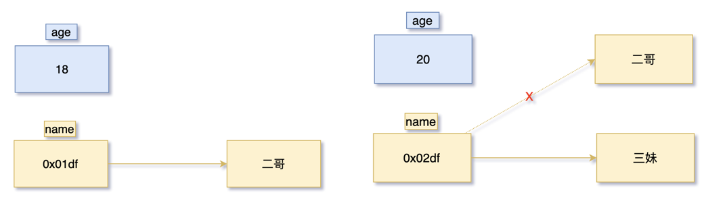
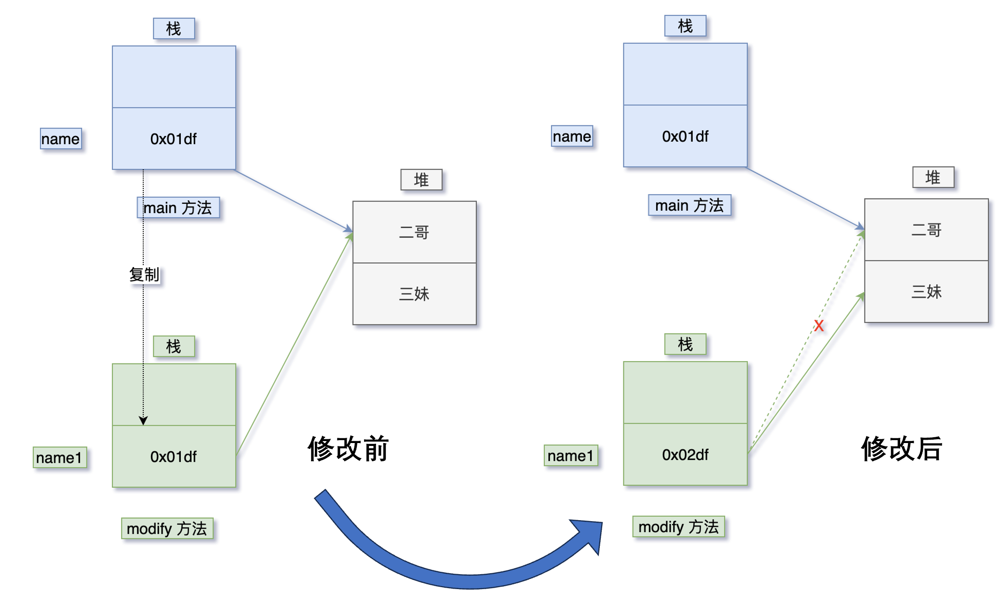

# 值传递

先说结论：**Java 中的参数传递是按值传递的**

C 语言是很多编程语言的母胎，包括 Java，那么对于 C 语言来说，所有的方法参数都是“通过值”传递的，也就是说，传递给被调用方法的参数值存放在临时变量中，而不是存放在原来的变量中。这就意味着，被调用的方法不能修改调用方法中变量的值，而只能修改其私有变量的临时副本的值。

- 当一个参数按照**值传递**的方式在两个方法之间传递时，调用者和被调用者其实是用的两个不同的变量——被调用者中的变量（原始值）是调用者中变量的一份拷贝，对它们当中的任何一个变量修改都不会影响到另外一个变量。
- 当一个参数按照**引用传递**的方式在两个方法之间传递时，调用者和被调用者其实用的是同一个变量，当该变量被修改时，双方都是可见的。在C++中可以用`&`来实现。

## 赋值运算符

我们来看看基本数据类型和引用数据类型之间的差别：

```java
int age = 18;
String name = "二哥";
```

age 是基本类型，值就保存在变量中，而 name 是引用类型，变量中保存的是对象的地址。一般称这种变量为对象的引用，**引用存放在栈中**，**而对象存放在堆中**。

当用 = 赋值运算符改变 age 和 name 的值时：

```java
age = 16;
name = "三妹";
```

对于基本类型 age，赋值运算符会直接改变变量的值，原来的值被覆盖。对于引用类型 name，赋值运算符会改变对象引用中保存的地址，原来的地址被覆盖，但原来的对象不会被覆盖。



## 函数传参

在C++中我们就学过，下面的代码时改变不了`age`值的：

```java
class PrimitiveTypeDemo {
    public static void main(String[] args) {
        int age = 18;
        modify(age);
        System.out.println(age);
    }

    private static void modify(int age1) {
        age1 = 30;
    }
}
```

如果我们想让 age 的值发生改变，就需要这样做：

```java
class PrimitiveTypeDemo1 {
    public static void main(String[] args) {
        int age = 18;
        age = modify(age);
        System.out.println(age);
    }

    private static int modify(int age1) {
        age1 = 30;
        return age1;
    }
}
```

现在我们换成 String：

```java
// 这样改不了
class ReferenceTypeDemo {
    public static void main(String[] args) {
        String name = "二哥";
        modify(name);
        System.out.println(name);
    }

    private static void modify(String name1) {
        name1 = "三妹";
    }
}
```

画一幅图理解为什么无法修改：



如果用C++的思维理解：

1. main方法里面的其实是一个字符串指针`String*`
2. modify方法的参数也是一个字符串指针`String*`
3. 我们想修改main里面的name字符串指针，修改指针要用什么？指针的指针！但是modify方法的参数只是指针，当然改不了了！但是Java不能显示的使用指针，所以也没有“指针的指针”这种玩意。