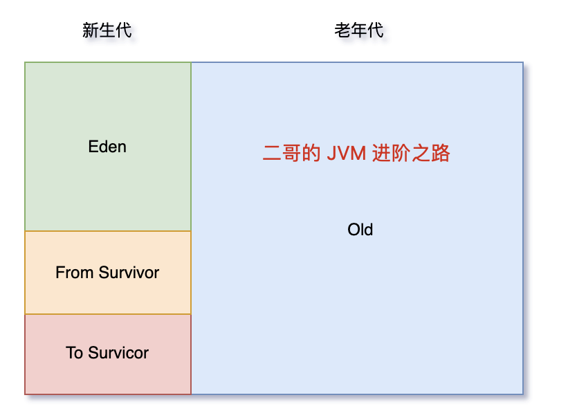

# JVM

Java 虚拟机：Java Virtual Machine。我们编写 Java 代码，编译 Java 代码，目的不是让它在 Linux、Windows 或者 MacOS 上跑，而是在不同平台上面的 JVM 上跑。实现了“一次编译，到处运行”的理念


HotSpot VM，OracleJDK（商用）和 OpenJDK（开源）的默认虚拟机，也是目前使用最广泛的 Java 虚拟机

JVM 的组织架构：


## 运行时数据区

根据 Java 虚拟机规范的规定，运行时数据区可以分为以下几个部分：

- 程序计数器（Program Counter Register）：当前线程所执行的字节码指令的行号指示器。字节码解释器会在工作的时候改变这个计数器的值来选取下一条需要执行的字节码指令
- Java 虚拟机栈（Java Virtual Machine Stacks）：一个个栈帧，每个栈帧对应一个被调用的方法。当线程执行一个方法时，会创建一个对应的栈帧，并将栈帧压入栈中。当方法执行完毕后，将栈帧从栈中移除。
- 本地方法栈（Native Method Stack）：与 Java 虚拟机栈类似，只不过 Java 虚拟机栈为虚拟机执行 Java 方法服务，而本地方法栈则为虚拟机使用到的 Native 方法（非Java语言方法）服务。
- 堆（Heap）：所有线程共享的一块内存区域，在 JVM 启动的时候创建，用来存储对象（数组也是一种对象）。
- 方法区（Method Area）：JDK 8 开始，使用元空间取代了永久代。**方法区是 JVM 中的一个逻辑区域**，用于存储类的结构信息，包括类的定义、方法的定义、字段的定义以及字节码指令。不同的是，元空间不再是 JVM 内存的一部分，而是通过本地内存（Native Memory）来实现的。
- 运行时常量池是每一个类或接口的常量在运行时的表现形式，它包括了编译器可知的数值字面量，以及运行期解析后才能获得的方法或字段的引用。简而言之，当一个方法或者变量被引用时，JVM 通过运行时常量区来查找方法或者变量在内存里的实际地址。

## 垃圾回收

### 垃圾判断算法

引用计数算法（Reachability Counting）是通过在对象头中分配一个空间来保存该对象被引用的次数（Reference Count）。如果该对象被其它对象引用，则它的引用计数加 1，如果删除对该对象的引用，那么它的引用计数就减 1，当该对象的引用计数为 0 时，那么该对象就会被回收。

> 引用计数算法看似很美好，但实际上它存在一个很大的问题，那就是无法解决循环依赖的问题。
>
> ```java
> a.instance = b; b.instance = a;
> a = null; b = null;
> ```
>
> 由于它们相互引用着对方，导致它们的引用计数永远都不会为 0

可达性分析算法（Reachability Analysis）的基本思路是，通过 GC Roots 作为起点，然后向下搜索，搜索走过的路径被称为 Reference Chain（引用链），当一个对象到 GC Roots 之间没有任何引用相连时，即从 GC Roots 到该对象节点不可达，则证明该对象是需要垃圾收集的。

> 所谓的 GC Roots，就是一组必须活跃的引用，不是对象，它们是程序运行时的起点，是一切引用链的源头。在 Java 中，GC Roots 包括以下几种：
>
> - 虚拟机栈中的引用（方法的参数、局部变量等）
> - 本地方法栈中 JNI 的引用
> - 类静态变量
> - 运行时常量池中的常量（String 或 Class 类型）

### 垃圾清除算法

标记清除算法（Mark-Sweep）是最基础的一种垃圾回收算法，它分为 2 部分，先把内存区域中的这些对象进行标记，哪些属于可回收的标记出来（用前面提到的可达性分析法），然后把这些垃圾拎出来清理掉。但它存在一个很大的问题，那就是**内存碎片**。

复制算法（Copying）是在标记清除算法上演化而来的，用于解决内存碎片问题。**将可用内存按容量划分为大小相等的两块，每次只使用其中的一块**（浪费了一半！）。当一块的内存用完了，就将还存活着的对象复制到另外一块上面，然后再把已使用过的内存空间一次清理掉。这样就保证了内存的连续性。

标记整理算法（Mark-Compact），标记过程仍然与标记清除算法一样，但后续步骤不是直接对可回收对象进行清理，而是让所有存活的对象都向一端移动，再清理掉端边界以外的内存区域。但**内存变动更频繁**，需要整理所有存活对象的引用地址，在效率上比复制算法差很多


**分代收集算法**（Generational Collection）根据对象存活周期的不同会将内存划分为几块，一般是把 Java 堆分为新生代和老年代，这样就可以根据各个年代的特点采用最适当的收集算法。

- 在新生代中，每次垃圾收集时都发现有大批对象死去，只有少量存活，那就选用**复制算法**，只需要付出少量存活对象的复制成本就可以完成收集。
- 老年代中因为对象存活率高、没有额外空间对它进行分配担保，就必须使用**标记清理或者标记整理算法**来进行回收。

堆（Heap）是 JVM 中最大的一块内存区域，也是垃圾收集器管理的主要区域。堆主要分为 2 个区域，年轻代与老年代，其中年轻代又分 Eden 区和 Survivor 区，其中 Survivor 区又分 From 和 To 两个区。



- 有将近 98% 的对象是朝生夕死，所以针对这一现状，大多数情况下，对象会在新生代 Eden 区中进行分配，当 Eden 区没有足够空间进行分配时，JVM 会发起一次 Minor GC。之后，Eden 区中绝大部分对象会被回收，而那些无需回收的存活对象，将会进到 Survivor 的 From 区，如果 From 区不够，则直接进入 To 区。
- Survivor 区相当于是 Eden 区和 Old 区的一个缓冲。有很多对象虽然一次 Minor GC 没有消灭，但其实也并不会蹦跶多久，或许第二次，第三次就需要被清除。
- 为啥设置两个 Survivor 区？最大的好处就是解决内存碎片化。每次 Minor GC，会将之前 Eden 区和 From 区中的存活对象复制到 To 区域。第二次 Minor GC 时，From 与 To 职责兑换，这时候会将 Eden 区和 To 区中的存活对象再复制到 From 区域，以此反复。这种机制最大的好处就是，整个过程中，永远有一个 Survivor space 是空的，另一个非空的 Survivor space 是无碎片的。
- 老年代占据着 2/3 的堆内存空间，只有在 Major GC 的时候才会进行清理，每次 GC 都会触发“Stop-The-World”（暂停所有的用户线程）。