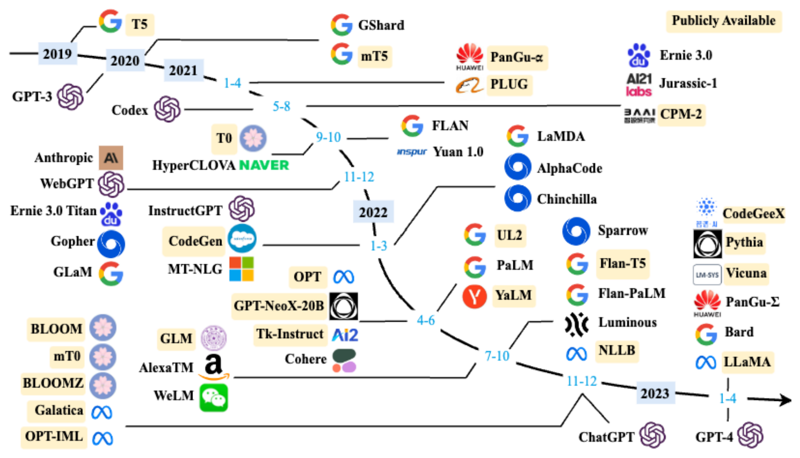

# 大规模语言模型概述

## 语言模型发展

### 统计语言模型SLM

词序列 w1w2...wm 作为一个句子出现的可能性大小可以表示为：
$$
P(w_1w_2...w_m)
$$
由于这个联合概率的参数量十分巨大，直接计算十分困难。

根据条件概率，可以表示为（可以看作单词逐个生成的过程）：
$$
P(w_1w_2...w_m)=\prod_{i=1}^mP(w_i|w_1w_2...w_{i-1})
$$
将联合概率转换为了多个条件概率的乘积。但是，模型的参数空间依然没有下降。

可以进一步假设任意单词 wi 出现的概率只与过去 n − 1 个词相关，这被称为n 元语法或n 元文法(n-gram) 模型。
$$
P(w_i|w_1w_2...w_{i-1})=P(w_i|w_{i-(n-1)}w_{i-(n-2)}...w_{i-1})
$$
可以使用**平滑**，是指为了产生更合理的概率，对最大似然估计进行调整的 一类方法，也称为数据平滑（Data Smoothing）。平滑处理的基本思想是提高低概率，降低高概率， 使整体的概率分布趋于均匀。具体来说，对所有可能出现的字符串都分配一个非零的概率值，从而避免零概率问题。

较为明显的缺点：

- 无法建模长度超过 n 的上下文
- 依赖人工设计规则 的平滑技术
- 当 n 增大时，数据的稀疏性随之增大，模型的参数量更是指数级增加，并且模型 受到数据稀疏问题的影响，其参数难以被准确的学习。
- 单词的离散表示也忽略了单词之间的相似性。

### 神经语言模型NLM

使用前馈神经网络对联合概率进行估计，词的独热编码被映射为一个低维稠密的实数向量，称为词向量（Word Embedding）。

### 预训练语言模型PLM

受到计算机视觉领域采用 ImageNet 对模型进行一次预训练，使得模型可以通过海量图像 充分学习如何提取特征，然后再根据任务目标进行模型精调的范式影响。

GPT 和 BERT 为代表的基于 Transformer 模型的大规模预训练语言模型出现。

将预训练模型应用于下游任务 时，不需要了解太多的任务细节，不需要设计特定的神经网络结构，只需要“微调”预训练模型， 即使用具体任务的标注数据在预训练语言模型上进行监督训练，就可以取得显著的性能提升。

### 大规模语言模型LLM

2020 年 Open AI 发布了包含 1750 亿参数的生成式大规模预训练语言模型 GPT-3。

由于大规模语言模型的参数量巨大， 如果在不同任务上都进行微调需要消耗大量的计算资源，因此预训练微调范式不再适用于大规模 语言模型。

## LLM发展历程

### 基础模型阶段

这个阶段研究主要集中语言模型本身，包括仅编码器 （Encoder Only）、编码器-解码器（Encoder-Decoder）、仅解码器（Decoder Only）等各种类型的模 型结构都有相应的研究。

模型大小与 BERT 相类似的算法，通常采用预训练微调范式，针对不同 下游任务进行微调。

但是模型参数量在 10 亿以上时，由于微调的计算量很高，这类模型的影响力 在当时相较 BERT 类模型有不小的差距。

### 能力探索阶段

由于大规模语言模型很难针对特定任务进行微调，因此探索不需要修改语 言模型的参数，仅依赖基于 语言模型本身如何能够发挥大规模语言模型的能力。

这些方法从直接利用大规模语言模型进行零样本和少样本学习 的基础上，逐渐扩展到利用生成式框架针对大量任务进行有监督微调的方法，有效提升了模型的 性能。

### 突破发展阶段

以 2022 年 11 月 ChatGPT 的发布为起点。从 2022 年开始 大模型呈现爆发式的增长，各大公司和研究机构都在发布各种不同类型的大模型。

## LLM构建流程

### 预训练

预训练（Pretraining）阶段需要利用海量的训练数据，利用由数千块高性能 GPU 和高速网络组成超级计算机，花费数十天完成深度神经网络参数训练，构建基础语言模型 （Base Model）。

基础大模型构建了长文本的建模能力，使得模型具有语言生成能力，根据输入的 提示词（Prompt），模型可以生成文本补全句子。

>- GPT-3 完成一次训练的总计算量是 3640PFlops，按照 NVIDIA A100 80G 和平均利用率达到 50% 计算，需要花费近一个月时间使用 1000 块 GPU 完成。
>- 参数量同样是 1750 亿的 OPT 模型，该模型训练使用了 992 块 NVIDIA A100 80G，整体训练时间将 近 2 个月。
>- BLOOM 模型的参数量也是 1750 亿，该模型训练一共花费 3.5 个月，使用包含 384 块 NVIDIA A100 80G GPU 集群完成。

### 有监督微调

利用少量高质量数据集合，包含用户输入的提示词（Prompt）和对应的理想输出结果。

利用这些有监督数据，使用与预训练阶段相同的语言模型训练算法，在基础语言模型基础上再进 行训练，从而得到有监督微调模型（SFT 模型）。

> 例如：提示词（Prompt）：复旦大学有几个校区？
>
> 理想输出：复旦大学现有 4 个校区，分别是邯郸校区、新江湾校区、枫林校区和张江 校区。其中邯郸校区是复旦大学的主校区，邯郸校区与新江湾校区都位于杨浦区，枫林校区 位于徐汇区，张江校区位于浦东新区。

### 奖励建模

目标是构建一个文本质量对比模型，对于同一个提示词，SFT 模型给出的多个不同输出结果的质量进行排序。奖励模型（RM 模型）可以通过二分类模型，对输 入的两个结果之间的优劣进行判断。

RM 模型的准确率对于强化学习阶段的效果有着至关重要的影响，因此对于该 模型的训练通常需要大规模的训练数据。

由于标注其质量排序需 要制定非常详细的规范，标注人员也需要非常认真的对标规范内容进行标注，需要消耗大量的人力。

### 强化学习

根据数十万用户给出的提示词，利用在前一阶段训练 的 RM 模型，给出 SFT 模型对用户提示词补全结果的质量评估，并与语言模型建模目标综合得到 更好的效果。

使用强化学习，在 SFT 模型基础上调整参数，使得最 终生成的文本可以获得更高的奖励（Reward）。

## RLHF

RLHF (Reinforcement Learning from Human Feedback) ，直译为：“来自人类反馈的强化学习”。RLHF是一种结合了强化学习和人类反馈的机器学习方法，主要用于训练大模型以执行复杂的任务，尤其是当这些任务难以通过传统的奖励函数来精确定义时。

包含上面提到的四个组件：

1. 预训练模型（pre-trained model）：开始于一个预训练模型，如在大量文本数据上预训练的大语言模型
2. 人类反馈（human feedback):收集关于模型输出质量的人类反馈，这些反馈可以能包括对生成的文本进行标注或者评分，并提供改进的指导。
3. 奖励建模（reward modeling）：使用人类反馈来训练一个奖励模型，这个奖励模型学习根据人类反馈来给模型生成的输出评分。
4. 强化学习（reinforcement learning）：利用奖励模型作为奖励函数，使用标准的强化学习或者深度学习算法来继续训练原始模型，优化模型的输出以最大化奖励模型给出的分数。
   

假设我们要改善一个自动客户服务系统，在用户交互中采用 RLHF 进行调优。

- 首先，我们通过让用户在服务结束后评价其满意度来建立一个奖励体系。

- 接着，模型会根据这些评分以及由客服专家提供的额外训练反馈调整其答复策略。

  1. 明确目标并建模：目标是提高用户满意度，所以模型应当学会在各种场景下提供高质量的客户服务。

  2. 收集和整合用户反馈：通过用户满意度调查收集反馈，并结合客服专家的指导建立奖励信号。

  3. 执行强化学习：将收集到的满意度评分作为奖励信号。模拟客户对话，让模型尝试提供解答并根据反馈信号进行自我调整。测试和细化模型的答复，确保它可以提高用户满意度。

- 持续地应用用户和专家的反馈，不仅可以使模型在回答问题时更加精准，还可以使沟通更具友好性，从而实现客户服务的整体提升。