# 分布式训练概述

> 没钱也没环境自己做计算集群分布式训练实验，看看别人怎么做吧。

分布式训练（Distributed Training）是指将机器学习或深度学习模型训练任务分解成多个子任务，并在多个计算设备上并行地进行训练。

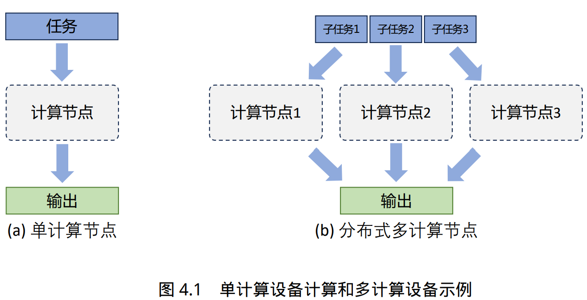

促使人们设计分布式训练系统的一个最重要的原因就是单个计算设备的算力已经不足以支撑 模型训练。

大语言模型参数量和所使用的数据量都非常巨大，因此都采用了分布式训练架构完成训练：

- 针对 GPT-3 的训练过程全部使用 NVIDIA V100 GPU
- OPT 使用了 992 块 NVIDIA A100 80G GPU，采用全分片数据并行（Fully Shared Data Parallel）以及 Megatron-LM 张量并行（Tensor Parallelism），整体训练时间将近 2 个月。
- BLOOM模型的训练一共花费 3.5 个 月，使用 48 个计算节点。每个节点包含 8 块 NVIDIA A100 80G GPU（总计 384 个 GPU），并且使 用 4*NVLink 用于节点内部 GPU 之间通信。节点之间采用四个 Omni-Path 100 Gbps 网卡构建的增 强 8 维超立方体全局拓扑网络进行通信。
- LLaMA 模型训练采用 A100-80GB GPU，LLaMA-7B 模型训练需要 82432 GPU 小时，LLaMA-13B 模型训练需要 135168 GPU 小时，LLaMA-33B 模型训练花费了 530432 GPU 小时，而 LLaMA-65B 模型训练花费则高达 1022362 GPU 小时。

## 并行策略

针对大语言模型多层神经网络的执行 过程，可以由一个计算图（Computational Graph）表示。这个图有多个相互连接的算子（Operator）， 每个算子实现一个神经网络层（Neural Network Layer），而参数则代表了这个层在训练中所更新的的权重。

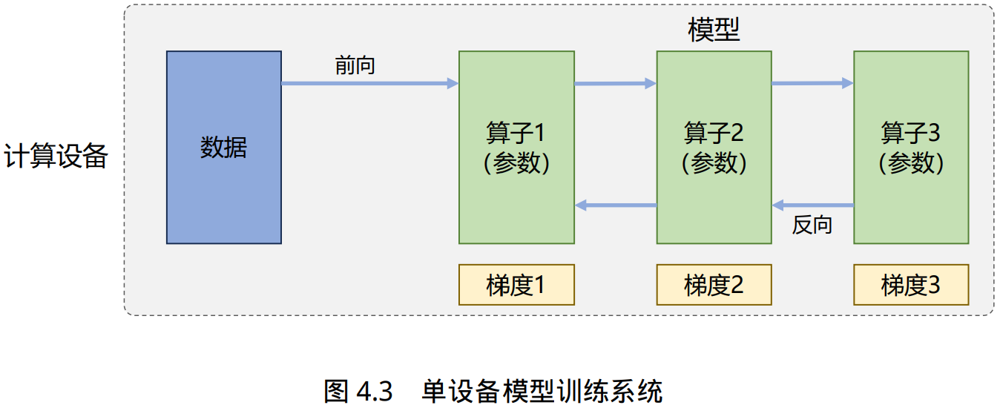

根据单设备模型训练系统的流程，可以看到如果进行并行加速，可以从数据和模型两个维度 进行考虑。

首先可以对数据进行切分（Partition），并将同一个模型复制到多个设备上，并行执行 不同的数据分片，这种方式通常被称为数据并行（Data Parallelism，DP）。

还可以对模型进行划分， 将模型中的算子分发到多个设备分别完成，这种方式通常被称为模型并行（Model Parallelism，MP） 。

当训练超大规模语言模型时，往往需要同时对数据和模型进行切分，从而实现更高程度的并行， 这种方式通常被称为混合并行（Hybrid Parallelism，HP）。

### 数据并行

在数据并行系统中，每个计算设备都有整个神经网络模型的完整副本（Model Replica），进行 迭代时，每个计算设备只分配了一个批次数据样本的子集，并根据该批次样本子集的数据进行网 络模型的前向计算。

前向计算完成后，每个计算设备都会根据本地样本计算损失误差得到梯度，并将本地梯度 Gi 进行广播。所有计算设备需要聚合其他加速度卡给 出的梯度值，然后使用平均梯度对模型进行更新，完成该批次训练。

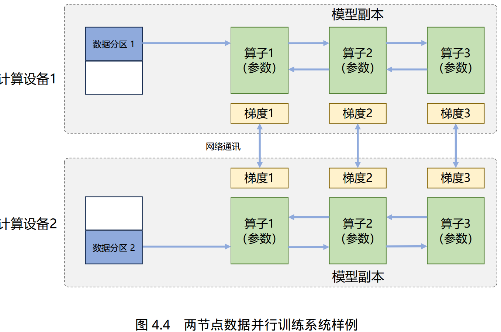

###  模型并行

以包含 1750 亿参数的 GPT-3 模型为例，如果模型中每一个参数都使用 32 位浮点数表示，那么模型需要占用 700GB（即 175G× 4 Bytes）内存，如果使用 16 位浮点表示，每个模型副本需要也需要占用 350GB 内存。

以 2022 年 3 月 NVIDIA 发布的 H100 加速卡也仅支持 80GB 显存，无法将整个模型完整放入其中。模 型并行可以从计算图角度，以下两种形式进行切分：

1. **按模型的层切分到不同设备**，即层间并行或算子间并行（Inter-operator Parallelism），也称之为**流水线并行**（Pipeline Parallelism，PP）；
2. **将计算图层内的参数切分到不同设备**，即层内并行或算子内并行（Intra-operator Parallelism），也称 之为**张量并行**（Tensor Parallelism，TP）。

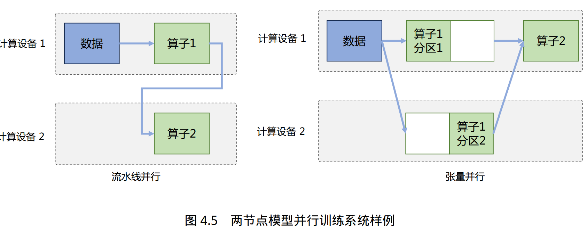

流水线并行（Pipeline Parallelism，PP）是一种并行计算策略，将模型的各个层分段处理，并将 每个段分布在不同的计算设备上，使得前后阶段能够流水式、分批进行工作。但是朴素流水线策略所产生的**并行气泡**，使得系统无法充分利用计算资源，降低了系统整体的计 算效率。

**张量并行**需要根据模型的具体结构和算子类型，解决如何将参数切分到不同设备，以及如何保证切分后数学一致性这两个问题。

大语言模型都是以Transformer 结构为基础，Transformer 结构主要由嵌入式表示（Embedding）、矩阵乘（MatMul）和交叉熵损失（Cross Entropy Loss）计算构成。这三种类型的算子有较大的差异，都需要设计对应的张量并行策略才可以实现将参数切分到不同的设备。

对于嵌入表示层的参数，可以按照词维度切分， 每个计算设备只存储部分词向量，然后通过汇总各个设备上的部分词向量，从而得到完整的词向量。

> 举例来说，如果词表数量是 64000，嵌入表示维度为 5120，类型采用 32 位精度浮点数，那么整层参数需要的显存大约为 64000 × 5120 × 4/1024/1024 = 1250MB，反向梯度 同样需要 1250MB，仅仅存储就需要将近 2.5GB。

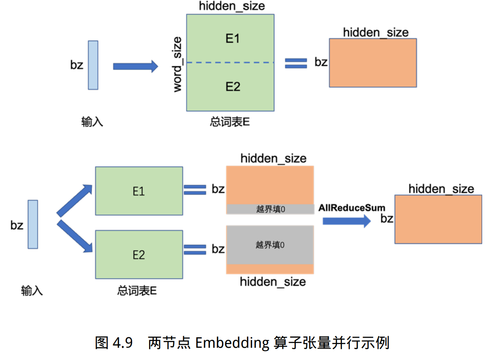

矩阵乘（MatMul）的张量并行要充分利用矩阵了分块乘法原理。

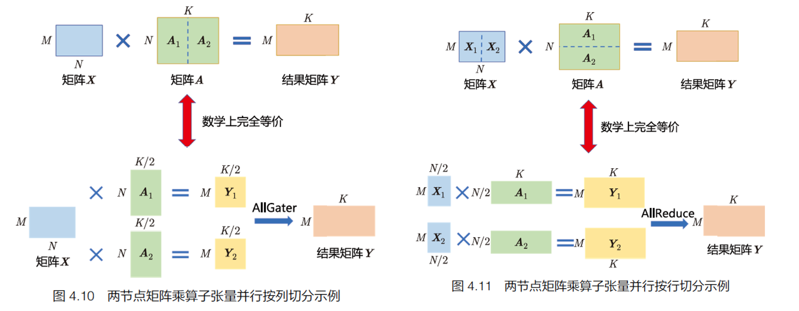

Transformer 中的FFN 结构与多头自注意力机制的张量并行示意如下：

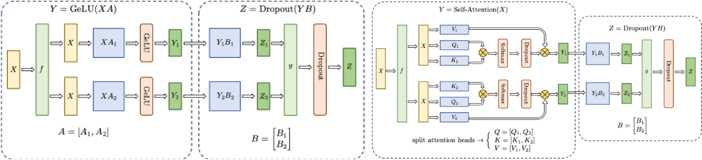

此外，分类网络最后一层一般会选用Softmax 和Cross_entropy 算子来计算交叉熵损失（Cross Entropy Loss）。如果类别数量非常大，则会导致单计算设备内存无法存储和计算logit 矩阵。针对这一类算子，可以按照类别维度切分，同时通过中间结果通信，得到最终的全局交叉熵损失。

### 混合并行

通常在每个服务器内部使用张量并行策略，由于该策略涉及的网络通信量较大，需要利用服务器内部的不同计算设备之间进行高速通信 带宽。

通过流水线并行，将模型的不同层划分为多个阶段，每个阶段由不同的机器负责计算。这样 可以充分利用多台机器的计算能力，并通过机器之间的高速通信来传递计算结果和中间数据，以 提高整体的计算速度和效率。

最后，在外层叠加数据并行策略，以增加并发数量，提升整体训练速度。通过数据并行，将训练数据分发到多组服务器上进行并行处理，每组服务器处理不同的数据 批次。这样可以充分利用多台服务器的计算资源，并增加训练的并发度，从而加快整体训练速度。

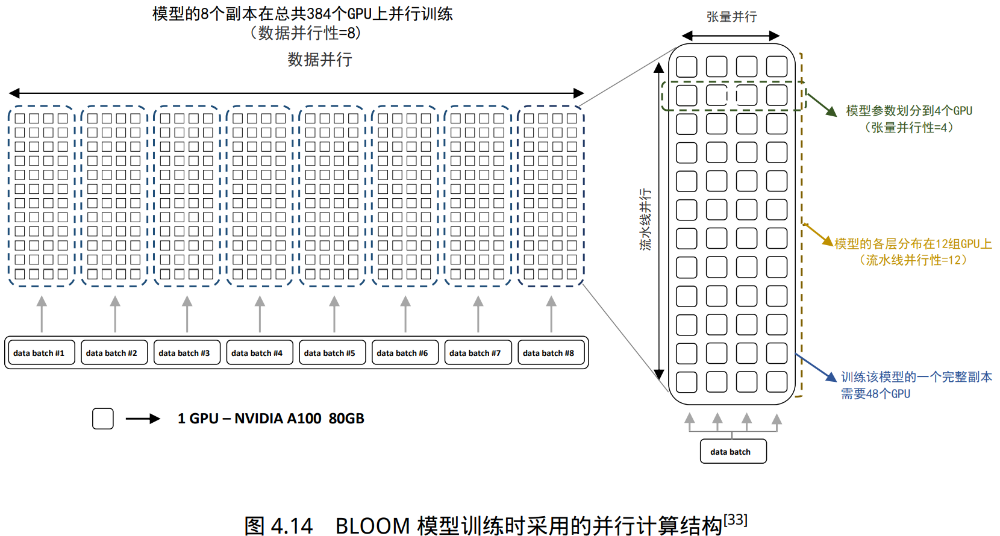

BLOOM 模型训练时采用的并行计算结构如图所示。BLOOM 模型训练使用了由 48 个 NVIDIA DGX-A100 服务器组成的 集群，每个 DGX-A100 服务器包含 8 张 NVIDIA A100 80GB GPU，总计包含 384 张。BLOOM 训 练采用的策略是首先将集群分为 48 个一组，进行数据并行。接下来，模型整体被分为 12 个阶段， 进行流水线并行。每个阶段的模型被划分到 4 张 GPU 中，进行张量并行。

## torch.distributed算子介绍

上面的张量并行示意图中我们看到了 all_reduce 操作，它来自torch.distributed（dist），是运行在一台或多台机器上的多个计算节点之间的**PyTorch 提供支持多进程并行性通信的原语**。他能轻松地并行化在跨进程和机器集群的计算。

- gather把其它进程的数据收集到目标进程，返回一个列表
- all_gather是将所有进程的数据收集起来，再分发给它们
- reduce把所有进程的数据加起来，发送给目标进程
- all_reduce把所有节点的值加起来，再分发给所有节点
- broadcast把某个节点的数据分发给所有节点
- scatter把某个进程上的列表数据逐个分发给其它所有进程

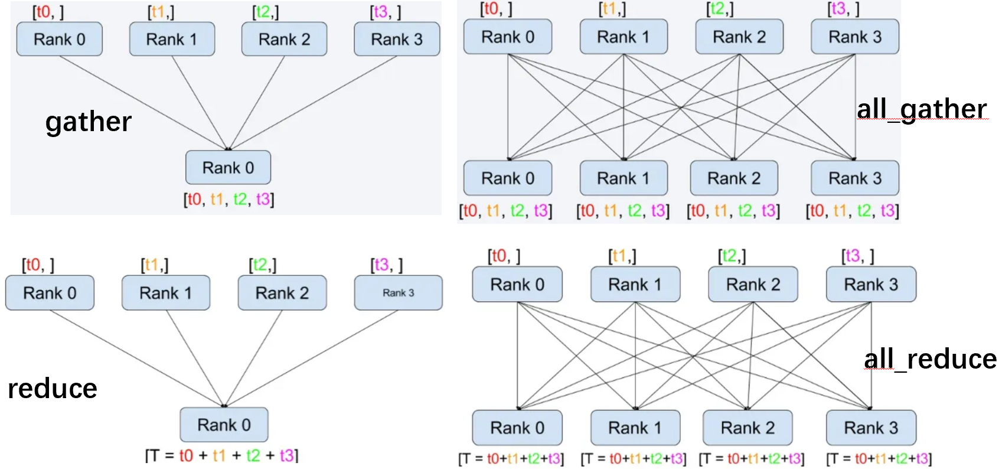

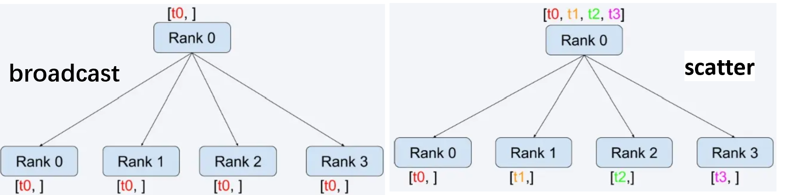

图中，Rank是分配给分布式进程组中每个进程的唯一标识符。它们始终是从 0 到 world_size 的连续整数。

##  分布式训练的集群架构

分布式训练需要使用由多台服务器组成的计算集群（Computing Cluster）完成。分布式训练集群属于高性能计算集群（High Performance Computing Cluster，HPC），其目标是提供是指以海量的计算能力。 

在由高速网络组成的高性能计算上构建分布式训练系统，主要有两种常见架构：参数服务器架构 （Parameter Server，PS）和去中心化架构（Decentralized Network）。

### 高性能计算集群硬件组成

典型的高性能计算集群的硬件组成如图所示。整个计算集群包含大量带有计算加速设备 的服务器。每个服务器中往往有多个计算加速设备（通常 2-16 个）。多个服务器会被放置在一个 机柜（Rack）中，服务器通过架顶交换机（Top of Rack Switch，ToR）连接网络。在架顶交换机满 载的情况下，可以通过在架顶交换机间增加骨干交换机（Spine Switch）进一步接入新的机柜。这 种连接服务器的拓扑结构往往是一个多层树（Multi-Level Tree）。

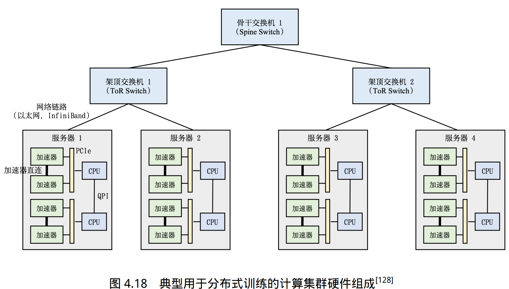

单个服务器内通常由 2 到 16 个计算加速设备组成，这些计算加速设备之间的通讯带宽也是影 响分布式训练的重要因素。

> 如果这些计算加速设备通过服务器 PCI 总线互联，会造成服务器内部计算加速设备之间通讯瓶颈。PCIe 5.0 总线也只能提供 128GB/s 的带宽，而 NVIDIA H100 采用高 带宽内存（High-Bandwidth Memory，HBM）可以提供 3350GB/s 的带宽。因此，服务器内部通常也采用了异构网络架构。

NVIDIA HGX H100 8 GPU 服务器，采用了 NVLink 和 NVSwitch（NVLink 交 换机）技术，如图所示。每个 H100 GPU 都有多个 NVLink 端口，并连接到所有四个 NVSwitch 上。每个 NVSwitch 都是一个完全无阻塞的交换机，完全连接所有 8 个 H100 计算加速卡。NVSwitch 的这种完全连接的拓扑结构，使得服务器内任何 H100 加速卡之间都可以达到 900GB/s 双向通信速度。

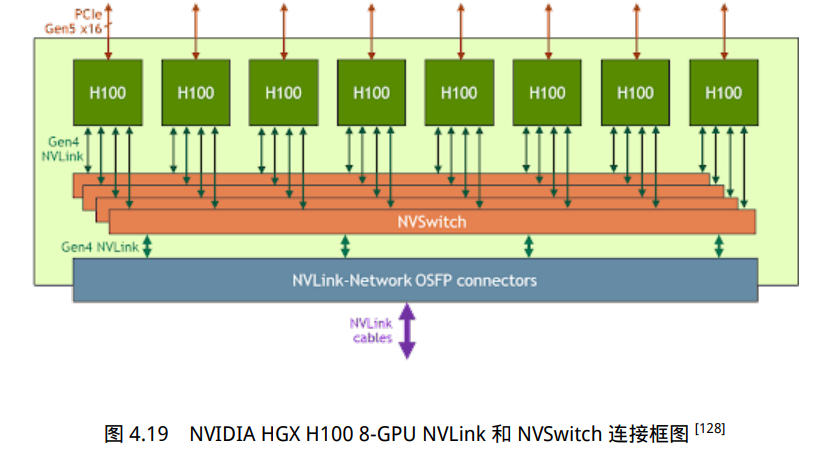

### 参数服务器架构

参数服务器（Parameter Server，PS）架构的分布式训练系统中有两种服务器角色：训练服务器 和参数服务器。参数服务器需要提供充足内存资源和通信资源，训练服务器需要提供大量的计算资源。

假设有一个可分为两个参数分区的模型，每个分区由一个参数服务器负责 进行参数同步。在训练过程中，每个训练服务器都拥有完整的模型，并根据将分配到此服务器的 训练数据集切片（Dataset Shard）进行计算，将得的梯度推送到相应的参数服务器。参数服务器会 等待两个训练服务器都完成梯度推送，然后开始计算平均梯度，并更新参数。之后，参数服务器 会通知训练服务器拉取最新的参数，并开始下一轮训练迭代。

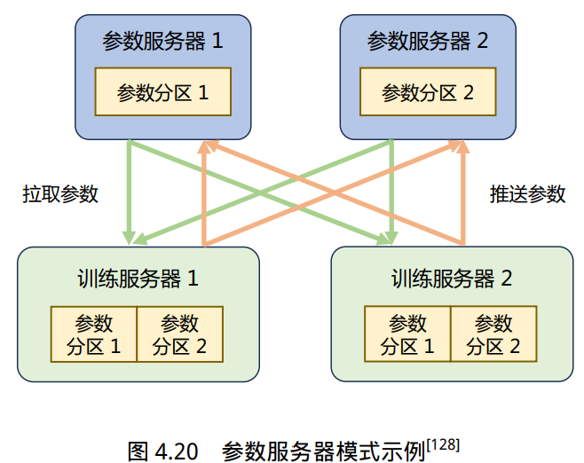

参数服务器架构分布式训练过程可以细分为同步训练和异步训练两种模式：

- 同步训练：训练服务器在完成一个小批次的训练后，将梯度推送给参数服务器。参数服务器 在接收到所有训练服务器的梯度后，进行梯度聚合和参数更新。
- 异步训练：训练服务器在完成一个小批次的训练后，将梯度推送给参数服务器。但是参数服 务器不再等待接收所有训练服务器的梯度，而是直接基于已接收到的梯度进行参数更新。

同步训练的过程中，因为参数服务器会等待所有训练服务器完成当前小批次的训练，有诸多的等 待或同步机制，导致整个训练速度较慢。异步训练去除了训练过程中的等待机制，训练服务器可 以独立地进行参数更新，训练速度得到了极大的提升。但是因为引入了异步更新的机制会导致训 练效果有所波动。

### 去中心化架构

去中心化（Decentralized Network）架构采用集合通信实现分布式训练系统。

在去中心化架构 中，没有中央服务器或控制节点，而是由节点之间进行直接通信和协调。这种架构的好处是可以减少通信瓶颈，提高系统的可扩展性。

由于节点之间可以并行地进行训练和通信，去中心化架构 可以显著降低通信开销，并减少通信墙的影响。

在分布式训练过程中，节点之间需要周期性地交 换参数更新和梯度信息。可以通过集合通信（Collective communication，CC）技术来实现。

分布式集群中网络硬件多种多样，包括以太网、InfiniBand 网络等。Pytorch 等深度学习框架通 常不直接操作硬件，而是使用通信库。常用的通信库包括 MPI、GLOO 和 NCCL 等。

一般而言，如果是在 CPU 集群上进行训练时，可选择使用 MPI 或 Gloo 作为通信库。

如果是在 GPU 集群上进行训练，因为 NCCL 则是 NVIDIA 基于自身硬件定制的，能做到更有针对性且更方便优化，故在 NVIDIA 硬件 上，NCCL 的效果往往比其它的通信库更好。

## 实验

大语言模型训练过程需要花费大量计算资源，LLaMA-2 70B模型训练时间为172万GPU小时，使用1024卡A100集群，需要花费70天时间。

分布式系统性能优化对于大语言模型训练就显得尤为重要。大语言模型训练所使用的高性能计算集群大都采用包含8卡A100 80GB SXM或者H100 80GB SXM的终端，服务器之间采用400Gb以上的高速InfiniBand网络，采用胖树网络结构。

2023年5月，NVIDIA发布了DGX GH200 超级计算机，使用NVLink Switch 系统，将 256 个 GH200 Grace Hopper 芯片和 144TB 的共享内存连接成一个计算单元，为更大规模的语言模型训练提供了硬件基础。

DeepSpeed、Megatron-LM、Colossal-AI等多种分布式训练框架都可以用于大语言模型训练。 由于目前大多数开源语言模型都是基于Huggingface Transformers开发，因为在分布式架构选择上需要考虑Huggingface Transformers的匹配。上述三种分布式架构对于Huggingface Transformers支持都较为方便。

此外，千亿以上大规模语言模型训练需要混合数据并行、流水线并行以及张量并行，其中张量并行需要对原始模型代码进行一定程度的修改。针对参数量300亿以下的模型，可以不使用张量并行，使用目前的分布式训练框架几乎可以不修改代码就可以实现多机多卡分布式训练。

大语言模型训练时的主要超参数包括批次大小（Batch Size）、学习率（Learning Rate）、优化器（Optimizer）。这些超参数的设置对于大语言模型稳定训练非常重要，训练不稳定很容易导致模型崩溃。

- 对于批次大小的设定，不同的模型所使用的数值差距很大，LLaMA-2 中使用的全局批次大小为4M 个词元，而在GPT-3 训练中GPT-3 的批大小从32K 逐渐增加到3.2M 个词元。
- 针对学习率调度策略，现有的大语言模型通常都引入热身（Warm-up）和衰减（Decay）策略。在训练的初始阶段（通常是训练量的0.1%∼0.5%）采用线性热身调度逐渐增加学习率，将其提高到最大值，最大值的范围大约在5 × 10−5 ∼ 1 × 10−4。此后，采用余弦衰减策略，逐渐将学习率降低到其最大值的约10%，直到训练损失收敛。
- 大语言模型训练通常使用Adam或AdamW 优化器，其所使用超参数设置通常为β1 = 0.9，β2 = 0.95，ϵ = 10−8。此外，为了稳定训练还需要使用权重衰减（Weight Decay）和梯度裁剪（Gradient Clipping）方法，梯度裁剪的阈值通常设置为1.0，权重衰减率设置为0.1。

## 显存占用估计

- FP32 占 32 bits，即 4 Byte
- FP16 占 16 bits，即 2 Byte
- 1GB=1024MB=$$1024^2$$KB=$$1024^3$$Byte

我们使用 Llama13B，batch size(b) 设置为1，sequence length(s) 设置为 1024，hidden size(h) 设置为 5120，attention head(a) 设置为40，层数(L) 设置为40。

- 对于 embedding，输入为FP16的 $$b*s*h$$，换算一下为10MB，输出也为10MB，输入输出一共20MB
- 对于模型本身参数，对于13B模型，1B为$$1000^3$$，而 1GB=1024Byte，对于FP16的模型参数，大致占用 13*2=26GB
- 对于Adam优化器，为每个参数保存梯度指数平滑值、梯度平方指数平滑值、以及模型参数，都为 FP32 格式（为了计算时保证精度）。三个部分都为 13*4=52GB，优化器一共占用156GB显存
- 对于模型前向传播的中间结果（激活值）缓存，这是为了方便计算损失的梯度。对于FP16，为 $$s*b*h*(34+5*a*s/h)$$ 大致为14.5GB。如果batch size为400w，组需要5800w的显存。
- 对于梯度值，为FP16，占用13*2=26GB
- 汇总以上，大约222.5GB

