# 有监督微调概述

有监督微调（Supervised Finetuning, **SFT**）又称指令微调（Instruction Tuning），是指在已经训练好的语言模型的基础上，通过使用有标注的特定任务数据进行进一步的微调，从而使得模型具备 遵循指令的能力。

经过海量数据预训练后的语言模型虽然具备了大量的“知识”，但是由于其训练时的目标仅是进行下一个词的预测，此时的模型还不能够理解并遵循人类自然语言形式的指令。 

> 例如，当你问 “中国的首都在哪里”，它可能接着问 “美国的首都在哪里”，而非直接给出答案。

为了能够使得模型具有理解并响应人类指令的能力，还需要使用指令数据对其进行微调。

对于神经网络的训练，关键在于网络结构、损失函数和训练数据质量。微调和预训练在网络结构上基本一致，损失函数也大致相同，最大的区别在于训练数据。

开源大模型通常会提供预训练版本和指令微调版本，厂商在进行指令微调时会使用特定格式的对话模板（Chat Template）。若要增强大模型在特定业务领域的能力，继续进行指令微调时，必须与原厂的对话模板保持一致，这样才能达到最佳的微调效果。

## 对话模板（Chat Template）

在指令微调过程中，会添加特殊的 token，让大模型明确这是在回答问题，并在回答结束时加上结束 token。如下， Llama 3.1 的 Chat Template，会在开始处添加序列开始符的 token，将不同角色信息放入对应的 ID 中，每个内容结束时添加序列结束符的 token

训练数据：

```text
[{"role": "system", "content": "You are a helpful assistant."},
{"role": "user", "content": "天空为什么是蓝色的？"},
{"role": "assistant", "content": "这是由于光的散射引起的。"}]

<|begin_of_text|>
<|start_header_id|>system<|end_header_id|> You are a helpful assistant.<|eot_id|>
<|start_header_id|>user<|end_header_id|> 天空为什么是蓝色的？ <|eot_id|>
<|start_header_id|>assistant<|end_header_id|> 这是由于光的散射引起的。<|eot_id|>
```

Hugging Face 接受的对话数据结构是一个列表，列表中的每个元素是一个字典，包含 “role” 和 “content” 两项内容。“role” 通常有 “system”（用于对大模型进行系统设定）、“user”（表示用户输入）和 “assistant”（表示大模型的回答）。每个大模型都有与之唯一对应的 tokenizer 和 Chat Template，这些信息通常存储在 tokenizer 的配置文件中。

> 训练的其他内容与预训练一样，例如，label 即 input_id 的 clone()

训练后的大模型，只要提供问题，并在生成聊天模板时设置，它就会生成特定的 token，引导大模型生成答案，最终输出答案和序列终止符。

推理：

```text
input:
[{"role": "system", "content": "You are a helpful assistant."},
{"role": "user", "content": "天空为什么是蓝色的？"}]

input with template:
<|begin_of_text|>
<|start_header_id|>system<|end_header_id|> You are a helpful assistant.<|eot_id|>
<|start_header_id|>user<|end_header_id|> 天空为什么是蓝色的？ <|eot_id|>
<|start_header_id|>assistant<|end_header_id|>

output of llm:
这是由于光的散射引起的。<|eot_id|>
```

## 只针对回答的微调（Completions Only）

在简单的指令微调训练中，输入给大模型的是整个对话，模型会对整个对话文本进行学习，并为每个输出的 token 计算损失。然而，系统提示部分在每个样本中都是相同的，重复计算其损失没有必要。为了让大模型将注意力集中在回答问题上，我们可以只对整个序列中的**答案部分**计算损失，这就是 Completions Only 方法。

具体实现方式是生成一个损失掩码（Loss Mask），用于标记哪些生成的 token 需要计算损失，哪些不需要。需要计算损失的 token 标记为 1，不需要的标记为 0。在计算损失时，将每个位置的损失乘以对应的 Loss Mask，从而忽略不需要计算损失的 token。

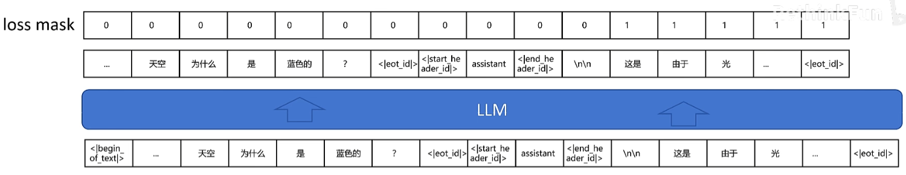

以 Llama 3.1 为例，根据开始回答部分前面的特殊 token 序列（如`start_head_id`、`Assistant`、`end_head_id`和两个换行符）来确定需要计算损失的 token 起始位置，该位置之后的 token 的 Loss Mask 为 1，之前的为 0。最后计算每个 token 的损失（对于一个位置，模型给出由logits给出的所有词的概率分布，然后通过 label 标准答案计算交叉熵损失），乘以对应的 Loss Mask，再取均值作为最终损失。

> 在计算机视觉领域，数据增强是提高模型泛化性和精度的重要手段，通过对图片进行旋转、反转、调整亮度等操作生成更多样本。在指令微调中，数据往往需要人工手动构造，采集成本高，对于大模型庞大的参数量而言，数据量显得不足。NeFTune 的思想就是对文本进行数据增强。
>
> token 进入大模型的第一步是进行嵌入（Embedding）操作。在 token Embedding 构成的向量空间中，语义相近的词（如 “漂亮” 和 “美丽”、“妻子” 和 “夫人”）距离相近。NeF Tune 通过给每个 token 的 Embedding 随机添加噪声，使原本句子中的 token 可能变成与之相近的 token，从而增加样本的丰富度，提高模型的精度和泛化性。

## 提示学习

提示学习（Prompt-based Learning）不同于传统的监督学习，它直接利用了在大量原始文本上进 行预训练的语言模型，并通过定义一个新的提示函数，使得该模型能够执行小样本甚至零样本学习，通常不需要参数更新，以适应仅有少量标注或没有标注数据的新场景。

使用提示学习来完成预测任务的流程如图所示，原始输入 x 经过一个模板，被 修改成一个带有一些未填充槽的文本提示 x ′，然后将这段提示输入语言模型，语言模型即以概率 的方式填充模板中待填充的信息，然后根据模型的输出即可导出最终的预测标签 $\hat{y}$。使用提示学 习完成预测的整个过程可以描述为三个阶段：提示添加、答案搜索、答案映射。

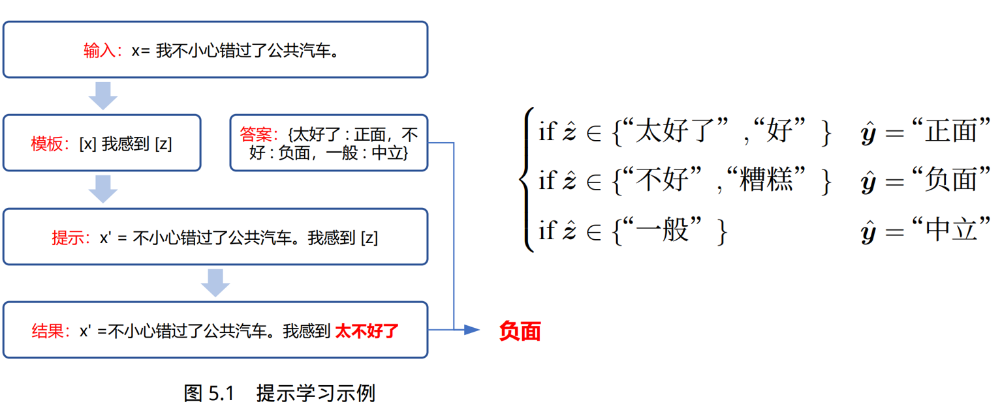

在分类任务中，还需要将模型的 输出与最终的标签做映射。而这些映射规则是人为制定的，比如，将“太好了”、“好”映射为“正 面”标签，将“不好”、“糟糕”映射为“负面”标签，将“一般”映射为“中立”标签。

此外，由于提示构建的目的是找到一种方法，从而使语言模型有效地执行任务，并不需要将 提示仅限制为人类可解释的自然语言。因此，也有研究连续提示的方法，即软提示（Soft Prompt），其直接在模型的嵌入空间中执行提示。具体来说，连续提示删除了两个约束：

1. 放松了模板 词的嵌入是自然语言词嵌入的约束。
2. 模板不再受限于语言模型自身参数的限制。相反，模板 有自己的参数，可以根据下游任务的训练数据进行调整。

## 语境学习

语境学习（Incontext Learning, ICL），也称上下文学习，其概念最早随着 GPT-3 的诞生而提出。 语境学习是指模型可以从上下文中的几个例子中学习：向模型输入特定任务的一些具体例子（也称示例（Demonstration））以及要测试的样例，模型可以根据给定的示例续写出测试样例的答案。

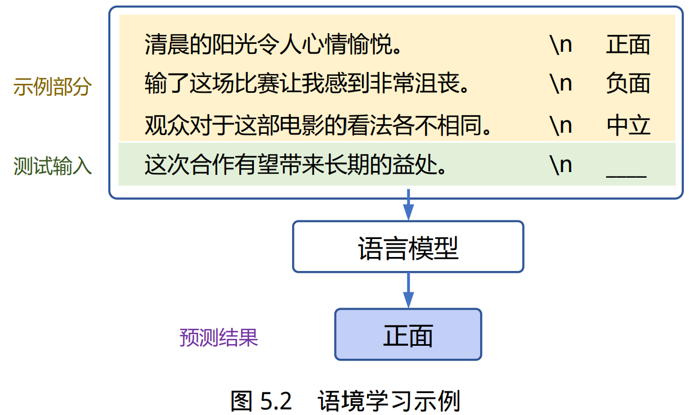

如图所示，以情感分类任务为例，向模型中输入一些带有情感极性的句子、每条句子相应的标 签、以及待测试的句子，模型可以自然地续写出它的情感极性为 “Positive”。语境学习可以看作是 提示学习的一个子类，其中示例是提示的一部分。语境学习的关键思想是从类比中学习，整个过 程并不需要对模型进行参数更新，仅执行向前的推理。大语言模型可以通过语境学习执行许多复杂的推理任务。

语境学习作为大语言模型时代的一种新的范式，具有许多独特的优势：

- 示例是用自 然语言编写的，这提供了一个可解释的界面来与大语言模型进行交互。
- 不同于以往的监督训练，语境学习本身无需参数更新，这可以大大降低使得大模型适应新任务的计算成本。

## 参数高效微调

> 参考：[知乎文章系列](https://zhuanlan.zhihu.com/p/635152813)

在上面的章节中我们看到了SFT微调。**SFT**（Supervised Fine-Tuning） 是指在监督数据集上进行的**有监督微调**。需要大量的高质量标注数据，由于通常要调整整个模型的所有参数，计算开销较大。所有的参数都会在微调过程中被更新。适用于那些拥有大量标注数据且需要在特定任务上达到高精度的场景。

由于大语言模型参数量十分庞大，当将其应用到下游任务时，微调全部参数需要相当高的算 力。相比而言，**PEFT** （Parameter-Efficient Fine-Tuning）是指通过仅调整模型的一部分参数来进行**参数高效微调**，从而减少微调的计算成本和数据需求。适用于需要在多个任务间快速切换且每个任务标注数据较少的场景。

高效微调技术可以粗略分为以下三大类：增加额外参数（A）、选取一部分参数更新（S）、引入重参数化（R）。而在增加额外参数这类方法中，又主要分为类适配器（Adapter-like）方法和软提示（Soft prompts）两个小类。

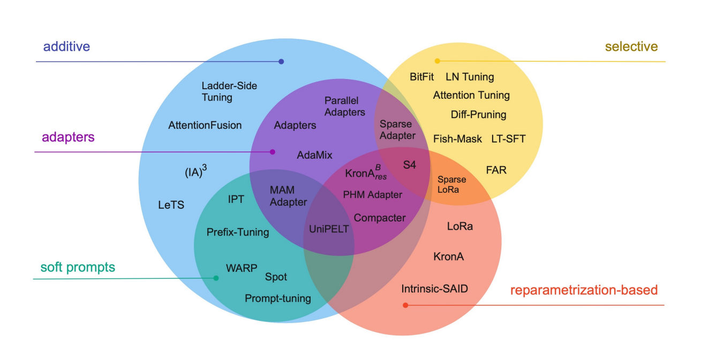

### Adapters 

Adapters（适配器）是最早发布的参数高效微调技术之一。在下图左侧，是修改后的 transformer 架构，增加了适配器层。可以看到在注意力层和前馈层之后添加了适配器层。在右侧，可以看到适配器层本身的架构。适配器层包括一个瓶颈架构，它接受输入并将其缩小到较小的维度表示，然后通过非线性激活函数传递它，然后将其缩放回输入的维度。这样可以确保 transformer 堆栈中的下一层能够接收来自适配器层的生成输出。

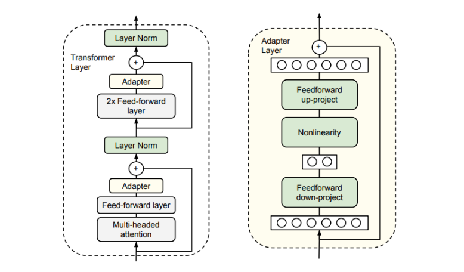

在论文中，作者表明，这种微调方法与完全微调相当，同时消耗更少的计算资源和训练时间。

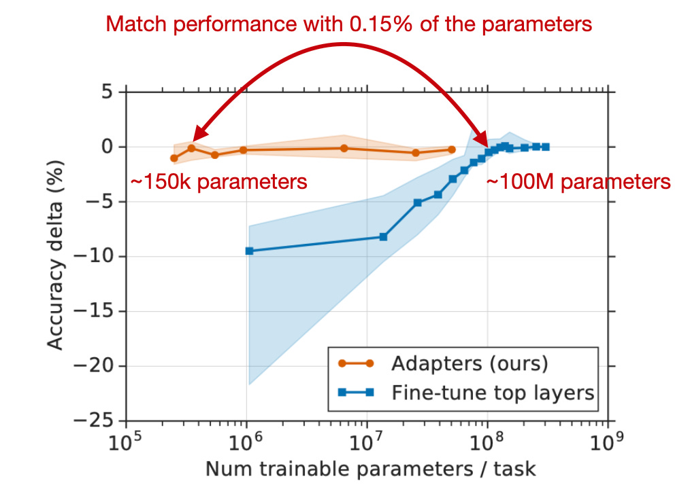

### LoRA

LoRA （Low-Rank Adaptation of Large Language Models）方法 可以在缩减训练参数量和 GPU 显存占用的同时，使训练后的模型具有与全量微调相当的性能。

语言模型针对特定任务微调之后，权重矩阵通常具有很低的本征秩 （Intrinsic Rank）。参数更新量即便投影到较小的子空间中，也不会影响学习的有效性。因此，提出固定预训练模型参数不变，在原本权重矩阵旁路添加低秩矩阵的乘积作为可训练参数，用以模拟参数的变化量：
$$
h=W_0x+ \triangle Wx=W_0x+ABx
$$
其中，预训练权重为 $W_0 ∈ R ^{d∗k}$，可训练参数为 ∆W = BA，其中 $B ∈ R ^{d∗r}, A ∈ R^{ r∗d}, r <d$。初始化时，矩阵 A 通过高斯函数初始化，矩阵 B 为 零初始化，使得训练开始之前旁路对原模型不造成影响，即参数改变量为 0。

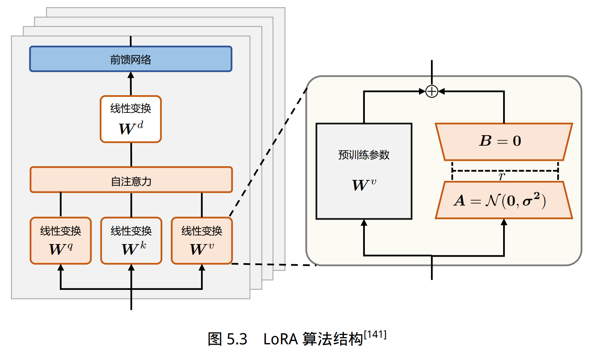

论文的作者表明，LoRA 仅占总可训练参数的 2% 即可胜过完全微调。

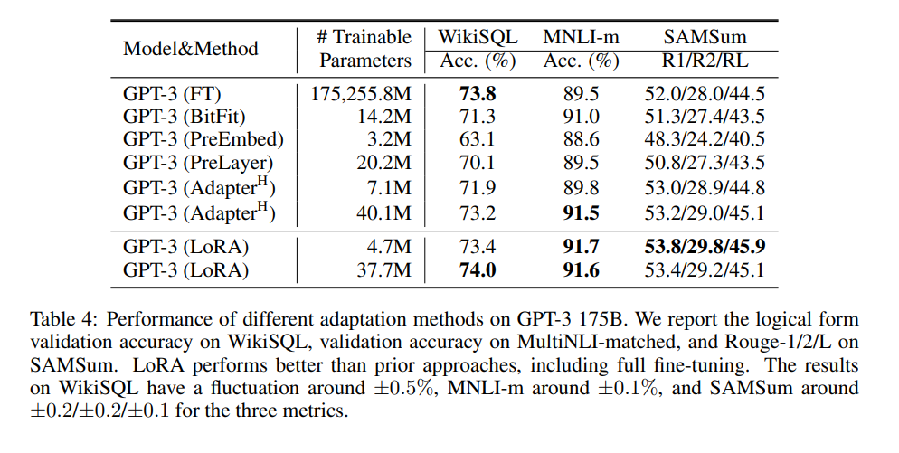

至于它训练的参数数量，我们在很大程度上可以使用秩 r 参数（一般设置为2、4、8、16等）来控制它。例如，假设权重更新矩阵有 100,000 个参数，A 是 200，B 是 500。权重更新矩阵可以分解为较小维度的较小矩阵，A 为 200 x 3，B 为 3 x 500。这仅为我们提供了 200 x 3 + 3 x 500 = 2100 个可训练参数，仅占参数总数的 2.1%。这可以进一步减少，因为我们可以决定仅将 LoRA 应用于特定层。在训练结束后，我们将 AB 相乘加到到原始矩阵中。

关于参数 alpha，上面的公式中，我们直接将 $$W_0x$$ 和 $$\triangle Wx$$ 相加，实际情况中，我们对权重进行调节，前向传播和权重合并的公式如下，一般设置alpha为 r 的2~8倍：
$$
h=W_0x+ \frac{\text{alpha}}{r}\triangle Wx
$$

$$
W=W_0+\frac{\text{alpha}}{r}\triangle W
$$

peft 库中含有包括 LoRA 在内的多种高效微调方法，且与 transformer 库兼容。

```python
from transformers import AutoModelForSeq2SeqLM
from peft import get_peft_config, get_peft_model, LoraConfig, TaskType

model_name_or_path = "bigscience/mt0-large"
tokenizer_name_or_path = "bigscience/mt0-large"

peft_config = LoraConfig(
	task_type=TaskType.SEQ_2_SEQ_LM, inference_mode=False, r=8, lora_alpha=32, lora_dropout=0.1
)

model = AutoModelForSeq2SeqLM.from_pretrained(model_name_or_path)
model = get_peft_model(model, peft_config)
```

get_peft_model 函数包裹了基础模型并得到一个 PeftModel 类的模型。其中一些主要方法包括仅将 Lora 参数设为可 训练，其余参数冻结；以及根据 config 中的参数从基础模型的 named_parameters 中 找出包含指定名称的模块（默认为“q”、“v”，即注意力模块的 Q 和 V 矩阵），创建一个新的自定 义类 Linear 模块，并替换原来的。

对于 GPT-3 模型，当 r = 4 且仅在注意力模块的 Q 矩阵和 V 矩 阵添加旁路时，保存的检查点大小减小了 10000 倍（从原本的 350GB 变为 35MB），训练时 GPU 显存占用从原本的 1.2TB 变为 350GB，训练速度相较全量参数微调提高 25%。

一些优化包括：

- AdaLoRA：在微调过程中根据各权重矩阵对下游任务的重要性动态调整秩的大小。
- QLoRA：通过将预训练模型量化为 4-bit 以进一步节省计算开销。

### Prompt Tuning

在输入序列前，额外加入一组伪 Embedding 向量，freeze输入的文本向量和模型内部参数，只训练这组伪 Embedding，从而达到参数微调的效果，但是当数据量比较大时有局限性

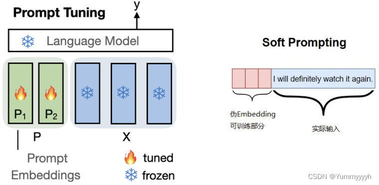

### Prefix Tuning

在Prefix Tuning之前的工作主要是人工设计离散的模版或者自动化搜索离散的模版。对于人工设计的模版，模版的变化对模型最终的性能特别敏感，加一个词、少一个词或者变动位置都会造成比较大的变化。而对于自动化搜索模版，成本也比较高；同时，以前这种离散化的token搜索出来的结果可能并不是最优的。

除此之外，传统的微调范式利用预训练模型去对不同的下游任务进行微调，对每个任务都要保存一份微调后的模型权重，一方面微调整个模型耗时长；另一方面也会占很多存储空间。

基于上述两点，Prefix Tuning提出固定预训练LM，为LM添加可训练，任务特定的前缀，这样就可以为不同任务保存不同的前缀，微调成本也小；同时，这种Prefix实际就是连续可微的Virtual Token（Soft Prompt/Continuous Prompt），相比离散的Token，更好优化，效果更好。

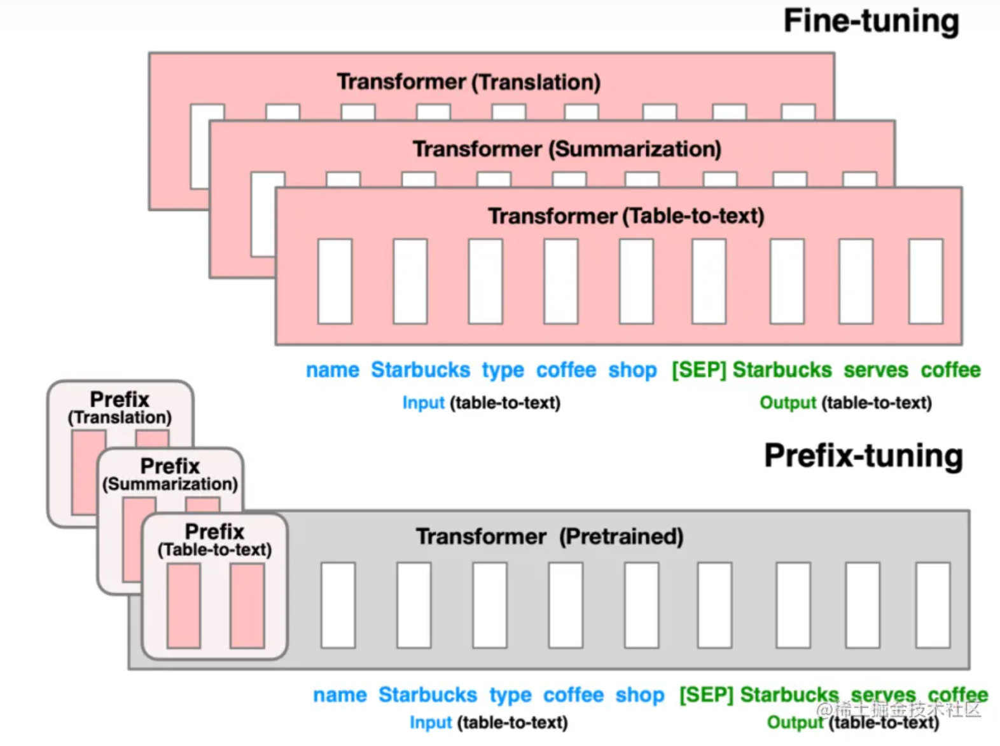

针对不同的模型结构，需要构造不同的Prefix。

- 针对自回归架构模型：在句子前面添加前缀，得到 `z = [PREFIX; x; y]`，合适的上文能够在固定 LM 的情况下去引导生成下文（比如：GPT3的上下文学习）。
- 针对编码器-解码器架构模型：Encoder和Decoder都增加了前缀，得到 `z = [PREFIX; x; PREFIX0; y]`。Encoder端增加前缀是为了引导输入部分的编码，Decoder 端增加前缀是为了引导后续token的生成。

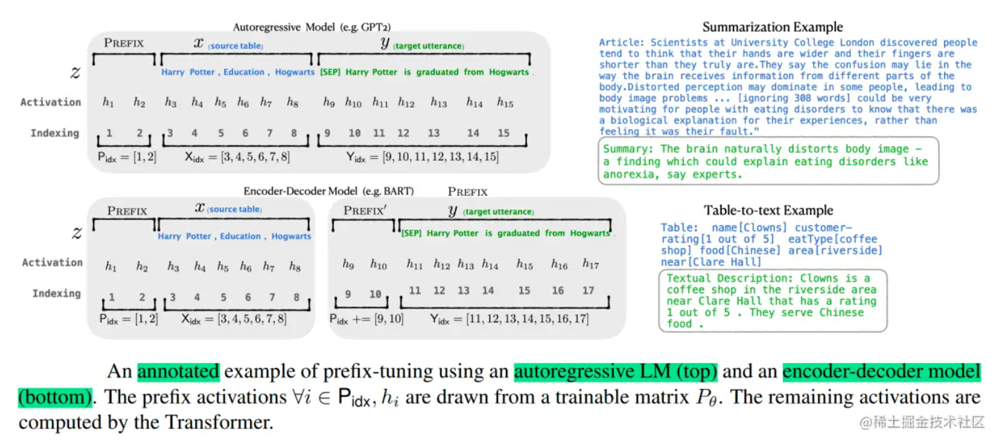

该方法其实和构造Prompt类似，只是Prompt是人为构造的“显式”的提示，并且无法更新参数，而Prefix则是可以学习的“隐式”的提示。

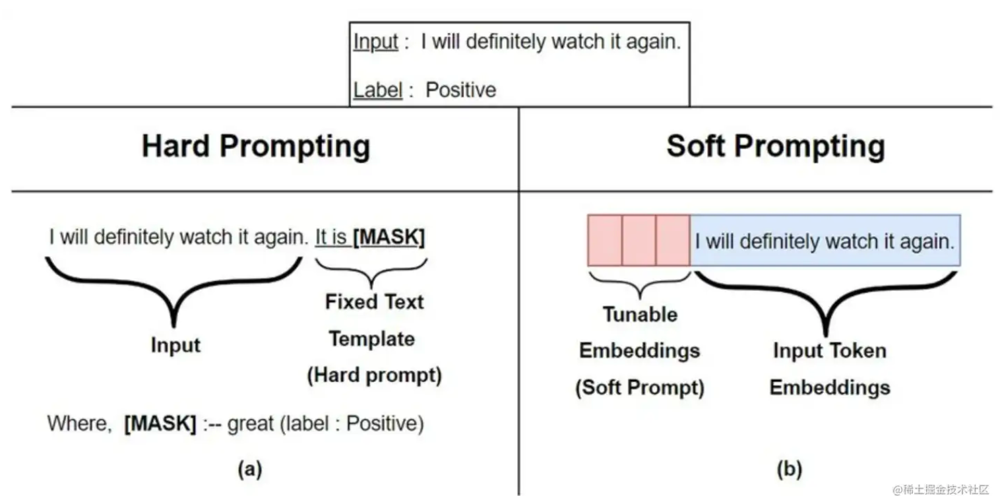

同时，为了防止直接更新Prefix的参数导致训练不稳定和性能下降的情况，在Prefix层前面加了MLP结构，训练完成后，只保留Prefix的参数。

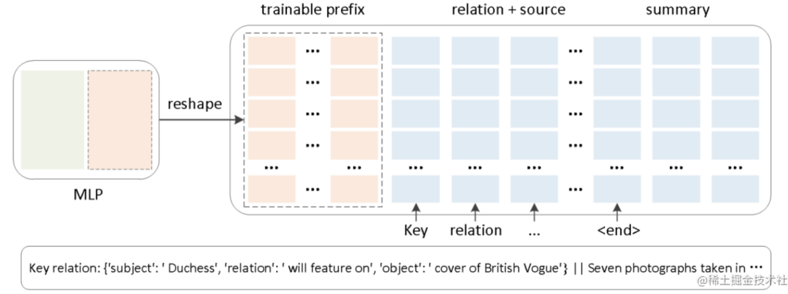

除此之外，通过消融实验证实，只调整embedding层的表现力不够，将导致性能显著下降，因此，在每层都加了prompt的参数，改动较大。

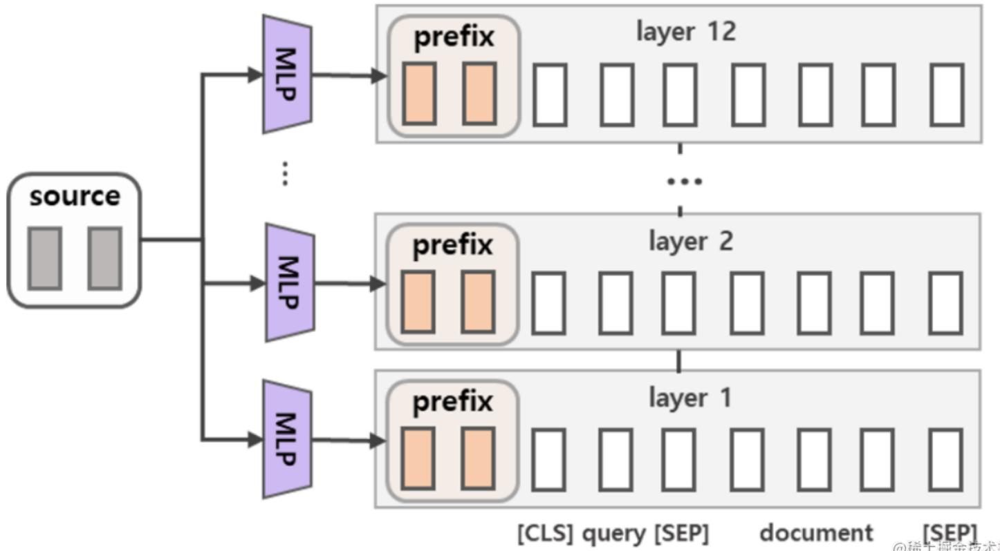

### P-Tuning

与Prefix-Tuning类似（同样的动机和方法），P-Tuning设计了一种连续可微的virtual token。

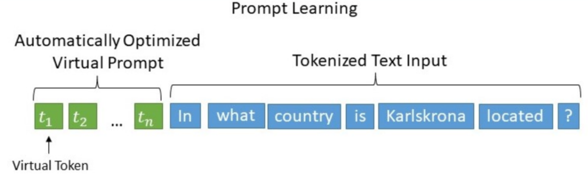

技术实现上，P-Tuning（论文：**GPT Understands, Too**），该方法将Prompt转换为可以学习的Embedding层，并用MLP+LSTM的方式来对Prompt Embedding进行一层处理。

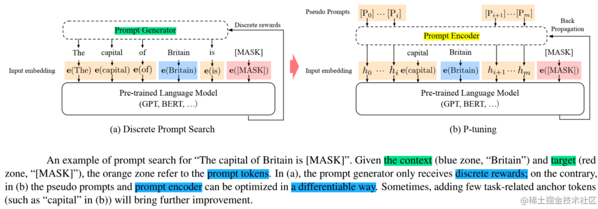

相比Prefix Tuning，P-Tuning加入的可微的virtual token，但仅限于输入层，没有在每一层都加；另外，virtual token的位置也不一定是前缀，插入的位置是可选的。这里的出发点实际是把传统人工设计模版中的真实token替换成可微的virtual token。

> 简而言之，提示编码器只是更改传递的提示的嵌入以更好地表示任务，其他一切都保持不变。

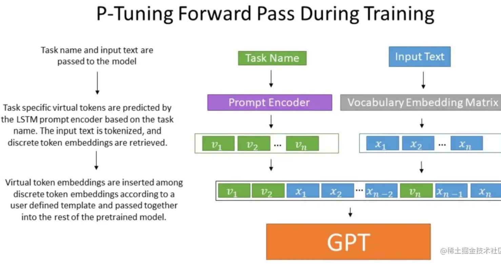

经过预训练的LM的词嵌入已经变得高度离散，如果随机初始化virtual token，容易优化到局部最优值，而这些virtual token理论是应该有相关关联的。因此，作者通过实验发现用一个prompt encoder来编码会收敛更快，效果更好。即用一个LSTM+MLP去编码这些virtual token以后，再输入到模型。从对比实验证实看出，P-Tuning获得了与全参数一致的效果。甚至在某些任务上优于全参数微调。

### P-Tuning v2

之前的Prompt Tuning和P-Tuning等方法存在两个主要的问题：

第一，缺乏模型参数规模和任务通用性。

- 缺乏规模通用性：Prompt Tuning论文中表明当模型规模超过100亿个参数时，提示优化可以与全量微调相媲美。但是对于那些较小的模型（从100M到1B），提示优化和全量微调的表现有很大差异，这大大限制了提示优化的适用性。
- 缺乏任务普遍性：尽管Prompt Tuning和P-tuning在一些 NLU 基准测试中表现出优势，但提示调优对硬序列标记任务（即序列标注）的有效性尚未得到验证。

第二，缺少深度提示优化，在P-tuning中，连续提示只被插入transformer第一层的输入embedding序列中，在接下来的transformer层中，插入连续提示的位置的embedding是由之前的transformer层计算出来的，这可能导致两个可能的优化挑战。

- 由于序列长度的限制，可调参数的数量是有限的。
- 输入embedding对模型预测只有相对间接的影响。

考虑到这些问题，作者提出了Ptuning v2，它利用深度提示优化（如：Prefix Tuning），对Prompt Tuning和P-Tuning进行改进，作为一个跨规模和NLU任务的通用解决方案。

具体实现上，P-Tuning v2（论文： **P-Tuning v2: Prompt Tuning Can Be Comparable to Fine-tuning Universally Across Scales and Tasks**），该方法在每一层都加入了Prompts tokens作为输入，而不是仅仅加在输入层，这带来两个方面的好处：

- 更多可学习的参数（从P-tuning和Prompt Tuning的0.01%增加到0.1%-3%），同时也足够参数高效。
- 加入到更深层结构中的Prompt能给模型预测带来更直接的影响。

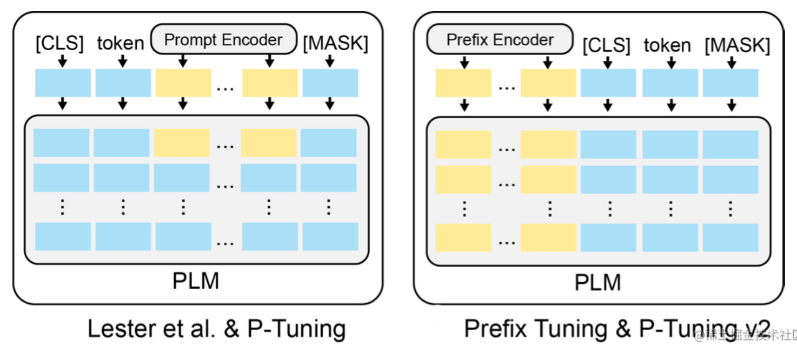

具体做法基本同Prefix Tuning，可以看作是将文本生成的Prefix Tuning技术适配到NLU任务中，然后做了一些改进：

- **移除重参数化的编码器**。以前的方法利用重参数化功能来提高训练速度和鲁棒性（如：Prefix Tuning中的MLP、P-Tuning中的LSTM）。在 P-tuning v2 中，作者发现重参数化的改进很小，尤其是对于较小的模型，同时还会影响模型的表现。
- **针对不同任务采用不同的提示长度**。提示长度在提示优化方法的超参数搜索中起着核心作用。在实验中，我们发现不同的理解任务通常用不同的提示长度来实现其最佳性能，这与Prefix-Tuning中的发现一致，不同的文本生成任务可能有不同的最佳提示长度。
- **引入多任务学习**。先在多任务的Prompt上进行预训练，然后再适配下游任务。多任务学习对我们的方法来说是可选的，但可能是相当有帮助的。一方面，连续提示的随机惯性给优化带来了困难，这可以通过更多的训练数据或与任务相关的无监督预训练来缓解；另一方面，连续提示是跨任务和数据集的特定任务知识的完美载体。我们的实验表明，在一些困难的序列任务中，多任务学习可以作为P-tuning v2的有益补充。
- **回归传统的分类标签范式，而不是映射器**。标签词映射器（Label Word Verbalizer）一直是提示优化的核心组成部分，它将one-hot类标签变成有意义的词，以利用预训练语言模型头。尽管它在few-shot设置中具有潜在的必要性，但在全数据监督设置中，Verbalizer并不是必须的。它阻碍了提示调优在我们需要无实际意义的标签和句子嵌入的场景中的应用。因此，P-Tuning v2回归传统的CLS标签分类范式，采用随机初始化的分类头（Classification Head）应用于tokens之上，以增强通用性，可以适配到序列标注任务。

## 位置编码

随着更多长文本建模需求地出现，包括多轮对话、长文档摘要等任务在实际应用中越来越多， 这些任务需要模型能够更好地处理超出常规上下文窗口大小的文本内容。尽管当前的大型语言模 型在处理短文本方面表现出色，但在支持长文本建模方面仍存在一些挑战，这些挑战包括预定义 的上下文窗口大小限制。

以 Meta AI 在 2023 年 2 月开源的 LLaMA 模型为例，其规定输入文本 的词元数量不得超过 2048 个。这会限制模型对于长文本的理解和表达能力。当涉及长时间对话或 摘要长文档时，传统的上下文窗口大小可能无法捕捉到全局语境，从而导致信息丢失或模糊的建 模结果。

我们先介绍Transformer中的Sinusoidal位置编码，然后介绍扩展语言模型的长文本建模能力的一些方法。

### Sinusoidal位置编码

Transformer在做attention的时候，output 是 value 的 加权和（权重是 query 和 key 之间的距离，和 序列信息 无关）。attention 不会有时序信息。 因此，根本不看 key - value 对在序列哪些地方。一句话把顺序任意打乱之后，attention 出来，结果都是一样的。顺序会变，但是值不会变，有问题！ 

需要加入时序信息。 如果使用RNN，把上一时刻的输出 作为下一个时刻的输入，来传递时序信息。 attention 在输入里面加入时序信息，叫做 positional encoding。公式为：

$$
PE_{(pos,2i)} = sin(\frac{pos}{n^{2i/d_{model}}})
$$

$$
PE_{(pos,2i+1)} = cos(\frac{pos}{n^{2i/d_{model}}})
$$

- $$d_{model}$$：输出嵌入空间的维度，如果一个词在嵌入层是一个长度为512的向量，那么使用一个长为512的向量来表示一个位置的数字。
- $$n$$：用户定义的标量，由 Attention Is All You Need 的作者设置为 10,000。

在上面的表达式中，可以看到偶数位置对应于正弦函数，奇数位置对应于余弦函数。为了理解上面的表达式，我们以短语“I am a robots”为例，其中 n=100，d=4。下表显示了该短语的位置编码矩阵。事实上，对于任何 n=100 且 d=4 的四字母短语，位置编码矩阵都是相同的。

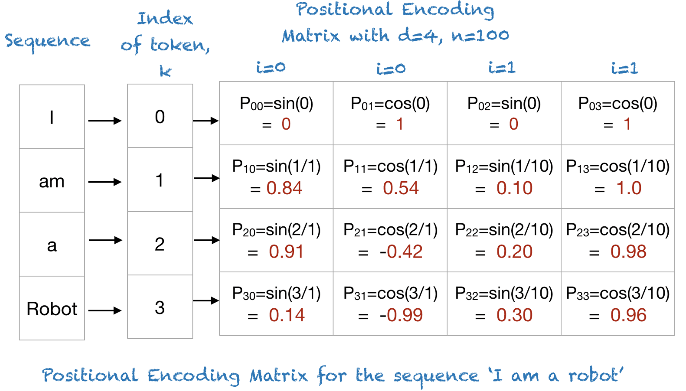

让我们将位置矩阵可视化为更大的值。按照原始论文中的方法设置 n=10000，d=512，length=100，将得到以下结果：


为了理解位置编码，我们首先查看 n=10,000 和 d=512 的不同位置的正弦波。横轴可以看作公式中的 i ，纵轴为输出的位置编码的值：

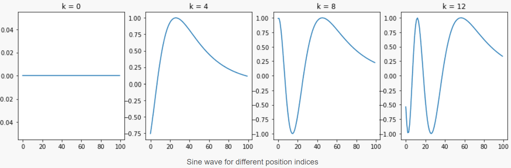

- 正弦波的波长形成几何级数，并从 $$2\pi$$ 到 $$2\pi n$$ 变化
- 正弦和余弦函数的值在 [-1, 1] 范围内，这将位置编码矩阵的值保持在标准化范围内
- 这样编码可以表示相对位置，即关注一个token与另一个token距离差几个token。比如：位置1和位置2的距离比位置3和位置10的距离更近，位置1和位置2与位置3和位置4都只相差1。

可以证明：

$$
PE_{pos} \cdot PE_{pos+k} = \sum_{i=0}^{\frac{d}{2}-1}cos(\frac{k}{n^{2\times i /d}})
$$

相乘后的结果为一个余弦的加和。这里影响值的因素就是k。如果两个token的距离越大，也就是k越大，根据余弦函数的性质可以知道，两个位置向量的相乘结果越小。这样的关系可以得到，如果两个token距离越远则乘积的结果越小。

将这个东西与词向量相加，就得到了含有时序信息的向量。

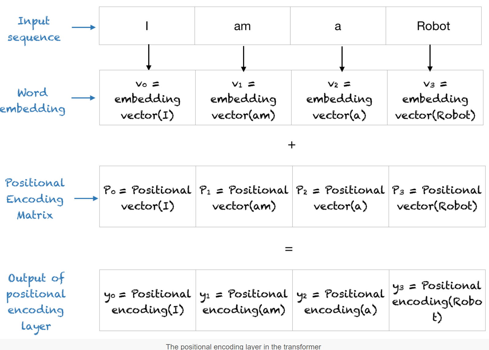

如何直观理解？我们可以想一下时间是怎么表示的。最常用的肯定还是用 小时，分钟，秒来表示。那么 03:14:15 时刻过了 3小时 3 分钟 3秒，变成了 06:17:18。我们如果有钟表的话，会看到时针转了360 * 3/12度，分针转了 360 * 3/60 度，秒针转了 360 * 3 / 60 度。当然都是顺时针转的。

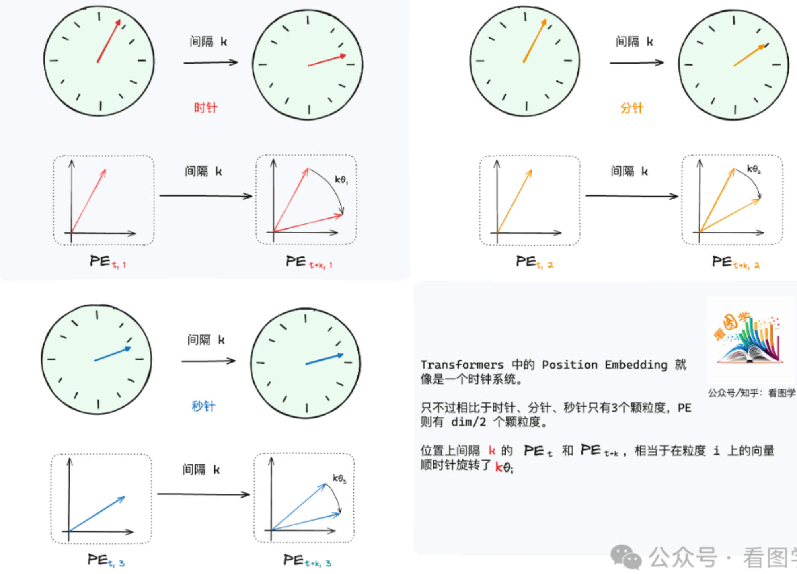

Sinusoidal Position Embedding 就像是一个时钟系统。只不过钟表只有小时、分钟、秒这三个粒度，而 Sinusoidal Position Embedding 有 dim_size / 2 个粒度。第i个粒度的旋转角度是 $$\theta_i$$

### 训练+微调

很显然，绝对位置编码的一个最朴素方案是不特意去设计什么，而是直接将位置编码当作可训练参数，比如最大长度为512，编码维度为768，那么就初始化一个512×768512×768的矩阵作为位置向量，让它随着训练过程更新。现在的BERT、GPT等模型所用的就是这种位置编码。

对于这种训练式的绝对位置编码，一般的认为它的缺点是没有外推性，即如果预训练最大长度为512的话，那么最多就只能处理长度为512的句子，再长就处理不了了。当然，也可以将超过512的位置向量随机初始化，然后继续微调。

增加上下文窗口的微调，即通过使用一个更长的上下文窗口来微调现有的 预训练 Transformer，以适应长文本建模需求。

然而，增加上下文窗口微调的方式训练的模型，对于长上下文的适应速度较慢。在 经过了超过 10000 个批次的训练后，模型上下文窗口只有小幅度的增长，从 2048 增加到 2560。实验结果显示这种朴素的方法在扩展到更长的上下文窗口时效率较低。

### 具有外推能力的位置编码

位置编码的长度外推能力来源于位置编码中表征相对位置信息的部分，相对位置信息不同于 绝对位置信息，对于训练时的依赖较少。位置编码的研究一直是基于 Transformer 结构的模型重点。

2017 年 Transformer 结构提出时，介绍了两种位置编码，这两种最初的形式都是绝对位置编码的形式，依赖于训练过程 中的上下文窗口大小，在推理时基本不具有外推能力。

2021 年提出的 Rotary Position Embedding （**RoPE**）在一定程度上缓解了绝对位置编码外推能力弱的问题。

在 T5 架构中提出了 T5 Bias Position Embedding，直接在 Attention Map 上操作，对于不同距离的查询和键学习一个偏置的 标量值，将其加在注意力分数上，并在每一层都进行此操作，从而学习了一个相对位置的编码信 息。这种相对位置编码的外推性能较好，可以在 512 的训练窗口上外推 600 左右的长度。

受到 T5 Bias 的启发，Press 等人提出了 ALiBi 算法。是一种预定义的相对位置编码。ALiBi 并不在 Embedding 层添加位置编码，而在 Softmax 的结果后添加一个静态的不可学习的偏置项。它对远程查询-键对之间的注意力分数进行惩罚，随着键和查 询之间的距离增加，惩罚增加。不同的注意头以不同的速率增加其惩罚，这取决于斜率幅度。实 验证明这组斜率参数适用于各种文本领域和模型尺寸，不需要在新的数据和架构上调整斜率值。

### RoPE

绝对位置编码是一个顺时针旋转的钟表系统，这个信息会与输入相加。但是旋转位置编码（RoPE）是一个逆时针旋转的时钟系统，并没有采用相加的方式，**而是直接将输入进行了旋转**。

在Transformer架构中，对于输入的每个token，都会有一个与其位置对应的RoPE位置编码。这个编码是通过一个**固定的公式计算得出的**，而不是通过模型学习得到的。

它将每个位置编码为一个旋转矢量。当一个向量乘以旋转矩阵 $$R(\theta)$$，其几何意义为逆时针旋转 $$\theta$$ 角度
$$
\begin{align}
&\begin{bmatrix} r\cos\alpha & r\sin\alpha \end{bmatrix}
\begin{bmatrix}
\cos\theta & \sin\theta \\
-\sin\theta & \cos\theta
\end{bmatrix}
\\
&=
\begin{bmatrix}
r\cos\alpha \cos\theta - r\sin\alpha \sin\theta & r\cos\alpha \sin\theta + r\sin\alpha \cos\theta
\end{bmatrix}
\\
&=
\begin{bmatrix}
r\cos(\alpha+\theta) & r\sin(\alpha+\theta)
\end{bmatrix}
\end{align}
$$
介绍旋转矩阵 $$R(\theta)$$ 的两个性质，证明略

- $$R(\theta_1)R(\theta_2)=R(\theta_1+\theta_2)$$
- $$R(\theta)^T=R(-\theta)$$

假设 $$q=[q_1, q_2],k=[k_1,k_2]$$，简单相乘是没有位置信息的
$$
\text{attention}(q,k)=q\cdot k=qk^T
$$
如果我们旋转后再点乘，则带有相对位置信息。$$(m-n)$$为两者的相对位置
$$
\begin{align*}
q R(m) \cdot k R(n) &= q R(m) R(n)^{T} k^{T} \\
                    &= q R(m) R(-n) k^{T} \\
                    &= q R(m - n) k^{T}
\end{align*}
$$
如上我们只考虑了二维空间，那么高维空间呢？我们可以将维度两两一组（任意两个一组都可以）进行旋转，每组在它们两个特征组成的子空间内进行旋转

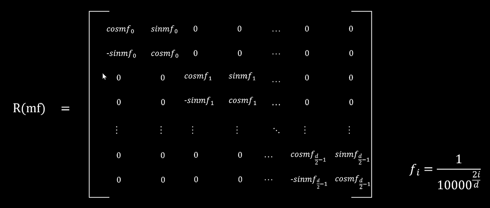

- m 代表位置，对于第一个 token，m 就是 1。
- f 代表频率，最大的频率为1，频率大则波长短，我们为不同的子空间赋予了不同的频率，相当于在旋转的时候既有时针，还有分针和秒针等。例如下图，左边是频率大的子空间，右边是频率小的子空间，他们一起决定了一个token的具体位置信息。

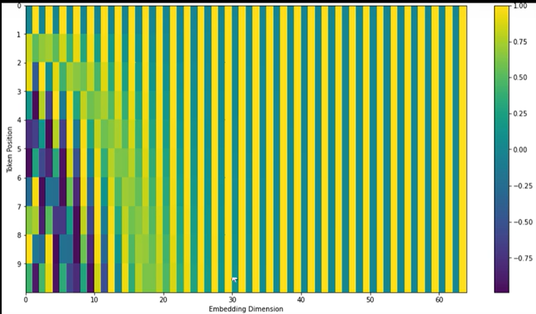

这样可以使得模型在自注意力机制中感知到相对位置信息。

### 插值法

关键思想是，直接缩小位置索引，使最大位置索引与预训练阶段的上下文窗口限制相匹配。

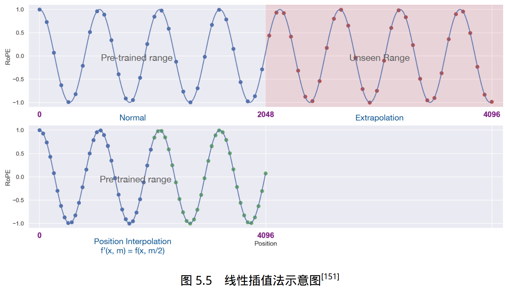

线性插值法具有良好的数值稳定性，并且不需 要修改模型架构，只需要少量微调（例如，在 pile 数据集上进行 1000 步的微调）即可将 LLaMA 的上下文窗口扩展到 32768。

## 指令数据构建

指令数据的质量会直接影响到有监督微调的最终效果，所以指令数据的构建应当是一个非常 精细的过程。从获得来源上来看，构建指令数据的方法可以分为手动构建指令和利用大模型的生 成能力自动构建指令两种。

**手动构建指令**的方法比较直观，可以在网上收集大量的问答数据再人为加以筛选过滤，或者 使用标注人员直接手动编写提示与相应的回答。虽然这是一个比较耗费人力的过程，但其优势在 于可以很好的把控指令数据的标注过程，并对整体质量进行很好的控制。 

指令数据的质量和多样性通常被认为是衡量指令数据的两个最重要的维度。LlMA 研究在 一定程度上说明了高质量、多样性丰富的指令数据可以“以少胜多”（Less is More）。

手动构建指令数据代价高昂，需要大量的人力投入。因此，一些研究尝试寻找更高效的替代 方法。具有代表性的工作如 Self-Instruct，利用大模型的生成能力**自动生成指令**。

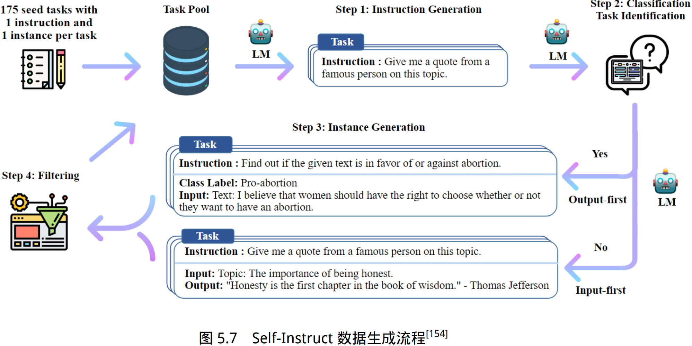

关于生成任务指令，需要手动构建一个包含 175 个任务的小型指令数据集合，称为种子指令集，用于初始化指令池。然后让模型以自举（Bootstrapping）的方式，利用指令池，生成新任务的指令：每次从指令池中采样 8 个任务指令（其中 6 条来自人工编写的种子指令，2 条是模型迭代生成的），将其拼接为上下文示例，引导预训练语言模型 GPT-3 生成更多的新的任务的指令，直到模型自己停止生成，或达到 模型长度限制，或是在单步中生成了过多示例（例如当出现了“Task 16”时）。

对于非分类任务，使用输入优先的方法，先根据任务产生输入，然后根据任务指 令和输入，生成输出；而对于分类任务，为了避免模型过多的生成某些特定类别的输入（而忽略 的其他的类别），使用输出优先的方法，即先产生所有可能的输出标签，再根据任务指令和输出，补充相应的输入。

为了保证数据的多样性，在将新生成的指令数据加入到指令池之前，首先需要衡量它和池中 已有指令数据的相似度，只有当它和池中任何一条指令数据的 ROUGE-L 相似度都低于 0.7 的时 候，才可能会被加入到指令池中。为保证数据的质量，还制定了一系列的启发式规则进行筛选：删 除掉包含某些关键词（如“图片”）的指令数据、重复的指令数据、过长或过短的数据等。

此外，还有很多**开源指令数据集**可供选择。

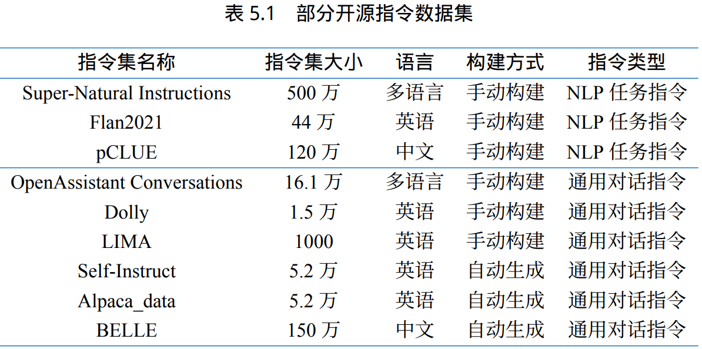