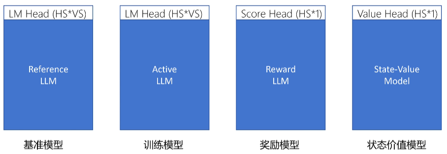
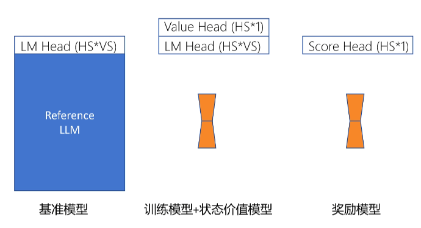
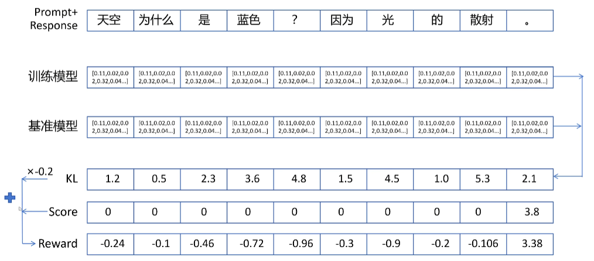

# 强化学习与LLM

OpenAI 所做的报告《Reinforcement Learning from Human Feedback: Progress and Challenges》分享了强化学习在大语 言模型上的重要作用，可以概括为以下几个方面。

**强化学习比有监督学习更可以考虑整体影响**：有监督学习针对单个词元进行反馈，其目 标是要求模型针对给定的输入给出的确切答案。而强化学习是针对整个输出文本进行反馈，并不 针对特定的词元。这种反馈粒度的不同，使得强化学习更适合大语言模型，既可以兼顾表达多样 性，还可以增强对微小变化的敏感性。

自然语言十分灵活，可以用多种不同的方式表达相同的语 义。而有监督学习很难支持上述学习方式。强化学习则可以允许模型给出不同的多样性表达。

有监督微调通常采用交叉熵损失做为损失函数，由于总和规则，造成这种损失对个别 词元变化不敏感，如果改变个别的词元，只会对整体损失产生小的影响。但是，一个否定词可以 完全改变文本的整体含义。强化学习则可以通过奖励函数达到同时兼顾多样性和微小变化敏感性 两个方面。

**强化学习更容易解决幻觉问题**：用户在大语言模型时主要有三类输入：

- 文本型（TextGrounded）：用户输入相关文本和问题，让模型基于所提供的文本生成答案（例如，“本文中提到 的人名和地名有哪些”）；
- 求知型（Knowledge-Seeking）：用户仅提出问题，模型根据内在知识提供真实回答（例如，“流感的常见原因是什么”）；
- 创造型（Creative）：用户为提供问题或 说明，让模型进行创造性输出（例如，“写一个关于... 的故事”）。

有监督学习算法非常容易使得求 知型查询产生幻觉。在模型并不包含或者知道答案的情况下，有监督训练仍然会促使模型给出答案。而使用强化学习方法，则可以通过定制奖励函数，将正确答案赋予非常高的分数，放弃回答 的答案赋予中低分数，不正确的答案赋予非常高的负分，使得模型学会依赖内部知识选择放弃回 答，从而在一定程度上缓解模型幻觉问题。

**强化学习可以更好的解决多轮对话奖励累积问题**：多轮对话能力是大语言模型重要的基 础能力之一，多轮对话是否达成最终目标，需要考虑多次交互过程的整体情况，因此很难使用有 监督学习方法构建。而使用强化学习方法，可以通过构建奖励函数，将当前输出考虑整个对话的 背景和连贯性。

## PPO

LLM 的预训练要用到大量来自不同来源的语料库，而这本身就无法确保这些数据集的质量。此外，LLM 的主要目标是预测下一个 token，这个目标与「有用且安全地遵从用户指令」的目标并不一致。因此，LLM 可能会输出不真实、有害或对用户无用的内容。本质上讲，这些模型并未与用户意图对齐。**RLHF/PPO（Proximal Policy Optimization） 的主要目标是在各种任务上对齐语言模型与用户意图**，**其做法是使用人类反馈来微调模型**。

### 训练奖励模型

一般来说，强化学习是在监督微调之后进行的。PPO 算法需要一个预先训练好的奖励模型（reward model），该模型用于为大模型的输出打分，提供奖励信号。我们先从训练奖励模型讲起

训练奖励模型需要偏好数据，即针对同一个问题的两个答案的比较数据。其中，较好的回答称为 “chosen”，较差的回答称为 “rejected”。奖励模型最终需要能够针对一个问答序列给出明确的得分。

> 由于在强化学习中，奖励信号至关重要，它决定了模型的改进方向，因此通常会采用与当前大模型能力相近或者更强的大模型来训练奖励模型。虽然这些模型与当前大模型能力相当，但评价一个回答的好坏往往比生成一个好的回答更容易，而且随着模型输出能力的提升，其评价能力也会相应提高。不过，大模型的能力极限是由预训练阶段决定的，强化学习只能让模型的能力尽可能逼近这个极限

**如何把大模型改造成奖励模型**？对于标准大模型，每个 token 在输出层会经过 llm head 层，该层输入维度是 token 的 hidden size，输出维度是字典的维度，且其参数为所有 token 共享。

当把大模型改造成奖励模型时，输入是问题和回答的拼接；输出需要一个 score head，其输入维度同样是 token 的 hidden size，但输出维度只有一位，并且只对序列的最后一个 token 调用 score head，因为只有最后一个 token 能看到前面所有序列，从而对整个序列进行评分，得到问答对的奖励

损失函数：
$$
Loss=-logsigmoid(score_{\text{chosen}}-score_{\text{rejected}})
$$
看一下利用 hugging face 的[简单实现](https://github.com/RethinkFun/trian_ppo/blob/main/train_ppo/train_reward.py)，数据每条包含 “Question”“Chosen”“Rejected” 三部分。

```text
{"question":"什么是数据库？", "chosen":"数据库是一个有组织的数据集合，允许高效的数据存储、检索和管理。","rejected":"数据库用于存储数据。"}
```

训练代码如下：首先定义 tokenizer 和模型，以量化模型方式加载

```python
model_path = r'D:\work\models\Meta-Llama-3.1-8B-Instruct'
tokenizer = AutoTokenizer.from_pretrained(model_path, use_fast=False)
tokenizer.padding_side = "right"
tokenizer.pad_token = tokenizer.eos_token
bnb_config = BitsAndBytesConfig(
    load_in_4bit=True,  # 量化
    bnb_4bit_use_double_quant=True,
    bnb_4bit_quant_type="nf4",
    bnb_4bit_compute_dtype=torch.float16
)
# 模型类型为序列分类模型 AutoModelForSequenceClassification
# 分类为 1 时即回归模型，可输出单个连续值
model = AutoModelForSequenceClassification.from_pretrained(model_path,
                                                           num_labels=1,
                                                           quantization_config=bnb_config)
model.config.pad_token_id = tokenizer.pad_token_id
```

定义 LoRA 配置，得到 LoRA 模型

```python
peft_config = LoraConfig(
    r=8,
    target_modules=["q_proj",
                    "v_proj",
                    "k_proj",
                    "o_proj",
                    "gate_proj",
                    "down_proj",
                    "up_proj"
                    ],
    task_type=TaskType.SEQ_CLS,
    lora_alpha=16,
    lora_dropout=0.05
)
model = prepare_model_for_kbit_training(model)
model = get_peft_model(model, peft_config)
```

接着加载偏好数据，对数据进行处理

```python
def process_func(example):
    # 将问题和回答拼接
    chosen = example["question"] + example["chosen"]
    rejected = example["question"] + example["rejected"]

    tokenized_chosen = tokenizer(chosen)  # 分词
    tokenized_rejected = tokenizer(rejected)

    new_example = {}
    new_example["input_ids_chosen"] = tokenized_chosen["input_ids"]
    new_example["attention_mask_chosen"] = tokenized_chosen["attention_mask"]
    new_example["input_ids_rejected"] = tokenized_rejected["input_ids"]
    new_example["attention_mask_rejected"] = tokenized_rejected["attention_mask"]
    return new_example

dataset = dataset.map(process_func, remove_columns=['question', 'chosen', 'rejected'])
```

然后定义训练奖励模型的配置（可指定模型输出位置、训练轮数、每个 GPU 上的 batch size 等）

```python
config = RewardConfig(output_dir="./reward_model")
config.num_train_epochs = 1
config.per_device_train_batch_size = 1
```

最后定义一个 reward trainer，传入模型、tokenizer、reward config 和训练数据集，调用 trainer.train () 进行训练

```python
trainer = RewardTrainer(
    model=model,
    tokenizer=tokenizer,
    args=config,
    train_dataset=dataset
)
trainer.train()
```

### PPO 涉及的模型

PPO 训练需要四个模型：



1. **基准模型**：通常是经过监督微调后的大模型，作为基准，新训练的模型输出的概率分布不能与它相差太大。其输出通过 llm head，输入维度是 token 的 hidden size，输出是字典维度，然后根据概率抽样得到输出 token。
2. **训练的模型**：结构与基准模型完全一致，PPO 训练的目标就是优化该模型，同时要保证其输出的概率分布与基准模型相差不大。
3. **奖励模型**：对一个问答序列进行评分，输出一个分数。其输出通过一个 score head，输入维度是 token 的 hidden size，输出维度为 1，对问答对序列的最后一个 token 的输出通过 score head 计算后得到该问答序列的得分。
4. **状态价值模型**：对每个状态评估其价值，即根据截止到目前的 token 序列，预测到序列生成结束后该问答序列的期望回报。其输出通过一个 value head，输入维度是 token 的 hidden size，输出维度为 1，每个输出的 token 都共享这个 value head 的权重。

为减少显存占用，可采用只加载一个大模型和多个 adapter 的技术，并且将训练的模型和状态价值模型合并，共用一套 LoRA 参数，使其同时拥有 llm head 和 value head



回顾一下强化学习概念，对于大模型输出的每一步，state 是截止到当前 token 的序列，action 是接下来输出的 token。奖励模型只针对完整输出给出一个得分，其他 token 的 score 为零。

我们可以为每个 token 增加一个奖励项，使其与输出的概率分布和基准模型之间的 KL 散度相关。训练模型做出每个 action（输出每个 token）的 reward 等于其输出的概率分布相对于基准模型输出的概率分布的 KL 散度乘以 -0.2（调整系数），再加上 score 的值。



我们定义训练的损失函数，我们现在在训练两个模型

- 文本输出大模型
- 输出每个token状态价值的模型

### 训练状态价值模型

我们先看状态价值模型的 Loss，首先需要知道 label 是什么，有三种生成方式：

1. **蒙特卡洛法**：将整个问答序列视为一次随机采样，统计当前 token 后面序列的奖励的衰减累积值作为 label，但 label 值的方差很大。
2. **时序差分法**：只采样一步，当前步状态的价值函数等于采样一步得到的奖励加上衰减因子乘以下一步的状态价值，可减少 label 的方差，但依赖于当前状态价值网络的估计，会带来较大偏差。
3. **广义优势法**：即之前讲 PPO 算法时提到的 GAE 优势函数加上当前步的状态价值估计值。GAE 优势函数表示每一步状态做出当前动作的期望回报减去当前状态的期望回报，所以 GAE 加上当前步的状态价值就等于当前步采样当前动作的期望回报，它平衡了方差和偏差。

三种方法的公式分别如下
$$
\begin{align}
V_{label}(s_t)&=r_t+\gamma r_{t + 1}+\gamma^2 r_{t + 2}+\ldots+\gamma^{T - t}r_T\\
V_{label}(s_t)&=r_t+\gamma V(s_{t + 1})\\
V_{label}(s_t)&=A_t^{GAE}+V(s_t)
\end{align}
$$

> 回顾一下 GAE 优势函数的计算公式：
> $$
> \begin{align}
> &\delta_{t}^{V}=r_{t}+\gamma * V_{\theta}(s_{t + 1})-V_{\theta}(s_{t})\\
> &A_{\theta}^{GAE}(s_{t},a)=\sum_{b = 0}^{\infty}(\gamma\lambda)^{b}\delta_{t + b}^{V}
> \end{align}
> $$
> 我们将第二个公式改写为更加适合编程计算的样式，并实现出来
> $$
> A_{\theta}^{GAE}(s_{t},a)=\delta_{t}^{V}+\gamma\lambda A_{\theta}^{GAE}(s_{t + 1},a)
> $$
>
> ```python
> for t in reversed(range(gen_len)):  # 从后向前计算
>     nextvalues = values[:, t + 1] if t < gen_len - 1 else 0.0
>     delta = rewards[:, t] + self.config.gamma * nextvalues - values[:, t]
>     # 当前步的 delta，加上 gamma 乘 lambda 乘 下一步的 gae
>     lastgaelam = delta + self.config.gamma * self.config.lam * lastgaelam
>     advantages_reversed.append(lastgaelam)
> advantages = torch.stack(advantages_reversed[::-1]).transpose(0, 1)
> ```
>
> Hugging Face 库采用广义优势法计算状态价值网络的 label 值：
>
> ```python
> returns = advantages + values  # 每一步的期望回报，label
> vpredclipped = clip_by_value(
>     vpreds,
>     values - self.config.cliprange_value,
>     values + self.config.cliprange_value,
> )
> vf_losses1 = (vpreds - returns) ** 2
> vf_losses2 = (vpredclipped - returns) ** 2 
> # 为使训练稳定，引入 clip 值，限制预测状态价值与重要性采样网络预测的状态价值的变化范围
> vf_loss = 0.5 * masked_mean(torch.max(vf_losses1, vf_losses2), mask)
> # 乘以 0.5 为了求导时与平方项的 2 约掉
> ```

### PPO 的 Loss

> 复习一下之前讲解的 PPO 算法的损失公式
> $$
> Loss_{ppo}=-\frac{1}{N}\sum_{n = 1}^{N}\sum_{t = 1}^{T_{n}}A_{\theta'}^{GAE}(s_{n}^{t},a_{n}^{t})\frac{P_{\theta}(a_{n}^{t}|s_{n}^{t})}{P_{\theta'}(a_{n}^{t}|s_{n}^{t})}+\beta KL(P_{\theta},P_{\theta'})\\
> $$

实际代码实现与之前讲解的 PPO 算法的损失公式有两点不同：

- 进行重要性采样的模型可以和参考模型不一样；
-  KL 散度已在 reward 中体现，可去掉损失函数里关于 KL 的项。

$$
Loss_{ppo}=-\frac{1}{N}\sum_{n = 1}^{N}\sum_{t = 1}^{T_{n}}A_{\theta''}^{GAE}(s_{n}^{t},a_{n}^{t})\frac{P_{\theta}(a_{n}^{t}|s_{n}^{t})}{P_{\theta''}(a_{n}^{t}|s_{n}^{t})}
$$

- θ 表示正在训练的网络模型
- θ' 是基准模型，训练的模型输出概率分布不能和基准模型相差太大
- θ'' 是进行重要性采样的模型，会在训练过程中逐步更新，保持与训练模型相差不大，在一些实践中，重要性采样的模型和训练的网络模型是同一个

来看一下实现

```python
ratio = torch.exp(logprobs - old_logprobs)  # 训练网络与重要性采样网络输出概率的比值
pg_losses = -advantages * ratio
pg_losses2 = -advantages * torch.clamp(ratio, 1.0 - self.config.cliprange, 1.0 + self.config.cliprange)  # 为保证训练稳定，对概率比值进行裁剪
pg_loss = masked_mean(torch.max(pg_losses, pg_losses2), mask)

# 总的loss包含PPO loss和State Value的Loss
loss = pg_loss + self.config.vf_coef * vf_loss  
```

### PPO 训练伪代码

```python
# 从 prompt 数据集里取出一个 batch 的 prompt 数据
for batch_prompt in prompt_dataset:
    batch_response = active_model.generate(batch_prompt)  # 利用重要性采样网络（即当前训练网络）生成回答
    batch_data = concat(batch_prompt, batch_response)  # 问题和回答合并生成训练文本
    batch_scores = reward_model(batch_data)  # 用奖励模型对训练文本打分

    # 针对整个字典所有 token 的概率分布、作为输出 token 的概率、每个 token 的状态价值
    batch_all_probs, batch_probs, batch_all_values = active_model.forward_pass(batch_data)
    ref_all_probs, ref_probs, ref_all_values = ref_model.forward_pass(batch_data)
    kls = compute_KL(batch_all_probs, ref_all_probs)
    rewards = compute_rewards(batch_scores, kls)
    advantages = compute_advantages(batch_all_values, rewards)
    # return 的值等于 advantage 的值加上重要性采样网络输出的状态价值
    returns = advantages + batch_all_values

    for i in range(epoch):  # 对于一个 batch 的数据，要训练 epochs 次，
        active_all_probs, active_probs, active_all_values = active_model.forward_pass(batch_data)

        # 状态价值网络的 loss
        loss_state_value = torch.mean((returns - active_all_values) ** 2)
        # 训练网络和重要性采样网络在每个 token 的概率比值
        ratio = active_probs / batch_probs
        # 比值乘以负的 advantage 得到 PPO loss
        loss_ppo = torch.mean(-advantages * ratio)
        # 最终的 loss 是状态价值网络的 loss 加上 PPO loss
        loss = loss_ppo + value_loss_rate * loss_state_value
        loss.backward()
        optimizer.step()
        optimizer.zero_grad()
```

实际上不需要写这么多代码，我们看看使用 Hugging Face 库[训练demo](https://github.com/RethinkFun/trian_ppo/blob/main/train_ppo/train_ppo.py)中的核心部分

```python
for batch in ppo_trainer.dataloader:
    query_tensors = batch  # batch 数据只有问题，没有回答

    response_tensors = ppo_trainer.generate(  # 生成回答
        query_tensors, return_prompt=False,  **generation_kwargs)
    
    # reward 模型打分
    scores = []
    for query, response in zip(query_tensors, response_tensors):
        input_ids = torch.concat([query, response], dim=0)
        input_ids = torch.unsqueeze(input_ids, dim=0)
        score = ppo_trainer.model.compute_reward_score(input_ids=input_ids)[0, -1, 0]
        scores.append(score)
        
    # 传入问题、回答、得分，进行训练
    stats = ppo_trainer.step(query_tensors, response_tensors, scores)
```

## DPO

DPO（Direct Preference Optimization， 直接偏好优化）通过利用奖励函数与最优策略之间的映射关系，证明这个受限的奖励最大化问题可以通过单阶段的策略训练来精确优化，本质上是在人类偏好数据上解决一个分类问题。

它的工作原理是创建人类偏好对的数据集，每个偏好对都包含一个提示和两种可能的完成方式——一种是首选，一种是不受欢迎。然后对LLM进行微调，以最大限度地提高生成首选完成的可能性，并最大限度地减少生成不受欢迎的完成的可能性。

DPO是稳定的、性能和计算成本轻量级的，无需拟合奖励模型，在微调期间从 LM 中采样，或执行显着的超参数调整。通过实验表明：DPO 进行微调超过了 RLHF 效果，并提高了摘要和单轮对话的响应质量。

传统的RLHF(奖励模型+PPO)步骤为：

1. 预训练的基础LLM
2. 监督微调（SFT）LLM
3. 奖励模型（LLM，但修改为奖励模型）
4. PPO优化的语言模型（最终与偏好对齐的LLM）

DPO通过完全移除奖励模型来简化这个过程：

1. 预训练的基础LLM
2. 监督微调（SFT）LLM
3. DPO优化的语言模型（最终与偏好对齐的LLM）