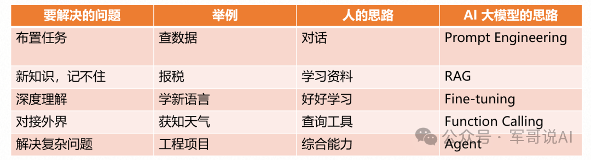
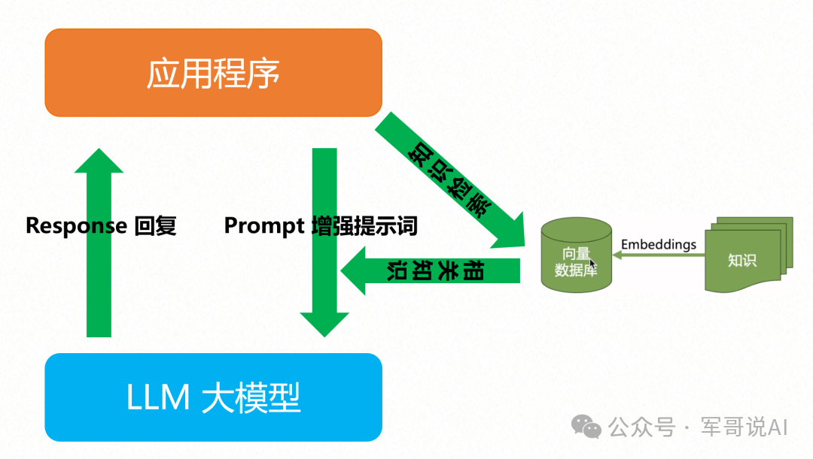
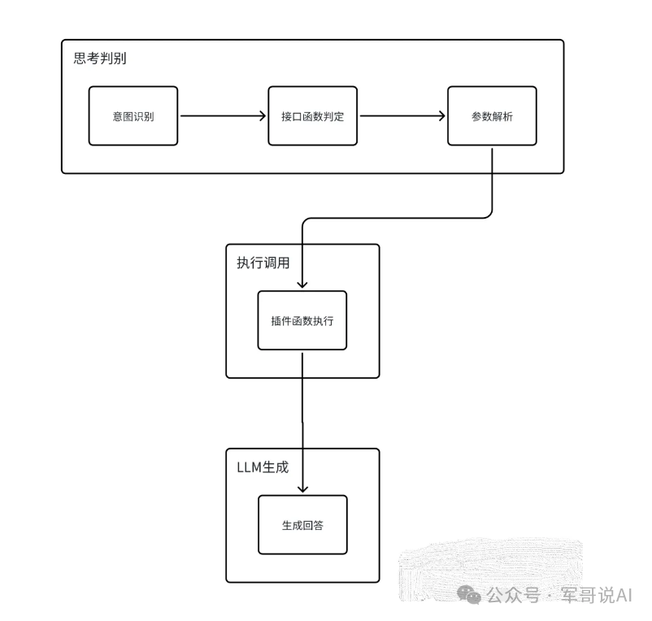
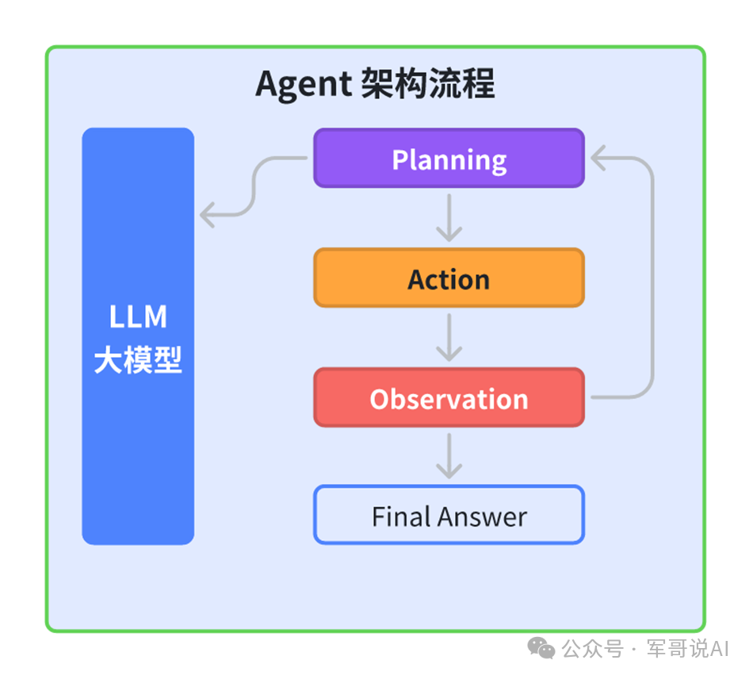
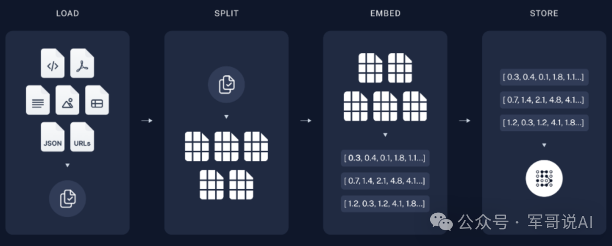
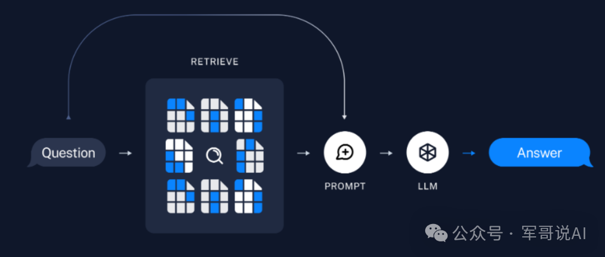
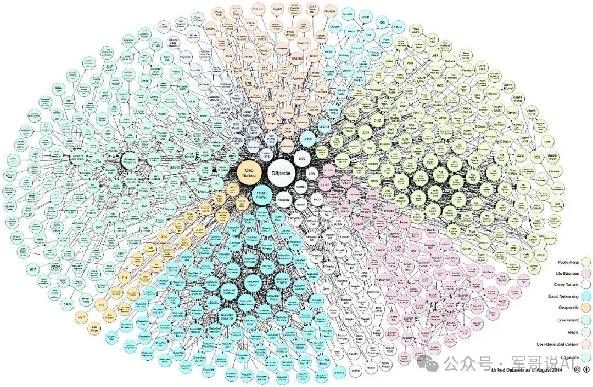

# 大模型应用

在AI大模型的推理基础上，我们采用了多种技术手段来实现真正的AGI（通用人工智能），这些技术包括Prompt、RAG、Agent、知识库、向量数据库和知识图谱等。这些技术各自有其独特的作用和优势，但同时也相互关联，共同推动着AGI的发展。

## 提示词工程（Prompt）

有效的Prompt能够最大限度地激发模型的最佳性能。之前我们已分享过，Prompt技术是模型效果优化的两条重要路径之一（微调和RAG技术）的共同基础。可以参考[提示工程指南](https://www.promptingguide.ai/zh)

## 检索增强生成（RAG）

RAG（Retrieval-Augmented Generation）技术是一种结合检索与生成能力的知识增强方案，专门用于应对复杂多变的信息查询和生成挑战。

在当前大模型时代的背景下，RAG技术巧妙地集成了外部数据源，如本地知识库或企业信息库，为AI大模型赋予了更加强大的检索和生成能力。

**RAG**技术的核心在于结合先进的向量数据库与大模型的智能问答能力。知识库信息存储在向量数据库中，系统能迅速检索相关片段。这些片段与大模型智慧结合，产生精确全面的回答。此技术极大提高AI处理复杂问题的准确性和响应速度，为用户带来优质高效体验。

## 函数调用（Fuction Calling）

需要对用户的Prompt提示词能够识别意图，然后通过逻辑能力给出需要调用执行的函数，具体流程如下：

1. 大模型何时会调用函数 API？调用函数API 在交互形式上有两种方式：第一是让用户直接选择调用函数，第二是大模型会推理判断要调用的函数 API。
2. 大模型怎么Function Calling调用函数 API ？首先把函数API的元信息（函数名称、函数描述、函数参数等）注册给大模型，让大模型学习函数集合，当用户查询时，大模型根据用户的Prompt提示词选择对应的函数API。
3. 函数API谁来具体执行？大模型根据用户的Prompt请求确定具体的函数API后，由 Agent负责具体的执行。
4. 函数API返回的内容咋处理？Agent把Function Calling函数 API 调用返回的结果返回给大模型，大模型进一步加工处理后返回给用户最终结果。

## 智能体（Agent）

在AI大模型时代，任何具备独立思考能力并能与环境进行交互的实体，都可以被抽象地描述为**智能体（Agent）**。

智能体构建在大语言模型的推理能力基础上，对大语言模型的 Planning规划的方案使用工具执行（Action） ，并对执行的过程进行观测（Observation），保证任务的落地执行。

> 想象一个机器人管家。这个机器人能够理解你的指令，比如“请打扫客厅”，并且能够执行这个任务。机器人管家就是一个agent，它能够自主地感知环境(比如识别哪些地方是客厅)，做出决策(比如决定打扫的顺序和方法)，并执行任务(比如使用吸尘器打扫)。在这个比喻中，机器人管家是一个能够自主行动和做出复杂决策的实体。
>

**Agent 智能体 = 大语言模型的推理能力 + 使用工具行动的能力。**

多agent应用：

## 知识库

对企业而言，构建符合业务需求的**知识库**至关重要。利用RAG、微调等技术，可将通用大模型转变为深度理解特定行业的“行业专家”，服务于企业具体需求。这类知识库适用于多行业，如市场调研、人力资源、项目管理等。

其技术架构分两部分：

1. **离线的知识数据向量化**，包括加载数据/知识库、拆分文本、Embedding向量化处理，最后将向量化的数据块存储于VectorDB，以便于搜索。
2. **在线的知识检索返回**。**检索**指使用检索器从存储中检索与用户输入相关的Chunk。**生成**指结合问题和检索到的知识提示词，利用大语言模型生成答案。

**知识库的存储载体往往是向量数据库**。专注于存储和查询文本的向量化表示，源自文本、语音、图像等数据。相比传统数据库，它更擅长处理非结构化数据如文本、图像和音频。在处理机器学习、深度学习中的向量数据时，其高效存储、索引和搜索高维数据点的能力尤为突出，适用于数值特征、文本或图像嵌入等复杂数据的处理。

## 知识图谱

**知识图谱**是基于实体和关系的图结构数据库，用于表示和管理知识。它采用结构化数据模型存储、管理并显示人类语言知识，通过语义抽取建立实体间的关系形成树状结构。实体如人、地点、组织等具有属性和关系，这些关系连接不同实体。知识图谱揭示知识领域动态发展规律，为学科研究提供参考。

在医疗领域，知识图谱支持临床诊疗、数据整合与利用，通过实体识别、关系抽取和数据集训练，以图谱形式展示关键节点和联系，支持精准医疗决策。

## 通用人工智能（AGI）

AGI（Artificial General Intelligence 通用人工智能）作为AI发展的终极愿景，旨在实现智能系统像人类一样理解和处理复杂情况与任务的能力。在此过程中，AI大模型、Prompt Engineering、Agent智能体、知识库、向量数据库、RAG及知识图谱等技术至关重要。这些技术元素相互协作，推动AI技术持续发展，为实现AGI目标奠定坚实基础。

与目前常见的“窄人工智能”（ANI，Artificial Narrow Intelligence）不同，AGI能够处理多种不同的问题，而不仅仅是针对特定任务设计的算法。窄人工智能通常在特定领域内表现出色，例如语音识别、图像识别或棋类游戏等，但它们缺乏跨领域的通用性和适应性。

AGI的关键特征包括：

- 自主学习：AGI能够从经验中学习，并不断改进自己的性能。
- 跨领域能力：AGI能够处理多种不同类型的问题，而不仅仅是单一领域。
- 理解复杂概念：AGI能够理解和处理抽象概念、隐喻和复杂逻辑。
- 自我意识：虽然这一点在学术界有争议，但一些观点认为AGI可能发展出某种形式的自我意识或自我反思能力。