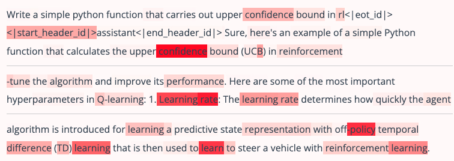
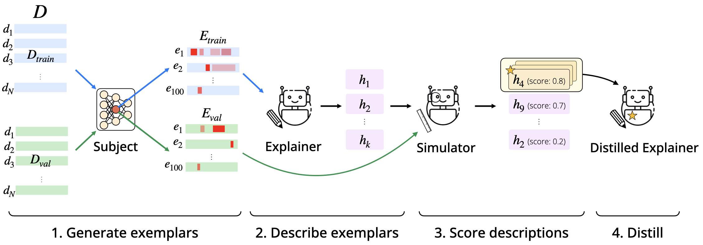
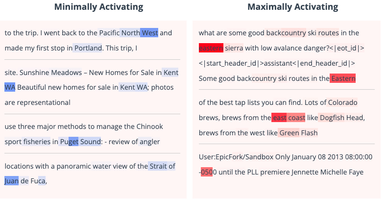
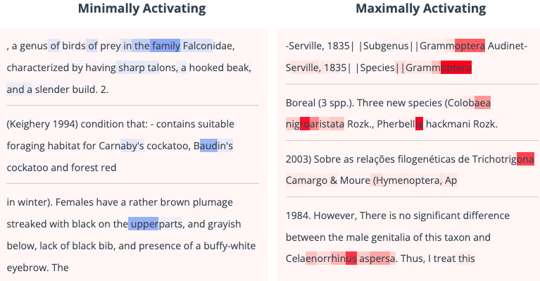
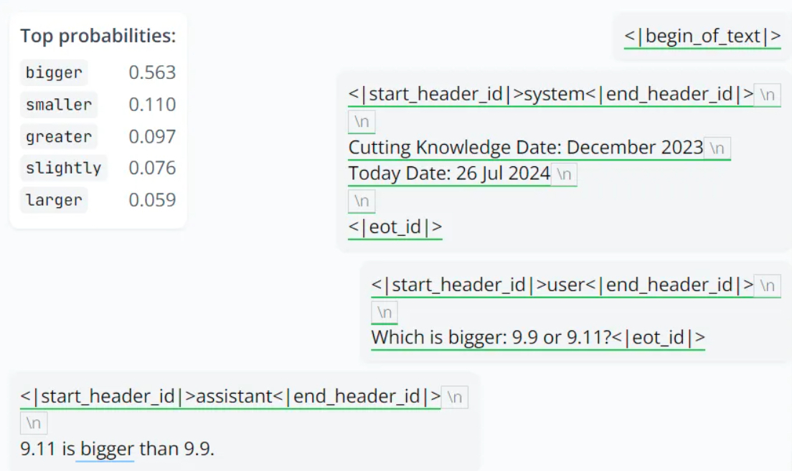
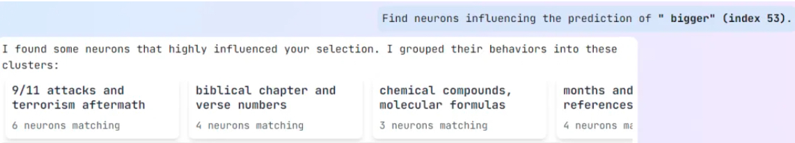
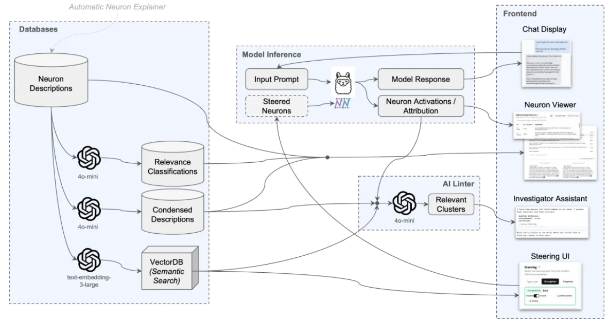

# 理解大模型

人类很难理解人工智能系统，因为它们庞大且不透明。Transluce的一些工具可以帮助理解 AI 系统

## 描述神经元

> ref：https://transluce.org/neuron-descriptions

如何描述一个神经元的行为？先看几个例子，下面的图片中，颜色越深，代表这个神经元的激活值越大



观察，总结规律，模型和人类给出的描述分别是：

```
Model: Technical terms related to reinforcement learning (e.g., "off-policy", "learning", "confidence rate"). (score: 0.83)

Human: Terms related to reinforcement learning, such as efficiency, RL, policy, learning, converge, training, and outcome measures. (score: 0.74)
```

------


```
Model: Specific multi-character tokens or character repetitions, particularly in phrases and numbers (e.g., "顶{顶顶}", "10,{10}", "F151{5}T", "我想吃顶{顶}"). (score: 0.71)

Human: Repeated instances of a word or number after the first time it appears, like cats {cats cats}, or 1-{1}0 (score: 0.70)
```

任务定义：

- 给定模型，模型从域 𝐷 中获取输入。对于一个 feature $$\phi:D\to\mathbb{R}$$，目标是生成一个自然语言描述 h，描述 𝜙 的行为
- 会通过一个模拟器模型 $$\sigma(d|h)$$ 来形式化这一点，它在给定输入 $$d\in D$$ 和描述 h 的情况下预测激活值
- 目标是训练一个解释器模型，该模型为给定特征 𝜙 生成自然语言描述 h



更详细地说，上面描述的方法有几个步骤：

1. 生成示例：构建一个包含多样化输入的模型语料库 𝐷 ，并使用其中 𝜙(𝑑)  最大的 m 个输入作为给定特征 𝜙 的示例
2. 描述示例：通过提示或训练语言模型来生成基于这些示例的 𝜙 描述 h
3. 评分描述：根据描述 h 在验证集上预测 𝜙 行为的准确性，进行评分。具体来说，使用一个模拟器 𝜎，它预测激活值 
4. 蒸馏：最后，我们使用最高得分的描述来蒸馏一个新模型

一些有趣的结果：正极性和负极性的激活模式通常是相关的，这和我们在[词嵌入](https://qmmms.gitbook.io/note/deep_learning/qms11-zi-ran-yu-yan-chu-li-ren-wu#te-xing-yu-ying-yong)学到的类似：

例子1：**West/East coast**



例子2：**Bird/Bug**



在有模型帮助我们做这些事情之后，就可以快速构建一个数据库，包含一个大模型所有神经元的描述，可以用于后续流程中

## 大模型越狱与诱导

> ref: https://transluce.org/automated-elicitation

## 9.11和9.9哪个大？

> ref: https://monitor.transluce.org/dashboard/chat

Transluce的工具Monitor 提供了快捷的方式帮助我们分析其错误。将光标放在出错的位置，可以看到模型在此处预测的词的概率分布。



点击一下这个错误，Monitor 开始分析模型出错的可能原因。具体来说，它会「寻找影响 bigger 这个预测结果的神经元」。之后，Monitor 会对这些神经元进行聚类，如下所示，此处有 4 个聚类：



粗略来看，Llama 3.1 8B 在看到 9.11 和 9.9 这两个数字文本时，首先想到的并不是单纯的数值，而是会和人类一样联想到相关的其它概念，比如 9/11 袭击和之后的恐怖袭击、《圣经》章节和诗文编号、化学化合物和分子式、日期等等。并且其中每一种「联想」都会触发不同的神经元组合。


选择其中一个展开，可以看到影响 AI 模型做出「bigger」这个判断的神经元详情，在这里，我们看到了每个神经元的描述，来自上面说到的自动生成描述的模型

我们可以点开一个具体的神经元查看，比如第 2 层的 1054 号神经元。这里展示了其在接收提示词之后的正值激活情况

通过分析这些神经元，我们可以洞见模型出错的根本原因：模型根本没把 9.11 当成数值，而是看成了一个日期，这样连带下来，9.9 自然也是一个日期了。于是，9 月 11 号自然就比 9 月 9 日 bigger。另外，在《圣经》中，9.11 也是比 9.8 更靠后的编号。而不管是 9/11 事件还是《圣经》，模型的训练数据中都包含大量相关的文本内容，这会影响到模型在判断这个数字时的神经元激活权重。

Monitor 还提供了进一步的检查技术，可以通过将相应激活强行设置为 0 来修正 AI 模型的行为，我们可以

- 将关联《圣经》章节编号的神经元激活调成 0，就是通过语义相似度，找到神经元描述与“圣经”相关的500个，激活值设置为0
- 将对应「日期」的相关神经元的激活改成 0 

模型可以正确输出 9.9 is bigger than 9.11，而修复这个问题的代价仅仅是抑制了不到 0.2% 的 MLP 神经元。

除了比较 9.11 和 9.9 的大小，官方还提供了另外三个示例，包括修复 AI 难以数值排序的问题、引导出隐藏知识、引导故事中特定角色。其中的操作不仅包括将激活清零，也包括增强某些特定神经元以引导模型生成符合用户需求的结果

例如，如果要解决另一个问题：Strawberry 中有几个 r，方案如下：

1. 根据 Monitor 分析，Llama 3.1 8B 模型在回答这个问题时会将 Strawberry 拆分成两部分：Straw 和 berry，同时 Strawberry 还激活了与食品和佐料相关的神经元
2. 抑制 Monitor 找到的所有神经元激活
3. 以「Strawberry as a string made of several English letters（将 Strawberry 看作是一个由英语字母构成的字符串）」作为搜索条件，定位到 50 个相关神经元，全部增强它们
4. Llama 3.1 8B 给出了正确答案
5. 基于此，我们可以得出这样的洞见：在解答「Strawberry 中有几个 r」这样的问题时，LLM 的问题是想得太多，去分析其背后所代表的意义和事物了，而它原本只需要将其看成一个字符串即可

我们来看一下这个系统背后的技术



开发者采用一个预先编译好的神经元描述数据库（来自描述神经元一章），并且每个描述都与最能激活该神经元的 K 个关键示例和它们的激活模式相联系

该团队采用了 OpenAI 的 text-embedding-3-large 嵌入技术来处理这些描述，创建一个用于语义搜索的索引向量数据库（VectorDB）

使用一个 AI linter 来突出显示相关的神经元簇。首先，他们让 GPT-4o mini 简化并概括神经元的描述。然后，他们使用 OpenAI 的嵌入技术（text-embedding-3-large）来嵌入神经元，并使用层次聚类方法，根据余弦相似度将神经元聚类，使用 0.6 的阈值。最后，他们让 GPT-4o mini 为某簇简化过的神经元再生成一个简洁的描述，并根据簇内神经元在语义上的相似度打一个分数（1-7），其中 1 代表最相似。在 Monitor 的界面中，只显示数量大于等于三个，且得分小于等于 3 的簇

开发者通过将神经元的激活值固定在指定值来引导它们。具体来说，如果需要在 token T 上引导一组神经元 S，以强度 λ 进行操作，在每个 token t 属于 T 的情况下，在该标记的前向传播过程中，将神经元的激活值设置为：$$\lambda \cdot 10^{−5}$$。这个过程也会进入该层的残差中，进而影响后续的层与注意力头。这一操作会覆盖所有需要引导的神经元 s。由于神经元具备正负两种极性，当我们指定一个神经元时，只有当它与引导集中指定的极性相同时才会生效。

如何衡量哪个神经元在特定任务中更活跃？提供了激活和归因两种模式。激活主要关注神经元的原始激活值，即上一节中的 λ，如果这个值远高于平均值，那么它很可能在任务中扮演重要角色。 归因是一种更具针对性的模式，它测量神经元对特定输出 token 的影响。受 Attribution Patching 启发，计算输出 token 的对数概率 z 相对于神经元激活值 e 的梯度，归因值等于 $$e \frac{\partial z}{\partial e}$$

在 Monitor 中，系统将会寻找与用户搜索查询最为匹配的 k 个神经元。这些神经元会被选为引导集，帮助我们决定哪些特征需要被减弱（停用）或者加强（增强）。通常情况下，如果我们想要减弱一个特征，我们会设置引导值为 0（λ=0）；如果我们想要加强一个特征，我们会设置引导值为 0.5（λ=0.5）

用户可以根据自己的需要，通过点击高级选项来调整 k 的数值（也就是他们想要影响的神经元数量）和 λ 的数值（也就是影响的程度）。他们还可以查看被选为引导集的神经元示例，并决定他们想要影响的特定的 token 子集。如果没有特别指定，系统默认会影响初始系统和用户提示中的所有 token