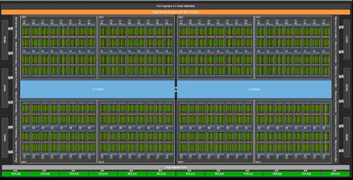
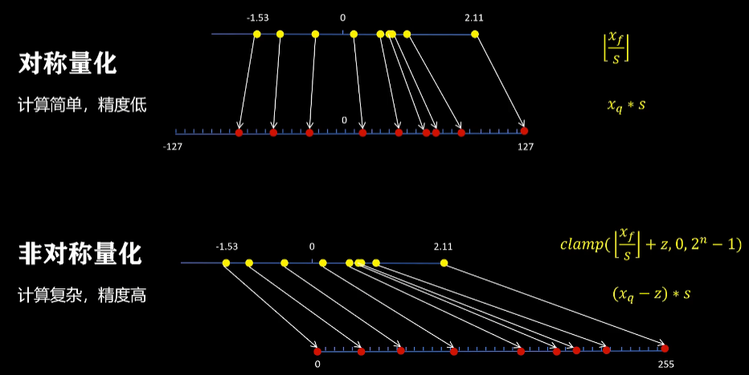
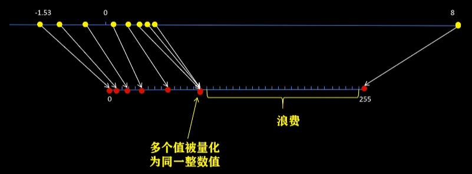
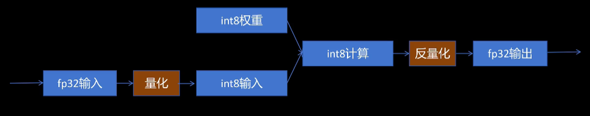
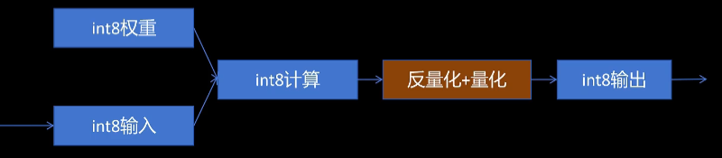
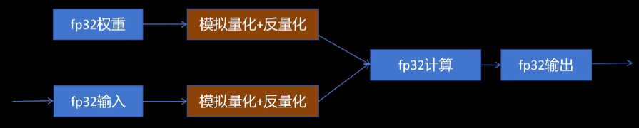
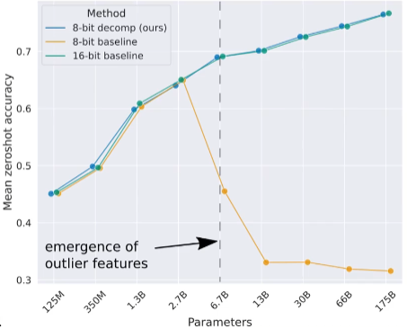
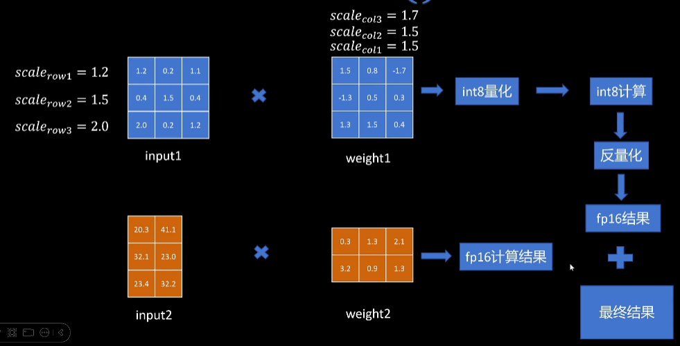
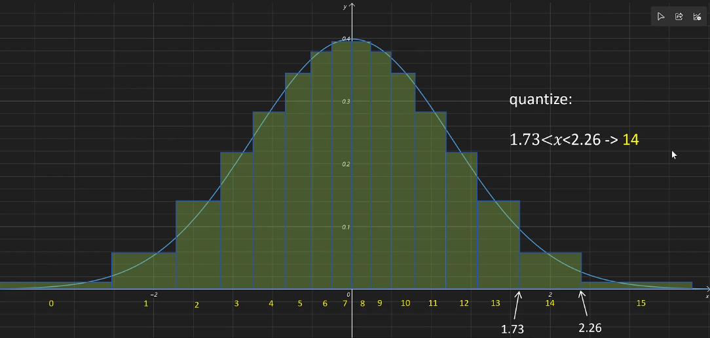
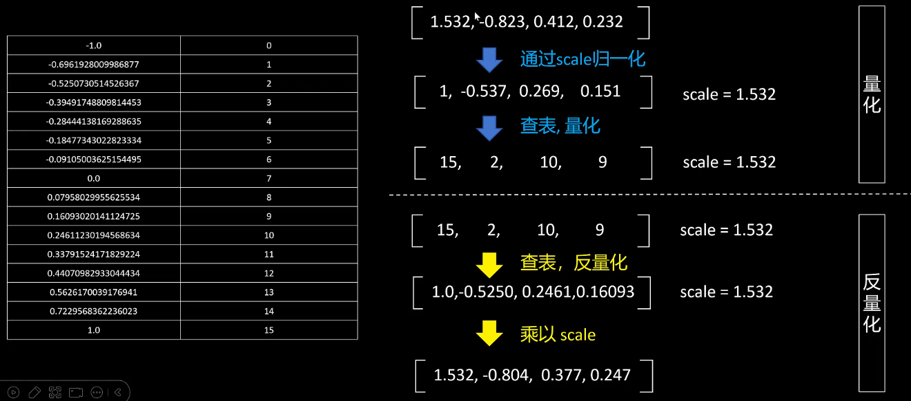

# 量化

量化：把模型参数和模型的激活值从原来的浮点型转化为整数型，并同时尽可能的减少量化后模型推理的误差

- 减少模型的存储大小以及推理时占用的显存大小
- 减少推理过程中数据交换所占用的时间，从而提高推理的速度
- 整数计算速度快于浮点型数据从而加快模型的推理时间

以Llama13B为例

- 如果用float32来加载的话需要52GB的显存
- 如果以float16来加载的话需要26GB的显存
- 如果是INT8的话只需要13GB
- 而以int4加载的话仅需要6.5GB

下图是一张A100的架构图

中间这些是tensor core，两边是显存。在计算过程中模型要频繁地将模型的weight值和激活值从显存加载到tensor core，计算完成后又将结果放回到显存中。在大模型的推理过程中制约模型推理速度的更关键的是显存带宽，而如果模型量化后因为传输的数据小，所以可以减少推理过程中数据交换所占用的时间，从而提高推理的速度

比如A100的算力

| 类型                   | 算力       |
| ---------------------- | ---------- |
| Tensor Float 32 (TF32) | 156 TFLOPS |
| FP16                   | 312 TFLOPS |
| INT8                   | 624 TFLOPS |

> 这也很好理解，对于人类，也是整数计算相比于小数计算更加容易

## 简单的量化方法

对于量化，我们不光考虑把浮点数 $$x_f$$ 转化为整数 $$x_q$$，同时我们需要考虑反量化。也就是把整数转化为原来的浮点数，因为我们最终要使用的还是浮点数的值

为此，我们需要让我们的反量化后的浮点数要尽可能的接近原始量化前的浮点数。所以量化不能简单的去掉一个浮点数的小数位，还是需要一些策略的，包括浮点数量化后的值尽可能的利用所有的整数范围

对称量化将一组数转换到INT8，也就是负的128~127之间。首先我们找到绝对值最大的那个数，让它映射到INT8最大的整数127，从而我们得到了一个缩放比例 $$s$$，其他数都按照这个缩放比例进行缩放，然后取整，这样我们就得到了所有数量化后的表示。反量化也很简单，就是用量化后的值乘以缩放系数，对于这一组数保留两位有效数字

不过，以绝对值最大的数来确定缩放比例，有一部分范围是被浪费掉的。希望可以最大程度的利用本来就不多的整数，就引入了非对称量化：把一组浮点数映射到无符号的INT8（0~255），缩放比例scale的计算就是$$(max-min)/(2^n-1)$$。计算完成后，还需要计算一个zero point让量化后的变量刚好处于0到255之间，计算方法就是取整 $$min/scale$$，原始输入的零值经过量化和反量化不会有误差，这样保证了像 relu 这样的函数的准确性

> clamp函数的作用是，如果我们的浮点数经过缩放和平移之后落在了量化整数范围之外的，小于0的就强制为0，大于255的就强制为255

那对于tansor计算，浮点型矩阵的运算转换成了整数型矩阵运算。可以减少计算时间，缩放的结果有一定的误差但是整体误差不大
$$
对称量化：X_fW_f= X_q*s_x @ W_q * s_w=s_x*s_wX_qW_q
$$

$$
非对称量化：X_fW_f= (X_q-Z_x)*s_x @ (W_q-Z_w) * s_w
$$

> 量化中还常见的一种问题，比如有异常值，即使用非对称量化还是有很大部分的整数部分被浪费掉。同时，很多不同的值量化后被压缩到同一个整数值，带来了更大的误差
>
> 
>
> 有很多工作来解决这个问题，比如用直方图来描述数据分布、逐步舍弃舍弃一些异常值然后计算、量化前和量化后数据的均方误差或者kl散度找到最合适的取值范围、还有一些量化方法不会舍弃异常值而是把异常值拿出来做单独处理

## 动态量化

量化对神经网络精度影响较小，主要有以下三个原因：

- 一般情况下，权重和输入都经过了 normalization（归一化）处理，基本的数值变化范围不大；
- 由于激活函数的存在，数值的影响能够被平滑；
- 对于绝大多数神经网络而言，它们主要执行分类任务，最终是依据概率值来进行分类，只要某种类别的概率高于其他类别，就无需依赖绝对数值。

量化的总体原则是针对神经网络的每一层进行操作。动态量化过程如下

1. 将训练好的模型权重转化为 INT8（8 位整数类型），并保存模型参数
2. 在模型推理阶段，每一层输入的激活值是 float32（32 位浮点数类型）的，对该输入值进行动态量化，转变为 INT8 的输入
3. 在 INT8 类型下进行运算
4. 在输出结果时进行反量化处理
5. 运算结果再进行反量化，变成 float32 的输出传入下一层

## 静态量化

训练后动态量化存在两个问题：

第一个问题，在模型推理阶段，每一层都要对输入的激活值进行量化参数统计，这一过程极为耗时。动态量化之所以仅对模型参数进行量化，而不涉及输入量化，原因在于模型**参数在训练完成后保持不变**，然而模型的**输入却始终处于变化状态**，**难以对输入的量化参数进行统计**。针对此问题，解决办法是选取具有代表性的输入数据，让其在网络中运行一遍，将这些数据视为真实推理时的输入，如此一来，每一层就能依据自身输入的激活值进行观察统计，从而获取激活值的量化参数。

第二个问题，每一层计算完成后，都需将计算结果反量化为 float32 类型，这不仅占用大量显存，数据传输也耗时较长。解决此问题的思路是，由于每一层的输出会作为下一层的输入，而下一层仍需对输入进行量化，那么在本层计算结束后，直接对结果进行量化，再将量化后的值传递给下一层，这便是训练后静态量化。下面来看其具体过程：

1. **权重量化与参数保存**：将训练好的模型权重量化为 INT8，并保存量化参数。
2. **校准**：利用具有代表性的数据进行模型推理，借助这些数据在神经网络每一层产生的激活值，估算出激活值的量化参数。这样在实际推理时，就无需每次都依据实际激活值来计算量化参数。
3. **层内计算**：在每一层对量化后的 INT8 权重和 INT8 激活值进行计算。
4. **输出处理**：每一层输出时，一方面将结果反量化为 float32，另一方面依据校准得出的激活值量化参数，把激活值量化为 INT8，并将量化参数存入量化后的激活值中。
5. **数据传递**：将 INT8 的激活值及其量化参数传入下一层。

## 量化感知训练

训练好的模型，无论怎么量化，总是会有误差。如果我们在训练时就能故意将将量化误差引入，使得模型在训练阶段就能对参数进行调整，从而更好地适应量化，进而提升量化后模型的精度。

1. **加载模型参数**：加载 float32 类型的模型参数。
2. **输入激活值**：输入 float32 类型的激活值。
3. **引入量化误差**：通过在网络中插入模拟量化节点，分别对模型参数和激活值执行量化与反量化操作，以此引入量化误差。
4. **模型计算**：模型在 float32 状态下进行计算。
5. **激活值传递**：计算后的 float32 类型激活值传入下一层。需要留意的是，整个训练过程均在 float32 环境下开展，包括模拟量化和反量化节点，在训练时它们也能够将梯度传递至前面的层，以实现参数更新。

## LLM.int8()

模型量化对于大模型而言更为关键。那么，在实际操作中如何对大模型进行量化？是否存在一种方法，既能减少大模型的显存占用，又不影响其精度呢？

下图中，X 轴表示大模型的参数量，Y 轴代表模型的精度。绿色的线展示了在 float16 精度下不同模型的精度表现，可以看出，随着模型参数的增加，精度持续提升。黄色的线代表传统的量化方法，能发现当模型参数达到 2.7B 以后，性能急剧下降。而绿色的 LLM INT8 方法，无论模型参数如何变化，其精度始终保持与 float16 相同，没有出现衰退。

为什么模型参数达到一定量级后，传统量化方法会突然失效？这是由 “emergent features”（突发特征）导致的。即在一些层的模型输出特征中，部分特征会突然增大，通常是其他特征的几十倍，例如原始特征中的 57、 - 45、 - 67 等。为什么会出现这些特征呢？作者认为，这是大模型在学习过程中获取的重要特征。对于包含此类异常值的特征，

- 若采用传统方式进行量化和反量化，会发现许多一般特征变成同一个值，从而导致信息丢失，模型表现下降。即我们在简单的量化方法中提到的异常值问题
- 而如果选择忽略这些特别大的异常特征，模型因丢失重要特征，表现同样会下降。

Hugging Face Transformer 库中默认的 INT8 量化技术 ——LLM INT8 是一种经实验证实，不会影响大模型性能表现，却能减少一半显存占用的量化技术。是如何解决这个问题的呢？简单来说，就是将这些特别大的重要特征与其他普通特征分开处理，之后再汇总结果。

我们观察如下的矩阵乘法，其中，输入的第2、4列包含emergent features
$$
输入 \times 权重 =

\begin{bmatrix}
1.2 & 20.3 & 0.2 & 41.1 & 1.1 \\
0.4 & 32.1 & 1.5 & 23.0 & 0.4 \\
2.0 & 23.4 & 0.2 & 32.2 & 1.2
\end{bmatrix}
\times
\begin{bmatrix}
1.5 & 0.8 & -1.7 \\
0.3 & 1.3 & 2.1 \\
-1.3 & 0.5 & 0.3 \\
3.2 & 0.9 & 1.3 \\
1.3 & 1.5 & 0.4
\end{bmatrix}=?
$$
利用矩阵乘法的性质，我们可以将输入的第2、4列，以及权重的第2、4行拿出来，分别计算再求和，这和原来的矩阵乘法结果是一致的，如下图

> 这种方法的本质是，如果emergent features不适合量化计算，那我们就做一个妥协，不在emergent features上量化计算。由于emergent features占比较少，其他特征的量化计算依旧可以带来速度和存储空间的优势

- 上面的 input1 和 weight1 是普通特征及其对应的权重，下面的 input2 和 weight2 是异常输入及其对应的权重。
- 对上面的普通矩阵进行量化计算，注意这里对输入按行进行量化，对权重按列进行量化，量化后进行 INT8 计算，计算完成后进行反量化。
- 下面的异常特征矩阵和权重在 float16 下进行计算，这样不会产生精度损失。
- 计算完成后，将其与上面反量化后的普通特征计算结果相加，就得到了这一层的输出。

回顾 LLM INT8，有几点需要注意：

1. “emergent feature” 仅占所有特征的 0.12% 。
2. 权重在加载模型时进行量化，显存占用比 float16 减少一半
3. LLM INT8 量化方法对模型精度没有影响。
4. 由于计算复杂度增加，模型推理速度会变慢 20% 左右。

## QLoRA

此前所讲的量化方法多为线性量化，即量化前浮点数与量化后整数满足线性关系。但对于神经网络参数，其多符合均值为零的**正态分布**，零附近参数多，极大极小值少，均匀分配量化后的整数值存在浪费。于是基于在原始浮点型数值密集处多分配整数值、稀疏处少分配以减少量化误差的思想，将正态分布按累计概率密度分为 16 个区域（对应四比特量化后的 16 个整数），越靠近零值整数分配越密集，越远离则越稀疏。

如下图，以分配整数 14 的区间为例，求出区间起始点和终点对应的 X 值，若输入 X 值在1.73到2.26区间内，就量化为 14 。反量化时，对于14就取这个区间对应的平均值1.995

但存在两个问题：

- 正态分布中 X 取值范围为负无穷到正无穷，反量化时无法求最后区间均值，解决办法是做截断，QLoRA 里两边各舍弃累计概率密度 0.0322917；
- 零值无论归属于哪一边，反量化后不再是零，而零在深度学习中有特殊意义，所以将零值单独拿出，占 16 个整数中的一个，其余 15 个值按正态分布累计概率密度，正数分配 8 个，负数分配 7 个。得到所有 X 值后除以最大绝对值归一化到 - 1 和 1 之间，形成 normal float4 比特（NF4） 

NF4 量化后的 int4 值不能参与计算，需反量化后才行。它专门用于对符合正态分布的数据进行量化。我们计算出表（它们之间并不是线性等分的，但是正数部分和负数部分分别都是按照正态分布累计概率密度等分的）之后，可以用来量化和反量化

具体量化时，原始浮点数先除以最大绝对值（即缩放因子 scale，需保存用于反量化），再进行 NF4 查表，取最接近值对应的 index 作为量化后的 int4 值。反量化通过查表找出 int4 值对应的浮点数，再乘以 scale 得到反量化后的值，此过程存在量化误差

分块量化可应对异常值、提高精度，QLoRA 量化时每 64 个值为一块，每个数量化后占 4 位，共 256 bit。每个 block 独立量化需保存一个 32 位 float 类型的 scale 值，这额外占用 12.5% 显存。解决办法是每 256 个 block 的 scale 值进行 8 比特量化，将额外显存占用降至 3.174%，此即**双重量化**。双重量化虽减少显存占用，但反量化需两次，先对 scale 值反量化，再对 tensor 值反量化。