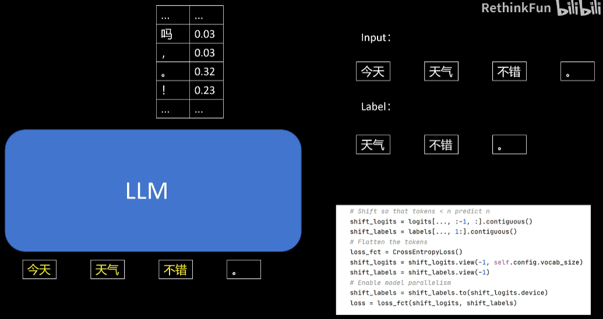
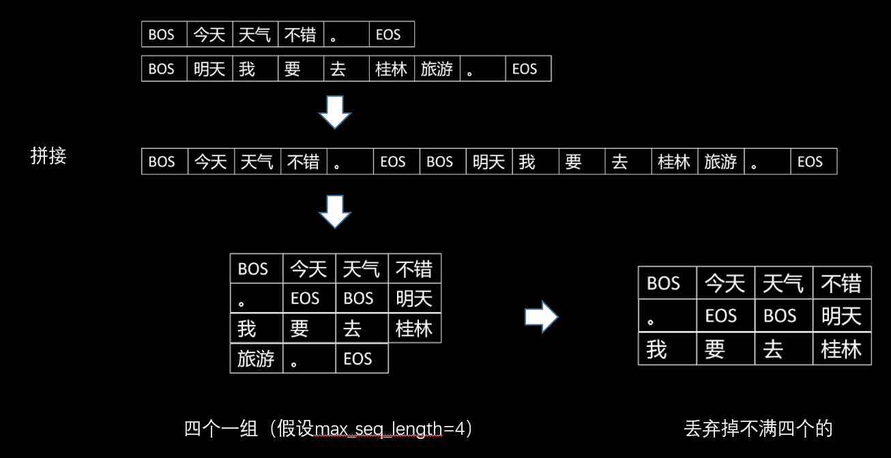

# 预训练

预训练的两种情况

- **从零开始预训练**：训练起始时，模型所有参数随机初始化。这种方式需要大量语料、众多显卡以及漫长时间，才能训练出性能良好的大模型。
- **基于开源预训练模型微调**：在已有的开源预训练大模型基础上，针对特定行业（如金融、医疗领域）进行加强训练，提升通用模型在特定领域的知识与能力，这是更常见的情况。

## 简化代码

我们来看看预训练的[简化代码](https://github.com/RethinkFun/LLM/blob/main/simple.py)

设置模型、tokenizer

```python
model_path = '/data04/llama3/Meta-Llama-3.1-8B-Instruct'
tokenizer = AutoTokenizer.from_pretrained(model_path)
```

模型放入显卡

```python
model = AutoModelForCausalLM.from_pretrained(
    model_path,
    low_cpu_mem_usage=True,
)
model.to("cuda")
```

定义优化器

```python
optimizer = torch.optim.AdamW(model.parameters())
```

定义文本，分词，放入显卡

```python
text = "今天天气不错。"
input = tokenizer(text, return_tensors="pt")
input = {k: v.to("cuda") for k, v in input.items()}
input["labels"] = input["input_ids"].clone()
```

前向传播，后向传播，更新模型，保存参数

```python
output = model(**input)

#获取模型的loss
loss = output.loss
loss.backward()
optimizer.step()
optimizer.zero_grad()

#保存模型
model.save_pretrained("output_dir")
```

若要从头训练大模型，可通过`llama config`初始化默认配置文件，按需修改网络配置（如解码器模块个数、隐藏层大小），构造新模型。

```python
config = LlamaConfig() # 创建一个默认的Llama config
config.num_hidden_layers = 12 # 配置网络结构
config.hidden_size = 1024
config.intermediate_size = 4096
config.num_key_value_heads = 8
# 用配置文件初始化一个大模型
model = LlamaForCausalLM(config)
```

为减少显存占用，采用四比特加载模型，并添加量化配置信息。

```python
bnb_config = BitsAndBytesConfig(
    load_in_4bit=True,
    bnb_4bit_use_double_quant=True,
    bnb_4bit_quant_type="nf4",
    bnb_4bit_compute_dtype=torch.bfloat16
)

model = AutoModelForCausalLM.from_pretrained(
    model_path,
    low_cpu_mem_usage=True,
    quantization_config=bnb_config
)
```

生成 LoRA 模型配置，结合原始模型生成 LoRA 模型。

```python
peft_config = LoraConfig(
        r=8,
        target_modules=["q_proj",
                        "v_proj",
                        "k_proj",
                        "o_proj",
                        "gate_proj",
                        "down_proj",
                        "up_proj"
                        ],
        task_type=TaskType.CAUSAL_LM,
        lora_alpha=16,
        lora_dropout=0.05
    )
model = get_peft_model(model, peft_config)
```

这样普通的机器也可以训练大模型了

hugging face 的`Trainer`类可简化训练代码，只需准备好数据、模型和配置参数，无需编写训练循环代码。可通过参数配置实现基础功能（如设置`batch size`、打印`loss`）和高级功能（如混合精度训练、梯度检查点、梯度累积），且支持分布式训练

```python
trainer = Trainer(
    model=model,
    args=training_args,
    train_dataset=train_dataset,
    eval_dataset=eval_dataset
)
trainer.train()
trainer.save_model("/data04/xuepeng/test_train")
```

> 数据集处理见后面的章节
>
> 使用`accelerator`进行分布式训练，通过`accelerator config`配置分布式训练，选择单机多卡模式，设置使用的 GPU 卡和混合精度训练类型。使用`accelerator launch`命令启动训练脚本，并指定输出模型路径、`LoRA`参数等

## Loss 计算

以输入 “今天天气不错” 为例，模型将其拆分为多个`token`。模型根据前一个或多个`token`输出下一个`token`的概率分布，期望目标`token`的概率尽可能大，其他`token`概率尽可能小，这本质上是一个分类问题



由于句子结束，训练时丢弃最后输出的`token`，不进行`loss`计算。在 hugging face 的`llama model`中，先丢弃预测的最后一个`token`，将`input`左移一位形成最终的`label`，使用交叉熵损失函数计算`loss`

## 数据处理

**数据清洗与添加特殊`token`**：假设数据已完成清洗，我们还需要在文本中添加特殊`token`，即`tokenizer`的`BOS`（Begin of Sequence）和`EOS`（End of Sequence）。不同模型的`BOS`和`EOS`不同，可查看`tokenizer`配置文件获取，例子如下

```txt
<|begin_of_text|>神州数码接管 深圳地税核心征管系统
　　羊城晚报讯  记者韩平报道：中国最大的IT服务提供商神州数码控股有限公司17日正式对外宣布，已正式接管中国第三大地税收入过千亿的副省级城市——— 深圳市地税核心征管系统，公司将进一步拓展深圳及整个华南区市场。这是继海南省地税项目中标后，神州数码接获的又一个副省级以上地税“核心征管系统”。神州数码主席兼首席执行官郭为表示，神州数码将加大在深圳的市场拓展力度。<|eot_id|>
```

**加载与分词数据**：使用 hugging face `datasets`库的`load_dataset`方法加载文件夹中的所有 TXT 文件，分别加载训练集和验证集。

```python
train_dataset = load_dataset("text", data_dir="/home/xuepeng/pretrain_test/train_data", split="train")
eval_dataset = load_dataset("text", data_dir="/home/xuepeng/pretrain_test/eval_data", split="train")
```

定义分词函数，对训练集和验证集调用`map`函数进行分词，并确保在分布式训练时仅主进程进行数据处理。

```python
def tokenization(example):
    return tokenizer(example["text"])

with training_args.main_process_first(desc="dataset map tokenization"):
    train_dataset = train_dataset.map(tokenization, remove_columns=["text"], num_proc=training_args.num_proc)
    eval_dataset = eval_dataset.map(tokenization, remove_columns=["text"], num_proc=training_args.num_proc)
```

**分组处理数据**：定义分组函数，将一组分词后的序列样本首尾相连，按用户定义的最长序列长度进行切分，丢弃剩余部分。最后增加`labels`列，其`token id`与`input token id`相同。

```python
def group_texts(examples):
    # Concatenate all texts.
    concatenated_examples = {k: list(chain(*examples[k])) for k in examples.keys()}
    total_length = len(concatenated_examples[list(examples.keys())[0]])
    # We drop the small remainder, and if the total_length < block_size  we exclude this batch and return an empty dict.
    # We could add padding if the model supported it instead of this drop, you can customize this part to your needs.
    total_length = (total_length // training_args.max_seq_length) * training_args.max_seq_length
    # Split by chunks of max_len.
    result = {
        k: [t[i: i + training_args.max_seq_length] for i in range(0, total_length, training_args.max_seq_length)]
        for k, t in concatenated_examples.items()
    }
    result["labels"] = result["input_ids"].copy()
    return result
```



```python
# 分组操作
with training_args.main_process_first(desc="dataset map tokenization"):
    train_dataset = train_dataset.map(group_texts, num_proc=training_args.num_proc, batched=True)
    eval_dataset = eval_dataset.map(group_texts, num_proc=training_args.num_proc, batched=True)
```

