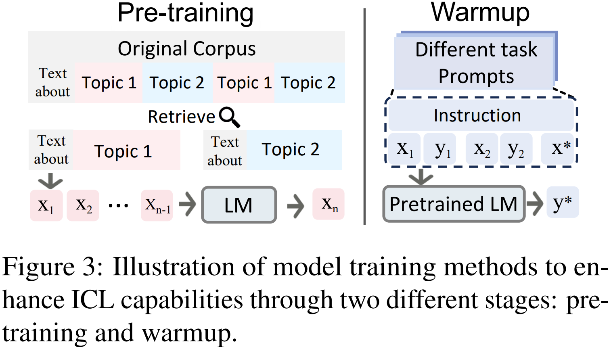

# 上下文学习

> 《A Survey on In-context Learning》
>
> 

大型语言模型（LLMs）展示出了上下文学习（ICL）能力，即从上下文中的几个示例中学习。上下文学习的关键思想是从类比中学习

优点：

- 示例是以自然语言编写的，它提供了一个可解释的接口来与大型语言模型进行通信
- 这种范式通过更改示例和模板，使得将人类知识纳入大型语言模型变得更加容易
- 上下文学习类似于人类通过类比学习的决策过程
- ICL 是一个无需训练的学习框架。这不仅可以大大降低使模型适应新任务的计算成本，还可以使语言模型即服务成为可能

特性：

- 通过预训练期间的适应可以显著提高 ICL 能力
- ICL 的性能对特定设置很敏感，包括提示模板、演示示例的选择和顺序以及其他因素
- 需要优化演示示例的简洁性并提高 ICL 的计算效率

定义：

给定查询输入文本 $$x$$ 和一组候选答案 $$Y=\{y_{1}, ..., y_{m}\}$$，预训练语言模型 $$\mathcal{M}$$ 从候选答案中选择分数最高的作为预测。

输入文本 $$x$$ 中包含演示集 $C$ 。$C$ 包含一个可选的任务指令 $$I$$ 和 $$k$$ 个演示示例，即 
$$
\begin{align}
&C = \{I, s(x_1, y_1), \ldots, s(x_k, y_k)\} \\
&或者 \\
&C = \{s'(x_1, y_1, I), \ldots, s'(x_k, y_k, I)\}
\end{align}
$$
 其中 $$s'(x_i, y_i, I)$$ 是根据任务用自然语言编写的一个示例。

根据 $$k$$ 个演示示例是否属于同一任务，可以分为特定任务的上下文学习（ICL）和跨任务的上下文学习。在后一种情况下，不同的示例有各自的指令。

候选答案 $$y_j$$ 的likelihood来自于对整个输入序列的评分函数 $$f$$：
$$
P(y_j|x)\triangleq f_{\mathcal{M}}(y_j, C, x)
$$
 最终预测标签 $$\hat{y}$$ 是概率最高的候选答案： 
$$
\hat{y}=\underset{y_j\in Y}{\arg\max}P(y_j|x)
$$
上下文学习与相关概念的区别如下：

- 提示学习 Prompt Learning：提示可以是离散的模板或软参数，用于促使模型预测期望的输出。上下文学习可以被视为 prompt tuning 的一个子类，其中演示示例是提示的一部分
- 少样本学习：少样本学习是一种通用的机器学习方法，涉及调整模型参数，以便在有限数量的监督示例下执行任务。相比之下，上下文学习不需要参数更新，而是直接在预训练的大语言模型上执行。 

## Model Training

为了进一步提升ICL能力，建议在ICL推理前的预训练和热身阶段对 LLM 进行训练。推理前训练的关键思想是通过引入接近上下文学习的对象来弥合预训练与下游ICL格式之间的差距。

一种提高语言模型的ICL能力的直接方法是通过预训练：

- 通过聚合相关上下文来重组预训练语料库，使模型学会在先前的示例中进行推理
- 通过元蒸馏预训练过程，该过程允许语言模型利用提炼的示例向量进行推理

另一种增强 ICL 的方法是在预训练和 ICL 推理之间增加一个持续训练阶段，我们简称为模型预热 Warmup。预热是 ICL 的一个可选步骤（因为许多预训练的LLMs已经展现出了ICL能力），它通过在推理之前修改或添加参数，调整大型语言模型：

- 在广泛的任务上使用多个示例进行持续微调大型语言模型，提升了ICL能力
- 鼓励模型从上下文中学习输入-标签映射，使用 symbol tuning，即用任意符号（例如 “foo/bar”）替代自然语言标签（例如 “积极 / 消极情绪”）
- 自监督方法，将下游任务中的原始文本与 ICL 格式对齐
- 通过自然语言指令模板、使用 1000 多个任务指令等方法来 instruction tuning
- 随着训练数据的不断增加，热身带来的性能提升遇到瓶颈，LLM 在热身期间仅需少量数据就能适应并从上下文中学习

## Demonstration Selection

Demonstration Selection 旨在解决：哪些样本是 prompt 中用于ICL的好例子？

无监督方法：

- 根据输入实例的相似性选择其k近邻，距离可以是嵌入的 L2 距离或余弦相似度
- 结合图和置信度分数来选择多样化且具有代表性的示例
- 除了距离之外，mutual information、置信度分数也可以用来选择样本
- LLM 的输出分数用作无监督 metrics
- 使用 infoscore，即在带有多样性正则化的验证集中，对所有 $$(x, y)$$ 对的 $$P(y|x_i, y_i, x), P(y|x)$$ 求平均值

监督方法：

- 对于特定输入，首先使用无监督方法召回类似的示例作为候选，然后使用此数据构建有监督的密集检索器 supervised dense retriever
- 采用了统一的演示检索器来跨不同任务选择演示
- 检索整个演示集以对示例之间的相互关系进行建模
- 使用 LLM 来预测未标记的数据集，为每个实例生成不确定分数
- 将 LLM 视为主题模型，通过少量示例推断潜在概念 $$θ$$ ，目标是最大化条件概率 $$P(y∣x,\theta)$$，根据 $$P(\theta∣x,y)$$（示例对概念推断的似然概率）筛选最有效的示例
- 使用强化学习，将 Demonstration Selection 公式化为马尔可夫决策过程，通过 Q-learning 来选择示例
  - 状态（State）：当前已选择的示例集合。
  - 动作（Action）：选择下一个示例加入集合。
  - 奖励（Reward）：定义为模型在验证集上的准确率

> Demonstration Selection 大多数都是实例级别的。由于ICL主要在少样本设置下评估，语料库级别的选择策略更为重要但尚未充分探索。
>
> 大型语言模型的输出分数或概率分布在 instance selecting 时起着重要作用。

## Demonstration Reformatting

利用 LLM 来重新格式化 Demonstration：

- 直接从大型语言模型生成演示，以减少对外部演示数据的依赖
- 结构化 prompt 用特殊的位置嵌入分别对演示示例进行编码，然后使用重新缩放的注意力机制将其提供给测试示例
- 从大型语言模型中演示示例的潜在嵌入中得出的上下文向量（In-Context Vectors, ICVs），ICVs 在推理过程中用于调整 LLM 的隐状态

## Demonstration Ordering

对所选的演示示例进行排序：

- 根据示例与输入的接近程度来安排示例，将最接近的示例定位为最右侧的演示
- 引入了全局和局部熵度量，发现这些度量与 ICL 性能之间存在正相关。因此利用熵度量来确定最佳的演示顺序
- ICCL 建议将演示从简单到复杂进行排序，从而在推理过程中逐渐增加演示示例的复杂性

> 对于k个示范，排列的搜索空间大小为k阶乘。如何高效找到最佳顺序或如何更好地近似最优排序也是一个具有挑战性的问题

## Instruction Formatting

简单的方法是将 $$(x_1,x_2),....(x_k, y_k)$$ 直接和模板 $$\mathcal{T}$$ 拼接起来，但是在数学等复杂推理场景中效果不佳。可以通过用指令 $$I$$ 描述任务，为基于 ICL 设计更好的演示格式

- 给定几个演示示例，LLM 可以自己生成任务指令
- 构建自动提示工程师，用于自动生成和选择指令
- LLM 从其自身的生成结果中进行引导，提高自动生成指令的质量
- 使用思维链，在输入和输出之间引入中间推理步骤，如何提高 LLM 的CoT prompting能力也值得探索

> LLM 能够生成指令、演示、探测集、思维链等等。通过使用由大型语言模型生成的演示，ICL 可以在很大程度上摆脱人工编写模板的工作

## Scoring Function

评分函数决定了如何将 LLM 的预测转化为对特定答案可能性的估计

- 直接用模型词汇表中，由标记表示的候选答案的条件概率，概率最高的答案被选为最终答案，但这种方法限制了 template 设计，要求答案 token 位于输入序列的末尾
- 困惑度（PPL）是另一种常用的度量，它计算整个输入序列 $$S_j = \{C, s(x, y_j, I)\}$$ 的句子困惑度，PPL 评估句子出现的概率，消除了 token 位置的限制，但需要额外的计算时间
- 使用通道模型（Channel）反向计算条件概率，估计给定标签的输入 query 的 likelihood。这种方法要求语言模型生成输入中的每个 token，会在不平衡的训练数据下提高性能

> 现有的评分函数都直接从大型语言模型的条件概率计算得分。目前关于通过评分策略校准偏差或减轻敏感性的研究有限

## Analysis

为了理解 ICL，最近的研究试图探究 ICL 的性能受到哪些影响、

### Influencing Factors

训练语料库的多样性、模型架构和训练过程对 ICL 的性能有显著影响

- source domain比语料库大小更重要，结合多个语料库可能会导致 ICL 能力的出现
- 存在任务多样性阈值，超过该阈值，大型语言模型在未见任务中表现出强大的 ICL 能力
- 当训练数据表现出特定的分布特性（如对象成簇出现而不是在时间上均匀分布）时，ICL能力就会出现
- 当预训练模型达到大规模的预训练步数或模型参数规模时，会获得一些涌现的 ICL 能力
- 推理过程中上下文样本之间应该相互关注，这表明当前的因果 LLMs 的 ICL 性能未达最优

在推理过程中，演示示例的多个属性也会影响 ICL 性能，包括输入标签设置（如配对格式、标签空间的暴露以及输入分布）、准确的映射、翻转或语义不相关的输入标签映射、示范的多样性和简洁性、样本的顺序、示范与 query 之间的相似性（相似效果好）

值得注意的是，尽管努力改进示范以优化性能，但在 ICL 推理过程中仍然存在明显的特征偏差。克服强烈的先验偏差并确保模型对所有上下文信息给予同等重视仍然是挑战

### Learning Mechanism

ICL 能力与 Transformer 中的特定功能模块密切相关。

- 注意力模块中特定的注意力头，称为“归纳头”，它可以复制先前的模式以进行下一个标记预测，从而逐步发展 ICL 能力
- 在 ICL 过程中，演示标签词作为锚点，为最终预测聚合和分配关键信息

对于 ICL 的理论解释有多个角度：

- 在贝叶斯框架中，ICL 被解释为隐式贝叶斯推理，其中模型通过识别示例之间的共享潜在概念来执行 ICL。其他观点表明，LLM 通过注意力机制编码贝叶斯模型平均算法。随着上下文示例数量的增加，隐式贝叶斯推理变得类似于核回归。
- 梯度下降视角：
  - Transformer 注意力和梯度下降之间的有对偶形式，基于 GPT 的 ICL 在多个方面与显式微调表现相似
  - 仅自注意力 Transformer 与通过梯度下降训练的模型表现出相似性
  - Transformer 在线性回归上使用高阶优化技术而非梯度下降进行 ICL 
- ICL 能力可以解耦为任务识别能力和任务学习能力
- ICL 可以抽象为算法学习问题，Transformer 动态地选择算法，如梯度下降和岭回归，以适应不同的ICL实例
- 利用信息论在语言学动机假设下展示了 ICL 的误差界，解释了下一个标记预测如何带来ICL能力

## Application

- 数据工程：与传统方法（人工注释和噪声自动注释）不同，ICL以较低的成本生成相对高质量的数据
- 模型增强：ICL的上下文灵活性在模型增强方面显示出潜力。它可以通过在输入前附加锚定文档来增强检索增强方法。此外，用于检索的ICL展示了引导模型输出更安全的结果
- 知识更新：大型语言模型常常包含过时或不正确的知识。ICL通过精心制作的演示在修正此类知识方面表现出有效性，与基于梯度的方法相比，成功率更高

## Challenges and Future Directions

- 着演示数量的增加而导致的更高计算成本
- LLM 最大输入长度导致的学习样本减少
- ICL 严重依赖于从标注示例中选择的高质量演示，在某些场景往往稀缺，利用丰富资源数据来解决稀缺资源任务极具吸引力
- 多模态的 ICL

## Visual ICL

视觉上下文学习：

通过使用掩码自编码器（MAE）进行图像补丁填充，训练出的模型在推理时生成一致的输出图像，展示了对于图像分割等任务的强大ICL能力。提升方法包括结合多个任务来开发通用模型、整合多样的分割任务并探索集成技术来提升示例质量等。

此外，“提示扩散模型”是首个具备 ICL 能力的基于扩散的模型，通过额外的文本提示来实现更精确的图像生成，如下图所示

与自然语言处理中的指令微调类似，视觉上下文学习的有效性在很大程度上取决于展示图像的选择。优化策略包括：

- 使用无监督检索器选择现有模型中最接近的样本
- 采用有监督的方法训练专门的检索器来提升ICL性能
- 确保语义相似性和在视角、背景以及外观上的更好对齐来改善结果
- 提示融合技术

## Multi-Modal ICL

在视觉语言领域，一个与冻结的语言模型配对的视觉编码器在经过图像字幕数据集的训练后，展示了多模态小样本学习能力，在此基础上

- Flamingo整合了一个视觉编码器和大型语言模型（LLMs），利用大规模网络语料库，用于跨多模态任务的增强上下文学习。
- Kosmos-1展示了零样本、小样本和多模态思维链提示能力
- METALM 引入了一种半因果语言建模目标，以实现跨视觉-语言任务的 ICL 性能
- ICL-D3IE方法采用了一种新颖的在上下文中学习的框架，该框架迭代更新多样的演示——包括难例、布局感知和抠图演示，以训练大型语言模型（LLMs），从而增强文档信息抽取（DIE）
- 从现有的视觉-语言任务或利用先进的大型语言模型如GPT-4创建指令微调数据集，将大型语言模型与强大的视觉基础模型如BLIP-2连接起来进行多模态学习

