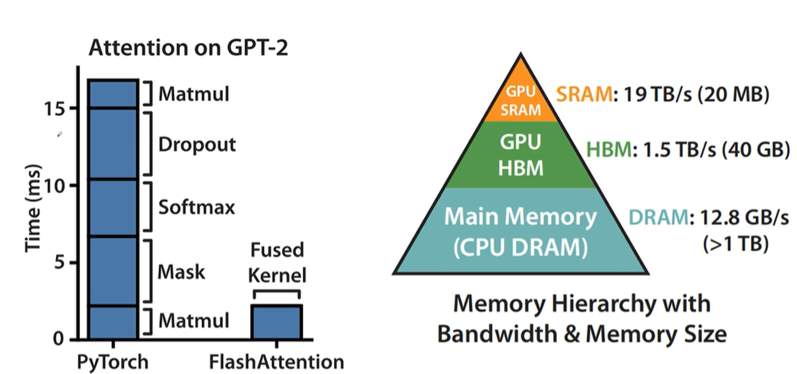

# 输出与推理

## 推理参数

对于 `num_beams` 参数，涉及到 Beam Search 方法。对于最朴素的大模型输出，如果我们在自回归的过程中一直用贪心的策略，当前某个token的概率最大不一定是整个句子的概率最大。于是我们设置 `num_beams=2` 维持了两条路径，最后选择整个句子的概率最大的那个结果。

对于 `top_k` 参数，例如设置为 2，则我们只保留 logits 中最大的两个，其余设置为负无穷大，之后经过softmax后那些负无穷大的则变成0，概率集中在 `top_k` 个token中。

但是，实际情况中 token 的分布可能是尖锐的，也有可能是平滑的。对于平滑的token概率分布，使用 `top_k` 是不合适的，所以我们引入了普适的 `top_p`

例如设置 `top_p=0.8` 则在第一次计算softmax后，保留累加大于0.8的前几个，其余设置为负无穷大，再经过一次softmax得到最终概率

对于 `temperature` 参数，即在 softmax 中添加一个参数 t，一般取值0.5~2，小于1时分布尖锐，大于1时分布平缓。
$$
p\left(x_{i}\right) = \frac{e^{{x_{i}}/{t}}}{\sum_{j=1}^{n} e^{{x_{j}}/{t}}}
$$

## KV Cache

对于 Transformer 中解码器的 self-attention 机制，每一个 token 和它前面的 token 做注意力机制。

- 第一个 token 和自己做注意力，输出是自己的 V
- 第二个 token 用自己的 Q 查询第一个和自己的 K，得到注意力权重，对于第一个和自己的 V 进行加权求和，得到自己的输出
- 第N个token 用自己的 Q 查询 N 个 K，得到注意力权重，对于 N 个 V 进行加权求和，得到自己的输出

因为 K 和 V 在计算后不会受到之后计算结果的影响，而且之后计算会使用，因此会被保存为 KV Cache，加速了大模型生成 token

以 A100-40GB GPU 上运行 13B 的 LLM 为例，在推理时：

- 参数占26GB，65%
- KV Cache占12GB，30%
- 以及其他系统占用

## Page Attention

然而，实际上KV Cache的利用率只有20%-40%。原因包括

1. 在大模型推理时，由于不知道会生成多少 token，于是总按照可生成最长序列长度预分配显存。如果预留1000个token，但是输出100个就结束了，那剩下900个token所占位置就浪费了
2. 对于其他请求，有可能只需要输出10个token就结束了，但是显存已经被预分配占用了，因此无法被响应。
3. 显存之间的碎片，由于 prompt 的长度不同，每次预分配的KV Cache大小也不同。当一个请求生成完毕释放缓存，但是下一个请求的 prompt 的长度大于释放的这个请求的prompt 的长度，所以无法放入被释放的缓存中。这种无法被使用的缓存就是碎片。

实际上，这个问题在操作系统中我们已经碰到过了，我们可以用虚拟内存和分页的思想来解决。

> 操作系统分配内存是按照最小单元页来分配的，每个页是4K，物理内存被划分为很多页，每个进程要用到的内存被映射到不同的页上。进程看到的是虚拟的连续的内存，实际上的物理内存是分页和不连续的。

在 vllm 的 Page Attention 中，显存划分为kv block，每个请求需要的 kv catch 被划分到显存不同的kv block里，比如每个kv block里可以缓存四个token的KV向量。随着大模型的推理产生了新的token，会继续加在未被填填满的block里，直到当前的block被占满，则再分配一个block。

这样避免了因为提前分配而造成的显存浪费，并且用块来分配减少了碎片的大小，最终将kv catch的利用率从原来的20%到40%提升到了现在的96%

此外，对于相同部分的prompt，在物理显存上也只需维护一份，同时维护引用计数。如果需要修改并且引用计数不为1，则触发写时复制，先复制一份再写。

## Flash Attention

> Fast and Memory-Efficient Exact Attention with I/O Awareness
>
> 参考：https://www.bilibili.com/video/BV1UT421k7rA/

从flash attention的论文题目就可以看出它的特点

- fast它可以加快模型训练的速度
- memory efficient可以减少显存的占用
- exact attention，它和标准的 attention 计算得到的结果是完全一致的，并不像其他一些算法，是以降低attention的精度来提高训练速度的
- I/O awareness 说明了整个算法是以改进IO效率来达到的

回顾一下原始的 Attention 计算，其中 softmax 按行计算

1. 矩阵QKV存储在HBM，里它们的形状都是N乘以D，N是序列长度，D是特征维度
2. 从HBM加载QK矩阵到 SRAM
3. 计算 $$S=QK^T$$，由于是分块计算，边算边将 S 保存到 HBM
4. 将 S 加载到 SRAM
5. 计算 P=softmax(S)，将 P 写出到 HBM
6. 从 HBM 加载 P 和 V 到 SRAM
7. 计算 O=PV，将 O 写出到 HBM
8. 返回 O

> 对于 Llama3-8B，序列长度为8192，维度为128，中间的S和P临时矩阵占用的显存非常大。虽然保留中间结果（比如S和P）会占用显存，但是还是需要的，因为反向传播时需要他们来计算梯度。

在模型训练时制约训练速度有两种情况 

- compute-bound：训练速度的瓶颈在于运算，比如对于大的矩阵乘法、多channel的卷积操作，数据量不大 但是计算很复杂
- memory-bound：从HBM读取数数据的速度跟不上运算的速度，算力在等待数据，主要的操作包括两类：（1）按位的操作，比如relu和dropout。（2）规约操作，比如sum 和softmax等。这些操作都是需要数据很多，但是计算相对简单。

Flash Attention 主要优化了memory-bound。主要通过融合多个操作（也叫做fusion）节约了原来多个操作之间要存取HBM的时间，让多个操作只要存取一次HBM，代价是不保存中间结果，需要在反向传播时重新计算，从下表看出这是值得的

| Attention    | Standard | FLASH ATTENTION |
| ------------ | -------- | --------------- |
| GFLOPs       | 66.6     | 75.2            |
| HBM R/W (GB) | 40.3     | 4.4             |
| Runtime (ms) | 41.7     | 7.3             |

> 具体的矩阵分块计算可参考上面给出的视频

显存里的存储是分级的，包括芯片内缓存和芯片外的HBM显存，芯片内缓存容量小但是访问快，芯片外的HBM容量大但是访问慢，所以对于优化IO速度应该尽可能的让计算访问芯片内的缓存而尽可能减少访问芯片外的HBM的显存
