# DeepSeek 笔记

## MoE

MoE（mixture of experts）即混合专家模型，是一种降低训练和推理计算代价的技术。相对的，不使用 MoE 被称为 Dense 模型。

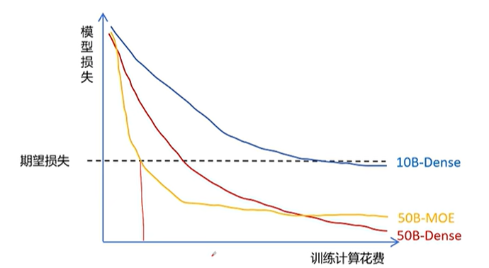

在预训练一个大模型时，我们设定期望损失和模型参数，对于相同的期望损失，如果我们加大模型参数，我们的训练计算花费会变少（不过推理花费会更大）。MoE 模型希望在达到同样期望效果时，训练计算和推理花费都变少。

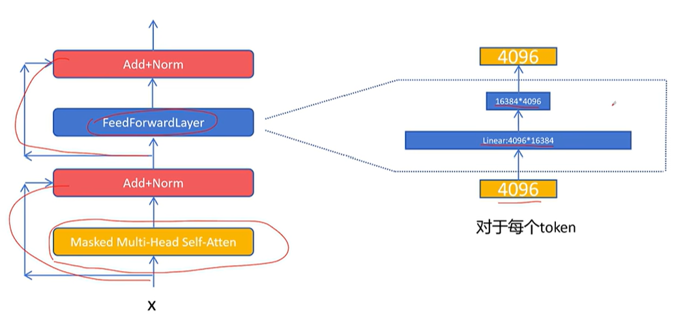

MoE 主要对传统 decoder only 大模型中 feed forward 层进行了改造，原始的feed forward layer的内部结构很简单，例如先升维到二倍到四倍，在通过线性层变回原来大小

MoE 中，原来的 feed forward 层被拆分为多个小的 feed forward 层，这时每个小的 feed forward layer的第一层相比 Dense 结构的第一层的维度可以大幅减小。例如，从原来的4096乘16384减小为4096乘4096，第二层也一样，以保证输出token的维度还是 4096。 这里被一个小的feed forward layer就被称为一个专家expert。

那对于每个输入的token，应该选择哪个的专家网络呢？这需要一个路由网络来决定。路由网络输出每个token走不同专家网络的概率值，然后给出其中排名靠前的几个（例如两个）专家。token 通过选择的这两个专家网络，得到两个维度为4096的向量，然后再根据路由网络输出的专家权重进行加权求和，得到输出。

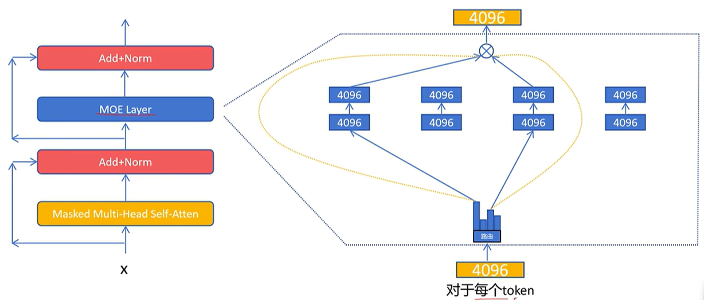

> 这里的专家选择是对每个 token 得出的，而不是序列

MoE 的特点是包括

- 在相同的计算代价下，增大了网络参数规模， 从而得到性能更好的大模型
- MOE网络基本可以达到和自己相同参数规模的稠密网络的性能表现
- 相比同等参数规模的稠密网络，MOE网络的计算代价变小了。但是所有专家网络参数都是要加载在显存中的，所以显存占用并没有减少

MoE 网络在训练时比稠密网络要难，因为会有专家在不均衡的问题：大量的token都被少数的几个专家处理，而其他的专家占用了网络参数，但是却不被激活。为了让MOE模型里的专家负载均衡，人们也想了很多办法。包括

- 训练时，每个token至少选择两个专家。如果每次只选择最好的一个专家，只有这个专家可以得到训练，它效果越来越好，权重越来越大，其他专家都得不到训练。所以一般训练时会选择权重最高的专家，同时以其他专家路由的权重作为概率，再随机选择一个专家
- 为了防止某些专家被过度训练，可以给每个专家设置token容量，也就是这个专家在一个batch里能处理的最多的token数，如果超过了这个token数，则对分配给这个专家的token输出为0， 这样这个token就通过残差连接进入下一层。
- 设置一个负载均衡的辅助损失，让模型在训练过程中自己学会负载均衡

我们来详细看一下负载均衡损失，它的目标是希望每个专家被调用的频率是相等的。它的计算公式如下：
$$
f_i = (该专家被调用的次数)/(所有专家给调用的次数)
$$

$$
\mathcal{L}_{\text{balance}}=\sum_i^n(f_i)^2
$$

这里可以通过柯西不等式来严格证明为什么只有负载均衡时，这个loss取最小值。

然而这个损失函数却不能直接拿来利用，因为我们计算每个专家被调用的频率，需要统计每个专家被调用次数，而每个专家是否被调用是通过topk操作进行的。topk操作是根据权重进行的一个选择操作，不是一个数值运算，它是不可微的，无法通过梯度下降进行优化。

一个近似的做法就是把频率的平方的一个频率 $$f_i$$ 用 $$p_i$$ 来代替，它是一个批次中所有token对该专家的路由的概率的平均值。理论上对该专家的路由的平均概率应该等于选择该专家的频率，同时路由的平均概率是通过softmax进行数据计算得到的结果，它是可微的。
$$
\mathcal{L}_{\text{balance}}=\sum_i^n f_i p_i
$$

> 这里虽然还保留了一个 $$f_i$$ ，不过整个式子已经可以被梯度下降优化，因为我们已经为反向传播给出了一个可微的通路，相当于把  $$f_i$$  作为常数

## DeepSeekMoE

DeepSeekMoE 的动机是让专家更加专精。基础的MOE实现中，假设有N个专家，每次选择两个专家，DeepSeek认为传统的MoE设置的专家数太少了，导致每个专家学习了过多的彼此不相关的知识，从而不够专精。

> 比如一个医院里只有两名医生，一个负责内科，一个负责外科，那每个医生需要掌握的医学领域就太广泛了，不利于他医术的进步。

DeepSeek 想到的办法就是将专家进行更进一步的细分，同时每个专家的网络也变小。比如将原来的N个专家变为2N个专家，每个专家网络参数量为原来专家的一半，这样在网络前向传播时，在和之前网络同样的计算代价的前提下，就可以激活四个专家。

> 原来是从8个专家里面选2个，有28种可能的组合；现在是从16个专家里面选4个，有1820种。可以看到对专家进行细分，可以得到更灵活的专家组合。

DeepSeek 又进一步想到，所有的专家可能都要学习一些基础的通用的能力，是否可以将所有专家都要学习的通用技术能力提取出来，作为一个共享专家，保证每次都会激活，他负责所有专家原来都需要的通用能力。然后再从后面(2N-1)专家里面选择3个专家，这样保证专家的总数不变。

> 这里可以理解为医院里面各个科室都需要验血，那就把验血作为一个共享科室，其他所有的科室都可以进行调用

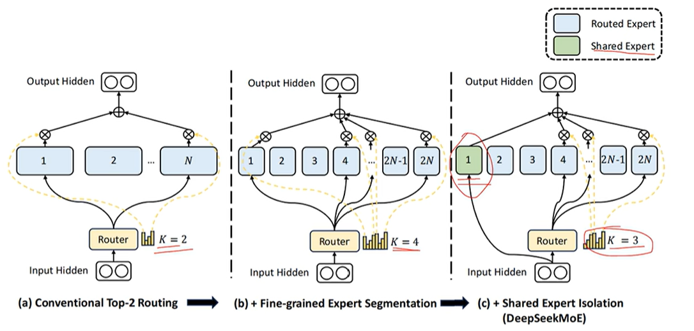

关于效果，DeepSeekMoE 在同等计算代价的情况下，相比稠密网络和普通MoE的效果都有很大的提升，并与每次都全部激活的稠密网络的性能相当。

## MLA

DeepSeek V2 中，保留了 MoE 机制，同时对注意力进行了修改，提出multi-head latent attention多头潜在注意力机制。

我们之前聊过的 KV cache 减少了推理时的计算量，加快了推理速度，但是它是以宝贵的显存空间来换取计算量的减少的。并且随着生成序列越来越长，KV cache会越来越大。 对此，人们也想了很多办法来代替多头注意力（MHA）。包括减少 KV 数量的 multi-query attention（MQA）和 group-query attention（GQA），这两种方法可以减少显存大小，但是也显著影响了模型性能

那么有没有减少显存大小又不影响模型性能，甚至可以提高模型性能的做法呢？ 这种方法被DeepSeek 找到了，那就是MLA 多头潜在注意力机制。它的原理也很简单：

1. 首先对token的特征向量通过一个参数矩阵进行压缩， 我们把它叫做 $$W^{DKV}$$ ，其中D是down的意思是向下压缩，KV就是K向量和v向量的意思。 比如原来的特征维度为 6，经过压缩到 2 维，然后只需要缓存这个 2 维的 KV 压缩向量
2. 在进行计算需要用到真实的K和V向量时，通过两个减压矩阵（$$W^{UK},W^{UV}$$）转化为原来的维度就可以。

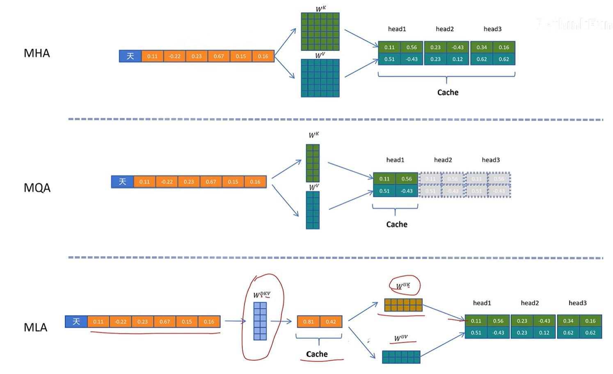

这时我们可以比较一下原始的MHA 、MPV以及MLA的缓存占用量。 MLA确实能减少缓存，而且实验表明，MLA的模型效果比MHA还要好，提升了性能。

这一切都非常不错。但是KV cache的本意是什么呢？它是为了减少推理时间。 MLA因为缓存了压缩的KV减少了缓存，但是在取出缓存后，K和V不能直接使用，还是要经过减压计算才可以，又引入了新的计算和时间，这和KV cache的初衷是相悖的。

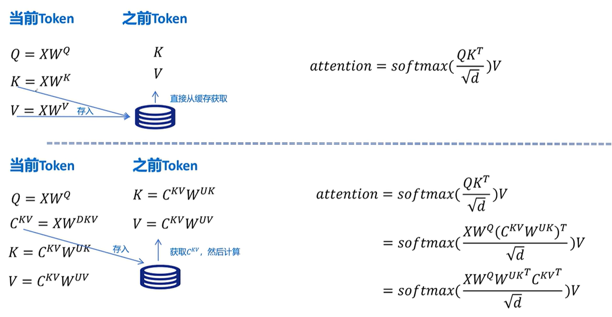

对于标准的带KV cache的注意力计算，对于当前的token计算QKV，然后缓存K和V，对于之前的token直接从缓存里取出K和V向量就可以，然后计算。

对于MLA的计算，Q的计算不变，但在K和V的计算时，需要进行压缩生成 $$C^{KV}$$ 向量，存入缓存，如果要得到当前和之前 token 的 K 和 V，需要通过解压矩阵获得

有一个加速的方式是，在MLA的计算公式中，最后得到的 $$W^QW^{UK^T}$$ 可以提前计算好，这样就省去了解压计算所带来的额外时间

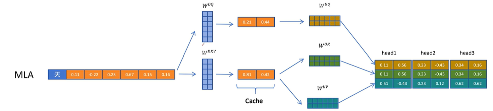

此外，Q的计算也可以引入同样的压缩和解压操作，这样减少了模型参数量并且也提升的效果，与 KV 不同的是 Q 的隐向量不需要缓存

但是当我们引入了旋转位置编码呢？下面是不带旋转位置编码的公式推导
$$
\begin{aligned}
q_{i} k_{j}^{T} &= h_{i}W^{Q}\left(c_{j}^{K V}W^{UK}\right)^{T} \\
&= h_{i}W^{Q}W^{UK^{T}}c_{j}^{KV^{T}} \\
&= h_{i}\textcolor{red}{W^{QUK}}c_{j}^{KV^{T}}
\end{aligned}
$$
对于RoPE，根据 token 位置的不同，旋转矩阵的参数也是不同的，如果增加了旋转矩阵 R ，它就出现在了 $$W^{Q}$$ 和 $$W^{UK^{T}}$$ 之间，而且因为 R 和位置相关，不能和这两个矩阵进行融合，所以破坏了之前想到的矩阵提前融合的方案。
$$
\begin{aligned}
q_{i} R_{i} (k_{j} R_{j})^{T} &= h_{i}W^{Q}R_{i} \left(c_{j}^{KV}W^{UK}R_{j}\right)^{T} \\
&= h_{i}W^{Q}R_{i}R_{j}^{T}W^{UK^{T}}c_{j}^{KV^{T}}
\end{aligned}
$$
DeepSeek最终想到了一个解决方案，就是给 Q 和 K 向量额外增加一些维度来表示位置信息

1. 对于Q向量，它通过 $$W^{QR}$$ 为每一个头生成一些原始特征。然后通过旋转位置编码增加位置信息。再把生成带位置信息的特征拼接到每个注意力头的Q向量
2. 对于K向量，通过 $$W^{KR}$$ 矩阵生成一个头共享的特征，然后通过旋转位置编码增加位置信息，然后复制到多个头共享位置信息。这里多头共享带位置编码的K向量也需要被缓存，以便在生成带位置信息的K向量时用到

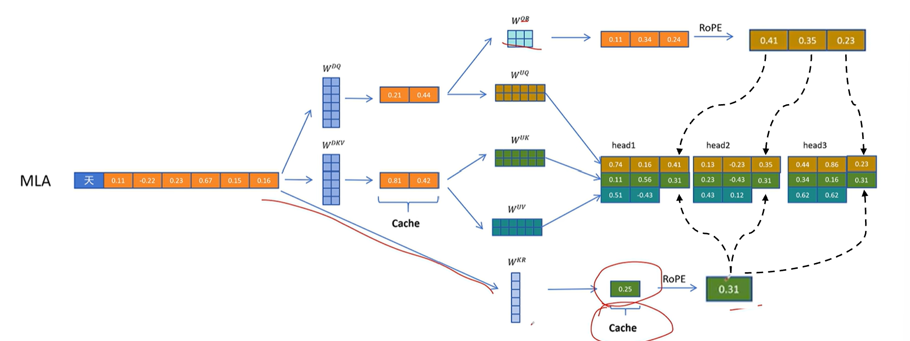

最后，将不带旋转位置编码的部分和旋转位置编码相加即可
$$
q_{i} k_{j}^{T}+q_{i}^R k_{j}^{R^T}= h_{i}{W^{QUK}}c_{j}^{KV^{T}}+ q_{i}^R k_{j}^{R^T}
$$
最后看一下论文中的mla图：

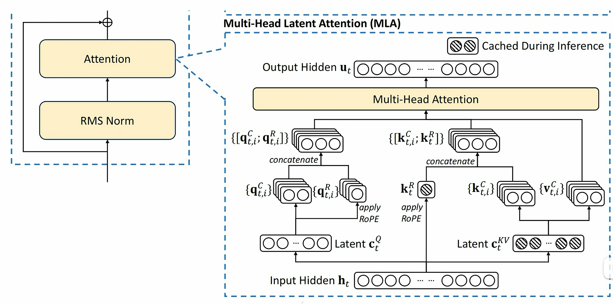

1. 通过 h 生成压缩的KV特征和压缩的Q特征
2. 压缩的 KV 特征解压为多头的K和V特征
3. 从输入特征 h 生成多头共享的带旋转位置编码的 $$k^R$$
4. 再把 $$k^C$$ 和 $$k^R$$ 合并，形成最终带位置编码的K向量
5. 通过解压生成多头的Q向量，然后从压缩的Q向量生成多头带位置编码的 $$q^R$$。合并 $$q^C$$ 和 $$q^R$$ 生成最终在位置编码的Q向量
6. 接着QKV向量进行多头注意力计算

注意图中阴影部分为需要缓存的中间变量，其中只有KV共用的压缩隐特征以及K的多头共享的带位置编码的向量需要缓存。

$$k^R$$ 可以不共享吗？ $$q^R$$ 可以从 h 中计算得来吗？最好的方法肯定是

- 从 h 向量直接计算
- 不共享

但是这样会大大增加显存使用和降低计算效率。原理上，基于潜向量 c 计算RoPE肯定是有损的，共享也肯定牺牲了表达能力，所以做了一些权衡：

1. Q向量都基于潜向量 c 生成RoPE向量而不共享，主要是为了增加计算效率。因为潜向量 c 小所以计算更快，而且每次都要计算。不共享是为了保证表达能力。
2. K向量是从缓存中取的，不用每次计算，所以直接在H中计算就好。但是如果不共享将会让每个头都有一个RoPE向量，大大增加显存占用，所以共享。

## MTP

DeepSeek V3 在推出时，效果超越了 openai 的 4o 模型，更令人震惊的是，它的训练成本竟只有500多万美元。下表展示了预估开销，假设 H800 GPU 租赁价格为 $2 每小时

| Training Costs       | Pre-Training | Context Extension | Post-Training | Total    |
|----------------------|--------------|-------------------|---------------|---------|
| in H800 GPU Hours    | 2664K        | 119K              | 5K            | 2788K   |
| in USD               | 5.328M      | 0.238M           | 0.01M        | 5.576M |||

另一个对比是，Llama3-405B 在更高级的H100显卡上训练了3080w小时，而DeepSeek V3在H800 GPU上也只用了279w小时，不到Llama3的1/10，效果更好。这让 DeepSeek 火出了圈，也否定了之前无脑堆算力来提升模型性能的做法，也引起了英伟达股价的震动。

DeepSeek V3除了在模型架构方面做了一些优化和改动外。也在训练框架方面做了非常多的改进，例如它是业界首次使用FP8混合精度训练超大参数量模型。

DeepSeek V3 采用了我们之前讲过的 MoE 和 MLA，在实践细节上有一些小的变化。在DeepSeek V2里，路由网络出来的各个专家的权重 logits 用softmax作为激活函数，这样让所有专家的权重加和为一。但是因为最终只选择 topK 个专家，被选择的这 topK 专家对权重还要再做一次归一化，所以这里也不一定必须用softmax。在DeepSeek V3里，这里就改成对每个专家权重的 logits 用sigmoid的函数作为激活函数。然后对选择的 topK 个专家再进行归一化，作为最终的专家权重。

V2 的专家权重（公式从下往上看）：
$$
\begin{aligned}
\mathbf{h}_{t}^{\prime} &= \mathbf{u}_{t} + \sum_{i=1}^{N_{s}}\mathrm{FFN}_{i}^{(s)}\left(\mathbf{u}_{t}\right) + \sum_{i=1}^{N_{r}} g_{i,t}\mathrm{FFN}_{i}^{(r)}\left(\mathbf{u}_{t}\right), \\
g_{i, t} &= \left\{
\begin{array}{ll}
s_{i, t}, & s_{i,t} \in {\operatorname{Topk}}\left(\left\{s_{j, t} \mid 1 \leqslant j \leqslant N_{r}\right\}, K_{r}\right), \\
0, & \text{otherwise},
\end{array}
\right. \\
s_{i, t} &= \operatorname{Softmax}_{i}\left(\mathbf{u}_{t}^{T}\mathbf{e}_{i}\right),
\end{aligned}
$$
V3 的专家权重：
$$
\begin{aligned}
\mathbf{h}_{t}^{\prime} &= \mathbf{u}_{t} + \sum_{i=1}^{N_{s}}\mathrm{FFN}_{i}^{(s)}\left(\mathbf{u}_{t}\right) + \sum_{i=1}^{N_{r}} g_{i,t}\mathrm{FFN}_{i}^{(r)}\left(\mathbf{u}_{t}\right), \\
g_{i, t} &= \frac{g_{i, t}^{\prime}}{\sum_{j=1}^{N_{r}} g_{j,t}^{\prime}} \\
g_{i, t}^{\prime} &= \left\{
\begin{array}{ll}
s_{i, t}, & s_{i,t} \in \operatorname{Topk}\left(\left\{s_{j, t} \mid 1 \leqslant j \leqslant N_{r}\right\}, K_{r}\right), \\
0, & \text{otherwise},
\end{array}
\right. \\
s_{i, t} &= \operatorname{Sigmoid}\left(\mathbf{u}_{t}^{T}\mathbf{e}_{i}\right),
\end{aligned}
$$
接下来是负载均衡的修改，之前 deepseek MoE 讲过针对 batch 的辅助负载均衡损失函数。在DeepSeek V3里去掉了针对batch的辅助负载均衡损失函数，而是在训练时，在每个step，针对每个专家的负载进行监控：如果某个专家负载过高，就减小它对应的偏置值 $$b_i$$ , 如果专家的负载过低，就增加它的偏置值。
$$
g_{i,t}^{\prime} = 
\begin{cases}
s_{i,t}, & s_{i,t}+{b_{i}} \in \text{Topk}\left(\left\{s_{j,t}+b_{j} \mid 1\leqslant j\leqslant N_{r}\right\}, K_{r}\right), \\
0, & \text{otherwise.}
\end{cases}
$$
需要注意的是，这个偏置值只在专家路由时起作用，在和最终专家的输出相乘时，还是采用原来的权重值， 不会加这个偏置值。

另外增加了针对序列的负载均衡损失函数，这个损失函数的形式和DeepSeekMoE针对batch的负载均动函数损失是一致的，都是用各个专家被选择的频率值乘以平均概率值再求和。
$$
\begin{aligned}
\mathcal{L}_{\text{Bal}} &= \alpha \sum_{i=1}^{N_{r}} {f_{i}} {P}_{i}, \\
f_{i} &= \frac{N_{r}}{K_{r} T} \sum_{t=1}^{T} \mathbb{1}\left(s_{i, t} \in \operatorname{Topk}\left(\left\{s_{j, t} \mid 1 \leqslant j \leqslant N_{r}\right\}, K_{r}\right)\right), \\
s_{i, t}^{\prime} &= \frac{s_{i, t}}{\sum_{j=1}^{N_{r}} s_{j, t}}, \\
P_{i} &= \frac{1}{T} \sum_{t=1}^{T} s_{i, t}^{\prime},
\end{aligned}
$$
之所以要增加序列负载均衡损失函数，是防止在序列内部专家负载不均衡。如果专家仅仅是在 batch 内负载均衡，那有可能是按照序列划分的专家，有的专家更能擅长回答某一类问题。这样，当模型部署后，如果用户在某一时间问多个同一方向的问题，就会出现专家负载不均衡的现象。

DeepSeek也做了消融实验，发现去掉 batch 的辅助负载均衡损失函数，通过动态调节每个专家的权重偏置的方法可以获得获得更好的模型效果，并且在不同大小的模型效果都是一致的。

下一个大的改动就是训练时采用了多 token 预测（MTP）之前我们学的大语言模型都是每次只能预测一个 token，但实际上像Google、meta等公司的研究人员一直在研究让 LLM 一次预测多个 token。

下图是 DeepSeek V3 出现之前的 MTP 模型架构。最后一层的 transformer block 改为和多个 token 预测的头放在一起，它的作用并没有改变还是预测下一个 token，从 （L-1） 层接入token的特征。再加一个共享参数的 output head

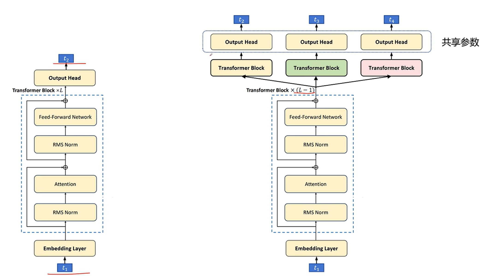

> 例如，输入是 t1，原始的输出头预测 t2，下一个MTP头需要预测 t3，再下一个MTP头则需要预测 t4。原始结构有个问题，比如对于第4个 token 的预测，它要在不知道它前面三个token的前提下预测出下一个token，这样难度就非常大。

在计算loss时，会分别考虑 t2、t3、t4 的交叉熵损失，其中 t2 的损失权重会大一些，t3 和t4 的损失权重会小一些，这样做是有一定道理的，那就是我们人在说一句话时，大脑并不是一个字一个字生成序列，很有可能一下子就思考出一个片段。

具体到模型训练时，对于骨干网的训练监督信号，由原来的下一个token变为多个token，这可以增加训练信号，提高数据的利用率，另外这样也迫使微信可以提前规划它提取的特征，更好的预测未来的token。多 token 的预测还有一个好处就是可以加速预测，它的加速预测不是简单的直接用多个头来生成接下来的多个 token，因为预测最准确的还是预测下一个token 的那个头，预测越远的 token 越不准确，需要进行修正。下面我们看一下利用MTP进行预测加速的方法。

假设输入“天生我”，MTP 同时预测出 “才必有人” 共四个 token，在这一步 "才" 最近也最准确，图示为深色。其余还不确信为浅色，那么对于不确信的token该怎么办呢？答案就是拿第一个头再去验证一下。

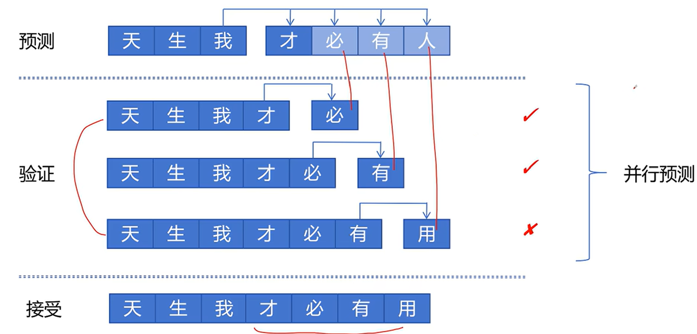

所以我们构造了这样如上的 batch，用第一个头来预测下一个头，对不确信的token逐个进行确认。这里前面两个对了，第三个错了。需要注意的是，这里三个序列是通过一个 batch 并行进行验证的（因为GPU擅长并行计算），主要时间开销是显存访问。所以认为这一个 batch 3个序列的验证时间，和一个序列生成 1 个 token 的时间差不多。

最后我们接受最长的正确序列。虽然第四个头预测错了，但是验证时给出了更确信的答案，最终接受时就接受更确信的答案。可以看到，通过预测和验证两步运算就预测出来4个token，原来这需要四步运算才可以完成。所以 MTP 可以加速推理，但这是以增加GPU的计算量为代价的（第二步要同时对三个序列进行预测）

更进一步，可以将验证和预测放在一起。假如理想情况下四个头都预测正确，在验证时，我们之前是只让头去预测下一个 token，现在我们让头输出多个 token。比如验证时，以4个序列为一个batch，则在验证完成后就又可以进入下一步的验证了，这样不断地进行验证加预测的循环，就可以在每个 batch 结束后输出接受的序列，效率更高。

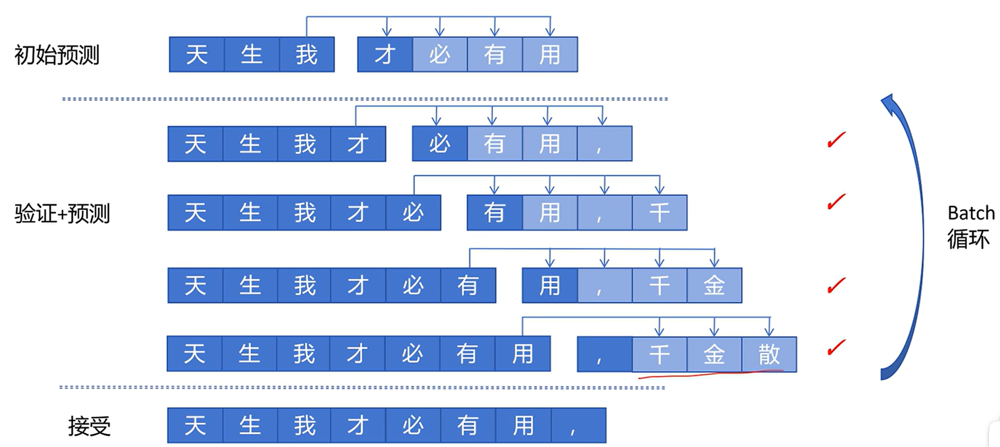

MTP 预测加速是在生成单个序列时有效，就是整个集群只为你一个人做推理服务，那确实可以加速推理。但是我们知道现在像vllm这样的推理框架支持动态 batch，可以支持多用户同时访问 LLM，它会自动的将多个不同的请求组合成 batch 进行预测，这是 MTP 的预测加速就没有优势了，反而会因为可能的验证不通过而浪费计算。

所以 DeepSeek MTP 只是在训练时利用 MTP 来提升模型的性能，在推理部署时一般就丢弃掉其他几个预测多步的头，就只用第一个头来做下一个 token 的预测，和普通单头的大模型没有区别。

DeepSeek MTP 在模型架构上也进行了修改。原来的多 token 的预测有个问题，就是跨多步的 token 不知道它前面的几个token，从而预测正确率变低，不利于模型的收敛。比如对于第四个 token 的预测，它要在不知道它前面三个token的前提下预测出下一个token，这样难度就非常大。于是考虑给每个头传入了额外的信息，帮助多 token 预测的头更好预测出自己接下来的token。

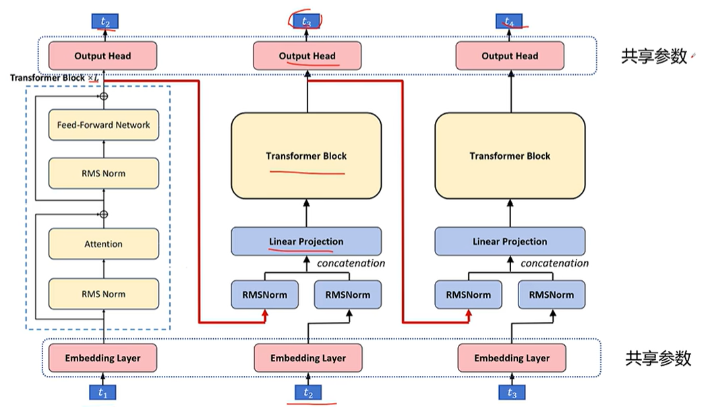

1. 对于原始模型架构，输入为 t1，基于经过 L 层的transformer block，输出经过分类头，预测出 t2
2. 然后我们增加一个MTP头
   1. 它的输入来源有两个：（1）来自第 L 层的token的特征，注意不是 L-1 层。 （2）t2 token经过embedding后的特征。这样的输入信息更全面，可以输出 t3 了
   2. 然后分别做归一化，然后按token把特征拼接起来，每个 token 的特征维度就变成了原来的二倍。 这需要再经过一个线性层映射为原来的维度。
   3. 经过一个transformer block，接下来经过分类头来预测 t3。
3. 之后的 MTP 头同理，这样实现了将模型在L个块中推理过程转化为模型在1个块中的推理过程，从而实现加速

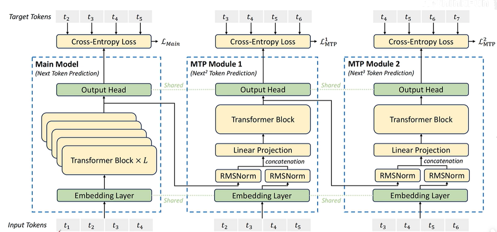

论文里的图如上，因为训练时所有的token都是已知的，可以通过 mask 机制一次进行多个 token 训练。

1. 对于主模型，输入为 t1到t4，输出是 t2 到 t5
2. 对于第一个 MTP 头，传入的是可以预测出 t2 到 t5 的token特征，同时 t2 到 t5 的embedding也被传入第一个MTP头，最终第一个MTV头预测出 t3 到 t6
3. 第二个 MTP 头也是类似

对于两个 MTP 头，它们的交叉熵loss会加入到模型的最终的loss里面。比如在 DeepSeek  V3 里面，对所有的 MTP 头的loss取平均，然后乘以权重 $$\lambda$$ ，前10T token 为0.3，后 4.8T token 为 0.1
$$
\mathcal{L}_{\mathrm{MTP}} = \frac{\lambda}{D} \sum_{k=1}^{D} \mathcal{L}_{\mathrm{MTP}}^{k}
$$
消融实验中，在添加mtp训练后，各个参数量的模型性能都有显著提高。

## GRPO

[复习一下](https://qmmms.gitbook.io/note/deep_learning/basic_concepts/qms15-qiang-hua-xue-xi#ding-yi-xun-lian-mu-biao) 策略梯度算法 和 GAE广义优势估计，我们有公式：
$$
A_{\theta}^{GAE}(s_{t},a)=(1 - \lambda)(A_{\theta}^{1}+\lambda * A_{\theta}^{2}+\lambda^{2}A_{\theta}^{3}+\cdots)=\sum_{b = 0}^{\infty}(\gamma\lambda)^{b}\delta_{t + b}^{V}
$$

$$
\nabla \mathbb{E}(R(\tau)_{\tau \sim P_{\theta}(\tau)})\approx \frac{1}{N}\sum_{n = 1}^{N}\sum_{t = 1}^{T_{n}} A_{\theta}^{GAE}(s_{n}^{t},a_{n}^{t})\nabla\log P_{\theta}(a_{n}^{t}|s_{n}^{t})
$$

这些努力，总结一下，就是让对某个状态下做出当时动作的概率的指导信号越来越精确化。现在我们回到大模型生成场景下的强化学习，我们看一下 GAE 优势函数的计算。

比如用户问了一个问题：“什么是数据库？”那么形成了两个回答，并且我们用训练好的reward模型给这两个回答不同的打分。[复习一下](https://qmmms.gitbook.io/note/llm/qms04-qiang-hua-xue-xi)，reward模型只能对整个回答给出一个得分，而大模型是逐个生成token的，它以当前已经生成的序列作为当前状态，生成下一个token作为action，reward模型不能为每个action，也就是每个token给出reward值，它们只能把回答作为一个整体给出一个打分。但是在训练状态价值网络时，需要每一步的reward，这该怎么办呢？

之前讲过，reward 的模型给出的得分只放在最后一个token里，其他token的得分都为零，然后，但是基础上加上当前训练模型和参考模型之间的KL散度乘以一个负值，这样我们就得到每个token对应的reward值了。

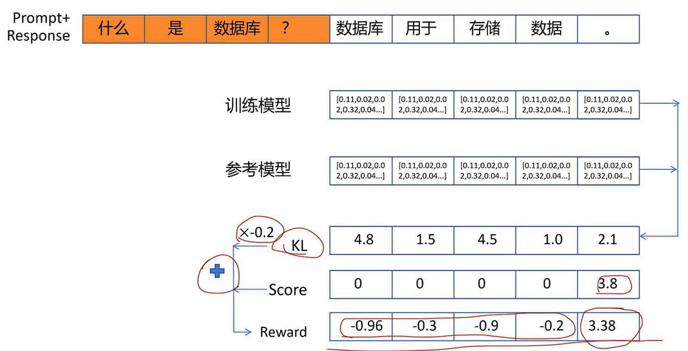

很明显只有最后一个token的reward值是有意义的，其他token的reward值只是用来限制新的模型不能和原来的模型差别太大的 KL 散度。这些用 KL 散度生成的reward值是有一些作用，但是作用有限。reward值最好是能直接评价这个动作对整个轨迹带来的是正面影响还是负面影响。这里用 KL 散度实在有些牵强

我们再来回顾一下PPO算法里面是怎么计算每个token的 GAE 优势值的：

1. 为每个token生成reward值
2. 用这些reward值训练状态价值网络
3. 利用每个token的reward值和状态价值，共同计算GAE的值

不论是这个状态价值网络的训练还是计算GAE的优势值，其基础监督信号都来自每个token的reward。还有我们之前说过，我们给每个token的reward并不准确，所以这里的状态价值网络和GAE的优势值计算并不是最优的。

> 注意，这里并不是说PPO算法不好，只是不适合 LLM 生成的场景。因为我们只能给最终输出给出一个奖励值，而无法对每一步，也就是每一个token，给出具有参考价值的奖励值。导致 PPO 在训练 LLM 不是最优的

GRPO是怎么解决这个问题的呢？思想是：既然reward是针对整个回答，无法给出每个token具有意义的reward，那就把一个回答序列看成一个整体。令prompt 是当前的状态，那一个回答序列就是一个action。LLM 回答问题的场景下，整个trajectory就只有一个状态和一个action，状态就是 prompt 序列，action就是输出序列

一个prompt下我们生成多个回答，就相当于在一个的状态下采取了不同的action。那根据优势函数的思想，怎么体现不同回答，也就是不同action，的优势呢？

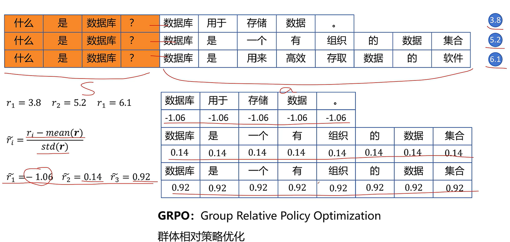

首先针对同一个 prompt 通过采样生成多个不同的回答，然后调用reward模型或者基于规则的reward的函数，只要能给出一个reward值，表示这个回答的好坏就可以。优势就是每个回答得到reward值减去所有回答得到的reward的均值。同时为了在不同的prompt和回答之间的数据的一致性，再除以这一组回答reward值的标准差。

因为我们把整个回答所有的token都看成一个整体，就把这个优势值复制分配给每个token。这就是GRPO（group related policy optimization）群体相对策略优化。相比PPO，GRPO 不用训练状态价值函数就可以直接得到优势值，简化了训练过程，并且这里的优势值在 LLM 场景下更有意义。

回忆一下 PPO 的损失函数
$$
Loss_{ppo}=-\frac{1}{N}\sum_{n = 1}^{N}\sum_{t = 1}^{T_{n}}A_{\theta'}^{GAE}(s_{n}^{t},a_{n}^{t})\frac{P_{\theta}(a_{n}^{t}|s_{n}^{t})}{P_{\theta'}(a_{n}^{t}|s_{n}^{t})}+\beta KL(P_{\theta},P_{\theta'})\\
$$
直接换成 GRPO 的优势函数
$$
Loss_{ppo}=-\frac{1}{N}\sum_{n = 1}^{N}\sum_{t = 1}^{T_{n}}A_{\theta'}^{GRPO}(s_{n}^{t},a_{n}^{t})\frac{P_{\theta}(a_{n}^{t}|s_{n}^{t})}{P_{\theta'}(a_{n}^{t}|s_{n}^{t})}+\beta KL(P_{\theta},P_{\theta'})\\
$$
当然也可以考虑加上截断函数，以防止训练策略和参考策略偏差过大。

我们看一下论文里的公式，注意这里是优化目标函数（要尽量大），注意符号，此外，加上了截断函数，其余和我们的公式都是一样的
$$
J_{\text{GRPO}}(\theta) = \mathbb{E}\left[q \sim P({Q}), \left\{o_{i}\right\}_{i=1}^{G} \sim \pi_{\theta_{\text{old}}}(O \mid q)\right] 
\frac{1}{G}\sum_{i=1}^{G}\frac{1}{|o_{i}|}\sum_{t=1}^{|o_{i}|}
\left\{
\min\left[
\frac{\pi_{\theta}\left(o_{i,t} \mid q,o_{i,<t}\right)}{\pi_{\theta_{\text{old}}}\left(o_{i,t} \mid q,o_{i,<t}\right)}A_{i,t}^{\text{GRPO}},
\operatorname{clip}\left(
\frac{\pi_{\theta}\left(o_{i,t} \mid q,o_{i,<t}\right)}{\pi_{\theta_{\text{old}}}\left(o_{i,t} \mid q,o_{i,<t}\right)},
1-\varepsilon, 1+\varepsilon
\right)A_{i,t}^{\text{GRPO}}
\right]
- \beta \text{KL}\left[\pi_{\theta} \mid \pi_{ref}\right]
\right\}
$$

- $$Q$$ 表示问题集合，从中采集问题 $$q$$
- 老的策略网络基于 $$q$$ 生成一组 output $$\left\{o_{i}\right\}_{i=1}^{G}\sim \pi_{\theta_{\text{old}}}(O \mid q)$$，包含 $$G$$ 个
- $$|o_{i}|$$ 表示每个输出序列的长度
- $$\pi_{\theta}$$ 表示当前的训练网络，$$\pi_{\theta}\left(o_{i,t} \mid q,o_{i,<t}\right)$$ 表示根据 $$t$$ 之前的 token 预测出 $$t$$ 位置 token 的概率
- $$A_{i,t}^{\text{GRPO}}$$ 为第 i 个输出序列，第 t 个token的 GRPO优势值
- 后面是阶段函数和 KL 散度
- 这里不仅对序列数量，也对 token 长度求了平均
