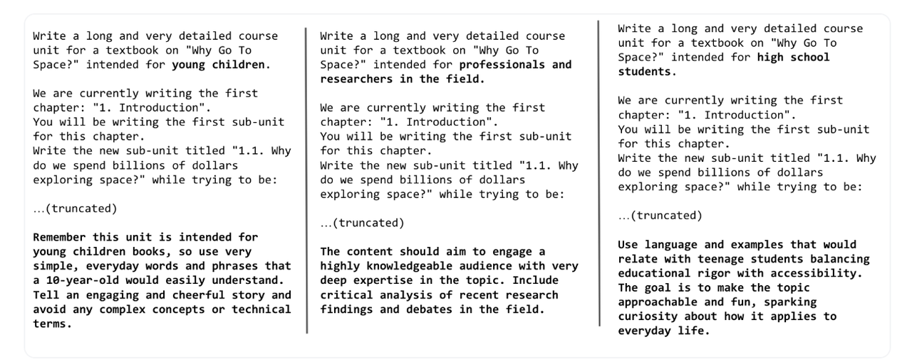
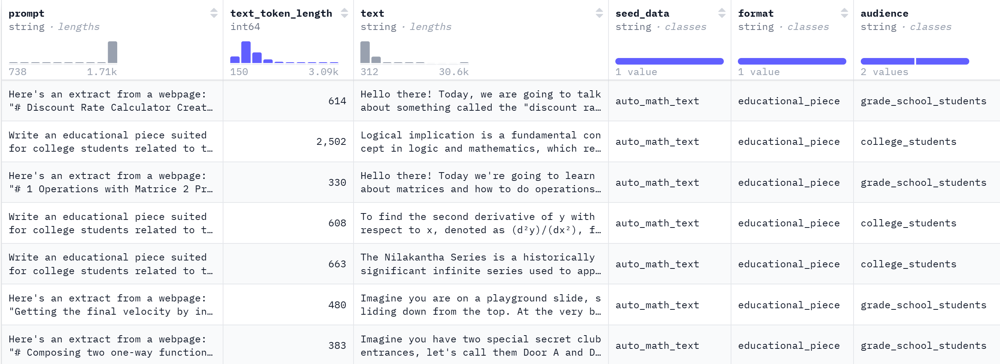
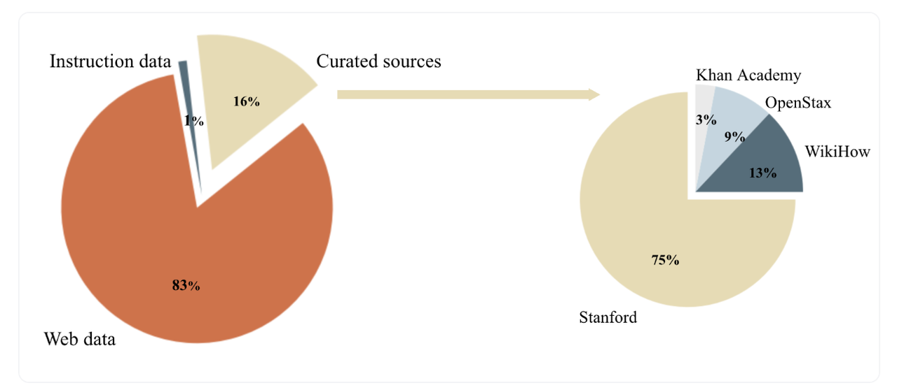
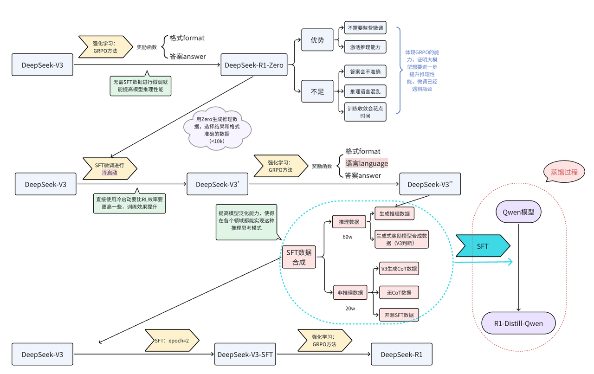
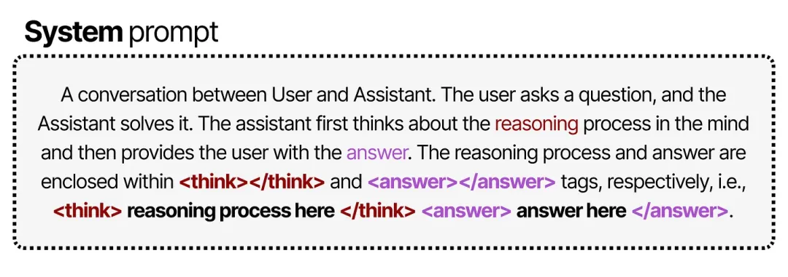
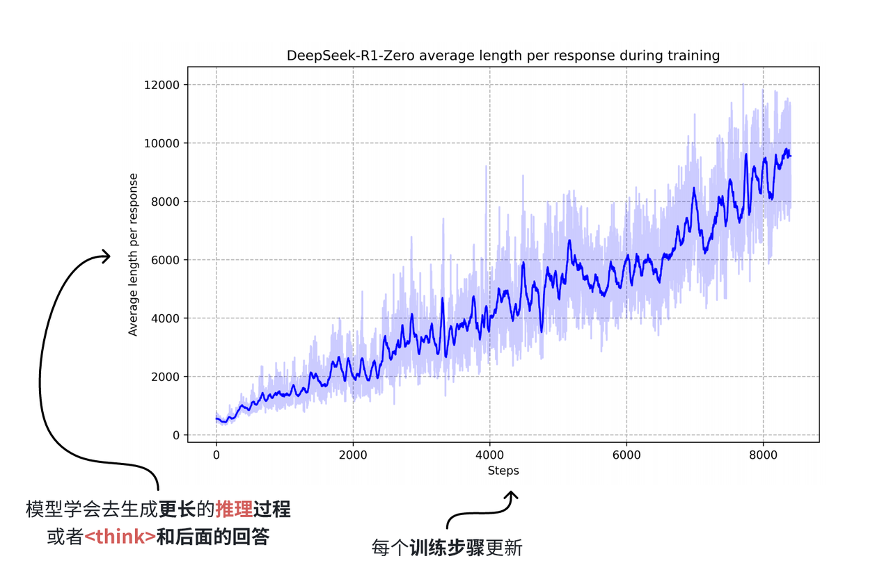
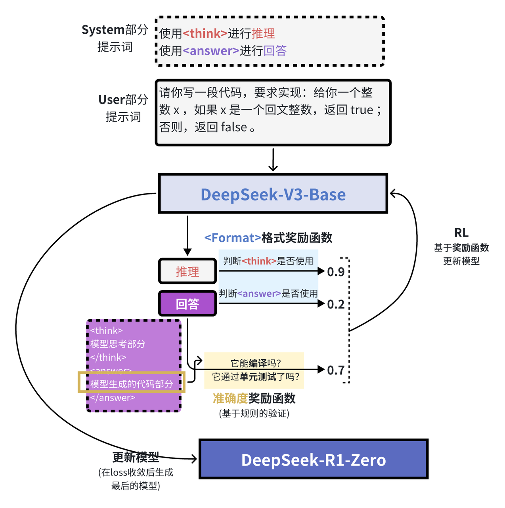

# 数据合成

> 参考：https://docs.swanlab.cn/course/prompt_engineering_course/08-synthetic_data/README.html

合成数据（Synthetic Data）是指用算法、生成模型或仿真程序“造”出来的数据，它模仿真实世界数据的统计分布和结构，但并不直接来源于真实观测，在此教程里，合成数据是由大模型根据不同的提示词生成的数据。

## 预训练

早期的大模型，大模型的性能提升着重于预训练阶段，早期提到的[Scaling Law法则](https://arxiv.org/pdf/2001.08361/1000)中，我们得知，模型规模、数据规模和模型性能之间呈现幂律增长的趋势，当模型参数量和训练数据规模同时增长的时候，模型性能有稳定的提升。

因此在当时的学者看来，**训练数据越多，模型就能越大，模型表现就能越好**

在大模型发展的早期，OpenAI的GPT系列模型可谓是AI领域的领头羊，[GPT-3](https://proceedings.neurips.cc/paper_files/paper/2020/file/1457c0d6bfcb4967418bfb8ac142f64a-Paper.pdf)的强大性能和预训练阶段庞大的数据规模密不可分。GPT-3的预训练模型使用大约2/3互联网数据、整个维基百科以及2个大型图书馆数据进行训练，由于数据需要经过去重、清洗，事实上，GPT-3预训练使用的互联网数据规模基本是能获取的数据规模极限，因此模型规模也没有再有提升的空间。

在数据和模型规模都到达瓶颈的情况下，如何提升模型性能呢？

[Textbooks Are All You Need](https://arxiv.org/pdf/2306.11644)这篇论文思考在预训练阶段如果对数据质量提升，能否提升模型性能。作者给出的答案是肯定的，并且开创性的在论文中提出，预训练阶段“教科书”级数据能够给模型带来非常不错的提升

> 当然从现在看来，合成数据并不是大模型发展的绝对因素，不过即便如此，在当今社会，合成数据仍然是各个AI行业不可或缺的一环。

作者认为，在预训练阶段，数据集的质量集中在多样性、去除噪声以及教科书。

- 多样性：所有的大模型在预训练阶段既要保证数据主题的广泛性，要涵盖尽可能多的知识点，也要保证数据不会有明显的重复。重复数据对于模型训练来说基本是毁灭性的打击，模型会优先 “记住” 这些重复信息，而非学习背后的通用模式，泛化能力降低，同时会人为放大某类信息的占比，导致模型误以为这类信息更重要或更常见。
- 去除噪声：互联网中存在大量会干扰模型学习的噪声数据需要去除，不过需要注意的是，高质量的判定并不包含Toxic信息，也就是有毒内容，因为即便是涉及安全类信息，只要不是重复性高、多样化程度低的数据其实都算高质量数据，而有毒内容的剔除往往是后训练阶段处理。
- 教科书数据：学习“教科书”数据能够大幅度提升模型的能力，但是这类数据在网络上其实并不多，大多数还是类似于科普类专业数据。即便将所有的“教科书”数据提取出来并数据清洗去重，得到的结果其实也有偏向，比如数学类比较多，文学类比较少，这样训练出来的模型很有可能发生过拟合的现象。

对于教科书数据，Phi论文的作者认为可以用大模型合成“教科书”数据，模型能够很好的理解提示词并生成高质量的回答，对于不同的`受众群体`，提示词的构建也会有相应的调整，在[huggingface的博客](https://huggingface.co/blog/zh/cosmopedia)中提到了少儿、专业人士和研究人员以及高中生生成相同主题的教科书的提示：



而面对不同的群体，哪怕是同一个知识点，不同群体之间的关联度其实很低，因此这样生成的数据，即便背后的知识一致，也不会导致重复性数据，从而训练过拟合，而这样生成的数据，规模是成倍增长的，并且由于大部分知识可以从网络知识中获取，那么“教科书”数据可以确保数据质量和规模。

> 同样的数据源，当提示词中受众目标更改，专业人员所面对的一大堆公式，在受众群体是小学生时一点都没有提到，那么数据重复性就无从谈起，对于大模型合成的数据，哪怕是3100k条数据也能保证多样性。

考虑到多样性，也不能全是“教科书”，并且“教科书”本身也要保持多样性（例如数学和人文知识分布平衡），Phi的作者将网络数据和教科书数据混合训练模型，成果相当不错

huggingface团队为复现[Phi-1.5](https://arxiv.org/abs/2309.05463)过程中所遇到的挑战及其解决方案，构建了包含数十亿词元的合成数据集[cosmopedia](https://huggingface.co/datasets/HuggingFaceTB/cosmopedia)，当然还有采样了100k条数据的[cosmopedia-100k](https://huggingface.co/datasets/HuggingFaceTB/cosmopedia-100k)。



该数据集根据论文中提供的信息，从网络以及各个教育平台获得“种子数据”，然后由“种子数据”通过大模型合成扩大到3000万条的规模，其中`seed_data`就代表词源信息，然后由于受众群体`audience`的不一样，根据不同的任务类型`format`，提示词`prompt`会进行相应的构建，然后利用GPT-3.5生成相应的回答，也就是我们最终需要预训练数据`text`。

cosmopedia 的“种子数据源”分别是网络数据和教育数据，其中网络数据占比最高，高达83%，还有纯粹的教育数据有16%，最后还有其他少量指令数据。



该huggingface团队还提供了[复现代码](https://github.com/huggingface/cosmopedia)，合成步骤简单总结为三步，分别是：

1. 合成prompt
2. 根据prompt生成数据
3. 数据筛选、去重等

合成prompt的思想还是提示词+网络数据（上下文），具体的prompt可以参考[官方的提示词](https://github.com/huggingface/cosmopedia/blob/main/prompts/web_samples/build_web_prompts.py#L6)，`<INSERT_EXTRACT>`是网络数据放入的地方。

```
"wikihow":
"""Here is an extract from a webpage: "<INSERT_EXTRACT>".

Write a long and very detailed tutorial that could be part of WikiHow whose title is related to the extract above<ADD_TOPIC>. Include in depth explanations for each step and how it helps achieve the desired outcome, inluding key tips and guidelines. 
Ensure clarity and practicality, allowing readers to easily follow and apply the instructions. Do not use images.""",
```

接着采用vllm框架根据prompt生成数据。

关于数据筛选，可以查看[官方给出的web数据筛选代码](https://github.com/huggingface/cosmopedia/blob/main/prompts/web_samples/filter_and_classify_clusters.py)，预先定义了三类（textbook、blogpost、wikihow）对应的主题列表，以及定义了需要移除的低质量或不相关主题列表

关于数据去重，利用[datatrove库](https://github.com/huggingface/datatrove)中的Minhash实现数据去重，[代码在此](https://github.com/huggingface/cosmopedia/tree/main/deduplication)，如果不需要Slurm集群来实现大规模数据去重，仅仅实现少量数据，对于官方代码中的所有`SlurmPipelineExecutor`改成`LocalPipelineExecutor`，具体原理可参考[datatrove的本地pipeline](https://github.com/huggingface/datatrove?tab=readme-ov-file#localpipelineexecutor)设置。我们的代码在这👉[ours](https://github.com/828Tina/PromptEngineeringCourse/tree/main/5.synthetic_data/pretrain_data_generation)。

这段代码通过 Minhash 算法，也就是哈希去重的方法实现文本去重，哈希去重通过将任意长度文本转化为固定长度哈希值，既能大幅压缩数据规模，又能利用 “相同文本生成相同哈希值” 的特性快速判断重复，避免直接比对原始文本的冗余计算。其计算速度快且存储成本低，非常适合海量数据场景，像 Minhash 这类算法还能捕捉文本相似性，不仅检测完全重复，还能识别高度相似内容。同时，结合分桶、聚类等策略可进一步减少比对次数，显著提升大规模数据处理的效率，最终实现高效、精准的重复内容识别与过滤。

- 首先配置 Minhash 参数，包括哈希精度、桶数量和每个桶的哈希数，这些参数直接影响去重精度和效率。MinhashDedupSignature 组件为每条英文文本数据生成独特签名然后保存，签名作为文本的紧凑表示，在保留特征的同时减少数据量，且通过多进程并行处理提升效率。
- 第二阶段进行签名分桶匹配，从签名文件夹读取数据，按配置的桶数量将相似签名文本归入同一桶中。这种分桶策略缩小了后续比较范围，避免全量两两比对，大幅提高处理效率。
- 第三阶段基于桶结果聚类，从桶文件夹读取数据，将重复文本聚合成簇，确定需移除的重复数据 ID，明确重复文本对象，为最终过滤做准备。
- 第四阶段完成重复过滤：这一阶段再次读取原始数据，指定文本字段为 “generated_text”（我们的数据保存到这里，当然也可以命名其他字段）；然后依据 remove_ids 信息过滤重复数据，被移除数据由 exclusion_writer 保存到 removed 文件夹，剩余非重复数据单独保存。

## 微调

大模型经过预训练后，已经具备了基础的语言理解和生成能力，但这些能力更多是通用层面的。**微调就成了让大模型 “术业有专攻” 的关键步骤**，通过在特定任务或领域的数据上进一步训练，让模型适配具体需求，提升在目标场景下的性能。而微调的效果，很大程度上取决于数据的质量和适配性：

- **数据质量必须足够高**，需要准确、规范、无歧义，避免错误信息误导模型学习。
- 在格式上，微调数据基本以问答格式为主，因为这种格式能直接对应模型的交互场景，让模型学习到 “输入问题→输出答案” 的映射逻辑
- 对于更复杂的场景，多轮对话格式的数据也必不可少，它能帮助模型理解上下文关联，提升连续交互能力
- 微调数据往往需要专注于某一特定领域，比如法律、金融、医学等，这些领域专有问答数据，是让模型掌握专业知识、形成领域思维的核心素材

然而，**现实情况是网上这类高质量的领域专有问答数据非常稀少**。早期获得这类数据更多的依赖于人工标注，但是面对日益扩大的模型规模和任务需求，人工标注不仅耗时耗力，而且人工标注多多少少都会有偏向性从而无法保证数据的`丰富度`，因此最初大家都在往预训练阶段发力。

例如[Stanford Alpaca: An Instruction-following LLaMA Model](https://arxiv.org/pdf/2212.10560)论文，由预训练GPT-3通过设定的提示词合成指令数据，然后清洗、去重等，最终用合成的指令数据对Llama模型进行微调，得到的Llama-Instruct模型在各个测试数据上都取得了不错的效果，生成的数据集就是我们在入门大模型微调时经常使用的数据集[Alpaca](https://huggingface.co/datasets/tatsu-lab/alpaca)，总计52k条数据，所有的数据都是由GPT-3预训练模型生成，如果想复现生成数据集的代码，查看[官方给的代码](https://github.com/tatsu-lab/stanford_alpaca/blob/main/generate_instruction.py)即可。

一般的，指令微调的数据集包含三个部分：指令、输入、输出，其中每一部分含义如下：

- `instruction`：描述模型应执行的任务。52K 条指令中的每一条都是唯一的。
- `input`：可选的上下文或任务输入。例如，当指令为“总结以下文章”时，输入就是文章本身。大约 40% 的示例包含输入。
- `output`：由`text-davinci-003`（GPT-3）模型来生成的指令的答案。
- `text`：`instruction`，`input`并使用作者用于微调其模型的[提示模板](https://github.com/tatsu-lab/stanford_alpaca#data-release)`output`进行格式化。


完整的数据合成流程分为四步，分别是1）生成任务指令，2）判断指令是否属于分类任务，3）采用输入优先或输出优先的方式进行实例生成，4）过滤低质量数据

首先需要人工编写多个种子任务，这些种子任务其实就是正常的问答，不过要添加任务主题，还有任务类型，比如下面的例子：

```json
{
    "id": "seed_task_0", 
    "name": "breakfast_suggestion", 
    "instruction": "Is there anything I can eat for a breakfast that doesn't include eggs, yet includes protein, and has roughly 700-1000 calories?", 
    "instances": [{"input": "", "output": "Yes, you can have 1 oatmeal banana protein shake and 4 strips of bacon. The oatmeal banana protein shake may contain 1/2 cup oatmeal, 60 grams whey protein powder, 1/2 medium banana, 1tbsp flaxseed oil and 1/2 cup watter, totalling about 550 calories. The 4 strips of bacon contains about 200 calories."}], 
    "is_classification": false
}
```

`name`是主题，`is_classification`判断任务类型是否属于分类任务。论文中给出的种子数量仅有175条，这些种子任务目的是为了后续模型生成的时候有参照的模板，类似于`few-shot`的例子部分。由于任务种类较少，因此第一步是让大模型模仿并扩展任务指令，从任务池中采样8个任务，其中6个是种子任务的，2个是新生成的（任务池随着每次迭代更新数据，因此后续会有新生成的指令任务）

```
Come up with a series of tasks:
Task 1: {instruction for existing task 1}
Task 2: {instruction for existing task 2}
Task 3: {instruction for existing task 3}
Task 4: {instruction for existing task 4}
Task 5: {instruction for existing task 5}
Task 6: {instruction for existing task 6}
Task 7: {instruction for existing task 7}
Task 8: {instruction for existing task 8}
Task 9:
```

task9开始让大模型生成新的task和instruction作为新的指令，然后生成、数据过滤、去重清洗、加入到任务池中反复执行，从而扩展了大量的任务指令。有了任务指令后进行样例生成，这里需要注意的是，input和output都是GPT-3生成的，因为你的目标是生成数据集，而不是和模型问答，我们需要先明确是否为分类任务

- 分类任务要先生成output，也就是标签，再生成input。分类任务先生成标签是为了确保input不会偏离标签，因为本身由于instruction 的不同，模型生成的input有偏向，先生成了output确保生成的input不会偏离output标签
- 不是分类任务的话先生成input再生成output。因为非分类任务的output是跟着input走的，而不是像label一样是固定的，因此先生成input然后输出output

当明确了分类任务类型后，就能使用大模型生成对应任务类型的数据，比如我们看个例子：

```
# 分类任务

Given the classification task definition and the class labels, generate an input that
corresponds to each of the class labels. If the task doesn’t require input, just generate the correct class label.

Task: Classify the sentiment of the sentence into positive, negative, or mixed.

Output(Class label): mixed
Input(Sentence): I enjoy the flavor of the restaurant but their service is too slow.

Output(Class label): Positive
Input(Sentence): I had a great day today. The weather was beautiful and I spent time with friends.

Output(Class label): Negative
Input(Sentence): I was really disappointed by the latest superhero movie. I would not recommend it.
```

```
# 非分类任务

Instruction: Given an address and city, come up with the zip code.
Input: Address: 123 Main Street, City: San Francisco
Output: 94105
```

然后通过过滤、去重等操作，将新的数据投放到数据池作为后续的数据生成数据池。

- 指令过滤的方法是计算新生成的指令与现有指令之间的相似性（如ROUGE-L相似度）。如果新指令与现有指令的相似度超过某个阈值（如0.7），则认为该指令是重复的，将其过滤掉
- 关键词过滤检查指令中是否包含某些特定关键词（如“image”、“picture”、“graph”等），这些关键词通常表示任务超出了语言模型的处理范围
- 重复性检查生成的实例是否与现有实例完全相同，或者输入相同但输出不同
- 质量检查通过启发式规则（如指令长度、输入长度、输出长度等）来识别无效或低质量的生成内容。例如，指令过长或过短，输出是输入的重复等

## 推理

具备“思考能力”数据集，顾名思义，在原始问答对基础上，增加了思考模块的数据。随着模型规模的扩大，互联网数据几乎被全部用于预训练，即使有合成数据的帮助，在2024年也到了瓶颈，而2025年年初，DeepSeek凭借R1模型爆火了一把，R1凭借其独特的思考模块和能力，还有独特的训练方式，稳居当时开源模型的榜首，而也正是因为其思考能力，让合成数据再一次突破了数据规模的瓶颈，在原始问答对基础上只是增加think部分，模型性能就有很大的提升，尤其表现在数学推理等任务当中。

“思考型”数据基本只能由合成数据构成，因为互联网基本不会存在这种数据，而人工标注也基本不可能，简单的问答对或许还有实现的希望，增加或错或对的思考过程，基本只能由大模型本身的生成能力才能实现。

因此合成数据对于提高模型思考推理能力是必要的，想要让模型具备思考能力，要么通过强化训练自己合成数据自己微调，这对于模型的规模要求较高，因为小规模模型不一定有强大的能力；要么通过知识蒸馏，把大模型具备的思考能力迁移到小规模模型中。

在DeepSeek-R1发布的[技术报告](https://arxiv.org/pdf/2501.12948)中，R1的基线模型是DeepSeek-V3，经过多步合成数据，通过微调的方式对V3进行微调，从而获得R1，而合成的数据大部分是V3通过GRPO强化学习方式生成的推理数据，外加少部分非推理数据，使得V3具备思考能力



从V3到R1-Zero的过程中，DeepSeek团队对system提示词加以改造：



可以看到，虽然提示中明确要求在 `<think>` 标签内写出推理过程，但并未对推理过程的具体形式做任何规定。通过向模型提供与思维链（Chain-of-Thought）相关的间接奖励，模型逐渐自主学会：当推理过程更长、更复杂时，答案更可能是正确的。



在强化学习阶段，他们基于规则设计了两类奖励： 准确度奖励（Accuracy rewards）：通过测试答案的正确性来给予奖励。 格式奖励（Format rewards）：对使用 `<thinking> 和 <answer>` 标签的行为给予奖励。



通过这样的训练流程，研究人员发现，模型能够自发地探索出最优的链式推理模式，并展现出如自我反思、自我验证等高级推理能力。

这种做法仍存在一个显著缺陷：其输出的可读性不佳，而且有时会混用多种语言，这是仅用强化学习导致的弊端，没有微调阶段对回答模式加以限制，推理时错误的概率就会比较高。为了解决这个问题，团队转而研究另一种思路，在后续GRPO学习中添加了语言类的奖励信号，同时因为V3-Base强大的生成能力，通过V3-Base合成的“思考型”数据作为微调时所用的微调数据，对预训练模型进行微调，就能让模型快速学会这种思考方式。

虽然DeepSeek技术报告中的80w条数据并未开源，但是训练数据的格式基本包含下面三个部分，我们可以在huggingface社区中找到开源的[基于R1生成的SFT数据](https://huggingface.co/datasets/Congliu/Chinese-DeepSeek-R1-Distill-data-110k)：

- `input`：问答对中的问题部分
- `reasoning_content`：这部分是模型的思考部分，其实在输出中由`<think></think>`特殊字符包裹的部分，里面包含模型的推理、反思等内容，是一段非常长的文本
- `content`：该部分是模型的最终输出内容，也包含在输出中，通常在`</think>`特殊字符后面，作为模型给出的标准回答，模型在输出的时候可以通过对话模板自动检测出特殊字符，从而提取模型最终的输出

由于强化学习对资源要求比较高，并且训练时间通常非常漫长，想要通过GPRO在小模型上复现R1其实不太现实，因此如果想快速实现R1的功能，可以采用蒸馏的方法，该数据集可以很好的实现在小模型上蒸馏R1的能力，有兴趣的朋友可以利用该数据集对小模型比如Qwen系列7B以下的模型进行SFT，从而让规模较小的模型实现思考推理能力，例如通过 Qwen3 和 [alpaca中文版](https://huggingface.co/datasets/llm-wizard/alpaca-gpt4-data-zh)  生成推理数据
