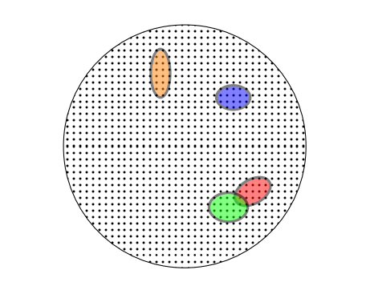

# 引入

## 符号

$$\mathcal{X}$$ 表示输入空间（input space），即数据的特征空间或样本空间。例如，在图像分类任务中，$$\mathcal{X}$$ 可能是所有可能图像的集合

$$A \subseteq \mathcal{X}$$ 表示定义在 $$\mathcal{X}$$ 上的某个集合（event），也就是一个子集。例如，假设我们从图像集中提取出所有属于某个类别的图像，那么这些图像构成了集合 $$A$$

在许多情况下，我们令 $$A$$ 作为一个事件，函数的表示形式为 $$\pi : \mathcal{X} \to \{0, 1\}$$  。换句话说，$$A= \{ x \in \mathcal{X} : \pi(x) = 1 \}$$ 表示某个点是否属于 $$A$$

$$\mathcal{D}$$ 表示概率分布（distribution）。 $$\mathcal{D}(A)$$ 表示某个点 $$x \in A$$ 的概率。我们也使用符号 $$\mathbb{P}_{x \sim \mathcal{D}}[\pi(x)]$$ 来表达 $$\mathcal{D}(A)$$，$$\mathbb{P}$$ 表示概率（probability）

## 错误率

我们将一个预测规则 $$h : \mathcal{X} \to \mathcal{Y}$$ 的错误率定义为：
$$
L_{\mathcal{D},f}(h) \triangleq \mathbb{P}_{x \sim \mathcal{D}}[h(x) \neq f(x)] \triangleq \mathcal{D}(\{x : h(x) \neq f(x)\})
$$
也就是说，函数 $$h$$ 的错误率是从分布 $$\mathcal{D}$$ 中随机选择一个 $$x$$，并且 $$h(x) \neq f(x)$$ 的概率。

error 的其他别名：generalization error、risk、true error of h

由于 $$\mathcal{D}$$ 和 $$f$$ 未知，我们只能使用训练损失：
$$
L_{S}(h) \triangleq \frac{\left| \left\{ i \in [m] : h(x_i) \neq y_i \right\} \right|}{m}
$$
其中 $$[m] = \{1, \dots, m\}$$

其他别名：empirical error 、empirical risk 

> empirical 这个名字是怎么来的？我的理解是，因为训练集只是分布中的一小部分，我们学到的是**经验**，而不是**真理**。empirical error 也是只是真实 risk 的一种**估计**而已

我们的目标是尽量减少这个损失，即**经验风险最小化ERM**（Empirical Risk Minimization）

## 使用归纳偏好

减少过拟合的一种方式是使用归纳偏好（Inductive Bias）。预先设定一个假设类 $$\mathcal{H}$$ ，每个 $$h \in \mathcal{H}$$ 是一个将 $$\mathcal{X}$$ 映射到 $$\mathcal{Y}$$ 的函数。对于给定的类 $$\mathcal{H}$$ 和一个训练样本 $$S$$，使用经验风险最小化（ERM）的机器学习算法从 $$\mathcal{H}$$ 中选择一个在 $$S$$ 上误差最小的预测函数 $$h \in \mathcal{H}$$
$$
\text{ERM}_{\mathcal{H}}(S) \in \arg\min_{h\in \mathcal{H}}L_S(h)
$$
通过限制机器学习算法在哪一类上选择预测函数，我们引入了先验知识。找到一个合适的函数类 $$\mathcal{H}$$ 成为了另一个问题。

## 差的训练样本

即使我们的训练集是独立同分布随机地从全集取出的，但仍然有所有训练数据都不具备代表性的情况

> 例如，如果要训练一个判断西瓜甜不甜的机器学习算法，但不幸我们买回来当训练数据集的西瓜全部不甜

数据集不具备代表性？我们很感兴趣。换句话说，我们想对抽出不具备代表性的 m 元实例组的概率进行上界估计。（因为数据不具备代表性，机器学习算法肯定会失败）

我们设置一个准确度参数 $$\epsilon$$，定义成功的机器学习算法为 $$L_{\mathcal{D},f}(h) \leq \epsilon$$ ，反之则失败。再令$$S|_x=(x_1, ... x_m)$$ 为训练集，那么这个“上界”为：
$$
\mathcal{D}^m(\{ S|_x :L_{\mathcal{D},f}(h) > \epsilon \})
$$
坏假设 $$\mathcal{H}_B$$ 是：
$$
\mathcal{H}_{B}=\{h\in\mathcal{H}:L_{(\mathcal{D},f)}(h)>\epsilon\}
$$
这些误导的样本 $$M$$ 是：
$$
M=\{S|_{x}:\exists h\in\mathcal{H}_{B},L_{S}(h)=0\}
$$
即对于每个 $$S|_x \in M$$，存在一个 “坏” 假设 $$h\in\mathcal{H}_B$$，在 $$S|_x$$ 上看起来像是一个 “好” 假设。即：
$$
L_{S}(h_{}) = 0
$$
那么：
$$
\{S|_{x}:L_{(\mathcal{D},n)}(h_{s})>\epsilon\}\subseteq M
$$
那么：
$$
M=\bigcup_{h\in\mathcal{H}_{B}}  \{S|_{x}:L_{S}(h)=0\}
$$

因此：

$$
\mathcal{D}^m(\{S|_x : L_{(\mathcal{D}, f)}(h_S) > \epsilon\}) \leq \mathcal{D}^m(M) = \mathcal{D}^m(\bigcup_{h \in \mathcal{H}_B} \{S|_x : L_S(h) = 0\})
$$

由于 $$\mathcal{D}(A\cup B) \leq \mathcal{D}(A) + \mathcal{D}(B)$$，那么：

$$
\mathcal{D}^m(\{S|_x : L_{(\mathcal{D}, f)}(h_S) > \epsilon\}) \leq \sum_{h \in \mathcal{H}_B} \mathcal{D}^m(\{S|_x : L_S(h) = 0\})
$$

又因为：

$$
\begin{align}
\mathcal{D}^m(\{S|_x : L_S(h) = 0\}) &= \mathcal{D}^m(\{S|_x : \forall i, h(x_i) = f(x_i)\}) \\
&= \prod_{i=1}^m \mathcal{D}(\{x_i : h(x_i) = f(x_i)\})
\end{align}
$$

在我们之前的定义中：

$$
\mathcal{D}(\{x_i : h(x_i) = y_i\}) = 1 - L_{(\mathcal{D}, f)}(h) \leq 1 - \epsilon
$$

又因为 $$ 1 - \epsilon \leq e^{-\epsilon} $$，所以：

$$
\mathcal{D}^m(\{S|_x : L_S(h) = 0\}) \leq (1 - \epsilon)^m \leq e^{-\epsilon m}
$$

最终，我们找到了这个上界：

$$
\mathcal{D}^m(\{S|_x : L_{(\mathcal{D}, f)}(h_S) > \epsilon\}) \leq |\mathcal{H}_B| e^{-\epsilon m} \leq |\mathcal{H}| e^{-\epsilon m}
$$

用图来解释，大圆中的每个点代表一个可能的实例 m 元组。每个彩色椭圆表示“误导”实例 m 元组的集合，会导致某个“糟糕”的预测器 $$ h \in \mathcal{H}_B $$ 。每当遇到误导性的训练集 S 时，ERM 可能会发生过拟合。

也就是说，对于某些 $$ h \in \mathcal{H}_B $$，我们有 $$L_S(h)=0$$。上界保证了对于每个单独的糟糕假设 $$ h \in \mathcal{H}_B $$​，最多有 $$(1 - \epsilon)^m$$ 比例的训练集会产生误导。特别地，m 越大，这些彩色椭圆的大小就越小。并集界限形式化了这样一个事实：对于某些 $$ h \in \mathcal{H}_B $$​（即，集合 M 中的训练集）而言，误导性训练集的区域大小最多是这些彩色椭圆区域的总和。因此，它被 $$|\mathcal{H}_B|$$ 乘以最大椭圆大小所界定。任何椭圆外的样本 S 都不会导致 ERM 规则过拟合。

由此产出的推论为，当我们取一个足够大的 m，在一个有限的假设类 $$ \mathcal{H} $$上，我们有 $$1-\delta$$ 的概率，认为 $$ERM_{\mathcal{H}}$$ 的损失小于 $$\epsilon$$
