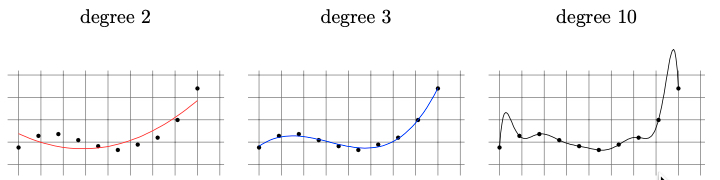

# 非均匀可学习性

> 复习一下，到目前为止，讨论的 PAC 可学习性概念允许样本大小依赖于准确性和置信参数，但它们在标记规则和数据分布方面是统一（uniform）的。因此，可学习的类是有限的（必须具有有限的 VC 维度）

在本章中，我们考虑更宽松、更弱的可学习性概念，允许样本大小依赖于学习算法所比较的假设。

例如，我们有一个手写数字识别问题，目标是从图像中识别数字（0-9）。我们使用不同的假设类来解决这个问题：

- 线性分类器复杂性低，样本需求少。
- 神经网络复杂性高，样本需求多。

在这种情况下，非均匀可学习性允许我们根据不同假设类（线性分类器 vs. 神经网络）的复杂性来调整样本大小。对于简单的假设，我们可能需要较少的数据，而对于复杂的假设，我们需要更多的数据。

## 定义

非均匀可学习性（Nonuniform Learnability）允许样本大小相对于学习算法正在竞争的不同假设是非均匀的。

一个假设 h 相对于另一个假设 h' 是 $$(\epsilon,\delta)$$-竞争的定义：概率高于 $$1-\delta$$ 的情况下，
$$
L_\mathcal{D}(h) \leq L_\mathcal{D}(h') + \epsilon
$$

> 在PAC可学习性中，“竞争力”这一概念并不是非常有用，因为我们正在寻找一个绝对低风险（在可实现的情况下）或与我们的类中假设所达到的最小风险相比风险较低的假设（在不可知的情况下）。因此，样本大小仅取决于准确度和置信度参数。然而，非均匀可学习性中，样本大小还取决于正在竞争的假设

**定义 7.1** 一个假设类 $$\mathcal{H}$$ 是非均匀可学习的，如果存在学习算法 A 和一个函数 $$m^{\text{NUL}}_\mathcal{H}:(0,1)^2 \times \mathcal{H} \to \mathbb{N}$$，使得对于每个 $$\epsilon,\delta \in (0,1)$$ ， $$h \in \mathcal{H}$$ ，$$m\geq m^{\text{NUL}}_\mathcal{H}(\epsilon,\delta,h)$$  ，分布 $$\mathcal{D}$$，至少有 $$1-\delta$$ 的概率，在 $$S\sim \mathcal{D}^m$$上，有
$$
L_{\mathcal{D}}(A(S)) \leq L_{\mathcal{D}}(h) + \epsilon
$$

> 回忆不可知 PAC 可学习性的定义：
>
> 一个假设类 $$\mathcal{H}$$ 是不可知 PAC 可学习的，如果存在一个学习算法 A 和一个函数 $$m_{\mathcal{H}} : (0, 1)^2 \to \mathbb{N}$$ ，使得对于每个 $$\epsilon,\delta \in (0,1)$$ 和分布 $$\mathcal{D}$$，至少有 $$1-\delta$$ 的概率，在 $$S\sim \mathcal{D}^m$$上，有
> $$
> L_{\mathcal{D}}(A(S)) \leq \min_{h' \in \mathcal{H}} L_{\mathcal{D}}(h') + \epsilon
> $$
> 注意这意味着对于每个 h 有
> $$
> L_{\mathcal{D}}(A(S)) \leq L_{\mathcal{D}}(h) + \epsilon
> $$
> 在这两种可学习性中，我们都要求输出假设对于类中的每一个其他假设是 $$(\epsilon,\delta)$$-竞争的。但是这两种可学习性概念的区别在于样本大小 m 是否可以依赖于其 h。非均匀可学习性是不可知 PAC 可学习性的放宽，也就是说，如果一个类是不可知 PAC 可学习的，那么它也是非均匀可学习的。

## 特征

> 复习一下，我们已经找到了 PAC 可学习类的明确特征：一个二元分类器类是不可知 PAC 可学习的，当且仅当它的 VC 维数是有限的。

**定理 7.2** 一个二元分类器类 $$\mathcal{H}$$ 是非均匀可学习的，当且仅当它是不可知 PAC 可学习假设类的可数并集（countable union）

**定理 7.3** 设 $$\mathcal{H}$$ 是一个可以表示为可数个假设类的并集的假设类，即 $$\mathcal{H} = \bigcup_{n \in \mathbb{N}} \mathcal{H}_n$$ ，其中每个 $$\mathcal{H}_n$$ 都具有一致收敛性质。那么，$$\mathcal{H}$$ 是非均匀可学习的

> 例如，$$\mathcal{H}$$ 可以是所有多项式分类器的类，即 $$\mathcal{H}_n$$ 是形如 $$h(x) = \text{sign}(p(x))$$ 的分类器的集合，其中 $$p: \mathbb{R} \to \mathbb{R}$$ 是次数为 n 的多项式

回想一下，我们展示过一致收敛性是不可知 PAC 可学习性的充分条件。定理 7.3 将这一结果推广到非均匀可学习性。非均匀可学习性是不可知 PAC 可学习性的严格放宽。这意味着即使是无限VC维的类，在某种较弱的可学习性意义上，也是可学习的。

## 结构风险最小化

> 到目前为止，我们通过指定假设类 $$\mathcal{H}$$ 编码了我们的先验知识，我们认为它包括了学习任务的良好预测算法

另一种表达我们先验知识的方法是指定 $$\mathcal{H}$$ 内假设的偏好。在结构风险最小化（Structural Risk Minimization，SRM）范式中，我们首先假设 $$\mathcal{H}$$ 可以表示为 $$\bigcup_{n \in \mathbb{N}} \mathcal{H}_n$$，然后指定一个权重函数 $$w: \mathbb{N} \to [0,1]$$，为假设类 $$\mathcal{H}_n$$ 分配一个权重，使得较高的权重反映了对该假设类的更强偏好。

具体来说，设 $$\mathcal{H}$$ 是一个可以表示为 $$\mathcal{H} = \bigcup_{n \in \mathbb{N}} \mathcal{H}_n$$ 的假设类，其中每个 $$\mathcal{H}_n$$ 是次数为 n 的多项式分类器的类。假设对于每个 n，类 $$\mathcal{H}_n$$ 具有一致收敛性质，并具有样本复杂性函数 $$m_{\mathcal{H}_n}^{\text{UC}}(\epsilon, \delta)$$。我们还定义函数 $$\epsilon_n: \mathbb{N} \times (0,1) \to (0,1)$$ 为
$$
\epsilon_n(m, \delta) = \min \{ \epsilon \in (0,1) : m_{\mathcal{H}_n}^{\text{UC}}(\epsilon, \delta) \leq m \}
$$

> 换句话说，我们有一个固定的样本大小 m，我们使用 m 个样本训练模型，计算得到经验风险。$$\epsilon_n$$ 是它与真实风险之间差距的的最小值

从一致收敛和 $$\epsilon_n$$ 的定义，我们可以得出，对于每个 m 和 δ，至少有 $$1-\delta$$ 的概率，在 $$S\sim \mathcal{D}^m$$上，有
$$
\forall h \in \mathcal{H}_n, \quad |L_{\mathcal{D}}(h) - L_S(h)| \leq \epsilon_n(m, \delta)
$$
设 $$w: \mathbb{N} \to [0, 1]$$ 是一个函数，使得 $$\sum_{n=1}^{\infty} w(n) \leq 1$$，我们称 𝑤 为假设类 $$\mathcal{H}_1, \mathcal{H}_2, \ldots$$ 上的**权重函数**。权重函数可以反映学习者对每个假设类的重要性看法，或不同假设类复杂性的某种度量

> 如果 $$\mathcal{H}$$ 是有限数量的 N 个假设类的并集，我们可以简单地为所有假设类分配相同的 1/N 权重。这种相等的权重分配不对应于对任何假设类的优先偏好。如果 $$\mathcal{H}$$ 是无限，可以选择例如 $$w(n) = 2^{-n}$$ 
>
> 当然，如果一个人（如先验知识）相信某个特定的假设类更可能包含正确的目标函数，则应为其分配更大的权重，以反映这种先验知识

SRM 规则遵循“界限最小化”方法。这意味着该范式的目标是找到一个假设，使某个真实风险的界限最小化。以下定理给出了 SRM 规则希望最小化的界限：

**定理 7.4**  𝑤 为权重函数， $$\mathcal{H}$$ 是一个可以表示为 $$\mathcal{H} = \bigcup_{n \in \mathbb{N}} \mathcal{H}_n$$ 的假设类，每个 $$\mathcal{H}_n$$ 具有一致收敛性质，并具有样本复杂性函数 $$m_{\mathcal{H}_n}^{\text{UC}}(\epsilon, \delta)$$，至少有 $$1-\delta$$ 的概率，在 $$S\sim \mathcal{D}^m$$上，有：
$$
|L_{\mathcal{D}}(h) - L_S(h)| \leq \epsilon_n(m, w(n) \cdot \delta)
$$

$$
\forall h \in \mathcal{H}, \quad L_\mathcal{D}(h) \leq L_S(h) + \min_{n : h \in \mathcal{H}_n} \epsilon_n(m, w(n) \cdot \delta)
$$

结构风险最小化 (SRM)   范式搜索使界限最小化的 h，形式化为以下步骤：

1. 先验知识: $$\mathcal{H} = \bigcup_n \mathcal{H}_n$$ ，每个 $$\mathcal{H}_n$$ 具有一致收敛性质，并具有样本复杂性函数 $$m_{\mathcal{H}_n}^{\text{UC}}$$，权重函数$$ w: \mathbb{N} \to [0, 1]$$，$$ \sum w(n) \leq 1$$ 
2. 定义: $$\epsilon_n(m, \delta) = \min \{ \epsilon \in (0,1) : m_{\mathcal{H}_n}^{\text{UC}}(\epsilon, \delta) \leq m \}$$， $$n(h) = \min\{n : h \in \mathcal{H}_n\}$$
3. 输入: 训练集 $$S \sim \mathcal{D}^m$$, 置信度 $$\delta$$
4. 输出: $$h \in \arg\min_{h \in \mathcal{H}} [L_S(h) + \epsilon_{n(h)}(m, w(n(h)) \cdot \delta)]$$

> 解释一下 $$n(h)$$，表示对于给定的假设 h，找到最小的 n，使得 h 属于假设类 $$\mathcal{H}_n$$。这意味着 h 首次出现在假设类的哪一层。
>
> 假设我们有多个假设类 $$\mathcal{H}_1, \mathcal{H}_2, \mathcal{H}_3$$ 每个类分别包含不同复杂度的模型。例如：
>
> - $$\mathcal{H}_1$$ 包含所有常数函数。
> - $$\mathcal{H}_2$$ 包含所有一次线性函数。
> - $$\mathcal{H}_3$$ 包含所有二次函数。
>
> 如果假设 h 是一个线性函数 𝑓(𝑥)=2𝑥+3，那么 h 属于 $$\mathcal{H}_2$$，$$n(h)=2$$，帮助我们确定应该在何种复杂度的模型中评估和优化该假设。

不同于前几章讨论的ERM范式，我们不再只关心经验风险 $$L_S(h)$$ ，而是愿意为了更小的估计误差，在对低经验风险的偏好中，向那些使得 $$\epsilon_{n(h)}(m, w(n(h)) \cdot \delta)$$ 更小的类倾斜

**定理 7.5** 设 $$\mathcal{H}$$ 是一个可以表示为 $$\mathcal{H} = \bigcup_{n \in \mathbb{N}} \mathcal{H}_n$$ 的假设类，每个 $$\mathcal{H}_n$$ 具有一致收敛性质，并具有样本复杂性函数 $$m_{\mathcal{H}_n}^{\text{UC}}$$，设 $$w(n) = \frac{6}{n^2 \pi^2}$$。那么，使用SRM规则的 $$\mathcal{H}$$ 是非均匀可学习的
$$
m_{\mathcal{H}}^{\text{NUL}}(\epsilon, \delta, h) \leq m_{\mathcal{H}_{n(h)}}^{\text{UC}}\left(\epsilon/2, \frac{6 \delta}{(\pi n(h))^2}\right)
$$
非均匀可学习的先验知识较弱，它搜索整个类，而不是仅关注于特定的 $$\mathcal{H}_n$$，种先验知识减弱的代价是为了与任何特定 $$h\in\mathcal{H}_n$$ 竞争所需的复杂性增加

> 对于这个差距的具体示例，考虑二元分类和零一损失的任务。假设对于所有 n，$$\text{VCdim}(\mathcal{H}_n) = n$$ 。由于 $$m_{\mathcal{H}_n}^{\text{UC}}(\epsilon, \delta) = C \frac{n \log(1/\delta)}{\epsilon^2}$$，一个简单的计算表明
> $$
> m_{\mathcal{H}}^{\text{NUL}}(\epsilon, \delta, h) - m_{\mathcal{H}_{n(h)}}^{\text{UC}}(\epsilon/2, \delta) \leq 4C \frac{2 \log(2n)}{\epsilon^2}
> $$
> 也就是说，放宽学习者的先验知识从特定 $$\mathcal{H}_n$$ 到包含目标 h 的可数类的代价取决于 h 所在的第一类别的索引的 log 对数。成本随着类别的指数而增加，这可以解释为反映了在 $$\mathcal{H}$$ 中知道假设的良好优先级顺序的价值

设 $$\mathcal{H}$$ 为可数的假设类。于是，我们可以写为 $$\mathcal{H} = \bigcup_{n \in \mathbb{N}} \{h_n\}$$，根据霍夫丁不等式（Hoeffding’s inequality），每个单例类具有一致收敛性质，$$m^{\text{UC}}(\epsilon, \delta) = \frac{\log(2/\delta)}{2\epsilon^2}$$，因此， SRM 规则变为
$$
\epsilon(m, \delta) = \sqrt{\frac{\log(2/\delta)}{2m}}
$$

$$
\arg\min_{h_n \in \mathcal{H}} \left[ L_S(h) + \sqrt{\frac{-\log(w(n)) + \log(2/\delta)}{2m}} \right]
$$

同样，我们可以将 𝑤 视为从 $$\mathcal{H}$$ 到 [0,1] 的一个函数，然后 SRM 规则变为
$$
\arg\min_{h \in \mathcal{H}} \left[ L_S(h) + \sqrt{\frac{-\log(w(h)) + \log(2/\delta)}{2m}} \right]
$$
在这种情况下，先验知识仅由我们赋予每个假设的权重决定。我们将更高的权重分配给那些我们认为更可能是正确的假设，而在学习算法中，我们倾向于选择具有更高权重的假设。

## 最小描述长度

对于一个假设类，我们考虑我们如何描述每个假设。我们自然会固定一些特定的描述语言，包括英语、编程语言，或者数学公式，在这些语言中，描述由从一些固定字母表中提取的符号（或字符）的有限字符串组成。

设 $$\mathcal{H}$$ 为我们希望描述的假设类。固定一些有限集 $$\Sigma$$ 的符号（或“字符”），称之为字母表。为了具体化，设 $$\Sigma = \{0,1\}$$。字符串是来自 $$\Sigma$$ 的有限符号序列；例如，σ=(0,1,1,1,0) 是长度为 5 的字符串。我们用 |𝜎| 表示字符串的长度。所有有限长度字符串的集合称为 $$\Sigma^*$$。一个用于 $$\mathcal{H}$$ 的描述语言是一个函数 $$d : \mathcal{H} \rightarrow \Sigma^*$$，将 $$\mathcal{H}$$ 中的每个成员映射到字符串 $$d(h)$$，被称为 “h 的描述”，其长度用 |h| 表示。

我们还可以要求描述语言是前缀自由的（prefix-free），即对于任何两个字符串 $$h_1, h_2 \in \mathcal{H}$$，$$d(h_1)$$ 不是 $$d(h_2)$$ 的前缀。前缀自由集合在编码理论（如哈夫曼编码）中具有重要意义，并有如下性质：

**克拉夫特不等式** 如果 $$\mathcal{S} \subseteq \{0, 1\}^*$$ 是一个前缀自由字符串集，那么
$$
\sum_{\sigma \in \mathcal{S}} \frac{1}{2^{|\sigma|}} \leq 1
$$

> 证明略，大意是 $$P(\sigma) = \frac{1}{2^{|\sigma|}}$$ 可以看作概率，概率的和小于等于1

在克拉夫特不等式的启示下，任何假设类 $$\mathcal{H}$$ 的前缀自由描述语言都会引出一个权重函数 𝑤，我们简单地设定 $$w(h) = \frac{1}{2^{|h|}}$$，得到：

**定理 7.7** 设 $$\mathcal{H}$$ 为假设类，$$d : \mathcal{H} \rightarrow \{0, 1\}^*$$ 是一个前缀自由描述语言。对于每个样本大小 𝑚，至少有 $$1-\delta$$ 的概率，在 $$S\sim \mathcal{D}^m$$上，有：
$$
\forall h \in \mathcal{H}, \quad L_\mathcal{D}(h) \leq L_S(h) + \sqrt{\frac{|h| + \ln(2/\delta)}{2m}}
$$
其中 |h| 是 $$d(h)$$ 的长度

与定理 7.4 的情况相同，这提示了一个学习范式。对于 $$\mathcal{H}$$，给定一个训练集 S，搜索一个假设 $$h \in \mathcal{H}$$，使得最小化界限 $$L_S(h) + \sqrt{\frac{|h| + \ln(2/\delta)}{2m}}$$。具体来说，它建议在减少描述长度的风险与经验风险之间进行权衡。这产生了最小描述长度（MDL）范式（Minimum Description Length learning paradigm）：

1. 先验知识：
   - $$\mathcal{H}$$ 是一个可数的假设类
   - $$\mathcal{H}$$ 由前缀自由语言{0,1} 描述
2. 输入：训练集 $$S\sim \mathcal{D}^m$$，置信度 𝛿
3. 输出：$$h^* \in \arg\min_{h \in \mathcal{H}} \left[ L_S(h) + \sqrt{\frac{|h| + \ln(2/\delta)}{2m}} \right]$$

> 例子 7.3 ：假设 $$\mathcal{H}$$ 是所有可以使用某种编程语言（例如C++）实现的预测器的类。我们对程序运行gzip命令，获得二进制字符串，来表示每个程序（gzip会在字母表{0, 1}上产生前缀自由的描述语言）。然后，|h| 是 gzip 在这个C++程序(h) 上运行时输出的长度（以位为单位）
>
> 等等，用C++实现的所有预测器类！这是一个强大的函数类，可能包含我们在实践中希望学习的所有内容。学习这个类的能力令人印象深刻，似乎应该是最后一章，但事实并非如此，考虑到时间：
>
> 例如，为了实现MDL范式以涵盖所有C++程序，我们需要对所有C++程序进行穷举（！）搜索，这将耗费很长时间。即使是ERM范式的实现，对于描述长度最多为1000位的所有C++程序，运行时间至少是 2 的 1000次方，即使样本复杂度只是 $$\frac{1000 + \ln(2/\delta)}{2m}$$。之后的章节我们将正式定义学习的计算复杂性。

## 奥卡姆剃刀

定理 7.7表明，假设有两个假设具有相同的经验风险，其中描述较短的假设的真实风险可以被限制在一个较低的值。换句话说：
$$
一个简短的解释往往比一个冗长的解释更有效
$$
这是一个众所周知的原则，称为奥卡姆剃刀。在这里，我们提供一种解释。定理7.7的不等式表明，假设 h 越复杂（描述越长），用来保证它具有较小的真实风险的样本量就越大。

我们的解释有点问题，当我们聊到奥卡姆剃刀，复杂度的度量是基于自然语言，但在这里我们可以考虑任何任意的抽象描述语言。在C++上，假设A的描述比假设B的描述长，但是如果用中文，B的描述更短，那到底谁更复杂？我们矛盾了吗？

事实上，在我们选择描述语言的时候，我们就已经在对假设进行某种加权了。假设选择一个模型来预测房价：

- 假设 A：一个简单的线性模型，使用房屋面积作为唯一的特征。
- 假设 B：一个复杂的非线性模型，使用多个特征如面积、房龄、位置等。

选择描述语言就是决定如何表示和比较这两个假设。假设我们使用中文，使得简单模型（A）的描述更简洁，那么我们可能更偏好选择简单模型，因为它在这种语言下表现得更优。

## 一致性

可学习性的概念可以进一步放宽，所需样本大小不仅依赖于 *ϵ*、*δ* 和 *h*，还能依赖于数据生成概率分布 $$\mathcal{D}$$

**定义 7.8（一致性）** 设 𝑍 是一个域集，$$\mathcal{P}$$ 是 𝑍 上概率分布的集合，$$\mathcal{H}$$ 是一个假设类。学习规则 𝐴 关于 $$\mathcal{H}$$ 和 $$\mathcal{P}$$ 是一致的定义为：如果存在一个函数 $$m^{\text{CON}}_\mathcal{H}:(0,1)^2 \times \mathcal{H} \times \mathcal{P} \to \mathbb{N}$$，，使得对于每个 $$\epsilon,\delta \in (0,1)$$ ， $$h \in \mathcal{H}$$ ，$$\mathcal{D} \in \mathcal{P}$$，$$m\geq m^{\text{CON}}_\mathcal{H}(\epsilon,\delta,h,\mathcal{D})$$  ，分布 $$\mathcal{D}$$，至少有 $$1-\delta$$ 的概率，在 $$S\sim \mathcal{D}^m$$上，有：
$$
L_{\mathcal{D}}(A(S)) \leq L_{\mathcal{D}}(h) + \epsilon
$$
如果 $$\mathcal{P}$$ 是所有分布的集合，则称 𝐴 关于 $$\mathcal{H}$$  是普遍一致的

一致性的概念当然是我们之前非均匀可学习性概念的放宽。如果一个算法非均匀地学习一个类 $$\mathcal{H}$$，那么它对于该类来说也是普遍一致的。

这种放宽在某种意义上是严格的，因为存在一致的学习规则，但并不是成功的非均匀学习者。**例 7.4** 考虑分类预测算法 Memorize。算法记住训练样本，并且，给定一个测试点 𝑥，它预测在训练样本中所有标记的 𝑥 实例中的多数标签。可以证明 Memorize 算法对于每个可数域 $$\mathcal{X}$$ 和有限标签集 $$\mathcal{Y}$$（相对于零一损失）是普遍一致的。

直观上，很明显 Memorize 算法不应该被视为一个学习算法，因为它缺乏泛化能力，也会过拟合，那么它（一致性）有什么用呢？我们马上来讨论一下不同定义下的可学习性的用处。

## 可学习性的讨论

> 定义的实用性取决于我们的需求

### Loss 的上限是多少

我们推导学习算法性能的保证，第一个目标是限定输出预测器的风险：

- **PAC学习**和**非均匀学习**为我们提供了基于经验风险的学习到的假设的真实风险的上限
- **一致性**保证不提供这样的界限

不过，在更加实际的场景中，可以使用验证集来估计输出预测器的风险

### 需要多少样本

在解决学习问题时，一个自然的问题是我们需要收集多少样本才能学习：

- **PAC学习**给出了明确的答案
- 在**非均匀学习**中，这个数量取决于$$\mathcal{H}$$中的最佳假设
- 在**一致性**中则取决于数据分布

从这个意义上说，PAC学习是唯一有用的可学习性定义。但另一方面，即使我们学习的预测器的估计误差很小，如果$$\mathcal{H}$$有很大的近似误差，其风险仍可能很大。因此，对于“需要多少样本才能与贝叶斯最优预测器一样好？”这个问题，甚至PAC也未给出明确答案。这反映了PAC学习的实用性依赖于我们先验知识的质量。

> 复习一下：
>
> - 近似误差（approximation error）衡量了因为限制在特定类中而面临的风险
> - 估计误差（estimation error）是由于过拟合导致的误差

### 如何优化模型

另一个应用是，如果学习算法返回一个高风险的假设，我们想知道下一步该做什么：

- **PAC**可以限定一部分误差来自估计误差，从而了解有多少误差归因于近似误差。如果近似误差很大，我们知道应该使用不同的假设类。
- 如果**非均匀算法**失败，可以考虑不同的加权函数或假设的子集。
- 然而，**当一致性算法**失败时，我们不知道这是否因为估计误差还是近似误差。此外，即使我们确定估计误差存在问题，我们也不知道还需要多少样本来减少估计误差

### 如何学习

学习理论中最有用的方面之一可能是为“如何学习”这一问题提供答案：

- **PAC学习**的定义揭示了学习的局限性（通过“无免费午餐”定理）以及先验知识的必要性。它为我们提供了一种明确的方法，通过选择假设类来编码先验知识，一旦做出这种选择，我们就有了一个通用的学习规则——ERM
- **非均匀可学习性**的定义同样提供了一种明确的方法，通过为 $$\mathcal{H}$$ 的（子集）假设指定权重来编码先验知识。一旦做出这种选择，我们同样有了一个通用的学习规则——SRM
- **一致性**的定义并没有产生自然的学习范式或编码先验知识的方法。事实上，在许多情况下根本不需要先验知识。例如，我们看到即使是Memorize算法，直觉上不应该被称为学习算法，但对于任何定义在可数域和有限标签集上的类来说也是一致的算法。这暗示了一致性是一个非常弱的要求

> 在模型选择任务中，SRM规则也有优势，在这些任务中，先验知识是部分的。我们将在第后面详细讨论模型选择，这里给出一个简单的例子。
>
> 考虑将一维多项式拟合到数据的问题；我们的目标是学习一个函数 $$h:\mathbb{R}\to\mathbb{R}$$，作为先验知识，我们考虑多项式的假设类。然而，我们可能不确定哪个最高次数 𝑑 会为我们的数据集提供最佳结果：
>
> - 最高次数太小可能无法很好地拟合数据（即，会有很大的近似误差）
> - 而次数太高可能导致过拟合（即，会有很大的估计误差）
>
> 下面我们展示将最高次数为2、3和10的多项式拟合到相同训练集的结果：
>
> 
>
> 很容易看出，随着次数的增加，经验风险会减小。因此，如果我们选择 $$\mathcal{H}$$ 为所有最高到10次的多项式类，那么针对该类的ERM规则将输出一个10次多项式，并且会过拟合。另一方面，如果我们选择的假设类太小，比如多项式最高到2次，那么ERM将因拟合不足而受损（即，近似误差很大）
>
> 不过，我们可以对所有多项式使用SRM规则，同时根据度数对 $$\mathcal{H}$$ 的子集进行排序，这将产生一个3次多项式，因为其经验风险和估计误差的界限是最小的。换句话说，SRM规则使我们能够根据数据本身选择正确的模型。我们为这种灵活性付出的代价是，我们不知道需要多少样本才能找到最好的模型

### 关于一致性

即使一致性是一个弱要求，但可能有人仍然希望一个学习算法对于从$$\mathcal{X}$$ 到 $$\mathcal{Y}$$ 的所有函数集都是一致的，这给我们提供了一个保证，即对于足够多的训练样本，它将与贝叶斯最优预测器一样好。因此，如果我们有两个算法，其中一个是一致的而另一个不是一致的，我们应该优先选择一致的算法。

然而，这个论点有两个问题：

- 首先，对于大多数“自然”分布来说，可能在实践中我们观察到一致算法所需的样本复杂度太大，以至于在每个实际情况下都无法获得足够的样本以实现这种保证。
- 其次，使任何PAC或非均匀学习器对于从$$\mathcal{X}$$ 到 $$\mathcal{Y}$$ 的所有函数类一致并不是很困难。具体来说，收到训练集后，我们首先在训练集上运行非均匀学习器，然后得到学习到的预测器真实风险的界限。如果该界限足够小，则完成。否则，我们就使用Memorize算法。这一简单修改使得算法对于从 $$\mathcal{X}$$ 到 $$\mathcal{Y}$$ 的所有函数一致。

