# 线性代数基础

> 参考：
>
> - [线性代数公式定理一览表](https://www.cnblogs.com/EIPsilly/p/16541934.html)

## 向量

三种看待向量的观点

| 不同的人         | 不同的观点                     |
| ---------------- | ------------------------------ |
| 物理专业的学生   | 空间中的箭头（长度和方向）     |
| 计算机专业的学生 | 有序的数字列表                 |
| 数学家           | 任何东西（以上两个观点的碰撞） |

**向量加法的几何意义**：遵循三角形法则。如果将每个向量看作一种特定的运动，即向空间中某个方向迈出一定距离。若先沿着第一个向量方向移动，再沿着第二个向量方向移动，总体效果与沿着这两个向量和运动无异。

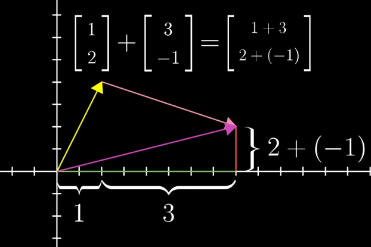

**向量乘法的几何意义**：乘以大于1的数值，就是将这个向量拉伸；乘以小于1的数值，就是将这个向量压缩；乘以负数，就是将这个向量翻转。拉伸，压缩，翻转向量的行为，统称为缩放（scaling），而这些数值本身，称之为标量（scalars）。

把向量组的各个向量以同样的方式增加若干个分量得到的向量组称为**接长向量组**。把向量组的各个向量以同样的方式删除若干个分量得到的向量组称为**截短向量组**。一个线性相关的向量组截短后仍相关，而一个线性无关的向量组接长后仍无关。

当若干非零向量两两**正交**（垂直）时，称它们构成的向量组为**正交向量组**；进一步地，若它们又都是单位向量，则称为**标准正交向量组**（或**正交规范向量组**）

**内积**：
$$
\langle \alpha,\beta \rangle=a_1b_1+a_2b_2+\cdots+a_nb_n=\sum_{i=1}^na_ib_i 
$$
**范数**（即**长度**或**模**）：
$$
\left\| \alpha \right\| = \sqrt{\langle \alpha,\alpha \rangle} = \sqrt{a_1^2+a_2^2+\cdots+a_n^2}
$$

- 柯西-施瓦兹（Cauchy-Schwarts）不等式：$$\langle \alpha,\beta \rangle \leq \left\| \alpha \right\| \cdot \left\| \beta \right\|$$
- 三角不等式：$$\left\| \alpha + \beta \right\| \leq \left\| \alpha \right\|+\left\| \beta\right\|$$

**夹角**：
$$
\varphi=\arccos \frac{\langle \alpha,\beta \rangle}{\left\| \alpha \right\|\left\| \beta \right\|}
$$
**施密特**（Schmidt）**正交化**方法：

首先取 $$\beta_1=\alpha_1$$。
$$
\beta_2=\alpha_2 -\frac{\langle \alpha_2,\beta_1 \rangle}{\langle \beta_1,\beta_1 \rangle}\beta_1
$$

$$
\beta_3=\alpha_3 -\frac{\langle \alpha_3,\beta_1 \rangle}{\langle \beta_1,\beta_1 \rangle}\beta_1 -\frac{\langle \alpha_3,\beta_2 \rangle}{\langle \beta_2,\beta_2 \rangle}\beta_2 
$$

同样的方式一直做下去，直到
$$
\beta_m=\alpha_m -\frac{\langle \alpha_m,\beta_1 \rangle}{\langle \beta_1,\beta_1 \rangle}\beta_1 -\frac{\langle \alpha_m,\beta_2 \rangle}{\langle \beta_2,\beta_2 \rangle}\beta_2 -\cdots -\frac{\langle \alpha_m,\beta_{m-1} \rangle}{\langle \beta_{m-1},\beta_{m-1} \rangle}\beta_{m-1}
$$
这样即得到与 $$\alpha_1,\alpha_2,\cdots,\alpha_m$$ 等价的正交向量组 $$\beta_1,\beta_2,\cdots,\beta_m$$。进一步，将正交向量组 $$\beta_1,\beta_2,\cdots,\beta_m$$单位化，令：
$$
\gamma_i=\frac{\beta_i}{\left\| \beta_i \right\|},i=1,\cdots,m
$$
得到等价的正交规范向量组$$\gamma_1,\gamma_2,\cdots,\gamma_m$$，整个过程称为**正交规范化**

> 几何解释是：已知 α1,α2 线性无关但不正交。显然二者不在同一直线上，假定 α1,α2 的夹角 φ 为锐角。先取 β1=α1 然后将 α2 做一个正交分解（比如物理学中经常把力或速度等向量分解为两个相互垂直的向量），将其分解为跟 α1 平行的向量 kα1 和跟 α1 垂直的向量 β2
>
> 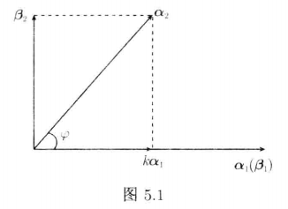

## 矩阵

### 矩阵与向量乘

**线性变换**从几何想象看，是一种操纵空间的手段，特点包括：

- 所有的直线还是直线
- 原点还在原来的位置

可以借助基向量 i 和 j 的变换，可以理解整个空间的线性变换：

事实上，一个二维线性变换仅由四个数字完全确定，即基向量的变换。借助基向量的变换，我们可以得到任意一个向量$(x,y)$在线性变换后的结果。

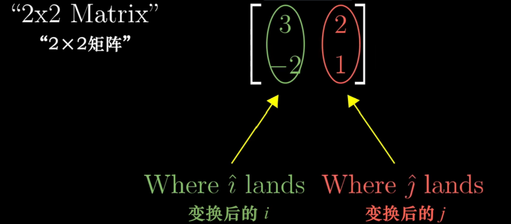

把它抽象化之后，则得到了矩阵乘法的运算公式，并且还可见其几何意义，$(a,c)$和$(b,d)$是新空间的基

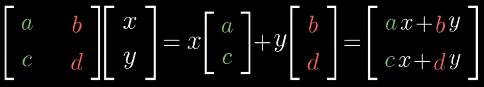

一个特殊例子，假如变换之后的向量是线性相关的，那么所有原来平面上的点在变换之后就被压缩到了一条直线上。

### 矩阵乘

**两个矩阵相乘**有着几何意义，也就是**两个线性变换相继作用**，如图，注意先作用M1，然后M2

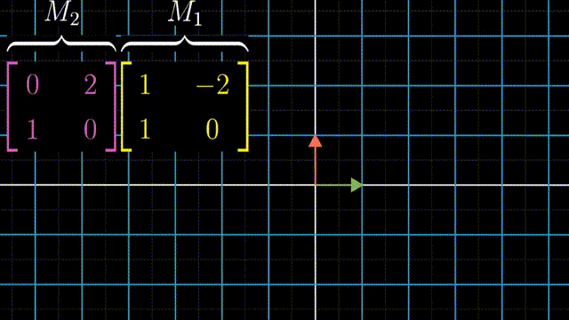

那么非方阵呢？体现了不同维数之间的变换。

如果2×2矩阵表示二维向量到二维向量的变换，3×3矩阵来表示的三维向量到三维向量的变换，那么自然的，3×2矩阵肯定是二维向量与三维向量的转换，但是从谁转换到谁呢？

**对于3×2矩阵，矩阵有两列表明输入空间有两个基向量，有三行表明每一个基向量再变换后都用三个独立的坐标来描述，因此几何意义是将二维空间映射到三维空间上**。

我们举一个动画例子，1×2的矩阵代表将二维空间映射到一维空间上：

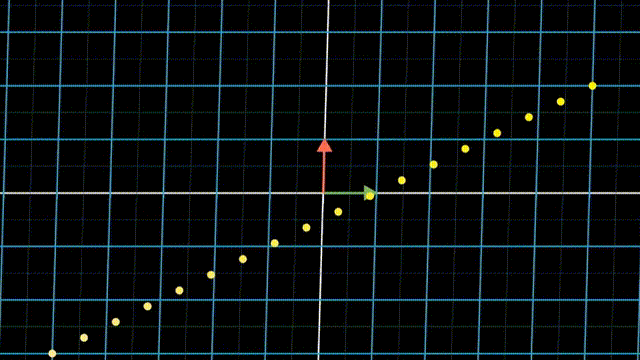

其他性质：

- $$|\lambda A|=\lambda^n |A|$$

- 对于矩阵相乘，交换律一般不成立，消去律一般不成立，分配律成立

  > - 但若AB=BA成立，则称矩阵 A 与 B 可交换
  > - AB=O不能推出 A=O或 B=O。推论：AB=AC，A不为0矩阵，推不出B=C

- $$|AB|=|A||B|$$

- 只有方阵才有乘幂运算

- $$|A^k|=|A|^k$$

- $$(A\pm B)^T=A^T \pm B^T$$

- $$(AB)^T=B^TA^T$$

- $$|A^T|=|A|$$

- 如果 $$A^T=A$$，则称 A 为**对称矩阵**，如果 $$A^T=-A$$，则称 A 为**反对称矩阵**

分块转置：
$$
A=\begin{pmatrix} A_{11} & A_{12} & \cdots & A_{1r} \\ A_{21} & A_{22} & \cdots & A_{2r} \\ \vdots & \vdots & & \vdots \\ A_{s1} & A_{s2} & \cdots & A_{sr} \\ \end{pmatrix},
A^T=\begin{pmatrix} A_{11}^T & A_{21}^T & \cdots & A_{s1}^T \\ A_{12}^T & A_{22}^T & \cdots & A_{s2}^T \\ \vdots & \vdots & & \vdots \\ A_{1r}^T & A_{2r}^T & \cdots & A_{sr}^T \\ \end{pmatrix}
$$

### 初等变换

**初等行变换**：

1. 交换两行位置
2. 以数 k（不为0） 乘某一行中的所有元素
3. 把某一行所有元素的 k 倍加到另一行的对应元素上

**初等变换不改变矩阵的秩**。若矩阵 A经过有限次初等变换变成 B，则称矩阵 A 与 B **等价**,记作 A↔B。等价的矩阵等秩，反之不一定成立。

由单位矩阵 E 经过一次初等变换得到的矩阵称为**初等矩阵**，简称**初等阵**。三种初等变换对应三种初等矩阵。

### 秩

**秩**代表着变换后空间的维数。

> 举个例子，当变换的结果为一条直线时（一维），我们称这个变换的秩为1。
>
> 比如说对于2×2的矩阵，它的秩最大为2，意味着基向量仍旧能张成整个二维空间，并且矩阵的行列式不为零。但是对于3×3的矩阵，秩为2意味着空间被压缩了。

对于一个非满秩的矩阵来说，它将空间压缩到一个更低的维度上，也就是说**会有一系列向量在变换后成为零向量（直线降维为点）**。

举些例子：如果一个二维线性变换将空间压缩到一条直线上（降维），那么沿不同方向直线上的所有向量就被压缩到原点。

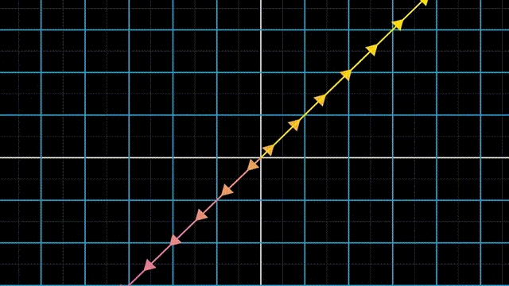

如果 一个三维线性变换将空间压缩到一条直线上，那么就有一整个平面上的向量在变换后落在原点。

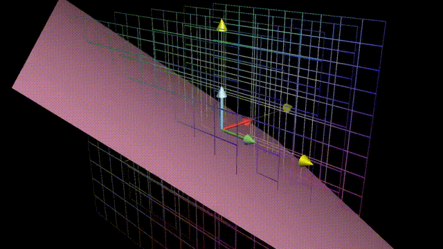

**变换后落在原点的向量的集合**，被称为矩阵的**零空间或核**。变换后一些向量落在零向量上，而“零空间”正是这些向量所构成的空间。

**求秩**：把矩阵 A 通过初等行变换变为行阶梯形矩阵 B，则行阶梯形矩阵 B 的非零行数即为矩阵 A 的秩

- $$\boldsymbol{A}$$ 的秩 $$R(\boldsymbol{A})$$ 即为矩阵 $$\boldsymbol{A}$$ 的非零子式的最高阶数
- $$|A|\neq0$$，$$R(\boldsymbol{A})= n$$，**满秩矩阵**，**非奇异矩阵**，**可逆矩阵**
-  $$|A|=0$$，$$R(\boldsymbol{A})< n$$，**降秩矩阵**，**奇异矩阵**，**不可逆矩阵**
- 行秩=列秩，$$0 \leq R(\boldsymbol{A})\leq \min{m,n}$$
- $$max\{R(\boldsymbol{A}),R(\boldsymbol{B})\}\leq R(\begin{array}{c:c}\boldsymbol{A} & \boldsymbol{B}\end{array})\leq R(\boldsymbol{A})+R(\boldsymbol{B})$$
- $$R(\boldsymbol{A}+\boldsymbol{B})≤R(\boldsymbol{A})+R(\boldsymbol{B})$$
- $$R(\boldsymbol{A}\boldsymbol{B})≤min\{R(\boldsymbol{A}),R(\boldsymbol{B})\}$$
- 若 $$\boldsymbol{A}_{m\times n}\boldsymbol{B}_{n\times l}= \boldsymbol{O}$$,则 $$R(\boldsymbol{A})+R(\boldsymbol{B})\leq n$$
- $$R(A^*)=\begin{cases} n,&若R(A)=n,\\ 1,&若R(A)=n-1,\\ 0,&若R(A)<n-1,\ \end{cases}$$
- $$R(A^TA)=R(A)$$

### 逆矩阵

如果：
$$
AB=BA=E
$$
则称**矩阵 A 可逆**（或称 A 是可逆矩阵），称 B 是 A 的**逆矩阵**，记为 $$A^{-1}$$，即 $$B=A^{-1}$$，若不存在 B 满足式，则称矩阵A 不可逆。

**伴随矩阵**：下面的式子为 A 的伴随矩阵，记为 $$A^*$$，其中 $$A_{ij}$$ 为元素 $$a_{ij}$$ 的代数余子式
$$
\begin{pmatrix} A_{11} & A_{21} & \cdots & A_{n1} \\ A_{12} & A_{22} & \cdots & A_{n2} \\ \vdots & \vdots & & \vdots \\ A_{1n} & A_{2n} & \cdots & A_{nn} \\ \end{pmatrix}
$$

> 注意这个伴随矩阵和原来的A比较转置了

求逆矩阵方式之一：公式
$$
A^{-1}=\frac{1}{|A|}A^*
$$
求逆矩阵方式之二：增广后变换
$$
(\begin{array}{c:c}\boldsymbol{A} & \boldsymbol{E}\end{array}) \longrightarrow (\begin{array}{c:c}\boldsymbol{E} & \boldsymbol{A}^{-1}\end{array})
$$

- $$AA^*=A^*A=|A|E$$
- 若方阵 A 可逆，则 A 的逆矩阵是唯一的
- $$(\lambda A)^{-1}=\frac{1}{\lambda}A^{-1}$$
- $$(AB)^{-1}=B^{-1}A^{-1}$$
- $$(A^T)^{-1}=(A^{-1})^T$$
- $$(A^{-1})^{-1}=A,|A^{-1}|=\frac{1}{|A|}$$
- $$(A^*)^{-1}=(A^{-1})^* = \frac{A}{|A|}$$
- $$A^*=|A|A^{-1},|A^*|=|A|^{n-1}$$

分块的逆：
$$
\begin{pmatrix} B & 0\\ 0 & C \end{pmatrix}^{-1} = \begin{pmatrix} B^{-1} & 0\\ 0 & C^{-1} \end{pmatrix}, \begin{pmatrix} 0 & B\\ C & 0 \end{pmatrix}^{-1} = \begin{pmatrix} 0 & C^{-1}\\ B^{-1} & 0 \end{pmatrix}
$$

## 行列式

**行列式**：线性变换**改变面积的比例**。二阶行列式可看做平行四边形的面积

行列式为0，矩阵必然线性相关，或者说面积被挤压到0

行列式的正负与平面的取向有关，行列式为负，空间被翻转

三阶行列式可简单看做平行六面体的体积，正负号代表三维翻转，如果可以用右手系表示为正，如果只能用左手系表示为负

严谨的面积计算方法：

- 行列式两行（列）互换，行列式变号

- 任意两个向量线性相关（秩为0），行列式等于零

  > 直观理解：降到低维空间中了，在本维度中的“体积”为0

- 行列式某一行（列）的所有元素都乘以同一数 k，等于用数 k 去乘行列式，公因子也可以提到行列式的符号外面

  > 直观理解：构成“体积”的某一条边扩大k倍，“体积”扩大k倍

- 把行列式的某一行(列)的各元素乘以同一个数然后加到另一行(列)对应的元素上去,行列式的值不变。
  $$
  D = \left | \begin{matrix} a_{11} & a_{12} & \cdots & a_{1n} \\ \vdots & \vdots & & \vdots \\ a_{i1} & a_{i2} & \cdots & a_{in} \\ \vdots & \vdots & & \vdots \\ a_{j1} & a_{j2} & \cdots & a_{jn} \\ \vdots & \vdots & & \vdots \\ a_{n1} & a_{n2} & \cdots & a_{nn} \\ \end{matrix} \right |=\left | \begin{matrix} a_{11} & a_{12} & \cdots & a_{1n} \\ \vdots & \vdots & & \vdots \\ a_{i1} + ka_{j1} & a_{i2} + ka_{j2} & \cdots & a_{in} + ka_{jn} \\ \vdots & \vdots & & \vdots \\ a_{j1} & a_{j2} & \cdots & a_{jn} \\ \vdots & \vdots & & \vdots \\ a_{n1} & a_{n2} & \cdots & a_{nn} \\ \end{matrix} \right |
  $$

- 若行列式的某一行(列)的元素都是两数之和,例如，第i行的元素都是两数之和，那么可以拆开
  $$
  D = \left | \begin{matrix} a_{11} & a_{12} & \cdots & a_{1n} \\ a_{21} & a_{22} & \cdots & a_{2n} \\ \vdots & \vdots & & \vdots \\ a_{i1} & a_{i2} & \cdots & a_{in} \\ \vdots & \vdots & & \vdots \\ a_{n1} & a_{n2} & \cdots & a_{nn} \\ \end{matrix} \right |+ \left | \begin{matrix} a_{11} & a_{12} & \cdots & a_{1n} \\ a_{21} & a_{22} & \cdots & a_{2n} \\ \vdots & \vdots & & \vdots \\ a'{i1} & a'{i2} & \cdots & a'{in} \\ \vdots & \vdots & & \vdots \\ a{n1} & a_{n2} & \cdots & a_{nn} \\ \end{matrix} \right |
  $$

  $$
  D = \left | \begin{matrix} a_{11} & a_{12} & \cdots & a_{1n} \\ a_{21} & a_{22} & \cdots & a_{2n} \\ \vdots & \vdots & & \vdots \\ a_{i1}+a'{i1} & a{i2}+a'{i2} & \cdots & a{in}+a'{in} \\ \vdots & \vdots & & \vdots \\ a{n1} & a_{n2} & \cdots & a_{nn} \\ \end{matrix} \right |
  $$

**余子式**：在n阶行列式中划去元素$$a_{ij}$$所在的第i行第j列，由剩下的元素按原来的排法构成一个n-1阶的行列式$$M_{ij}$$

**代数余子式**：$$A_{ij}=(-1)^{i+j} M_{i j}$$

- 行列式D等于它的任意一行（列）的所有元素与它们各自对应的代数余子式的乘积之和。
- 行列式D的任意一行（列）的所有元素与另外一行（列）对应的代数余子式之和等于0。

上（下）三角行列式的值等于主对角线元素的乘积：
$$
a_{11}a_{22}...a_{nn}
$$
关于副对角线的行列式，重新排列一下：
$$
\begin{aligned} \left|\begin{array}{ccccc} a_{11} & a_{12} & \cdots & a_{1, n-1} & a_{1 n} \\ a_{21} & a_{22} & \cdots & a_{2, n-1} & 0 \\ \vdots & \vdots & & \vdots & \vdots \\ a_{n 1} & 0 & \cdots & 0 & 0 \end{array}\right| &=\left|\begin{array}{cccc} 0 & \cdots & 0 & a_{1 n} \\ 0 & \cdots & a_{2, n-1} & a_{2 n} \\ \vdots & & \vdots & \vdots \\ a_{n 1} & \cdots & a_{n, n-1} & a_{n n} \end{array}\right| \\ &=(-1)^{\frac{n(n-1)}{2}} a_{1 n} a_{2, n-1} \cdots a_{n 1} \end{aligned}
$$
范德蒙德（Vandermonde）行列式：
$$
D_n=\left| \begin{matrix} 1 & 1 & \dots & 1\\ x_1 & x_2 & \dots & x_n\\ x_1^2 & x_2^2 & \dots & x_n^2\\ \vdots & \vdots & & \vdots\\ x_1^{n-1} & x_2^{n-1} & \dots & x_n^{n-1}\\ \end{matrix} \right| =\prod_{1 \leq i < j \leq n}(x_j-x_i)
$$
拉普拉斯展开式：
$$
\left| \begin{matrix} A & *\\ 0 & B \end{matrix} \right| = \left| \begin{matrix} A & 0\\ * & B \end{matrix} \right| =|A|\cdot|B|\\ \left| \begin{matrix} 0 & A\\ B & * \end{matrix} \right| = \left| \begin{matrix} * & A\\ B & 0 \end{matrix} \right| =(-1)^{mn}|A|\cdot|B|
$$
## 线性方程组

线性方程组与向量方程的转换：
$$
\left\{
\begin{array}{l}
2x + 5y +3z = -3 \\
4x + 0y +8z = 0 \\
1x+3y+0z=2
\end{array}
\right.

\to

\begin{bmatrix}
2 & 5 & 3 \\
4 & 0 & 8 \\
1 & 3 & 0 \\
\end{bmatrix}
\begin{bmatrix}
x  \\
y  \\
z  \\
\end{bmatrix}
=\begin{bmatrix}
-3  \\
0  \\
2  \\
\end{bmatrix}
$$
可以视作$A\vec{x}=\vec{v}$，可以这么理解：**我们要找到一个未知的 $\vec{x}$，让它经历空间变换后变成 $\vec{v}$**

如果$det(A)\neq 0$，我们可以找到它的逆矩阵 $A^{-1}$，相当于**把转换好的空间转换回去**。在方程两边同乘。

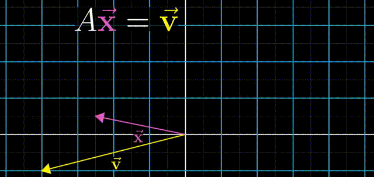

> 为什么行列式不能等于0？回忆一下，行列式等于0相当于把一个高维空间挤压成一个低维空间，**它的逆矩阵相当于要把低维空间转换为高维空间**。这是做不到的。它脱离了函数的概念，即一个x对应一个y，在低维空间转换为高维空间的过程中，低维空间的一个点要转换为高维空间的线、面等等，相当于一个x对应多个y
>
> 行列式等于0时，可能有解，仅当 $\vec{v}$ 恰好在挤压成的低维空间上。

**解法之一**：得到矩阵的增广矩阵$$\overline{A}$$，因此只需要把增广矩阵化为行最简形，最后一列即为方程组的解。

1. 对于矩阵方程 $$\boldsymbol{A}\boldsymbol{X}=\boldsymbol{B}$$，$$(\begin{array}{c:c}\boldsymbol{A} & \boldsymbol{B}\end{array}) \stackrel{r}{\longrightarrow} (\begin{array}{c:c}\boldsymbol{E} & \boldsymbol{A}^{-1}\boldsymbol{B}\end{array})$$

2. 对于齐次线性方程组，矩阵A的**零空间**就是方程的解

   - 之有零解（零空间是一个点）的充要条件是$$R(\boldsymbol{A})=n$$

   - 有非零解（零空间是一个子空间）的充要条件是$$R(\boldsymbol{A})<n$$

   - 齐次线性方程组的解集$$X_A$$的一个极大无关组称为一个**基础解系**
     $$
     X_A=\{x=t_1\xi_1+\cdots+t_{n-r}\xi_{n-r}|t_i\in R,\ i=1,\cdots,n-r\}
     $$

3. 对于系数矩阵为方阵的齐次线性方程组 $$\boldsymbol{A}\boldsymbol{X}=\boldsymbol{b}$$，$$(\begin{array}{c:c}\boldsymbol{A} & \boldsymbol{b}\end{array}) \stackrel{r}{\longrightarrow} (\begin{array}{c:c}\boldsymbol{E} & \boldsymbol{A}^{-1}\boldsymbol{b}\end{array})$$

   - 无解（低维表示高维）的充要条件是$$R(\boldsymbol{A})<R(\boldsymbol{\overline{A}})$$
   
   - 唯一解的充要条件是$$R(\boldsymbol{A})= R(\boldsymbol{\overline{A}})= n$$
   
   - 有无穷多解（高维中表示低维子空间）的充要条件是$$R(\boldsymbol{A})=R(\boldsymbol{\overline{A}})< n$$
   
   - 通解=特解+基础解系
     $$
     X=\eta+t_1\xi_1+\cdots+t_{n-r}\xi_{n-r},\ \ \ (t_i\in R,\ i=1,\cdots,n-r)
     $$

**解法之二**：**克拉默**（Cramer）法则
$$
\begin{cases} a_{11}x_1 + a_{12}x_2 + \dots + a_{1n}x_n = b_1 \\ a_{21}x_1 + a_{22}x_2 + \dots + a_{2n}x_n = b_2 \\ \ \ \ \ \ \ \ \ \ \ \ \ \ \ \ \ \cdots\cdots\cdots\cdots\cdots\\ a_{n1}x_1 + a_{n2}x_2 + \dots + a_{nn}x_n = b_n \\ \end{cases}\
$$
唯一解为：
$$
x_1=\frac{D_1}{D},x_2=\frac{D_2}{D},\cdots,x_1=\frac{Dn}{D}
$$
D为方程组转换的行列式，$$D_j$$是把系数行列式 D 中第 j 列的元素用方程组右端的常数项代替后得到的 n 阶行列式，即：
$$
D_j = \left| \begin{matrix} a_{11} & \cdots & a_{1,j-1} & b_1 & a_{1,j+1} & \cdots & a_{1n}\\ \vdots & & \vdots & \vdots & \vdots & & \vdots\\ a_{n1} & \cdots & a_{n,j-1} & b_n & a_{n,j+1} & \cdots & a_{nn}\\ \end{matrix} \right|
$$

## 特征值与特征向量

考虑二维空间中的线性变换，一个向量**张成的空间**，是通过原点和向量尖端的直线。

大部分向量在变换中都离开了其张成的空间，不过，某些特殊向量的确留在它们张成的空间里，意味着矩阵对它的作用仅仅是拉伸或者压缩而已。而这些特殊向量是**特征向量**，**特征值**代表特征向量在变换中拉伸或压缩的比例。

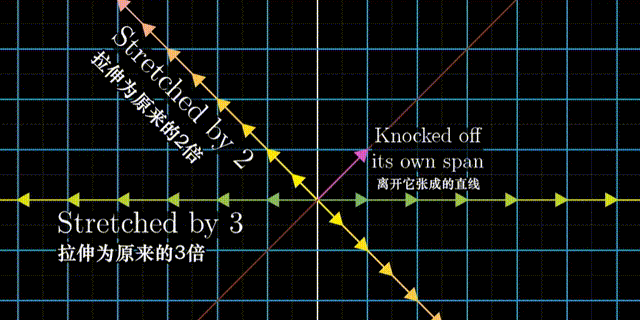

这也与公式对应：
$$
A\vec{v} = \lambda \vec{v}
$$
考虑一个三维空间中的旋转。如果你能找到这个旋转的特征向量，也就是留在它张成的空间里的向量，那么你找到的就是**旋转轴**。在这种情况下，相应的特征值必为1，因为旋转并不缩放任何一个向量。

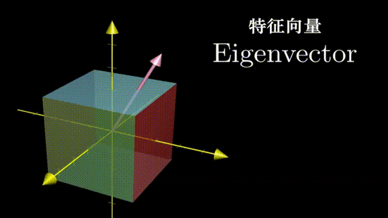

**求解特征值和特征向量**：
$$
|A-\lambda E|=0
$$
这是以 λ 为未知数的一元 n 次方程，称为 A 的**特征方程**。在复数范围内， n 阶方阵 A 有 n 个特征值（重根按重数计算）$$\lambda_1,\lambda_2,\cdots,\lambda_n$$，求出特征值$$\lambda_i$$后，代入齐次线性方程组中，求解方程组，得特征向量X：
$$
(A-\lambda_iE)X=0
$$

- 属于同一特征值的特征向量有无穷多个，不同特征值对应的特征向量必不相同（线性无关），即一个特征向量只能属于一个特征值。
- $$\sum_{i=1}^n\lambda_i=\sum_{i=1}^na_{ii}=tr(A)=主对角元之和=迹$$
- $$\prod_{i=1}^n\lambda_i=|A|$$

| $$\boldsymbol{A}$$      | $$k_1\boldsymbol{A}+k_2\boldsymbol{E}$$ | $$\boldsymbol{A}^{-1}$$ | $$\boldsymbol{A}^*$$                 | $$\boldsymbol{A}^n$$    | $$\boldsymbol{A}^T$$    | $$\boldsymbol{P}^{-1}\boldsymbol{A}\boldsymbol{P}$$ |
| ----------------------- | --------------------------------------- | ----------------------- | ------------------------------------ | ----------------------- | ----------------------- | --------------------------------------------------- |
| $$\lambda$$             | $$k_1\lambda + k_2$$                    | $$\frac{1}{\lambda}$$   | $$\frac{\boldsymbol{[A]}}{\lambda}$$ | $$\lambda^n$$           | $$\lambda$$             | $$\lambda$$                                         |
| $$\boldsymbol{\alpha}$$ | $$\boldsymbol{\alpha}$$                 | $$\boldsymbol{\alpha}$$ | $$\boldsymbol{\alpha}$$              | $$\boldsymbol{\alpha}$$ | $$\boldsymbol{\alpha}$$ | $$\boldsymbol{P}^{-1}\boldsymbol{\alpha}$$          |

## 相似

教科书：如果 $$P^{-1}AP=B$$，那么 A 与 B **相似**，记作$$A\sim B$$，P称为**相似变换矩阵**

我们从直观的角度理解什么是 $$P^{-1}AP$$，让我们讲一个故事：当我使用基向量(0,1)和(1,0)，Jenny使用基向量 (2,1)和(-1,1) 时，可以看作我们使用不同的语言。

问题来了，Jenny用(-1,2)表示一个向量，在我的坐标系如何描述？（如何从她的语言转化到我的语言？）

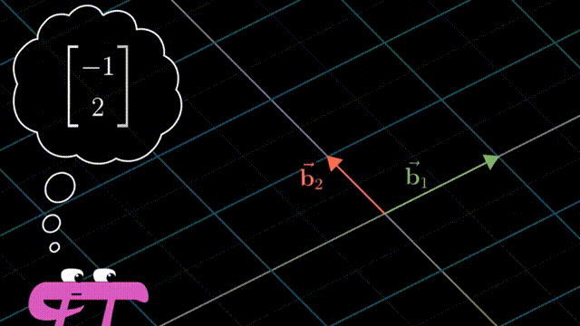
$$
\begin{bmatrix}
2 & -1 \\
1 & 1  \\
\end{bmatrix}
\begin{bmatrix}
-1  \\
2  \\
\end{bmatrix}
= 
\begin{bmatrix}
-4  \\
1  \\
\end{bmatrix}
$$
复习一下，用Jenny的基向量组成的矩阵代表一种转换，将我的网格变换为Jenny的网格。然而从语义上，却是将她的语言转化为我的语言（相反的）

> 可以把它看作我们对Jenny的向量的误解(-1,2)，变换成Jenny真正想表示的向量(-4,1)

当把矩阵求逆，即将Jenny的网格变换为我的网格；将我的语言转化为她的语言

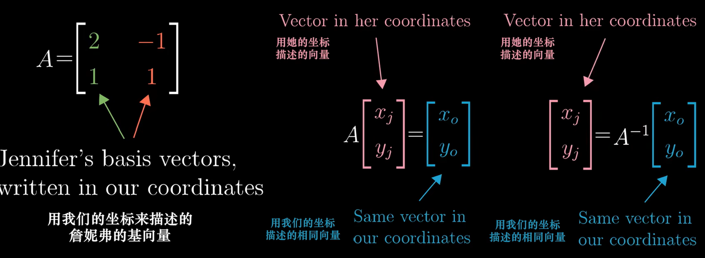

继续下一个问题，在我的坐标系中的空间转换（矩阵 M），如何在Jenny的坐标系中表示？

拿一个Jenny的向量 $\vec{v}$ 举例：

1. 首先乘矩阵 $A$ ，转换为我的语言。
2. 然后乘矩阵 $P$，在我的坐标系中的空间转换完毕。
3. 然后乘矩阵 $A^{-1}$，转换为Jenny的语言。完毕。

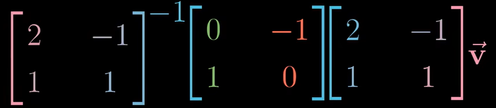

因此，在我的坐标系中的空间转换（矩阵 M），在Jenny的世界中用 $$A^{-1}MA$$ 表示

总的来说，每当看到这样一个表达式：$$A^{-1}PA$$，这就暗示着一种数学上的转移作用，中间的矩阵代表一种**你所见的变换**，而外侧两个矩阵代表着**转移作用**，也就是视角上的转化。矩阵乘积仍然代表着同一个变换，只不过是从其他人的角度来看的。

- $$A \sim B$$，$$R(A)=R(B)$$，相同的特征值，$$|A|=|B|$$，$$tr(A)=tr(B)$$
- $$A^{-1}\sim B^{-1},A^*\sim B^*$$，变换阵仍为 P
- $$\varphi(A)\sim\varphi(B),\varphi(\cdot)$$为任意矩阵多项式），变换阵仍为 P
- $$A^T\sim B^T$$，变换阵为$$(P^T)^{-1}$$

### 相似对角化

如果方阵 A 可被**相似对角化**，那么存在 $P^{-1}AP=\Lambda$ 为对角矩阵（称 Λ 为 A 的**相似标准形**）。怎么证明？

问一个问题：对于一个矩阵（空间转换），如果用特征向量作为新的基，在新的坐标系中，这个矩阵（空间转换）是怎样的？

具体来说，取出两个特征向量，将坐标作为矩阵的列，这个矩阵就是基变换矩阵。在右侧写下基变换矩阵，在左侧写下基变换矩阵的逆。当你将原始的变换夹在两个矩阵中间时，所得的矩阵代表的是同一个变换，不过是从新基向量所构成的坐标系的角度来看的。

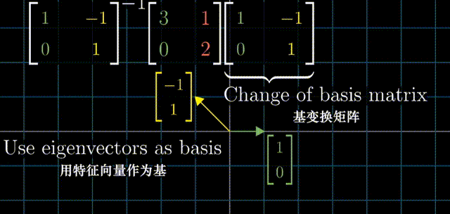

用特征向量来完成这件事的意义在于这个**新矩阵必然是对角**的，并且对角元为对应的特征值。这是因为，在新的坐标系中，基向量（同样是特征值）没有离开张成的空间，基向量在变换中只进行了缩放。

## 其他特殊矩阵

### 实对称矩阵

- 实对称矩阵的特征值全是实数，也必有实特征向量.
- 实对称矩阵属于不同特征值的特征向量一定正交.

### 正交矩阵

A 为**正交矩阵**，则满足：
$$
A^TA=E
$$

- 若 A 为正交阵,则向量的线性变换 y=Ax 称为**正交变换**
- $$|A|=\pm1$$
- 若 B 也是正交阵，则AB也是正交阵
- A 的行（列）向量组构成 $$R^n$$ 的一个标准正交基.

