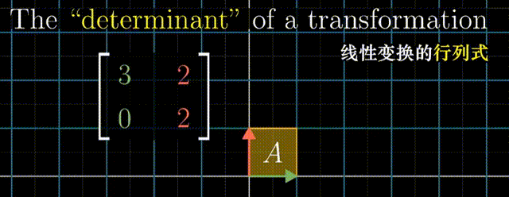
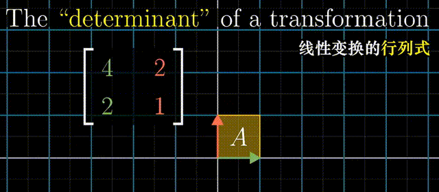
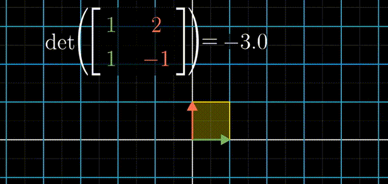
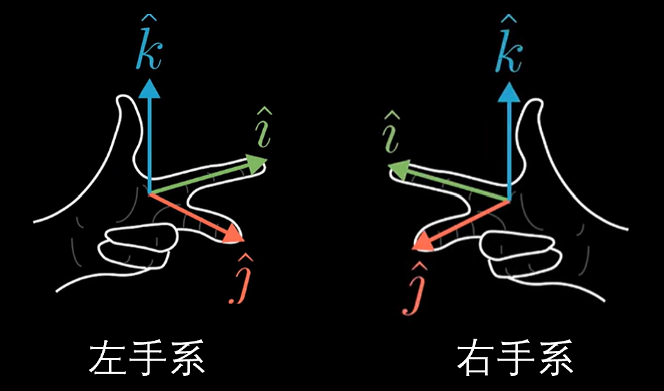
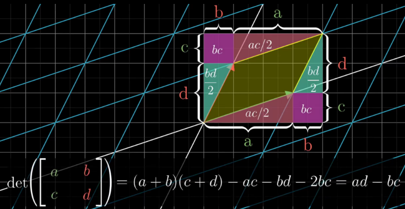

# 线性代数基础

## 行列式

**行列式**：线性变换**改变面积的比例**。二阶行列式可看做平行四边形的面积

行列式为0，矩阵必然线性相关，或者说面积被挤压到0

行列式的正负与平面的取向有关，行列式为负，空间被翻转

三阶行列式可简单看做平行六面体的体积，正负号代表三维翻转，如果可以用右手系表示为正，如果只能用左手系表示为负

严谨的面积计算方法：

- 行列式与它的转置行列式相等

- 行列式两行（列）互换，行列式变号

- 任意两个向量线性相关（秩为0），行列式等于零

  > 直观理解：降到低维空间中了，在本维度中的“体积”为0

- 行列式某一行（列）的所有元素都乘以同一数 k，等于用数 k 去乘行列式，公因子也可以提到行列式的符号外面

  > 直观理解：构成“体积”的某一条边扩大k倍，“体积”扩大k倍

- 把行列式的某一行(列)的各元素乘以同一个数然后加到另一行(列)对应的元素上去,行列式的值不变。
  $$
  D = \left | \begin{matrix} a_{11} & a_{12} & \cdots & a_{1n} \\ \vdots & \vdots & & \vdots \\ a_{i1} & a_{i2} & \cdots & a_{in} \\ \vdots & \vdots & & \vdots \\ a_{j1} & a_{j2} & \cdots & a_{jn} \\ \vdots & \vdots & & \vdots \\ a_{n1} & a_{n2} & \cdots & a_{nn} \\ \end{matrix} \right |=\left | \begin{matrix} a_{11} & a_{12} & \cdots & a_{1n} \\ \vdots & \vdots & & \vdots \\ a_{i1} + ka_{j1} & a_{i2} + ka_{j2} & \cdots & a_{in} + ka_{jn} \\ \vdots & \vdots & & \vdots \\ a_{j1} & a_{j2} & \cdots & a_{jn} \\ \vdots & \vdots & & \vdots \\ a_{n1} & a_{n2} & \cdots & a_{nn} \\ \end{matrix} \right |
  $$

- 若行列式的某一行(列)的元素都是两数之和,例如，第i行的元素都是两数之和，那么可以拆开
  $$
  D = \left | \begin{matrix} a_{11} & a_{12} & \cdots & a_{1n} \\ a_{21} & a_{22} & \cdots & a_{2n} \\ \vdots & \vdots & & \vdots \\ a_{i1} & a_{i2} & \cdots & a_{in} \\ \vdots & \vdots & & \vdots \\ a_{n1} & a_{n2} & \cdots & a_{nn} \\ \end{matrix} \right |+ \left | \begin{matrix} a_{11} & a_{12} & \cdots & a_{1n} \\ a_{21} & a_{22} & \cdots & a_{2n} \\ \vdots & \vdots & & \vdots \\ a'{i1} & a'{i2} & \cdots & a'{in} \\ \vdots & \vdots & & \vdots \\ a{n1} & a_{n2} & \cdots & a_{nn} \\ \end{matrix} \right |
  $$

  $$
  D = \left | \begin{matrix} a_{11} & a_{12} & \cdots & a_{1n} \\ a_{21} & a_{22} & \cdots & a_{2n} \\ \vdots & \vdots & & \vdots \\ a_{i1}+a'{i1} & a{i2}+a'{i2} & \cdots & a{in}+a'{in} \\ \vdots & \vdots & & \vdots \\ a{n1} & a_{n2} & \cdots & a_{nn} \\ \end{matrix} \right |
  $$

**余子式**：在n阶行列式中划去元素$$a_{ij}$$所在的第i行第j列，由剩下的元素按原来的排法构成一个n-1阶的行列式$$M_{ij}$$

**代数余子式**：$$A_{ij}=(-1)^{i+j} M_{i j}$$

- 行列式D等于它的任意一行（列）的所有元素与它们各自对应的代数余子式的乘积之和。
- 行列式D的任意一行（列）的所有元素与另外一行（列）对应的代数余子式之和等于0。

上（下）三角行列式的值等于主对角线元素的乘积：
$$
a_{11}a_{22}...a_{nn}
$$
关于副对角线的行列式，重新排列一下：
$$
\begin{aligned} \left|\begin{array}{ccccc} a_{11} & a_{12} & \cdots & a_{1, n-1} & a_{1 n} \\ a_{21} & a_{22} & \cdots & a_{2, n-1} & 0 \\ \vdots & \vdots & & \vdots & \vdots \\ a_{n 1} & 0 & \cdots & 0 & 0 \end{array}\right| &=\left|\begin{array}{cccc} 0 & \cdots & 0 & a_{1 n} \\ 0 & \cdots & a_{2, n-1} & a_{2 n} \\ \vdots & & \vdots & \vdots \\ a_{n 1} & \cdots & a_{n, n-1} & a_{n n} \end{array}\right| \\ &=(-1)^{\frac{n(n-1)}{2}} a_{1 n} a_{2, n-1} \cdots a_{n 1} \end{aligned}
$$
范德蒙德（Vandermonde）行列式：
$$
D_n=\left| \begin{matrix} 1 & 1 & \dots & 1\\ x_1 & x_2 & \dots & x_n\\ x_1^2 & x_2^2 & \dots & x_n^2\\ \vdots & \vdots & & \vdots\\ x_1^{n-1} & x_2^{n-1} & \dots & x_n^{n-1}\\ \end{matrix} \right| =\prod_{1 \leq i < j \leq n}(x_j-x_i)
$$
拉普拉斯展开式：
$$
\left| \begin{matrix} A & *\\ 0 & B \end{matrix} \right| = \left| \begin{matrix} A & 0\\ * & B \end{matrix} \right| =|A|\cdot|B|\\ \left| \begin{matrix} 0 & A\\ B & * \end{matrix} \right| = \left| \begin{matrix} * & A\\ B & 0 \end{matrix} \right| =(-1)^{mn}|A|\cdot|B|
$$
