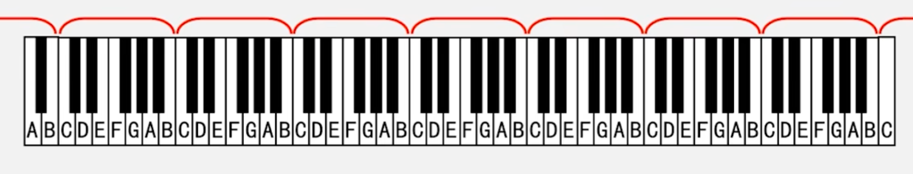
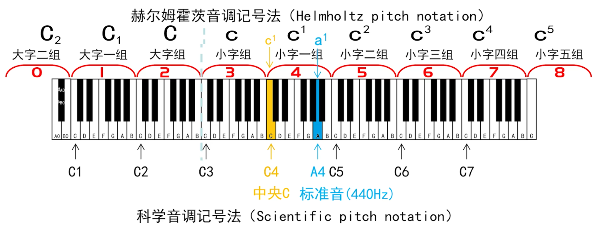
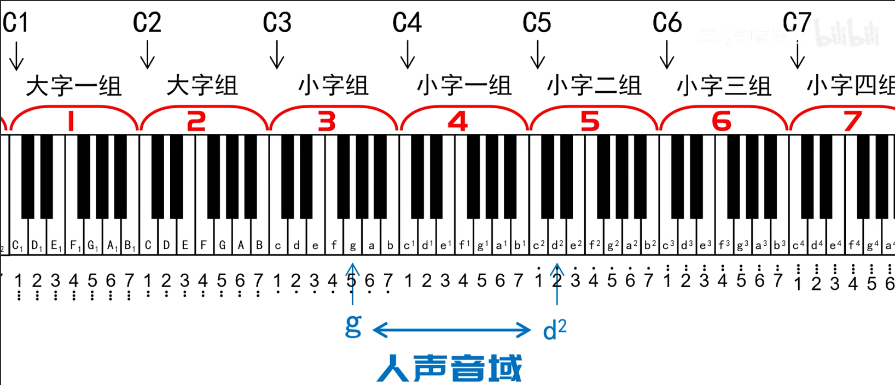

# 基础乐理

调号，例如 (`1=C`) 由三个基本元素组成：

1. **数字 (左侧):**代表**唱名 (Solfege)**。在简谱中，`99.9%` 的情况下都是 **`1`**，也就是 **`Do`**。
2. **等号 (=):**连接“唱名”和“音名”的桥梁。它的具体含义是理解调号的关键，将在后续课程中讲解。
3. **字母 (右侧):**代表**音名 (Pitch Name)**。它可以是 `C, D, E, F, G, A, B` 中的任意一个。

**音名 (Pitch Name)**： 在音乐中，我们用七个字母 `C, D, E, F, G, A, B` 来为音本身命名，这些字母被称为“音名”。

- 唱名（Do, Re, Mi...）和数字（1, 2, 3...）是**固定对应**的。
- 音名（C, D, E...）和唱名（Do, Re, Mi...）**不是固定对应**的。

可以借助钢琴认识音名，钢琴键盘由若干个重复的“**组**”构成。 每一个标准的“组”包含 12个键： 7个白键 5个黑键。在任何一个“组”中，7个白键从左到右的名字**永远**是 **`C, D, E, F, G, A, B`**

> 一个标准88键钢琴由9个“组”构成，两端的组不完整
>
> 
>
> 进行指认练习：随机说出一个音名（如 F, A, D, C），然后快速用手指在画的键盘上指出它的位置，以及反过来

当我们书写 1=C 的时候，即 1(do) 从 C 出发。1(do) 的位置一旦确定，234567 的位置也跟着确定。但是，只有 (`1=C`) 的时候1234567才是全在白键上的，其他任何的调都总会有至少一个音跑到黑键上去。

在钢琴上，白键（CDEFGAB）并不直接相邻，当白键之间存在黑键时，黑和白才是相邻的音。用升降号标识，升为 ♯，降为 ♭，例如，CD间的黑键为 C♯ 或 D♭，它们是一个意思，称为等音。例外是EF和BC，它们直接相邻。

类似的符号像重升𝄪，重降𝄫，例如 C 可以用 𝄫D 表示，A可以用 𝄪G 表示，钢琴一个组12个键中，有11个键都有三个名字的，除了 ♯G/♭A 只有两个名字

当两个音的频率比恰好为 **`1:2`** 时，我们称这两个音之间构成的关系为 **“纯八度”**。

> **听觉效果：**纯八度的两个音听起来**极其相似、无比和谐**，甚至像同一个音的不同亮度版本。耳朵不敏感的人可能听不出这是两个独立的音。
>
> **对比：** 频率比复杂的音（如 `C` 和 `D`，比值约为 `1:1.122`），一起弹奏时能明显感觉到“不是一个音”。

在钢琴上的体现：任意两个**相邻且同名**的音，它们的频率比都是 `1:2`。例如：从一个 `C` 键到离它最近的下一个 `C` 键，就是一个纯八度。同理，`D` 到下一个 `D` 也是。

> 我们之所以只用 C, D, E, F, G, A, B 这七个字母来命名音，正是因为“纯八度”现象。 当音阶进行到第八个音时，它的频率正好是第一个音的两倍（1:2 关系）。 由于它们听感上极度相似，所以我们不再使用新的字母，而是重复使用第一个字母，并将其视为下一个“组”的开始。

为了区分不同组的音名，我们有如下两种记号：

- 第一种方法将钢琴第3组命名为 大字组 (Great Octave)。 将钢琴第4组命名为 小字组 (Small Octave)。**大字n组**：在大写字母**右下方**加数字 `n` (e.g., C₁, C₂)。**小字n组**：在小写字母**右上方**加数字 `n` (e.g., c¹, c²)
- 科学音调记号法从钢琴最左边的C开始编号，每个C代表一个新组的开始。音名右侧直接加上其所属组的数字。

那么 `1=C` 到底等于哪个 `C`？原则上，`1=C` 可以等于**任何一个八度(组)的 `C`**。但是，在绝大多数情况下，`1=C` 指的是**中央C (Middle C)**，即 **`C4`** (或赫尔姆霍茨记法中的 `c¹`)。

这个惯例的形成主要源于**简谱的用途**和**人声的音域**。简谱（Numbered Notation）有两大用途：器乐谱和歌谱。 在日常接触中，歌谱占据了简谱应用的 80% ~ 90%。当为人写歌时，人声就相当于一件乐器，也拥有自己的音域。 一个被广泛接受的、男女通用的舒适演唱音域大约在 G3 (小字组的g) 到 D5 (小字二组的d) 之间。那么`1=C` 指的是中央C时最方便，囊括了这个音域的主要部分

> 音域指某一件乐器或人声能够发出的**从最低音到最高音的范围**。超出这个范围的音，该乐器或人声便无法演奏或演唱。
>
> - 固定音域乐器： 像**钢琴**这类按键乐器，音域是绝对固定的，无法通过技巧扩展。
> - 可扩展音域乐器： 像小提琴、大管等管弦乐器，其音域可以通过演奏者的技巧（如泛音）得到一定程度的扩展。因此，不同教材对这类乐器的音域描述可能存在微小差异。 例如：小提琴音域大约为 g 到 $$b^4$$

此外，在简谱上，为了区分不同组的数字，如果定义`1=C` 指的是中央C，那么低一个组的数字下面加点，反之上面加点

我们知道音有高低之分，其物理基础是频率（赫兹Hz）。但用具体、复杂的赫兹数值来描述音高差距，在音乐交流中非常不便。音乐理论使用一套更简洁、通用的概念来描述音与音之间的**距离**，其中最基础的就是“半音”和“全音”。

半音 (Semitone / Half Step)：在基础乐理中，半音是音与音之间最小的距离单位。它描述的是两个音之间的距离关系，而不是指某一个特定的音。

> 在钢琴键盘上，任何两个物理上相邻的琴键，它们之间的音高距离就是一个半音。“相邻”这个概念包括了所有的白键和黑键。例如与 `C` 相邻的键是左边的 `B` 和右边的 `C♯`

全音同样是指两个音之间的距离。一个全音的距离等于两个半音相加。

乐音 (Musical Tone / Pitched Sound)：指振动规则、频率**稳定**的音。例如钢琴上任意一个琴键（无论黑白）单独弹奏时发出的声音，都是乐音，因为每个键都对应一个固定的频率。

噪音 (Noise / Unpitched Sound)：指振动不规则、频率**不稳定**的音，是“乐音”的反面。例如生活中的揉纸声、咳嗽声、流水声、说话声等。 音乐中的打击乐器，如各种鼓（Drums）、镲（Cymbals）等发出的声音。因此，它们被称为“噪音乐器”。

> 音乐并非只有乐音，而是乐音和噪音的结合。噪音在音乐中主要用于营造节奏、烘托氛围、充当背景

乐音体系 (Musical System)：指在音乐中所使用到的**所有乐音的总和**。

音列 (Tone Row / Pitch Series)：从乐音体系中，选取**若干个音**，并按照一定**次序**排列起来形成的集合。

音级 (Pitch Class)：乐音体系中的每一个音都称为音级

- 基本音级 (Basic Pitch Class)：不带任何升降记号的七个基本音级：C、D、E、F、G、A、B
- 变化音级 (Altered Pitch Class)：除基本音级外，所有带有变化记号的音级，例如♯C、♭E、×B 等等

自然与变化半音/全音

- 自然 (Natural)：两个音名相邻的音级关系（忽略所有升降记号，只看字母，例如 DE）
- 变化 (Altered)：两个**音名不相邻**的音级关系（例如 DD）
- **半音**：音乐中最小的音高距离（钢琴上相邻的键）
- **全音**：两个半音的距离（钢琴上间隔一个键）

“哆来咪发唆拉西哆”这串音阶之所以听起来和谐、有终止感的内在固定规则，而并非任意一组音符都能产生这种感觉。**规则总结**：**全、全、半、全、全、全、半**。

> 从钢琴理解，当 1=C 时，`全全半全全全半` 都落在白键上。而 1=D 时，就有其他键落在黑键上

调式 (Mode/Musical Mode)：若干个音按照某种特定规则排列组合形成的体系。

自然大调式 (Natural Major Mode)对应7个音，排列规则为全全半全全全半，从C音开始叫做C自然大调，简称**C大调**
