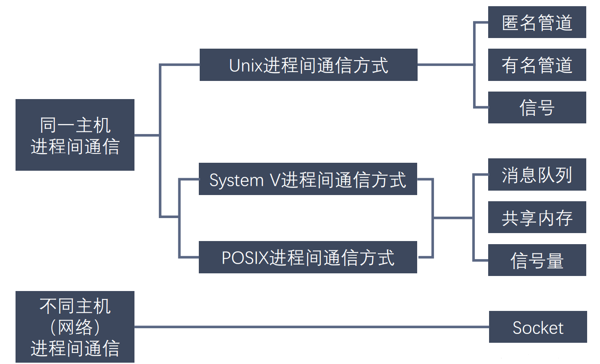

# 进程和线程

## 进程

程序是储存在磁盘上的文件，进程除了有文本段，还有进程ID、程序计数器PC、PCB进程控制块、处理器寄存器、堆栈（函数参数、返回地址、局部变量）、数据段（全局变量）、堆。

- 动态性
- 并发性
- 独立性
- 异步性。因此需要同步机制。

## 进程状态图

- 新建
- 终止
- 等待
- 就绪
- 运行

## 进程间通信

- 共享内存：允许两个或多个进程共享一个给定的内存区，一个进程写⼊的东西，其他进程⻢上就能看到。共享内存是最快的进程间通信方式，它是针对其他进程间通信方式运行效率低而专门设计的。
- 消息队列：消息队列是保存在内核中的消息链表，按照消息的类型进行消息传递，具有较高的可靠性和稳定性。缺点：消息体有一个最大长度的限制，不适合比较大的数据传输；存在用户态与内核态之间的数据拷贝开销。
- 套接字：提供网络通信的端点，可以让不同机器上运行的进程之间进行双向通信。
- 信号：用于通知接收进程某件事情发生了，是一种较为简单的通信方式，主要用于处理异步事件。例如SIGKILL强制杀死进程且不能被阻塞和忽略。
- 管道（pipe）：生产者从管道一端写，消费者从管道另一端读。数据只能单向流动，遵循先进先出（FIFO）的原则。

## 线程

线程是轻量级进程，是一个基本的CPU执行单元，是程序执行流的最小单元。

每个线程包括：线程ID、程序计数器PC、处理器寄存器、堆栈。

与同一进程的其它线程共享：代码段、数据段、打开的文件、信号等等。

进程与线程的区别：

- 进程可以视为系统资源分配单元，线程是一个基本的CPU执行单元。
- 进程拥有资源，线程不具有。
- 进程的上下文切换、创建和撤销开销大，线程的调度、创建和撤销开销小。
- 线程提供了更好的并发性。

## 多线程模型

- 多对一：多个用户线程映射到一个内核线程，并发度不高
- 一对一：并发度高，但开销较大
- 多对多：n个用户线程映射到m个内核线程，n>=m，综合上面的优点。

## 调度算法

一般要求计算：

- 等待时间
- 轮转时间（周转时间）：作业完成时间-作业到来（或者说提交）时间
- 带权轮转时间：$$\frac{轮转时间}{作业实际运行时间}$$

具体算法包括：

- FCFS先到先服务
- SJF最短作业优先
- 抢占SJF或者最短剩余时间优先
- 优先级调度（教材中数字越小优先级越高）
- 高相应比优先调度，相应比$$R_p=\frac{等待时间+要求服务时间}{要求服务时间}$$
- RR轮转调度
- 多级队列调度：将就绪队列分成多个单独队列，每个队列有自己的调度算法，进程被永久地分配到某个队列
- 多级反馈队列调度：允许进程在队列之前迁移

Little公式如下，其中n为平均队列长度，W为平均等待时间，每秒$\lambda$个新进程到达队列：
$$
n=W\times \lambda
$$
## 实时CPU调度

- 单调速率调度：周期越短，优先级越高。调度N个进程的**最坏情况**下CPU利用率为：$$N(2^{\frac{1}{N}}-1)$$，例如，对于两个进程的系统，如果CPU利用率小于83%，那么一定能够保证完成，反正不能保证。
- EDF最早截止期限优先。可抢占。

## 协程(Coroutines)

协程是一种比线程更加轻量级的存在，正如一个进程可以拥有多个线程一样，一个线程可以拥有多个协程。协程不是被操作系统内核所管理的，而是完全由程序所控制，也就是在用户态执行。这样带来的好处是性能大幅度的提升，因为不会像线程切换那样消耗资源。

## 其他

**僵尸进程**是已完成且处于终止状态，但在进程表中却仍然存在的进程。一般发生有父子关系的进程中，一个子进程的进程描述符在子进程退出时不会释放，只有当父进程通过 wait() 或 waitpid() 获取了子进程信息后才会释放。如果子进程退出，而父进程并没有调用 wait() 或 waitpid()，那么子进程的进程描述符仍然保存在系统中

一个父进程退出，而它的一个或多个子进程还在运行，那么这些子进程将成为**孤儿进程**。孤儿进程将被 init 进程 (进程 ID 为 1 的进程) 所收养，并由 init 进程对它们完成状态收集工作。因为孤儿进程会被 init 进程收养，所以孤儿进程不会对系统造成危害。

## 例题

### T1

- 若每个作业只能建立一个进程，为了照顾短作业用户，应采用（短作业优先调度算法 ）
- 为了照顾紧急作业用户，应采用（ 基于优先级的剥夺调度算法）
- 为了实现人机交互，应采用（时间片轮转调度算法）
- 为了使短作业、长作业和交互作业用户都满意，应采用（ 多级反馈队列调度算法）

