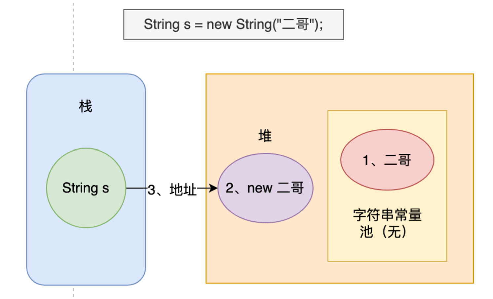
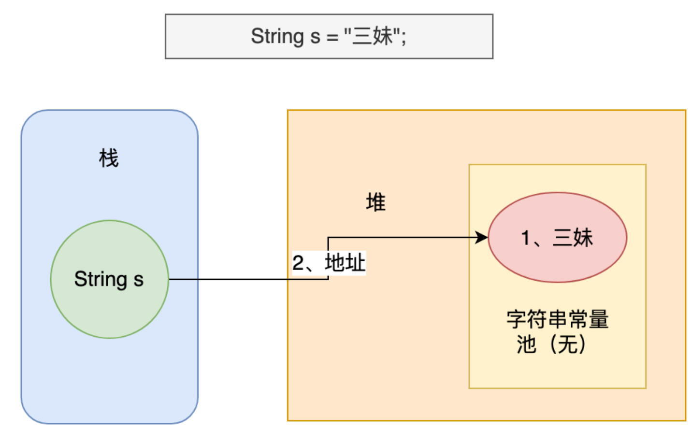
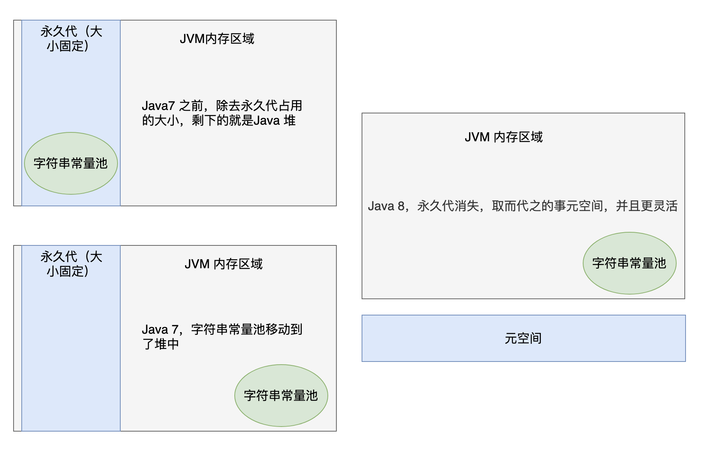
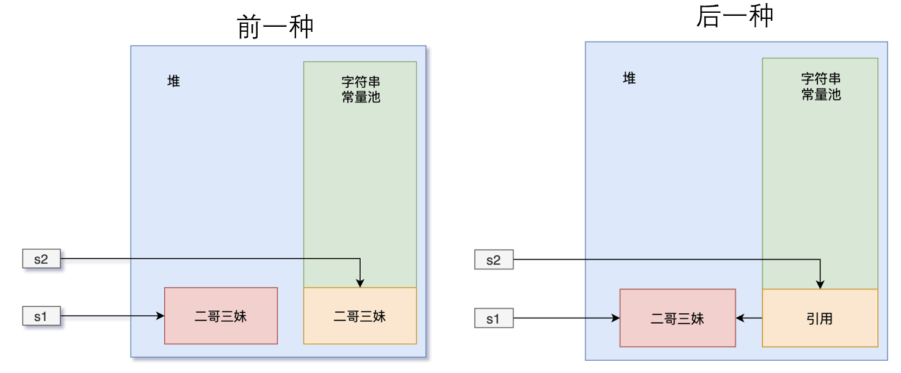

# String

我们不聊 String 类的API，我们看看String中用到了哪些Java特性和优化手段，作为之后内容的引入。

##  String 类的声明

```java
public final class String
    implements java.io.Serializable, Comparable<String>, CharSequence {
}
```

1. String 类是 **final** 的，意味着它不能被子类**继承**
2. String 类实现了 **Serializable** 接口，意味着它可以**序列化**
3. String 类实现了 **Comparable** 接口，意味着最好不要用‘==’来比较两个字符串是否相等，而应该用 compareTo() 方法去比较。只是说比较字符串内容的话，可以使用 String 类的 `equals` 方法
4. String 和 StringBuffer、StringBuilder 一样，都实现了 **CharSequence** 接口，所以它们仨属于近亲。由于 String 是不可变的，所以遇到字符串拼接的时候就可以考虑一下 StringBuffer 和 StringBuilder，它俩是可变的

## 从char 数组优化为 byte 数组

```java
private final char value[];  // JDK 8

private final byte[] value;  // JDK 11
private final byte coder;  // JDK 11
```

Java 9 以前，String 是用 char 型数组实现的，之后改成了 byte 型数组实现，并增加了 coder 来表示编码。这样做的好处是在 Latin1 字符为主的程序里，可以把 String 占用的内存减少一半（内存占用减少带来的另外一个好处，就是垃圾回收次数也会减少）。当然，天下没有免费的午餐，这个改进在节省内存的同时引入了编码检测的开销。

> Latin1（Latin-1）是一种单字节字符集（即每个字符只使用一个字节的编码方式）它包含了西欧语言中使用的所有字符，包括英语、法语、德语、西班牙语、葡萄牙语、意大利语等等。

## 哈希

每一个字符串都会有一个 hash 值，这个哈希值在很大概率是不会重复的，因此 String 很适合来作为 HashMap 的键值

```java
private int hash; // 缓存字符串的哈希码

public int hashCode() {
    int h = hash; // 从缓存中获取哈希码
    // 如果哈希码未被计算过（即为 0）且字符串不为空，则计算哈希码
    if (h == 0 && value.length > 0) {
        char val[] = value; // 获取字符串的字符数组

        // 遍历字符串的每个字符来计算哈希码
        for (int i = 0; i < value.length; i++) {
            h = 31 * h + val[i]; // 使用 31 作为乘法因子
        }
        hash = h; // 缓存计算后的哈希码
    }
    return h; // 返回哈希码
}
```

31 倍哈希法（31-Hash）是一种简单有效的字符串哈希算法，常用于对字符串进行哈希处理。该算法的基本思想是将字符串中的每个字符乘以一个固定的质数 31 的幂次方，并将它们相加得到哈希值：
$$
H(s) = (s[0] \times 31^{n-1}) + (s[1] \times 31^{n-2}) + ... + (s[n-1] \times 31^0)
$$
31 倍哈希法的优点在于简单易实现，计算速度快，同时也比较均匀地分布在哈希表中。

## 不可变性

```java
public final class String
    implements java.io.Serializable, Comparable<String>, CharSequence {
    /** The value is used for character storage. */
    private final char value[];
}
```

- String 类被 final 关键字修饰，所以它不会有子类，这就意味着没有子类可以重写它的方法，改变它的行为
- String 类的数据存储在 `char[]` 数组中，而这个数组也被 final 关键字修饰了，这就表示 String 对象是没法被修改的，只要初始化一次，值就确定了

这样设计的优点：

- 以保证 String 对象的**安全性**，避免被篡改，毕竟像密码这种隐私信息一般就是用字符串存储的
- 保证**哈希值不会频繁变更**。毕竟要经常作为哈希表的键值，经常变更的话，哈希表的性能就会很差劲
- 可以实现**字符串常量池**，Java 会将相同内容的字符串存储在字符串常量池中。这样，具有相同内容的字符串变量可以指向同一个 String 对象，节省内存空间
- **线程安全**，如果对象的状态是可变的，那么在多线程环境下，就很容易造成不可预期的结果。而 String 是不可变的，就可以在多个线程之间共享，不需要同步处理。

> - 被 final 修饰的变量无法重新赋值，因此必须有一个默认值
> - 被 final 修饰的对象无法重新赋值，但是对象内部成员变量可变
> - 被 final 修饰的方法不能被重写
> - 如果一个类使用了 final 关键字修饰，那么它就无法被继承

## 不可变类

一个类的对象在通过构造方法创建后如果状态不会再被改变，那么它就是一个不可变（immutable）类。它的所有成员变量的赋值仅在构造方法中完成，不会提供任何 setter 方法供外部类去修改。

必须要满足以下 4 个条件：

- 确保类是 final 的，不允许被其他类继承。
- 确保所有的成员变量（字段）是 final 的，这样的话，它们就只能在构造方法中初始化值，并且不会在随后被修改。
- 不要提供任何 setter 方法。
- 如果要修改类的状态，必须返回一个新的对象。

如果一个不可变类中包含了可变类的对象，那么就需要确保返回的是可变对象的副本。

```java
public Book getBook() {
    Book clone = new Book();
    clone.setPrice(this.book.getPrice());
    clone.setName(this.book.getName());
    return clone;
}
```

## 字符串常量池

面试题：这行代码创建了几个对象？

```java
String s = new String("二哥");
```

使用 new 关键字创建一个字符串对象时，Java 虚拟机会先在字符串常量池中查找有没有‘二哥’这个字符串对象，如果没有，先在字符串常量池中创建一个‘二哥’的字符串对象，然后再在堆中创建一个‘二哥’的字符串对象，然后将堆中这个‘二哥’的字符串对象地址返回赋值给变量 s。



如果有，直接在堆中创建一个‘二哥’的字符串对象，然后将堆中这个‘二哥’的对象地址返回赋值给变量 s。

> 在Java中，栈上存储的是基本数据类型的变量和对象的引用，而对象本身则存储在堆上。

对于这行代码 `String s = new String("二哥");`，它创建了两个对象：一个是字符串对象 "二哥"，它被添加到了字符串常量池中，另一个是通过 new String() 构造函数创建的字符串对象 "二哥"，它被分配在堆内存中，同时引用变量 s 存储在栈上，它指向堆内存中的字符串对象 "二哥"。

**为什么要先在字符串常量池中创建对象，然后再在堆上创建呢**？由于字符串的使用频率实在是太高了，所以 Java 虚拟机为了提高性能和减少内存开销，在创建字符串对象的时候进行了一些优化，特意为字符串开辟了一块空间——也就是字符串常量池。

通常情况下，我们会采用双引号的方式来创建字符串对象，这样就不会多此一举：

```java
String s = "三妹";
```

当执行 `String s = "三妹"` 时，Java 虚拟机会先在字符串常量池中查找有没有“三妹”这个字符串对象，如果有，则不创建任何对象，直接将字符串常量池中这个“三妹”的对象地址返回，赋给变量 s；如果没有，在字符串常量池中创建“三妹”这个对象，然后将其地址返回，赋给变量 s。



- 有了字符串常量池，就可以通过双引号的方式直接创建字符串对象，不用再通过 new 的方式在堆中创建对象了
- new 的方式始终会创建一个对象，不管字符串的内容是否已经存在，而双引号的方式会重复利用字符串常量池中已经存在的对象

> ```java
> String s = new String("二哥");  
> String s1 = new String("二哥");
> ```
>
> 创建三个对象，字符串常量池中一个，堆上两个
>
> ```java
> String s = "三妹";
> String s1 = "三妹";
> ```
>
> 只会创建一个对象，就是字符串常量池中的那个

关于字符串常量池在内存中的位置：



- 永久代是 Java 堆（Java Heap）的一部分，用于存储类信息、方法信息、常量池信息等静态数据。
- 永久代的大小是有限的，如果我们在应用程序中使用了大量的类、方法、常量等静态数据，就有可能导致永久代空间不足。这种情况下，JVM 就会抛出 OutOfMemoryError 错误。
- Java 堆是 JVM 中存储对象实例和数组的内存区域
- 元空间是一块本机内存区域，和 JVM 内存区域是分开的。不过，元空间的作用依然和之前的永久代一样，用于存储类信息、方法信息、常量池信息等静态数据。元空间具有一些优点，例如：
  - 它不会导致 OutOfMemoryError 错误，因为元空间的大小可以动态调整。
  - 元空间使用本机内存，而不是 JVM 堆内存，这可以避免堆内存的碎片化问题。
  - 元空间中的垃圾收集与堆中的垃圾收集是分离的，这可以避免应用程序在运行过程中因为进行类加载和卸载而频繁地触发 Full GC（垃圾收集）。
- 方法区是 Java 虚拟机规范中的一个概念，就像是一个接口吧；
- 永久代是 HotSpot 虚拟机中对方法区的一个实现，就像是接口的实现类；
- Java 8 的时候，移除了永久代，取而代之的是元空间，是方法区的另外一种实现，更灵活了。

## String.intern()方法

这段代码输出的结果是false

```java
String s1 = new String("二哥三妹");
String s2 = s1.intern();
System.out.println(s1 == s2);
```

1. 字符串常量池中会先创建一个“二哥三妹”的对象，然后堆中会再创建一个“二哥三妹”的对象，**s1 引用的是堆中的对象**
2. 对 s1 执行 `intern()` 方法，该方法会从字符串常量池中查找“二哥三妹”这个字符串是否存在，此时是存在的，所以 **s2 引用的是字符串常量池中的对象**
3. s1 和 s2 的引用地址是不同的，一个来自堆，一个来自字符串常量池，所以输出的结果为 false

这段代码输出的结果是true

```java
String s1 = new String("二哥") + new String("三妹");
String s2 = s1.intern();
System.out.println(s1 == s2);
```

1. 创建 "二哥" 字符串对象，存储在字符串常量池中。
2. 创建 "三妹" 字符串对象，存储在字符串常量池中。
3. 执行 `new String("二哥")`，在堆上创建一个字符串对象，内容为 "二哥"。
4. 执行 `new String("三妹")`，在堆上创建一个字符串对象，内容为 "三妹"。
5. 执行 `new String("二哥") + new String("三妹")`，会创建一个 StringBuilder 对象，并将 "二哥" 和 "三妹" 追加到其中，然后调用 StringBuilder 对象的 toString() 方法，将其转换为一个新的字符串对象，内容为 "二哥三妹"。这个**新的字符串对象存储在堆上**。
6. 对 s1 执行 `intern()` 方法，该方法会从字符串常量池中查找“二哥三妹”这个对象是否存在，此时不存在的，但**堆中已经存在了**，所以字符串常量池中保存的是堆中这个“二哥三妹”对象的引用
7. s2 和 s1 的引用地址是相同的，所以输出的结果为 true



> 也就是说，当编译器遇到 `+` 号这个操作符的时候，会将 `new String("二哥") + new String("三妹")` 这行代码编译为以下代码：
>
> ```java
> new StringBuilder().append("二哥").append("三妹").toString();
> ```

注意：尽管 intern 可以确保所有具有相同内容的字符串共享相同的内存空间，但也不要烂用 intern，因为任何的缓存池都是有大小限制的，不能无缘无故就占用了相对稀缺的缓存空间，导致其他字符串没有坑位可占。

另外，字符串常量池本质上是一个固定大小的 StringTable，如果放进去的字符串过多，就会造成严重的哈希冲突，从而导致链表变长，链表变长也就意味着字符串常量池的性能会大幅下降，因为要一个一个找是需要花费时间的。

```java
new String("小萝莉").equals("小萝莉");  // true
new String("小萝莉") == "小萝莉";  // false, 堆中和字符串常量池中
new String("小萝莉") == new String("小萝莉");  // false, new 出来的对象肯定是完全不同的内存地址
"小萝莉" == "小萝莉";  // true, 字符串常量池中只会有一个相同内容的对象
"小萝莉" == "小" + "萝莉";  // true, ‘小’和‘萝莉’都在字符串常量池，所以编译器在遇到‘+’操作符的时候将其自动优化为“小萝莉”
new String("小萝莉").intern() == "小萝莉"; //true, 复习一下intern
```

## +号操作符的本质

\+ 号操作符其实被 Java 在编译的时候重新解释了，换一种说法就是，+ 号操作符是一种语法糖，让字符串的拼接变得更简便了。

在Java8中：

```java
String chenmo = "沉默";
String wanger = "王二";
System.out.println(chenmo + wanger);
```

即：

```java
String chenmo = "沉默";
String wanger = "王二";
System.out.println((new StringBuilder(chenmo)).append(wanger).toString());
```

**循环体内，拼接字符串最好使用 StringBuilder 的 `append()` 方法，而不是 + 号操作符**。原因就在于循环体内如果用 + 号操作符的话，就会产生大量的 StringBuilder 对象，不仅占用了更多的内存空间，还会让 Java 虚拟机不停的进行垃圾回收，从而降低了程序的性能。

```java
StringBuilder sb = new StringBuilder();
for (int i = 1; i < 10; i++) {
    String chenmo = "沉默";
    String wanger = "王二";
    sb.append(chenmo);
    sb.append(wanger);
}
System.out.println(sb);
```

## StringBuffer

`StringBuffer`和`StringBuilder`类似，但`StringBuffer`是线程安全的，方法前面都加了`synchronized`关键字。

- **String**：适用于字符串内容不会改变的场景，比如说作为 HashMap 的 key。
- **StringBuilder**：适用于单线程环境下需要频繁修改字符串内容的场景，比如在循环中拼接或修改字符串，是 String 的完美替代品。
- **StringBuffer**：现在已经不怎么用了，因为一般不会在多线程场景下去频繁的修改字符串内容。
