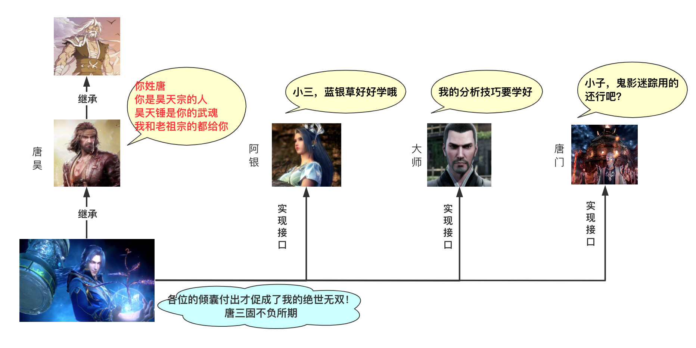

# 面向对象思想

## 抽象

所有编程语言都是一种抽象，甚至可以说，我们能够解决的问题的复杂程度取决于抽象的类型和质量。

Smalltalk 是历史上第一门获得成功的面向对象语言，也为 Java 提供了灵感。它有 5 个基本特征：

- 万物皆对象。
- 一段程序实际上就是多个对象通过发送消息的方式来告诉彼此该做什么。
- 通过组合的方式，可以将多个对象封装成其他更为基础的对象。
- 对象是通过类实例化的。
- 同一类型的对象可以接收相同的消息。

总结一句话就是：

> 状态+行为+标识=对象，每个对象在内存中都会有一个唯一的地址。

## 接口

所有的对象，都可以被归为一类，并且同一类对象拥有一些共同的行为和特征。在 Java 中，class 关键字用来定义一个类型。

创建抽象数据类型是面向对象编程的一个基本概念。你可以创建某种类型的变量，Java 中称之为对象或者实例，然后你就可以操作这些变量，Java 中称之为发送消息或者发送请求，最后对象决定自己该怎么做。

类描述了一系列具有相同特征和行为的对象，从宽泛的概念上来说，类其实就是一种自定义的数据类型。

一旦创建了一个类，就可以用它创建任意多个对象。面向对象编程语言遇到的最大一个挑战就是，如何把现实/虚拟的元素抽象为 Java 中的对象。

对象能够接收什么样的请求是由它的**接口**定义的。具体是怎么做到的，就由它的实现方法来实现。

## 访问权限修饰符

类的创建者有时候也被称为 API 提供者，对应的，类的使用者就被称为 API 调用者。

JDK 就给我们提供了 Java 的基础实现，JDK 的作者也就是基础 API 的提供者（Java 多线程部分的作者 Doug Lea 是被 Java 程序员敬佩的一个大佬），我们这些 Java 语言的使用者，说白了就是 JDK 的调用者。

当然了，假如我们也提供了新的类给其他调用者，我们也就成为了新的创建者。

API 创建者在创建新的类的时候，只暴露必要的接口，而隐藏其他所有不必要的信息，之所以要这么做，是因为如果这些信息对调用者是不可见的，那么创建者就可以随意修改隐藏的信息，而不用担心对调用者的影响。

访问权限修饰符的第一个作用是，防止类的调用者接触到他们不该接触的内部实现；第二个作用是，让类的创建者可以轻松修改内部机制而不用担心影响到调用者的使用。

- public
- private
- protected

还有一种“默认”的权限修饰符，是缺省的，它修饰的类可以访问同一个包下面的其他类。

## 组合

我们可以把一个创建好的类作为另外一个类的成员变量来使用，利用已有的类组成成一个新的类，被称为“复用”，组合代表的关系是 has-a 的关系。

## 封装

**利用抽象将数据和基于数据的操作封装在一起，使其构成一个不可分割的独立实体**。数据被保护在类的内部，尽可能地隐藏内部的实现细节，只保留一些对外接口使之与外部发生联系。

其他对象只能通过已经授权的操作来与这个封装的对象进行交互。也就是说用户是无需知道对象内部的细节（当然也无从知道），但可以通过该对象对外的提供的接口来访问该对象。

- 良好的封装能够减少耦合。
- 类内部的结构可以自由修改。
- 可以对成员进行更精确的控制。
- 隐藏信息，实现细节。

## 继承

子类继承父类，也就拥有了父类中 protected 和 public 修饰的方法和字段，同时，子类还可以扩展一些自己的方法和字段，也可以重写继承过来方法。

> 常见的例子，就是形状可以有子类圆形、方形、三角形，它们的基础接口是相同的，比如说都有一个 `draw()` 的方法，子类可以继承这个方法实现自己的绘制方法。

如果子类只是重写了父类的方法，那么它们之间的关系就是 is-a 的关系，但如果子类增加了新的方法，那么它们之间的关系就变成了 is-like-a 的关系。

### 多继承

Java 语言只支持类的单继承，但可以通过实现接口的方式达到多继承的目的。有三种实现多继承效果的方式，**分别是**内部类、多层继承和实现接口。


> 多继承，一个子类有多个直接的父类。这样做的好处是子类拥有所有父类的特征，**子类的丰富度很高，但是缺点就是容易造成混乱**。

实现接口无疑是满足多继承使用需求的最好方式，一个类可以实现多个接口满足自己在丰富性和复杂环境的使用需求。类和接口相比，**类就是一个实体，有属性和方法，而接口更倾向于一组方法**。



父类的构造方法不能被继承，子类的构造过程必须调用其父类的构造方法，如果子类的构造方法中没有显示地调用父类构造方法，则系统默认调用父类无参数的构造方法`super()`。

### 重写与重载

**方法重写**(Override)是子类中出现和父类中一模一样的方法(包括返回值类型，方法名，参数列表)，它建立在继承的基础上，你可以理解为方法的外壳不变，但是核心内容重写。

- 父类private方法在子类中不算重写，其对子类并不可见
- final 方法意味着它无法被子类继承到，所以就没办法重写
- static 方法也不允许重写，因为静态方法可用于父类以及子类的所有实例
- 重写的方法不能使用限制等级更严格的权限修饰符
- 重写后的方法只能抛出比父类异常或者其子类
- 可以在子类中通过 super 关键字来调用父类中被重写的方法
- 构造方法不能被重写

```java
class E1{
    public void doA(int a){
        System.out.println("这是父类的方法");
    }
}
class E2 extends E1{
    @Override
    public void doA(int a) {
        System.out.println("我重写父类方法，这是子类的方法");
    }
}
```

> 其中`@Override` 注解显示声明该方法为注解方法，可以帮你检查重写方法的语法正确性，当然如果不加也是可以的，但建议加上

**方法重载**(Overload)：如果有两个方法的**方法名相同**，但参数不一致。

重载可以通常理解为完成同一个事情的方法名相同，但是参数列表不同其他条件也可能不同。一个简单的方法重载的例子，类 E3 中的 add()方法就是一个重载方法。

```java
class E3{
    public int add(int a,int b){
        return a+b;
    }
    public double add(double a,double b) {
        return a+b;
    }
    public int add(int a,int b,int c) {
        return a+b+c;
    }
}
```

此外，**继承当中子类抛出的异常必须是父类抛出的异常或父类抛出异常的子异常**

### 关键字this

**指向当前对象**：

```java
WithThisStudent(String name, int age) {
    this.name = name;
    this.age = age;
}
```

**调用当前类的方法**：

```java
public class InvokeCurrentClassMethod {
    void method1() {}
    void method2() {
        method1();
        
        // 在字节码文件中变成
        // this.method1();
    }

    public static void main(String[] args) {
        new InvokeCurrentClassMethod().method1();
    }
}
```

**调用当前类的构造方法**：

```java
public class InvokeConstrutor {
    InvokeConstrutor() {
        System.out.println("hello");
    }

    InvokeConstrutor(int count) {
        this();
        System.out.println(count);
    }

    public static void main(String[] args) {
        InvokeConstrutor invokeConstrutor = new InvokeConstrutor(10);
    }
}
```

> 也可以调用有参构造方法，但是`this()` 必须放在构造方法的第一行

**作为参数在方法中传递**：

```java
public class ThisAsParam {
    void method1(ThisAsParam p) {
        System.out.println(p);
    }

    void method2() {
        method1(this);
    }

    public static void main(String[] args) {
        ThisAsParam thisAsParam = new ThisAsParam();
        System.out.println(thisAsParam);
        thisAsParam.method2();  // 两次print同一个对象
    }
}
```

**作为方法的返回值**

```java
public class ThisAsMethodResult {
    ThisAsMethodResult getThisAsMethodResult() {
        return this;
    }
    
    void out() {
        System.out.println("hello");
    }

    public static void main(String[] args) {
        new ThisAsMethodResult().getThisAsMethodResult().out();
    }
}
```

`getThisAsMethodResult()` 方法返回了 this 关键字，指向的就是 `new ThisAsMethodResult()` 这个对象，所以可以紧接着调用 `out()` 方法——达到了**链式调用**的目的

### 关键字super

- 指向父类对象；
- 调用父类的方法；
- `super()` 可以调用父类的构造方法。

```java
public class ReferParentField {
    public static void main(String[] args) {
        new Dog().printColor();
    }
}

class Animal {
    String color = "白色";
    
    Animal(){
        System.out.println("动物来了");
    }
    
    void eat() {
        System.out.println("动物吃...");
    }
}

class Dog extends Animal {
    String color = "黑色";

    void printColor() {
        System.out.println(color);  // 黑色
        System.out.println(super.color);  // 白色
    }
    
    @Override
    void eat() {
        System.out.println("吃...");
    }
    
    void bark() {
        System.out.println("汪汪汪...");
    }
    
    void work() {
        super.eat();  // 动物吃...
        bark();
    }
    
    Dog() {
        super();  // 调用父类的构造方法
        // 默认情况下，super() 是可以省略的，编译器会主动去调用父类的构造方法
        // super() 也可以用来调用父类的有参构造方法
        System.out.println("狗狗来了");
    }
}

```

## 多态

父类指针调用子类对象，展现不同特性。比如说有一个父类Shape

```java
public class Shape {
    public void draw() {
        System.out.println("形状");
    }
}
```

子类Circle

```java
public class Circle extends Shape{
    @Override
    public void draw() {
        System.out.println("圆形");
    }
}
```

子类Line

```java
public class Line extends Shape {
    @Override
    public void draw() {
        System.out.println("线");
    }
}
```

测试类

```java
public class Test {
    public static void main(String[] args) {
        Shape shape1 = new Line();
        shape1.draw();
        Shape shape2 = new Circle();
        shape2.draw();
    }
}
```

运行结果：

```text
线
圆形
```

由于编译器只有一个 Shape引用，它怎么知道究竟该调用父类 Shape的 `draw()` 方法，还是子类 Line的 `write()` 方法呢？

答案是在运行时根据对象的类型进行后期绑定，编译器在编译阶段并不知道对象的类型，但是 Java 的方法调用机制能找到正确的方法体，然后执行，得到正确的结果。

例题：

```java
public class Wangxiaosan extends Wangsan {
    private int age = 3;
    public Wangxiaosan(int age) {
        this.age = age;
        System.out.println("王小三的年龄：" + this.age);
    }

    public void write() { // 子类覆盖父类方法
        System.out.println("我小三上幼儿园的年龄是：" + this.age);
    }

    public static void main(String[] args) {
        new Wangxiaosan(4);
//      上幼儿园之前
//      我小三上幼儿园的年龄是：0
//      上幼儿园之后
//      王小三的年龄：4
    }
}

class Wangsan {
    Wangsan () {
        System.out.println("上幼儿园之前");
        write();
        System.out.println("上幼儿园之后");
    }
    public void write() {
        System.out.println("老子上幼儿园的年龄是3岁半");
    }
}
```

创建子类对象时，会先去调用父类的构造方法，而父类构造方法中又调用了被子类覆盖的多态方法，由于父类并不清楚子类对象中的字段值是什么，于是把 int 类型的属性暂时初始化为 0，然后再调用子类的构造方法（子类构造方法知道王小二的年龄是 4）。

## 创建方法

Java 有四种创建对象的方式：

new 关键字创建，这是最常见和直接的方式，通过调用类的构造方法来创建对象。

```java
Person person = new Person();
```

反射机制创建，反射机制允许在运行时创建对象，并且可以访问类的私有成员，在框架和工具类中比较常见。

```java
Class clazz = Class.forName("Person");
Person person = (Person) clazz.newInstance();
```

clone 拷贝创建，通过 clone 方法创建对象，需要实现 Cloneable 接口并重写 clone 方法。

```java
Person person = new Person();
Person person2 = (Person) person.clone();
```

序列化机制创建，通过序列化将对象转换为字节流，再通过反序列化从字节流中恢复对象。需要实现 Serializable 接口。

```java
Person person = new Person();
ObjectOutputStream oos = new ObjectOutputStream(new FileOutputStream("person.txt"));
oos.writeObject(person);
ObjectInputStream ois = new ObjectInputStream(new FileInputStream("person.txt"));
Person person2 = (Person) ois.readObject();
```