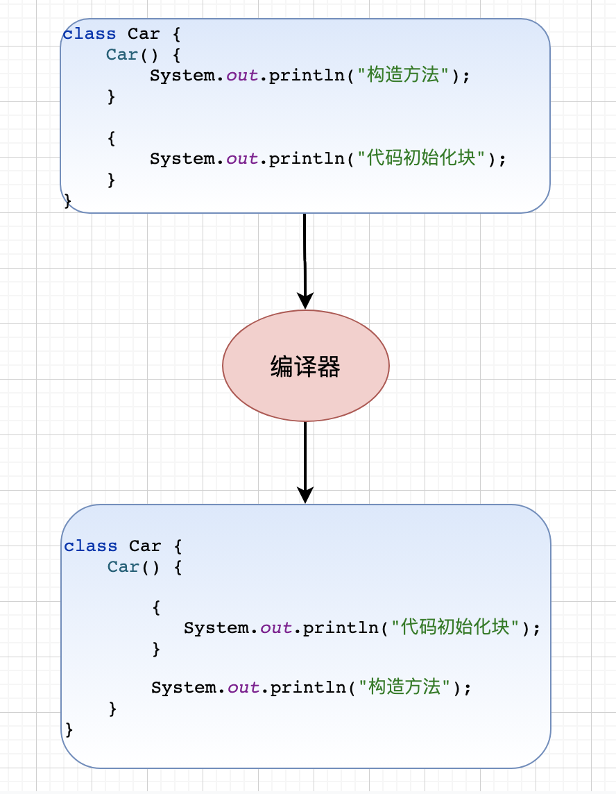

# 初始化块

## 初始化块的作用

对于一般成员变量，直接通过 `=` 操作符对进行初始化

```java
class Bike{  
    int speed=100;  
}  
```

但是如何为集合填充值？可以使用代码初始化块

```java
public class Bike {
    List<String> list;

    {
        list = new ArrayList<>();
        list.add("沉默王二");
        list.add("沉默王三");
    }

    public static void main(String[] args) {
        System.out.println(new Bike().list);
    }
}
```

## 执行顺序

对象在初始化的时候会先调用构造方法，这是毫无疑问的，只不过，构造方法在执行的时候会把代码初始化块放在构造方法中其他代码之前，所以，先看到了‘代码初始化块’，后看到了‘’构造方法’

```java
public class Car {
    Car() {
        System.out.println("构造方法");
    }

    {
        System.out.println("代码初始化块");
    }

    public static void main(String[] args) {
        new Car();
    }
}
```

输出：

```
代码初始化块
构造方法
```



如果父类也来：

```java
class A {
    A () {
        System.out.println("父类构造方法");
    }
}
public class B extends A{
    B() {
        System.out.println("子类构造方法");
    }

    {
        System.out.println("代码初始化块");
    }

    public static void main(String[] args) {
        new B();
    }
}
```

```
父类构造方法
代码初始化块
子类构造方法
```

## 静态初始化块

**静态初始化块在类加载时执行，只会执行一次**，并且优先于实例初始化块和构造方法的执行；实例初始化块在每次创建对象时执行，在构造方法之前执行。

```java
public class Example {
    // 静态变量
    public static int staticVar = 1;
    // 实例变量
    public int instanceVar = 2;

    // 静态初始化块
    static {
        System.out.println("执行静态初始化块");
        staticVar = 3;
    }

    // 实例初始化块
    {
        System.out.println("执行实例初始化块");
        instanceVar = 4;
    }

    // 构造方法
    public Example() {
        System.out.println("执行构造方法");
    }

    public static void main(String[] args) {
        System.out.println("执行main方法");

        Example e1 = new Example();
        Example e2 = new Example();

        System.out.println("e1的静态变量：" + e1.staticVar);
        System.out.println("e1的实例变量：" + e1.instanceVar);
        System.out.println("e2的静态变量：" + e2.staticVar);
        System.out.println("e2的实例变量：" + e2.instanceVar);
    }
}
```

```
执行静态初始化块
执行main方法
执行实例初始化块
执行构造方法
执行实例初始化块
执行构造方法
e1的静态变量：3
e1的实例变量：4
e2的静态变量：3
e2的实例变量：4
```

初始化先后顺序为：

1. 父类中静态成员变量和静态代码块
2. 子类中静态成员变量和静态代码块
3. 父类中普通成员变量和代码块，父类的构造方法
4. 子类中普通成员变量和代码块，子类的构造方法

总的来说，就是**静态>非静态，父类>子类，非构造方法>构造方法**。同一类别（例如普通变量和普通代码块）成员变量和代码块执行从前到后，需要注意逻辑。
