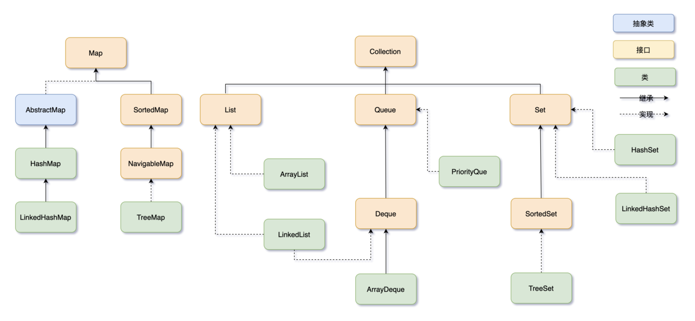

# 集合框架

简单介绍集合框架，具体API不再赘述



Java 集合框架可以分为两条大的支线： 

- Collection，主要由 List、Set、Queue 组成： 
  - List 代表有序、可重复的集合，典型代表就是封装了动态数组的 ArrayList 和封装了链表的 LinkedList；
  -  Set 代表无序、不可重复的集合，典型代表就是 HashSet 和 TreeSet； 
  - Queue 代表队列，典型代表就是双端队列 ArrayDeque，以及优先级队列 PriorityQueue。 
- Map，代表键值对的集合，典型代表就是 HashMap。

## List

- LinkedList 是由双向链表实现的
- ArrayList 是由数组实现的，内部数组的容量不足时会自动1.5倍扩容
- Vector，比 ArrayList 出现得更早。ArrayList 和 Vector 非常相似，只不过 Vector 是线程安全的，导致执行效率会比较低，所以现在已经很少用了
- Stack 是 Vector 的一个子类，本质上也是由动态数组实现的，实现了先进后出的功能
- Stack 执行效率比较低（同步），就**被双端队列 ArrayDeque 取代**了

## Set

- HashSet 其实是由 HashMap 实现的，只不过值由一个固定的 Object 对象填充，而键用于操作
- LinkedHashSet 虽然继承自 HashSet，其实是由 LinkedHashMap 实现的
- TreeSet 是由 TreeMap 实现的，只不过同样操作的键位，值由一个固定的 Object 对象填充。与 TreeMap 相似，TreeSet 是一种基于红黑树实现的有序集合，它实现了 SortedSet 接口，可以自动对集合中的元素进行排序。按照键的自然顺序或指定的比较器顺序进行排序。

## Queue

- ArrayDeque 是一个基于数组实现的双端队列
- LinkedList 基于链表实现，一般应该归在 List 下，只不过，它也实现了 Deque 接口，可以作为队列来使用。等于说，LinkedList 同时实现了 Stack、Queue、PriorityQueue 的所有功能
- PriorityQueue 是一种优先级队列，它的出队顺序与元素的优先级有关，返回的总是优先级最高的元素

## Map

- HashMap 实现了 Map 接口，可以根据键快速地查找对应的值——通过哈希函数将键映射到哈希表中的一个索引位置，从而实现快速访问。
- HashMap 是无序的。如果我们需要一个**有序**的 Map，就要用到 LinkedHashMap，是 HashMap 的子类，它使用链表来记录插入/访问元素的顺序。可以看作是 HashMap + LinkedList 的合体，它使用了哈希表来存储数据，又用了双向链表来维持键值对的插入顺序

```java
// 创建一个 LinkedHashMap，插入的键值对为 沉默 王二 陈清扬
LinkedHashMap<String, String> linkedHashMap = new LinkedHashMap<>();
linkedHashMap.put("沉默", "cenzhong");
linkedHashMap.put("王二", "wanger");
linkedHashMap.put("陈清扬", "chenqingyang");

// 遍历 LinkedHashMap
for (String key : linkedHashMap.keySet()) {
    String value = linkedHashMap.get(key);
    System.out.println(key + " 对应的值为：" + value);
}
```

```
沉默 对应的值为：cenzhong
王二 对应的值为：wanger
陈清扬 对应的值为：chenqingyang
```

- TreeMap 实现了 SortedMap 接口，可以自动将键按照自然顺序或指定的比较器顺序排序，并保证其元素的顺序。内部使用红黑树来实现键的排序和查找。默认情况下按照键的自然顺序排序

