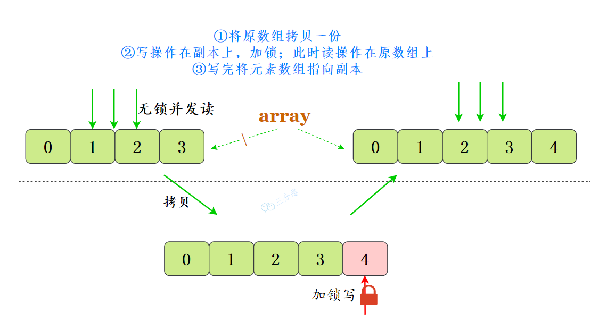

# List

## ArrayList 和 LinkedList 区别

ArrayList 基于数组实现，适用于：

- 随机访问频繁：需要频繁通过索引访问元素的场景。
- 读取操作远多于写入操作：如存储不经常改变的列表。
- 末尾添加元素：需要频繁在列表末尾添加元素的场景。

LinkedList 是基于链表的，适用于：

- 频繁插入和删除：在列表中间频繁插入和删除元素的场景。
- 不需要快速随机访问：顺序访问多于随机访问的场景。
- 队列和栈：由于其双向链表的特性，LinkedList 可以高效地实现队列（FIFO）和栈（LIFO）。

## 快速失败fail—fast

**快速失败（fail—fast）**：快速失败是 Java 集合的一种错误检测机制

- 在用迭代器遍历一个集合对象时，如果线程 A 遍历过程中，线程 B 对集合对象的内容进行了修改（增加、删除、修改），则会抛出 Concurrent Modification Exception。
- 原理：迭代器在遍历时直接访问集合中的内容，并且在遍历过程中使用一个 `modCount` 变量。集合在被遍历期间如果内容发生变化，就会改变`modCount`的值。每当迭代器使用 hashNext()/next()遍历下一个元素之前，都会检测 modCount 变量是否为 expectedmodCount 值，是的话就返回遍历；否则抛出异常，终止遍历。
- 注意：这里异常的抛出条件是检测到 modCount！=expectedmodCount 这个条件。如果集合发生变化时修改 modCount 值刚好又设置为了 expectedmodCount 值，则异常不会抛出。因此，不能依赖于这个异常是否抛出而进行并发操作的编程，这个异常只建议用于检测并发修改的 bug。
- 场景：java.util 包下的集合类都是快速失败的，不能在多线程下发生并发修改（迭代过程中被修改），比如 ArrayList 类。

## 安全失败（fail—safe）

- 采用安全失败机制的集合容器，在遍历时不是直接在集合内容上访问的，而是先复制原有集合内容，在拷贝的集合上进行遍历。
- 原理：由于迭代时是对原集合的拷贝进行遍历，所以在遍历过程中对原集合所作的修改并不能被迭代器检测到，所以不会触发 Concurrent Modification Exception。
- 缺点：基于拷贝内容的优点是避免了 Concurrent Modification Exception，但同样地，迭代器并不能访问到修改后的内容，即：迭代器遍历的是开始遍历那一刻拿到的集合拷贝，在遍历期间原集合发生的修改迭代器是不知道的。
- 场景：java.util.concurrent 包下的容器都是安全失败，可以在多线程下并发使用，并发修改，比如 CopyOnWriteArrayList 类。

## ArrayList 与线程安全

可以使用 `Collections.synchronizedList()` 方法，它将返回一个线程安全的 List。

```java
SynchronizedList list = Collections.synchronizedList(new ArrayList());
```

内部是通过 synchronized 关键字加锁来实现的。

也可以直接使用 CopyOnWriteArrayList，它是线程安全的，遵循写时复制的原则，每当对列表进行修改（例如添加、删除或更改元素）时，都会创建列表的一个新副本，这个新副本会替换旧的列表，而对旧列表的所有读取操作仍然可以继续。

```java
CopyOnWriteArrayList list = new CopyOnWriteArrayList();
```

通俗的讲，CopyOnWrite 就是当我们往一个容器添加元素的时候，不直接往容器中添加，而是先复制出一个新的容器，然后在新的容器里添加元素，添加完之后，再将原容器的引用指向新的容器。多个线程在读的时候，不需要加锁，因为当前容器不会添加任何元素。这样就实现了线程安全。


