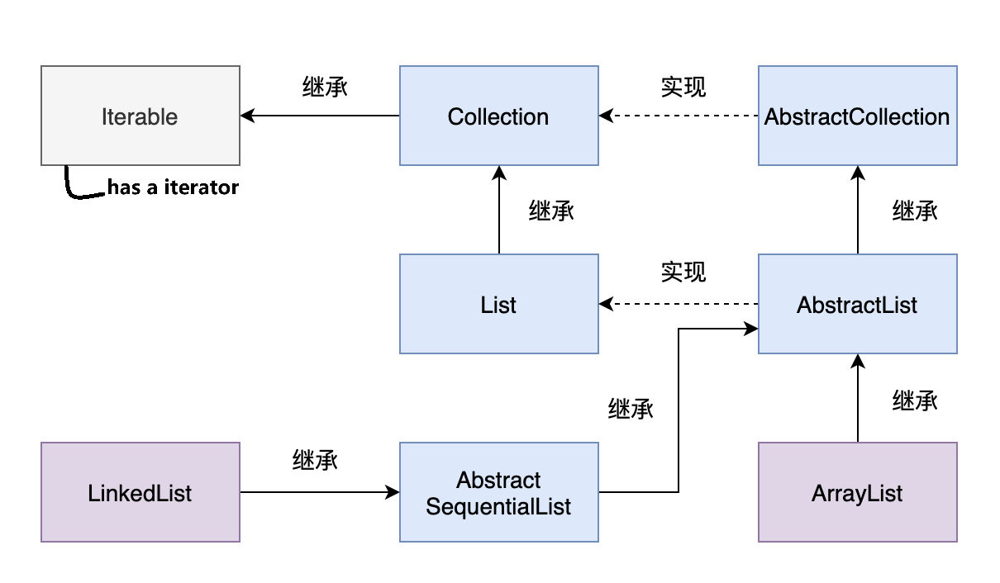

# 迭代

## 遍历方式

第一种：for 循环。

```java
for (int i = 0; i < list.size(); i++) {
    System.out.print(list.get(i) + "，");
}
```

第二种：迭代器。

```java
Iterator it = list.iterator();
while (it.hasNext()) {
    System.out.print(it.next() + "，");
}
```

第三种：for-each。

```java
for (String str : list) {
    System.out.print(str + "，");
}
```

第一种我们略过，第二种用的是 Iterator，第三种看起来是 for-each，其实背后也是 Iterator，看一下反编译后的代码（如下所示）就明白了。

```java
Iterator var3 = list.iterator();

while(var3.hasNext()) {
    String str = (String)var3.next();
    System.out.print(str + "，");
}
```

for-each 只不过是个语法糖，让我们开发者在遍历 List 的时候可以写更少的代码，更简洁明了。

## Iterator

Iterator 是个接口，用来改进 Enumeration 接口：

```java
public interface Iterator<E> {
    boolean hasNext();  // 判断集合中是否存在下一个对象
    E next();  // 返回集合中的下一个对象，并将访问指针移动一位
    
    // 删除集合中调用next()方法返回的对象
    default void remove() {
        throw new UnsupportedOperationException("remove");
    }
}
```

## Iterable

JDK 1.8 时，Iterable 接口中新增了 forEach 方法。该方法接受一个 Consumer 对象作为参数，用于对集合中的每个元素执行指定的操作。该方法的实现方式是使用 for-each 循环遍历集合中的元素，对于每个元素，调用 Consumer 对象的 accept 方法执行指定的操作。

```java
default void forEach(Consumer<? super T> action) {
    Objects.requireNonNull(action);  //非空检查
    for (T t : this) {
        action.accept(t);
    }
}
```

由于 Iterable 接口是 Java 集合框架中所有集合类型的基本接口，因此该方法可以被所有实现了 Iterable 接口的集合类型使用。它对 Iterable 的每个元素执行给定操作，具体指定的操作需要自己写Consumer接口通过accept方法回调出来。

```java
List<Integer> list = new ArrayList<>(Arrays.asList(1, 2, 3));
list.forEach(integer -> System.out.println(integer));
```

写得更浅显易懂点，就是：

```java
List<Integer> list = new ArrayList<>(Arrays.asList(1, 2, 3));
list.forEach(new Consumer<Integer>() {
    @Override
    public void accept(Integer integer) {
        System.out.println(integer);
    }
});
```

如果我们仔细观察ArrayList 或者 LinkedList 的“户口本”就会发现，并没有直接找到 Iterator 的影子。反而找到了 Iterable！



事实上，List 的关系图谱中并没有直接使用 Iterator，而是使用 Iterable 做了过渡。

```java
public interface Iterable<T> {
    Iterator<T> iterator();
}
```

> 正因此，我们可以使用迭代器遍历List：`Iterator it = list.iterator();`

为什么要套一层？为什么不直接将 Iterator 中的核心方法 hasNext、next 放到 Iterable 接口中呢？

从英文单词的后缀语法上来看，（Iterable）able 表示这个**能不能迭代**，而 （Iterator）tor 表示**如何迭代**。**能不能**和**怎么做**显然不能混在一起，否则就乱的一笔。还是各司其职的好。

原则上，只要一个 List 实现了 Iterable 接口，那么它就可以使用 for-each 这种方式来遍历，那具体该怎么遍历，还是要看它自己是怎么实现 Iterator 接口的。

## 实现方式

对于**ArrayList** ，它重写了 Iterable 接口的 iterator 方法。返回的对象 Itr 是个内部类，实现了 Iterator 接口，并且按照自己的方式重写了 hasNext、next、remove 等方法。

```java
public Iterator<E> iterator() {
    return new Itr();
}

private class Itr implements Iterator<E> {
    // ...
}
```

**Map** 就没办法直接使用 for-each，因为 Map 没有实现 Iterable 接口，只有通过 `map.entrySet()`、`map.keySet()`、`map.values()` 这种返回一个 Collection 的方式才能 使用 for-each。

**LinkedList** 并没有直接重写 Iterable 接口的 iterator 方法，而是由它的父类 AbstractSequentialList 来完成。

```java
public Iterator<E> iterator() {
    return listIterator();
}
```

LinkedList 重写了 listIterator 方法：

```java
public ListIterator<E> listIterator(int index) {
    checkPositionIndex(index);
    return new ListItr(index);
}
```

这里又套了一层迭代器 ListIterator，它继承了 Iterator 接口，在遍历List 时可以从任意下标开始遍历，而且支持双向遍历。ListIterator 就只支持 List

```java
public interface ListIterator<E> extends Iterator<E> {
    boolean hasNext();
    E next();
    boolean hasPrevious();
    E previous();
}
```

## for-each陷阱

for-each 删除元素报错代码：

```java
List<String> list = new ArrayList<>();
list.add("沉默王二");
list.add("沉默王三");
list.add("一个文章真特么有趣的程序员");

for (String str : list) {
	if ("沉默王二".equals(str)) {
		list.remove(str);
	}
}

System.out.println(list);
```

for-each 本质上是个语法糖，底层是通过迭代器 Iterator 配合 while 循环实现的，来看一下反编译后的字节码。

```java
List<String> list = new ArrayList();
list.add("沉默王二");
list.add("沉默王三");
list.add("一个文章真特么有趣的程序员");
Iterator var2 = list.iterator();

while(var2.hasNext()) {
    String str = (String)var2.next();
    if ("沉默王二".equals(str)) {
        list.remove(str);
    }
}

System.out.println(list);
```

再挖一层ArrayList 的 iterator 方法：

```java
public Iterator<E> iterator() {
    return new Itr();
}

private class Itr implements Iterator<E> {
    int cursor;             // 下一个元素的索引
    int lastRet = -1;       // 上一个返回元素的索引；如果没有则为 -1
    int expectedModCount = modCount; // ArrayList 的修改次数

    Itr() { }  // 构造函数

    public boolean hasNext() { // 判断是否还有下一个元素
        return cursor != size;
    }

    @SuppressWarnings("unchecked")
    public E next() { // 返回下一个元素
        checkForComodification(); // 检查 ArrayList 是否被修改过
        int i = cursor; // 当前索引
        Object[] elementData = ArrayList.this.elementData; // ArrayList 中的元素数组
        if (i >= elementData.length) // 超出数组范围
            throw new ConcurrentModificationException(); // 抛出异常
        cursor = i + 1; // 更新下一个元素的索引
        return (E) elementData[lastRet = i]; // 返回下一个元素
    }
}

final void checkForComodification() {
    if (modCount != expectedModCount)
        throw new ConcurrentModificationException();
}
```

`new Itr()` 的时候 expectedModCount 被赋值为 modCount，而 modCount 是 ArrayList 中的一个计数器，用于记录 ArrayList 对象被修改的次数。ArrayList 的修改操作包括添加、删除、设置元素值等。每次对 ArrayList 进行修改操作时，modCount 的值会自增 1。

list 执行了 3 次 add 方法：

- add 方法调用 ensureCapacityInternal 方法
- ensureCapacityInternal 方法调用 ensureExplicitCapacity 方法
- ensureExplicitCapacity 方法中会执行 `modCount++`

所以 modCount 的值在经过三次 add 后为 3，于是 `new Itr()` 后 expectedModCount 的值也为 3（回到前面去看一下 Itr 的源码）。

执行 `list.remove(str)`时：

- remove 方法调用 fastRemove 方法
- fastRemove 方法中会执行 `modCount++`

modCount 的值变成了 4。

第二次遍历时，会执行 Itr 的 next 方法（`String str = (String) var3.next();`），next 方法就会调用 `checkForComodification` 方法。该方法对 modCount 和 expectedModCount 进行了比较，发现两者不等，就抛出了 `ConcurrentModificationException` 异常。这种机制可以保证迭代器在遍历 ArrayList 时，不会遗漏或重复元素，同时也可以在多线程环境下检测到并发修改问题。

结论：**不要在 for-each 循环里进行元素的 remove/add 操作。remove 元素请使用 Iterator 方式**。

## 正确地删除元素

```java
List<String> list = new ArrayList<>();
list.add("沉默王二");
list.add("沉默王三");
list.add("一个文章真特么有趣的程序员");

Iterator<String> itr = list.iterator();
// 区别于Iterator var2 = list.iterator();

while (itr.hasNext()) {
	String str = itr.next();
    // 区别于String str = (String)var2.next();
	if ("沉默王二".equals(str)) {
		itr.remove();
        // 区别于list.remove(str);
	}
}
```

之前执行 `list.remove(str)`时：

- remove 方法调用 fastRemove 方法
- fastRemove 方法中会执行 `modCount++`

现在执行`itr.remove()`时，加了一步，删除完会执行 `expectedModCount = modCount`，保证了 expectedModCount 与 modCount 的同步。