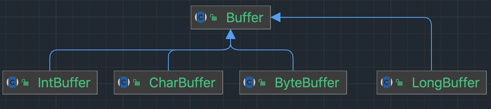
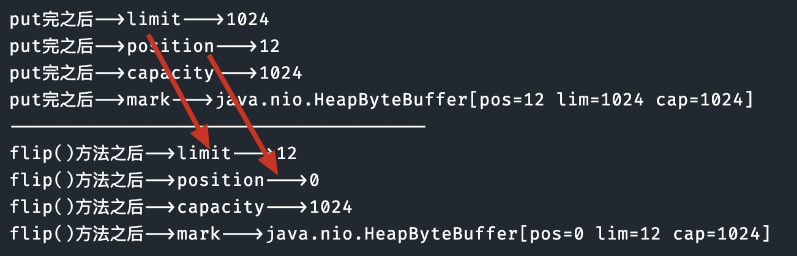
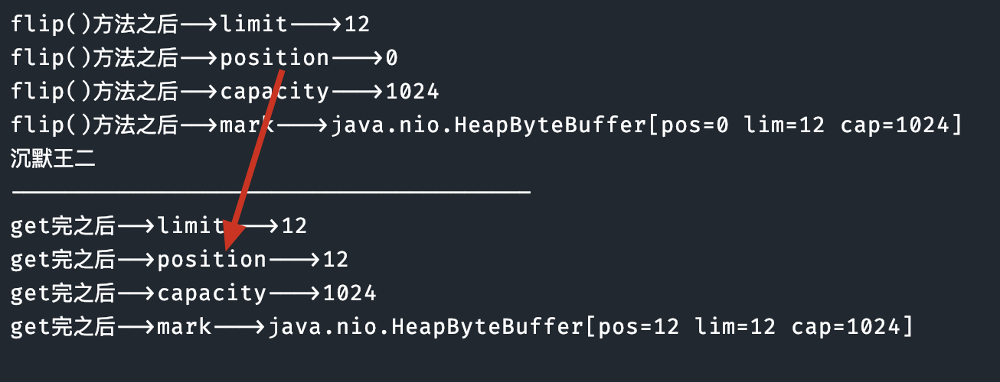
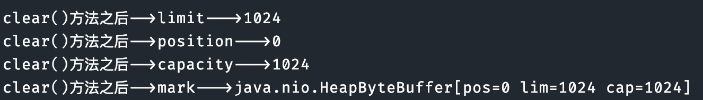
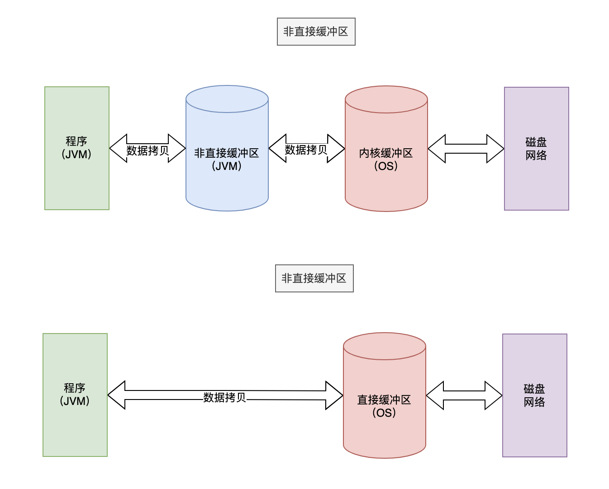

# 缓冲

我们之前提到过NIO 主要有**两个核心部分组成**：

- **Buffer 缓冲区**
- **Channel 通道**

简单理解一下：

可以把 Channel 通道比作（双向）铁路，buffer 缓冲区比作成火车(运载着货物)。而我们的 NIO 就是**通过 Channel 通道运输着存储数据的 Buffer 缓冲区的来实现数据的处理**！

要时刻记住：Channel 不与数据打交道，它只负责运输数据。与数据打交道的是 Buffer 缓冲区

## Buffer 缓冲区

Buffer 是缓冲区的抽象类：其中 ByteBuffer 是**用得最多的实现类**(在通道中读写字节数据)。



缓冲区的核心方法就是 put 和 get，就是**读取缓冲区的数据/写数据到缓冲区中**。

Buffer 类维护了 4 个核心变量来提供**关于其所包含的数组信息**。它们是：

- 容量 Capacity **缓冲区能够容纳的数据元素的最大数量**。容量在缓冲区创建时被设定，并且永远不能被改变。(不能被改变的原因也很简单，底层是数组嘛)
- 上界 Limit **缓冲区里的数据的总数**，代表了当前缓冲区中一共有多少数据。
- 位置 Position **下一个要被读或写的元素的位置**。Position 会自动由相应的 `get()`和 `put()`函数更新。
- 标记 Mark 一个备忘位置。**用于记录上一次读写的位置**。

我们写一些测试方法来获取这四个值，看看如何变化的：

```java
ByteBuffer byteBuffer = ByteBuffer.allocate(1024);

// 看一下初始时4个核心变量的值
System.out.println("初始时-->limit--->"+byteBuffer.limit());
System.out.println("初始时-->position--->"+byteBuffer.position());
System.out.println("初始时-->capacity--->"+byteBuffer.capacity());
System.out.println("初始时-->mark--->" + byteBuffer.mark());
```

添加数据：

```java
String s = "沉默王二";
byteBuffer.put(s.getBytes());
```

```
初始时-->limit--->1024
初始时-->position--->0
初始时-->capacity--->1024
初始时-->mark--->java.nio.HeapByteBuffer[pos=0 lim=1024 cap=1024]
--------------------------------------
put完之后-->limit--->1024
put完之后-->position--->12
put完之后-->capacity--->1024
put完之后-->mark--->java.nio.HeapByteBuffer[pos=12 lim=1024 cap=1024]
```

**想要从缓存区拿数据**，可以使用`flip()`方法。这个方法可以**改动 position 和 limit 的位置**。

```java
byteBuffer.flip();
```



在调用 `flip()` 之后，limit 变为当前 position 的值（12），position 重置为 0。这意味着你可以从缓冲区的position位置读取刚刚写入的limit大小的数据。capacity 保持不变（1024）。

当切换成读模式之后，我们就可以读取缓冲区的数据了

```java
// 创建一个limit()大小的字节数组(因为就只有limit这么多个数据可读)
byte[] bytes = new byte[byteBuffer.limit()];
// 将读取的数据装进我们的字节数组中
byteBuffer.get(bytes);
// 输出数据
System.out.println(new String(bytes, 0, bytes.length));
```

get完之后：



**读完如何还想写数据到缓冲区**，那就使用`clear()` 方法，这个方法会“清空”缓冲区，数据没有真正被清空，只是被**遗忘**掉了：



## 直接与非直接缓冲区

直接缓冲区和非直接缓冲区的差别主要在于它们在内存中的存储方式。这里给出了直接缓冲区和非直接缓冲区的简要概述和区别：

非直接缓冲区：

- 分配在 JVM 堆内存中
- 受到垃圾回收的管理
- 在读写操作时，需要将数据从堆内存复制到操作系统的本地内存，再进行 I/O 操作
- 创建： `ByteBuffer.allocate(int capacity)`

直接缓冲区：

- 分配在操作系统的本地内存中
- 不受垃圾回收的管理
- 在读写操作时，直接在本地内存中进行，避免了数据复制，提高了性能
- 创建： `ByteBuffer.allocateDirect(int capacity)`



其中的非直接缓冲区（JVM）在用户空间中，内核缓冲区（OS）在内核空间上。