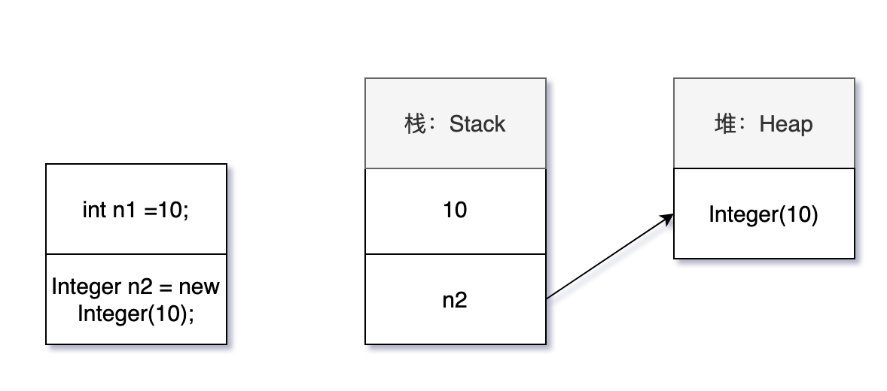

# 拆箱装箱

自动拆箱指的是，将包装类型转为基本数据类型，比如说把 Integer 对象转换成 int 值；对应的，把基本数据类型转为包装类型，则称为自动装箱。

## 基本与包装类型的区别

**包装类型可以为 null，而基本数据类型不可以**。POJO 的字段必须要用包装类型，正是因为数据库的查询结果可能是 null，如果使用基本数据类型的话，因为要自动拆箱，就会抛出 NullPointerException 的异常。

**包装类型可用于泛型，而基本数据类型不可以**。

```java
List<int> list = new ArrayList<>(); // 提示 Syntax error, insert "Dimensions" to complete ReferenceType
List<Integer> list = new ArrayList<>();
```

因为泛型在编译时会进行类型擦除，最后只保留**原始类型**，而原始类型只能是 Object 类及其子类——基本数据类型是个例外。

**基本数据类型比包装类型更高效**。作为局部变量时，基本数据类型在栈中直接存储的具体数值，而包装类型则存储的是堆中的引用。



很显然，相比较于基本类型而言，包装类型需要占用更多的内存空间。

- 基本数据类型：仅占用足够存储其值的固定大小的内存。例如，一个 int 值占用 4 字节。
- 包装类型：占用的内存空间要大得多，因为它们是对象，并且要存储对象的元数据。例如，一个 Integer 对象占用 16 字节。

并且不仅要存储对象，还要存储引用。假如没有基本数据类型的话，对于数值这类经常使用到的数据来说，每次都要通过 new 一个包装类型就显得非常笨重。

**两个包装类型的值可以相同，但却不相等**。要判断值是否相等，应该使用 `equals()` 方法

## 自动装箱拆箱

在 Java 1.5 之前，开发人员要手动进行装拆箱，比如说：

```java
Integer chenmo = new Integer(10); // 手动装箱
int wanger = chenmo.intValue();  // 手动拆箱
```

Java 1.5 为了减少开发人员的工作，提供了自动装箱与自动拆箱的功能。这下就方便了。

```java
Integer chenmo  = 10;  // 自动装箱
int wanger = chenmo;     // 自动拆箱
```

来看一下反编译后的代码。

```java
Integer chenmo = Integer.valueOf(10);
int wanger = chenmo.intValue();
```

## IntegerCache

练习时间：

```java
// 1）基本数据类型和包装类型
int a = 100;
Integer b = 100;
System.out.println(a == b);

// 2）两个包装类型
Integer c = 100;
Integer d = 100;
System.out.println(c == d);

// 3）
c = 200;
d = 200;
System.out.println(c == d);
```

- 第一段代码，基本数据类型和包装类型进行 == 比较，这时候 b 会自动拆箱，直接和 a 比较值，所以结果为 true。
- 第二段代码，我们可能会想“==”操作符应用于包装类型比较的时候，比较的可能是不同的引用，结果可能为 false。**但是答案为 true**
- 第三段代码，两个包装类型重新被赋值为了 200，这时候仍然会进行自动装箱，结果仍然为 false。

为什么第二段代码为true? 自动装箱是通过 `Integer.valueOf()` 完成的，我们来看看这个方法的源码：

```java
public static Integer valueOf(int i) {
    if (i >= IntegerCache.low && i <= IntegerCache.high)
        return IntegerCache.cache[i + (-IntegerCache.low)];
    return new Integer(i);
}
```

看到了一个之前见过的类——IntegerCache，它是 Integer 的缓存类，来看一下 IntegerCache 的源码：

```java
private static class IntegerCache {
    // 缓存的最小值，默认为 -128
    static final int low = -128;

    // 缓存的最大值，默认为 127，但可以通过 JVM 参数配置
    static final int high;
    static final Integer cache[];

    static {
        // 默认情况下 high 值为 127
        int h = 127;

        // 通过系统属性获取用户可能配置的更高的缓存上限
        // integerCacheHighPropValue 是一个字符串，代表配置的高值
        int i = parseInt(integerCacheHighPropValue);

        // 确保缓存的最高值至少为 127
        i = Math.max(i, 127);

        // 设置 high 的值，但不能超过 Integer.MAX_VALUE - (-low) - 1
        h = Math.min(i, Integer.MAX_VALUE - (-low) - 1);
        high = h;

        // 初始化缓存数组，大小为 high - low + 1
        cache = new Integer[(high - low) + 1];

        // 填充缓存，从 low 开始，为每个值创建一个 Integer 对象
        int j = low;
        for(int k = 0; k < cache.length; k++)
            cache[k] = new Integer(j++);

        // 断言确保 high 的值至少为 127，这是 Java 语言规范要求的
        assert IntegerCache.high >= 127;
    }
}
```

-128 到 127 之间的数会从 IntegerCache 中取，然后比较，所以第二段代码（100 在这个范围之内）的结果是 true，而第三段代码（200 不在这个范围之内，所以 new 出来了两个 Integer 对象）的结果是 false。

记住一点：**当需要进行自动装箱时，如果数字在 -128 至 127 之间时，会直接使用缓存中的对象，而不是重新创建一个对象**。

## 自动拆箱的注意事项

自动装拆箱是一个很好的功能，大大节省了我们开发人员的精力，但也会引发一些麻烦，比如下面这段代码，性能就很差：

```java
int t1 = System.currentTimeMillis();
Long sum = 0L;
for (int i = 0; i < Integer.MAX_VALUE;i++) {
    sum += i;
}
long t2 = System.currentTimeMillis();        
System.out.println(t2-t1);
```

由于 sum 是个 Long 型，而 i 为 int 类型，`sum += i` 在执行的时候，会先把 i 强转为 long 型，然后再把 sum 拆箱为 long 型进行相加操作，之后再自动装箱为 Long 型赋值给 sum。

