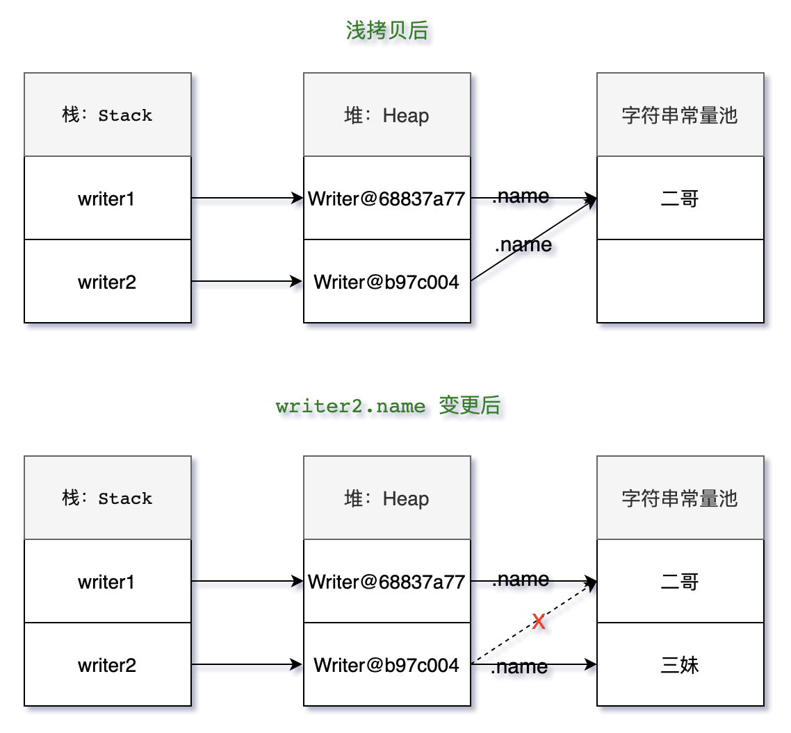
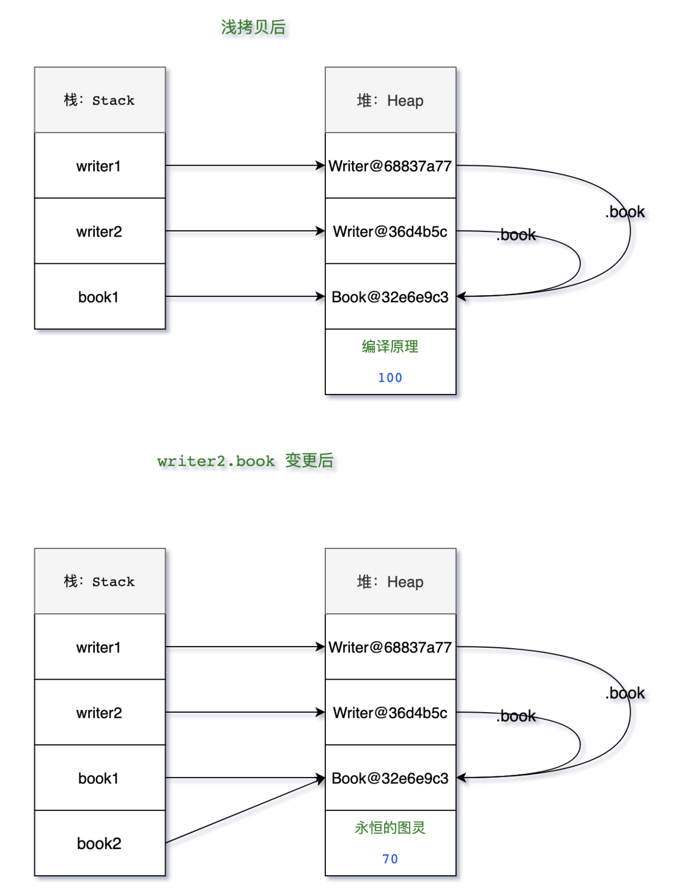
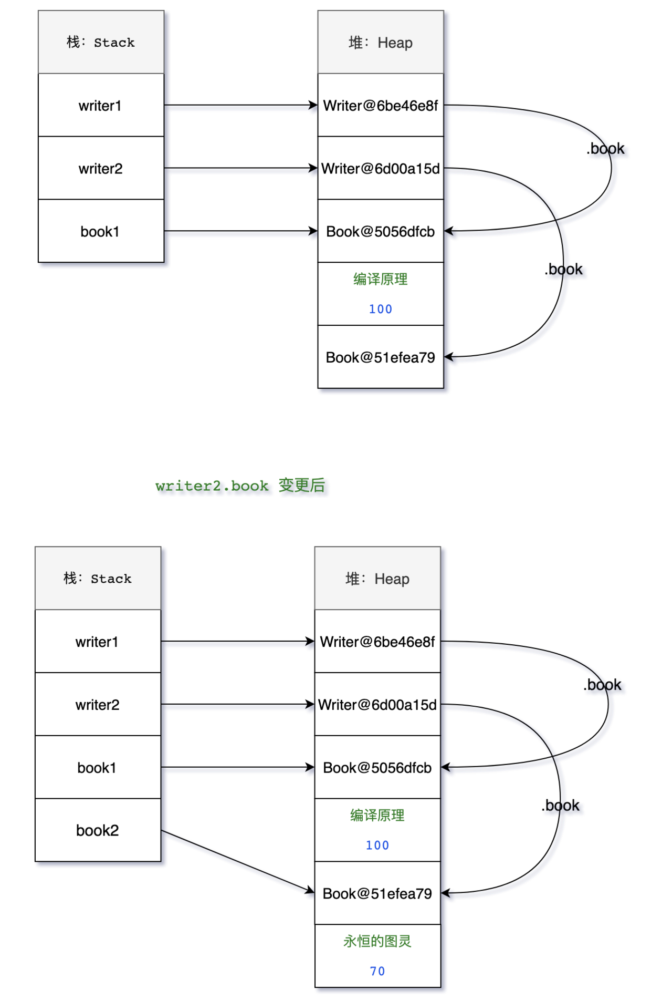

# 深拷贝

## 浅拷贝的问题

先看浅拷贝代码：

```java
class Writer implements Cloneable{
    private int age;
    private String name;
    // getter/setter 、构造方法、toString()
}
```

其中，Cloneable 接口是一个标记接口，它肚子里面是空的，标记接口的作用其实很简单，用来表示某个功能在执行的时候是合法的。

```java
public interface Cloneable {
}
```

如果一个类没有实现 Cloneable 接口，即便它重写了 `clone()` 方法，依然是无法调用该方法进行对象克隆的，程序在执行 `clone()` 方法的时候会抛出 CloneNotSupportedException 异常。

测试类代码：

```java
class TestClone {
    public static void main(String[] args) throws CloneNotSupportedException {
        Writer writer1 = new Writer(18,"二哥");
        Writer writer2 = (Writer) writer1.clone();

        System.out.println("浅拷贝后：");
        System.out.println("writer1：" + writer1);
        System.out.println("writer2：" + writer2);

        writer2.setName("三妹");

        System.out.println("调整了 writer2 的 name 后：");
        System.out.println("writer1：" + writer1);
        System.out.println("writer2：" + writer2);
    }
}
```

```
浅拷贝后：
writer1：Writer@68837a77{age=18, name='二哥'}
writer2：Writer@b97c004{age=18, name='二哥'}
调整了 writer2 的 name 后：
writer1：Writer@68837a77{age=18, name='二哥'}
writer2：Writer@b97c004{age=18, name='三妹'}
```

可以看得出，浅拷贝后，writer1 和 writer2 引用了不同的对象，但值是相同的，说明拷贝成功。之后，修改了 writer2 的 name 字段



我们再为 Writer 类增加一个自定义的引用类型字段 Book，先来看定义：

```java
class Book {
    private String bookName;
    private int price;
    // getter/setter 、构造方法、toString()
}

class Writer implements Cloneable{
    private int age;
    private String name;
    private Book book;
    // getter/setter 、构造方法、toString()
}
```

测试类：

```java
class TestClone {
    public static void main(String[] args) throws CloneNotSupportedException {
        Writer writer1 = new Writer(18,"二哥");
        Book book1 = new Book("编译原理",100);
        writer1.setBook(book1);
        Writer writer2 = (Writer) writer1.clone();
        
        System.out.println("浅拷贝后：");
        System.out.println("writer1：" + writer1);
        System.out.println("writer2：" + writer2);

        Book book2 = writer2.getBook();
        book2.setBookName("永恒的图灵");
        book2.setPrice(70);
        
        System.out.println("writer2.book 变更后：");
        System.out.println("writer1：" + writer1);
        System.out.println("writer2：" + writer2);
    }
}
```

```
浅拷贝后：
writer1：Writer@68837a77 age=18, name='二哥', book=Book@32e6e9c3 bookName='编译原理', price=100}}
writer2：Writer@6d00a15d age=18, name='二哥', book=Book@32e6e9c3 bookName='编译原理', price=100}}
writer2.book 变更后：
writer1：Writer@68837a77 age=18, name='二哥', book=Book@32e6e9c3 bookName='永恒的图灵', price=70}}
writer2：Writer@36d4b5c age=18, name='二哥', book=Book@32e6e9c3 bookName='永恒的图灵', price=70}}
```

与之前例子不同的是，writer2.book 变更后，writer1.book 也发生了改变。这是因为字符串 String 是不可变对象，一个新的值必须在字符串常量池中开辟一段新的内存空间，而自定义对象的内存地址并没有发生改变，只是对应的字段值发生了改变，见下图。



## 实现深拷贝

浅拷贝克隆的对象中，**引用类型的字段指向的是同一个**，当改变任何一个对象，另外一个对象也会随之改变，除去字符串的特殊性外（或者new一个新对象）。深拷贝和浅拷贝不同的，深拷贝中的**引用类型字段也会克隆一份**，当改变任何一个对象，另外一个对象不会随之改变。

```java
class Book implements Cloneable{
    private String bookName;
    private int price;

    // getter/setter 、构造方法、toString()

    @Override
    protected Object clone() throws CloneNotSupportedException {
        return super.clone();
    }
}
```

注意，此时的 Book 类和浅拷贝时不同，重写了 `clone()` 方法，并实现了 Cloneable 接口。为的就是深拷贝的时候也能够克隆该字段。因为Book内部都是基本的数据类型，所以不需要其他代码处理。

```java
class Writer implements Cloneable{
    private int age;
    private String name;
    private Book book;

    // getter/setter 、构造方法、toString()

    @Override
    protected Object clone() throws CloneNotSupportedException {
        Writer writer = (Writer) super.clone();
        writer.setBook((Book) writer.getBook().clone());
        return writer;
    }
}
```

这样再经过测试类测试时，就不是同一个 Book 对象了：

```
深拷贝后：
writer1：Writer@6be46e8f age=18, name='二哥', book=Book@5056dfcb bookName='编译原理', price=100}}
writer2：Writer@6d00a15d age=18, name='二哥', book=Book@51efea79 bookName='编译原理', price=100}}
writer2.book 变更后：
writer1：Writer@6be46e8f age=18, name='二哥', book=Book@5056dfcb bookName='编译原理', price=100}}
writer2：Writer@6d00a15d age=18, name='二哥', book=Book@51efea79 bookName='永恒的图灵', price=70}}
```

