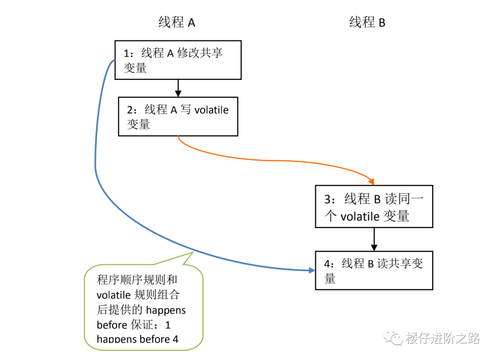
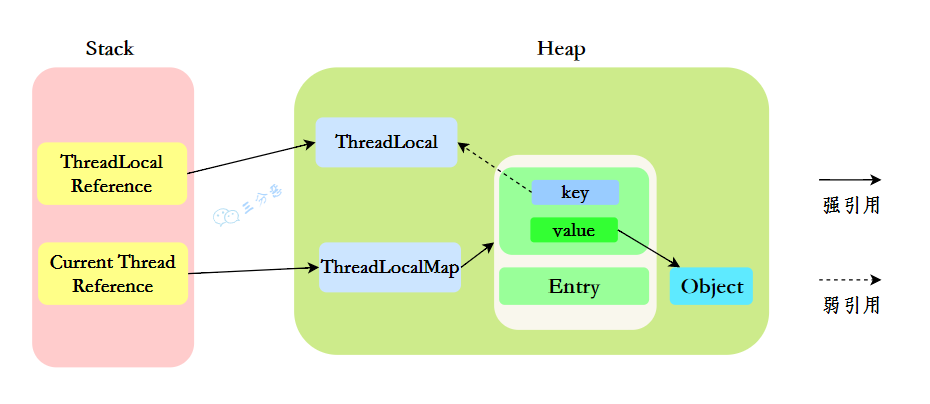

# 并发编程基础


默认的 JVM 栈大小是 1024 KB，也就是 1M。一个 8G 内存的系统，可以创建的线程大约在8000个。

------

Java 中的线程分为两类，分别为 daemon 线程（守护线程）和 user 线程（用户线程）。区别之一只要有一个用户线程还没结束，正常情况下 JVM 就不会退出，而不管当前是否存在守护线程，也就是说守护线程是否结束并不影响 JVM 退出。

启动一个 Java 程序，你能说说里面有哪些线程吗？

- 在 JVM 启动时会调用 main 方法，main 方法所在的线程就是一个用户线程。
- 在 JVM 内部同时还启动了很多守护线程， 比如垃圾回收线程。 
- 还有编译器线程，在及时编译中（JIT），负责把一部分热点代码编译后放到 codeCache 中，以提升程序的执行效率。

-------

- **原子性**：原子性指的是一个操作是不可分割、不可中断的，要么全部执行并且执行的过程不会被任何因素打断，要么就全不执行。如果要保证一个代码块的原子性，需要使用`synchronized`
- **可见性**：可见性指的是一个线程修改了某一个共享变量的值时，其它线程能够立即知道这个修改。Java 是利用`volatile`关键字来保证可见性的，除此之外，`final`和`synchronized`也能保证可见性。
- **有序性**：有序性指的是对于一个线程的执行代码，从前往后依次执行，单线程下可以认为程序是有序的，但是并发时有可能会发生指令重排。`synchronized`或者`volatile`都可以保证多线程之间操作的有序性。

------

线程安全是 Java 并发编程中一个非常重要的概念，它指的是多线程环境下，多个线程对共享资源的访问不会导致数据的不一致性。

一个常见的使用场景是在实现**单例模式**时确保线程安全。单例模式确保一个类只有一个实例，并提供一个全局访问点。在多线程环境下，如果多个线程同时尝试创建实例，单例类必须确保只创建一个实例。饿汉式是一种比较直接的实现方式，它通过在类加载时就立即初始化单例对象来保证线程安全。懒汉式单例则在第一次使用时初始化，这种方式需要使用双重检查锁定来确保线程安全，volatile 用来保证可见性，syncronized 用来保证同步。

------

Java保证原子性的一些方法

- 使用循环原子类，例如 AtomicInteger，实现 i++原子操作
- 使用 juc 包下的锁，如 ReentrantLock ，对 i++操作加锁 lock.lock()来实现原子性
- 使用 synchronized，对 i++操作加锁

------

线程同步的实现方式：

1. 互斥量（mutex）是一种最基本的同步手段，本质上是一把锁，在访问共享资源前先对互斥量进行加锁，访问完后再解锁。对互斥量加锁后，任何其他试图再次对互斥量加锁的线程都会被阻塞，直到当前线程解锁。 
2. 读写锁：读写锁有三种状态，读模式加锁、写模式加锁和不加锁；一次只有一个线程可以占有写模式的读写锁，但是可以有多个线程同时占有读模式的读写锁。非常适合读多写少的场景。 
3. 条件变量：条件变量是一种同步手段，它允许线程在满足特定条件时才继续执行，否则进入等待状态。条件变量通常与互斥量一起使用，以防止竞争条件的发生。 
4. 自旋锁：自旋锁是一种锁的实现方式，它不会让线程进入睡眠状态，而是一直循环检测锁是否被释放。自旋锁适用于锁的持有时间非常短的情况。 
5. 信号量：信号量（Semaphore）本质上是一个计数器，用于为多个进程提供共享数据对象的访问。
6. 屏障：当我们使用 volatile 关键字来修饰一个变量时，Java 内存模型会插入内存屏障（一个处理器指令，可以对 CPU 或编译器重排序做出约束）来确保可见性

## 创建线程

1. **继承** Thread 类，重写 `run()`方法，调用 `start()`方法启动线程。
2. 第二种，实现 Runnable **接口**，重写 `run()` 方法，然后创建 Thread 对象，将 Runnable 对象作为参数传递给 Thread 对象，调用 `start()` 方法启动线程。
3. 实现 Callable 接口，重写 `call()` 方法，然后创建 FutureTask 对象，参数为 Callable 对象；紧接着创建 Thread 对象，参数为 FutureTask 对象，调用 `start()` 方法启动线程。

前 2 种方式都有一个缺陷：`run()` 方法的返回值为 void，在执行完任务之后无法获取执行结果。如果需要获取执行结果，就必须通过共享变量或者线程通信的方式来达到目的，这样使用起来就比较麻烦。实现 Callable 接口获得执行结果较为方便。

```java
FutureTask<String> task=new FutureTask<>(new CallerTask());
new Thread(task).start();
System.out.println(task.get());  //等待执行完成，并获取返回结果
```

> - `run()`：在当前线程中运行，没有新的线程被创建。
> - `start()`：会启动一个新的线程，并让这个新线程调用`run()`方法。这样，`run()`方法就在新的线程中运行，从而实现多线程并发。
>
> ```java
> MyRunnable mr = new MyRunnable();
> Thread t1 = new Thread(mr, "张飞");
> t1.start();
> ```

## 线程调度


`wait()`当一个线程 A 调用一个共享变量的 `wait()` 方法时，会释放它持有的那个对象的锁，这使得其他线程可以有机会获取该对象的锁，线程 A 会被阻塞挂起，直到发生下面几种情况才会返回 ：

- 线程 B 调用了共享对象 `notify()`或者 `notifyAll()` 方法；
- 其他线程调用了线程 A 的 `interrupt()` 方法，线程 A 抛出 InterruptedException 异常返回。
- 如果使用带时间参数的wait，如果没有在指定的 timeout 时间内被其它线程唤醒，那么这个方法还是会因为超时而返回。

唤醒线程主要有下面两个方法：

- `notify()`：一个线程 A 调用共享对象的 `notify()` 方法后，会唤醒一个在这个共享变量上调用 wait 系列方法后被挂起的线程。（一个共享变量上可能会有多个线程在等待，具体唤醒哪个等待的线程是随机的。）
- `notifyAll()`：不同于在共享变量上调用 `notify()` 方法会唤醒被阻塞到该共享变量上的一个线程，notifyAll 方法会唤醒所有在该共享变量上调用 wait 系列方法而被挂起的线程。

对于 `join()` 方法，意思是如果一个线程 A 执行了 `thread.join()`，当前线程 A 会等待 thread 线程终止之后才从 `thread.join()` 返回。

```java
t1.start();  // Thread
try {
    t1.join(); //等待t1执行完才会轮到t2抢
} catch (InterruptedException e) {
    e.printStackTrace();
}
t2.start();
```

`sleep(long millis)`：Thread 类中的静态方法，当一个执行中的线程 A 调用了 Thread 的 sleep 方法后，线程 A 会暂时让出指定时间的执行权。但是线程 A 所拥有的监视器资源，比如锁，还是持有不让出的。指定的睡眠时间到了后该方法会正常返回，接着参与 CPU 的调度，获取到 CPU 资源后就可以继续运行。

`yield()`：Thread 类中的静态方法，当一个线程调用 yield 方法时，实际是在暗示线程调度器，当前线程请求让出自己的 CPU，然而，它只是向线程调度器提出建议，调度器可能会忽略这个建议。具体行为取决于操作系统和 JVM 的线程调度策略。

线程中断通过设置线程的中断标志并不能直接终止该线程的执行。例如，当线程 A 运行时，线程 B 可以调用线程 `interrupt()` 方法来设置线程的中断标志为 true 并立即返回。设置标志仅仅是设置标志, 线程 B 实际并没有被中断，会继续往下执行。

为了响应中断，线程的执行代码应该这样编写：

```java
public void run() {
    try {
        while (!Thread.currentThread().isInterrupted()) {
            // 执行任务
        }
    } catch (InterruptedException e) {
        // 线程被中断时的清理代码
    } finally {
        // 线程结束前的清理代码
    }
}
```

stop 方法用来强制线程停止执行，目前已经处于废弃状态，因为 stop 方法会导致线程立即停止，可能会在不一致的状态下释放锁，破坏对象的一致性，导致难以发现的错误和资源泄漏。

## 线程状态

在 Java 中，线程共有 6 种状态：

| 状态         | 说明                                                         |
| ------------ | ------------------------------------------------------------ |
| NEW          | 当线程被创建后，如通过`new Thread()`，它处于新建状态。此时，线程已经被分配了必要的资源，但还没有开始执行。 |
| RUNNABLE     | 当调用线程的`start()`方法后，线程进入可运行状态。在这个状态下，线程可能正在运行也可能正在等待获取 CPU 时间片，包括了操作系统线程的**ready**和**running**两个状态。 |
| BLOCKED      | 线程在试图获取一个锁以进入同步块/方法时，如果锁被其他线程持有，线程将进入阻塞状态，直到它获取到锁。 |
| WAITING      | 线程进入等待状态是因为调用了如下方法之一：`Object.wait()`或`LockSupport.park()`。在等待状态下，线程需要其他线程显式地唤醒，否则不会自动执行。 |
| TIME_WAITING | 当线程调用带有超时参数的方法时，如`Thread.sleep(long millis)`、`Object.wait(long timeout)` 或`LockSupport.parkNanos()`，它将进入超时等待状态。线程在指定的等待时间过后会自动返回可运行状态。 |
| TERMINATED   | 当线程的`run()`方法执行完毕后，或者因为一个未捕获的异常终止了执行，线程进入终止状态。一旦线程终止，它的生命周期结束，不能再被重新启动。 |

线程在自身的生命周期中，并不是固定地处于某个状态，而是在不同的状态之间进行切换（看看笔记开头的图）

## 线程调度实例

```java
// testMethod() 方法是同步方法(等待100ms)，两个线程争夺锁
Thread a = new Thread(this::testMethod, "a");
Thread b = new Thread(this::testMethod, "b");
a.start();b.start();
System.out.println(a.getName() + ":" + a.getState()); // 输出 RUNNABLE
System.out.println(b.getName() + ":" + b.getState()); // 输出 BLOCKED
```

初看之下，可能会觉得线程 a 会先调用同步方法，同步方法内又调用了`Thread.sleep()`方法，必然会输出 TIMED_WAITING，而线程 b 因为等待线程 a 释放锁所以必然会输出 BLOCKED。

其实不然，有两点需要值得大家注意：

- 一是在测试方法内还有一个 main 线程，只保证了 a，b 两个线程调用 start 方法（转化为 RUNNABLE 状态）
- 二是启动线程后执行 run 方法还是需要消耗一定时间的。

因此 a 输出 RUNNABLE，是由于还未执行 `testMethod` 中的sleep代码

如何修改一下代码，使得 a 输出 TIMED_WAITING？例如如下：

```java
a.start();Thread.sleep(50L);b.start();
```

我们再把上面的例子线程启动那里改变一下：

```java
a.start();a.join();b.start();
// a 输出TERMINATED
```

要是没有调用 join 方法，main 线程不管 a 线程是否执行完毕都会继续往下走。

a 线程启动之后马上调用了 join 方法，这里 main 线程就会等到 a 线程执行完毕，所以这里 a 线程打印的状态固定是**TERMINATED**。

至于 b 线程的状态，有可能打印 RUNNABLE（尚未进入同步方法），也有可能打印 TIMED_WAITING（进入了同步方法）

## Java 内存模型

> Java 运行时内存区域描述的是在 JVM 运行时，如何将内存划分为不同的区域，并且每个区域的功能和工作机制。例如本地方法栈等等
>
> Java 内存模型 (JMM) 主要针对的是多线程环境下，如何在主内存与工作内存之间安全地执行操作。一般来说，JMM 中的主存属于共享数据区域，包含了堆和方法区；同样，JMM 中的本地内存属于私有数据区域，包含了程序计数器、本地方法栈、虚拟机栈。

Java 内存模型（Java Memory Model，JMM）定义了 Java 程序中的变量、线程如何和主存以及工作内存进行交互的规则。它主要涉及到多线程环境下的共享变量可见性、指令重排等问题，包括：

- 线程间如何通信？即：线程之间以何种机制来交换信息
- 线程间如何同步？即：线程以何种机制来控制不同线程间发生的相对顺序

有两种并发模型可以解决这两个问题：消息传递并发模型；共享内存并发模型。Java选择后者。

### 线程通信

对于每一个线程来说，栈和程序计数器是私有的，而堆和方法区是共有的。也就是说，在栈中的变量（局部变量、方法定义的参数、异常处理的参数）不会在线程之间共享，也就不会有内存可见性的问题，也不受内存模型的影响。内存可见性针对的是堆中的共享变量。

因为现代计算机为了高效，往往会在高速缓存区中缓存共享变量，因为 CPU 访问缓存区比访问内存要快得多，这会造成**内存可见性问题**。如图，线程 A 无法直接访问线程 B 的工作内存，线程间通信必须经过主存。


不过，根据 JMM 的规定，**线程对共享变量的所有操作都必须在自己的本地内存中进行，不能直接从主存中读取**。所以线程 B 并不是直接去主存中读取共享变量的值，而是先在本地内存 B 中找到这个共享变量，发现这个共享变量已经被更新了，然后本地内存 B 去主存中读取这个共享变量的新值，并拷贝到本地内存 B 中，最后线程 B 再读取本地内存 B 中的新值。

那么怎么知道这个共享变量的被其他线程更新了呢？这就是 JMM 的功劳了，也是 JMM 存在的必要性之一。**JMM 通过控制主存与每个线程的本地内存之间的交互，来提供内存可见性保证**。

> Java 中的 volatile 关键字可以保证多线程操作共享变量的可见性以及禁止指令重排序，synchronized 关键字不仅保证可见性，同时也保证了原子性（互斥性）。

### 线程同步

从另一个角度看，Java 内存模型（JMM）对于正确同步多线程程序的内存一致性做了以下保证：**如果程序是正确同步的，程序的执行将具有顺序一致性**。即程序的执行结果和该程序在**顺序一致性模型**中执行的结果相同。

> 这里的同步包括使用 volatile、final、synchronized 等关键字实现的同步。

顺序一致性模型是一个**理想化的理论参考模型**，它为程序提供了极强的内存可见性保证。顺序一致性模型有两大特性：

- 一个线程中的所有操作必须按照程序的**顺序**（即 Java 代码的顺序）来执行。（实际上计算机在执行程序时，为了提高性能，编译器和处理器可能会对指令做重排）
- 不管程序是否同步，所有线程都只能看到一个单一的操作执行顺序。即在顺序一致性模型中，每个操作必须是**原子性的，且立刻对所有线程可见**。

假设**正确使用了同步**，A 线程的 3 个操作执行后释放锁，B 线程获取同一个锁。那么在**顺序一致性模型**中的执行效果如下所示：


假设**没有使用同步**，那么在**顺序一致性模型**中的执行效果如下所示：


JMM 只保证了上者，**没有保证下者**，因为如果要保证下者执行结果一致，那么 JMM 需要禁止大量的优化，对程序的执行性能会产生很大的影响。对于未同步的多线程，JMM 只提供**最小安全性**：线程读取到的值，要么是之前某个线程写入的值，要么是默认值，不会无中生有。

而对于上者（正确使用了同步），临界区内（同步块或同步方法中）的代码可以发生重排序（但不允许临界区内的代码“逃逸”到临界区之外，因为会破坏锁的内存语义）。虽然线程 A 在临界区做了重排序，但是因为锁的特性，线程 B 无法观察到线程 A 在临界区的重排序。这种重排序既提高了执行效率，又没有改变程序的执行结果。

### happens-before 规则

对于开发者，JMM 提供了**happens-before 规则**（JSR-133 规范），简单易懂，并且提供了足够强的内存可见性保证。 换言之，开发者只要遵循 happens-before 规则，那么我们写的程序就能保证在 JMM 中具有强的内存可见性。

happens-before 的概念来定制两个操作之间的执行顺序。如果操作 A happens-before 操作 B，那么操作 A 在内存上所做的操作对操作 B 都是可见的，不管它们在不在一个线程。

> 如果重排序之后的执行结果，与按 happens-before 关系来执行的结果一致，那么 JMM 也允许这样的重排序。

在 Java 中，有以下天然的 happens-before 关系：

- 程序顺序规则：一个线程中的每一个操作，happens-before 于该线程中的任意后续操作。
- 监视器锁规则：对一个锁的解锁，happens-before 于随后对这个锁的加锁。
- volatile 变量规则：对一个 volatile 域的写，happens-before 于任意后续对这个 volatile 域的读。
- 传递性：如果 A happens-before B，且 B happens-before C，那么 A happens-before C。
- start 规则：如果线程 A 执行操作 `ThreadB.start()`启动线程 B，那么 A 线程的 `ThreadB.start()`操作 happens-before 于线程 B 中的任意操作。
- join 规则：如果线程 A 执行操作 `ThreadB.join()`并成功返回，那么线程 B 中的任意操作 happens-before 于线程 A 从 `ThreadB.join()`操作成功返回。

## volatile关键字

volatile 可以保证可见性，**但不保证原子性**。用来修饰成员变量，告知程序任何对该变量的访问均需要从共享内存中获取，而对它的改变必须同步刷新回共享内存，保证所有线程对变量访问的可见性。

当我们使用 volatile 关键字来修饰一个变量时，Java 内存模型会插入内存屏障（一个处理器指令，可以对 CPU 或编译器重排序做出约束）来确保以下两点：

- 写屏障（Write Barrier）：当一个 volatile 变量被写入时，写屏障确保在该屏障之前的所有变量的写入操作都提交到主内存。 
- 读屏障（Read Barrier）：当读取一个 volatile 变量时，读屏障确保在该屏障之后的所有读操作都从主内存中读取。

换句话说，当程序执行到 volatile 变量的读操作或者写操作时，禁止指令重排，在其前面操作的更改肯定已经全部进行，且结果对后面的操作可见；在其后面的操作肯定还没有进行。

直观理解，volatile帮我们手动加上了happens-before链条：

```java
int a = 0;
boolean volatile flag = false;
void writer() {
    a = 1;flag = true;
}
void reader() {
    if (flag) int i =  a * a;
}
```

如果不再 flag 上加上volatile，writer和reader可能会做指令重排，volatile强制先做writer，在做reader



## synchronized关键字

可以修饰方法，或者以同步代码块的形式来使用，确保多个线程在同一个时刻，只能有一个线程在执行某个方法或某个代码块。

主要有以下 3 种应用方式： 

```java
public synchronized void instanceLock() {
    // 等价同步代码块 synchronized(this)
}

public static synchronized void classLock() {
    // 等价同步代码块 synchronized(xxx.class)
}

public void blockLock() {
    Object o = new Object();
    synchronized (o) {  
        // code
    }
}
```

- 同步方法，为当前对象（this）加锁，可以保证在任意时刻，只有一个线程能执行方法。注意，每个对象都有一个对象锁，不同的对象，他们的锁不会互相影响。
- 同步静态方法，为当前类加锁（锁的是 Class 对象），进入同步代码前要获得当前类的锁； 
- 同步代码块，某些情况下，我们编写的方法代码量比较多，存在一些比较耗时的操作，而需要同步的代码块只有一小部分，如果直接对整个方法进行同步，可能会得不偿失，此时我们可以使用同步代码块的方式对需要同步的代码进行包裹。对指定对象或者类加锁。

需要注意的是如果线程 A 调用了一个对象的非静态 synchronized 方法，线程 B 需要调用这个对象所属类的静态 synchronized 方法，是不会发生互斥的，因为访问静态 synchronized 方法占用的锁是当前类的 Class 对象，而访问非静态 synchronized 方法占用的锁是当前对象（this）的锁

synchronized 是可重入锁，一个线程调用 synchronized 方法的同时，在其方法体内部调用该对象另一个 synchronized 方法是允许的

## 四种锁状态

**无锁**就是没有对资源进行锁定，任何线程都可以尝试去修改它。其他三种状态：

| 锁       | 优点                                                         | 缺点                                             | 适用场景                             |
| -------- | ------------------------------------------------------------ | ------------------------------------------------ | ------------------------------------ |
| 偏向锁   | 加锁和解锁不需要额外的消耗，和执行非同步方法比仅存在纳秒级的差距。 | 如果线程间存在锁竞争，会带来额外的锁撤销的消耗。 | 适用于只有一个线程访问同步块场景。   |
| 轻量级锁 | 竞争的线程不会阻塞，提高了程序的响应速度。                   | 如果始终得不到锁竞争的线程使用自旋会消耗 CPU。   | 追求响应时间。同步块执行速度非常快。 |
| 重量级锁 | 线程竞争不使用自旋，不会消耗 CPU。                           | 线程阻塞，响应时间缓慢。                         | 追求吞吐量。同步块执行时间较长。     |

在具体实现上，保存在Java对象头的Mark Word中：

| 锁状态   | 29 bit 或 61 bit                       | 1 bit 是否是偏向锁？       | 2 bit 锁标志位 |
| -------- | -------------------------------------- | -------------------------- | -------------- |
| 无锁     |                                        | 0                          | 01             |
| 偏向锁   | 线程 ID                                | 1                          | 01             |
| 轻量级锁 | 指向栈中锁记录的指针                   | 此时这一位不用于标识偏向锁 | 00             |
| 重量级锁 | 指向堆中的 monitor（监视器）对象的指针 | 此时这一位不用于标识偏向锁 | 10             |
| GC 标记  |                                        | 此时这一位不用于标识偏向锁 | 11             |

### 偏向锁

Hotspot 的作者经过以往的研究发现大多数情况下**锁并不存在多线程竞争，而且总是由同一线程多次获得**，于是引入了偏向锁。偏向锁会偏向于第一个访问锁的线程，如果在接下来的运行过程中，该锁没有被其他的线程访问，则持有偏向锁的线程将永远不需要触发同步，无需再走各种加锁/解锁流程。

在具体实现上，一个线程在第一次进入同步块时，会在对象头和栈帧中的锁记录里存储锁偏向的线程 ID。当下次该线程进入这个同步块时，会去检查锁的 Mark Word 里面是不是放的自己的线程 ID。

如果是，表明该线程已经获得了锁，以后该线程在进入和退出同步块时不需要花费 CAS 操作来加锁和解锁；如果不是，就代表有另一个线程来竞争这个偏向锁。这个时候会尝试使用 CAS（Compare and Swap） 来替换 Mark Word 里面的线程 ID 为新线程的 ID，这个时候要分两种情况：

- 成功，表示之前的线程不存在了， Mark Word 里面的线程 ID 为新线程的 ID，锁不会升级，仍然为**偏向锁**；
- 失败，表示之前的线程仍然存在，那么暂停之前的线程，设置偏向锁标识为 0，并设置锁标志位为 00，升级为轻量级锁，会按照**轻量级锁**的方式进行竞争锁。

### 轻量级锁

多个线程在**不同时段**获取**同一把锁**，即**不存在锁竞争**的情况，也就没有线程阻塞。针对这种情况，JVM 采用轻量级锁来避免线程的阻塞与唤醒。

在许多场景中，同步资源的锁定时间很短，为了这一小段时间去切换线程，线程挂起和恢复线程花费的时间可能会让系统得不偿失（这是重量级锁的处理方案）。我们不这么做，但是如何让当前线程“稍等一下”？

方法是让当前线程进行自旋，如果在自旋完成后前面锁定同步资源的线程已经释放了锁，那么当前线程就可以不用阻塞而是直接获取同步资源，从而避免切换线程的开销。这就是自旋锁。

> 自旋：不断尝试去获取锁，一般用循环来实现。

具体来说，JVM 会为每个线程在当前线程的栈帧中创建用于存储锁记录的空间，我们称为 Displaced Mark Word。如果一个线程获得锁的时候发现是轻量级锁，会把锁的 Mark Word 复制到自己的 Displaced Mark Word 里面。

然后线程尝试用 CAS 将锁的 Mark Word 替换为指向锁记录的指针。如果成功，当前线程获得锁，如果失败，表示 Mark Word 已经被替换成了其他线程的锁记录，说明在与其它线程竞争锁，当前线程就尝试使用自旋来获取锁。

自旋是需要消耗 CPU 的，如果一直获取不到锁的话，那该线程就一直处在自旋状态，白白浪费 CPU 资源。解决这个问题最简单的办法就是指定自旋的次数，例如让其循环 10 次，如果还没获取到锁就进入阻塞状态。

但是 JDK 采用了更聪明的方式——适应性自旋，简单来说就是线程如果自旋成功了，则下次自旋的次数会更多，如果自旋失败了，则自旋的次数就会减少。

自旋也不是一直进行下去的，如果自旋到一定程度（和 JVM、操作系统相关），依然没有获取到锁，称为自旋失败，那么这个线程会阻塞。同时这个锁就会**升级成重量级锁**。

### 重量级锁

重量级锁依赖于操作系统的互斥锁（mutex，用于保证任何给定时间内，只有一个线程可以执行某一段特定的代码段） 实现，如果线程尝试获取锁失败，它会直接进入阻塞状态，等待操作系统的调度，而操作系统中线程间状态的转换需要相对较长的时间，所以重量级锁效率很低，但被阻塞的线程不会消耗 CPU。

### 锁的升级流程

1. 每一个线程在准备获取共享资源时： 第一步，检查 MarkWord 里面是不是放的自己的 ThreadId ,如果是，表示当前线程是处于 “偏向锁” 。
2. 如果 MarkWord 不是自己的 ThreadId，锁升级，这时候，用 CAS 来执行切换，新的线程根据 MarkWord 里面现有的 ThreadId，通知之前线程暂停，之前线程将 Markword 的内容置为空。
3. 两个线程都把锁对象的 HashCode 复制到自己新建的用于存储锁的记录空间，接着开始通过 CAS 操作， 把锁对象的 MarKword 的内容修改为自己新建的记录空间的地址的方式竞争 MarkWord。
4. 第三步中成功执行 CAS 的获得资源，失败的则进入自旋 。
5. 自旋的线程在自旋过程中，成功获得资源(即之前获的资源的线程执行完成并释放了共享资源)，则整个状态依然处于 轻量级锁的状态，如果自旋失败 。
6. 进入重量级锁的状态，这个时候，自旋的线程进行阻塞，等待之前线程执行完成并唤醒自己。

### CAS（Compare and Swap）

CAS（Compare-and-Swap）是一种乐观锁的实现方式，全称为“比较并交换”，是一种无锁的原子操作。判断 要改变的值 是否等于 旧值，如果等于，将值设置为 新值；如果不等，说明已经有其它线程更新了值，于是当前线程放弃更新，什么都不做。当多个线程同时使用 CAS 操作一个变量时，只有一个会胜出，并成功更新，其余均会失败，但失败的线程并不会被挂起，仅是被告知失败，并且允许再次尝试，当然也允许失败的线程放弃操作。

- 对于悲观锁来说，它总是认为每次访问共享资源时会发生冲突，所以必须对每次数据操作加上锁，以保证临界区的程序同一时间只能有一个线程在执行
- 乐观锁总是假设对共享资源的访问没有冲突，线程可以不停地执行，无需加锁也无需等待。一旦多个线程发生冲突，乐观锁通常使用一种称为 CAS 的技术来保证线程执行的安全性。

CAS的问题：

- CAS 多与自旋结合。如果自旋 CAS 长时间不成功，会占用大量的 CPU 资源。因此要重量级锁
- 一个值原来是 A，变成了 B，又变回了 A。这个时候使用 CAS 是检查不出变化的，但实际上却被更新了两次。
- CAS 保证的是对一个变量执行操作的原子性，如果对多个变量操作时，CAS 目前无法直接保证操作的原子性的。

## ThreadLocal

通常，我们会使用 synchronzed 关键字 或者 lock 来控制线程对临界区资源的同步顺序，但这种加锁的方式会让未获取到锁的线程进行阻塞，很显然，这种方式的时间效率不会特别高。

**线程安全问题的核心在于多个线程会对同一个临界区的共享资源进行访问**，那如果每个线程都拥有自己的“共享资源”，各用各的，互不影响，这样就不会出现线程安全的问题了，对吧？

ThreadLocal 就是线程的“本地变量”，即每个线程都拥有该变量的一个副本，达到人手一份的目的，这样就可以避免共享资源的竞争

ThreadLocal 的实现原理就是，每个线程维护一个 Map，key 为 ThreadLocal 对象，value 为想要实现线程隔离的对象。

1. 当需要存线程隔离的对象时，通过 ThreadLocal 的 set 方法将对象存入 Map 中。
2. 当需要取线程隔离的对象时，通过 ThreadLocal 的 get 方法从 Map 中取出对象。

> 这个 ThreadLocalMap 与 HashMap 的不同点：
>
> - ThreadLocalMap 用的是哈希取余法，取出 key 的 threadLocalHashCode，然后和 table 数组长度减一&运算（相当于取余）
> - ThreadLocalMap 使用开放定址法解决哈希冲突

ThreadLocal 的使用场景非常多，比如说：

- 在 Web 应用中，可以使用 ThreadLocal 存储用户会话信息，这样每个线程在处理用户请求时都能方便地访问当前用户的会话信息，这样在同一个线程中的任何地方都可以获取到登录信息。
- 在数据库操作中，可以使用 ThreadLocal 存储数据库连接对象，每个线程有自己独立的数据库连接，从而避免了多线程竞争同一数据库连接的问题。
- 用于保存事务上下文，这样在同一个线程中的任何地方都可以获取到事务上下文。
- 用于保存线程中的变量，这样在同一个线程中的任何地方都可以获取到线程中的变量。

### 强弱引用

ThreadLocalMap 是 ThreadLocal 的静态内部类，它内部维护了一个 Entry 数组，Entry 继承了 WeakReference，它限定了 key 是一个弱引用，弱引用的好处是当内存不足时，JVM 会回收 ThreadLocal 对象，并且将其对应的 Entry 的 value 设置为 null，这样在很大程度上可以避免内存泄漏。

强引用，比如说 `User user = new User("沉默王二")` 中，user 就是一个强引用，`new User("沉默王二")` 就是一个强引用对象。

当 user 被置为 null 时（`user = null`），`new User("沉默王二")` 将会被垃圾回收；如果 user 不被置为 null，即便是内存空间不足，JVM 也不会回收 `new User("沉默王二")` 这个强引用对象，宁愿抛出 OutOfMemoryError。

弱引用，比如说下面这段代码：

```java
ThreadLocal<User> userThreadLocal = new ThreadLocal<>();
userThreadLocal.set(new User("沉默王二"));
```

- userThreadLocal 是一个强引用，`new ThreadLocal<>()` 是一个强引用对象；
- `new User("沉默王二")` 是一个强引用对象。
- 在 ThreadLocalMap 中，`key = new ThreadLocal<>()` 是一个弱引用对象。当 JVM 进行垃圾回收时，如果发现了弱引用对象，就会将其回收。



弱引用 key 的好处是，当内存不足的时候，JVM 会主动回收掉弱引用的对象。一旦 key 被回收，ThreadLocalMap 在进行 set、get 的时候就会对 key 为 null 的 Entry 进行清理。

不过，如果运用不得当，会导致内存泄漏问题。通常情况下，随着线程 Thread 的结束，其内部的 ThreadLocalMap 也会被回收，从而避免了内存泄漏。但如果一个线程一直在运行，并且其 `ThreadLocalMap` 中的 Entry.value 一直指向某个强引用对象，那么这个对象就不会被回收，从而导致内存泄漏。当 Entry 非常多时，可能就会引发更严重的内存溢出问题。

那怎么解决内存泄漏问题呢？很简单，使用完 ThreadLocal 后，及时调用 `remove()` 方法释放内存空间。`remove()` 方法会将当前线程的 ThreadLocalMap 中的所有 key 为 null 的 Entry 全部清除，这样就能避免内存泄漏问题。

## 锁分类

来看看`synchronized`的不足之处吧。

- 如果临界区是只读操作，其实可以多线程一起执行，但使用 synchronized 的话，**同一时间只能有一个线程执行**。
- synchronized 无法知道线程有没有成功获取到锁。
- 使用 synchronized，如果临界区因为 IO 或者 sleep 方法等原因阻塞了，而当前线程又没有释放锁，就会导致**所有线程等待**。

synchronized 的这些不足之处都可以通过 JUC 包下的其他锁来弥补，下面先来看一下锁的分类吧。

**公平锁与非公平锁**：这里的“公平”，其实通俗意义来说就是“先来后到”，也就是 FIFO。如果对一个锁来说，先对锁获取请求的线程一定会先被满足，后对锁获取请求的线程后被满足，那这个锁就是公平的。反之，在非公平锁模式下，锁可能会授予刚刚请求它的线程，而不考虑等待时间。 

一般情况下，非公平锁能提升一定的效率。但是非公平锁可能会发生线程饥饿（有一些线程长时间得不到锁）的情况。所以要根据实际的需求来选择非公平锁和公平锁。

**读写锁和排它锁**：我们前面讲到的 synchronized 和后面要讲的 ReentrantLock，其实都是“排它锁”。也就是说，这些锁在同一时刻只允许一个线程进行访问。 

而读写锁可以在同一时刻允许多个读线程访问。Java 提供了 ReentrantReadWriteLock（后面会细讲，戳链接直达）类作为读写锁的默认实现，内部维护了两个锁：一个读锁，一个写锁。通过分离读锁和写锁，使得在“读多写少”的环境下，大大地提高了性能。 

> 注意，获得共享锁的线程只能读数据，不能修改数据。在写线程访问时，所有的读线程和其它写线程均被阻塞。 

JUC 包下的锁和工具：

- locks 包下共有三个接口：`Condition`、`Lock`、`ReadWriteLock`。Lock 接口提供了比 synchronized 关键字更灵活的锁操作，而 ReadWriteLock 里面只有两个方法，分别返回“读锁”和“写锁“
- ReentrantLock 是可重入的独占锁，只能有一个线程可以获取该锁，其它获取该锁的线程会被阻塞。 可重入表示当前线程获取该锁后再次获取不会被阻塞，也就意味着同一个线程可以多次获得同一个锁而不会发生死锁。支持非公平锁和公平锁。
- ReentrantReadWriteLock 是 ReadWriteLock 接口的默认实现。它与 ReentrantLock 的功能类似，同样是可重入的，支持非公平锁和公平锁。不同的是，它还支持”读写锁“。
- Semaphore 是一个计数信号量，它的作用是限制可以访问某些资源（物理或逻辑的）的线程数目。Semaphore 的构造方法可以指定信号量的数目，也可以指定是否是公平的。
- CountDownLatch 是一个同步工具类，它允许一个或多个线程一直等待，直到其他线程的操作执行完后再执行。实现方式是其他线程在完成各自任务后调用 countDown 方法，将计数器的值减一。当计数器的值减到零时，所有在 await 上等待的线程会被唤醒，继续执行。
- CyclicBarrier 是一个同步工具类，让一 组线程到达一个屏障（也可以叫同步点）时被阻塞，直到最后一个线程到达屏障时，屏障才会开门，所有被屏障拦截的线程才会继续运行。
- Exchanger 是一个用于线程间协作的工具类。Exchanger 用于进行线程间的数据交换。它提供一个同步点，在这个同步点，两个线程可以交换彼此的数据。
- Phaser 是一个同步工具类，它可以让多个线程在某个时刻一起完成任务。Phaser 可以理解为一个线程的计数器，它可以将这个计数器加一或减一。当这个计数器的值为 0 的时候，所有调用`await()`方法而在等待的线程就会继续执行。

## AQS

**AQS**是`AbstractQueuedSynchronizer`的简称，即`抽象队列同步器`，是一个用来构建锁和同步器的框架，使用 AQS 能简单且高效地构造出应用广泛的同步器，比如我们提到的 ReentrantLock，Semaphore，ReentrantReadWriteLock，SynchronousQueue，FutureTask 等等皆是基于 AQS 的。

- 抽象：抽象类，只实现一些主要逻辑，有些方法由子类实现；
- 队列：使用先进先出（FIFO）的队列存储数据；
- 同步：实现了同步的功能。

AQS 的思想是，如果被请求的共享资源空闲，则当前线程能够成功获取资源；否则，它将进入一个等待队列，当有其他线程释放资源时，系统会挑选等待队列中的一个线程，赋予其资源。

AQS 内部使用了一个先进先出（FIFO）的双端队列，并使用了两个引用 head 和 tail 用于标识队列的头部和尾部。其数据结构如下图所示：


但它并不直接储存线程，而是储存拥有线程的 Node 节点。资源有两种共享模式，或者说两种同步方式，AQS 中关于这两种资源共享模式的定义源码均在内部类 Node 中：

- 独占模式（Exclusive）：资源是独占的，一次只能有一个线程获取。如 ReentrantLock（后面会细讲，戳链接直达）。 
- 共享模式（Share）：同时可以被多个线程获取，具体的资源个数可以通过参数指定。如 Semaphore/CountDownLatch（戳链接直达，后面会细讲）。 

一般情况下，子类只需要根据需求实现其中一种模式就可以，当然也有同时实现两种模式的同步类，如 ReadWriteLock。

## 线程池

线程池其实是一种池化的技术实现，池化技术的核心思想就是实现资源的复用，避免资源的重复创建和销毁带来的性能开销。线程池可以管理一堆线程，让线程执行完任务之后不进行销毁，而是继续去处理其它线程已经提交的任务。

使用线程池的好处

- 降低资源消耗。通过重复利用已创建的线程降低线程创建和销毁造成的消耗。
- 提高响应速度。当任务到达时，任务可以不需要等到线程创建就能立即执行。
- 提高线程的可管理性。线程是稀缺资源，如果无限制的创建，不仅会消耗系统资源，还会降低系统的稳定性，使用线程池可以进行统一的分配，调优和监控

Java 主要是通过构建 ThreadPoolExecutor 来创建线程池，刚创建出来的线程池中只有一个构造时传入的阻塞队列，里面并没有线程。

当有线程通过 execute 方法提交了一个任务，首先会去判断当前线程池的线程数是否小于核心线程数，也就是线程池构造时传入的参数 corePoolSize。如果小于，那么就直接通过 ThreadFactory 创建一个线程来执行这个任务，当任务执行完之后，线程不会退出，而是会去阻塞队列中获取任务

> 这里有个细节，就是提交任务的时候，就算有线程池里的线程从阻塞队列中获取不到任务，如果线程池里的线程数还是小于核心线程数，那么依然会继续创建线程，而不是复用已有的线程
>
> runWorker 内部使用了 while 死循环，当第一个任务执行完之后，会不断地通过 getTask 方法获取任务，只要能获取到任务，就会调用 run 方法继续执行任务，这就是线程能够复用的主要原因。

如果线程池里的线程数不再小于核心线程数呢？那么此时就会尝试将任务放入阻塞队列中。

但是，随着任务越来越多，队列已经满了，任务放入失败，怎么办呢？此时会判断当前线程池里的线程数是否小于最大线程数，也就是入参时的 maximumPoolSize 参数如果小于最大线程数，那么也会创建非核心线程来执行提交的任务

假如线程数已经达到最大线程数量，怎么办呢？此时就会执行拒绝策略：

- AbortPolicy：这是默认的拒绝策略。抛出异常，“我们系统瘫痪了”。
- CallerRunsPolicy：该策略不会抛出异常，而是会让提交任务的线程（即调用 execute 方法的线程）自己来执行这个任务。也就对应着“谁叫你来办的你找谁去”。
- DiscardOldestPolicy：策略会丢弃队列中最老的一个任务（即队列中等待最久的任务），然后尝试重新提交被拒绝的任务。也就对应着“看你比较急，去队里加个塞”。
- DiscardPolicy：策略会默默地丢弃被拒绝的任务，不做任何处理也不抛出异常。也就对应着“今天没办法，不行你看改一天”。


线程池状态转换：


关于应用场景，线程数的设置主要取决于业务是 IO 密集型还是 CPU 密集型。

- CPU 密集型：指的是任务主要使用来进行大量的计算，没有什么导致线程阻塞。一般这种场景的线程数设置为 CPU 核心数+1。例如：并行计算任务、
- IO 密集型：当执行任务需要大量的 io，比如磁盘 io，网络 io，可能会存在大量的阻塞，所以在 IO 密集型任务中使用多线程可以大大地加速任务的处理。一般线程数设置为 2*CPU 核心数。例如：Web服务器（通常需要处理I/O操作，比如网络I/O）、异步任务（涉及到I/O操作，比如数据库查询或文件读写）
