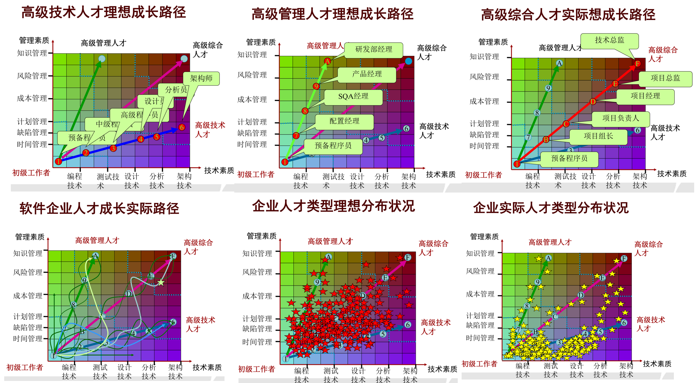
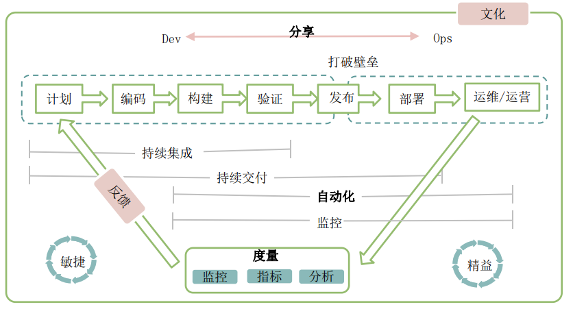

# 系统分析与设计概述

系统是一组为实现某些结果相互联系、相互作用的部件的集合体。

- 整体性。系统是一个整体，它不是各个部分的简单相加，系统的整体功能是各部分在孤立状态下所没有的。一般来说，系统的整体功能大于组成系统的各部分的功能之和。
- 目的性。任何系统都具有某种目的，都要实现一定的功能，这也是区别不同系统的标志。
- 相关性。系统内各部分之间存在着相互依赖和相互制约的特定关系，某一个部分的变化会影响其他部分实现功能。
- 环境适应性。任何系统都存在于一定的环境中，必然要与外界进行物质、能量和信息的交换，外界环境的变化会相应地引起系统功能和内部组成的变化。系统具有适应环境的变化，保持原有功能的特性。
- 层次性。系统无论大小，都可以分解为一系列的子系统，并存在一定的层次结构。系统各个层次具有独自的功能，他们通过相互联系、相互作用共同完成系统的功能。

系统分析（System Analysis）是对一种业务问题域的学习活动，能够在系统解决方案中为提升系统性能和明确业务需求提供良好的建议。（理解问题域） 

系统设计（System Design）是对系统分析中已确定的业务需求的说明或者构建一种相关技术的解决方案。（求可行解）

系统分析与设计的过程本质是一种认知活动，把设想中的结构落在一个抽象问题域上，对从各种用户那里得到的不同信息进行加工；作出一个逻辑的、一致的规格说明，以产生一个成功的系统。

## 系统开发生命周期

1. 系统规划 主要负责在真正分析系统前组织好现有资源
2. 系统分析 主要对⽤户需求进⾏真正的深⼊分析，主要成果是可行性研究报告/系统分析报告。
3. 系统设计 根据系统分析的结果进⾏系统模块与架构的设计，主要成果是系统设计说明书/系统说明书。
4. 系统实施 根据系统设计的架构使⽤相应软件开发模式真正开始开发系统
5. 系统运⾏维护 对于已经开发完成的系统进⾏维护

## 系统分析步骤

- 明确问题， 设立目标：明确要研究问题的性质和范围，提出所要达到的目标，明确约束条件。
- 收集资料， 制定方案：收集相关资料，制定解决问题的各种备选方案，预计可能产生的各种结果。
- 分析计算， 评价比较：对资料和数据做必要的计算，进行各子系统的分析，再进行系统的整体分析，将各种方案进行评价对比，选择最佳方案。
- 检验核实， 作出决策：如果对制定的方案不满意，还可按上述程序反复进行，直到获的满意为止。

## 企业人才成长

## 软件特性

现代软件系统中无法规避的内在特性：复杂性、一致性、可变性和不可见性。其中复杂性和可变性是根本问题

- 复杂性。规模上，软件实体可能比任何由人类创造的其他实体更复杂。软件拥有大量的状态（gcc运行的瞬间有千万个状态值），这使得构思、描述和测试非常困难。复杂性导致技术实现上的困难，从而又引发管理上的问题，它使得全面理解问题变得困难，引起大量的学习和理解上的负担，使开发慢慢演变成灾难。
- 可变性。软件是纯粹思维活动的产物，可以无限扩展，并且，软件的修改更容易。客户对系统功能的要求随时可能变化，而软件修改更容易，因此往往软件被更改。 软件的设计和实现随着技术、开发语言、方法、人的经验习惯等随时可能变化。
- 一致性。不同人有不同的经验和惯例，而软件工程师必 须掌握由不同人设计的系统，其中很多系统复 杂度是随心所欲、毫无规则可言的。 新开发的软件，必须遵循各种接口，软件开发 的目标就是兼容性，很多复杂性来自保持与其 他接口的一致性，这是非常困难的。
- 不可见性。软件是不可见的，无法可视化，难以给人全面、直观的感受，不同于建筑业、机械业等。 当前的软件表达方式（数据流图、流程控制图等）和建模方法，都无法详尽展现软件，无法让不同的人理解一致，这严重阻碍了交流，从而限制了设计和实现过程。

## 软件开发方式变化

1. 传统软件开发。把软件开发类比为传统工业， 规范后可重复“生产”
   - 计划、预测 预定义过程
   - 和分阶段控制 
   - 一次性交付，变更成本大 
   - 严格过程监控 
   - 过程决定质量
2. 现代软件开发。认为软件开发是复杂的有机生态系统，不可重复
   - 探索、适应、演进
   - 在变化中基于经验的过程
   - 小批量快速交付，拥抱变化
   - 严格交付验收
   - 高效的人和协作是核心
3. 云计算时代。
   - 云软件由卖license到卖service (hosting)方式； 
   - 软件的部署，由过去分散小规模，转为集中大规模； 
   - 客户更期望更快、更新、更好的特性和服务； 
   - 云服务商业竞争的法宝是“快”和体验，按周发布特性；
   - 软件架构模式的转变，由过去Silo、分层模型，转为SOA服务化、网状模型、微服务; 
   - 由单租户、集中式，转为多租户、服务化、分布式，系统用户由百、千到现在上亿用户；因为要大规模、因为要快速创新，要求软件的子系统之间、服务与服务之间进一步解耦；
   - 软件子系统不再关注功能的全面/完备，而转为关注精、专业、以及接口的标准化，即一个子系统/服务只做一件事，这样所有系统组成一个大平台的时候，就类似乐高积木；
   - 全功能团队 / FullStack工程师；小团队自己规划、自己决策、自己交付；
   - 每个“人”都是围绕业务目标，进行自我激发的；而不是依靠流程来驱动的；
   - 云服务的核新竞争力“快”和“体验”，这只能依靠小团队、个人的自我激发才能实现。而过去大团队、强调组织/规划/流程，忽视个人，恰恰是障碍；

## DevOps研发模式

Dev和Ops存在“混乱之墙”

- 不同的世界观：运维人员要求稳定可靠，认为变更充满风险，开发人员则被鼓励频繁发布新代码，认为运维部门对流程的坚持，阻碍了开发的速度。
- 它在我的机器上没有问题！常常听说开发人员这么说，而运维团队的确遇到了麻烦-->开发和运维之间的脚本、配置、过程和环境存在差别。
- 沟通壁垒：开发和运维团队通常处于公司组织的不同部门，通常有不同管理者，通常是不信任的关系，并且通常工作在不同的地点。

DevOps是一套实践方法，在保证高质量的前提下缩短系统变更从提交到部署至生产环境的时间。DevOps是敏捷理念从开发领域向运维领域的延伸。

- 部署对系统的变更时，质量很重要：保证方法有上生产环境前跑通自动化测试用例、先让一小部分用户对生产环境的变更进行测试、对新部署的代码密切监控。
- 交付机制是高质量的：交付机制应具备高度的可靠性和可重复性。
- 两个时间很重要：一是开发人员提交新开发的代码的时间；另一个是代码部署到生产环境的时间。 
- 目标导向：不拘泥于实践的形式或者是否使用工具，目标是减少从提交代码到部署到生产环境之间的时间。 
- 不局限于用户测试和部署实践：在需求阶段就包含运维人员的视角，是非常重要的。

