# 需求分析与原型设计

产品经理的工作：

1. 明确产品目标人群和特征 
2. 获取、评估和管理用户需求 
3. 完成产品原型、流程图和需求文档 
4. 重视用户体验，运用交互设计和信息架构技能 
5. 需求变更管理和需求验收 
6. 产品运营数据的分析和总结 
7. 提供运营、市场和销售等支持

需求：需即需要，求即欲求，指个体客观或主观上的一种诉求。一般源于用户理想上与现实中的差距所致，欲望得不到满足，便产生了需求。另外一种表述：在什么场景下，用户通过什么产品，做什么事情。

需求来源：用户调研，竞品分析，数据分析，BOSS，头脑风暴，同事建议，技术需求，运营需求，商业需求。

## 用户调研

**用户访谈**的流程：

1. 准备：确定访谈对象，设计访谈提纲 
2. 打破僵局：与访谈者建立信任关系，在轻松的氛围下交谈 
3. 介绍：引出访谈主题，将谈话焦点转移至产品 
4. 深度关注：收集有价值的信息，观察用户的表情，分析用户的回答是否带有偏差 
5. 回顾：回顾讨论的内容，以更广阔的视角考虑问题，提炼用户的反馈，避免被用户的“解决方案”误导
6. 结束：访谈提纲中的问题都确认好后，可以结束访谈

用户访谈注意事项：问题长度在20字以内。一次只讨论一个问题，问题明确后，再继续其他的。问题表述清楚，不要问模糊性问题。基于用户的具体经验提问。使用用户熟悉的词汇和短语。不要强迫用户给出不真实的想法。不要提问具有引导性和诱导性问题。关注用户遇到的问题及处理方式，不要让用户给出解决方案。换位思考。

**可用性测试** ：通过观察真实用户使用产品的过程，发现已有产品或竞品在设计上的问题，帮助优化产品。产品Demo、已上线版本或竞品都可用作可用性研究。测试用户是否代表了主流用户（用户）。用户遇到的问题是否严重，严重到什么程度（问题）。用户遇到问题的操作（行为）。了解用户的感受（原因）

**调查问卷** ：使用产品的用户特征比例与人数规模（用户）。用户遇到问题的比例、重要性、与频率（问题）。用户行为选项的比例及满意度（行为）。用户原因选项的比例（原因）

**数据分析** ：调取用户日志文件，分析用户特征（用户）。通过用户数据发现用户问题（问题）。用户数据直接反馈用户行为（行为）。用户数据判断原因（原因）

**深度访谈**：聆听，让用户自己讲述。问题先开放，再聚焦。探索，跟踪获得更多信息。避免诱导性问题

> Open-ended Question 开放式发问：什么、什么时候、哪儿、为什么、谁、怎样
>
> Close-ended Question 封闭式发问：是不是、有没有、会不会、能不能、可不可以、好不好

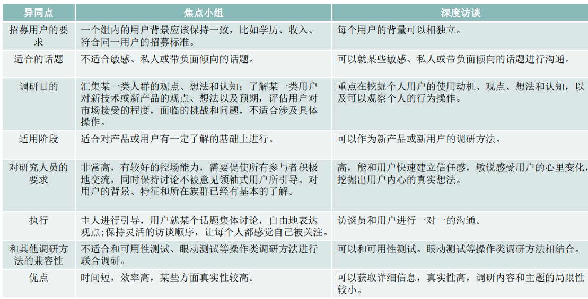

解决比较紧急的调研需求，需要快速反馈问题的时候，可用**焦点小组**。每次大概能收集到8-12名用户的反馈。注意事项为：

- 不适合主题：敏感或与个人关系密切的话题、以获取用户行为、个人观点等偏个人化倍息为目的的调研
- 主持人注意：不能只有一种顺序或总让某些人优先发言、让用户分布均匀，不出现“审查式"坐位、交叉安排座位，避免讨论中出现小团体、核心、资深用户，多加留意，适当多给表达机会，也需整体保持平衡
- 用户的禁忌：个人表达太活跃/太不活跃、表达能力较差/思维过于发散

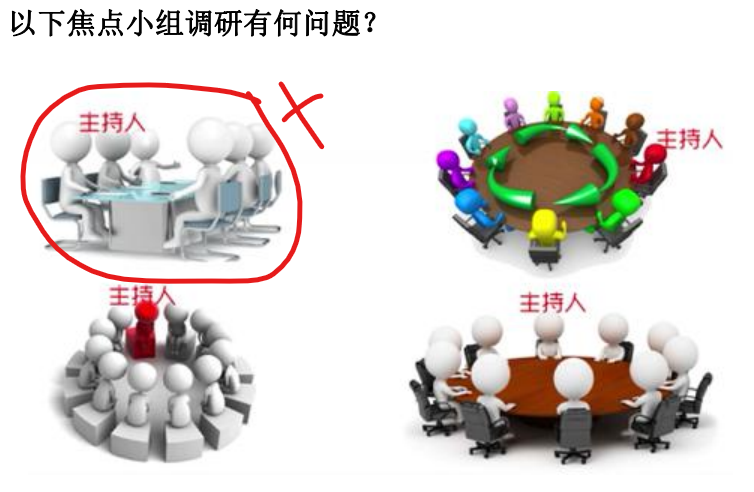

## 用户画像

用户画像（Persona)：针对目标群体真实特征进行的勾勒，是深刻理解真实数据的基础上得出的一个虚拟用户。

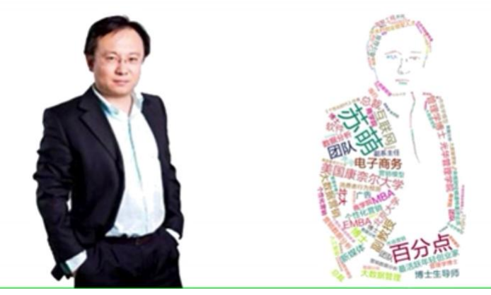

案例1，QQ健康用户画像和问卷

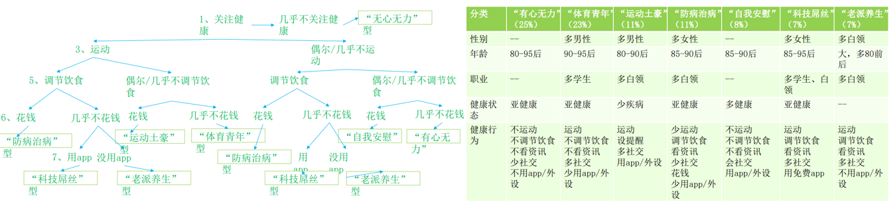

例如，以在线购买电影票的APP为例，做用户画像可以为

1. 暖暖，19岁女学生，某某偶像的铁粉，一定要看某电影首映典礼；
2. 兴仔，21岁学生，情人节将至，提前预定某爱情片座位，和女友过节；
3. 大华，26岁白领，工作太忙，预定的电影票无法按时观看，不能退只好浪费；
4. 木叔，48岁大树，平时也没有看电影的爱好，不是目标用户；
5. 二妞，56岁阿姨，退休阿姨，不常使用手机，不是目标用户；
6. 阿美，24岁白领，看电影先看折扣，选择附近折扣最低的电影观看；
7. 小乔，32岁教师，定期观影者，只看影评评分高的电影；
8. 三胖，38岁金领，新上好莱坞3D大片，寻求视听观影效果最佳影院观看；

## 市场分析/SWOT

**SWOT分析**：将对企业/产品内外部条件各方面内容进行综合和概况，进而分析组织的优劣势、面临的机会威胁的一种方法（较为宏观和主观）。将公司的战略与公司内部资源、外部环境有机的结合起来。

> S （strengths）是优势、W （weaknesses）是劣势、O （opportunities）是机会、T （threats）是威胁。按照企业竞争战略的完整概念，战略应是一个企业“能够做的”（即组织的强项和弱项）和“可能做的”（即环境的机会和威胁）之间的有机组合

利用SWOT分析成果，做出“组合矩阵”  ，填在对应的表格。对应外部的机会与威胁，平衡内部的优势和劣势

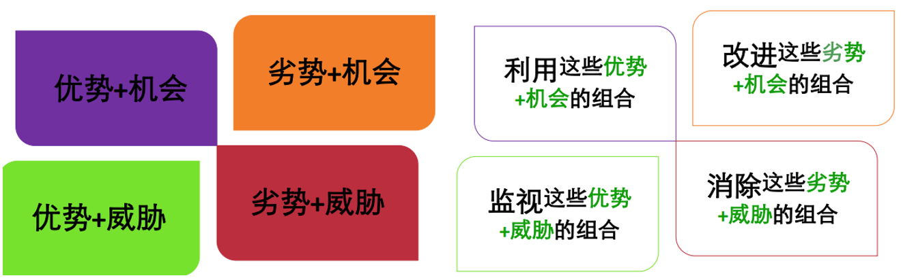

## 竞品分析

直接竞争：包括了市场目标方向一  致、客户群体针对性极 强、产品功能和用户需 求相似度极高的产品。例  如新浪微博与腾讯微博 、几大门户网站。    

间接竞争：在功能需求方面互补的 产品，用户高度重合，目前不构成直接的利益竞争，但可成为潜在的竞争关系，例如QQ秀和QQ游戏秀。

行业领先者/异业竞争者：没有直接的用户重合，暂不存在利益竞争，但在技术、产品概念、盈利模式上具备行业前瞻性的一些产品团队，或许会杀将出来。

常用网站：

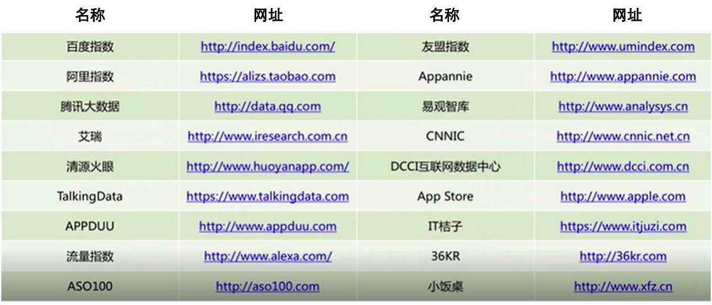

## KANO模型

KANO模型，是需求实现与用户满意度之间的关系模型图，把需求按照需求满足和满意度两个维度把需求划分为**基本型需求、期望型需求和兴奋型需求**三大类。同时用户的需求类型是随着时间变化的，也许期望型需求变成了基本型需求，兴奋型需求变成了期望型需求，需要重新挖掘用户的兴奋型需求。

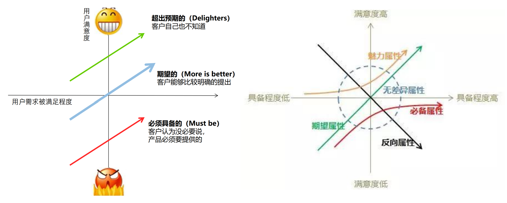

## 需求分析

拆解与归纳：

- 用户：谁提的需求，最终用户是谁，是不是目标用户，占全部用户的比例，用户属性咋样
- 场景：什么场景、是否高频、是否契合目前提供的场景
- 用户存在的问题：多听、多看用户操作
- 用户现在的解决方法：流程、产品、输入内容、产出物
- 任务：用户需要做什么（多方案比较）、我们需要做什么（开发难度、资源、成本）
- 目标：用户的目标、我们的目标

去伪：**用户提出的需求不一定是用户真实的需求**，用户没有很强的产品意识，很多都是模棱两可的感觉。用户是贪婪的，他们往往会提很多自私的需求。**甄别真假需求**： 多角色交叉验。 多问几个“为什么”。 考虑问题发生的场景和频次。 挖掘深层次需求。

定优先级：

- MVP：最小可行性产品 围绕产品定位，根据产品价值，定义需求边界，把握核心需求，快速试错
- 专家评估法： 组织资深产品专家一起评估产品需求，用群体智慧力量来决策产品需求
- 通过紧急度和商业价值这两个维度在 1 – 5 的范围内取一个值，然后把这两个数相乘以确定一个需求的最终权重。
- 需求优先级矩阵：把每个需求放入矩阵中，根据实际情况「修订」矩阵。

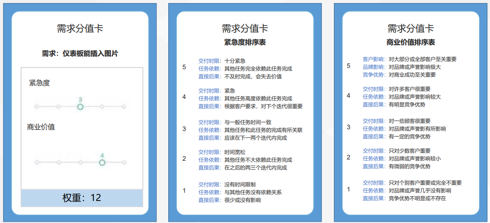

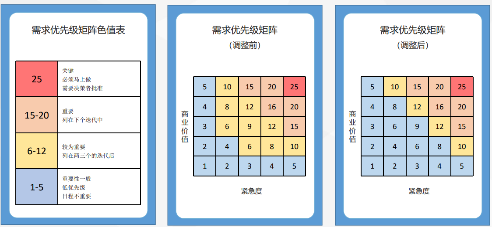

## 需求管理

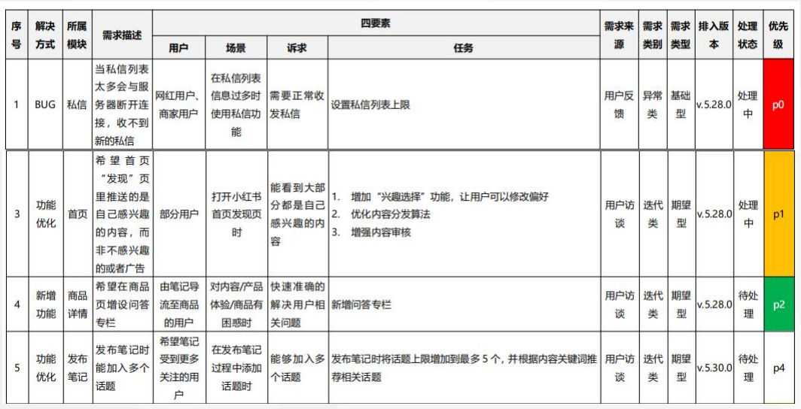

## 产品设计

交互设计就是要把产品目标具体化，变为可视可执行的方案。侧重用户使用流程的体验，做到让用户对产品可用、易用、想用。流程包括：

1. 任务分析：对照功能列表（Feature List），对用户的操作进行分析梳理。任务分析常用的方法是任务列表法：把主任务细分成子任务，子任务细分成各个步骤，形成列表。
2. 页面流程设计：决定整个界面的信息架构和操作逻辑。一个主要任务就可以是一个页面，其他子任务也可以转化为页面。注意：流程图包含所有将要设计的新页面，不多不少；确定页面内容，页面数量，也确定各页面之间的关系。
3. 页面布局：对页面进行分区，对内容进行组织，赋予零碎内容以逻辑性。 注意： 把类似的操作放在一起，减少用户盲目寻找带来的困惑。 分区之间有一定的间隔。 重要核心的分区应该在显要的位置。 适当营造页面的呼吸感（适当留白）。
4. 原型设计：具体页面的设计，把所有的界面元素表现出来，原型设计图分低保真原型图（线框）和高保真原型图（线框+交互+UI）。
5. 页面说明：对页面上所有元素进行详细的描述，包括默认状态、跳转页面、自号字体、尺寸、文案等，便于开发和测试人员理解。注意：极端状态、异常情况等需要标注和体现在设计中。

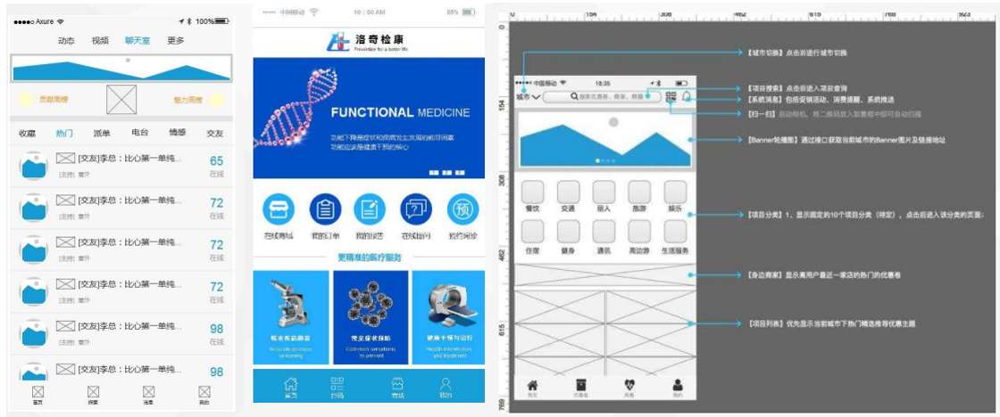

设计法则：

- 菲茨定律。定义：从一个起点位置移动到最终目标所需要的的时间由两个参数决定，到达目标的距离和目标的大小。**目标越大，指向越快，时间越短；目标越近，指向越快，时间越短**。启示：按钮等可点击对象需要合理的大小尺寸，将用户最可能点击最想点击的按钮尽量放大。
- 席克定律。定义：一个人面临的选择越多，所需要做出决定的时间就越长。即**当选项增多时，我们做决定的时间就会相应增加**。 启示：产品结构简单明了，把与做决定有关的选项减少到最少，以减少所需的反应时间。也可以对选项进行同类分组和多层分布，这样用户使用的效率会更高，时间越短。
- 7±2法则。定义：人类头脑短时记忆最好的状态能记忆7±2个信息块，**在记忆了5-9项信息后再记忆更多，人类的头脑开始出错**。 启示：导航或选项卡尽量不要超过9个；如果导航或选项卡内容很多，可以用一个层级结构来展示，并注意其深广度的平衡；把大整段的信息分割成各个小段，并显著标记每个信息段和子段，以便清晰确认各自的内容。
- 格式塔法则。定义：**当对象离得太近的时候，意识会认为他们是相关的**。 启示：接近原则可以应用于页面内容组织，以及分组设计。设计者经常使用分组框或分割线将屏幕上的控件和数据分隔开。使用接近原则，注意页面的间距要适当。
- 泰思勒定律。定义：**每一个过程都有其固有的复杂性，存在一个临界点，越过了这个点就不能再简化了**。启示：慎重考虑页面中不可缺少的必要元素；将固有的复杂性从一个地方移动到另外一个地方。
- 防错原则。定义：该原则最初用于工业管理，认为**大部分的意外都是设计的疏忽，而不是人为操作疏忽，通过改变设计可以把过失降到最低**。 启示：如果使用条件没有满足，常常通过该功能失效来表示，以避免误按（按钮变为灰色无法点击）。另外就是给出明显的提示。
- 奥卡姆剃刀原理。定义：又被称为“简单有效原理”，**如无必要，勿增实体**。 启示：①只放置必要信息，更多信息可以用“查看更多”的链接来实现。②减少点击次数。③“外婆”规则④减少段落的个数。⑤给予更少的选项。

尼尔森十大原则 

1. 状态可感知。在合理时间提供适当反馈；随时让用户知道此时的状态和进度
2.  贴近用户认知。使用用户熟悉的语言和概念；符合用户日常生活习惯
3. 操作可控。提供结束非理想态的“紧急出口”，支持撤销和重做 
4. 一致性。风格统一；用词统一；情景和任务执行统一
5. 防错。置灰的按钮等
6. 识别好过记忆。降低用户记忆量，呈现提示信息
7. 灵活高效。照顾不同级别的用户；允许用户个性化设置
8. 极简主义。少即是多 
9. 容错。帮助用户识别、判断错误；可从错误中恢复
10. 人性化帮助。帮助文档、客服

