# 项目管理

信息系统项目管理是指在指定时间内用最少的费用开发可接受的系统的管理过程，具体内容包括确定范围、计划、人员安排、组织、指导和控制。

## 项目组织

- 单纯型项目组织：小组成员全职投入项目。
- 职能型项目组织：项目建立在职能部门中。
- 矩阵型项目组织：项目组成员由不同职能部门提供，项目经理决定工作内容和时间，部门经理决定人员和技术。

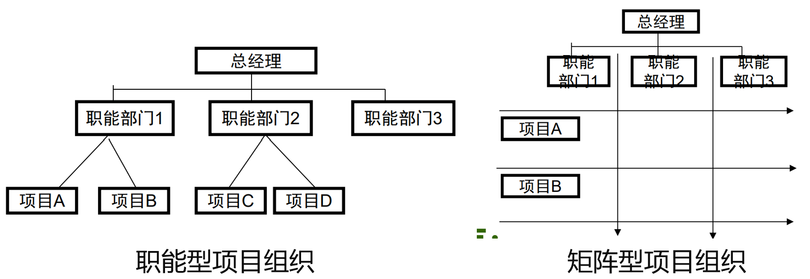

## WBS

工作分解结构（Work Breakdown Structure, WBS）是根据项目特点，选择合适的方式将项目总体工作范围逐步分解为合适的粒度。分解成开发阶段、开发活动和开发任务。最后交付的是工作包（任何包完成时间不能超过80个小时）

WBS的分解方式进行：按照功能模块分解；按照系统开发过程的不同阶段分解；按照项目地域或部门分解；按照项目目标或职能分解；

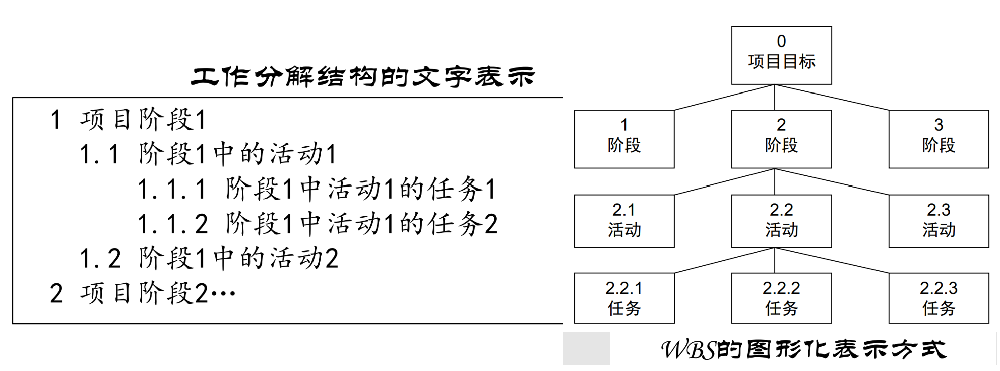

WBS最低层次的项目交付成果称为工作包，工作包的定义应考虑80小时法则或者两周法则，即任何工作包的完成时间应该不超过80小时，即不超过两周。这样，每两周对所有工作包进行一次检查，可以控制项目的变化。

## 项目启动

1. 发现问题
2. 定义问题
3. 选择项目
4. 确定可行性：技术、经济、操作

案例：某假日酒店餐厅正碰到处理客户的大量日常电话问题，以及与外部合作伙伴(诸如供应商和会议设施)的协调问题。兼职员工数量的增长导致调度冲突和酒席服务人员不够等问题。

列出需求：

| 议题                                             | 权重 |
| ------------------------------------------------ | ---- |
| 客户联络人用过量的时间来处理日常问题。           | 10   |
| 管理兼职雇员很耗时，并导致调度问题。             | 9    |
| 难以适应最后时刻对酒席做出的改变。               | 7    |
| 食品是为每座酒席订购的，通常一天要接收几次送货。 | 6    |
| 就酒席设施变化进行沟通通常出现问题。             | 5    |
| 几乎没有关于客户和酒席的历史消息。               | 3    |

解决方法：

- 提供一个Web系统供客户获得价格信息和下单。
- 创建或购买一个具有调度组件的人力资源系统。
- 在客户签署酒席合同之后,为他们提供对其账户的Web访问,并为他们提供一种更新客人数量的方法。把客人数量变化情况通知经理。
- 提供一种确定在同一时间内发生的酒席的总食品供应量的方法。
- 提供一种把变化情况通知给酒席设施提供方的关键人员的机制。
- 存储所有酒席资料,并制定各种格式的总结信息。

约束条件：

- 系统必须是安全的。
- 系统必须易于供非技术人员使用。  
- 开发成本必须小于50000美元。  
- 初始的客户订单网站必须于3月1日准备好,以满足毕业晚会和婚宴的申请

## 项目进度管理

项目进度管理又称为时间管理、工期管理，是指为保证项目各项工作及项目总任务按时完成所需要的一系列的工作与过程，具体包括项目进度计划编制及实施进度控制。 

时间、费用、质量构成了项目管理的三大目标。其中，费用发生在项目的各项作业中，质量取决于每个作业过程，工期则依赖于进度系列上的时间保证，这些目标均能通过进度控制加以掌握，所以进度控制是项目控制工作的首要内容，是项目的灵魂。

### 甘特图

在项目管理实践中，很多项目管理工具软件都具有根据工作分解结构（Work Breakdown Structure, WBS）来制作对应甘特图的相关功能。甘特图直观地表明： 任务计划在什么时候进行以及实际进展与计划要求的对比。

- 横轴表示时间 
- 纵轴表示要安排的活动 
- 线条表示在整个期间上计划的和实际的活动完成情况

例子：

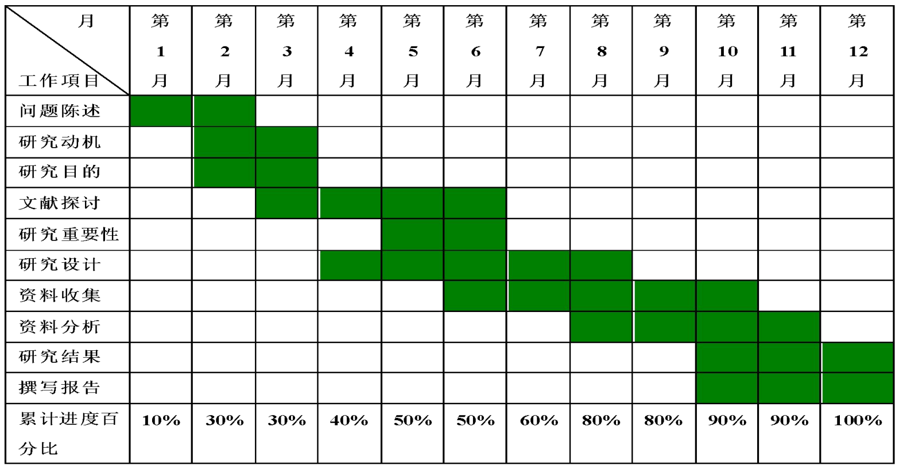

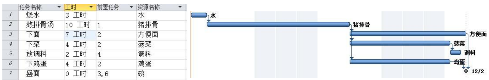

以及配套的任务分配表：

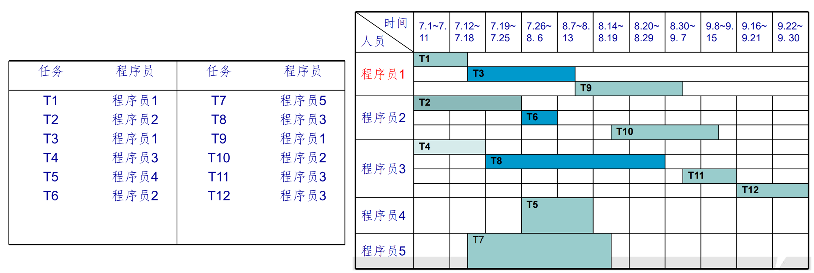

### 网络图

也叫PERT（项目评审技术，Plan Evaluation and Review Technique）图，网络图的结构：

- 作业（或工序、活动）：指任何消耗时间或资源的活动。
- 事件（或事项）：标志作业的开始或结束，本身不消耗时间或资源，或相对作业讲，消耗量可以小得忽略不计。某个事件的实现，标志着在它前面各顶作业（紧前作业）的结束，又标志着在它之后的各项作业（紧后作业）的开始。每个节点有唯一节点号；
- 权数：作业的完成时间，如作业(i, j)的完成时间为10h
- 虚作业：表示工时为零，不消耗任何资源的虚构作业。其作用只是为了正确表示作业的前行后续关系。

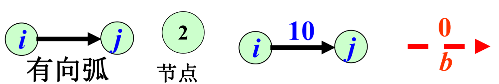

案例1：某人于早晨7:00起床，按其生活习惯，在其出门工作前，必须完成下列活动: 5分钟时间穿衣服，洗脸4分钟, 10分钟烧开一壶开水, 5分钟取牛奶, 5分钟热牛奶, 5分钟吃饭，试问此人最早何时可以出门上班？假定只有一个炉灶。

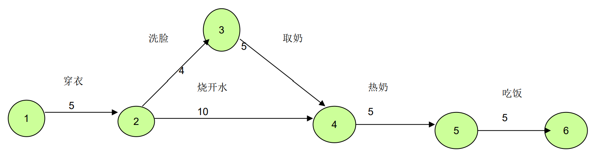

案例2：建筑一幢房屋，施工顺序如表所示，要求计算工程周期及关键路线

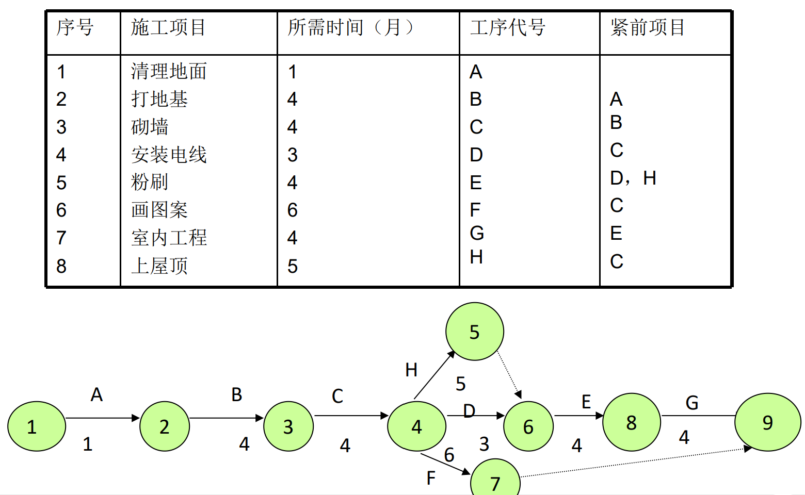

在绘制网络图时，还要注意以下规则：

- 网络图只能有一个总起点，一个总终点事项
- 网络图是有向图，不允许有回路
- 节点 i, j 之间不允许有两个或两个以上的作业
- 必须正确表示作业之间的前行、后继关系
- 通过运用虚作业的方法，可用将部分不符合规则的网络图改画为正确的形式。
- 尽量避免箭杆的交叉。

关键路径：最早开始时间找前驱大的，最晚开始时间找后驱小的，两个时间相等的为关键路径。

### 检查点

在规定的时间间隔内对项目进行检查，比较实际与计划之间的差异，并根据差异进行调整。

可将检查点看作是一个 固定 “ 采样”时点，而时间间隔根据项目周期长短不同而不同，频度过小会失去意义，频度过大会增加管理成本。

常见的间隔是每周一次，项目经理需要召开例会并上交周报。

### 里程碑

里程碑图用来显示项目进展中的重大工作完成。里程碑不同于活动，活动是需要消耗资源的，并且是需要时间来完成，里程碑仅仅表示事件的标记，不消耗资源和时间。

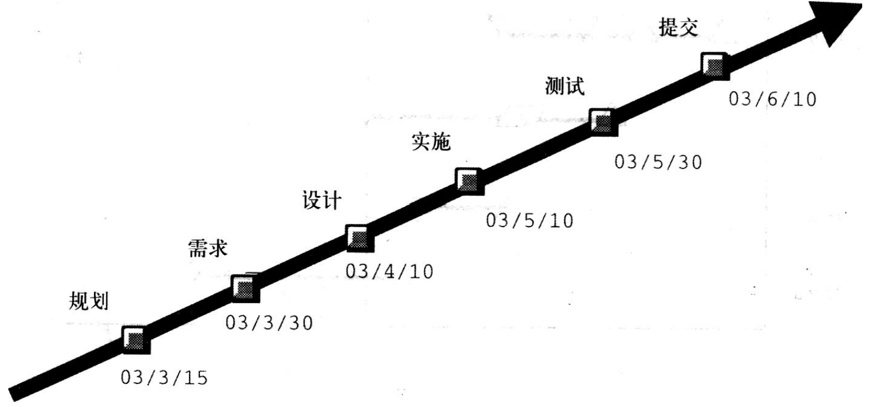

### 基线

指一个（或一组）配置项在项目生命周期的不同时间点上  通过正式评审而进入正式受控的一种状态。  

基线其实是一些重要的里程碑，但相关交付物要通过正式  评审并作为后续工作的基准和出发点。基线一旦建立后变 化需要受控制。  

重要的检查点是里程碑，重要的需要客户确认的里程碑，就是基线。在我们实际的项目中，周例会是检查点的表现形式，高层的阶段汇报会是基线的表现形式

## 敏捷项目管理

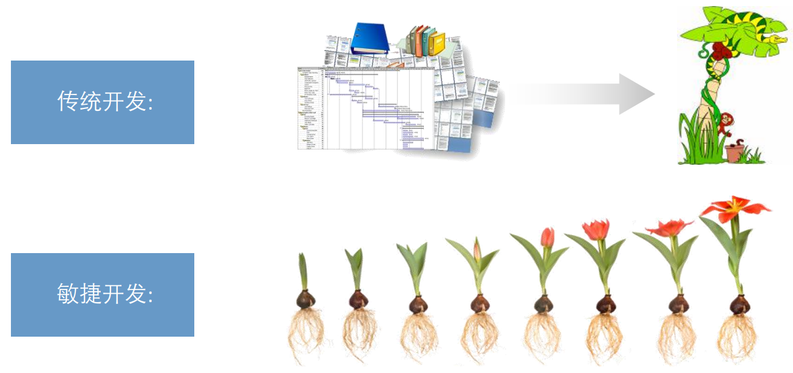

敏捷宣言：

- **个体和互动 高于 流程和工具**
- **工作的软件 高于 详尽的文档**
- **客户合作 高于 合同谈判**
- **相应变化 高于 遵循计划**

管理实践：

- **迭代计划会议** 每轮迭代启动前，团队共同讨论本轮 迭代详细开发计划，输⼊产品 backlog 输出团队迭代 backlog 充分讨论，团队成员对任务和完成标准 理解⼀致；团队共同参与，团队成员更 认真对待承诺。 
- **每⽇站⽴会议** 每⽇⼯作前，团队成员站⽴开会， Scrum master组织 增加团队凝聚⼒，产⽣积极⼯作氛围； 及时暴露⻛险和问题；促进团队内成员 沟通协调。 
- **可视化管理** 将项⽬状态通过物理实体展示，让团 队所有成员直观获取当前项⽬进展信 息 ⼀⽬了然，降低管理成本；实时状态显 示，及时暴露问题；信息同源，团队理 解⼀致；激励先进，鞭策后进。 
- **迭代验收会议** 每次迭代开发结束时，通过演示可⼯ 作的软件检查需求是否满⾜客户要求 通过可⼯作的软件来确定项⽬进度；能尽早 得到客户的反馈。 
- **迭代回顾会议**  每轮迭代结束后，分享好的经验和改 进点，使团队不断进步 激励团队成员，挖掘继承优秀经验，避 免犯同样错误，营造团队⾃主改进氛 围。

### 技术债务

常见技术债务: 日趋不稳定的架构、圈复杂度高的代码、低的测试自动化率、不及时清除的静态检查告警等。  

为什么会有技术债务：  为满足短期商业目标，不影响其外部表现的情况下，会在技术方面进行一定的让步，这种让步虽对当前版本的质量影响甚微，但会严重影响后续版本响应客户需求的能力，从而形成技术债务。  

对待技术债务的态度：  技术债务是有成本的，如不及时偿还，会随时间积累利息变高，导致开发效率大幅下降，从而降低客户响应能力。因此对待技术债务的态度是加以管理并及时偿还（如及时重构）。

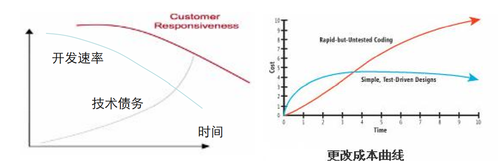

### 团队

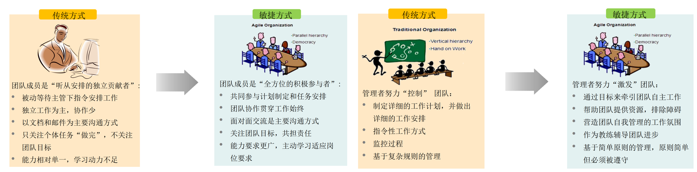

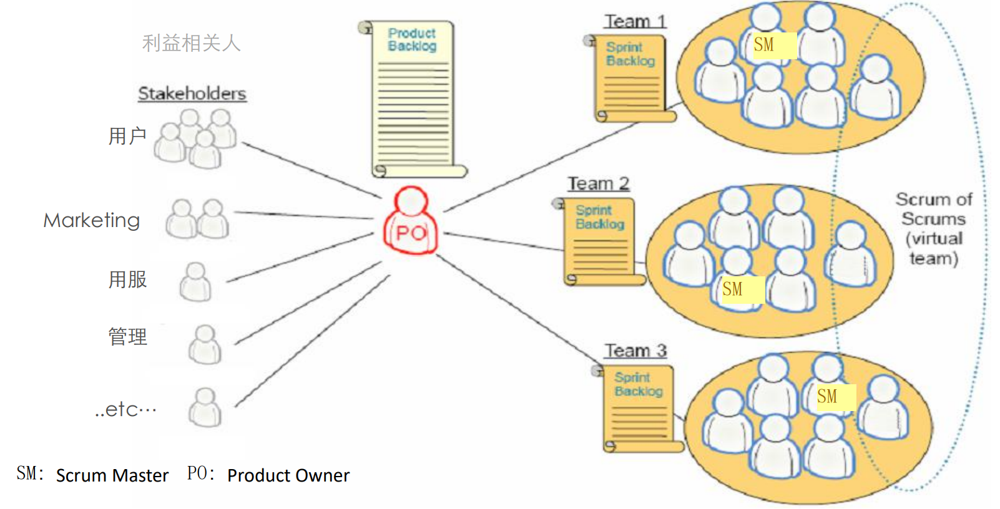

- Product Owner（产品负责人）：确保Team做正确的事
- Scrum Master  （Scrum教练）：确保Team正确地做事
- Team（开发团队）：一般由5-9名跨功能领域人员组成，坐在一起工作，实现产品功能

### 调整迭代计划

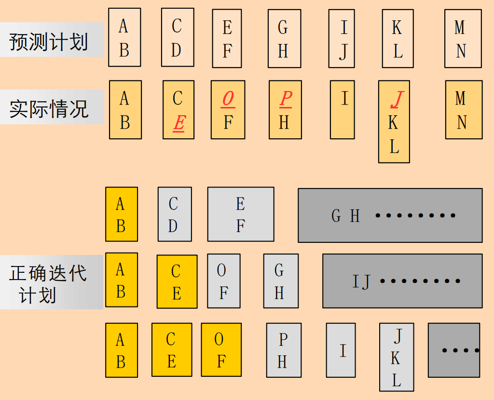

项目范围常发生变化

- 需求出现了增加、删除、优先级调整（如图E、O、P、J）  
- 工作量在需求细化后发现离原始工作量估计有偏差，引发计划调整；（如图中I）
- 客户使用了产品后，发现有些需求已不再需要（如图中D、G）

正确做计划方法：在每一轮迭代开始，只详细确定本次迭代的工作内容，并严格执行，对后续较远的迭代内容只做粗略的计划，避免浪费。

### Backlog

产品Backlog：经过优先级排序的动态刷新的产品需求清单，  用来制定发布计划和迭代计划。

产品Backlog关键要点：

- 清楚表述列表中每个需求任务对用户带来的价值，做为优先级排序的重要参考。
- 动态的需求管理而非“冻结”方式，PO持续地管理和及时刷新需求清单，在每轮迭代前，都要重新筛选出高优先级需求进入本轮迭代。
- 迭代的需求分析过程，而非一次性分析清楚所有需求（只对近期迭代要做的需求进行详细分析，其它需求停留在粗粒度）。

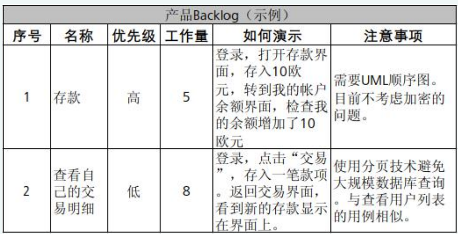

迭代Backlog是团队在一轮迭代中的“任务”（Task）清单，  是团队的详细迭代开发计划。 当团队接收从产品Backlog挑选出要在本轮迭代实现的需求时，  召开团队迭代计划会议，将需求转化为具体的“任务”。  每项任务信息包括当前剩余工作量和责任人。

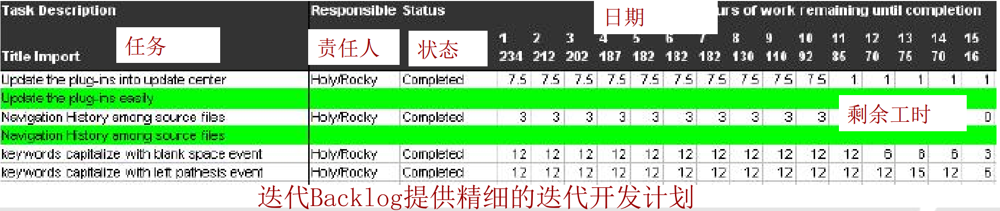

### 每日站立会议

每日工作前，团队成员的例行沟通机制，由Scrum  Master组织，Team成员全体站立参加。 聚焦在下面的三个主题：  我昨天为本项目做了什么？  我计划今天为本项目做什么？  我需要什么帮助以更高效的工作/我遇到了什么问题？

每日站立会议的关键要点

- 准时开始：按计划会议制定的时间地点开会，形成团队成员的自然习惯。
- 高效会议：会议限时15分钟，每个人都保持站立，依次发言，不讨论与会议三个主题无关的事情（如技术解决方案等）。
- 问题跟踪：Scrum Master应该记录下所有的问题并跟踪解决。

### 可视化管理

将项目状态 (进度、质量等)通过物理实体（如白板，大屏幕  ）实时展示，让团队所有成员直观地获取当前项目进展信息。

可视化管理的关键要点：

- 物理实体：可视化一定要做到物理上的实体化，大家在公开场所都容易看到，触摸到，（存在电脑中的文件不是可视化的）。
- 内容精简，易懂：信息展示一目了然，切实对团队有帮助，切忌贪多求全，难以分辨。  
- 实时刷新：延迟的信息拖延问题暴露，降低运作效率。

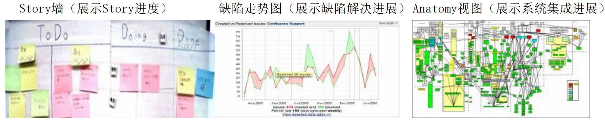

### 用户故事

用户故事是站在用户角度描述需求的一种方式。每个用户故事须有对应的验收测试用例。  用户故事是分层分级的，在使用过程中逐步分解细化。  

典型的描述句式为：作为一个<角色>, 我想要<功能>, 以便于<商业价值>

> 举例：作为一个“网站管理员”，我想要“统计每天有多少人访问了我的网站”，以便于“我的赞助商了解我的网站会给他们带来什么收益。”

初始需求：
1.作为网络规划人员，我想要配置一个媒体网关，因为想要增加网络容量和服务。

初次分解：
1.1作为网络规划人员，我想把媒体网关参数上传到管理系统。  
1.2作为网络规划人员，我想从管理系统下载媒体网关参数。  

再次分解：
1.2.1作为网络规划人员，我想用文件方式从管理系统下载媒体网关参数。用例：用户在管理系统上选择以文件方式下载媒体网关参数，执行成功后，检查文件是否正确下载到本地且内容正确。  
1.2.2作为网络规划人员，我想用MML结构方式从管理系统下载媒体网关的参数。
.......

用户故事地图：

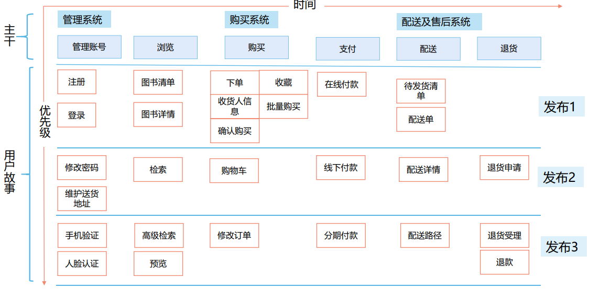

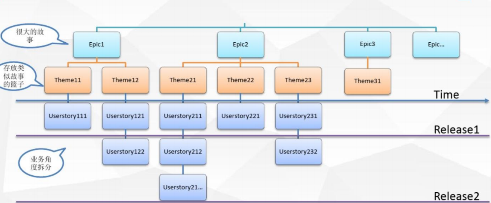

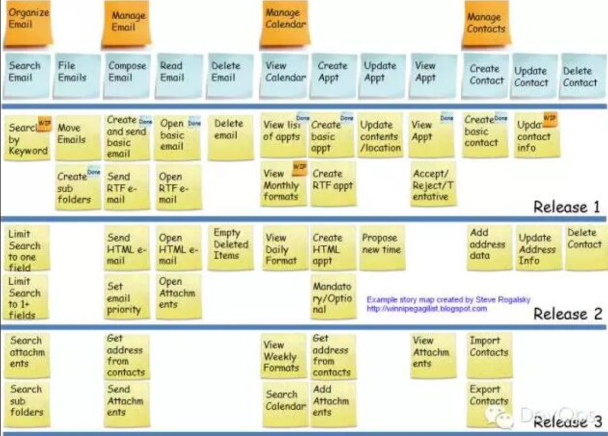

### 其他实践

测试驱动开发（TDD）以测试作为编程的中心，它要求在编写  任何代码之前，首先编写定义代码功能的  测试用例，编写的代码要通过用例，并不断进行重构优化。  

持续集成（CI）是一项软件开发实践，其中团队的成员经常集成他们的  工作，通常每人每天至少集成一次，每次集成通过自动化构建完成。

## 精益项目管理

敏捷与精益的区别：

- 基本观点与哲学上不同
  - 敏捷：尽快交付可用的产品，并与客户密切协作、及时获得客户反馈
  - 精益：开发最小的可用产品，并基于看板梳理价值流，消除价值流中的浪费
- 角度不同
  - 敏捷的关注重点稍窄些，主要关心的是围绕软件开发的具体开发实践和项目管理，一般不太关心在其中进行软件开发的商业上下文环境
  - 精益采用比较宽泛的视角，偏好一体看待软件开发和它的整个业务环境

识别和消除软件浪费：

- **额外的特征**：45%的特征从未使用过
- **传递**：典型的瀑布过程，其间充满了传递活动。大量的知识在每次传递过程中丢失了，因为不可能以书面形式记录下包括经验教训，新发现的、新创建的、已知的知识等每样东西，大量的隐性知识没有被传递下去。解决方法：尽可能地避免传递
- **延迟**：软件开发项目中几乎是在不断作出决定。开发人员是不可能知道一切的，势必需要去问他的同事、客户和其他与项目相关的人。如果这些人可以随时在身旁，那么就不会有任何延迟，开发也就会继续全速前进。但如果问题不能立即得到回答，该阶段就会存在各种浪费的结果。解决方法：设置包含所有团队成员的“集成式产品队”(Integrated Product Teams, IPTs)。其中包括客户(或客户代表)在内。
- **半成品工作**：指一切已经开始但尚未完成的东西，还未编码实现的需求（特征），或者是还没有进行测试、文档化和部署的代码，或者是还没有修复的错误。  精益方法：使用单件流（single-piece flow）使某项功能特征尽快地流到部署阶段。
- **任务切换(task switching)和中断(interruption)扼杀了生产力**：让大脑专注于手头的任务，了解需要关注的各种要素并开始解决问题，是比较耗费时间的。  中断会导致重新启动这一进程。 任务切换(更长的中断)，则不得不要求在开始再次产出前，“重新学习”回忆之前已经进行到了哪里。 精益方法： 使用单件流，在某项功能特征或任务上持续工作直至完成。没有任务切换的浪费。
- **不必要的流程是纯粹的浪费**：他们降低了生产率，没有增加任何价值。不必要的流程包括：没有达成任何产出的过程；编写没有任何人会读的文档；可以自动化但却以手工进行的任务；原本可以很简单但现在却弄得很复杂的过程

### MVP

关键实践：采用MVP/MVF(最小可用产品/特性），快速验证客户需求

MVP（最小可用产品Minimum viable Product/Feature)：投入最少的资源，构建一个刚刚能够体现创新 点或核心价值的产品/特性，并立刻将其投入市场。

客户需求只有在实际使用中才能得到验证，再多的 前期调研也只能发现客户认为他们想要什么，而不是客户实际想要什么。因此，在不了解客户真实需求 的情况下，传统的做法是尽量多的做更多的产品特性，那只会使得研发成本增加和反应速度的降低。 

MVP本质是一种业务原型，MVP理念的核心就是通过快速原型迭代来测试商业模式并获取用户反馈。

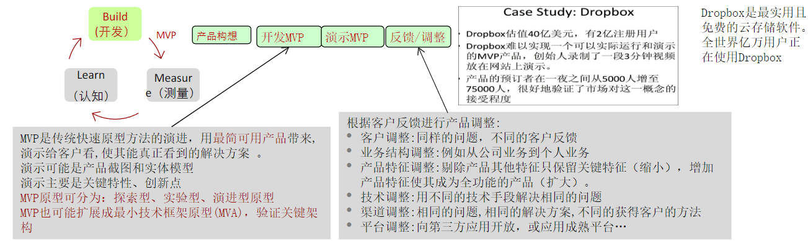

用MVP方法构建后，提供给实际用户使用，并不断收集使用中的问题和反馈，以此反馈不断检验提出的假设，并调整假设。同时在产品应用过程中，形成稳定客户和销售模式。

### 看板

关键实践：看板管理展现价值流，通过拉动式管理，消除瓶颈与等待，提升交付吞吐量。

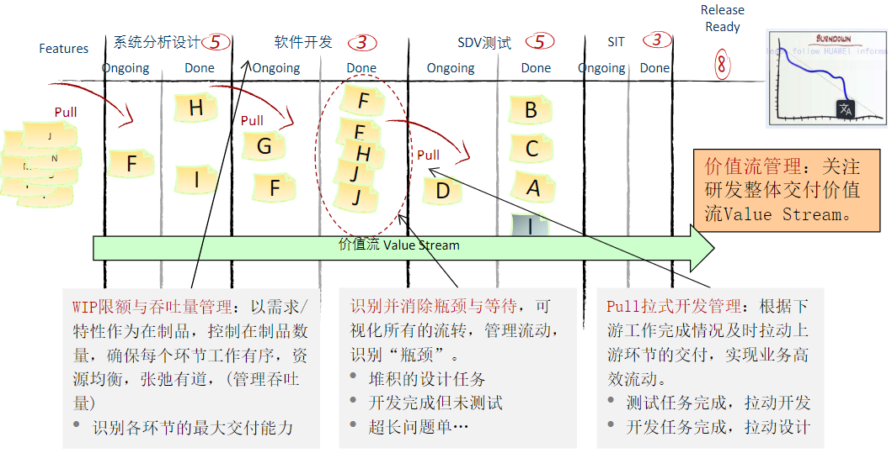

## 微服务项目管理

微服务理念：松耦合，可并行开发、部署、运行的小产品。

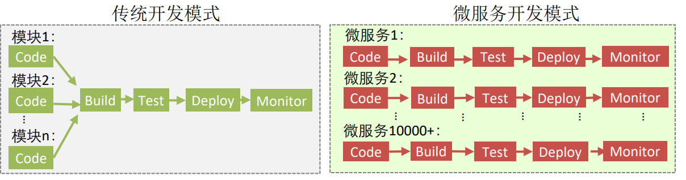

可以实现数万开发者、1万+个微 服务全流程并行化运作：  每个微服务对应一条微服务生产  线。  从编码、构建、集成验证、部署  上线到监控保障，全流程并行。每个微服务可独立编译（无二进制接口依赖），独立部署（无部署顺序依赖），独立运行（无启动顺序依赖）。

原则: 

- 只能通过服务接口 (Service Interface, i.e., API)对外发布其数据和功能。  
- 各组件团队间互相沟通也必须通过这些接口。
- 各组件间不允许其他任何形式的进程通信
- 不关心使用什么样的技术, HTTP，CORBA，PubSub，自定义的协议 - 无所谓。   
- 所有的服务接口设计从一开始必须外部化。

"Two-pizza"全功能团队用来描述一种微服务架构中的团队组织方式。根据这个概念，一个团队的规模应该足够小，以至于他们能够吃两张披萨所容纳的量。换句话说，团队的规模应该小到足以保持高效的沟通和协作，避免过多的管理层级和复杂的决策流程。

"Two-pizza"全功能团队的主要特点包括：

1. **小团队规模**：团队成员数量通常在 5 到 10 人之间，以确保每个人都能充分了解整个系统，并且能够有效地沟通和协作。
2. **全功能**：团队应该拥有完成任务所需的所有技能和资源，包括开发、测试、部署等。这样可以减少团队之间的依赖，并提高交付速度和质量。
3. **自治**：团队应该具有一定程度的自治权，能够自主决定如何分配工作、制定优先级和采用哪些工具和技术。这有助于加快决策过程，并提高团队的灵活性和创造性。

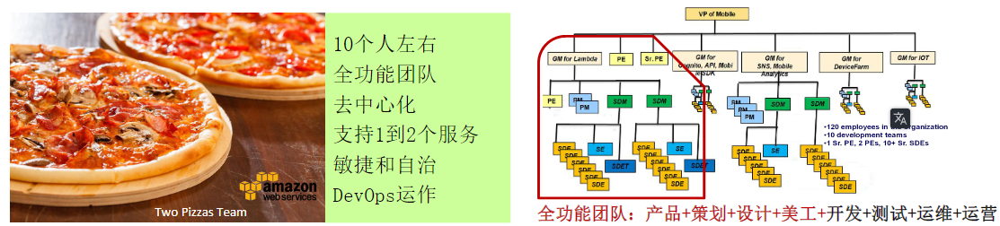

