# 建模

业务流程建模的意义

- 帮助我们了解某项业务的具体处理过程
- 发现和处理系统调查工作中的错误和疏漏 
- 便于分析原系统流程中的问题，优化或重组业务处理流程
- 使用图示方法表示企业具体业务处理过程，易于理解和交流

> 如果你不能够把它画出来，你就没有真正理解它。

## 业务流程图

**业务流程图（Transaction Flow Diagram, TFD）,就是用一些规定的符号（Symbol）及连线（Arrow Line）来表示某个具体业务处理过程（Process）的图表**。是一种表明系统内各单位、人员之间业务关系、作业顺序和管理信息流动的图表。业务流程图的绘制基本上按照业务的实际处理步骤和过程绘制。换句话说，就是“文本”用图形方式来反映实际业务处理过程的“流水账”。

对业务流程进行分析的目的是发现现行系统中存在的问题和不合理的地方，优化业务处理过程，以便在新系统建设中予以克服或改进。 分析的时候，不仅要找出原业务流程不合理的地方，还要充分考虑信息系统的建设为业务流程的优化带来的可能性，产生更为合理的业务流程。

业务流程例子1：

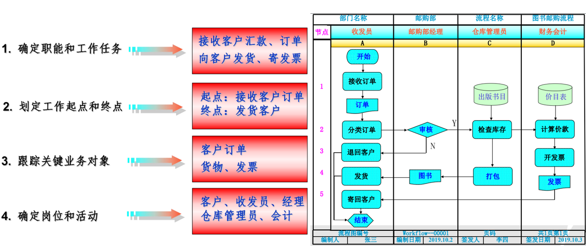

业务流程例子2：

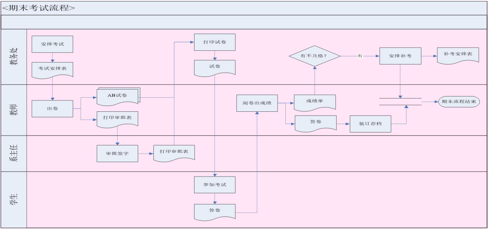

业务流程例子3——空调维修服务：

- 客户申请服务，如果是新客户，业务经理将该客户的基本信息记录下来。接下来业务经理将上门进行勘查，并制定具体“维修方案” 。业务经理和客户就方案进行沟通，达成一致则签订正式“服务合同” ，否则流程终结。
- 根据合同方案，业务经理将对实施维修的人员和所需材料进行计划，并填发“派工单”。工人拿到派工单后，领取指定材料上门实施服务。服务完成后客户进行验收，并在“派工单”上填写维修信息和反馈意见。业务经理收回派工单后，通知财务人员进行项目的结算并收款，流程终结。

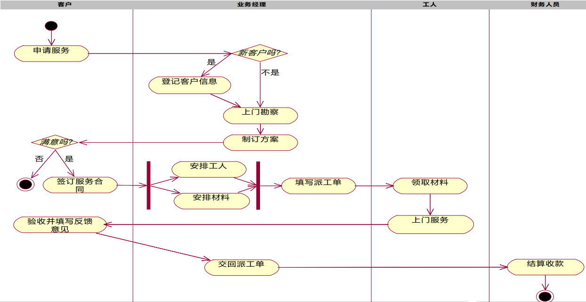

> 上面这个图也叫活动图

## 数据流程图

即DFD: Data Flow Diagram，基本符号包括：

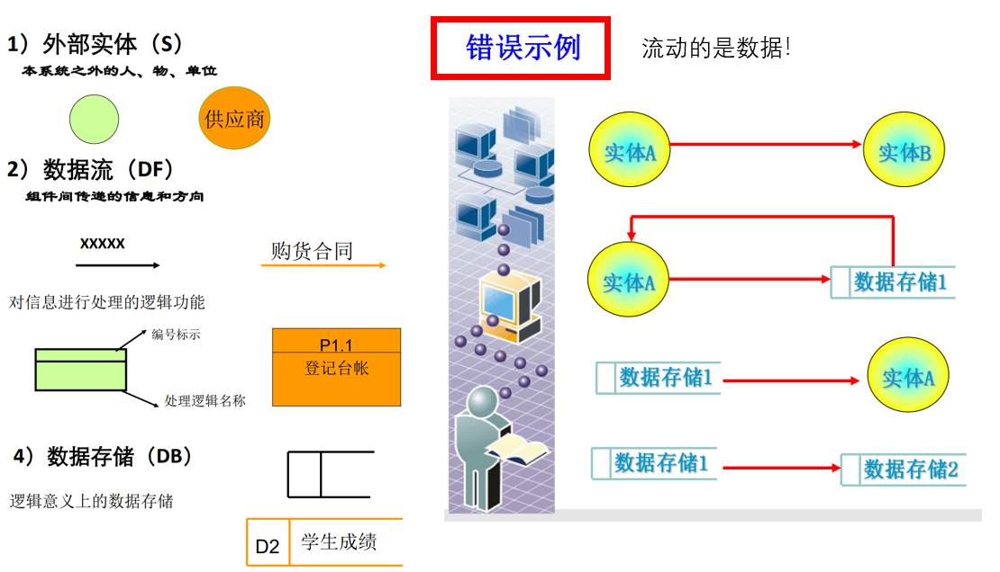

案例1，处理借书过程是：

前台接待员接受读者交的索书单，首先查看读者记录进行**读者鉴别**，并存储借阅记录文件。然后由图书管理员查询图书文件，进行**存书查询**，如果图书未借出，交书库管理员向书库发出库单，并由书库管理员修改**借阅记录文件和图书文件**；如果图书已借出，向读者发图书有人借阅通知。

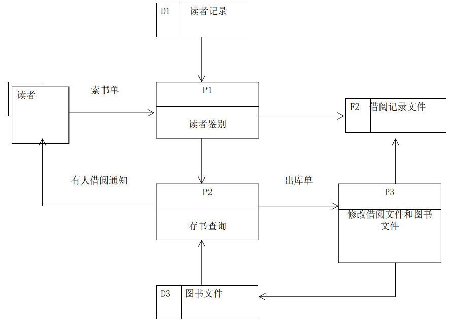

案例2，订单处理的处理过程如下： 

- **验收订单**。顾客发来订单后进行验收处理，将填写不清的订单和无法供应的订单退回顾客，将合格的订单送到下一“处理”。
- **确定发货量**。查库存台账，根据库存情况将订单分为两类（是否缺货），分别送至下一“处理” 。 
- 如不缺货，**开发货单、修改库存**。记应收账和将订单存档。
- 缺货，则**填写缺货订单**。对未满足的订货填写缺货订单（即等有货后发货的发货单）。 
- **处理缺货订单**。接到采购部门到货通知后应对照缺货订单。如可发货，则执行开发货单和修改库存处理。

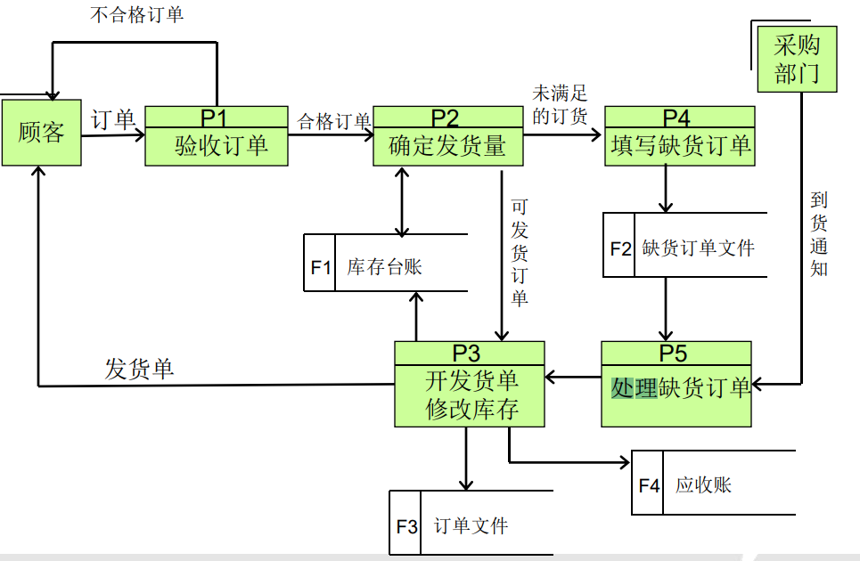

案例3：订货系统

假设某一企业是采购部门每天需要一张订货报表，报表按材料编号排序，表中列出所有需要再次订货的材料。对于每种需要再次订货的材料应列出下列数据：材料编号、名称、订货数量、目前价格（或参考价格）、主要供应单位、第二供应单位等。材料入库或出库称为事务，仓库保管员通过放在仓库的终端把事务报告给订货系统。当某种材料的库存数量少于库存量临界值时就应该再次订货。

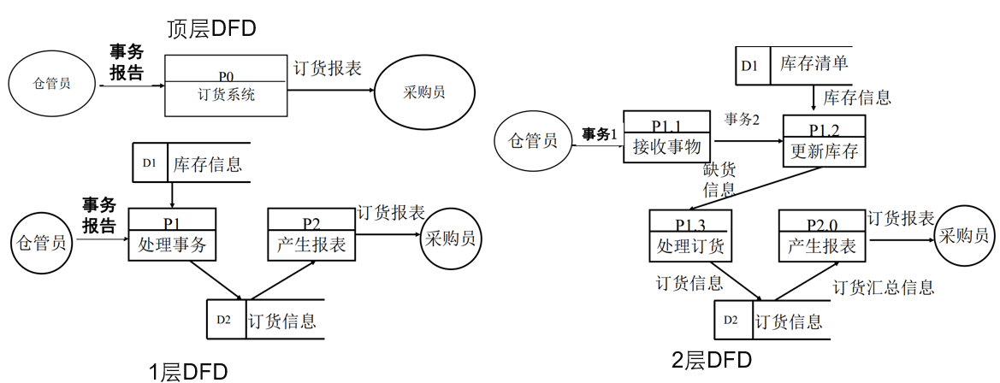

## 用例图

识别参与者(Actor)，参与者是系统之外与系统进行交互的任何事物。包括个人、外部硬件、与该系统进行通信的其他信息系统。

> 区分参与者和DFD的外部实体：只有在执行系统功能时与信息系统进行实时交互的人员才能被当作参与者。外部实体是指数据的来源和去向，提供数据的人员不一定会执行系统功能。
>
> 新生入学手工填写个人信息，然后由教务人员统一将数据登记到学籍系统中，教务人员是参与者。  如果学生直接通过Web方式提交个人信息，则认为学生是参与者。

主要参与者（primary actor）是从系统中直接获得可度量价值的用户，功能最直接最主要的用户。 次要参与者（secondary actor）的需求驱动了用例所表示的行为或功能，在用例中起辅助支持作用。用例分析的重点是要找到主要参与者。

在UML中，参与者使用小人符号。参与者的角色可以有共性，或者说一般性，一种角色可以拥有另一种角色的全部行为。子角色（subrole）可以继承父角色（superrole）的所有行为。

> 比如在超市系统中，值班经理完全可以充当收银员这一角色，此外，值班经理还可以有退货、更改事务等权利。

案例讨论1——人力资源

某集团公司在全国多个地区有分公司，集团内部招聘岗位发布流程如下：不论何时，某一分公司只要有职位空缺，该分公司的*人力资源领导*（后简称HRD）就会通知本公司的所有*员工*并给其它分公司的HRD发送消息，邀请员工们提出申请。其他分公司HRD收到消息后**将招聘信息贴在公告板上**，所有对此感兴趣的员工都可以向职位空缺分公司的HR领导**发送申请**。

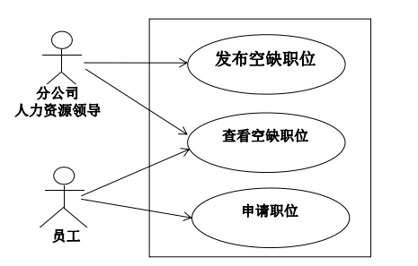

案例讨论2——空调维修

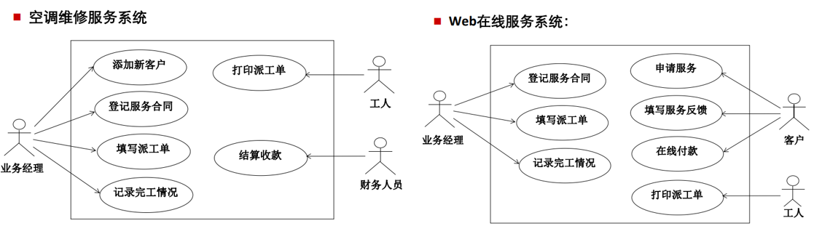

## 用例与事件流

用例描述的是一个系统做什么，可以通过用足够清晰的、外部人员很容易理解的文字描述一个事件流，来说明一个用例的行为。

**主事件流**是指能够满足目标的典型的成功路径。**备选事件流**是指除主事件流之外的各种可能失败情况、分支路径或扩展路径。备选事件流的编号要与主事件流相对应。

案例1，借书：

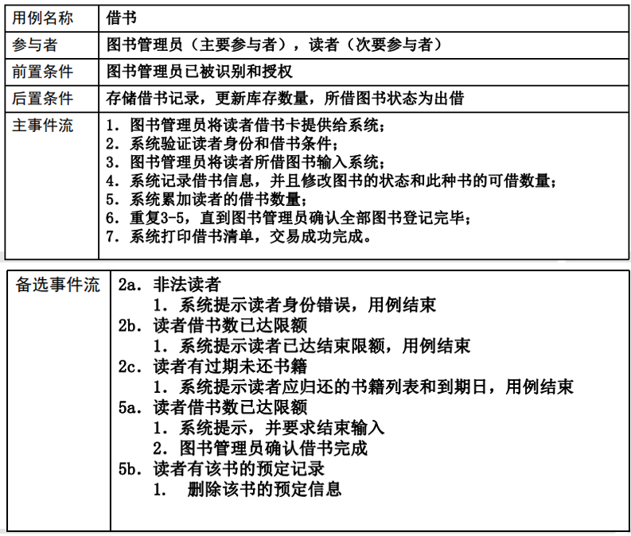

案例2，酒店预定：

- 某公司要开发一个酒店预定系统，该酒店可对外开放豪华双人间、双人间、三人间和单人间，房间价格视情况可以调整，但周一到周五半价、周末全价的折扣不变。
- 对于客户请求，该系统应能根据请求预定指定档次的房间，记录旅客姓名、地址、联系电话、有效证件号、房间类型、入住日期和天数，并计算出总费用。预定的同时旅客按规定须提交10%定金。 
- 预定入住日期前旅店允许旅客取消预定，距离入住12小时以上可退回所有定金，否则定金不退还。 
- 每周一系统自动打印一周预定情况清单。采用哪种费用支付方式和何种类型操作界面尚不确定

------

**用例名称**：预定房间 
**参与者**：酒店前台 
**描述**：酒店前台人员根据旅客的入住请求，预定某个时间指定档次的房间，预定的同时旅客按规定须提交10%定金。 
**前置条件**：前台工作人员必须已经登录到这个系统 
**后置条件**：预定信息正确的记录到系统中 
**主事件流**： 

1. 前台人员向系统提供需要预定房间的类型、时间和预定天数。
2. 系统确认有相应档次的空闲房间，并计算出总费用和定金。
3. 前台人员向系统提供旅客信息（姓名、地址、联系电话、证件号等）。
4. 系统记录旅客信息。 
5. 前台人员确认已经交纳定金。 
6. 系统记录房间已经预定，工作完成。

**备选事件流**： 
2a.没有指定类型的空闲房间,可以转到第一步或者取消预定，用例结束
5a.顾客没有交纳定金，前台工作人员取消预定，用例结束。

------

**用例名称**：取消预酒订店预定
**参与者**：酒店前台 
**描述**：酒店前台利用该用例来取消顾客的预定，如果在指定时间内，则取消时需要返还顾客定金 
**前置条件**：用户必须已经预订了某个房间 
**后置条件**：系统将取消预定的房间恢复为空闲，并且定金已返还给顾客
**正常事件流**： 

1. 前台人员提供给系统顾客信息，比如顾客姓名或证件号码；
2. 系统进行检查并返回该顾客的预订信息，包括顾客姓名、证件号码、联系电话、房间类型、预订时间、预订天数和总费用；
3. 前台人员确认取消该预定； 
4. 系统取消该房间预订

**备选事件流**： 
2a.系统提示没有该顾客的预定信息。 
4a.当取消预订在12小时之内，系统提示需要退还顾客定金。
	4a1. 系统提示返回金额； 
	4a2.前台人员确认已退还定金； 
	4a3.系统记录定金已退还。

## 用例关系

- 包含关系：基本用例可以控制包含用例，并依赖于（使用）包含用例所得到的结果。
- 扩展关系：扩展用例是**可选**的，它是否执行取决于在执行基本用例时所发生的事件（存在扩展点）。
- 泛化关系（不推荐）：用一个新的、通常也是抽象的用例来描述多个用例的共有部分(父用例)，子用例继承父用例的所有结构、行为和关系，并含有自己特殊的部分。

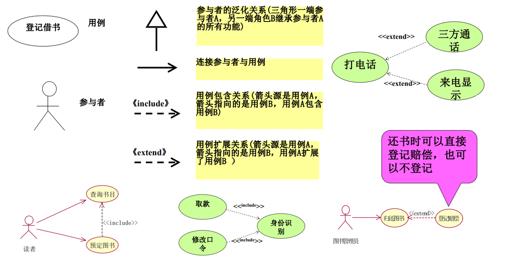

酒店预定用例图：

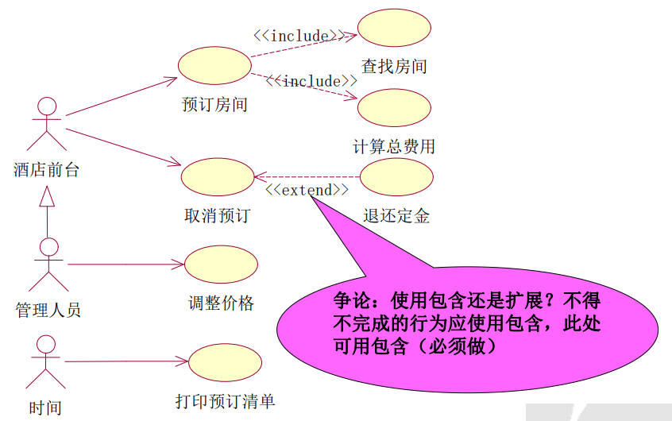