# 数据库设计

数据库设计过程是一种自上而下的、逐步逼近设计目的的过程。目标是建立一个性能良好的、能满足不同用户使用要求的、又能被选定DBMS所接受的数据库模式。

内容： 

- **结构特性**设计。**结构特性设计称逻辑结构特征或静态结构设计**。过程是： 
  1. 先将现实世界中的事物、事物间的联系用E-R图表示; 
  2. 再将各个分E-R图汇总，得出数据库的概念结构模型; 
  3. 最后将概念结构模型转化为数据库的逻辑结构模型表示。
- **行为特性**设计。数据库的行为特性设计是指确定**数据库用户的行为和动作**，并根据其行为特性设计出数据库的子模式。 设计步骤是： 首先要将现实世界中的数据及应用情况用数据流程图和数据字典表示，并详细描述其中的数据操作要求，进而得出系统的功能模块结构和数据库的子模式。
- **物理模式**设计。数据库的物理模式设计。设计要求是: 根据数据库结构的动态特性（即数据库应用处理要求），在选定的DBMS环境下，**把数据库的逻辑结构模型加以物理实现**，从而得出数据库的存储模式和存取方法。

数据库系统设计方法：

- 手工试凑法。使用手工试凑法设计数据库与设计人员的经验和水平有直接关系。
- 新奥尔良（New Orleans）方法。数据库设计分为4个阶段：需求分析、概念设计、逻辑设计和物理设计。
- 许多科学家认为数据库设计应分6个阶段进行：需求分析、概念结构设计、逻辑结构设计、物理结构设计、数据库实施和数据库运行和维护。

## 需求分析

**数据流图**是系统需求分析阶段的重要的描述工具。

主要任务：数据库中的信息内容。 数据处理内容。 数据安全性和完整性要求。

数据字典是各类数据描述的集合，是进行详细的数据收集和数据分析后所获得的主要成果。数据字典包括5个方面：1. 数据项 2. 数据结构 3. 数据流 4. 数据存储 5. 处理过程

**数据项**是不可再分的数据单位。 它的描述为： 

```
数据项 = {数据项名，数据项含义说明，别名，类型，长度，取值范围，与其他数据项的逻辑关系}
```

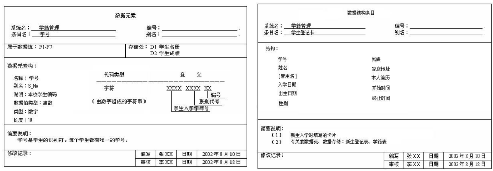

**数据结构**的描述为：

```
数据结构 = {数据结构名，含义说明，组成，{数据项或数据结构}}
```

**数据流**是数据结构在系统内传输的路径。数据流的 描述通常为：

```
数据流 = {数据流名，说明，流出过程，流入过程，组成：{数据结构}，平均流量，高峰期流量}
```

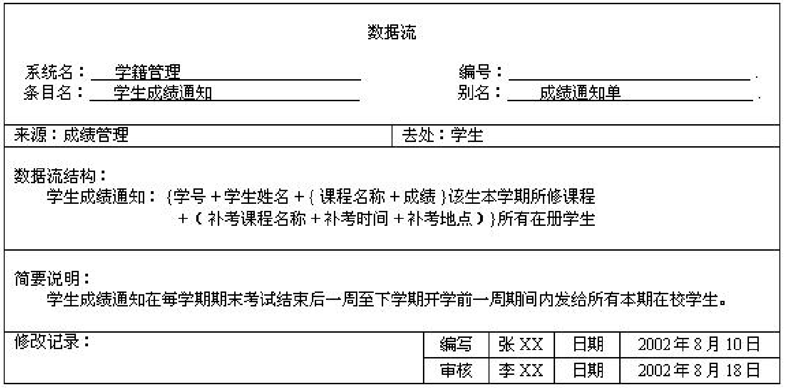

**数据存储**是数据及其结构停留 或保存的地方，也是数据流的 来源和去向之一。数据存储可 以是手工文档、手工凭单或计算机文档。数据存储的描述通常为： 

```
数据存储 = {数据存储名，说明，编号，输入的数据流，输出的数据流}，组成：{{数据结构}，数据量，存取频度，存取方式}
```

**处理过程**的具体处理逻辑一般用 判定表或判定树来描述。数据字 典中只需要描述处理过程的说明 性信息，通常包括以下内容： 

```
处理过程 = {处理过程名，说明，输入：{数据流}，输出：{数据流}，处理：{简要说明}}
```

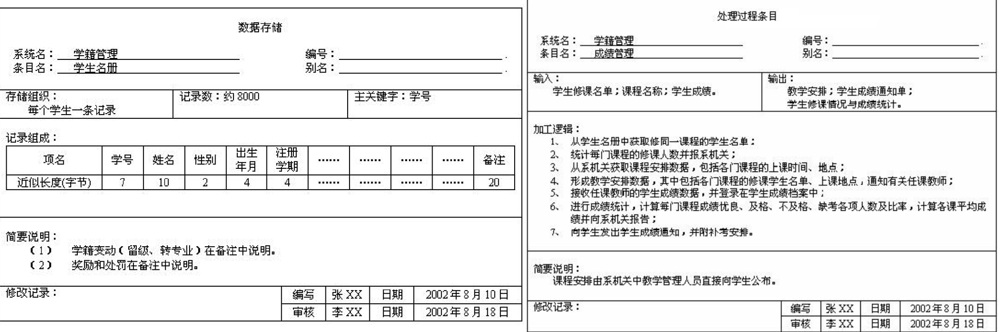

## 概念结构设计

概念结构设计是将系统需求分析得到的用户需求抽象为信息结构的过程。概念结构的结果就是数据库的概念模型。

建立局部E-R模型，就是根据系统的具体情况，在多层的数据流图中选择 一个适当层次的数据流图，作为设计分E-R图的出发点，让这组图中毎一 部分对应一个局部应用。在前面选好的某一层次的数据流图中，每个局部 应用都对应了一组数据流图，局部应用所涉及的数据存储在数据字典中。 

目的：就是要将这些数据从数据字典中抽取出来，参照数据流图，确定每 个局部应用包含哪些实体，这些实体又包含哪些属性，以及实体之间的联 系及其类型。

设计概念结构的E-R模型，可采用四种方法：

- 自顶向下。先定义全局概念结构E-R模型的框架，再逐步细化。
- 自底向上。先定义各局部应用的概念结构E-R模型，然后将它们集成，得到全局概念结构E-R模型。 是最常用的方法，即自顶向下地进行需求分析，再自底向上地设计概念结构。
- 逐步扩张。先定义最重要的核心概念E-R模型，然后向外扩充，以滚雪球的方式逐步生成其他概念结构E-R模型。
- 混合策略。该方法采用自顶向下和自底向上相结合的方法，先自顶向下定义全局框架，再以它为骨架集成自底向上方法中设计的各个局部概念结构。

E-R方法是“实体-联系方法”（Entity-Relationship Approach）的简称。它是描述现实 世界概念结构模型的有效方法。用E-R方法建立的概念结构模型称为E-R模型，或称为E-R图。

E-R图基本成分包含实体型、属性和联系。 

- 实体型：用**矩形框**表示，框内标注实体名称。 
- 属性：用**椭圆形框**表示，框内标注属性名称。 
- 联系：用**菱形框**表示指实体之间的联系，有一对一（1：1），一对多（1： n）或多对多（ m ： n）三 种联系类型。因为联系本身也是一种实体型，所以联系也可以有属性。如果一个联系具有属性，则这些联系也要用无向边与该联系连接起来。

> 例如系主任领导系，学生属于某一系，学生选修课程，工人生产产品，这里“领导”、“属于”、“选修”、“生产”表示实体间的联系，可以作为**联系**名称。联系用菱形框表示，框内标注联系名称。
>
> 例如一个部门内的职工有领导与被领导的联系，即某一职工（干部）领导若
> 干名职工，而一个职工（普通员工）仅被另外一个职工直接领导，这就构成
> 了实体内部的一对多的联系。
>
> 学生选修的课程有相应的成绩。这里的“成绩”既不是学生的属性，也不是课程的属性，只能是学生选修课程的联系的属性。

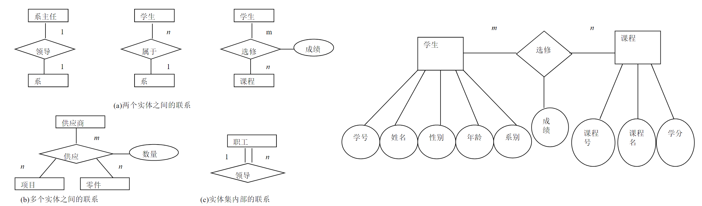

举例说明局部E-R模型设计。在简单的教务管理系统中，有如下语义约束。

- 一个学生可选修多门课程，一门课程可为多个学生选修，因此学生和课程是多
  对多的联系；
- 一个教师可讲授多门课程，一门课程可为多个教师讲授，因此教师和课程也是
  多对多的联系；
- 一个系可有多个教师，一个教师只能属于一个系，因此系和教师是一对多的联
  系，同样系和学生也是一对多的联系。

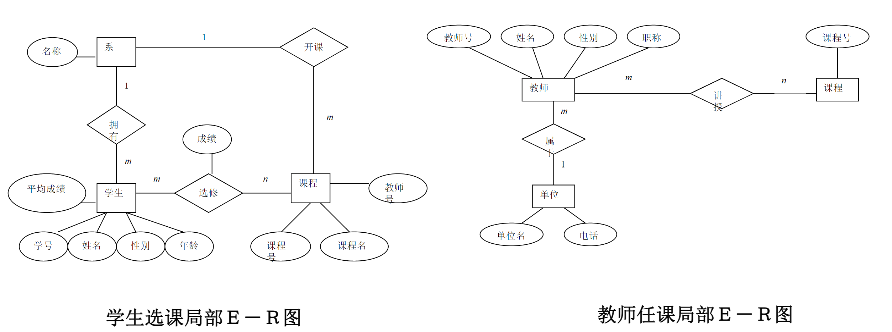

局部E-R模型设计完成之后，下一步就是集成各局部E-R模型，形成全局E-R模型，即视图的集成。视图集成均分成两个步骤： ① 合并，消除各局部E-R图 之间的冲突，生成初步E-R图。 ② 修改和重构（优化），消 除不必要的实体冗余和联系 冗余，生成基本E-R图。

E-R图中的冲突有三种：属性冲突、命名冲突和结构冲突。

- 属性冲突。属性值域冲突，即属性值的类型、取值范围或取值集合不同。比如 学号，有些部门将其定义为数值型，而有些部门将其定义为字符型。 又如年龄，有的可能用出生年月表示，有的则用整数表示。 属性的取值单位冲突。比如零件的重量，有的以公斤为单位，有的 以斤为单位，有的则以克为单位。 属性冲突属于用户业务上的约定，必须与用户协商后解决。
- 命名冲突。命名不一致可能发生在实体名、属性名或联系名之间，其中属性的命名冲突更为常见。命名冲突的解决方法同属性冲突，需要与各部门协商、讨论后加以解决。
- 结构冲突。同一对象在不同应用中有不同的抽象，可能为实体，也可能为属性。这种情况应该根据应用的语义对实体联系的类型进行综合或调整。

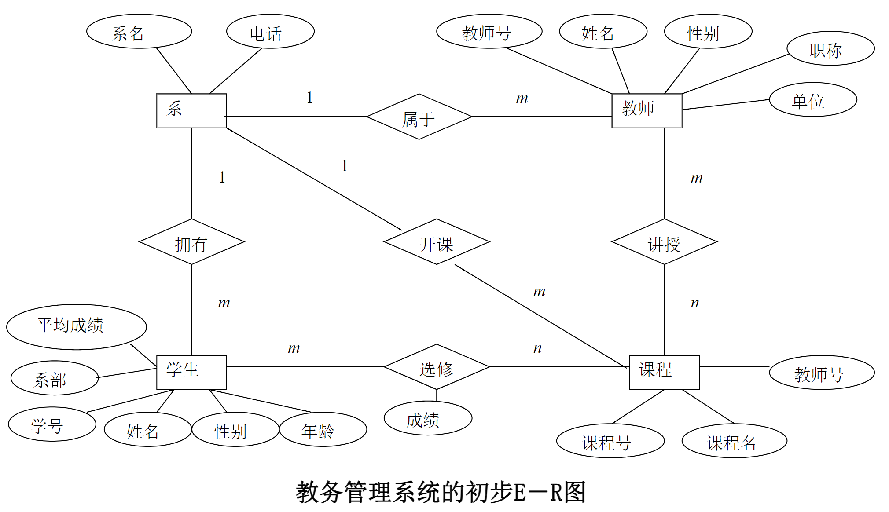

除不必要的冗余，生成基本E-R图。冗余在这里指冗余的数据和实体之间冗余的联系。

> “课程”实体中的属性“教师号”可由“讲授”这个 教师与课程之间的联系导出，而学生的平均成绩可由“选修”联系中的属性 “成绩”中计算出来，所以“课程”实体中的 “教师号” 与“学生”实体中 的“平均成绩”均属于冗余数据。 
>
> 另外，“系”和“课程”之间的联系“开课”，可以由“系”和“教师”之间 的“属于”联系与“教师”和“课程”之间的“讲授”联系推导出来，所以 “开课”属于冗余联系。

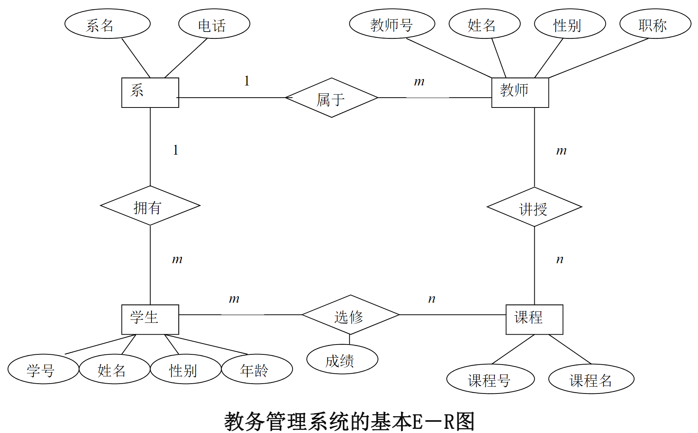

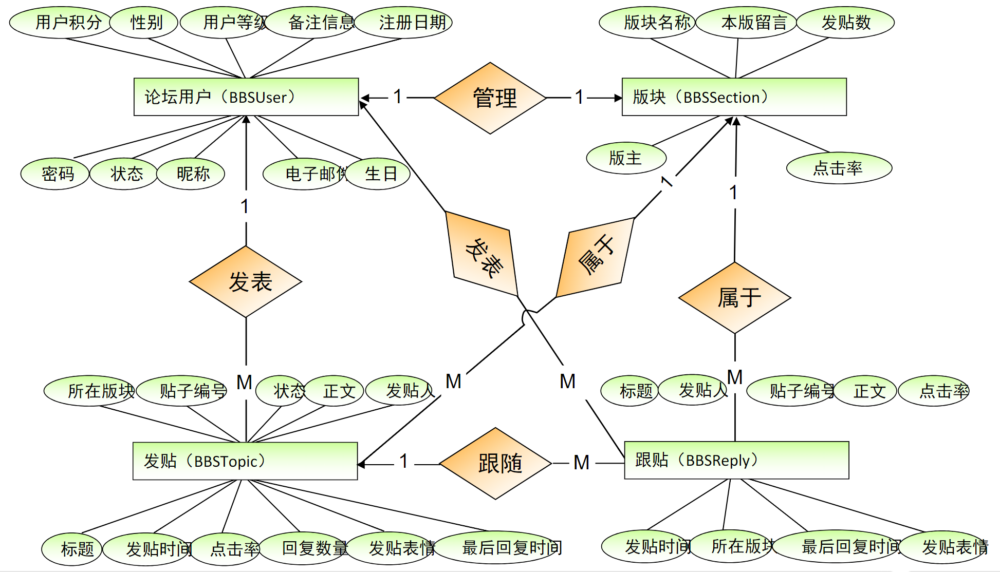

## 逻辑结构设计

数据库逻辑结构设计的任务：是将概念结构转换成特定DBMS所支持的数据模型的过程

概念设计中得到的E-R图是由实体、属性和联系组成的，将E-R 图转换为关系模型实际上就是将实体、属性和联系转换成关系 模式。在转换中要遵循以下原则： 

- 实体集的转换：一个实体转换为一个关系模式，实体的属性就是关系的属性，实体的键就是关系的键。
- 实体集间联系的转换规则：一个联系转换为一个关系模式，与该联系相连的各实体的键以及联系的属性均转换为该关系的属性。该关系的键有三种情况：
  1. 如果联系为1:1，则每个实体的键都是关系的候选键； 可以找一个合并
  2. 如果联系为1: n ，则n端实体的键是关系的键； 可以找n端实体合并
  3. 如果联系为n : m，则各实体键的组合是关系的键。不可合并
- 三个或三个以上实体间的一个多元联系在转换为一个关系模式时，与该多元联系相连的各实体的主键及联系本身的属性均转换成为关系的属性，转换后所得到的关系的主键为各实体键的组合。

以前面分析图的E-R模型为例，四个实体分别转换成四个关系模式：

```
学生（*学号，姓名，性别，年龄） 
课程（*课程号，课程名） 
教师（*教师号，姓名，性别，职称） 
系（*系名，电话）

选修（*学号，*课程号，成绩）  # m:n二元联系
```

**规范化**：规范化是可逆的转换处理过程。规范化的主要目标就是能够让用户使用简单的操作检索出有用的信息，并且使数据的不规则、不连贯的程度达到最小。规范化的程度可用范式来表示，如满足最低要求，则称为第一范式，依次还有第二、三、四、五范式，在五种范式中，通常只使用前三种。

- 合并：如果有若干个关系模式具有相同的主键，并且对这些关系模式的 处理主要是查询操作，而且经常是多关系的查询，那么可对这些 关系模式按照组合使用频率进行合并。
- 分解：为了提高数据操作的效率和存储空间的利用率，最常用和最重要的模式优化方法就是分解，根据应用的不同要求，可以对关系模式进行垂直分解和水平分解。
  - 水平分解是把关系的元组分为若干子集合，定义每个子集合为一个子关系。
  - 垂直分解是把关系模式的属性分解为若干子集合，形成若干子关系模式。垂直分
    解的原则是把经常一起使用的属性分解出来，形成一个子关系模式。

> 对于经常进行大量数据的分类条件查询的关系，可进行水平分解，这样可以减少应用系统每次查询需要访问的记录数，从而提高了查询性能。
>
> 水平分解例子：有学生关系（学号，姓名，类别......），其中类别包括大专生、本科生和研究生。如果多数查询一次只涉及其中的一类学生，就应该把整个学生关系水平分割为大专生、本科生和研究生三个关系。
>
> 垂直分解例子：有教师关系（教师号，姓名，性别，年龄，职称，工资，岗位津贴，住址，电话），如果经常查询的仅是前六项，而后三项很少使用，则可以将教师关系进行垂直分割，得到两个教师关系：教师关系1（教师号，姓名，性别，年龄，职称，工资）；教师关系2（教师号，岗位津贴，住址，电话）

第一范式分解实例：

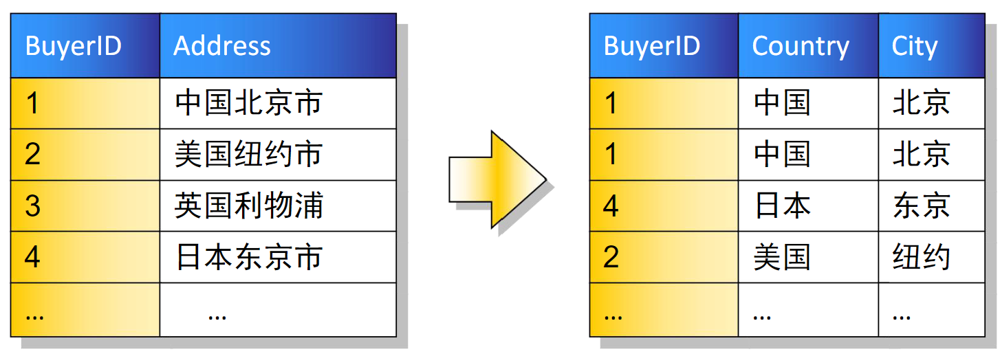

第二范式分解实例（下图的三张表原来整合在一起）：

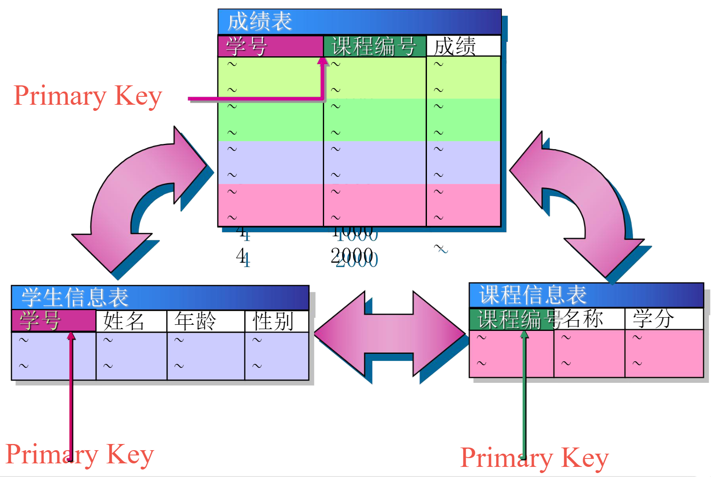

第三范式分解实例：

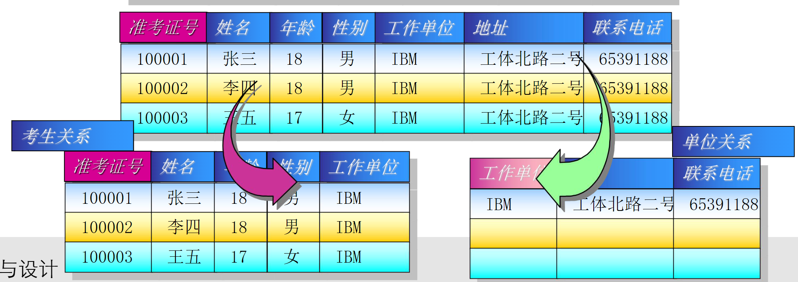

综合实例：假设某建筑公司要设计一个数据库。公司的业务规则概括说明如下： 

1. 公司承担多个工程项目，每一项工程有：工程号、工程名称、施工人员等 
2. 公司有多名职工，每一名职工有：职工号、姓名、性别、职务（工程师、技术员）等 
3. 公司按照工时和小时工资率支付工资，小时工资率由职工的职务决定（例如，技术员的小时工 资率与工程师不同）

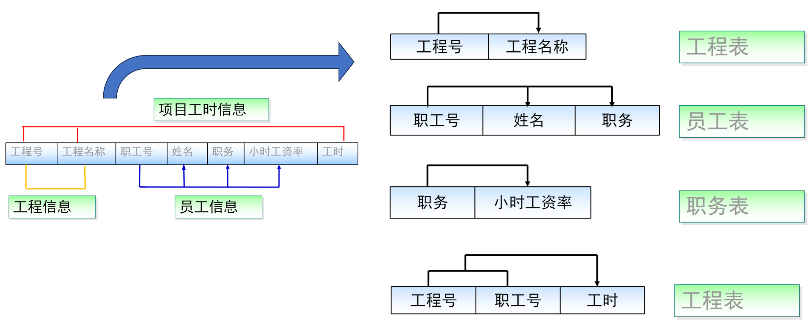

## 物理设计

物理设计的任务是为上一阶段得到的数据库逻辑模式，即数据库的逻辑结构选择合适的应用环境的物理结构，既确定有效地实现逻辑结构模式的数据库存储模式，确定在物理设备上所采用的存储结构和存取方法

## 事务

事务(TRANSACTION)是作为单个逻辑工作单元执行的一系列操作。多个操作作为一个整体向系统提交，要么都执行、要么都不执行。事务是一个不可分割的工作逻辑单元

> 转账过程就是一个整体。它需要两条UPDATE语句来完成，这两条语句是一个整体。如果其中任一条出现错误，则整个转账业务也应取消，两个账户中的余额应恢复到原来的数据，从而确保转账前和转账后的余额不变，即都是1001元

事务的ACID特性：

- 原子性（Atomicity）：事务中包括的操作要么都做，要么都不做。由数据恢复子系统负责。
- 一致性（Consistency）：数据库中包含失败事务的结果为不一致状态。
- 隔离性（Isolation）：并发执行的各个事务之间不能互相干扰。
- 持续性（Durability）：一个事务一旦提交，它对数据库中数据的改变就应该是永久性的。

例子：从张三的账户转出500元，存入李四的账户中

```sql
BEGIN;
UPDATE `bank` SET `currentMoney`=`currentMoney`-500
WHERE `customerName`='张三';
UPDATE `bank` SET `currentMoney`=`currentMoney`+500
WHERE `customerName`='李四';
COMMIT;  /*提交*/
```

```sql
BEGIN;
UPDATE `bank` SET `currentMoney`=`currentMoney`-1000 
WHERE `customerName`='张三';
ROLLBACK; /*回滚事务，数据恢复到原始状态*/
```

## 视图

视图是一张虚拟表，表示一张表的部分数据或多张表的综合数据，其结构和数据是建立在对表的查询基础上

视图中不存放数据，数据存放在视图所引用的原始表中

一个原始表，根据不同用户的不同需求，可以创建不同的视图

注意事项：

- 视图中可以使用多个表
- 一个视图可以嵌套另一个视图
- 对视图数据进行添加、更新和删除操作直接影响所引用表中的数据
- 当视图数据来自多个表时，不允许添加和删除数据

使用视图修改数据会有许多限制，一般在实际开发中视图仅用作查询

## 存储过程

存储过程是 SQL 语句和流程控制语句的预编译集合，以一个名称 存储并作为一个单元处理。存储过程存储在数据库内，可由应用程 序调用执行，而且允许用户声明变量、有条件执行以及其它强大的 编程功能。

例子：使用带有参数的存储过程：查询某个学生某门课程的考试成绩

```sql
CREATE PROCEDURE student_grade2
	@student_name char(10), @course_name char(20)
AS
SELECT Sname, Cname,Grade
FROM Student s INNER JOIN sc
ON s.sno = sc.sno INNER JOIN course c
ON c.cno = sc.cno
WHERE sname = @student_name
AND cname = @course_name
```

按参数位置传递值 

```sql
EXEC student_grade2 '刘晨', '数据库' 
```

按参数名传递值 

```sql
EXEC Student_grade2 @student_name = '刘晨', @course_name='数据库
```

## 触发器

触发器是一种特殊类型的存储过程，其特殊性在于它不需要用户来调用，当对表进行插入、删除和修改等操作时自动执行。

触发器的功能很强大，使用它可以检查数据输入的正确性；实现数据 库中多个表的级联修改；强制更复杂的数据完整性等。但也要谨慎使用， 因为每次访问表时都可能激活某个触发器，这样会给数据库带来负担，所以，尽量使用触发器解决别的方法不能执行的操作。另外，有些语句不能 在触发器中执行，如CREATE DATABASE、ALTER DATABASE 等。

## 索引

索引是一种有效组合数据的方式，为快速查找到指定记录，可以大大提高数据库的检索速度 改善数据库性能

按照下列标准选择建立索引的列：

- 频繁搜索的列 
- 经常用作查询选择的列 
- 经常排序、分组的列 
- 经常用作连接的列（主键/外键） 

请不要使用下面的列创建索引 

- 仅包含几个不同值的列 
- 表中仅包含几行
