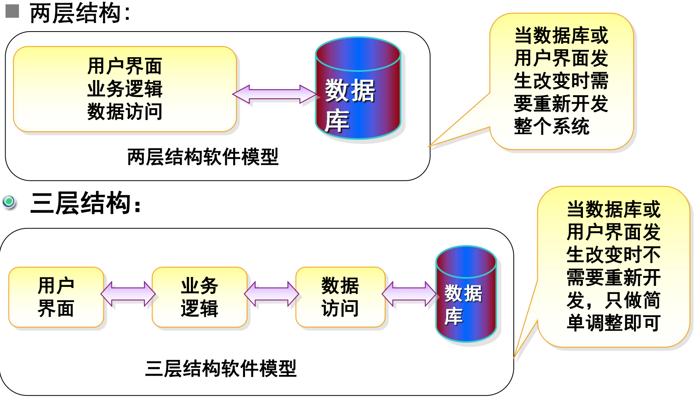
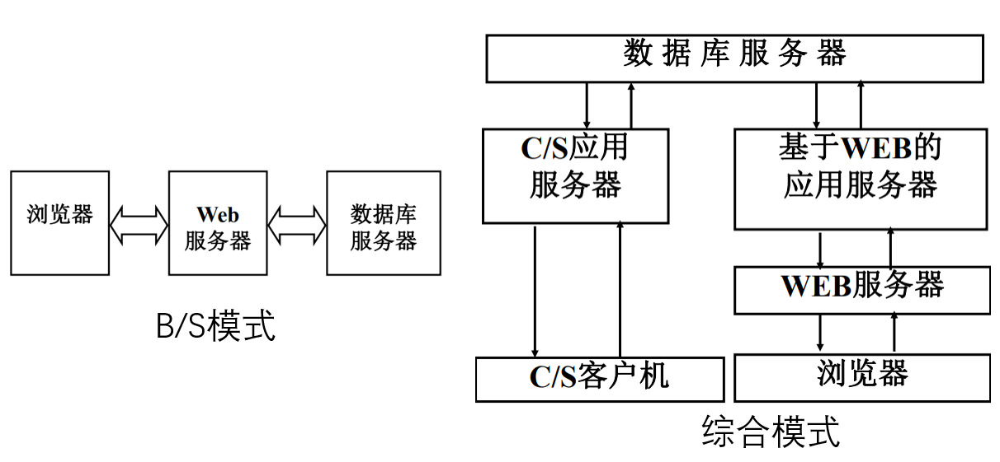
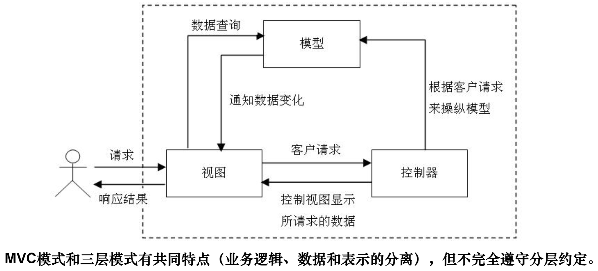
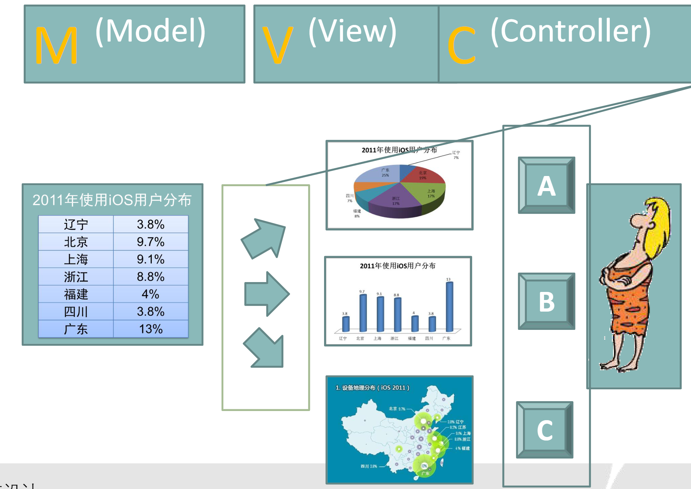
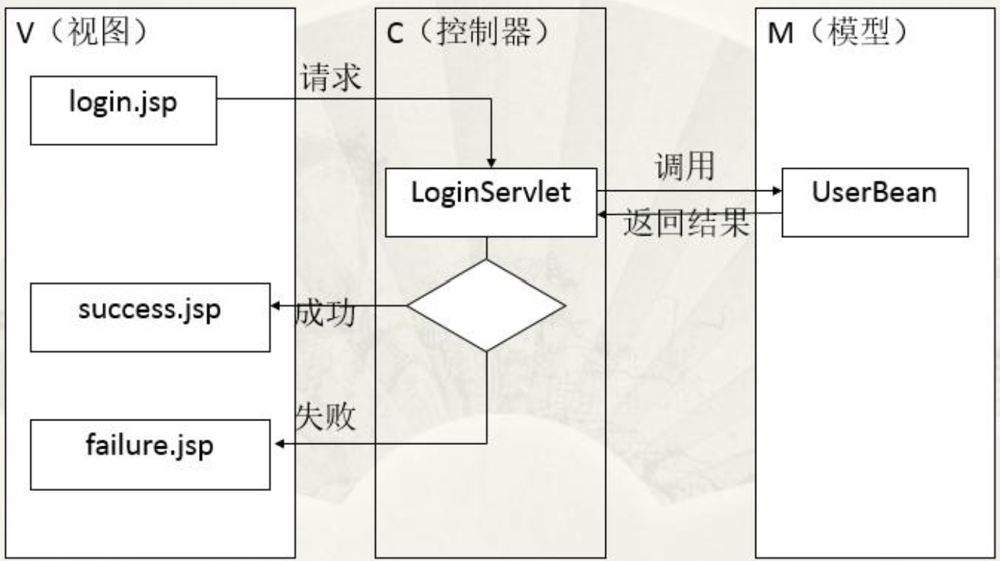
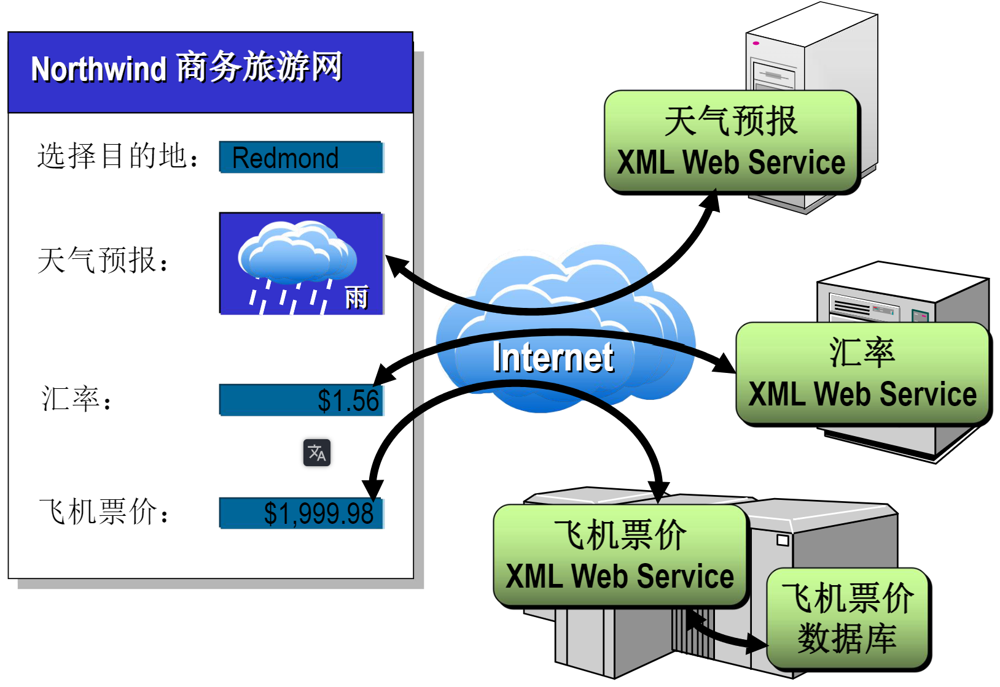
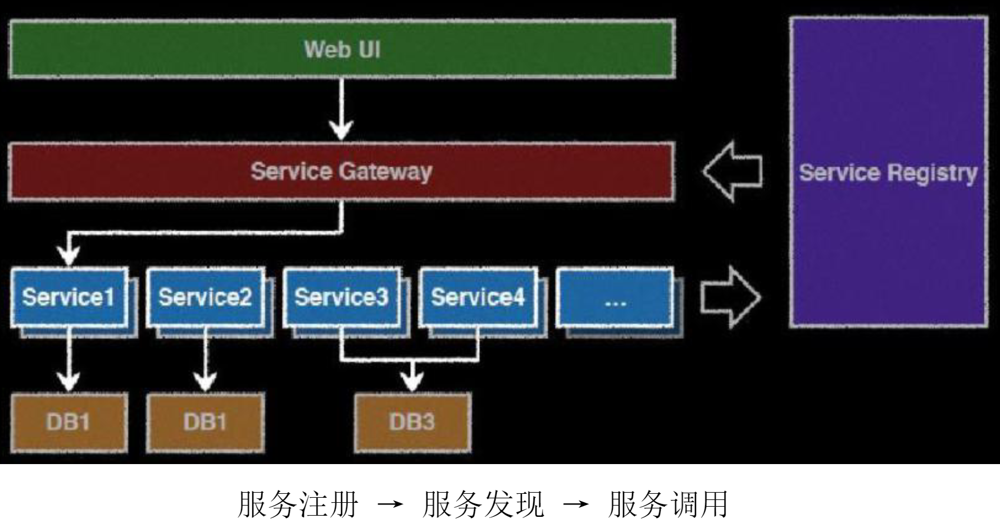

# 架构

架构师（architect）需要发现特定系统的最重要的关注点，设计某种折衷的总体方案以满足关注点。  

架构包含系统的一组基本结构（structure），每种结构都有各种类型的部件（component）及其关系构成，架构描述了这些部件的组合、相互调用参照、通信以及其他动态交互。

软件架构（software architecture）的定义没有统一的版本，一般认为：一个应用程序或计算系统的软件架构是一个或一组结构，它包含组成系统的软件元素、这些元素对外可见的性质以及它们之间的关系。对外可见的性质指软件元素能够提供的服务、性能特征、错误处理、共享资源的用法等。

大部分的架构来源于有相似关注点的系统的总结和抽象，这些相似性被描述成某种特殊模式的架构风格，也就是架构模式（architectural pattern）。一种架构模式就是一个经验秘籍，架构师在设计不同系统时可以重复使用这些先进经验。

## C/S模式

基于组件的软件开发，组件根据横向位置划分为多层（N-Layer）：

- 下层组件负责对上层组件提供服务  
- 上层组件可以使用下层组件定义的服务，但下层组件对上层组件一无所知。
- 层与层之间通常是不透明的，每一层都具有独立的职责 
- 不同层的软件构件可以分布在多台机器上，也可以部署在同一台机器上，形成物理上的多层（N-Tier）

客户机/服务器（Client/Server——简称C/S模式）结构是80年代产生的崭新的应用模式 。以计算机网络为基础，把企业的计算机应用分布在多台计算机中。

在“后台”侧重于数据存储与文件管理服务（称为服务器）。在“前台”侧重于完成最终用户的处理逻辑及人机界面（称为客户机）。在客户机上按最终用户的管理需求提出对数据及文件服务要求，服务器计算机按要求把信息传送给客户机 。解决了文件服务器/工作站模式下的“传输瓶颈”问题。

经典的3层架构：

- 表示层（UI）：为用户提供交互操作界面
- 业务逻辑层（BLL）：负责关键业务的处理和数据传递
- 数据访问层（DAL）：实现数据库访问

## B/S模式

许多基于大型数据库的信息系统采用B/S（浏览器—服务器）模式。Intranet（企业内部网）采用B/S系统结构，这种结构实质上是客户机/服务器结构在新的技术条件下的延伸。

在C/S模式中，Server仅作为数据库服务器，进行数据的管理，大量的应用程序都在客户端进行，客户端变得复杂。在Intranet结构下，C/S结构自然延伸为三层或多层的结构，形成浏览器—服务器应用模式。

## 综合模式

## MVC

MVC模式是一种软件开发模式。

- M是Model，表示模型，主要完成系统的逻辑处理。代表数据使用对象及其属性实现。
- V是View，表示视图，主要完成与用户的交互。 是模型的外在表现形式，视图可以直接访问模型；查询数据信息，当模型中数据发生变化时，它会通知视图刷新界面，显示更新后的数据。
- C是Controller，表示控制器，主要建立模型与视图之间的关联。客户的请求由控制器处理，它根据客户的请求调用模型的方法，完成数据更新，然后调用视图的方法将响应结果展示给客户。相应的，模型的更新与修改将通过控制器通知视图，保持视图与模型的一致性

视图是与人进行交互的部分，包括登录界面和登录处理之后的界面，或者是登录成功界面，或者是登录失败界面。登录界面是供用户输入信息的，如果登录成功会显示登录成功界面，如果登录失败会显示登录失败界面。

因为视图部分主要是与人进行交互的，包括输入和输出，主要是界面。所以在JavaWeb开发技术中，使用JSP文件作为视图。在本例中，登录界面是login.jsp，登录成功的界面是success.jsp，登录失败的界面是failure.jsp。

模型处理功能，用于登录的处理，判断用户提交的信息是否有效，用户名是否存在，口令是否正确。

JavaBean主要用于业务逻辑的处理，所以在模型层通常使用JavaBean，也可以使用EJB。在本例中使用UserBean完成处理。

控制器接收用户输入的用户名和口令，然后调用处理功能，处理功能会返回处理的结果， 根据处理的结果选择界面对用户响应。如果返回的信息表示登录成功，则给用户显 示登录成功的界面。如果返回的信息表示登录失败，则给用户显示登录失败的界面。 

因为控制器需要能够接收用户的请求并对用户进行响应，并且需要能够调用模型， 所以在Java Web开发中使用Servlet充当控制器。在本例中使用LoginServlet完成控制。

## SOA

SOA（Service-Oriented Architecture） 是一种架构模式，系统基于服务构件来开发，多个服务通过它们定义良好的接口和 契约联系起来。是以业务驱动、面向服务为原则的分布式计算模式。

SOA应用场景：

- 企业内跨平台应用集成：例如Windows应用程序需要从运行在IBM主机上的程序中获取数据；或者把数据发送到主机或UNIX应用程序中去。
- 跨企业跨行业应用集成：例如生产企业与供应商签订了采购订单，供应商的订单系统的所有订单数据及状态变化直接影响到生产企业的供应系统。
- 软件和数据复用：买/卖产品还是买/卖服务？例如在互联网上提供一个多语种翻译的服务，可以集成到很多应用系统中。
- 按需业务流程定制：SOA提供了业务流程服务化的手段，变化后的业务流程可以通过对服务的重新编排而实现快速定制。

- XML Web Service提供者可以让Web站点支付使用服务的费用。 
- 通过一个应用程序，例如外汇汇率计算器，把它作为一个XML Web Service，银行就 能访问很多旅行社客户群。 
- XML Web Service提供商不用负担高昂的费用用于开发和推广一个面向旅行社群体的 Web站点。 
- 因为XML Web Service使用Internet通讯，所以服务提供者不需要昂贵的专用链接来提 供服务。 
- 因为XML Web Service在语言、协议和平台上是独立的，所以其服务能够被各种各样 的应用程序使用。

## 微服务

- 每个微服务都是业务完整的
- 每个微服务仅仅对一个业务负责
- 每个微服务接口明确定义
- 独立部署、升级和伸缩

