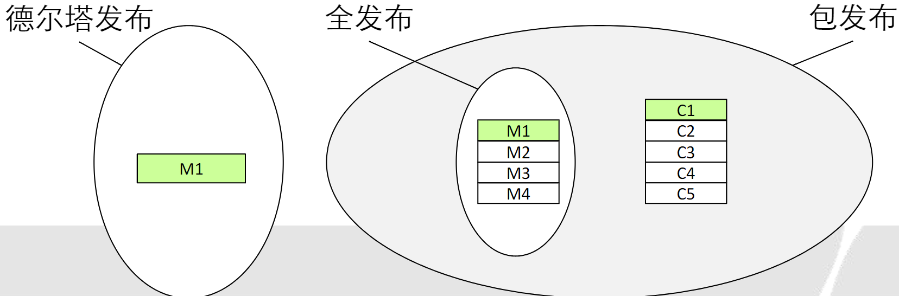
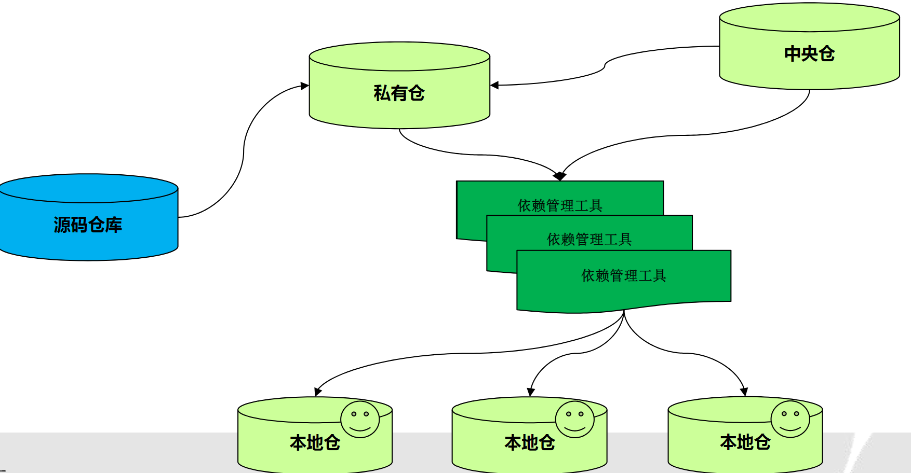

# 配置管理

## 版本控制系统

它是软件项目开发过程中用于储存我们所写的代码所有修订版本的软件。对软件开发进程中文件或目录的发展过程提供有效的追踪手段，保证在需要时可回到旧版本，避免文件丢失、修改的丢失和相互覆盖。

不同于SVN（集中式的版本控制，集中式存在单点故障的风险），Git是一款分布式的版本控制工具，每个用户相当于一个备份。

Git使用了一种类似快照存储的方式来存储项目的整体状态。大多数版本控制系统只关心内容变化了的文件。若文件没有变化，其他版本系统不会记录，Git 而会对未变化的文件的做一链接。

> **差异存储**：会记录每个文件的更改内容，而不是整个文件的副本。
>
> **快照存储**：它会存储整个文件或项目的副本，而不是仅存储更改的部分。

Git基于DAG（有向非环图）的设计比SVN的线性提交提供更好的合并追踪，避免不必要的冲突，提 高工作效率。Git基于对内容的追踪而非对文件名追踪，所以遇到一方或双方对文件名更改时， Git能够很好进行自动合并或提供工具辅助合并。而SVN遇到同样问题时会产生树冲突，解决起来很麻烦。

git操作：

分支本质上是个指向commit对象的可变指针，分支的默认名字为master，每次提交的时候都会自动向前移动。新建分支是新建了一个指针指向当前commit对象。

切换指针是HEAD指针指向不同的分支：

快进式合并(fast forward)：顺着一个分支走下去，可以到达另一个分支的合并过程

非快进式合并(non-fast forward) ：使用两个分支的末端以及它们的共同祖先进行一次简单的三方合并计算的合并过程

分支衍合：和三方合并结果一致，但能产生更简洁的提交历史。适用：在主干分支能干净应用的补 丁。把解决分支补丁同最新主干代 码之间冲突的责任，转化为由提交 补丁的人来解决

分支策略：

- 长期分支。典型示例： master稳定分支；develop测试分支；topic开发分支
- 特性分支。短期的，用来实现单一特性或与其相关工作的分支

## 编译构建

软件编译构建是指把软件源码编译成目标文件，并将目标文件和必要的文档制作成软件包的过程。以Maven工程构建为例，包含：从代码仓库拉取源码、从软件仓库拉取依赖包、编译成目标文件、软件打包、上传软件包等步骤。

由于环境搭建耗时费力，且易因环境差异引入问题，本地硬件配置不高，编译构建速度慢，突发项目资源消耗大，结束后闲置，多语言不能并行构建，可以采用**云端构建**。通过统一平台和调度，为软件企业或者个人按需分配资源，提供软件编译构建服务。

## 自动部署

部署方案比较：（以部署60台机器为例）

- 手工部署：60台x(安装2.5小时+手工配置0.5小时)/台= 180小时
- 需要人工干预的半自动部署：磁盘复制0.5小时+ 60台x(手工配置0.5小时)/台 = 35小时
- 免接触的自动部署：自动部署1小时（同时自动配置）<1小时

> 持续集成(CI)是一种软件开发实践，即团队开发成员经常集成他们的工作，通常每个成员每天至少集成一次，也就意味着每天可能会发生多次集成。每次集成都通过自动化的构建（包括编译，发布，自动化测试)来验证，从而尽快地发现集成错误。
>
> 持续交付(CD)：是一种软件工程手法，让软件产品的产出过程在一个短周期内完成，以保证软件可以稳 定、持续的保持在随时可以释出的状况。它的目标在于让软件的建置、测试与释出变得更快以及更 频繁。这种方式可以减少软件开发的成本与时间，减少风险。**持续交付在持续集成的基础上，将集成后的代码部署到更贴近真实运行环境的「类生产环境」（production-like environments）中**。

### 蓝绿部署

一种以可预测的方式发布应用的技术，目的是减少发布过程中服务停止的时间。需要准备两个相同的环境（基础架构) 

1. 平时在蓝、绿环境通过负载均衡运行业务 
2. 升级前把负载切到绿环境 
3. 升级时在蓝环境中部署新版本，并进行测试。测试完成，把负载切回蓝环境，然后升级 绿环境 
4. 绿化升级测试完成后，系统恢复蓝绿环境共同承担负载

### 灰度发布/金丝雀发布

灰度发布是在原有版本可用的情况下，同时部署一个新版本/金丝雀，测试新版本的性能和表现，以保障整体系统稳定的情况下，尽早发现、调整问题。

步骤

1. 准备好工件，包括：构建工件，测试脚本，配置文件和部署清单文件
2. 从负载均衡列表中移除掉“金丝雀”服务器
3. 升级“金丝雀”应用（排掉原有流量并进行部署）
4. 对应用进行自动化测试
5. 将“金丝雀”服务器重新添加到负载均衡列表中（连通性和健康检查）
6. 如果“金丝雀”在线使用测试成功，升级剩余的其他服务器（否则就回滚）

## 发布管理

发布是由一项或多项经过批准的变更所组成的实施活动。一项发布是指经过测试并导入实际运作环境的一组配置项。发布管理需要确保只有那些经过测试和授权的正确的软件版本和硬件才能提供给IT基础设施。发布管理与配置管理和变更管理活动有密切的联系。

- 重大发布（Major Release） 一般指有重大功能增强的版本发布，也通常会包含多个问题的修复。通常使用主发布版本号进行标识，如 V.1>>V.2>>V.3 
- 小型发布 一般指对问题或缺陷的小的改进或修复的版本发布.通常使用特征版本号进行标识，如V.1.1>>V.1.2>>V.1.3 
- 紧急修复（Emergency Fixes） 一般指对某个问题进行的临时性修复，通常使用缺陷修复版本号进行标识，如V.1.1.1>>V.1.1.2>>V.1.1.3 
- 德尔塔发布（Delta Release） 一种局部增量发布，只包括发生变更的硬件和软件组件。通常在紧急修复或临时修复中使用。其优点是只需花 很少的 时间就能完成测试环境构建；缺点是无法对变更组件以外的环境和依赖组件测试通常不够彻底。 
- 全发布（Full Release） 指同时对发布单元内所有的组件进行构建、测试和分发，包括哪些无需变更的组件。这种发布方式下，软件和硬件将 得到更加彻底的测试，对那些不是完全清楚哪些组件会发生变更的场景特别有用。但是会比德尔塔发布需要更多的准 备工作和资源。 
- 包发布（Package Release） 指一组相关的应用系统和基础设置的全发布和（或）德尔塔发布组成。一般在一个更长的时间维度内进行，它通过修 复小的软件错误以及将多项新的功能有效组合到一起为用户提供更长时间的稳定期。

- Pre-alpha发布： 测试前阶段，包含需求分析、方案设计、编码开发、单元测试等多个活动。期间会构建多个不稳 定软件包进行功能调测 
- Alpha发布：alpha版本是首个软件测试版本，可能不稳定、也可能不包含所有最终版本的特性。开发人员在这个阶段 进行白盒测试后移交给测试团队进行黑盒测试。通常该版本不会面向外部用户测试。 
- Beta发布：beta版本是首个完整特性的软件测试版本，但依然存在较多的功能、易用性、性能等缺陷。通常有内部 beta和开放beta两种方式。内部beta局限于内部测试、演示，会邀请部分用户代表参与但不会大范围开放。开放beta 则面向尽可能多的外部用户开放，用于最终发布前向用户展示宣传产品并通过用户公测发现隐藏问题。 
- RC/Gamma发布： RC版本是预发布版本，所有的计划功能都已完成设计、编码并经过多轮的beta测试同时没有遗留 的严重缺陷。该阶段开发人员仍然可以进行代码修改来修复缺陷等操作。用户代表通常会在此版本进行验收测试及公 测试用。如果没有重大紧急的缺陷出现，RC版本将作为最终版本发布。 
- 最终发布：正式发布版本，面向所有最终用户，开发人员无法再对该版本进行代码修改，只能通过补丁版本修复缺陷 等问题。

## 构件与包管理

软件交付过程中通常产生的构件可以大致分为源码和包文件两种。包文件通常是源码文件的集合或者编译后的产物，因此主要有二进制包和压缩包两种形式。

包文件通常不放在源码库中管理，而是使用专门的包文件仓库（repository）进行存储并配合包文件依赖管理工具（Maven、npm、Ivy等）进行使用。

包文件仓库可以大致分为本地仓库、私服仓库、中央仓库三种。本地仓库是指开发者个人PC中包文件的存储；私服仓库通常是企业为了提升包文件使用性能搭建的局域网内共用的包文件仓库，通常使用开源的Nexus、artifactory等工具搭建；中央仓库是指开源包文件的共享社区。

开发和构建时，开发人员通过包依赖管理工具定义好需要使用的私有及开源包文件，在构建或运行时自动从私服仓库或开原中央仓库中下载依赖包文件来提升开发效率。

Maven是一款跨平台的Apache开源项目管理工具，主要服务于基于Java平台的项目构建、依赖管理和项目信息管理。它奉行约定优于配置（Convention Over Configuration）原则。

Maven的世界中拥有数量庞大的软件构件，在引入坐标概念前没有任何一种统一的方式来唯一标识一个构件，人们要想使用这些构件只能在分散的网站上进行搜索，无法自动化，费时费力。Maven中定义了一组规则：世界上任何一个构件都可以使用maven坐标来唯一标识。

Maven坐标的元素包括：groupId、artifactId、version必须，packaging可选，classifier不能直接定义 

- groupId 定义当前Maven项目隶属的实际组织项目（一个组织项目可能包含多个Maven项目）.该元素表示方式与java包名类似，与反向域名一一对应，如`org.sonatype.nexus`,但通常不建议定于Maven项目对应的组织或公司，因为一个组织或公司下可能会有多个项目。 
- artifactId 定义实际组织项目中的一个Maven项目（模块），通常推荐使用“组织项目名-maven项目名”方式表示以方便后续构件寻找，例如`nexus-indexer`。默认情况下， Maven中生成的构件名称会以artifactId作为开头，如`nexus-indexer-1.2.jar`。 
- version 定义当前Maven项目的所处的版本，如1.0.0；2.0.0。 
- packaging 定义当前Maven项目的打包方式，通常打包方式与所生成构件的文件扩展名相对应，如jar、war。 
- classifier 用来帮助定义构建输出一些附属构件，如`xxx-javadoc.jar`, `xxx-source.jar`。

POM：Project Object Model，Maven工具中一个项目所有的配置都放置在 POM 文件中：定义项目的类型、名字， 管理依赖关系，定制插件的行为等等。 

在 POM 中，groupId,artifactId, packaging, version 叫作 maven 坐标，它能唯一的确定一个构件。有了 maven 坐标， 我们就可以用它来指定我们的项目所依赖的其他项目，插件，或者父项目。 

在 POM 中，依赖关系是在 dependencies部分中定义的。

间接依赖：被使用的依赖包，通常自身还依赖了其他的开源包文件，因此构成了复杂的依赖关系。当你引用此种依赖包时，就产生了对其他依赖包的间接依赖。Maven中提供了依赖传递的特性，通过POM文件实现，当你使用某一依赖包时，它的POM文件会被一同下载，继而将他自身的依赖文件也一并下载下来。