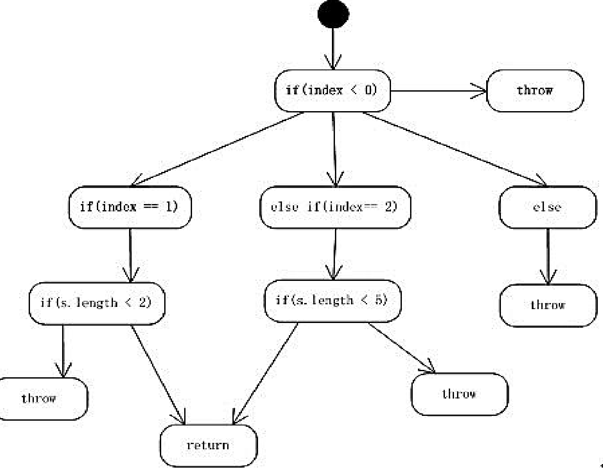

# 测试管理

- 黑盒测试，也可以称为功能测试、数据驱动测试或基于规格说明的测试。 测试者不了解程 序的内部情况，不需具备程序内部知识，只知道程序的输入、输出和系统的功能，这是从 用户的角度针对软件界面、功能及外部结构进行测试，而不考虑程序内部逻辑结构。 包括功能划分 等价类划分 边界值分析 因果分析 错误推测
- 白盒测试，也称结构测试、逻辑驱动测试或基于程序本身的测试。 测试程序的内部结构和 运作，而不是测试应用程序的功能。包括语句覆盖 逻辑覆盖 分支覆盖

- 动态测试通过运行被测程序，检查运行结果与预期结果的差异，并分析运行效率、 正确性和健壮性等性能。这种方法由三部分组成：构造测试用例、执行程序、分析 程序的输出结果。 包括功能测试，接口测试，覆盖率分析，性能分析，内存分析等
- 静态测试是指不运行被测程序本身，仅通过分析或检查源程序的语法、结构、过程、 接口等来检查程序的正确性。包括代码检查 程序结构分析 代码质量度量等

## 单元测试

- 测试最小软件设计单元，确保模块编码正确 
- 单元测试检查特定一段代码的功能，做功能测试 l 在面向对象编程中，单元测试一般在类级别做检查 
- 单元测试由开发者自己编写，检查一些代码分支和边界值，保证功能独立运 行正常

## 自动化功能测试

- 自动化功能测试是指使用特定的软件控制测试执行，比对实际结果和期望结果，完成功能测试
- 可以自动录制功能测试脚本，也可以人工编写自动化测试脚本
- 自动录制功能测试脚本过程就是将人在软件上的操作录制，并转换成自动化工具可以识别的脚本的过程
- 自动化功能测试过程就是回放人对软件的操作的过程，并比对实际结果和期望结果，判定测试是否通过。测试过程中可以用截屏、输出日志等形式记录测试过程。

## 性能测试

- 性能测试为系统增加工作负载，收集性能参数，测试响应性和稳定性，用来研究、测量、检查和验证可伸缩性、可靠性和资源消耗等。性能测试测试软件在系统中的运行性能，度量系统与预定义目标的差距。主要指标包括：业务用户量、响应时间、吞吐量；机器CPU、IO、内存等
- 负载测试：通过逐步增加系统负载，确定在满足性能指标的情况下，系统所能承受的最大负载量。
- 压力测试：通过逐步增加系统 负载，确定在什么负载条件下系统处于失效状态，以此来获得系统能提供的最大服务级别。
- 容量测试：确定系统可处理的同时最大在线用户数，给系统增加超额的负载检查它是否能正确处理。

## 探索测试

- 探索测试是在进行软件测试时，同时学习测试对象，探索开发更多不同种类的测试方法，改善测试流程的一种测试方法。
- 区别于即兴测试（Ad hoc测试），探索测试是一个有思考和学习的测试过程。
- 区别于传统软件测试严格地“先设计，后执行”，探索性测试强调测试设计和测试执行的同时性。

## 兼容性测试

软件兼容性测试是检查程序和硬件及其他软件之间的兼容性的测试

## 代码检查

代码检查分为静态分析和动态分析（本课程主要介绍静态分析） 

- 静态分析（Static Program Analysis）：在不运行计算机程序的条件下， 进行程序分析的方法。大部分的静态程序分析的对象是针对特定版本的源代 码，也有些静态程序分析的对象是目标代码。 
- 动态分析（Dynamic Program Analysis）：在运行计算机程序的条件下， 进行程序分析的方法。

静态分析常用技术：

- 词法分析：从左至右一个字符一个字符的读入源程序，对构成源程序的字符 流进行扫描，通过使用正则表达式匹配方法将源代码转换为等价的符号 (Token) 流，生成相关符号列表。
- 语法分析：判断源程序结构上是否正确，通过使用上下文无关语法将相关符号整理为语法树。
- 抽象语法树分析：将程序组织成树形结构，树中相关节点代表了程序中的相 关代码。 
- 语义分析：对结构上正确的源程序进行上下文有关性质的审查。 
- 控制流分析：生成有向控制流图，用节点表示基本代码块，节点间的有向边 代表控制流路径，反向边表示可能存在的循环；还可生成函数调用关系图， 表示函数间的嵌套关系。
- 数据流分析：对控制流图进行遍历，记录变量的初始化点和引用点，保存切 片相关数据信息。 
- 污点分析：基于数据流图判断源代码中哪些变量可能受到攻击，是验证程序 输入、识别代码表达缺陷的关键。 
- 无效代码分析：根据控制流图可分析孤立的节点部分为无效代码。

## 代码重复

代码重复 (duplicate code) 在程序设计中表示一段源代码在一个程 序，或者一个团体所维护的不同程序中重复出现，是不希望出现的现 象。为避免巧合，只有一定数量的代码完全相同才能判定为代码重复。

## 代码风格

代码风格 (Programming style) 即程序开发人员所编写源代码的书写风格， 良好代码风格的特点是使代码易读。 代码风格的要素包括（但不限于）以下几点: 名字的使用（驼峰式大小写、标识符命名约定、匈牙利命名法）；表达式与语句；常量的使用；注释的使用；缩进代码的布局

## 圈复杂度

圈复杂度 (Cyclomatic complexity) 是一种代码复杂度的衡量标准。通常使用的计算公式是：
$$
V(G) = e - n + 2
$$

- e 代表在控制流图中的边的数量（对应代码中顺序结构的部分）
- n 代表在控制流图中的节点数量，包括起点和终点（1、所有终点只计算一次，即便有多个return或者throw；2、节点对应代码中的分支语句）

```java
public String case1(int index, String string) {
    String returnString = null;
    if (index < 0) {
    	throw new IndexOutOfBoundsException("exception <0 ");
    }
    if (index == 1) {
        if (string.length() < 2) {
        	return string;
        }
        	returnString = "returnString1";
    } else if (index == 2) {
        if (string.length() < 5) {
        	return string;
        }
        	returnString = "returnString2";
    } else {
    	throw new IndexOutOfBoundsException("exception >2 ");
    }
    return returnString;
}
```



虽然图上的真正节点有12个，但是其中有5个节点为throw、return，这样的节点为end节点，只能记做一个。根据公式 V(G) = e - n + 2 = 12 - 8 + 2 = 6 。
