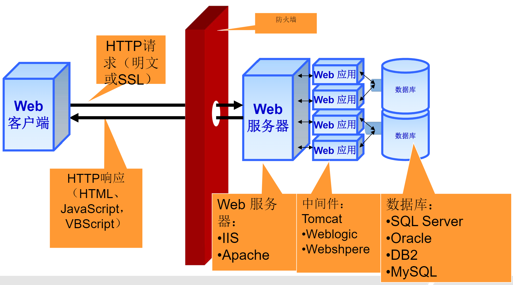
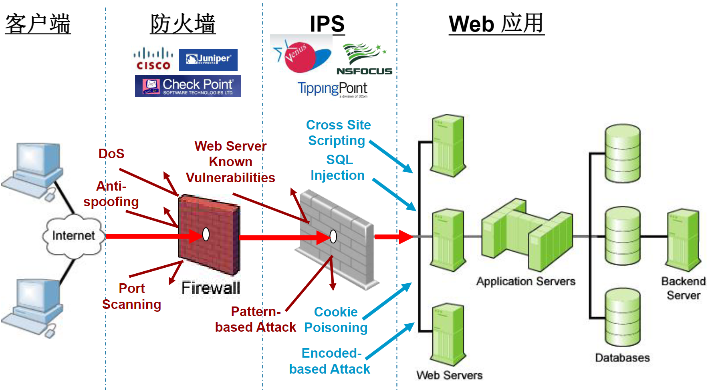
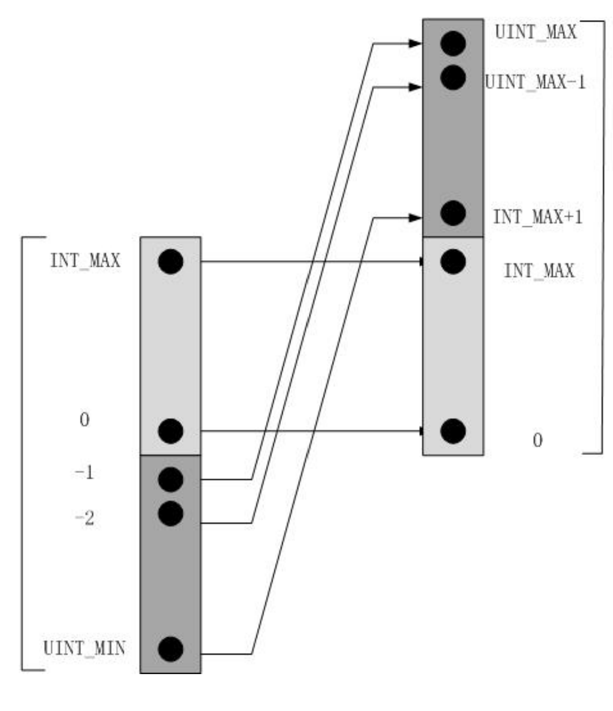
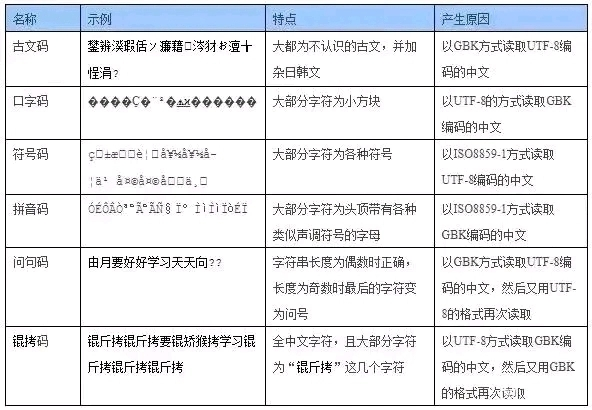
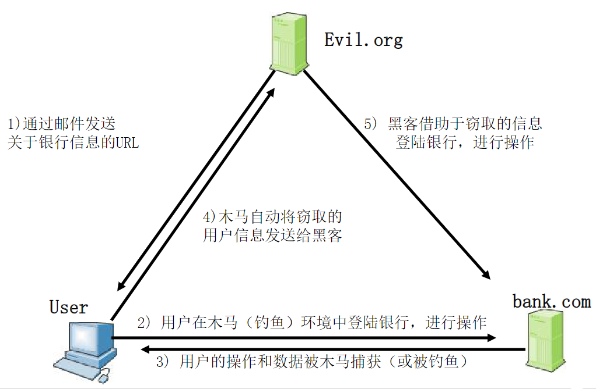

# 安全

软件安全（Software Security）：将开发的软件存在的风险控制在可接受的水平，以保证软件的正常运行。

安全编码(Secure Coding)：是用于防止安全漏洞的规则和指南，可以防止、检测和消除可能危及软件安全的错误。

Web应用系统体系架构：



网站安全常见问题 

- 网络层面 拒绝服务、IP欺骗、ARP欺骗、嗅探 
- 系统层面 软件框架漏洞攻击(Struts2、OpenSSL)、配置错误 
- 应用层面 代码缺陷（SQL注入、XSS、CSRF ......） 信息泄露 拒绝服务、CC攻击 钓鱼、业务流程缺陷



## 常见编程错误

整数溢出：当算术运算试图创建一个超出可用位数表示范围（大于最大值或小于最小值）的数值时，就会发生整数溢出错误。



```cpp
short i=-3;
unsigned short ui=i;  // 65533
```

```cpp
unsigned int ui = pow(2, 32)-1;  // 4294967295
char c = -1;
cout << (c == ui) << endl;  // 1
// 带符号整型与无符号整型进行比较会发生整型类型隐式转换。带符号整型将转换成相应的无符号整型。
```

```cpp
size_t s = sizeof(int);
while(--s >= 0) {
	printf("%d",s);
}  // 死循环！size_t为无符号数！
```

```cpp
char c1='a';  // 97
char c2='b';  // 98
char c3=c1+c2;  // 195, 但是c3是char类型，一字节，-128~127,所以输出-61

// 整型数据参与运算时，如果参与运算的所有整型数据都小于int类型，
// 那么小于int类型的数据都自动提升为 int；
// 如果参与运算的所有整数数据不都小于int类型，
// 那么小于int类型的数据都自动提升为unsigned int
```

```java
long c=2*Integer.MAX_VALUE;
// 修改建议：算术运算操作时，可能会造成存储中间值的临时变量溢出，从而导致运算结果错
long c=(long)2*Integer.MAX_VALUE;
```

```cpp
// 误用short引起缓冲区溢出
void test(char *c)
{
    short s = strlen(c);  //纠错建议：size_t s = strlen(c);
    char buf[256];
    cout<<"strlen(c)="<<strlen(c)<<endl;  // strlen(c)=34999
    cout<<"s ="<<s<<endl;  // s =-30537
    cout<<"max_buf=256"<<endl;
    if(s < 256)	strcpy(buf,c);
    else cout<<"overflow!"<<endl;
}

void main()
{
    char *c = new char[35000];
    memset(c,'c',35000);
    c[35000-1] = '\0';
    test(c);
}
```

```cpp
// 表达式中对同一变量多次写入问题
int num = 18;
num = ((28 * ++num) * (num = get())) + (num > th[0] ? 0 : -2);
```

```cpp
// 空字符结尾错误问题
char s1[5],s2[5],s3[10];
strcpy (s1 , "abcde");
strcpy (s2 , "abcde");
strcpy (s3 , s1);
strcat (s3 , s2);
// C和C++中字符串常量以"\0"结束。建议空间开大一点
```

```cpp
// 无界字符串复制问题
void get_out_of_bound(void) {
    char source[8];
    puts("Please input a string: ");
    gets(source);  // fgets(source,sizeof(source),stdin);
    return;
}
void main(){
	get_out_of_bound();
}
```

```cpp
// 定长字符串越界问题
char source2[] = "abcde";
char source1[5]; // char * source1= (char *)malloc(strlen(source2)+1);
char *p;
int i;
strcpy (source1 , source2);
p = (char*)malloc(strlen(source1));  // p = (char*)malloc(strlen(source1)+1);
for (i = 1; i<= 6; i++)  // for (i = 0; i<5; i++)
	p[i] = source1[i];
p[i] = '\0';
printf("p = %s", p);
```

```cpp
// 字符串截断问题
char str[10];
// 纠错建议，在此添加cin.width(10);
cin >>str;
// 当源字符串内容长度大于目标字符串内容长度时，源字符串向目标字符串拷贝会发生字符串截断错误
```

```cpp
// 与函数无关的字符串错误问题
void str_copy(char* pstr)
{
    char str[10];
    int index = 0;
    // 纠错建议：在while循环复制之前首先判断源串长度
    // if(strlen(pstr)>= sizeof(str))
    while(pstr[index] != '\0') {
        str[index] = pstr[index];
        index++;
    }
    str[index] = '\0';
    printf("str = %s\n" , str);
}
```

```cpp
// 字符串比较错误
char *str1 = "abcde";
char str2[6];
strcpy(str2, str1);
if (str1 == str2) printf("1\n");  // if (*str1 ==*str2)
else printf("0\n");
```

```java
String name1 = new String("tom");
String name2 = new String("tom");
if(name1 == name2) System.out.println("name1==name2");  
// if(name1.equals(name2))
else System.out.println("name1 !=name2");
```

```java
// 数组越界问题
int array[ ]={34 , 44 , 21 , 90};
for(int index = 0 ; index<=array.length ; index++)  // 应该是 <
	System.out.println(array[index]);
```

```cpp
// 数组定义和值初始化括号形式混淆错误
int *array = new int(10);  // int *array = new int[10];
for(int index = 0 ; index <10 ; index++)
	array[index] = index * index;
delete []array;
```

```cpp
// 未正确区分标量和数组问题
Obj *obj = new Obj[5];  // Obj *obj = new Obj(5);
delete obj;
obj = new Obj(5);  // obj = new Obj[5];
delete[] obj;
```

```cpp
// 二维数组的内存泄露
int **array = new int*[5];
for(int index = 0 ; index < 5 ; index++)
	array[index] = new int[4];
/*
for(int cols = 0 ; cols <4 ; cols++)
	delete[] array[cols];
*/
delete[] array;
// 对二维数组的内存空间释放，不仅要对行进行释放，而且也要对列进行释放
```

```cpp
// 释放指针指向的对象引起内存泄漏
class Person{
public:
    int age;
    Person() : age(23){ }
};

int main(){
    vector<Person*> personVector;
    for(int i=0; i<5; i++)
    	personVector.push_back(new Person);
    for(int i=0; i<personVector.size(); i++)
    	cout << (personVector[i])->age << endl;
    personVector.clear();
    // for(int i=0; i<personVector.size(); i++) 
    //    delete personVector[i];
}
```

```cpp
// 指针变量的传值和传址混淆问题溢出
void change(int* q) {  // void change(int *&q)
    if(q == NULL) q = new int(20);
}
int main() {
    int *p = NULL;
    change(p);
    printf("%d\n" , *p);
}
```

```java
// 验证方法参数问题
private Object state = null;
void setState(Object state) {
    /*
    if(state == null) {
        // Handle null State
        return;
    }
    if(!isInvalidState(state)) {
        // Handle Invalid State
        return;
    }
    */
	this.state = state;
}
```

```cpp
// 函数退出时内存未释放问题
int test(char *src) {
    char *dest = new char[10];
    if(src ==NULL) return 0;  // delete[] dest;
    strncpy(dest , src , 10);
    delete [] dest;
    return 1;
}
```

```cpp
// 程序异常退出时未关闭已打开文件
const char *file1 = "test.txt";
const char *file2= "test.bat";
FILE *fp1 = fopen(file1, "r");
if(!fp1) {
    fprintf(stderr, "Can not open %s.\n",file1);
    return -1;  // fclose(fp1);
}
FILE *fp2 = fopen(file2, "r");
if(!fp2) {
    fprintf(stderr, "Can not open %s.\n",file2);
    return -1;  // fclose(fp1); fclose(fp2);
}
fclose(fp1);
fclose(fp2);
```

```cpp
// 写文件没有调用fflush
int main(){
    FILE *file = fopen("test.txt","w");
    fprintf(file, "%s", "hello world");
    // fflush(file);
    fclose(file);
    return 0;
}
```

```java
// 临时文件未删除问题
public class TestTempFile {
    public static void main(String[] args) throws IOException {
        File tempFile = new File("tempfile.tmp");
        if(tempFile.exists()) {
            System.out.println("The tempfile.tmp already exists. ");
            // tempFile.delete();
            return;
        }
        FileOutputStream fos = null;
        try {
            fos = new FileOutputStream(tempFile);
            String str = "data";
            fos.write(str.getBytes());
            //...
        }
        finally {
            if(fos != null) {
                try {
                	fos.close();
                }
                catch(IOException e) {
                	// handle error
                }
            }
        }
    }
}
```

```java
// 敏感信息硬编码问题
class IPAddressTest {
    String ipAddress = "178.18.254.1";  // 纠错建议:将信息代码保存在属性文件中
    // String ipAddress=ResourceBundle.getBundle("message").getString("ip");
    public static void main(String[] args) {
    // ...
    }
}
```

```cpp
// 引用未初始化的内存错误问题
void init_func(int *q , int size) {
    int *p = (int *)malloc(size * sizeof(int));
    // int *p = (int *)calloc(sizeof(q), sizeof(int));
    for(int i = 0 ; i<size ; i++) p[i] += q[i];
	// ...
}
//malloc：不能初始化所分配的内存空间，在动态分配完内存后，里边数据是随机的垃圾数据。
//calloc：能初始化所分配的内存空间，在动态分配完内存后，自动初始化该内存空间为零。
// 总结: malloc函数分配的内存并未进行初始化，未初始化的内存可能导致信息泄漏的潜在风险
```

```cpp
// 引用已释放内存的错误问题
for(p=head; p!=NULL; p=p->next)
	free(p);
/*
for(p = head ; p ! =NULL ; p = q){
    q = p->next;
    free(p);
}
head = NULL;
*/
```

```cpp
// 不匹配的内存管理函数问题
int *number = new int(10);
free(number)  // delete number;
number = static_cast<int*> (malloc(sizeof(int)));
delete number;  // free(number);
// malloc/free函数与new/delete操作符必须正确配对使用
```

```java
// 在嵌套类中暴露外部类的私有字段问题
class Point {
    private int x;
    private int y;
    public class Operate {
        // private void getPoint()
        public void getPoint() {
        	System.out.println("x=" + x + ", " + "y=" + y);
        }
    }
    public class TestPoint {
        public static void main(String[] args) {
            Point p = new Point();
            Point.Operate po = p.new Operate();
            po.getPoint();
        }
    }
}
```

```cpp
// 构造函数中抛出异常引发错误
class Person {
private:
    char *name;
    int age;
public:
    Person() {
        name = new char[10];
        age = -1;
        if(age<0||age>100) {
        	//纠错建议：delete[] name;
        	throw exception("age is error.");
        }
    }
    ~Person() {
        delete[ ] name;
    }
};

int main() {
    try {
    	Person per;
    }
    catch(const exception& e) {
    	cout << "异常捕获成功" <<endl;
    }
}
```

```java
OutputStream stream = null;
try{
	stream = new FileOutputStream("myfile.txt");
for (String property : propertyList) {
	// ...
}
}catch(Exception e){
	// ...
}finally{
	stream.close();
    // 保证FileOutputStream在任何情况下都会被关闭，避免资源泄漏甚至更严重的后果。
}
```

```java
public static String decodeString(String method, String content) {
    // ...
    content = java.net.URLDecoder.decode(content, "UTF-8");
    // 注意！避免给函数的参数重新赋值
    // ...
    return content;
}
```

```java
ypedQuery q = em.createQuery(String.format("select * from Users where name = %s", username), UserEntity.class);
// 容易被SQL注入攻击！
```

```java
// 字符乱码问题
InputStream is = System.in;
System.out.println((char)is.read());
// InputStreamReader is = new InputStreamReader(System.in);
```

> Web应用程序中，经常会出现一些乱码问题，下面列出常见的几种乱码
> 情况：
>
> 1. 字符串在解码时的字符集与编码字符集不一致时，汉字会变为乱码。
> 2. 中文在经过不支持中文的ISO-8859-1编码后，其字符会变成"?"
>
> 

## SQL注入

SQL注入：通过把SQL命令插入到Web表单或输入域名或页面请求的查询字符串，最终达到欺骗服务器执行恶意的SQL命令的目的。

```java
String query = "SELECT * FROM users WHERE name='" + userName + "' AND pwd='" + pwd + "'";
```

填入用户名`jsmith' or 1=1--`，密码`a`

```sql
SELECT * FROM users WHERE name = 'jsmith' or 1=1 --' AND pwd='a'
```

填入用户名`jsmith'; UPDATE user set phone='111-111-1111' --`，密码`a`

```sql
SELECT * FROM users WHERE name='jsmith'; UPDATE user set phone='111-111-1111' --' AND pwd='a'
```

填入用户名`jsmith' ; drop table discounts--`，密码`a`

```sql
SELECT * FROM users WHERE name='jsmith' ; drop table discounts--'AND pwd='a'
```

如何编码中避免SQL注入：1、内置过滤系统（建立黑名单）2、严格限定参数类型3、明确参数检验的边界，必须在服务端执行数据验证4、采用参数化查询的方法5、存储过程6、严格检查用户输入，注意特殊字符7、转义用户输入内容

## 失效的验证和会话管理

用户凭证和Session ID是Web应用中最敏感的部分，也是攻击者最想获取的信息。

> 一位用户在公用电脑上没有登出他访问的网站，导致下一位使用者可以看到他的网站会 话内容。 
>
> 登录页面没有进行加密，攻击者通过截取网络包，轻易发现用户登录信息。

主要防范措施： 用户密码强度（普通：6字符以上；重要：8字符以上；使用多种验证方式） 不使用简单或可预期的密码恢复问题； 登录出错时不给过多提示； 密码传输时采用加密形式传输； 登录页面需要SSL加密； 对多次登录失败的帐号进行短时锁定； 设置会话闲置超时； 保护Cookie； 不在URL中显示Session ID

## 跨站脚本XSS

Cross-Site Scripting（XSS）。攻击者通过向Web页面里插入恶意html代码，当用户浏览该页之时，嵌入其中Web里面的html代码会被执行，从而达到恶意用户的特殊目的。

危害包括：盗取cookie信息；篡改用户浏览的正常内容，伪造页面信息；把你重定向到一个恶意站点，网站挂马；利用浏览器的漏洞控制你的机器



措施：严格检查用户输入。尽量限制在HTML代码中插入不可信的内容（可被用户输入或修改的内容）。对于需要插入的不可信内容必须先进行转义（尤其对特殊字符、语法符合必须转义或重新编码）。

## 不安全的直接对象引用

服务器上具体文件名、路径或数据库关键字等内部资源被暴露在URL或网页中，攻击者可以此来尝试直接访问其他资源。

> 示例：某网站的新闻检索功能可搜索指定日期的新闻，但其返回的URL中包含了指定日 期新闻页面的文件名
>
> ```
> http://example.com/online/getnews.asp?item=20March2003.htm
> ```
>
> 攻击者可以尝试不同的目录层次来获得系统文件win.ini
>
> ```
> http://example.com/online/getnews.asp?item=../../winnt/win.ini
> ```

主要防范措施：避免在URL或网页中直接引用内部文件名或数据库关键字可使用自定义的映射名称来取代直接对象名，如`http://example.com/online/getnews.asp?item=11`。锁定网站服务器上的所有目录和文件夹，设置访问权限验证用户输入和URL请求，拒绝包含./或../的请求

## 安全配置错误

管理员在服务器安全配置上的疏忽，或者采用默认配置，通常会导致攻击者非法获取信息、篡改内容，甚至控制整个系统。

例如服务器没有及时安装补丁，网站没有禁止目录浏览功能，网站允许匿名用户直接上传文件，服务器上文件夹没有设置足够权限要求，允许匿名用户写入文件，Web网站安装并运行并不需要的服务，比如FTP或SMTP，出错页面向用户提供太过具体的错误信息，比如call stack，Web应用直接以SQL SA帐号进行连接，并且SA帐号使用默认密码，SQL服务器没有限制系统存储过程的使用，比如xp_cmdshell

## 敏感信息泄漏

对重要信息不进行加密处理或加密强度不够，或者没有安全的存储加密信息，或者在传输的时候没有采用加密措施，都会导致攻击者获得这些信息。

> 例如：对于重要信息，如密码等，直接以明文写入 数据库使用自己编写的加密算法进行简单加 密,简单地使用MD5, SHA-1等散列算法将加密 信息和密钥存放在一起

主要防范措施：对所有重要信息进行加密，使用MD5, SHA-1等Hash算法时候采用加盐存储的方式，产生的密钥不能与加密信息一起存放，严格控制对加密存储的访问

## 功能级访问控制缺失

某些Web应用包含一些“隐藏”的URL，这些URL不显示在网页链接中，但管理员可以直接输入URL访问到这些“隐藏”页面。如果我们不对这些URL做访问限制，攻击者仍然有机会打开它们。

> 某商品网站举行内部促销活动，特定内部员工可以通过访问一个未公开的URL链接登录公司网站，购买特价商品。此URL通过某员工泄露后，导致大量外部用户登录购买。

主要防范措施：对于网站内的所有内容（不论公开的还是未公开的），都要进行访问控制检查。只允许用户访问特定的文件类型，比如.html, .asp, .php等，禁止对其他文件类型的访问。考虑一下管理权利的过程并确保能够容易的进行升级和审计

Web UI设计时，功能级别的验证是通过用户的访问权限而定，应用程序需要在每个功能 被用户访问时，都要在服务端验证该用户是否拥有其访问控制权限。如果忽视了验证步骤， 攻击者就可能伪造请求，在未经授权的情况下访问这些功能。

纠错建议：如果用户没有某个功能访问权限，应将按钮设计为不可见，而不是disabled。

## 跨站请求伪造CSRF

攻击者构造恶意URL请求，然后诱骗合法用户访问此URL链接，以达到在Web应用中以此用户权限 执行特定操作的目的。 和XSS的主要区别是：XSS的目的是在客户端执行脚本； CSRF的目的是在Web应用中执行操作。

> Internet Explorer 3.0 到 6.0 版本支持以下 HTTP 或 HTTPS URL 语法：
>
> ```
> http(s)://username:password@server/resource.html
> ```
>
> 黑客制作一个国内各种路由的默认IP和默认密码构造一个Http Authentication Url暴力登陆脚本。

主要防范措施： 避免在URL中明文显示特定操作的参数内容使用同步令牌 （Synchronizer Token）,检查客户端请求是否包含令牌及其有效性。检查Referer Header，拒绝来自非本网站的直接URL请求

## 未验证的重定向和跳转

攻击者可能利用未经验证的重定向目标来实现钓鱼欺骗，诱骗用户访问恶意站点。攻击者可能利用未经验证的跳转目标来绕过网站的访问控制检查。

> 利用重定向的钓鱼链接：
>
> ```
> http://example.com/redirect.asp?=http://malicious.com
> ```
>
> 利用跳转绕过网站的访问控制检查：
>
> ```
> http://example.com/jump.asp?fwd=admin.asp
> ```

主要防范措施：尽量不用重定向和跳转对重定向或跳转的参数内容进行检查，拒绝站外地址或特定站内页面。不在URL中显示目标地址，以映射的代码表示`http://example.com/redirect.asp?=234`

## 表单重复提交问题

几个方面：一是提交表单后在当前页面点击浏览器上的"后退"按钮，此时会回到之前的页面，然后再次提交表单造成重复提交；二是用户提交表单后，在当前页面点击浏览器上的"刷新"按钮或者直接按F5功能键完成重复提交；三是通过恶意程序来重复发送恶意请求。

纠错建议是使用令牌（token）机制。在添加页面中加入token的隐藏域，用于后面步骤判断，提交表单后，对token值进行判断，判断过后，需要对token值重新生成并保存。令牌相等时，才进行业务的逻辑处理

## 输入数据有效性校验

```java
//电子信箱地址格式有效性校验
public static boolean checkEmail(String email) {
    boolean flag = false;
    try {
        String check ="^([a-z0-9A-Z]+[-|\\.]?)+[a-z0-9A-Z]@([a-z0-9A-Z]+(-[a-z0-9A-Z]+)?\\.)+[a-zA-Z]{2,}$";
        Pattern regex = Pattern.compile(check);
        Matcher matcher = regex.matcher(email);
        flag = matcher.matches();
    } catch (Exception e) {
        LOG.error("验证邮箱地址错误", e);
        flag = false;
    }
    return flag;
}

//手机号码格式有效性校验
public static boolean isMobileNO(String mobiles) {
    boolean flag = false;
    try {
        Pattern p = Pattern.compile("^((13[0-9])|(15[^4,\\D])|(18[0,5-9]))\\d{8}$");
        Matcher m = p.matcher(mobiles);
        flag = m.matches();
    } catch (Exception e) {
        LOG.error("验证手机号码错误", e);
        flag = false;
    }
    return flag;
}
```

