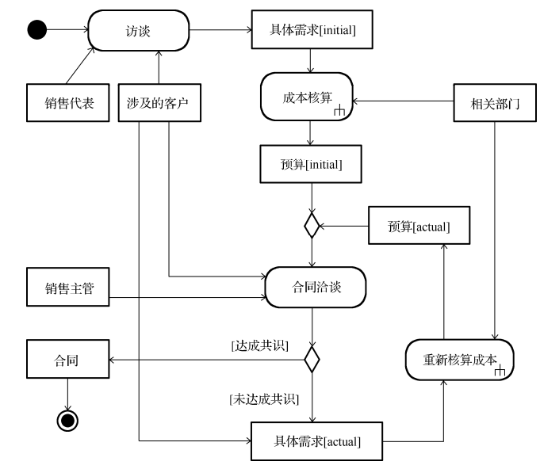
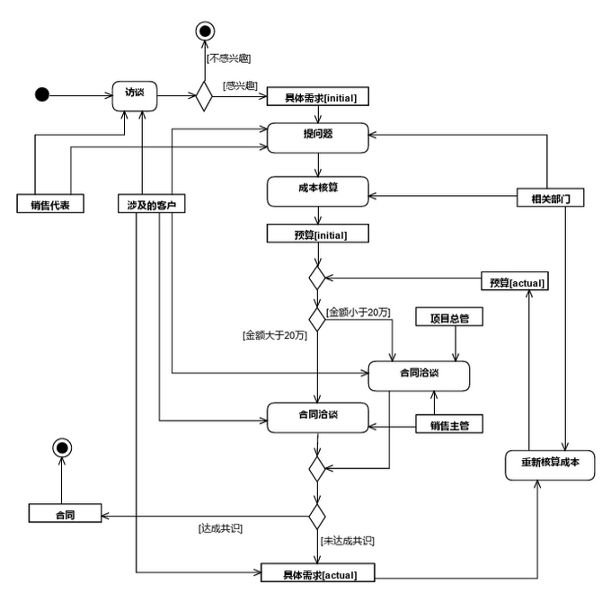

# 补充内容

## 软件工程定义（IEEE）

1. 将系统化、规范化、可量化的工 程原则和方法，应用于软件的开 发、运行和维护。
2. 对其中方法的理论研究。

主要目标：高效开发高质量软件，降低开发成 本。

## Kruchten的4+1视图

1. 逻辑视图
2. 进程视图
3. 开发视图
4. 物理视图
5. 用例视图

## 总结敏捷生命周期模型与传统瀑布模型主要的不同点及适用情况

敏捷生命周期更强调开发团队与业务专家之间的紧密协作、面对面沟通、频繁交付新的软件版本、紧凑而自我组织型的团队，能够很好地适应需求变化的代码编写和团队组织方法，也更注重软件开发中人的作用。

遵循的原则包括：个体和互动胜过流程和工具；工作的软件胜过详尽的文档；客户合作胜过合同谈判；响应变化胜过遵循计划。

敏捷生命周期模型更适合规模中小、需求变化频繁的系统开发，强调团队的作用，所以更适合集中式的开发模式。

## 用例与功能的区别

用例是指用户通过系统完成的有价值的目标，而不是一个具体的功能。

例如用户按下计算器上的“-”键这是一项功能，用户按下“3-2=”的序列并计算出结果，这是一个用例。

一个用例是用户与系统的完整交互，不同的用例可能会涉及相同的功能组合，但意义却不同。

## DevOps的基本原理和任务

DevOps由开发和运维两个单词组成，源于敏捷开发。它是一组过程方法与系统的统称，用于促进开发技术运营和质量保证部门之间的沟通、协作与整合。

DevOps提倡开发和运维之间的高度协同，打通开发和运维之间的部门墙，实现全生命周期的工具全链路打通与自动化和跨团队的线上协作能力，从而全面提高生产环境的可靠性、稳定性、弹性和安全性。

## 活动图修改

活动图描述了合同签订的流程，对其进行扩展， 满足以下需求。

1. 客户对销售的产品并不感兴趣。
2. 对于金额小于 20 万元的合同，在合同洽谈的过程中需要部门经理的参与，考虑到项目管理 的费用， 由他们决定是否按照当前的合同金额签订合同。
3. 相关部门在成本核算前会提出一些问题， 需要销售人员向客户询问， 井澄淸结果。

## 维护分类

- 纠错性维护 识别并纠正潜藏的错误，改进性能缺陷。 
- 适应性维护 适应软硬件环境变更。 
- 完善性维护 针对⽤户对软件产品提出的新需求所进⾏的维护。 
- 预防性维护 为了提⾼软件的可维护性和可靠性。

## 软件⼯程三要素

⽅法、⼯具、过程。

## ⾯向数据流的设计⽅法

⾯向数据流的设计⽅法的⽬标是给出设计软件结构的⼀个系统化的途径。⾯向数据流的设计⽅法定义了⼀些不同的 “映射”，利⽤这些映射可以把数据流图变成软件结构。

变换流的中⼼被称作变换中⼼。事务流的中⼼被称作事务中⼼。

## 模块的内聚性

内聚程度由上到下：

- 功能内聚 ⼀个模块内所有处理元素属于⼀个整体，完成⼀个单⼀的功能。
- 顺序内聚 ⼀个模块内的处理元素与同⼀个功能密切相关，并且这些处理必须顺序执⾏。 例如数据流图确定的模块划分。 
- 通信内聚 ⼀个模块中所有元素都是⽤同⼀个输⼊ 数据和（或）产⽣同⼀个输出数据。 
- 过程内聚 ⼀个模块内的处理元素相关，⽽且必须以特定次序执⾏。 例如流程图确定的模块划分。 
- 时间内聚 ⼀个模块包含的任务必须在同⼀时间段内执⾏。 例如模块完成各种初始化⼯作。 
- 逻辑内聚 ⼀个模块完成的任务在逻辑上属于相同或相似的⼀类。 例如⼀个模块产⽣各种类型的全部输出。 
- 偶然内聚 松散的关系。 例如在写完⼀个程序之后，发现⼀组语句在两处或多出出现，于是把这些语句作为⼀个模块以节省内存。

## 模块的耦合性

- 数据耦合 低耦合 
- 控制耦合 中耦合 
- 公共耦合 ⾼耦合（两个或多个模块通过⼀个公共数据环境相互作⽤） 
- 内容耦合 最⾼耦合（⼀个模块访问另⼀模块的内部数据、⼀个模块有多个入口等）

## 面向对象模型

- 功能模型，表明了系统中数据之间的依赖关系，以及有关的数据处理功能，它由⼀组数据流图组成。 
- 对象模型
- 动态模型