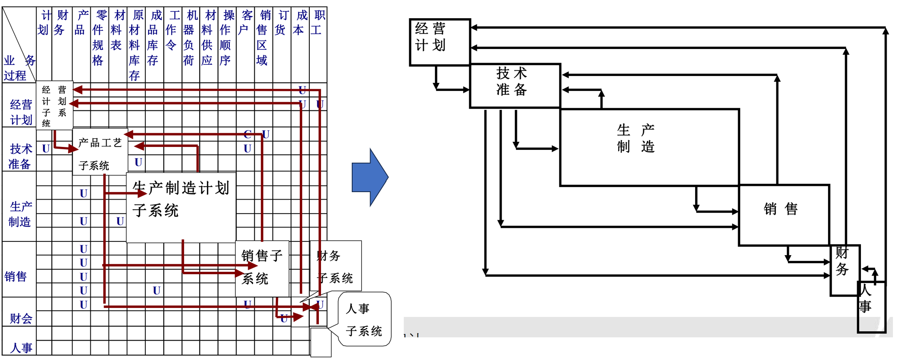

# 规划

系统规划指根据组织的战略目标和用户提出的需求，从用户的现状出发，经过调查，对所要开发信息系统的技术方案、实施过程、阶段划分、开发组织和开发队伍、投资规模、资金来源及工作进度，用系统的、科学的、发展的观点进行全面规划。

系统规划步骤：

组织队伍：

- 客户是指投资系统开发项目的人员，是系统所有者。
- 对于大中型的信息系统，系统所有者通常是中高层经理；对于小型系统，系统所有者可能是中层经理或主管。
- 对于大型的、至关重要的项目，可以成立一个监督委员会。这个委员会是由客户和其他关键的高级管理人员组成，这些高级管理人员具有该组织战略方向的远见卓识，他们强烈希望项目能够成功。
- 项目经理：必须具备较强的专业知识，具备沟通技巧，了解团队人员的组成，还需要知道如何对团队分工，学会根据项目特性选择最适合的语言和工具，不能有任何偏执。
- 产品经理：必须具有产品管理能力。这是一项非常重要的技能，产品经理需要融合技术和市场趋势，知道未来大家需要什么，使开发的产品实现技术和市场上的引导作用，他们还要快速学习技术并融合起来做很好的演示。  
- 系统分析师：是抽象模型的建立者，他们需要专业的概念模型知识和基础编程技巧。杰出的系统分析师会利用编程技巧来辅助建立概念模型。
- 程序员：处于技术成长历程的最下端。他们需要熟练掌握各种语言技巧，知道技巧适用性还要对资源做出最恰当安排。  
- 架构设计师：是程序员的最终归属，也是成长链中最神圣的一环。架构设计师对整个项目的贡献非常大。架构设计师彻底摆脱了语言的束缚，身兼百家之长，熟悉很多语言的精髓；知道软件发展趋势，会开发新一代产品或制订新一代产品的方案，知道各种软件产品特性。架构设计师会根据这些特性做出非常好的产品。另外，杰出的架构设计师具有创新技巧的本领。  
- 系统设计师：应当对“系统结构”所使用的软件技术非常了解。如果自身具备良好编程技巧，才会成为优秀的系统设计师。系统设计师的职责是把结构模型对应到实现模型，作用非常重要。在从概念到实现期间规划和组合模型的优劣是决定系统设计师好坏的标准。

## U/C矩阵

U/C矩阵是用来表达过程与数据两者之间的关系。矩阵中的列表示数据类，行表示过程，并以字母U（Use）和C（Create）来表示过程对数据类的使用和产生。

利用U/C矩阵方法划分子系统的步骤如下。

1. 用表的行和列分别记录下企业住处系统的数据类和过程。表中功能与数据类交叉点上的符号Ｃ表示这类数据由相应功能产生，Ｕ表示这类功能使用相应的数据类。
2. 对表做重新排列，把功能按功能组排列。然后调换“数据类”的横向位置，**使得矩阵中Ｃ最靠近对角线**。
3. 将Ｕ和Ｃ最密集的地方框起来（字母C应该尽量被圈入方框内），给框起个名字，就构成了子系统。落在框外的Ｕ说明了子系统之间的数据流。这样就完成了划分系统的工作。

注意点：

- 在U-C矩阵中每一个主题数据库中的数据，都必须至少由一个过程产生
- 如果某一数据库只被某些业务过程所使用而没有业务过程产生它，就说明可能有被遗漏的业务过程
- 如果某一数据库由多个过程产生，规划人员可以根据实际管理需求来考虑是否应将有关的主题数据库分成多个数据库
- 尽量使数据库由一个过程产生，被多个过程使用，从而可以保证数据库数据的完整性和一致性

## 诺兰模型

诺兰（Nolan）总结了这一规律，于1973年首次提出了信息系统发展的阶段理论，被称为诺兰阶段模型。到1980年，诺兰进一步完善该模型，把信息系统的成长过程划分为六个不同阶段： 

1. 初装：购置第一台计算机并初步开发管理应用程序
2. 蔓延：信息系统从少数部门扩散到多数部门
3. 控制：无序发展，引起领导重视，对整个企业的信息系统建设统筹规划
4. 集成：建立集中式的数据库及能够充分利用和管理各种信息的系统
5. 数据管理：数据的集中利用，为管理提供决策依据
6. 成熟：能满足各管理层次的要求，从而真正实现信息资源的管理

诺兰模型可以诊断信息系统当前所处的阶段：选择信息系统开发的时机；对系统的规划作出安排：控制系统发展的方向，并且对处于不同阶段上的各个子系统制定不同的发展策略。

## 能力成熟度模型

**能力成熟度模型(Capability Maturity Model, CMM)**是用来评估组织的信息系统开发以及管理过程和产品的成熟度等级的框架。它由5个开发成熟度等级构成，利用一组被称为关键过程领域的指导方针进行度量。

- 初始级（Level 1 Being） 指企业的过程是非结构化的，无序、不可预测的，且没有一种明确的组织过程管理方法。没有特定的质量成果和目标，知识和经验随个人走动离开企业。在这个级别下，系统、服务和产品并没有被很好地管理，实现的客户价值和内部目标都无法得到保证。
- 可重复级/已管理级（Level 2: Managed） 指企业已建立了一些基本的项目管理方法，业务工作量已经可以预测，有些过程已经标准化。管理方案、沟通和进度计划能够在相应的项目中得到得到用好，有些不成熟的需求已经得到朝向稳定方向的管理，这个级别也是大多数企业改进的目标，目的是让企业能过逐步得到朝向能力改进的方向发展。
- 已定义级（Level 3: Defined） 指企业已建立了一套客户经历哈的“重复产业”，质量和过程的变化设计流程，不存在一些次优或者不可靠的问题，企业开始基于过程进行管理，各个部门之间可以逐渐协同完成项目。这个过程像一个动态人际传播网络，可以共享能力成熟度。
- 量化管理级（Level 4:Quantitatively managed） 指企业在管理上变得极度的可量化，小步快走，生产效率能够被预测，数据的标准化和量化管理的模型实行，每个过程的产出量和质量都得到了精准地量化，并实施各个建议将生产科学化。
- 优化级（Level 5: Optimizing） 指企业的过程超越整个企业的约束，一些高生产率和资源性的工作内容的管理思想和“个人创造方式”的思路相互协作，各类质量、人员和时间的因素都被设定好并不断得到优化，企业在这一级别下能够活跃地钻研，改进系统以更好地适应商业动态，充分实现了改进的目的。 

根据CMM，想改进生产过程，采取如下策略和步骤：1、确定软件企业当前所处的过程成熟度级别；2、了解对改进软件生产质量和加强生产过程控制起关键作用的因素； 3、将工作重点集中在有限几个关键目标上，有效达到改进机构软件生产过程的效果，进而可持续地改进其软件生产能力。

## 关键成功因素法

关键成功因素法就是通过分析找出使得企业成功的关键因素，然后再围绕这些关键因素来确定系统的需求，并进行规划。

关键成功因素是指在一个组织中的若干能够决定组织在竞争中能否获胜的因素，它们也是企业最需要得到的决策信息，是值得管理者重点关注的活动因素。

关键成功因素法的步骤 

1. 了解组织的目标 
2. 识别所有的成功因素 
3. 确定关键成功因素 
4. 明确各关键成功因素的性能指标和评价标准

## 鱼骨图

## 头脑风暴

当一群人围绕一个特定的兴趣领域产生新观点的时候，这种情境就叫做头脑风暴。由于团队讨论使用了没有拘束的规则，人们就能够更自由地思考，进入思想的新区域，从而产生很多的新观点和问题解决方法。

流程：

- 每人用头脑风暴法独自写下尽可能多的建议
- 每人轮流发表一条意见 
- 在活页纸或黑板上记下每一条意见；所有的意见应随时可见
- 若讨论或评价某一条意见时，主持人应提醒他们注意规则
- 在继续轮流发言时，若无意见，则说“通过”。轮流发言至人人皆无意见为止  
- 必要时，主持人应设法激发更多的观点  
- 若无新的意见产生，如果必要，可要求组员解释、确认先前发表的意见  
- 这些步骤完成后，结束头脑风暴法，用分析工具来正式评价这些观点的质量和有效性

规则：

- 不许评价！—— 要到评估阶段才能进行评价。如果进行评论，许多人就会变 得更加拘谨。他们未发表的意 见或许非常好，或许可以激发 别人的好意见。 人们花费在评论上的精力未能  用在产生好意见的现实任务上。
- 异想天开！——说出能想到的任何主意
- 越多越好！——重数量而非质量
- 见解无专利！——鼓励综合数种见解或在他人见解上进行发挥

