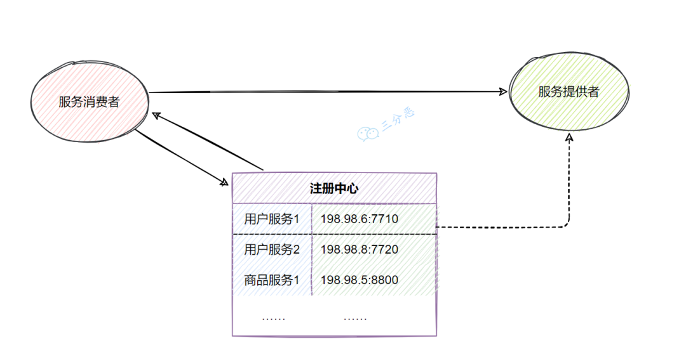
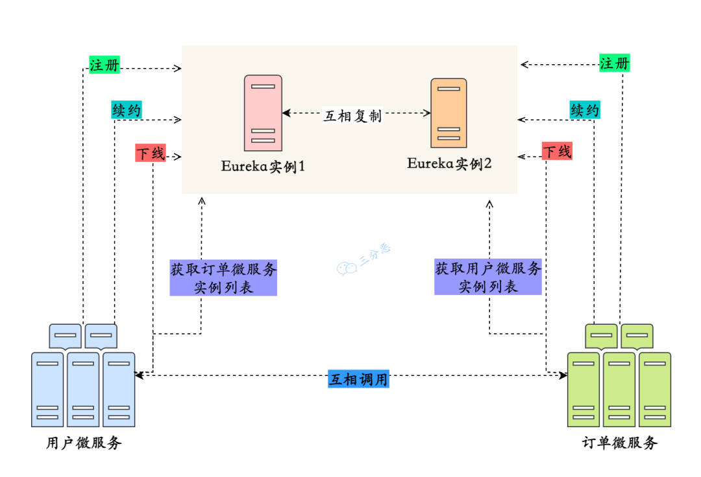
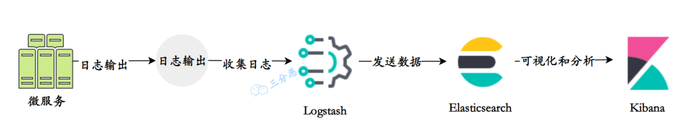

# 微服务

微服务（Microservices）是一种软件架构风格，将一个大型应用程序划分为一组小型、自治且松耦合的服务。每个微服务负责执行特定的业务功能，并通过轻量级通信机制（如 HTTP）相互协作。每个微服务可以独立开发、部署和扩展，使得应用程序更加灵活、可伸缩和可维护。

在微服务的架构演进中，一般可能会存在这样的演进方向：单体式-->服务化-->微服务。

- 单体服务（Monolithic Service）是一种传统的软件架构方式，将整个应用程序作为一个单一的、紧耦合的单元进行开发和部署。单体服务通常由多个模块组成，这些模块共享同一个数据库和代码库。然而，随着应用程序规模的增长，单体服务可能变得庞大且难以维护，且部署和扩展困难。
- 后来，单体服务过大，维护困难，渐渐演变到了分布式的 SOA（Service-Oriented Architecture，面向服务的架构），即一种软件架构设计原则，强调将应用程序拆分为相互独立的服务，通过标准化的接口进行通信。SOA 关注于服务的重用性和组合性，但并没有具体规定服务的大小。
- 微服务是在 SOA 的基础上进一步发展而来，是一种特定规模下的服务拆分和部署方式。微服务架构强调将应用程序拆分为小型、自治且松耦合的服务，每个服务都专注于特定的业务功能。这种架构使得应用程序更加灵活、可伸缩和可维护。

微服务与单体服务的区别在于规模和部署方式。微服务将应用程序拆分为更小的、自治的服务单元，每个服务都有自己的数据库和代码库，可以独立开发、测试、部署和扩展，带来了更大的灵活性、可维护性、可扩展性和容错性。

微服务架构不是万金油，尽它有很多优点，但是对于是否采用微服务架构，是否将原来的单体服务进行拆分，还是要考虑到服务拆分后可能带来的一些挑战和问题，例如系统复杂性增加、服务间通信开销、数据一致性和事务管理、分布式系统的复杂性等等。

目前最主流的微服务开源解决方案有三种：

- Dubbo 是一个高性能、轻量级的 Java 微服务框架，使用基于 RPC（Remote Procedure Call）的通信模型，更多地被认为是一个高性能的 RPC（远程过程调用）框架，一些服务治理功能依赖于第三方组件实现，比如使用 ZooKeeper、Apollo 等等。
- Spring Cloud Netflix 是 Spring Cloud 的一个子项目，结合了 Netflix 开源的多个组件，，如 Eureka（服务注册与发现）、Ribbon（客户端负载均衡）、Hystrix（断路器）、Zuul（API 网关）等。它们都是高度可扩展的、经过大规模实践验证的微服务组件。
- Spring Cloud Alibaba 是 Spring Cloud 的另一个子项目，与阿里巴巴的分布式应用开发框架相关。它提供了一整套与 Alibaba 生态系统集成的解决方案。包括 Nacos（服务注册与发现、配置管理）、Sentinel（流量控制、熔断降级）、RocketMQ（消息队列）等组件，以及与 Alibaba Cloud（阿里云）的集成。它为构建基于 Spring Cloud 的微服务架构提供了丰富的选项。

> 在面试中，微服务一般主要讨论的是 Spring Cloud Netflix，其次是 Spring Cloud Alibaba，Dubbo 更多的是作为一个 RPC 框架来问。

## 微服务组件

1. 注册中心：用于服务的注册与发现，管理微服务的地址信息。常见的实现包括：
   - Spring Cloud Netflix：Eureka、Consul
   - Spring Cloud Alibaba：Nacos
2. 配置中心：用于集中管理微服务的配置信息，可以动态修改配置而不需要重启服务。常见的实现包括：
   - Spring Cloud Netflix：Spring Cloud Config
   - Spring Cloud Alibaba：Nacos Config
3. 远程调用：用于在不同的微服务之间进行通信和协作。常见的实现保包括：
   - RESTful API：如 RestTemplate、Feign
   - RPC（远程过程调用）：如 Dubbo、gRPC
4. API 网关：作为微服务架构的入口，统一暴露服务，并提供路由、负载均衡、安全认证等功能。常见的实现包括：
   - Spring Cloud Netflix：Zuul、Gateway
   - Spring Cloud Alibaba：Gateway、Apisix 等
5. 分布式事务：保证跨多个微服务的一致性和原子性操作。常见的实现包括：Spring Cloud Alibaba：Seata
6. 熔断器：用于防止微服务之间的故障扩散，提高系统的容错能力。常见的实现包括：
   - Spring Cloud Netflix：Hystrix
   - Spring Cloud Alibaba：Sentinel、Resilience4j
7. 限流和降级：用于防止微服务过载，对请求进行限制和降级处理。常见的实现包括：
   - Spring Cloud Netflix：Hystrix
   - Spring Cloud Alibaba：Sentinel
8. 分布式追踪和监控：用于跟踪和监控微服务的请求流程和性能指标。常见的实现包括：
   - Spring Cloud Netflix：Spring Cloud Sleuth + Zipkin
   - Spring Cloud Alibaba：SkyWalking、Sentinel Dashboard

## 注册中心

注册中心是用来管理和维护分布式系统中各个服务的地址和元数据的组件。它主要用于实现`服务发现`和`服务注册`功能。

SpringCloud 可以与多种注册中心进行集成，常见的注册中心包括：Eureka、ZooKeeper、Nacos等等。

Eureka 的实现原理：

1. 服务注册与发现: 当一个服务实例启动时，它会向 Eureka Server 发送注册请求，将自己的信息注册到注册中心。Eureka Server 会将这些信息保存在内存中，并提供 REST 接口供其他服务查询。服务消费者可以通过查询服务实例列表来获取可用的服务提供者实例，从而实现服务的发现。
2. 服务健康检查: Eureka 通过心跳机制来检测服务实例的健康状态。服务实例会定期向 Eureka Server 发送心跳，也就是续约，以表明自己的存活状态。如果 Eureka Server 在一定时间内没有收到某个服务实例的心跳，则会将其标记为不可用，并从服务列表中移除，下线实例。
3. 服务负载均衡: Eureka 客户端在调用其他服务时，会从本地缓存中获取服务的注册信息。如果缓存中没有对应的信息，则会向 Eureka Server 发送查询请求。Eureka Server 会返回一个可用的服务实例列表给客户端，客户端可以使用负载均衡算法选择其中一个进行调用。

Eureka Server 保证高可用，主要通过这三个方面来实现：

1. 多实例部署: 通过将多个 Eureka Server 实例部署在不同的节点上，可以实现高可用性。当其中一个实例发生故障时，其他实例仍然可以提供服务，并保持注册信息的一致性。
2. 服务注册信息的复制: 当一个服务实例向 Eureka Server 注册时，每个 Eureka Server 实例都会复制其他实例的注册信息，以保持数据的一致性。当某个 Eureka Server 实例发生故障时，其他实例可以接管其工作，保证整个系统的正常运行。
3. 自我保护机制: Eureka 还具有自我保护机制。当 Eureka Server 节点在一定时间内没有接收到心跳时，它会进入自我保护模式。在自我保护模式下，Eureka Server 不再剔除注册表中的服务实例，以保护现有的注册信息。这样可以防止由于网络抖动或其他原因导致的误剔除，进一步提高系统的稳定性。

## 配置中心

微服务架构中的每个服务通常都需要一些配置信息，例如数据库连接地址、服务端口、日志级别等。这些配置可能因为不同环境、不同部署实例或者动态运行时需要进行调整和管理。

微服务的实例一般非常多，如果每个实例都需要一个个地去做这些配置，那么运维成本将会非常大，这时候就需要一个集中化的配置中心，去管理这些配置。

SpringCloud 也支持对多种配置中心的集成。常见的配置中心选型包括：Spring Cloud Config、Nacos、ZooKeeper等

关于配置中心的原理，说白了就是一句话：配置信息的 CRUD。

以Naocs举例，具体的实现大概可以分成这么几个部分：

1. 配置信息存储：Nacos 默认使用内嵌数据库 Derby 来存储配置信息，还可以采用 MySQL 等关系型数据库。
2. 注册配置信息：服务启动时，Nacos Client 会向 Nacos Server 注册自己的配置信息，这个注册过程就是把配置信息写入存储，并生成版本号。
3. 获取配置信息：服务运行期间，Nacos Client 通过 API 从 Nacos Server 获取配置信息。Server 根据键查找对应的配置信息，并返回给 Client。
4. 监听配置变化：Nacos Client 可以通过注册监听器的方式，实现对配置信息的监听。当配置信息发生变化时，Nacos Server 会通知已注册的监听器，并触发相应的回调方法。
5. 此外，客户端和服务端的交互一般分为两种：`推（Push）`和`拉（Pull）`，Nacos 在`Pull`的基础上，采用了**长轮询**来进行配置的动态刷新。即客户端定时向服务端发起请求，检查配置信息是否发生变更。如果没有变更，服务端会"hold"住这个请求，即暂时不返回结果，直到配置发生变化或达到一定的超时时间。

## 远程调用

RPC（Remote Procedure Call）是一种远程过程调用协议，用于实现分布式系统中不同节点之间的通信。它基于方法调用模型，允许客户端调用远程服务的方法，并等待结果返回。像 gRPC、Dubbo、Thrift 等都是 RPC 框架，它们提供了 IDL（接口定义语言）来定义服务接口，以及序列化协议来进行数据传输。

## 负载均衡

1. **轮询算法（Round Robin）**：轮询算法是最简单的负载均衡算法之一。它按照顺序将请求依次分配给每个后端服务器，循环往复。当请求到达时，负载均衡器按照事先定义的顺序选择下一个服务器。轮询算法适用于后端服务器具有相同的处理能力和性能的场景。
2. **加权轮询算法（Weighted Round Robin）**：加权轮询算法在轮询算法的基础上增加了权重的概念。每个后端服务器都被赋予一个权重值，权重值越高，被选中的概率就越大。这样可以根据服务器的处理能力和性能调整请求的分配比例，使得性能较高的服务器能够处理更多的请求。
3. **加权随机算法（Weighted Random）**：每个后端服务器被赋予一个权重值，权重值越高，被选中的概率就越大。这样可以根据服务器的处理能力和性能调整请求的分配比例。
4. **最少连接算法（Least Connection）**：最少连接算法会根据后端服务器当前的连接数来决定请求的分配。负载均衡器会选择当前连接数最少的服务器进行请求分配，以保证后端服务器的负载均衡。这种算法适用于后端服务器的处理能力不同或者请求的处理时间不同的场景。
5. **哈希算法（Hash）**：哈希算法会根据请求的某个特定属性（如客户端 IP 地址、请求 URL 等）计算哈希值，然后根据哈希值选择相应的后端服务器。

## 容灾

**服务雪崩**：在微服务中，假如一个或者多个服务出现故障，如果这时候，依赖的服务还在不断发起请求，或者重试，那么这些请求的压力会不断在下游堆积，导致下游服务的负载急剧增加。不断累计之下，可能会导致故障的进一步加剧，可能会导致级联式的失败，甚至导致整个系统崩溃，这就叫服务雪崩。

为了防止服务雪崩，可以采用这些措施：

1. 服务高可用部署：确保各个服务都具备高可用性，通过冗余部署、故障转移等方式来减少单点故障的影响。
2. 限流和熔断：对服务之间的请求进行限流和熔断，以防止过多的请求涌入导致后端服务不可用。
3. 缓存和降级：合理使用缓存来减轻后端服务的负载压力，并在必要时进行服务降级，保证核心功能的可用性

------

**服务熔断**是微服务架构中的容错机制，用于保护系统免受服务故障或异常的影响。当某个服务出现故障或异常时，服务熔断可以快速隔离该服务，确保系统稳定可用。

它通过监控服务的调用情况，当错误率或响应时间超过阈值时，触发熔断机制，后续请求将返回默认值或错误信息，避免资源浪费和系统崩溃。服务熔断还支持自动恢复，重新尝试对故障服务的请求，确保服务恢复正常后继续使用

------

**服务降级**是也是一种微服务架构中的容错机制，用于在系统资源紧张或服务故障时保证核心功能的可用性。当系统出现异常情况时，服务降级会主动屏蔽一些非核心或可选的功能，而只提供最基本的功能，以确保系统的稳定运行。

通过减少对资源的依赖，服务降级可以保证系统的可用性和性能。可以根据业务需求和系统状况来制定策略，例如替换耗时操作、返回默认响应、返回静态错误页面等

-----

其他容灾方法包括：

1. 请求缓存（Request Caching）：Hystrix 可以缓存对同一请求的响应结果，当下次请求相同的数据时，直接从缓存中获取，避免重复的网络请求，提高系统的性能和响应速度。
2. 请求合并（Request Collapsing）：Hystrix 可以将多个并发的请求合并为一个批量请求，减少网络开销和资源占用。这对于一些高并发的场景可以有效地减少请求次数，提高系统的性能。
3. 实时监控和度量（Real-time Monitoring and Metrics）：Hystrix 提供了实时监控和度量功能，可以对服务的执行情况进行监控和统计，包括错误率、响应时间、并发量等指标。通过监控数据，可以及时发现和解决服务故障或性能问题。
4. 线程池隔离（Thread Pool Isolation）：Hystrix 将每个依赖服务的请求都放在独立的线程池中执行，避免因某个服务的故障导致整个系统的线程资源耗尽。通过线程池隔离，可以提高系统的稳定性和可用性

在具体的限流算法方面，**滑动窗口限流算法**是一种基于时间窗口的限流算法。它将一段时间划分为多个时间窗口，并在每个时间窗口内统计请求的数量。通过动态地调整时间窗口的大小和滑动步长，可以更精确地控制请求的通过速率。

## 服务网关

API 网关（API Gateway）是一种中间层服务器，用于集中管理、保护和路由对后端服务的访问。它充当了客户端与后端服务之间的入口点，提供了一组统一的接口来管理和控制 API 的访问。

主要功能包括：路由转发、负载均衡、安全认证与授权、缓存、监控与日志、数据转换与协议转换、API 版本管理等等。

Spring Cloud Gateway 是 Spring Cloud 官方推荐的 API 网关，取代了 Netflix Zuul。它基于非阻塞的 WebFlux 框架，充分利用了响应式编程的优势，并提供了路由、过滤、断路器、限流等特性。Spring Cloud Gateway 还支持与 Spring Cloud 的其他组件集成，如服务发现、负载均衡等。

在 Spring Cloud Gateway 里，有三个关键组件：

- **Route（路由）**：路由是 Spring Cloud Gateway 的基本构建块，它定义了请求的匹配规则和转发目标。通过配置路由，可以将请求映射到后端的服务实例或 URL 上。路由规则可以根据请求的路径、方法、请求头等条件进行匹配，并指定转发的目标 URI。
- **Predicate（断言）**：断言用于匹配请求的条件，如果请求满足断言的条件，则会应用所配置的过滤器。Spring Cloud Gateway 提供了多种内置的断言，如 Path（路径匹配）、Method（请求方法匹配）、Header（请求头匹配）等，同时也支持自定义断言。
- **Filter（过滤器）**：过滤器用于对请求进行处理和转换，可以修改请求、响应以及执行其他自定义逻辑。Spring Cloud Gateway 提供了多个内置的过滤器，如请求转发、请求重试、请求限流等。同时也支持自定义过滤器，可以根据需求编写自己的过滤器逻辑。

## 链路追踪

在微服务中，有的山下游可能有十几个服务，如果某一环出了问题，排查起来非常困难，所以，就需要进行链路追踪，可以可视化地追踪请求从一个微服务到另一个微服务的调用情况。除了排查问题，链路追踪黑还可以帮助优化性能，可视化依赖关系、服务监控和告警

Spring Cloud 提供了多种选择的微服务链路追踪方案，包括Zipkin、Jaeger、SkyWalking等等

## 日志

使用 ELK 进行微服务日志收集的组件：

- **Elasticsearch**：Elasticsearch 是一个分布式搜索和分析引擎，用于存储和索引大量的日志数据。它提供了快速的搜索和聚合功能，可以高效地处理大规模的日志数据。
- **Logstash**：Logstash 是一个用于收集、过滤和转发日志数据的工具。它可以从各种来源（如文件、网络、消息队列等）收集日志数据，并对数据进行处理和转换，然后将其发送到 Elasticsearch 进行存储和索引。
- **Kibana**：Kibana 是一个用于日志数据可视化和分析的工具。它提供了丰富的图表、仪表盘和搜索功能，可以帮助用户实时监控和分析日志数据，发现潜在的问题和趋势。

简单说，这三者里**Elasticsearch**提供数据存储和检索能力，**Logstash**负责将日志收集到 ES，**Kibana**负责日志数据的可视化分析。

