# CMMI基础

CMMI的全称是**Capability Maturity Model Integration**，即能力成熟度模型集成。

CMMI最初是由美国国防部创建，旨在评估软件承包商的质量和能力。随着时间的推移，CMMI的应用范围从软件工程扩展到其他行业，帮助组织建立、改进和衡量其能力，提高性能。CMMI模型包括多个视图，其中开发视图应用最为广泛。它为项目管理过程提供了标准化的方法，以提升软件质量。CMMI认证包括五个级别，每个级别代表不同的能力成熟度水平。

------

CMMI存在3个互补的部分，存在16个共同的核心过程域（Process Area, PA）

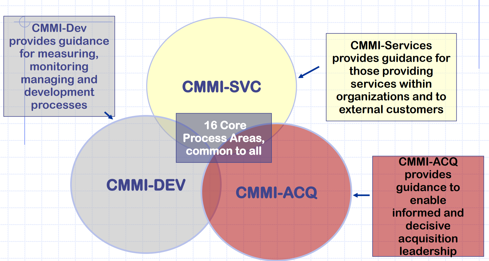

- CMMI for Development：涵盖适用于产品和服务的开发和维护活动。
- CMMI for Acquisition（ACQ）：专注于启动和管理满足客户需求的产品和服务的活动。
- CMMI for Services：涵盖建立，交付和管理服务所需的活动。

------

CMMI提供了两种表示：

- 连续式（Continuous）表述。注重单一过程域重点改进。
- 阶段式（Staged）表述。整体改善。

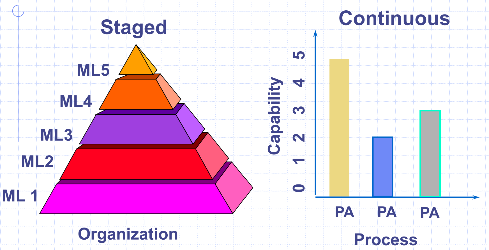

------

一个过程域是一个领域中相关实践的集群，包括如下部分：

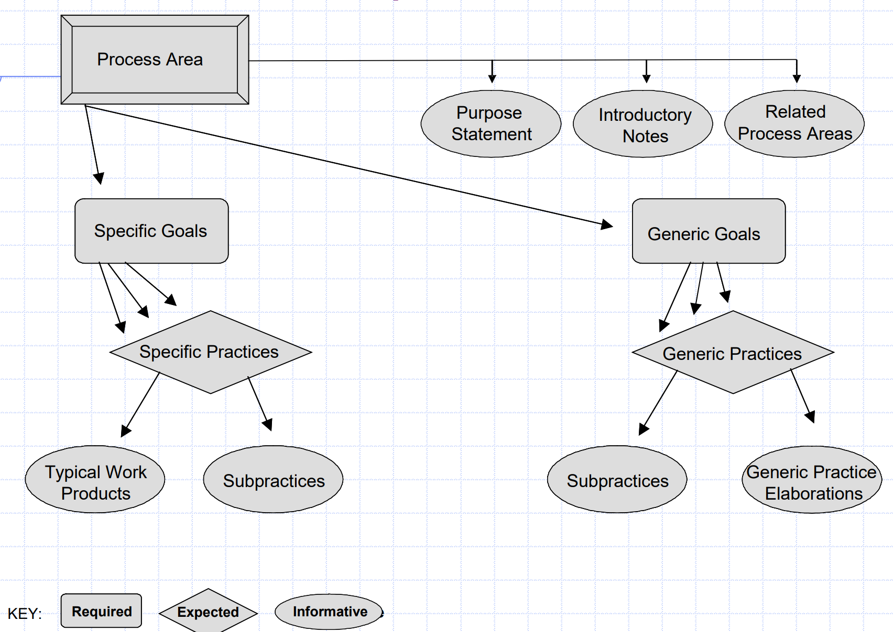

因果分析、解决、验证（Verification）、集成项目管理例子：

> 在软件质量管理过程中，V&V 指的是：验证和确认。验证（Verification）是指确认产品是否符合规格和需求，即是否正确**地**构建了产品。确认（Validation）是指确认产品是否符合最终用户的期望和需求，即是否构建了正确**的**产品。

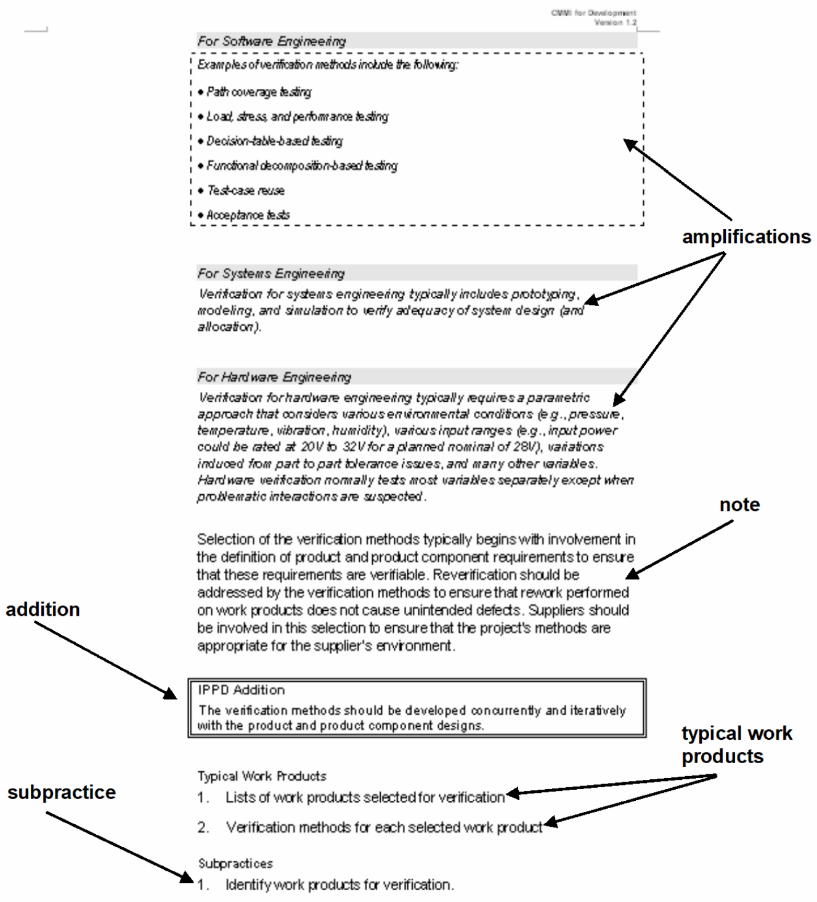

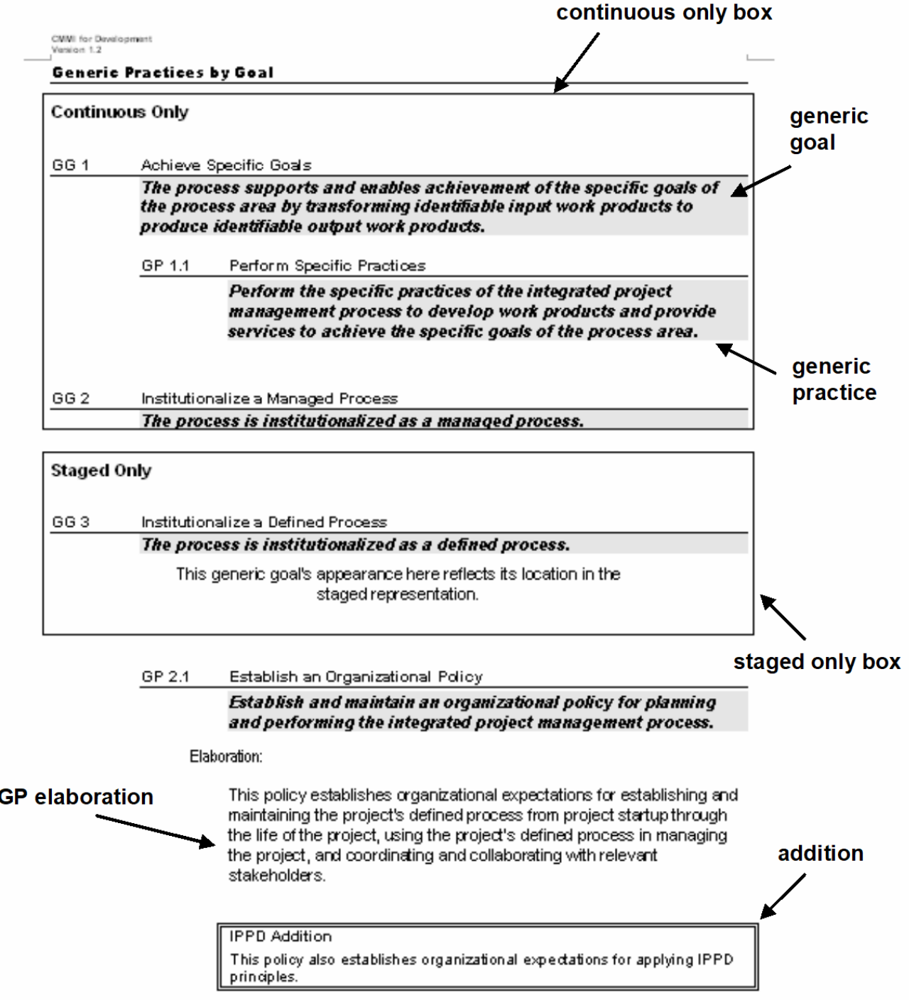

## Maturity Level

成熟度等级是一个定义明确的进化平台， 是成为成熟组织的路径。是阶段式（Staged）表述。

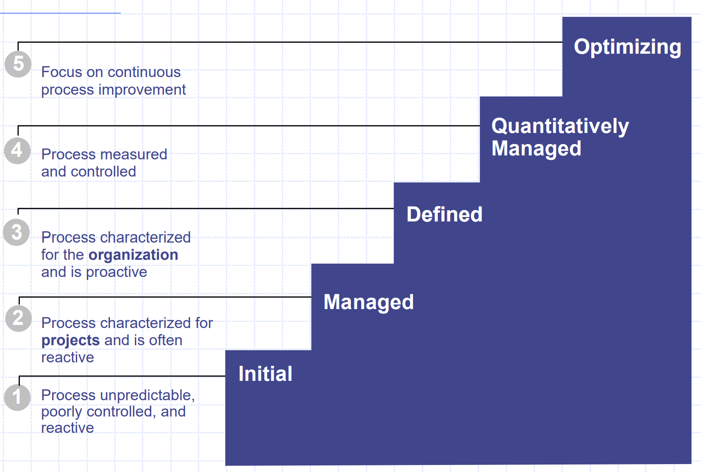

### Initial Level

- 软件过程是黑匣子，在该过程中，对项目过程的可见性有限。
- 由于活动的定义很少，因此很难确定项目的进度和活动状况。
- 问题导致危机情况和赶工。
- 成功取决于人们从事这项工作的能力。
- 其特征是没有合理的管理实践。

### Managed Level

- 利用以前成功项目的经验计划和管理新项目。
- 已经建立了组织政策，用于管理一个软件项目和实施这些政策的程序。
- 构建软件的过程是一系列黑匣子，在预定义的检查点（例如，里程碑）可以提供可见性。
- 管理层以受控的方式对问题发生反应。

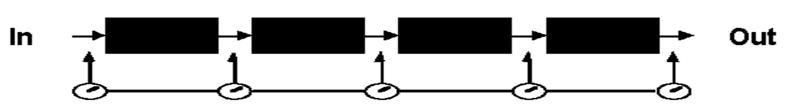

### Defined Level

- 构建用于开发和/或维护软件的标准过程或一组流程，然后在整个组织中使用。
- 在组织中创建一个负责软件流程活动的组，有时称为软件工程过程组（Software Engineering Process Group, SEPG）。
- 每个黑匣子（即任务）的内部结构可见。
- 管理层主动为可能出现的风险做准备。

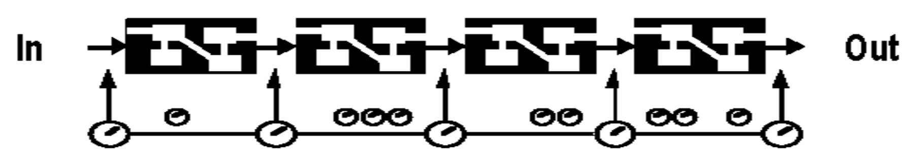

###  Quantitatively Managed Level

- 为软件流程和产品设定定量质量目标。
- 建立一个整个组织的软件流程数据库，以收集，分析和存储项目中的数据。
- 使用测量来建立定量基础，以评估软件流程和产品。
- 黑匣子中的软件过程现在被定量进行仪器和控制。

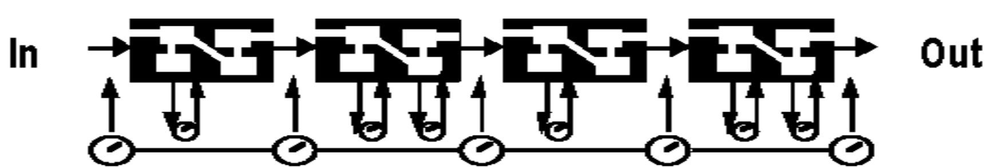

### Optimizing Level

- 可以识别弱点并积极应对。
- 拥有将缺陷预防能力的软件团队。
- 现在可以删除黑匣子，并可以引入新的和改进的黑匣子。
- 管理人员能够有效估计，然后跟踪变化的影响和有效性。

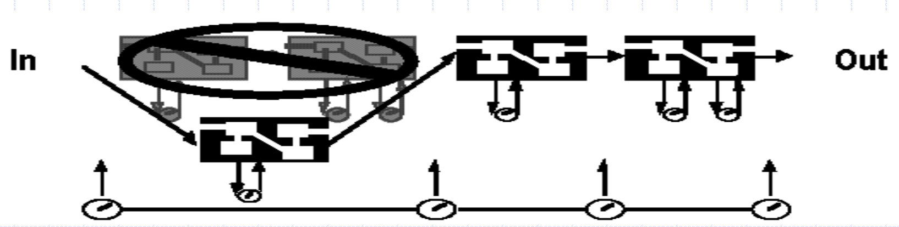

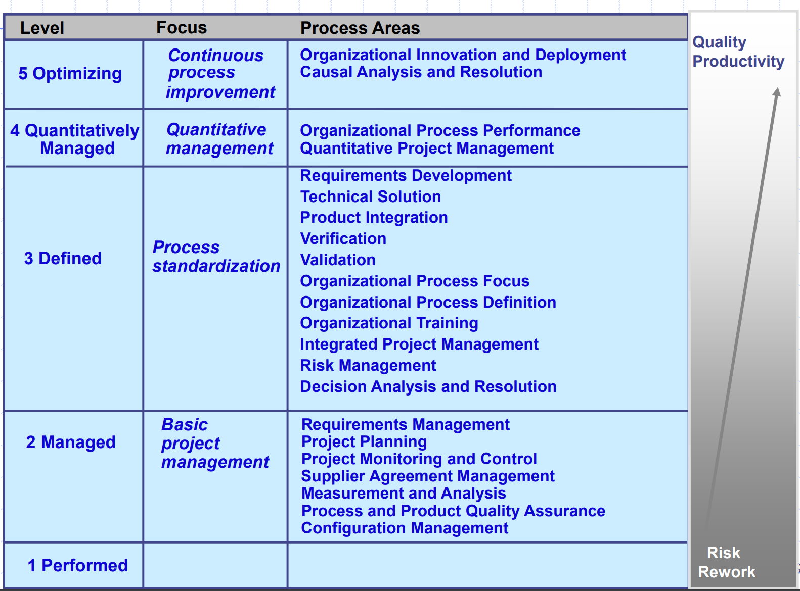

## Capability Level

Capability Level对应于CMMI的连续式（Continuous）表述。注重单一过程域重点改进，描述了某个过程域的能力。有六个级别。每个级别都是连续式过程改进的基础中的一层。

- 5 Optimizing 
- 4 Quantitatively Managed 
- 3 Defined 
- 2 Managed 
- 1 Performed 
- 0 Incomplete

例子：

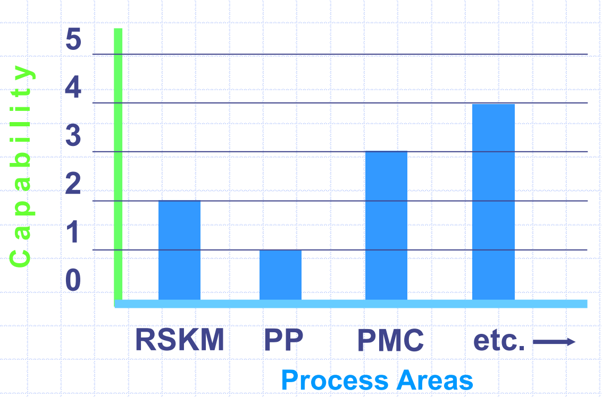

>- http://www.sei.cmu.edu/cmmi/ (main CMMI site) 
>-  http://seir.sei.cmu.edu/seir/ (Software Engineering Information Repository) 
>-  http://dtic.mil/ndia (annual CMMI Technology Conferences) 
>-  http://seir.sei.cmu.edu/pars (publicly released SCAMPI appraisal summaries)
