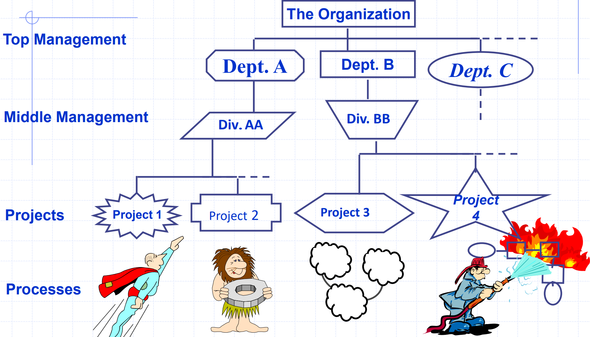
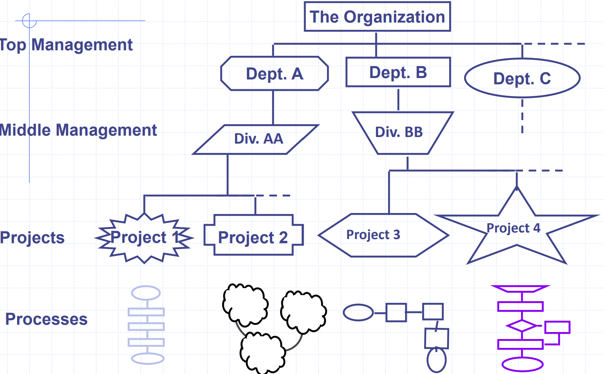
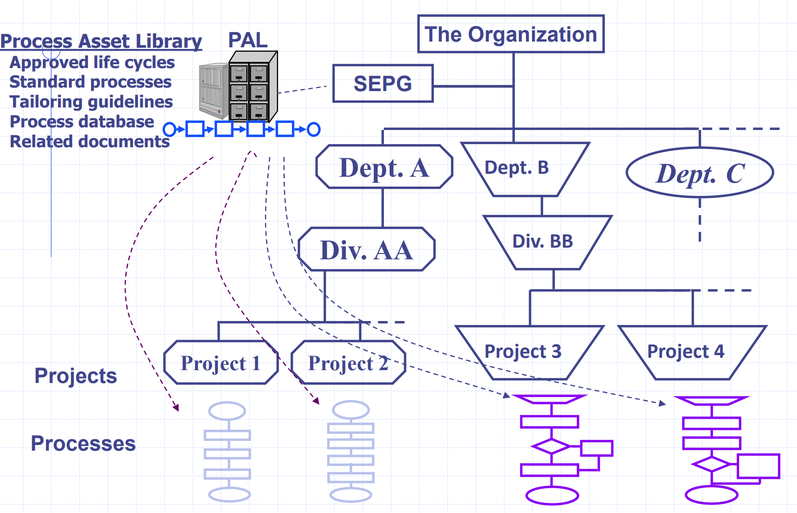
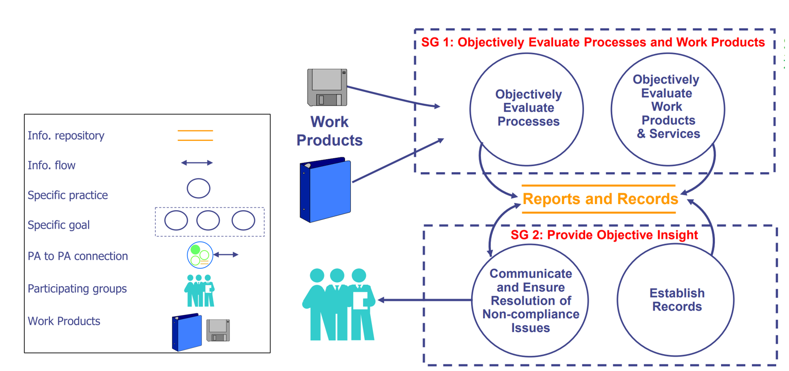
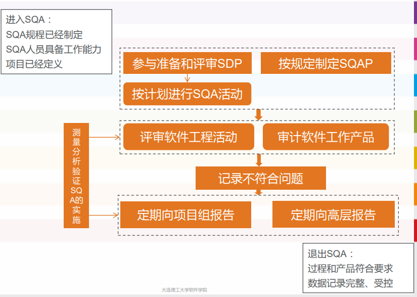
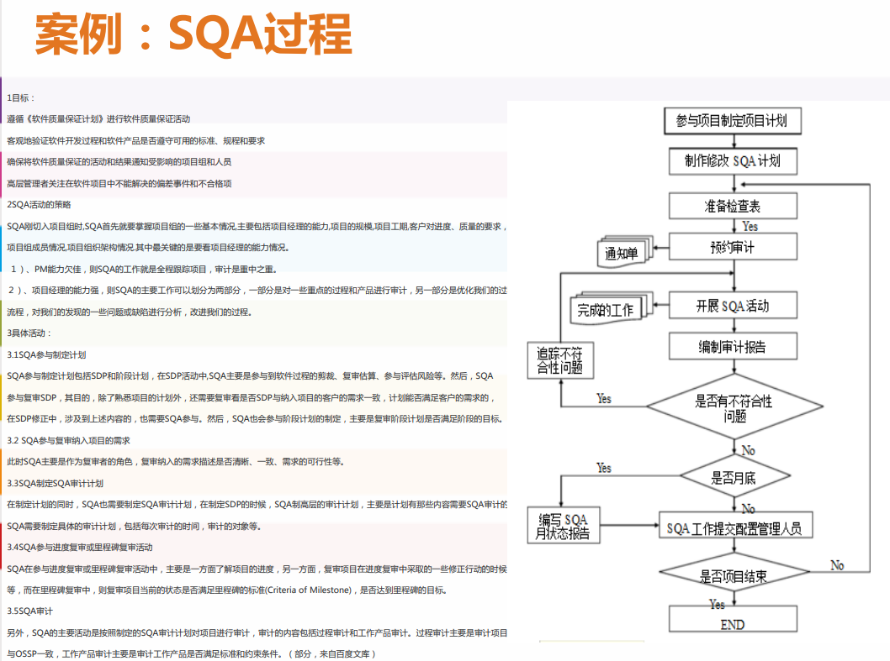

# PPQA与SQA

## PPQA

过程与质量保证（Process and Product Quality Assurance, PPQA）处于CMMI成熟度模型第二级。

成熟度模型第一级的例子，只有少数过程是组织完善的：

成熟度模型第二级的例子，多数过程组织完善，但是不统一：

更高成熟度的例子，过程基于组织的PAL（Process Asset LIBRARY）：

PPQA的目的：

- 客观评价 过程和工作产品。
- 提供客 观的深入洞察。

PPQA的活动：

- 根据适用的过程描述、标准和程序，客观评价已实施的过程和工 作产品。
- 识别和记录不符合问题。
- 向项目人员和经理提供质量保证活动结果的反馈。
- 确保解决不符合问题。

## SQA

软件质量保证 （ Software Quality Assurance, SQA）是恰当保证为“项目生存周期中的软件 产品和过程符合规定的需求和计划”提供足够保证的过程。

SQA的工作内容 

- 为项目准备SQA计划：与项目开发计划一致，得到评 审确认。 
- 参与开发项目的过程定义和描述：评审项目制定的开发 过程定义，确保与组织企业的政策和标准相一致 
- 评审项目实施中的各项软件工程活动：核实、记录、跟 踪不符合项 
- 审计预定的软件工作产品：核实、记录、跟踪不符合项 
- 处理不符合问题：按照SQA规程处理不符合项 
- 形成报告：书写SQA报告，发布给相关人员和高层

## 评审

评审是为了提高软件产品的质量、降低软件开发的成本， 从而逐步提高生产率，在管理和技术的合适层次上进行 检查。

- **走查**：开发组内部进行的，采用讲解、讨论和模拟运行的方式进行的 查找错误的活动。限时：避免跑题。 参加人员:经验丰富的开发人员、和本模块相关的开发人员、本 项目组的新人。由本模块的开发者进行讲解、回答问题并记录，不要现场修改。检查要点：逻辑错误、代码标准/规范/风格。
- **审查**：开发组内部进行的，采用讲解、提问并使用Checklist方式进行 的查找错误的活动。一般有正式的计划、流程和结果报告。 以会议的形式，制定会议目标、流程和规则，结束后要编写报告。参加人员：经验丰富的开发人员、和本模块相关的开发人员、 本项目组的新人。由另外一名开发者进行讲解、其他开发者主要按照Checklist进行提问并填表、本模块开发者回答问题并记录，不要现场修改。检查要点：设计需求
- **同行评审**：开发组、测试组和相关人员(QA、产品经理等)联合进行的，采用 讲解、提问并使用Checklist方式进行的查找错误的活动。一般有 正式的计划、流程和结果报告。以会议的形式，制定会议目标、流程和规则，结束后要编写报告。 相关资料要在会议前下发并阅读。参加人员：经验丰富的开发人员、和本模块相关的开发人员、测 试组和相关人员。由另外一名 开发者进行 讲解 、其他 开发者主要 按照检查表 Checklist进行提问并填表、本模块开发者回答问题并记录。检查要点：需求与设计、文档的完整性和一致性。

评审类别：

- 技术评审主要是从技术上检查项目，它评审的一般是比较具体的 问题，涉及业务的规范、软件工程技术、产品的实现技术环节、 数据库技术、图形图象技术、接口技术等。评审的目的是尽早找 出技术的问题和缺陷，保证产品的技术质量。 
- 管理评审主要是管理者在项目的开始结束等处检查项目的约束和 工作量/成本等问题，并定期的评审项目的风险管理、配置管理、 跟踪与监控等活动，这些评审可以根据项目的具体情况决定评审 的频度，定期进行评审，也可以在管理者认为必要的时候或事件 驱动下进行评审。 
- SQA评审和审计是SQA验证过程的符合性和验证产品与相关规程 或标准的符合性，只有按照规范的过程才能保证技术的有效实施， 并且保证质量。

评审流程：

1. 评审策划。评审发起人确定在何种情况或前提下可以开始评审，在评审结束 时希望完成哪些工作，确定评审的时间和类型，以及通过本次评 审希望达到的目的经验 
2. 评审准备。首先确定评审的参加人员，然后分配好角色，指定负责人、记录 员等，并准备好相关的材料。 
3. 执行评审。所有评审人员都完成评审准备后，可以举行评审会把握重点。
4. 评审问题记录和管理。在评审过程中，记录发现的问题和做出的决定，跟踪问题解决情 况，确认问题已经得到解决
