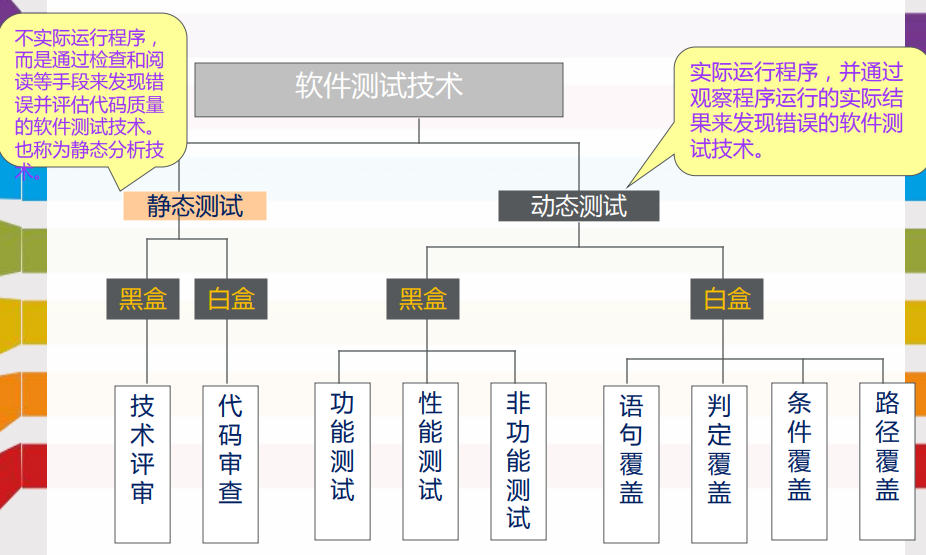
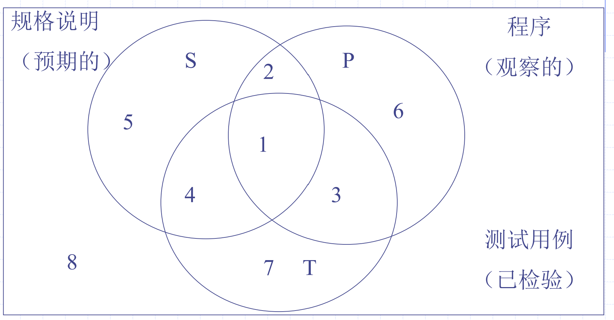
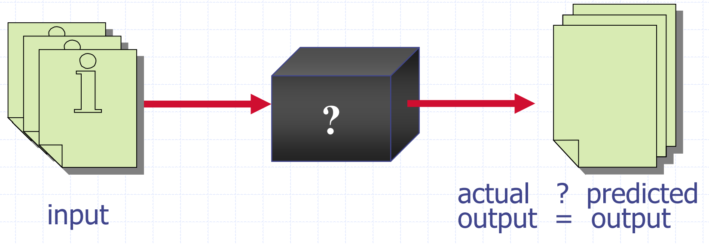
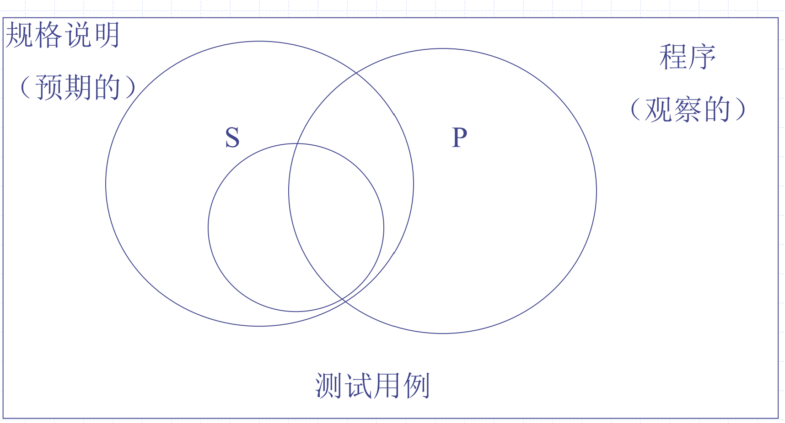
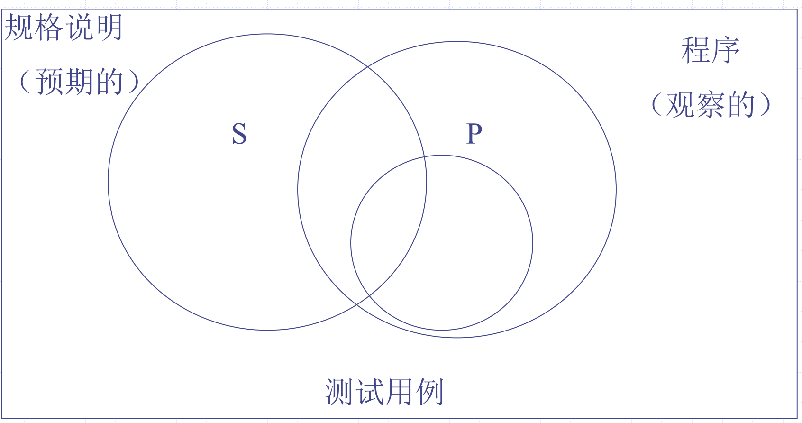
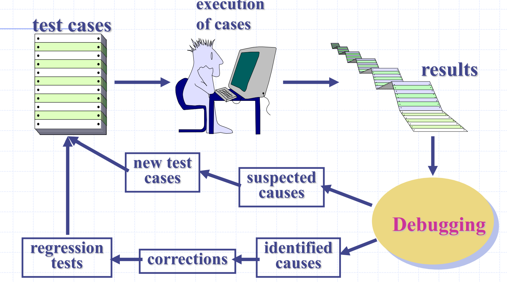
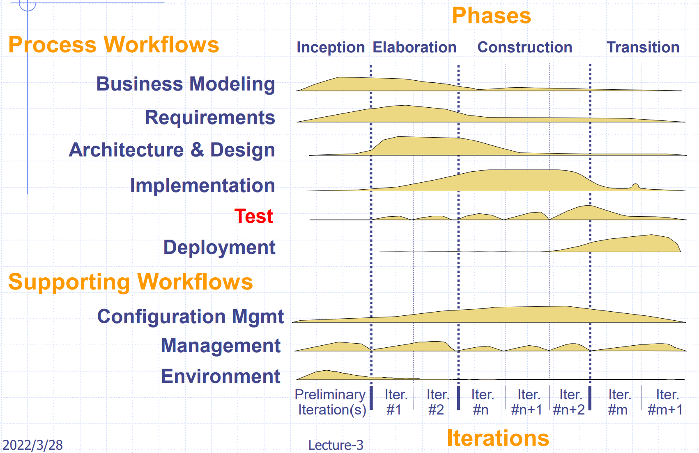
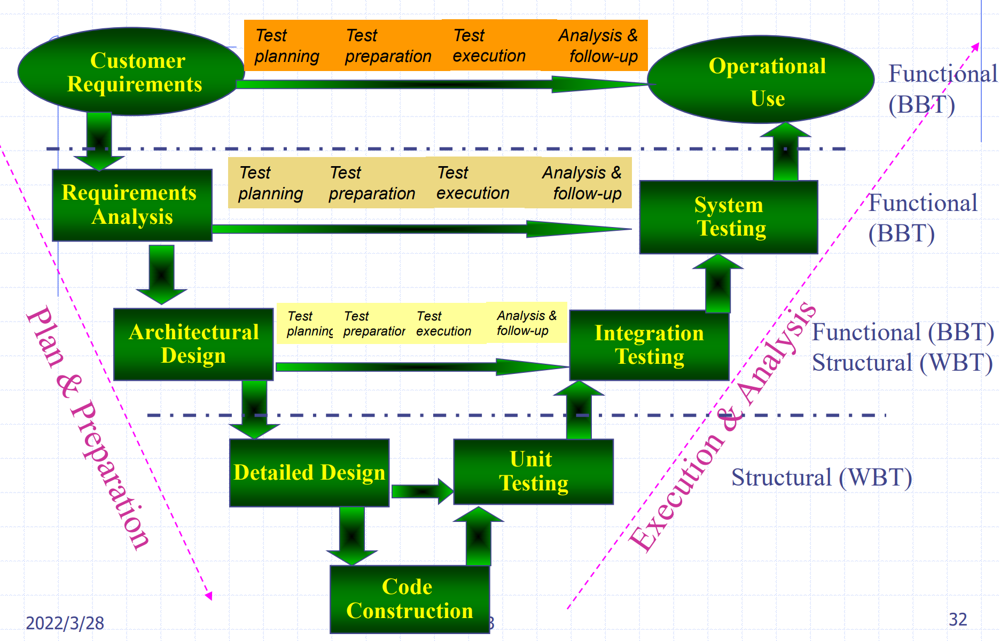
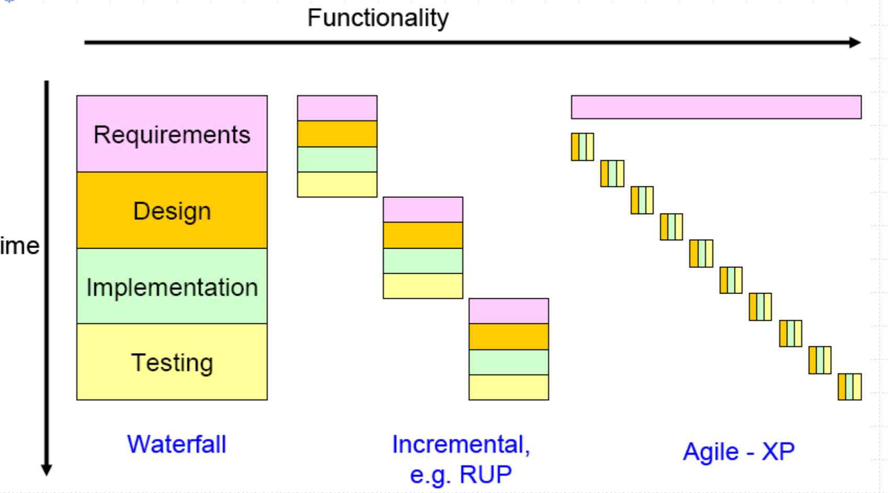
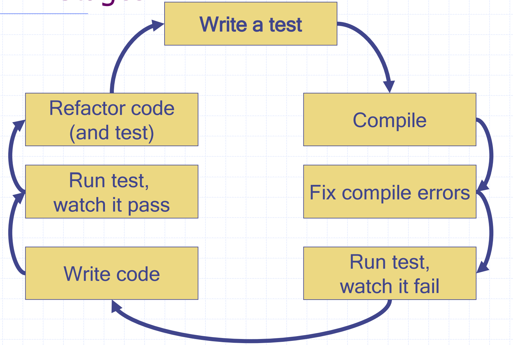

# 软件测试基础

软件问题的原因是软件缺陷的积累和放大效应，失之毫厘，谬以千里，成本急剧增加，质量大幅下降，开发过程的混乱，效率很低。

1983年IEEE提出的软件工程术语中的定义是: 使用人工或自动的手段来运行或测定某个软件系统的过程，其目的在于检验它是否满足规定的需求或弄清预期结果与实际结果之间的差别。

这个定义明确指出: 软件测试的目的是检验软件系统是否满足需求。测试再也不是一个一次性的而且只是开发后期的活动，而是与整个开发流程融合成一体。

软件测试是软件质量保证（software quality assurance, SQA）中最重要和最经常使用的活动。在大多数开发环境下，测试已成为检测和修复软件缺陷的主要手段。

- 良好的测试用例拥有发现尚未发现的错误的很高的可能性。
- 成功的测试是发现了尚未发现错误的测试。

软件测试原则：

- 所有测试都应追溯到客户需求。
- 测试应在测试开始之前很长时间进行。
- 帕累托原理（所有错误的80％都可能在代码的20％中找到）适用于软件测试。
- 测试应从小的开始，然后发展到大。
- 详尽的测试是不可能的。
- 为了最有效，测试应由独立的第三方进行

## 测试用例与黑白盒

软件测试的本质是**确定一组要测试的项目的测试用例**。

测试用例是描述输入，操作或事件和预期响应的文档，以确定应用程序的功能是否正常工作。

测试用例应包含诸如测试案例标识符，测试案例名称，目标，测试条件/设置，输入数据要求，步骤和预期结果之类的详细信息。

功能测试或**黑盒测试**（知道产品的指定功能，仅根据其规范执行和演示正确的操作而不考虑其内部逻辑）

- 计划在没有计划设计或实施的无深知识的情况下进行。
- 基于程序接口的规范（即过程和功能标头）。
- 需要指定程序输入和预期的程序输出。

结构性测试或**白盒测试**（知道产品的内部工作，进行测试以检查所有独立逻辑路径的工作）

- 以了解了程序详细设计（program detailed design, PDL）为基础
- 测试程序逻辑的每个方面
- 需要以满足预期计划覆盖的方式构建所需的测试输入和预期输出

## 测试流程与活动

1. Test planning：设定测试目标，选择总体测试策略，计划资源和时间表。基于客户的质量观点和期望的设定目标。基于产品/环境特征的设定总体策略。
2. Test preparation：准备特定的测试用例和一般测试程序。
3. Test execution：执行测试用例和程序。
4. Test analysis：结果检查和分析。

软件测试在整体软件开发中的位置：

V 模型：

- 单元测试：单个组件的测试
- 集成测试：暴露由组件组合引起的问题
- 系统测试：交付前测试完整的系统
- 验收测试：用户测试以检查该系统满足要求。有时称为alpha测试

## 不同的软件开发方式

在不同软件开发方式中软件测试的位置：

测试驱动开发，即Test Driven Development（TDD）

